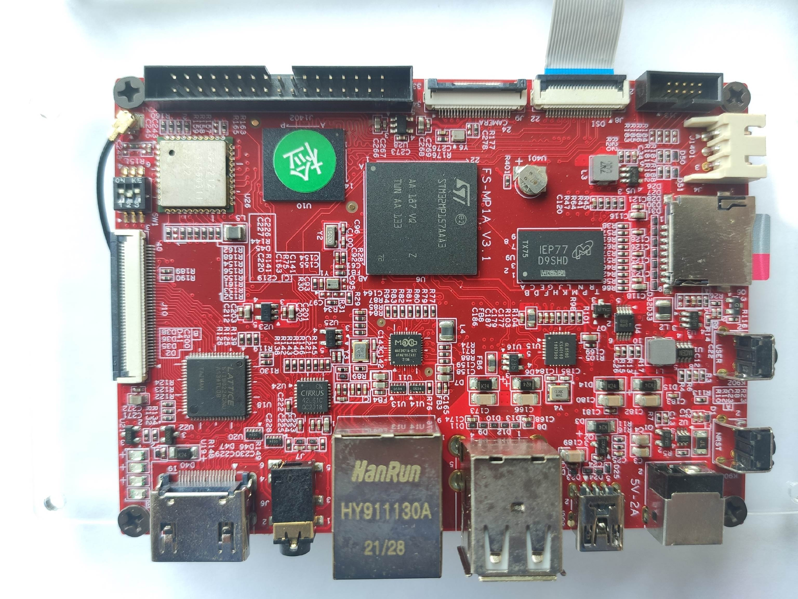
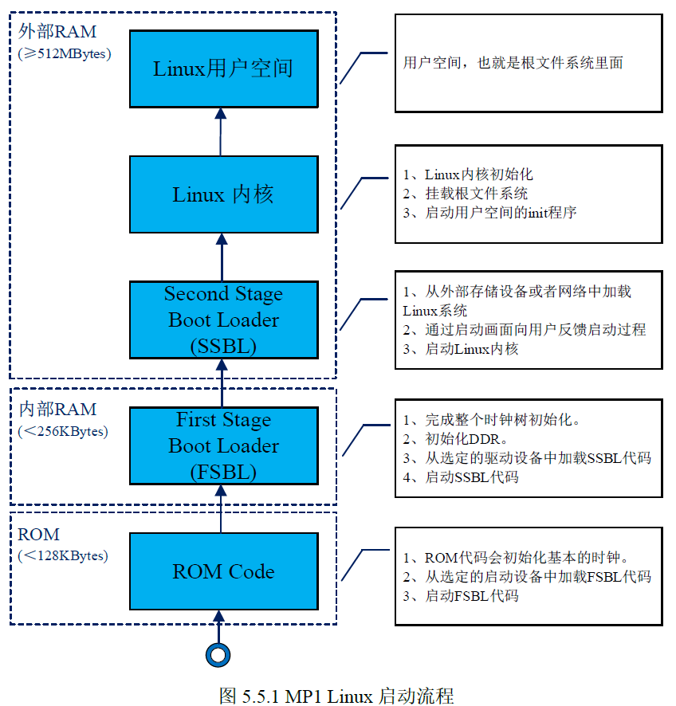

# 嵌入式 Linux 专栏·总导论：从一块板子，到一个完整的 Linux 世界

> **本篇定位**：这是整个专栏的开篇。后面每一篇博客——无论是移植 U-Boot、编译内核还是写驱动——都在回答同一个问题的某一环：**一块刚上电的开发板，是怎样一步步变成一个能跑应用、能点屏幕的 Linux 系统的？** 本篇先把这个问题的全貌讲清楚。
>
> **软硬件平台**：华清远见 FS-MP1A 开发板（ST STM32MP157AAA3）+ VMware 虚拟机（Ubuntu 20.04）+ ST 官方 SDK 交叉编译工具链。全套内容基于板卡实际操作，文中所有终端输出、报错、截图均为真实实验记录。

## 一、为什么要学嵌入式 Linux？

很多同学的单片机学习路径是这样的：51 或 STM32 裸机 → 定时器、串口、SPI 外设 → 也许碰过 FreeRTOS。这条路走到头，会遇到一道明显的天花板：

- 单片机程序是**独占整机**的：没有内存管理，没有进程，没有文件系统，驱动和应用搅在一个 main 里；
- 一旦产品需要**网络协议栈、图形界面、复杂业务逻辑、多人协作开发**，裸机和 RTOS 都会力不从心；
- 而这些能力，正是 **Linux** 作为操作系统提供的：进程调度、内存管理、统一的驱动框架、完整的网络与文件系统支持。

嵌入式 Linux 开发，就是**把 Linux 搬到资源有限的专用硬件上，并为自己的硬件写驱动、为自己的产品写应用**。它和单片机开发的根本区别在于：你不再是"对硬件直接编程"，而是**分层工作**——每一层有每一层的语言和规则。

STM32MP1 这颗芯片是绝佳的入门跳板：它出自 STM32 家族（STM32 的开发经验能延续），却又是一颗真正能跑 Linux 的 Cortex-A 级微处理器——**同一块板子，既能看到熟悉的单片机世界，又能走进完整的 Linux 世界**。

## 二、认识主角：FS-MP1A 开发板

  
> 图：FS-MP1A 开发板实物。正中为 STM32MP157AAA3 主处理器，周围依次是 WiFi/蓝牙模组、DDR 内存、HDMI 发送芯片、电源管理芯片、音频 codec；下方是千兆以太网口、USB Host、OTG、MicroSD 卡槽和 5V/2A 电源插座。

几个决定后续所有实验形态的关键事实：

| 项目 | 内容 | 对学习的影响 |
|---|---|---|
| 处理器 | STM32MP157AAA3：**双核 Cortex-A7 @650MHz + 单核 Cortex-M4 @209MHz**（异构多核） | A7 跑 Linux（本专栏全部内容）；M4 跑实时任务（本专栏不深入） |
| 架构 | Cortex-A7 基于 ARMv7-A | 交叉编译工具链要按它选（实验一） |
| 内存 | 外挂 DDR3，512MB | Linux 内核和根文件系统都要加载到这里运行 |
| 启动介质 | MicroSD 卡 / eMMC / NAND… | 烧写实验围绕 SD 卡展开 |
| 板卡来源 | 华清远见参考 **ST 官方 DK1 评估板**设计 | 移植时可以"抄"DK1 的代码——全系列最重要的捷径 |

## 三、一张地图：嵌入式 Linux 系统的启动链条

这是全专栏最重要的一张图。嵌入式 Linux 系统从上电到进入用户空间，程序是这样接力执行的：

  
> 图：STM32MP1 的 Linux 启动流程：①ROM Code（芯片内部 ROM，初始化基本时钟、从启动设备加载 FSBL）→ ②FSBL（运行在芯片内部 RAM，初始化时钟树和 DDR、加载 SSBL）→ ③SSBL（运行在外部 DDR，加载 Linux 内核并启动）→ ④Linux 内核（初始化、挂载根文件系统、启动 init 进程）→ 用户空间应用程序。

逐级拆解，并标出**每一级由谁负责**：

| 阶段 | 运行位置 | 干什么 | 谁的代码 |
|---|---|---|---|
| **ROM Code** | 芯片内部 ROM（128KB） | 上电第一段程序；初始化基本时钟，按拨码开关选定的设备把 FSBL 读进来 | 芯片内置，改不了 |
| **FSBL**（First Stage Boot Loader） | 芯片内部 SRAM（约 256KB） | 初始化完整时钟树、初始化 DDR——从这一步起，大内存才可用 | ST 提供（SPL 或 TF-A），需移植适配 |
| **SSBL**（Second Stage Boot Loader） | 外部 DDR | 就是 **U-Boot** 本体；提供命令行，从存储或网络加载内核并启动 | ST 补丁版源码，**专栏重点移植对象** |
| **Linux 内核** | 外部 DDR | 初始化各子系统、加载驱动、挂载根文件系统、启动 init | ST 补丁版源码，需移植 |
| **根文件系统** | 外部存储 | init 及全部用户空间程序（shell、网络配置、图形库……） | BusyBox 手搓或 Buildroot 构建 |
| **应用程序** | 根文件系统中 | 产品真正的业务逻辑，如图形界面 | 我们自己写 |

**这张图就是专栏的地图**：后面的每一章，都是在链条的某一环上干活——第 3 章移植链条第三环（U-Boot），第 5 章移植第四环（内核），第 6 章组装第五环（根文件系统），第 7~9 章钻进内核内部写驱动，第 10 章在链条顶端盖楼。看懂这张图，任何一个"板子起不来"的问题，你都能先问一句：**它死在哪一级？**——这是嵌入式 Linux 工程师最重要的思维方式。

## 四、专栏全景：十章内容与四条主线

按照这张地图，整个课程归入四条主线：

### 主线一：认识平台（第 1~2 章）

| 章 | 内容 |
|---|---|
| 第 1 章 FS-MP1A 开发板简介 | 板卡硬件资源、STM32MP157 芯片特性、软件资源 |
| 第 2 章 STM32MP1 启动详解 | 启动链条（上图）、ROM Code、启动模式与拨码开关、FSBL/SSBL 分工 |

这两章是"看地图"——不写代码，但第 2 章的启动链条会贯穿后面所有实验。实验中拨动启动开关（如拨码 101 选择 SD 卡启动）时，你拨的正是第 2 章讲的那个 BOOT 引脚。

### 主线二：系统移植——把系统的每一环装起来（第 3、5、6 章）

这是专栏的**重头戏**，也是顺序不可颠倒的三步：

| 章 | 移植对象 | 你将做什么 |
|---|---|---|
| 第 3 章 移植 U-Boot | 链条第三环 | 装 SDK 工具链 → 获取源码打 ST 补丁 → 以 DK1 为模板做配置和设备树 → 编译 basic 版 → SD 卡烧写、首次启动 → 按串口报错迭代修复驱动 → 移植 trusted 版 |
| 第 4 章 使用 U-Boot | （工具篇） | U-Boot 命令行：环境变量、tftp 网络下载、eMMC/SD 操作、启动内核——它是第 5、6 章的"手术刀" |
| 第 5 章 移植 Linux 内核 | 链条第四环 | 内核源码结构 → 编译配置 → 移植适配 → 搭 TFTP 服务器 → 网络加载并运行自己编的内核 |
| 第 6 章 构建根文件系统 | 链条第五环 | 先用 BusyBox 手搓一个最小根文件系统，理解其构成；再用 Buildroot 自动化构建完整系统 |

学完这条主线，你会亲手组装出链条上**每一环的镜像文件**——"这个系统是我在每一层都动过手的"，这是嵌入式 Linux 工程师和"只用现成系统"的开发者的本质区别。

### 主线三：驱动开发——钻进内核写代码（第 7、8、9 章）

系统跑起来之后，轮到让外设"听指挥"：

| 章 | 内容 |
|---|---|
| 第 7 章 字符设备驱动 | Linux 驱动模型入门：file_operations、设备号、模块加载卸载，写出第一个字符设备驱动 |
| 第 8 章 GPIO 端口 | 从 GPIO 寄存器手册读起，最终写出 LED 驱动——从"裸机点灯"到"内核点灯"的完整跨越 |
| 第 9 章 设备树 | 设备树语法、bindings 文档、OF 函数——驱动如何在代码不变的情况下适配不同硬件（第 3 章移植时你已经用过它，现在学它的语法和原理） |

### 主线四：应用开发——在系统上盖楼（第 10 章）

| 章 | 内容 |
|---|---|
| 第 10 章 GUI 应用程序开发 | Buildroot 中启用 Qt5 → 用新镜像启动系统 → 搭建 Qt 开发环境 → 开发图形界面应用并在板上运行 |

到这一步，链条全线贯通：**从 ROM Code 到屏幕上的 Qt 界面，每一层都出自你手。**

## 五、这个专栏怎么写、怎么读

**怎么写**——本专栏是**实验驱动**的：不是理论汇编，而是"指导 + 真实记录"合二为一。每篇实验包含：这步做什么、**为什么做**、真实终端输出、真实报错与踩坑分析。你会看到报错长什么样、怎么判断哪些报错无害、怎么按报错定位到具体层级——这些和成功路径同样有价值。

**怎么读**——三句建议：

1. **不要盲目复制命令**。每篇指导都在回答"为什么"，跳过原理直接抄命令，等于把最值钱的部分扔掉了；
2. **把报错当资源**。专栏特意保留了真实的失败案例（比如用宿主机 gcc 编译 ARM 代码的标志性报错），先看别人的错误，你的错误就会少一半；
3. **随时回到启动链条定位问题**。板子黑屏、复位、起不来时，第一反应应该是：串口输出停在了链条的哪一级？

## 六、学完这个专栏，你将收获什么？

**技能层面**：

- 熟练使用**交叉编译工具链**，理解 `sysroot`、`source` 激活这些天天打交道的概念；
- 能读懂 U-Boot/Linux 的**源码树结构**和英文官方文档（README、bindings、数据手册）；
- 掌握 **Bootloader / 内核 / 根文件系统**三大件的移植方法，理解 basic/trusted 等启动方案；
- 能读写**设备树**，理解"配置"与"硬件描述"如何驱动编译与运行；
- 掌握**字符设备驱动**开发框架，能从芯片手册出发写出 GPIO 类驱动；
- 会用 **BusyBox / Buildroot** 构建根文件系统，能在板上跑起 **Qt** 图形应用。

**思维层面**（更值钱的部分）：

- **分层思维**：拿到任何一块跑 Linux 的板子，你都知道它由哪些层组成、每层谁负责、坏了先查哪层；
- **阅读真实工程的能力**：几百万行的开源项目不再吓人——你已经实践过"官方源码 + 厂商补丁 + 自研适配"的标准工作流；
- **从芯片手册到可运行代码的完整路径**：这份经验可以平移到任何嵌入式 Linux 平台（全志、瑞芯微、NXP i.MX……流程是相通的）。

---

**结语**：嵌入式 Linux 的学习曲线确实陡——工具链、补丁、设备树、驱动框架，每个词第一天都陌生。但这条曲线的每一段都有明确的"为什么"，而这个专栏的任务，就是把每个"为什么"都摊开给你看。下一站，我们从启动链条的第三环开始：**移植 U-Boot**。

→ 下一篇：《实验导论：看懂 U-Boot，再谈移植》
