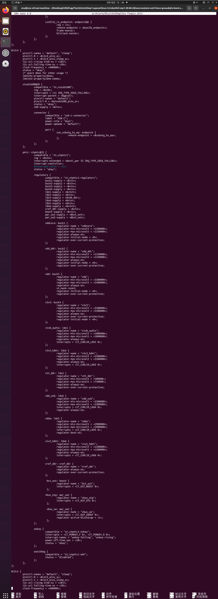
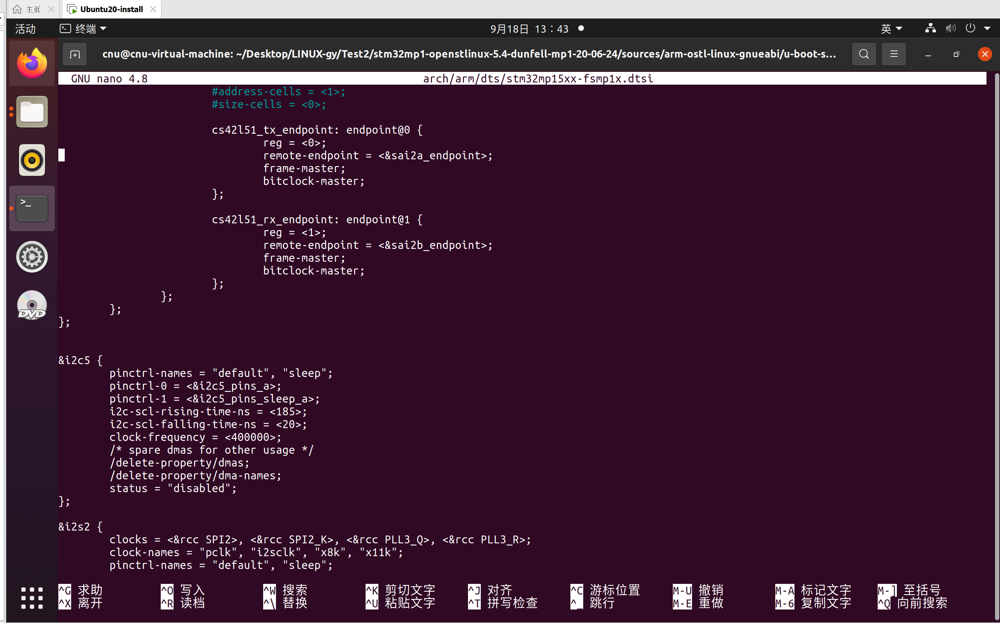
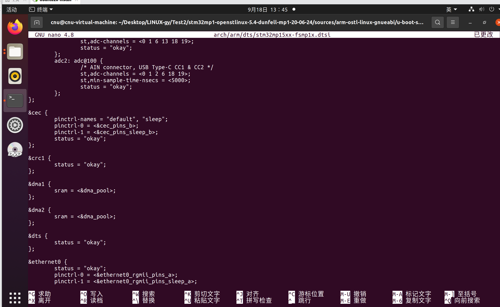
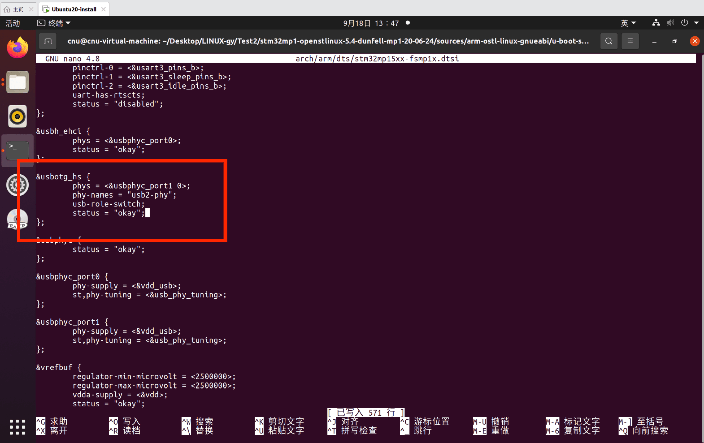
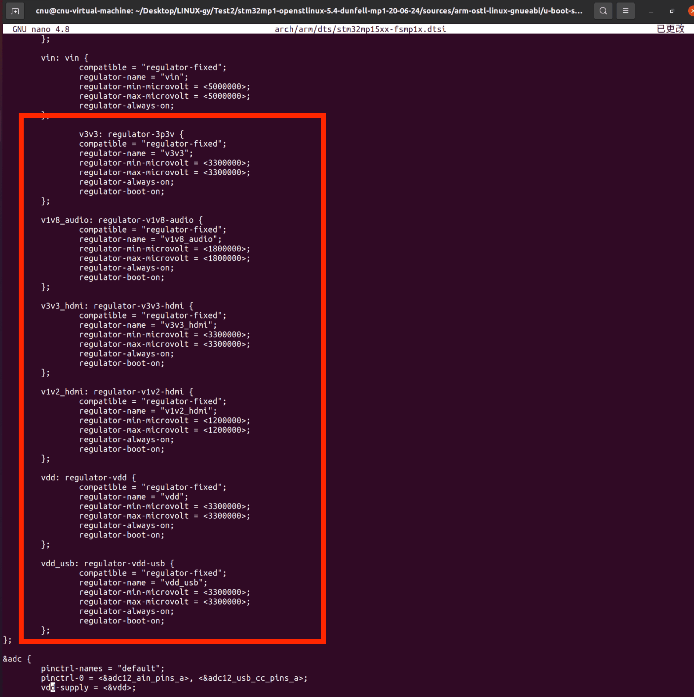
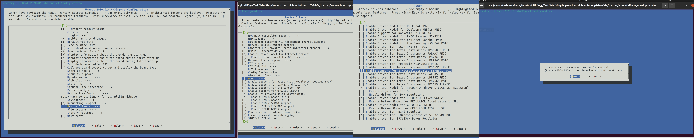
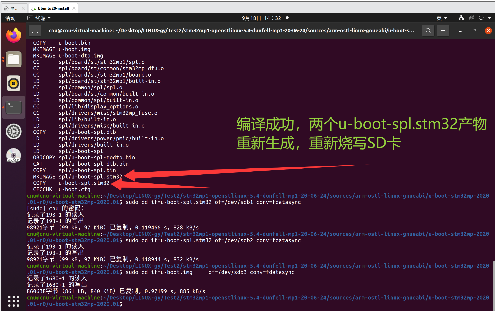
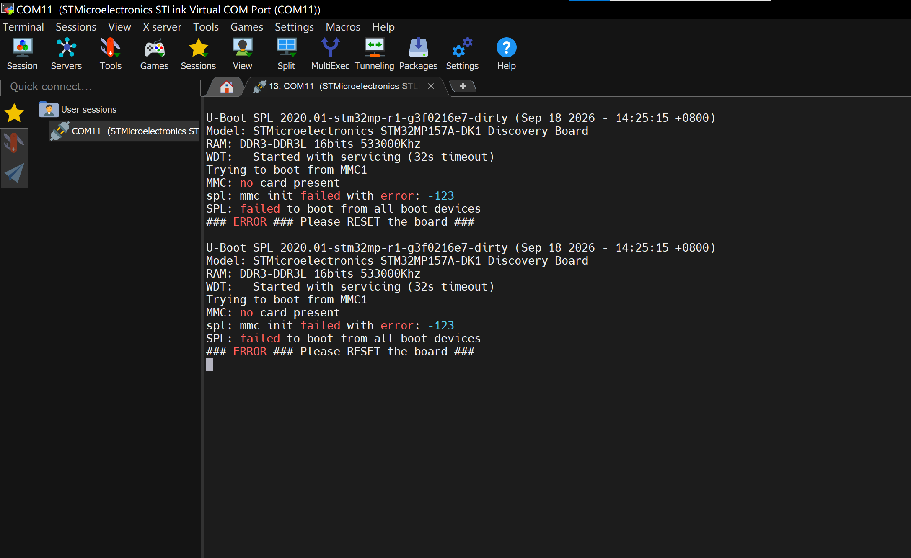
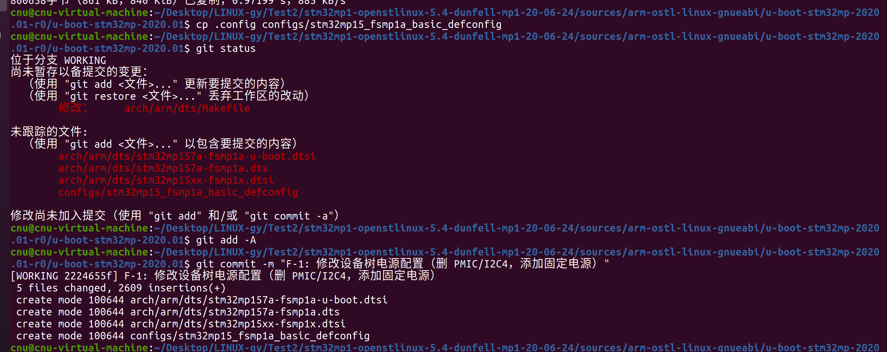
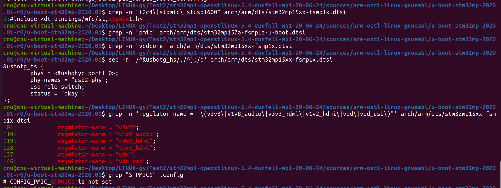

# 实验五 F-1 修改设备树电源配置——终结复位循环

> **对应课件**：《第3章 移植U-Boot》3.5 节，Slide 50-59
>
> **系列说明**：本系列基于华清远见 FS-MP1A（STM32MP157A）开发板，对应课件《第3章 移植U-Boot》。本文覆盖 Slide 50-59，是驱动修复系列（F-1~F-6）的第一站 **F-1**。前置：实验四已完成（SD 卡已分区、三个镜像已烧写，串口能稳定复现"电源报错 + 复位循环"）。

## 一、先看病根：DK1 的电源，FS-MP1A 没有

实验四串口里那句 `stpmic1_read: failed to read register ... : 32 ... power=-110`，病根在设备树：

- ST 官方 DK1 开发板上有一颗 **STPMIC1 电源管理芯片（PMIC）**，整板各路电压（DDR、CPU 内核、USB、音频、HDMI……）都由它输出；这颗芯片挂在 **I2C4 总线**上，U-Boot 通过 I2C 读写它的寄存器来开关电源；
- FS-MP1A 用的是**分立电源电路**，板上没有这颗芯片，I2C4 总线上也没有挂这些设备；
- 而我们的设备树是从 DK1 抄来的（`stm32mp15xx-fsmp1x.dtsi` ← `stm32mp15xx-dkx.dtsi`）。SPL 照着它去 I2C4 上找 PMIC——找不到，读寄存器超时（`-110`），判定电源初始化失败，复位。无限循环就是这么来的。

F-1 的修复思路（课件 Slide 50）分三步：

| 动作 | 内容 |
|---|---|
| **删** | 从设备树删掉 DK1 的 PMIC 配置、I2C4 节点，以及所有引用它们的节点 |
| **换** | 添加**固定电源**（`regulator-fixed`）——"这路电永远开着"，顶替原来由 PMIC 输出的那几路 |
| **关驱动** | menuconfig 里关掉 U-Boot 的 STPMIC1 驱动选项 |

> 课件原话："我怎么知道这些差异？开发板厂商说的！"——硬件差异的来源是厂商资料和原理图对比（F-2 的 SD 卡检测引脚就是这么找出来的）。

### 为什么必须"删干净"？

设备树的引用是**编译期检查**的：只要还有任何一处 `&pmic`、`&vddcore` 之类的引用指向已被删除的节点，`dtc` 就会报 `Reference to non-existent node or label`。所以删除要**成片删**——删节点本身，同时删掉所有引用它的地方。下面步骤 2~5 就是在做这件事；步骤 6 则是给"被引用的那几路电源"安排接盘的人。

## 二、实验环境（实际）

| 项目 | 实际值 |
|---|---|
| 虚拟机 | 同实验一（VMware + Ubuntu 20.04，4GB 内存） |
| 源码目录 | `~/Desktop/LINUX-gy/Test2/stm32mp1-openstlinux-5.4-dunfell-mp1-20-06-24/sources/arm-ostl-linux-gnueabi/u-boot-stm32mp-2020.01-r0/u-boot-stm32mp-2020.01` |
| 分支 | WORKING |
| 工具链 | `/opt/st/stm32mp1/3.1-openstlinux-5.4-dunfell-mp1-20-06-24`（**每个新终端都要重新激活**，`echo $CC` 确认） |
| 要修改的文件 | `arch/arm/dts/stm32mp15xx-fsmp1x.dtsi`（步骤 2、3、4、6）、`arch/arm/dts/stm32mp157a-fsmp1a-u-boot.dtsi`（步骤 5） |
| 串口 | MobaXterm Serial 会话（COM11），115200（同实验一步骤 1） |
| SD 卡 | `/dev/sdb`（实验四已分好区，本实验只需重烧三个镜像） |

## 三、课件 ↔ 步骤对应表

| 课件 Slide | 内容 | 对应步骤 |
|---|---|---|
| 50 | F-1 总述：删 DK1 的 PMIC/I2C4 配置，添加固定电源 | 本文第一节 + 步骤 2~6 |
| 51 | 删除 `&i2c4` 节点整段（PMIC 与 type-C 控制器都挂在它下面） | 步骤 2 |
| 52 | 删除引用电源节点的 `&cpu0` / `&cpu1` | 步骤 3 |
| 54 | 删除 `&usbotg_hs` 中引用 type-C 控制器的内容 | 步骤 4 |
| 53 | 删除 `-u-boot.dtsi` 专用文件里的 `&pmic` | 步骤 5 |
| 55-56 | 在根节点末尾添加固定电源配置 | 步骤 6 |
| 57 | menuconfig 去掉 STPMIC1 配置项 | 步骤 7 |
| 58 | 重新编译、烧写、上电看新报错 | 步骤 8~9 |
| 59 | git 提交 + `.config` 复制为 defconfig 收尾 | 步骤 10 |

## 四、实验步骤

### 步骤 1：激活工具链，进入源码目录

```bash
cd ~/Desktop/LINUX-gy/Test2/stm32mp1-openstlinux-5.4-dunfell-mp1-20-06-24/sources/arm-ostl-linux-gnueabi/u-boot-stm32mp-2020.01-r0/u-boot-stm32mp-2020.01

. /opt/st/stm32mp1/3.1-openstlinux-5.4-dunfell-mp1-20-06-24/environment-setup-cortexa7t2hf-neon-vfpv4-ostl-linux-gnueabi

echo $CC    # 输出 arm-ostl-linux-gnueabi-gcc ... 才算激活成功
```

### 步骤 2：删除 `&i2c4` 整段（Slide 51）

要删的节点在 `arch/arm/dts/stm32mp15xx-fsmp1x.dtsi` 里，它是**最长的一段**（约 180 行）——因为 DK1 那两颗 I2C4 上的芯片（`stusb1600@28` type-C 控制器、`pmic: stpmic@33` 电源芯片及其全部子节点）都长在这个节点里面。**把 `&i2c4` 从上到下整段删掉。**

先定位（确认行号便于心里有数）：

```bash
grep -n "^&i2c4\|^&i2c5" arch/arm/dts/stm32mp15xx-fsmp1x.dtsi
```

预期：`&i2c4` 在第 261 行附近、`&i2c5` 在第 445 行附近。要删的就是**从 `&i2c4 {` 开始，到它那个顶格（无缩进）的收尾 `};` 为止**——内层所有 `};` 都带 Tab 缩进，只有这个节点的收尾是顶格的，认准它就不会删多删少。

用 nano 打开、手动删除：

```bash
nano arch/arm/dts/stm32mp15xx-fsmp1x.dtsi
```

> 可选（更省事、更不易出错）：180 行手动删容易疲劳出错，也可以用一条 `sed` 精确删除——`sed -i '/^&i2c4 {/,/^};/d' file` 的含义是"从顶格的 `&i2c4 {` 行删到下一个顶格的 `};` 行"。两种做法二选一即可：
>
> ```bash
> sed -i '/^&i2c4 {/,/^};/d' arch/arm/dts/stm32mp15xx-fsmp1x.dtsi
> ```

删完自检——下面这条命令**没有任何输出**才算删干净：

```bash
grep -n "i2c4\|stpmic\|stusb1600" arch/arm/dts/stm32mp15xx-fsmp1x.dtsi
```

（文件顶部的 `#include <dt-bindings/mfd/st,stpmic1.h>` 留着无妨——它只是一个宏定义头文件，不产生任何引用。）

**实际执行结果**：

要删的就是图中红框里这么长的一段——从顶格的 `&i2c4 {` 一直包到它顶格的收尾 `};`：


> 图：nano 中的 `stm32mp15xx-fsmp1x.dtsi`。`&i2c4` 之所以这么长，是因为 type-C 控制器 `stusb1600@28` 和电源芯片 `pmic: stpmic@33` 都长在它里面，后者又带着 `vddcore`、`v3v3`、`vdd_usb` 等 16 个 regulator 子节点；节点末尾还挂着一个 `onkey`。整段一起删，不留残枝。

删掉后原来的位置直接接上 `&i2c5`（nano 里 `Ctrl+S` 保存，`Ctrl+X` 退出）：


> 图：删除后的同一位置——上方 `cs42l51_rx_endpoint` 收尾之后紧接 `&i2c5 {`，`&i2c4` 整段（原 261~443 行）已消失，其后内容整体前移约 180 行。

### 步骤 3：删除引用电源节点的 `&cpu0` / `&cpu1`（Slide 52）

同一个文件里，往下找 `&cpu0{` / `&cpu1{`（在 `&cec` 之后，第 134~140 行附近），整段删除：

```dts
&cpu0{
	cpu-supply = <&vddcore>;
};

&cpu1{
	cpu-supply = <&vddcore>;
};
```

**为什么删**：`vddcore` 是 PMIC 输出的 CPU 内核电压路，已经随步骤 2 的 `&i2c4` 一起被删了——这两处引用必须同步消失，否则编译设备树时报 `Reference to non-existent node or label "vddcore"`。

**实际执行结果**：


> 图：删掉 `&cpu0` / `&cpu1` 之后的同一片区域——`&cec` 收尾后直接就是 `&crc1`，中间那两段 `cpu-supply = <&vddcore>;` 的引用已经不见。删掉引用不等于"CPU 没有供电需求"，只是这份设备树不再向内核声明这件事：basic 版跑在 FS-MP1A 上，CPU 供电由硬件电路决定。

### 步骤 4：删除 `&usbotg_hs` 里引用 type-C 控制器的内容（Slide 54）

还是这个文件，找 `&usbotg_hs {`（文件末尾附近，第 736 行左右）。节点里 `port { ... };` 这一段引用了 type-C 控制器的端点标签 `con_usbotg_hs_ep`——它定义在刚被删掉的 `stusb1600@28` 里，所以这一段也要删：

```dts
	port {
		usbotg_hs_ep: endpoint {
			remote-endpoint = <&con_usbotg_hs_ep>;
		};
	};
```

节点其余部分（`phys`、`phy-names`、`usb-role-switch`、`status = "okay";`）**保留**，删完整个 `&usbotg_hs` 长这样：

```dts
&usbotg_hs {
	phys = <&usbphyc_port1 0>;
	phy-names = "usb2-phy";
	usb-role-switch;
	status = "okay";
};
```

**实际执行结果**：


> 图：红框里是删完的 `&usbotg_hs`——只剩 `phys` / `phy-names` / `usb-role-switch` / `status = "okay";` 四行，`port { ... };` 段已删除。图中它下面的 `&usbphyc_port0` 里还留着 `phy-supply = <&vdd_usb>;`——`vdd_usb` 随 PMIC 一起消失了，这个缺口留给步骤 6 补。

### 步骤 5：删除 `-u-boot.dtsi` 里的 `&pmic`（Slide 53）

`arch/arm/dts/stm32mp157a-fsmp1a-u-boot.dtsi` 是 U-Boot 专属的覆盖层（实验三复制的"三件套"之一），里面有一条专门标记 PMIC 的语句——它引用 `&pmic` 标签，同样指向已被删除的节点，整段删掉：

```dts
&pmic {
	u-boot,dm-pre-reloc;
};
```

```bash
nano arch/arm/dts/stm32mp157a-fsmp1a-u-boot.dtsi
```

删完这个文件里不应再出现 `pmic` 字样（自检：`grep -n pmic arch/arm/dts/stm32mp157a-fsmp1a-u-boot.dtsi` 无输出）。

**实际执行结果**：


> 图：`stm32mp157a-fsmp1a-u-boot.dtsi` 中红框圈出的 `&pmic { u-boot,dm-pre-reloc; };`。`u-boot,dm-pre-reloc` 是 U-Boot 的标记——"这个节点在重定位（relocation）之前就要可用"；它指向的 PMIC 节点已随 `&i2c4` 删除，所以整段随之删除。

### 步骤 6：在根节点末尾添加固定电源（Slide 55-56）

设备树里"缺了电源"的地方不止被删的那两处节点——文件里还有**许多节点在引用**原来由 PMIC 提供的电源标签。删掉 PMIC 后必须给它们接盘，否则 `dtc` 一样会报引用错误：

| 新增标签 | 谁在引用它 |
|---|---|
| `v3v3` | `&sdmmc1` / `&sdmmc2` 的 `vmmc-supply`、音频的 `VL-supply` |
| `v1v8_audio` | 音频的 `VD/VA/VAHP-supply` |
| `v3v3_hdmi` | 显示接口的 `iovcc-supply` |
| `v1v2_hdmi` | 显示接口的 `cvcc12-supply` |
| `vdd` | `&adc` 的 `vdd/vdda-supply`、`&vrefbuf` |
| `vdd_usb` | `&usbphyc_port0` / `&usbphyc_port1` 的 `phy-supply` |

**怎么做**：打开 `arch/arm/dts/stm32mp15xx-fsmp1x.dtsi`，找到文件**开头**的根节点（`/ {`，第 11 行附近），它末尾的最后一个子节点是 DK1 原有的 5V 输入 `vin: vin { ... };`——把下面 6 个节点粘贴到 **`vin` 之后、根节点收尾的 `};` 之前**：

```dts
	v3v3: regulator-3p3v {
		compatible = "regulator-fixed";
		regulator-name = "v3v3";
		regulator-min-microvolt = <3300000>;
		regulator-max-microvolt = <3300000>;
		regulator-always-on;
		regulator-boot-on;
	};

	v1v8_audio: regulator-v1v8-audio {
		compatible = "regulator-fixed";
		regulator-name = "v1v8_audio";
		regulator-min-microvolt = <1800000>;
		regulator-max-microvolt = <1800000>;
		regulator-always-on;
		regulator-boot-on;
	};

	v3v3_hdmi: regulator-v3v3-hdmi {
		compatible = "regulator-fixed";
		regulator-name = "v3v3_hdmi";
		regulator-min-microvolt = <3300000>;
		regulator-max-microvolt = <3300000>;
		regulator-always-on;
		regulator-boot-on;
	};

	v1v2_hdmi: regulator-v1v2-hdmi {
		compatible = "regulator-fixed";
		regulator-name = "v1v2_hdmi";
		regulator-min-microvolt = <1200000>;
		regulator-max-microvolt = <1200000>;
		regulator-always-on;
		regulator-boot-on;
	};

	vdd: regulator-vdd {
		compatible = "regulator-fixed";
		regulator-name = "vdd";
		regulator-min-microvolt = <3300000>;
		regulator-max-microvolt = <3300000>;
		regulator-always-on;
		regulator-boot-on;
	};

	vdd_usb: regulator-vdd-usb {
		compatible = "regulator-fixed";
		regulator-name = "vdd_usb";
		regulator-min-microvolt = <3300000>;
		regulator-max-microvolt = <3300000>;
		regulator-always-on;
		regulator-boot-on;
	};
```

> **这份配置从哪来？** 来自开发板厂商随课件下发的参考设备树（内容与课件 Slide 55-56 的红字截图一致）。另外注意**不要重复添加 `vin`**：DK1 原始设备树末尾本来就有 `vin: vin { ... }`（5V 输入），课件截图的红字里也把它框了进去——那是给"手上模板缺这一段"的人看的；我们复制的是完整的 dkx 设备树，`vin` 已经在了，再粘一遍会因**节点重名**（`duplicate_node_names`）而编译失败。

**这些节点在说什么**：`compatible = "regulator-fixed"` 表示"固定电源"（一路恒定的电，不做开关调节）；`regulator-always-on` / `regulator-boot-on` 表示"永远保持开启"——对固定存在的分立电源来说，这就是最贴切的描述。它们没有真正的"管理"，只是把标签定义出来供别的节点引用，保证设备树引用完整。

**实际执行结果**：


> 图：根节点末尾——DK1 原有的 `vin: vin { ... }`（5V 输入）之后、根节点收尾的 `};` 之前，红框内就是新增的 6 个 `regulator-fixed` 节点（v3v3 / v1v8_audio / v3v3_hdmi / v1v2_hdmi / vdd / vdd_usb）；再往下的 `&adc` 里 `vdd-supply = <&vdd>;` 引用的，正是刚定义出来的 `vdd`。

### 步骤 7：menuconfig 关掉 STPMIC1 驱动（Slide 57）

设备树里已经没有 PMIC 了，编译选项里也要把它关掉：

```bash
make menuconfig
```

按路径找到配置项：**`Device Drivers --->` → `Power --->` → `[ ] Enable support for STMicroelectronics STPMIC1 PMIC`**，按 `<N>`（或空格）把 `[*]` 去掉，然后 `<Exit>` `<Exit>`，提示保存时选 `<Yes>`。

> 同一菜单里有两项**不要动**：`[*] Enable Driver Model for REGULATOR drivers (UCLASS_REGULATOR)`——固定电源要用它；`[ ] Enable regulators for SPL` 保持关闭。

退出后自检：

```bash
grep "STPMIC1" .config
```

预期出现 `# CONFIG_PMIC_STPMIC1 is not set`（`CONFIG_DM_REGULATOR_STPMIC1` 依赖它，会一并消失）。

**实际执行结果**：


> 图：三格连拍——① menuconfig 主菜单（选中 `Device Drivers --->`）；② `Device Drivers` 子菜单（选中 `Power --->`）；③ `Power` 子菜单（高亮 `Enable support for STMicroelectronics STPMIC1 PMIC`，按 `<N>` 去掉 `[*]`），右侧是退出时的 `Do you wish to save your new configuration?` 确认框（选 `<Yes>`）。
>
> 同一屏里 `[*] Enable Driver Model for REGULATOR drivers (UCLASS_REGULATOR)` 保持勾选、`[ ] Enable regulators for SPL` 保持不勾——与上文注意事项一致。

退出后自检的实测输出就是上文预期值——`# CONFIG_PMIC_STPMIC1 is not set`（实测记录见第六节第一层自检 ⑥）。

### 步骤 8：重新编译（Slide 58）

```bash
make -j2 all DEVICE_TREE=stm32mp157a-fsmp1a
```

这次只改了设备树和配置，编译是增量的，很快。预期照样以 `MKIMAGE spl/u-boot-spl.stm32` 收尾，两个产物重新生成。

> 若编译设备树时报 `Reference to non-existent node or label "xxx"`——说明还有地方引用着被删掉的标签，回头检查步骤 2~6 是否删漏/漏加。`xxx` 就是线索：`vddcore` → 步骤 3 没删干净；`pmic` → 步骤 5 没删；`con_usbotg_hs_ep` → 步骤 4 没删。

**实际执行结果**：

编译以 `MKIMAGE spl/u-boot-spl.stm32` 收尾，紧接着三条 dd 重新烧写（SD 卡仍是 `/dev/sdb`）：


> 图：编译尾段与烧写结果。`MKIMAGE spl/u-boot-spl.stm32` → `COPY u-boot-spl.stm32` → `CFGCHK u-boot.cfg` 表示两个镜像已重新生成；随后三条 dd 分别写入 sdb1 / sdb2 / sdb3。

```
$ sudo dd if=u-boot-spl.stm32 of=/dev/sdb1 conv=fdatasync
98921字节（99 kB，97 KiB）已复制，0.119466 s，828 kB/s
$ sudo dd if=u-boot-spl.stm32 of=/dev/sdb2 conv=fdatasync
98921字节（99 kB，97 KiB）已复制，0.118944 s，832 kB/s
$ sudo dd if=u-boot.img     of=/dev/sdb3 conv=fdatasync
860638字节（861 kB，840 KiB）已复制，0.97199 s，885 kB/s
```

（SPL 往 sdb1、sdb2 各写一份是 ST 的冗余设计：fsbl1 / fsbl2 互为备份，一份坏了 ROM 代码会去读另一份。）

### 步骤 9：烧写 SD 卡，上电看新报错（Slide 58）

三条 dd 重烧（同实验四步骤 6；先 `lsblk` 确认 SD 卡仍是 `/dev/sdb`）：

```bash
sudo dd if=u-boot-spl.stm32 of=/dev/sdb1 conv=fdatasync
sudo dd if=u-boot-spl.stm32 of=/dev/sdb2 conv=fdatasync
sudo dd if=u-boot.img     of=/dev/sdb3 conv=fdatasync
```

板子断电 → 插卡 → 拨码 `101` → 上电，看 MobaXterm 串口。

**实际串口输出**（MobaXterm COM11，2026-09-18 14:25；与课件 Slide 58 的预告逐行一致）：

```
U-Boot SPL 2020.01-stm32mp-r1-g3f0216e7-dirty (Sep 18 2026 - 14:25:15 +0800)
Model: STMicroelectronics STM32MP157A-DK1 Discovery Board
RAM: DDR3-DDR3L 16bits 533000Khz
WDT:   Started with servicing (32s timeout)
Trying to boot from MMC1
MMC: no card present
spl: mmc init failed with error: -123
SPL: failed to boot from all boot devices
### ERROR ### Please RESET the board ###
```

**怎么解读这份输出：**

| 看到什么 | 说明什么 |
|---|---|
| 电源报错（`stpmic1_read` / `power=-110`）**消失**，DDR 初始化通过，还多了一行 `WDT:` | **F-1 达标**：设备树里不再有 PMIC，SPL 电源初始化不再失败 |
| `Trying to boot from MMC1` → `MMC: no card present` | 启动流程往前推进了一大步：SPL 已开始"从 SD 卡（SDMMC1）加载 U-Boot 本体"，但它认为**卡不在位** |
| `spl: mmc init failed with error: -123`、`failed to boot from all boot devices` | 新的错误：SDMMC1 的**卡检测（CD）引脚**与 DK1 不同（DK1 用 `gpiob7`，FS-MP1A 用 `gpioh3`）——这就是 F-2 的修复对象 |
| 停在 `### ERROR ### Please RESET the board ###`，不再有实验四那种"眨眼一轮"的复位循环 | 走到这一步时 SPL 调用的是 `hang()`，它只是**原地死循环**、不会自己复位（源码 `lib/hang.c`）。串口若过一会儿又出现一轮，那是手动复位、或者前面刚启动的看门狗（32 秒超时）咬复位的结果——节奏已从"瞬间循环"变成"半分钟一轮" |

**注意**：这不是"又失败了"，而是**错误向前推进了一环**——从"电源起不来"推进到"卡检测不对"。移植工作就是这样一环一环往前拱的：每修掉一个错误，串口就会把下一个错误指给你看。

**实际执行结果**：


> 图：MobaXterm COM11 实录（2026-09-18 14:25）——`stpmic1_read` / `power=-110` 那两行电源报错彻底消失，还多出 `WDT:` 一行（说明这次 SPL 已经走到启动看门狗的阶段）；随后 `Trying to boot from MMC1` → `MMC: no card present` → `spl: mmc init failed with error: -123` → `### ERROR ### Please RESET the board ###`。图中可见两轮，说明板子确实又跑了一次（复位方式见上表）；版本串里的 `Sep 18 2026 - 14:25:15` 正是本次编译的时间戳，证明跑的就是刚烧进去的镜像。

### 步骤 10：收尾——.config 存为 defconfig + git 提交（Slide 59）

F-1 验证通过后，把这一阶段的成果**固化**下来。这里有一个容易忽略的点：`git` **不跟踪** `.config`（它在 `.gitignore` 里，属于编译产物），而刚才步骤 7 关掉 STPMIC1 的关键改动恰恰只记录在 `.config` 里——直接提交会把它丢掉。课件的解决办法（Slide 59）：把 `.config` 复制成**默认配置文件**（这个文件被 git 跟踪）：

```bash
cp .config configs/stm32mp15_fsmp1a_basic_defconfig
```

从此以后，"这份配置"就固化在仓库里了：任何时候 `make stm32mp15_fsmp1a_basic_defconfig` 一条命令即可还原（ST 自家的 defconfig 也是这种完整 `.config` 格式）。

然后提交这一阶段的修改（设备树 2 个文件 + defconfig）：

```bash
git status          # 实际会看到：修改 1 个 + 未跟踪 4 个（原因见下）
git add -A
git commit -m "F-1: 修改设备树电源配置（删 PMIC/I2C4，添加固定电源）"
```

课件原话："对于已完成的修改，如已验证没有错误，可以用 git 提交一个版本，以便后续修改有问题时返回到此节点重新修改。"——后面 F-2~F-6 每修好一个都是同样的节奏：**验证通过 → 提交留档**。

**实际执行结果**：


> 图：`cp .config configs/stm32mp15_fsmp1a_basic_defconfig` → `git status`（1 个修改 + 4 个未跟踪）→ `git add -A` → `git commit`，得到 `[WORKING 2224655f]`，`5 files changed, 2609 insertions(+)`。

```
$ git status
位于分支 WORKING
尚未暂存以备提交的变更：
        修改：     arch/arm/dts/Makefile

未跟踪的文件：
        arch/arm/dts/stm32mp157a-fsmp1a-u-boot.dtsi
        arch/arm/dts/stm32mp157a-fsmp1a.dts
        arch/arm/dts/stm32mp15xx-fsmp1x.dtsi
        configs/stm32mp15_fsmp1a_basic_defconfig
$ git commit -m "F-1: 修改设备树电源配置（删 PMIC/I2C4，添加固定电源）"
[WORKING 2224655f] F-1: 修改设备树电源配置（删 PMIC/I2C4，添加固定电源）
 5 files changed, 2609 insertions(+)
 create mode 100644 arch/arm/dts/stm32mp157a-fsmp1a-u-boot.dtsi
 create mode 100644 arch/arm/dts/stm32mp157a-fsmp1a.dts
 create mode 100644 arch/arm/dts/stm32mp15xx-fsmp1x.dtsi
 create mode 100644 configs/stm32mp15_fsmp1a_basic_defconfig
```

**为什么是 5 个文件、不是 3 个？** 实验三复制的设备树"三件套"（`stm32mp157a-fsmp1a.dts`、`stm32mp157a-fsmp1a-u-boot.dtsi`、`stm32mp15xx-fsmp1x.dtsi`）和当时改的 `arch/arm/dts/Makefile` **一直处于未提交状态**，这次随 F-1 一并入库——所以 `git status` 看到的是"修改 1 个 + 未跟踪 4 个"。真正属于本实验的产物，是最后那个 `configs/stm32mp15_fsmp1a_basic_defconfig`。往后 F-2~F-6 都在这个提交之上增量修改，`git status` 就只见当前这一次的改动了。

## 五、注意事项

1. **两个文件别搞混**：`stm32mp15xx-fsmp1x.dtsi` 是 DK1/DKx 系列公共层（步骤 2、3、4、6 都改它）；`stm32mp157a-fsmp1a-u-boot.dtsi` 是 U-Boot 专属覆盖层（只有步骤 5 改它）。
2. **删除要认"顶格 `};`"**：设备树内层收尾都带 Tab 缩进，只有节点自身的收尾顶格——删 `&i2c4` 这种大段时认准它，避免删多删少。删完用 `grep` 自检（步骤 2 给了命令）。
3. **编译报 `Reference to non-existent node or label "xxx"`** = 有地方还引用着被删的标签：`vddcore` 查步骤 3、`pmic` 查步骤 5、`con_usbotg_hs_ep` 查步骤 4、`v3v3`/`vdd`/`vdd_usb` 等查步骤 6 是否粘贴完整。
4. **配置改动必须执行步骤 10 的 `.config → defconfig` 复制**——否则 git 提交里没有这次的关键配置改动，下次 `make xxx_defconfig` 会把它"改回去"。
5. **烧写前确认设备号**：`lsblk` 里 `/dev/sdb`（29.8G 的 Storage_Device）才是 SD 卡；插拔卡在板子断电状态进行（同实验四注意事项）。
6. **本实验的"成功标准"是看到新错误**：电源报错消失 + `MMC: no card present` 出现，即为达标；板子此时仍不能启动是**预期内**的，修复见 F-2。

## 六、怎么验证 F-1 改对了

F-1 的改动有个特点：**点多、又互相牵连**——同一个文件里删四处、加六处，还要同步动另一个设备树文件和 `.config`。少删一处、漏加一个，轻则编译报错，重则"编过了但板子行为照旧"。所以验证分四层做，原则是：**能在电脑上查清的，绝不留给板子**。

| 层次 | 手段 | 能证明什么 | 耗时 |
|---|---|---|---|
| 一 | 源码自检（`grep`/`sed`） | 改动到位、没有残留 | 半分钟 |
| 二 | 编译 | 引用完整、无悬空（`dtc` 就是引用解析器） | 一两分钟 |
| 三 | 查编译产物（反编译 dtb） | 改的东西真的进了镜像 | 十秒 |
| 四 | 上电看串口 | 功能真的生效 | 几分钟 |

### 第一层：源码自检（不编译，先跑这个）

```bash
cd ~/Desktop/LINUX-gy/Test2/stm32mp1-openstlinux-5.4-dunfell-mp1-20-06-24/sources/arm-ostl-linux-gnueabi/u-boot-stm32mp-2020.01-r0/u-boot-stm32mp-2020.01

# ① PMIC / I2C4 / type-C 痕迹清零（对应步骤 2）
grep -n "i2c4\|stpmic\|stusb1600" arch/arm/dts/stm32mp15xx-fsmp1x.dtsi          # 期望：只允许第 9 行的 #include 命中（见下）

# ② U-Boot 覆盖层里的 &pmic 清零（对应步骤 5）
grep -n "pmic" arch/arm/dts/stm32mp157a-fsmp1a-u-boot.dtsi                      # 期望：无输出

# ③ vddcore 引用清零（对应步骤 3）
grep -n "vddcore" arch/arm/dts/stm32mp15xx-fsmp1x.dtsi                          # 期望：无输出

# ④ &usbotg_hs 里不再有 port 段（对应步骤 4）
sed -n '/^&usbotg_hs/,/^};/p' arch/arm/dts/stm32mp15xx-fsmp1x.dtsi
# 期望：只剩节点头 + phys / phy-names / usb-role-switch / status 四行属性

# ⑤ 六个固定电源齐全（对应步骤 6）
grep -n 'regulator-name = "\(v3v3\|v1v8_audio\|v3v3_hdmi\|v1v2_hdmi\|vdd\|vdd_usb\)"' arch/arm/dts/stm32mp15xx-fsmp1x.dtsi
# 期望：恰好 6 行

# ⑥ 配置项已关（对应步骤 7）
grep "STPMIC1" .config                                                          # 期望：# CONFIG_PMIC_STPMIC1 is not set
```

把六条原样执行一遍，本机实测输出如下（命令与输出交替出现，行首是 shell 提示符）：

```
cnu@cnu-virtual-machine:~/Desktop/LINUX-gy/Test2/stm32mp1-openstlinux-5.4-dunfell-mp1-20-06-24/sources/arm-ostl-linux-gnueabi/u-boot-stm32mp-2020.01-r0/u-boot-stm32mp-2020.01$ grep -n "i2c4\|stpmic\|stusb1600" arch/arm/dts/stm32mp15xx-fsmp1x.dtsi 
9:#include <dt-bindings/mfd/st,stpmic1.h>
cnu@cnu-virtual-machine:~/Desktop/LINUX-gy/Test2/stm32mp1-openstlinux-5.4-dunfell-mp1-20-06-24/sources/arm-ostl-linux-gnueabi/u-boot-stm32mp-2020.01-r0/u-boot-stm32mp-2020.01$ grep -n "pmic" arch/arm/dts/stm32mp157a-fsmp1a-u-boot.dtsi  
cnu@cnu-virtual-machine:~/Desktop/LINUX-gy/Test2/stm32mp1-openstlinux-5.4-dunfell-mp1-20-06-24/sources/arm-ostl-linux-gnueabi/u-boot-stm32mp-2020.01-r0/u-boot-stm32mp-2020.01$ grep -n "vddcore" arch/arm/dts/stm32mp15xx-fsmp1x.dtsi 
cnu@cnu-virtual-machine:~/Desktop/LINUX-gy/Test2/stm32mp1-openstlinux-5.4-dunfell-mp1-20-06-24/sources/arm-ostl-linux-gnueabi/u-boot-stm32mp-2020.01-r0/u-boot-stm32mp-2020.01$ sed -n '/^&usbotg_hs/,/^};/p' arch/arm/dts/stm32mp15xx-fsmp1x.dtsi
&usbotg_hs {
	phys = <&usbphyc_port1 0>;
	phy-names = "usb2-phy";
	usb-role-switch;
	status = "okay";
};
cnu@cnu-virtual-machine:~/Desktop/LINUX-gy/Test2/stm32mp1-openstlinux-5.4-dunfell-mp1-20-06-24/sources/arm-ostl-linux-gnueabi/u-boot-stm32mp-2020.01-r0/u-boot-stm32mp-2020.01$ grep -n 'regulator-name = "\(v3v3\|v1v8_audio\|v3v3_hdmi\|v1v2_hdmi\|vdd\|vdd_usb\)"' arch/arm/dts/stm32mp15xx-fsmp1x.dtsi
101:		regulator-name = "v3v3";
110:		regulator-name = "v1v8_audio";
119:		regulator-name = "v3v3_hdmi";
128:		regulator-name = "v1v2_hdmi";
137:		regulator-name = "vdd";
146:		regulator-name = "vdd_usb";
cnu@cnu-virtual-machine:~/Desktop/LINUX-gy/Test2/stm32mp1-openstlinux-5.4-dunfell-mp1-20-06-24/sources/arm-ostl-linux-gnueabi/u-boot-stm32mp-2020.01-r0/u-boot-stm32mp-2020.01$ grep "STPMIC1" .config 
# CONFIG_PMIC_STPMIC1 is not set
cnu@cnu-virtual-machine:~/Desktop/LINUX-gy/Test2/stm32mp1-openstlinux-5.4-dunfell-mp1-20-06-24/sources/arm-ostl-linux-gnueabi/u-boot-stm32mp-2020.01-r0/u-boot-stm32mp-2020.01$ 

```

六条全部达标，只有 ① 出现一行命中——`9:#include <dt-bindings/mfd/st,stpmic1.h>`，正是步骤 2 说明过的宏定义头文件，不产生任何节点引用，属于**预期内的唯一例外**；②③④ 完全无输出，⑤ 恰好 6 行（101 / 110 / 119 / 128 / 137 / 146 行），⑥ 显示 `is not set`。


> 图：六条自检命令的终端实测回显——`&usbotg_hs` 只剩四行属性、六个 `regulator-name` 恰好六行、`.config` 里 `# CONFIG_PMIC_STPMIC1 is not set`。

**为什么"恰好 6 个电源"是硬指标？** 把 DK1 的原始设备树（`stm32mp15xx-dkx.dtsi`）拆开数过：`&i2c4` 整段一共定义了 16 个标签，整段删除后，**在文件别处仍被引用的恰恰是 8 个**——

| 被删掉的标签 | 段外还在引用它的地方 | 交代方式 |
|---|---|---|
| `vddcore` | `&cpu0` / `&cpu1` 的 `cpu-supply` | 步骤 3：连引用一起删 |
| `con_usbotg_hs_ep` | `&usbotg_hs` 的 `port` 段 | 步骤 4：连引用一起删 |
| `v3v3` | `&sdmmc1` / `&sdmmc2` 的 `vmmc-supply`、音频 | 步骤 6：用固定电源顶替 |
| `v1v8_audio` | 音频的 VD/VA/VAHP-supply | 同上 |
| `v3v3_hdmi` | 显示接口的 iovcc-supply | 同上 |
| `v1v2_hdmi` | 显示接口的 cvcc12-supply | 同上 |
| `vdd` | `&adc` 的 vdd/vdda-supply、`&vrefbuf` | 同上 |
| `vdd_usb` | `&usbphyc_port0` / `&usbphyc_port1` 的 phy-supply | 同上 |

另外 8 个（`vdd_ddr`、`vtt_ddr`、`vdda`、`vref_ddr`、`bst_out`、`vbus_otg`、`vbus_sw`、`pmic`）只在 `&i2c4` 内部互相引用，随整段一起消失，无需处理。

也就是说，**"6 个"不是估出来的，是从原始设备树里推出来的**：自检 ⑤ 多一行说明粘重了，少一行说明漏了。

### 第二层：编译（它本身就是一次严格验证）

`dtc`（设备树编译器）就是**引用解析器**：它编译通过、没有报 `Reference to non-existent node or label`，就等于证明了"该删的删干净了、该补的补齐了"。这一层比任何肉眼检查都硬——所以别把编译只当成"生成镜像"，它在 F 系列里同时担任裁判。

### 第三层：查编译产物（可选，不用板子）

```bash
./scripts/dtc/dtc -I dtb -O dts u-boot.dtb 2>/dev/null | grep -c 'regulator-fixed'
```

期望 ≥ 7（6 个新增 + DK1 原有的 `vin`）。SPL 用的是 `spl/u-boot-spl.dtb`（有的版本与顶层是同一份），存在就一并查。这一步能排掉"源码改了但没编译成功""编的是别的设备树"这类乌龙。若 `./scripts/dtc/dtc` 不存在，改用系统或 SDK 里的 `dtc` 即可。

### 第四层：上电实测（唯一能证明"真的生效"）

判据就是**步骤 9** 的那张解读表，三条同时成立才算达标：

1. `stpmic1_read ... power=-110` 消失，DDR 那行正常打出；
2. 出现 `MMC: no card present` 与 `spl: mmc init failed with error: -123`；
3. 停在 `### ERROR ### Please RESET the board ###`，不再有实验四那种"眨眼一轮"的复位循环（SPL 在这里调用 `hang()` 原地死循环，不会自己复位）。

不达标时的排查顺序：

| 现象 | 先查什么 |
|---|---|
| 电源报错照旧、仍在复位循环 | 镜像没换：`dd` 的目标分区是否写对（sdb1/sdb2/sdb3）、步骤 8 是否真的重新生成了两个镜像、板子跑的确实是这张卡 |
| 编译报 `Reference to non-existent node or label "xxx"` | 按标签对号入座：`vddcore` → 步骤 3、`pmic` → 步骤 5、`con_usbotg_hs_ep` → 步骤 4、`v3v3`/`vdd`/`vdd_usb` 等 → 步骤 6 是否粘贴完整 |
| 串口完全没有输出 | 回到实验四步骤 8 的排查（供电、拨码、串口） |

### 最后一道验证：提交本身

步骤 10 提交完，用 `git show --stat HEAD` 复核：本次实测是 **5 个文件**（`5 files changed, 2609 insertions(+)`）——两个 `.dts` + 一个 `.dtsi` + `configs/stm32mp15_fsmp1a_basic_defconfig` + `arch/arm/dts/Makefile`，前四者的"三件套"和 Makefile 是实验三留下的未提交内容，随这次一并入库。**真正要盯住的是 `stm32mp15_fsmp1a_basic_defconfig` 在不在列表里**——不在，就说明 `.config → defconfig` 那步漏了，关掉 STPMIC1 的关键配置改动没有进版本库。

## 七、实验完成标志

- `stm32mp15xx-fsmp1x.dtsi`：`&i2c4` 整段、`&cpu0` / `&cpu1`、`&usbotg_hs` 的 `port` 段已删除
- `stm32mp157a-fsmp1a-u-boot.dtsi`：`&pmic` 段已删除
- 根节点末尾已添加 6 个 `regulator-fixed` 固定电源（v3v3 / v1v8_audio / v3v3_hdmi / v1v2_hdmi / vdd / vdd_usb）
- menuconfig 已关闭 `Enable support for STMicroelectronics STPMIC1 PMIC`，`.config` 中 `# CONFIG_PMIC_STPMIC1 is not set`
- 重新编译成功，两个镜像已重新烧写
- 串口输出中电源报错消失，出现 `MMC: no card present` 与 `spl: mmc init failed with error: -123`
- `.config` 已复制为 `configs/stm32mp15_fsmp1a_basic_defconfig` 并完成 git 提交

## 八、下一步

F-1 让 SPL 走过了电源初始化，串口立刻指出了下一个问题：**SDMMC1 认为卡不在位**。对比 DK1 与 FS-MP1A 的原理图会发现，SD 卡的**卡检测（CD）引脚**用的芯片引脚不同（DK1 用 `gpiob7`，FS-MP1A 用 `gpioh3`）——设备树里改掉这个引脚，卡检测就正常了。请看《实验六 F-2 修改 SD 卡驱动》。
