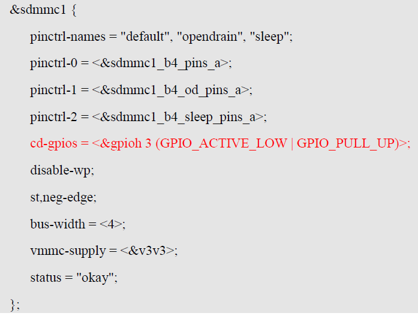
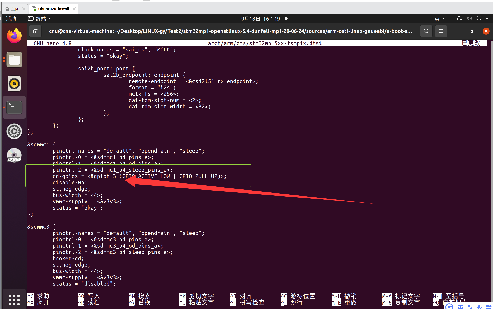
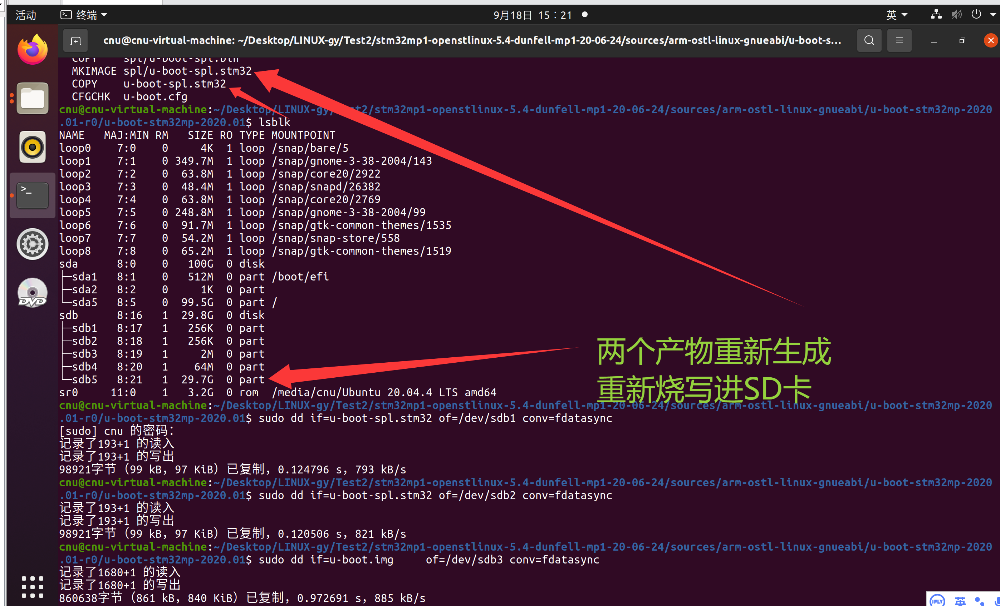
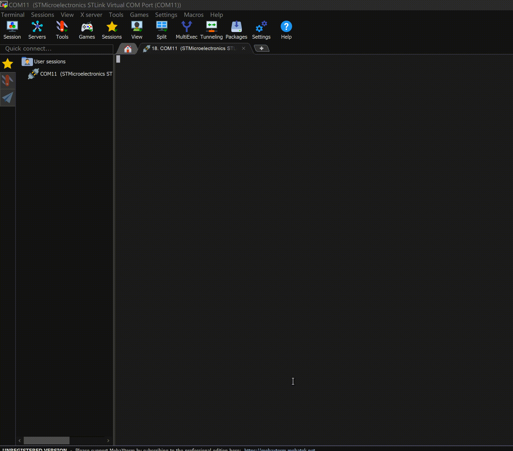
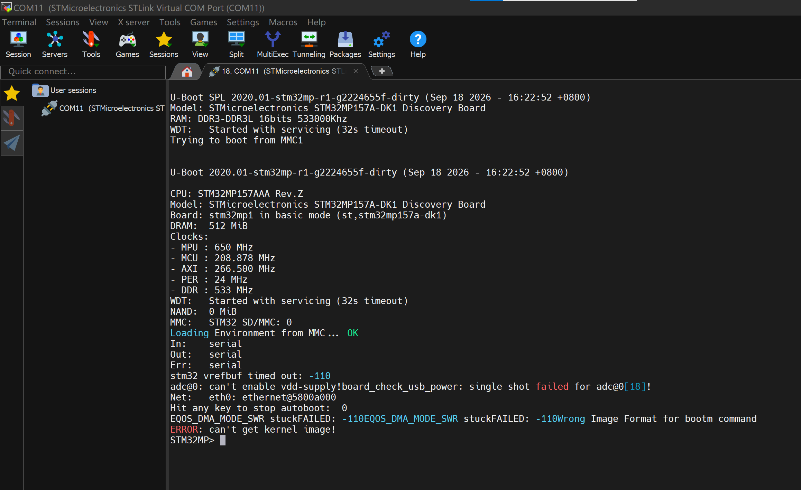

# 实验六 F-2 修改 SD 卡驱动——从"卡不在位"到 U-Boot 命令行

> **对应课件**：《第3章 移植U-Boot》3.5 节，Slide 60-65
>
> **系列说明**：本系列基于华清远见 FS-MP1A（STM32MP157A）开发板，对应课件《第3章 移植U-Boot》。本文覆盖 Slide 60-65，是驱动修复系列（F-1~F-6）的第二站 **F-2**。前置：实验五（F-1）已完成——电源报错消失，串口停在 `MMC: no card present`，板子还进不了系统。

## 一、先看病根：卡在"卡检测"这一关

实验五修完电源后，串口立刻指出了下一个错误：

```
Trying to boot from MMC1
MMC: no card present
spl: mmc init failed with error: -123
SPL: failed to boot from all boot devices
```

SPL 已经在"从 SD 卡（SDMMC1 控制器）读 U-Boot 本体"了，却卡在第一步：它认定**卡不在位**。判断"卡在不在"靠的是卡座上的 **CD（Card Detect，卡检测）引脚**——卡插进去，卡座里的检测触点状态变化，控制器据此得知"有卡"。

问题出在设备树：我们的设备树是从 DK1 抄来的（实验三），DK1 的 CD 引脚接在 **PB7**，而 FS-MP1A 接在 **PH3**。SPL 照着设备树去读 PB7——那个引脚在 FS-MP1A 上根本不是卡检测信号，读到的电平等于"没有卡"，于是报 `-123`（也就是 `-ENOMEDIUM`，"无介质"错误），直接放弃引导。

课件 Slide 60 把结论说得很干脆：

> 对比 dk1 开发板和 FS-MP1A 开发板的原理图，SDMMC1 控制器的 CD 引脚使用的芯片引脚不同（dk1 用的 gpiob7 脚，FS-MP1A 用的 gpioh3 脚）。
>
> 此引脚差异或者是开发板硬件设计者告知，或者是对比原理图发现。

**修法**：只改设备树里的一行——把 CD 引脚从 `&gpiob 7` 改成 `&gpioh 3`。

### 为什么是 PH3：自己从原理图上读出来

F-1 的电源清单靠厂商给的参考配置，F-2 这个改动小到不必等资料——**自己看原理图就能定**。两张图，一条线索链：


> 图：FS-MP1A 开发板原理图——TF 卡座（MICROSD/TF_SLOT，J4）。卡座第 9 脚是 `CD#`，引出网络名 `SD1_CD`；其余信号 SD1_DATA0~SD1_DATA3、SD1_CMD、SD1_CLK 接 SDMMC1 总线，供电 TF_3V3。


> 图：FS-MP1A 开发板原理图——STM32MP157AAA3 处理器（U6B）部分引脚定义：`PH3` 引脚（球号 Y6/A3）连接 `SD1_CD[9]`。

链条就此闭合：**卡座 9 脚 CD# → 网络 SD1_CD → 处理器 PH3 → 设备树里写作 `&gpioh 3`**（STM32MP1 引脚记法是"组 + 序号"：PH3 就是 `gpioh` 组的第 3 号引脚）。

## 二、实验环境（实际）

| 项目 | 实际值 |
|---|---|
| 虚拟机 | 同实验一（VMware + Ubuntu 20.04，4GB 内存） |
| 源码目录 | `~/Desktop/LINUX-gy/Test2/stm32mp1-openstlinux-5.4-dunfell-mp1-20-06-24/sources/arm-ostl-linux-gnueabi/u-boot-stm32mp-2020.01-r0/u-boot-stm32mp-2020.01` |
| 分支 | WORKING |
| 工具链 | `/opt/st/stm32mp1/3.1-openstlinux-5.4-dunfell-mp1-20-06-24`（**每个新终端都要重新激活**，`echo $CC` 确认） |
| 要修改的文件 | `arch/arm/dts/stm32mp15xx-fsmp1x.dtsi`（只改 `&sdmmc1` 里的一行） |
| 串口 | MobaXterm Serial 会话（COM11），115200（同实验一） |
| SD 卡 | `/dev/sdb`（实验四已分好区，本实验只需重烧三个镜像） |

## 三、课件 ↔ 步骤对应表

| 课件 Slide | 内容 | 对应步骤 |
|---|---|---|
| 60 | F-2 总述：CD 引脚不同，只改设备树 | 本文第一节 + 步骤 2~3 |
| 61 | FS-MP1A 原理图：TF 卡座 9 脚 CD# 引出 SD1_CD | 第一节 |
| 62 | 处理器引脚表：PH3 连接 SD1_CD | 第一节 |
| 63 | `stm32mp15xx-fsmp1x.dtsi` 中 `&sdmmc1` 的修改结果 | 步骤 2~3 |
| 64 | 重新编译、烧写、运行——进入 U-Boot 命令行 | 步骤 4~6 |
| 65 | 启动过程仍有报错（ADC / 网卡），后续继续完善 | 步骤 6 |

## 四、实验步骤

### 步骤 1：激活工具链，进入源码目录

```bash
cd ~/Desktop/LINUX-gy/Test2/stm32mp1-openstlinux-5.4-dunfell-mp1-20-06-24/sources/arm-ostl-linux-gnueabi/u-boot-stm32mp-2020.01-r0/u-boot-stm32mp-2020.01

. /opt/st/stm32mp1/3.1-openstlinux-5.4-dunfell-mp1-20-06-24/environment-setup-cortexa7t2hf-neon-vfpv4-ostl-linux-gnueabi

echo $CC    # 输出 arm-ostl-linux-gnueabi-gcc ... 才算激活成功
```

### 步骤 2：定位 `&sdmmc1` 节点里的 CD 引脚

```bash
grep -n "cd-gpios" arch/arm/dts/stm32mp15xx-fsmp1x.dtsi
```

预期输出**恰好一行**：

```
NNN:	cd-gpios = <&gpiob 7 (GPIO_ACTIVE_LOW | GPIO_PULL_UP)>;
```

> 行号以你文件里的实际结果为准：DK1 原始设备树中这一行是第 575 行，经过 F-1（删 `&i2c4` 等约 190 行、新增电源约 53 行）之后，应该在**第 440 行附近**。

它所在的整个节点长这样（当前状态）：

```dts
&sdmmc1 {
	pinctrl-names = "default", "opendrain", "sleep";
	pinctrl-0 = <&sdmmc1_b4_pins_a>;
	pinctrl-1 = <&sdmmc1_b4_od_pins_a>;
	pinctrl-2 = <&sdmmc1_b4_sleep_pins_a>;
	cd-gpios = <&gpiob 7 (GPIO_ACTIVE_LOW | GPIO_PULL_UP)>;
	disable-wp;
	st,neg-edge;
	bus-width = <4>;
	vmmc-supply = <&v3v3>;
	status = "okay";
};
```

要改的就是 `cd-gpios` 那一行，其余属性在 DK1 与 FS-MP1A 上是一致的，**不要动**（其中 `vmmc-supply = <&v3v3>` 正是 F-1 新建的那路固定电源，配得刚好）。

### 步骤 3：把 CD 引脚改成 gpioh3（Slide 63）

用 nano 打开：

```bash
nano arch/arm/dts/stm32mp15xx-fsmp1x.dtsi
```

把这一行：

```dts
	cd-gpios = <&gpiob 7 (GPIO_ACTIVE_LOW | GPIO_PULL_UP)>;
```

改成：

```dts
	cd-gpios = <&gpioh 3 (GPIO_ACTIVE_LOW | GPIO_PULL_UP)>;
```

只动两处字眼：`gpiob 7` → `gpioh 3`。后面的标志位 `(GPIO_ACTIVE_LOW | GPIO_PULL_UP)` **原样保留**——它描述的是"低电平表示卡已插入"和"使能内部上拉"，与用哪个引脚无关。保存退出（`Ctrl+S` 保存，`Ctrl+X` 退出）。

> 可选（一行替换，不用开编辑器）：
>
> ```bash
> sed -i 's/&gpiob 7 /\&gpioh 3 /' arch/arm/dts/stm32mp15xx-fsmp1x.dtsi
> ```
>
> 注意替换串里的 `\&`：sed 的替换部分里，裸 `&` 表示"刚匹配到的内容"，要写字面量 `&` 必须转义。

改完自检：

```bash
grep -n "cd-gpios" arch/arm/dts/stm32mp15xx-fsmp1x.dtsi     # 应变成 <&gpioh 3 ...>
grep -c "gpiob 7" arch/arm/dts/stm32mp15xx-fsmp1x.dtsi      # 应为 0
```

修改结果与课件 Slide 63 的红字一致：


> 图：课件 Slide 63——`&sdmmc1` 节点中修改后的 CD 引脚（红字 `cd-gpios = <&gpioh 3 (GPIO_ACTIVE_LOW | GPIO_PULL_UP)>;`）。改的只有这一行，pinctrl、`disable-wp`、`st,neg-edge`、`bus-width`、`vmmc-supply` 等属性都保持原样。

**实际执行结果**：


> 图：改完保存后的实际状态——`&sdmmc1` 的 `cd-gpios` 已是 `<&gpioh 3 (GPIO_ACTIVE_LOW | GPIO_PULL_UP)>`，与课件 Slide 63 的红字一致。

### 步骤 4：重新编译（Slide 64）

```bash
make -j2 all DEVICE_TREE=stm32mp157a-fsmp1a
```

只改了一行设备树，编译几乎是"重编设备树 + 重新打包"，很快。预期照样以 `MKIMAGE spl/u-boot-spl.stm32` 收尾，两个产物重新生成。

**实际执行结果**：编译收尾输出见下一步骤截图顶部（`MKIMAGE spl/u-boot-spl.stm32` → `COPY` → `CFGCHK u-boot.cfg`）。

### 步骤 5：烧写 SD 卡（Slide 64）

```bash
lsblk                                   # 先确认 SD 卡仍是 /dev/sdb
sudo dd if=u-boot-spl.stm32 of=/dev/sdb1 conv=fdatasync
sudo dd if=u-boot-spl.stm32 of=/dev/sdb2 conv=fdatasync
sudo dd if=u-boot.img     of=/dev/sdb3 conv=fdatasync
```

> **为什么 SPL 要写两份？** 这次改的 CD 引脚**在 SPL 阶段就要用**（SPL 用它判断卡在不在），所以放 SPL 的 sdb1、sdb2 两个分区都必须重写——只写一份等于没改。

**实际执行结果**：


> 图：重新编译与烧写实测——编译以 `MKIMAGE spl/u-boot-spl.stm32`、`COPY`、`CFGCHK u-boot.cfg` 收尾（截图顶部）；`lsblk` 确认 SD 卡仍是 `/dev/sdb`（sdb1~sdb5 齐全）；三条 dd 分别写入 sdb1、sdb2（各 98921 字节）与 sdb3（860638 字节），全部成功。

### 步骤 6：上电，进入 U-Boot 命令行（Slide 64-65）

板子断电 → 插卡 → 拨码 `101` → 上电，看 MobaXterm 串口。

**这一站的里程碑**：串口应该打出 U-Boot 横幅，并最终停在 **`STM32MP>` 命令行提示符**——这意味着 SPL 成功从 SD 卡读出了 U-Boot 本体（SSBL），我们的 basic 版 U-Boot 第一次完整跑起来了。

**实际执行结果**（2026-09-18 实测）：

```
U-Boot SPL 2020.01-stm32mp-r1-g2224655f-dirty (Sep 18 2026 - 16:22:52 +0800)
Model: STMicroelectronics STM32MP157A-DK1 Discovery Board
RAM: DDR3-DDR3L 16bits 533000Khz
WDT:   Started with servicing (32s timeout)
Trying to boot from MMC1

U-Boot 2020.01-stm32mp-r1-g2224655f-dirty (Sep 18 2026 - 16:22:52 +0800)

CPU: STM32MP157AAA Rev.Z
Model: STMicroelectronics STM32MP157A-DK1 Discovery Board
Board: stm32mp1 in basic mode (st,stm32mp157a-dk1)
DRAM:  512 MiB
Clocks:
- MPU : 650 MHz
- MCU : 208.878 MHz
- AXI : 266.500 MHz
- PER : 24 MHz
- DDR : 533 MHz
WDT:   Started with servicing (32s timeout)
NAND:  0 MiB
MMC:   STM32 SD/MMC: 0
Loading Environment from MMC... OK
In:    serial
Out:   serial
Err:   serial
stm32 vrefbuf timed out: -110
adc@0: can't enable vdd-supply!board_check_usb_power: single shot failed for adc@0[18]!
Net:   eth0: ethernet@5800a000
Hit any key to stop autoboot:  0
EQOS_DMA_MODE_SWR stuckFAILED: -110EQOS_DMA_MODE_SWR stuckFAILED: -110Wrong Image Format for bootm command
ERROR: can't get kernel image!
STM32MP>
```

**怎么解读这份输出：**

| 看到什么 | 说明什么 |
|---|---|
| `Trying to boot from MMC1` 之后不再出现 `MMC: no card present` 与 `-123`，直接打出 U-Boot 本体横幅 | **F-2 达标**：CD 引脚改对了，SPL 认出了 SD 卡，并成功把 U-Boot 本体（SSBL）加载进 DDR |
| `Board: stm32mp1 in basic mode (st,stm32mp157a-dk1)`，最终停在 `STM32MP>` | **basic 版 U-Boot 首次完整跑起来**——本系列至今的最高里程碑。名字仍显示 DK1 只是设备树照抄 dk1 的"自我介绍"，不影响功能，本系列暂不处理 |
| `Loading Environment from MMC... OK` | 从卡上读到了一份**有效**的环境变量——出厂系统时代存进卡数据区的（三条 dd 只覆盖三个镜像自身大小，没碰到那块数据区），于是连"bad CRC 警告"都没出现。这个 OK 无害 |
| `stm32 vrefbuf timed out: -110`、`adc@0: can't enable vdd-supply!board_check_usb_power: single shot failed for adc@0[18]!`（两条挤在一行） | DK1 通过 ADC 检测开机电流，FS-MP1A 没有这条电路——**F-3 的处理对象**（挤行现象与实验五 SPL 的 `32`/`39` 同类，是串口原样输出） |
| `Net: eth0: ethernet@5800a000` | 网卡控制器被注册出来了；但板载网卡芯片与 DK1 不同、驱动还没适配——**F-5 的处理对象** |
| 倒计时归零后，`EQOS_DMA_MODE_SWR stuckFAILED: -110` 连出两次 | 自动启动尝试走网络引导，网卡控制器 DMA 软复位超时——与上一行同源，F-5 处理 |
| `Wrong Image Format for bootm command`、`ERROR: can't get kernel image!` | 自动启动最后尝试 `bootm`，但卡上还没有内核镜像可引导——全部启动方式试完落回命令行，正常 |

**注意**：能进命令行不等于"没有报错了"。移植是"每修一个错误，串口把下一个错误指给你看"——剩下的 ADC、网卡等问题正是后面几站的线索。


> 图：上电实测动图——SPL 横幅之后不再报"卡不在位"，一路加载出 U-Boot 本体，autoboot 尝试失败后停在 `STM32MP>` 命令行。


> 图：串口完整启动日志截图（2026-09-18 16:22 构建的镜像），与上文实测记录一致，末行的 `STM32MP>` 就是 U-Boot 命令行提示符。

### 步骤 7：收尾——git 提交

F-2 验证通过，把它固化进版本库（沿用 F-1 的节奏：验证通过 → 提交留档）：

```bash
git status          # 应只有 1 个文件被修改：arch/arm/dts/stm32mp15xx-fsmp1x.dtsi
git add -A
git commit -m "F-2: 修改 SD 卡 CD 检测引脚（gpiob7 → gpioh3）"
```

> **为什么这次不用拷 defconfig？** F-1 收尾时那步 `cp .config configs/...` 是给"改过 menuconfig"的情况准备的；F-2 只改设备树，没有动 `.config`，所以不涉及。F-1 提交之后 `git status` 第一次变得干净——从这一站起，每次提交只装当前这一站的改动。

**实际执行结果**：待补充

## 五、注意事项

1. **只改一行，别顺手改别的**：`&sdmmc1` 里其余属性（三组 pinctrl、`disable-wp`、`st,neg-edge`、`bus-width`、`vmmc-supply`）在 DK1 与 FS-MP1A 上是一致的，都不动。
2. **标志位不要改**：`(GPIO_ACTIVE_LOW | GPIO_PULL_UP)` 是"低电平=有卡 + 使能内部上拉"，与用哪个引脚无关；换的只是 `gpiob 7` → `gpioh 3`。
3. **`&gpioh 3` 就是 PH3**：设备树写 GPIO 是"组 + 序号"，不是芯片引脚编号；把 3 写成别的数（比如 0）会读到别的引脚，卡检测照样失败。
4. **两条 SPL 都要重写**：CD 检测在 SPL 阶段就生效，sdb1、sdb2 里两份 SPL 都得更新。
5. **别顺手动 `&sdmmc2`**：那是 eMMC 所在的总线，留给 F-6。
6. **"成功标准"是能进命令行**：仍有一串报错是预期内的（ADC、网卡、bad CRC），F-3 起逐个处理。

## 六、怎么验证 F-2 改对了

改动只有一行，验证也精简：前两层查"改没改对"，第四层证明"真的生效"。

### 第一层：源码自检（半分钟）

```bash
grep -n "cd-gpios" arch/arm/dts/stm32mp15xx-fsmp1x.dtsi    # 期望：恰好 1 行，且为 <&gpioh 3 ...>
grep -c "gpiob 7" arch/arm/dts/stm32mp15xx-fsmp1x.dtsi     # 期望：0（旧引脚无残留）
```

### 第二层：编译（`dtc` 当裁判）

编译通过本身就是一次校验：设备树里的 `&gpioh` 标签必须存在，万一写成 `&gpioH`、`&gpio_x` 之类，`dtc` 立刻报 `Reference to non-existent node or label`。

> 顺带解答一个容易冒出来的疑问：**改成 `&gpioh 3`，gpioh 这个控制器"启用"了吗？** 启用了，不用额外加东西——`gpioh` 节点在板级 pinctrl 文件（`stm32mp15xxac-pinctrl.dtsi`，由 `stm32mp157a-fsmp1a.dts` 包含）里就是 `status = "okay"`；并且 `stm32mp15-u-boot.dtsi` 里给它标了 `u-boot,dm-pre-reloc`，SPL 阶段就能用。所以这次一行改动就够。

### 第三层：查编译产物（可选）

```bash
./scripts/dtc/dtc -I dtb -O dts u-boot.dtb 2>/dev/null | grep -A2 'cd-gpios'
```

反编译出来看到的是三个数字：

```
cd-gpios = <0x?? 0x3 0x??>;
```

- 第一格：`gpioh` 节点的 phandle（编译期分配的编号，看不出是谁的名字，配合第一层自检一起看）；
- 第二格：**引脚号，必须是 3**——这一格最有价值；
- 第三格：标志位（低有效 + 上拉），保持原样即可。

SPL 用的是 `spl/u-boot-spl.dtb`，存在就一并查（有的配置下与顶层是同一份）。

### 第四层：上电实测（唯一能证明"真的生效"）

判据三条同时成立才算达标：

1. SPL 输出里 `MMC: no card present` 与 `-123` 消失；
2. 打出 U-Boot 横幅与 `Board: stm32mp1 in basic mode (...)`；
3. 停在 `STM32MP>` 提示符，命令可用——敲个 `version` 看版本，敲 `mmc list` 应该列出 `STM32 SD/MMC: 0`（说明控制器确实认到卡了）。

不达标时的排查顺序：

| 现象 | 先查什么 |
|---|---|
| 仍报 `MMC: no card present` | 镜像没换：sdb1/sdb2 是否都重写了、步骤 4 是否真的重新生成了 SPL；`grep -n "cd-gpios"` 是否确为 `&gpioh 3` |
| 编译报 `Reference to non-existent node or label "gpioh"` | 拼写：`gpioh` 不是 `gpioH`；引脚号是否写成了别的数 |
| SPL 过了，但迟迟不出横幅 | 卡上的 `u-boot.img`（sdb3）是否写入成功——重新 dd 一次再试 |
| 串口完全没有输出 | 回到实验四步骤 8 的排查（供电、拨码、串口） |

### 最后一道验证：提交本身

步骤 7 提交完，用 `git show --stat HEAD` 复核：本次应**只有 1 个文件**（`arch/arm/dts/stm32mp15xx-fsmp1x.dtsi`）。多出别的文件，说明有"顺手改动"混进来了。

## 七、实验完成标志

- `stm32mp15xx-fsmp1x.dtsi` 中 `&sdmmc1` 的 `cd-gpios` 已由 `<&gpiob 7 ...>` 改为 `<&gpioh 3 ...>`
- 重新编译成功，三个镜像已重新烧写到 sdb1 / sdb2 / sdb3
- 串口不再出现 `MMC: no card present` 与 `spl: mmc init failed with error: -123`
- 串口出现 U-Boot 横幅与 `Board: stm32mp1 in basic mode (st,stm32mp157a-dk1)`，停在 `STM32MP>` 命令行
- 已完成 git 提交（仅 1 个文件）

## 八、下一步

U-Boot 命令行已经能进了，但启动过程里还挂着一串报错，最先要处理的是 ADC：DK1 用 ADC 检测开机电流（`stm32_vrefbuf timed out: -110`、`adc@0: can't enable vdd-supply!`），FS-MP1A 没有这条电路。课件给的办法很直接——**在配置里去掉 ADC 功能**。请看《实验七 F-3 去掉 ADC 功能》。
