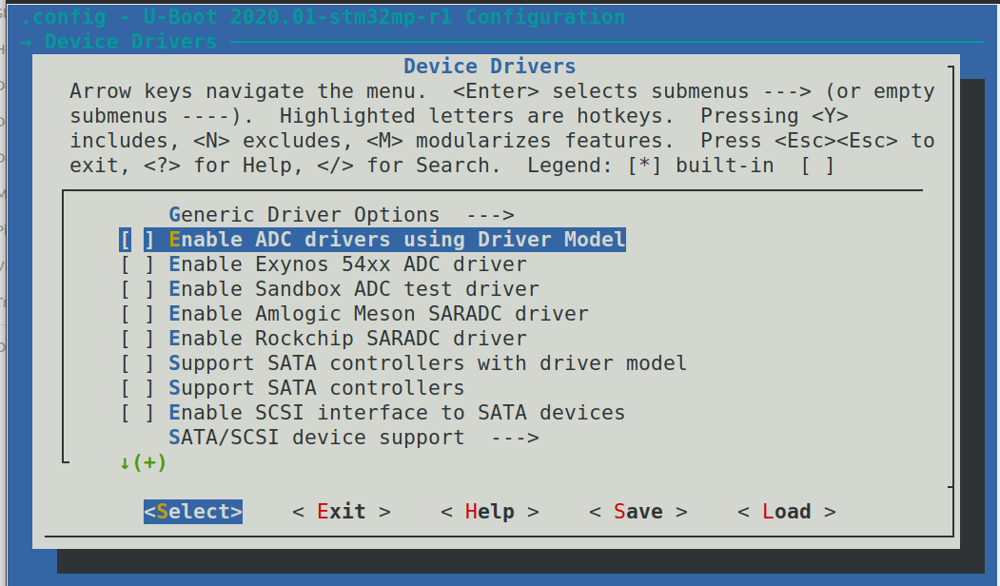
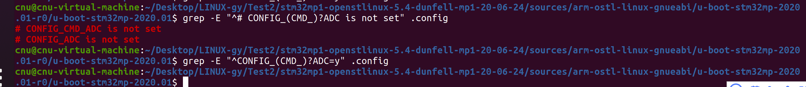
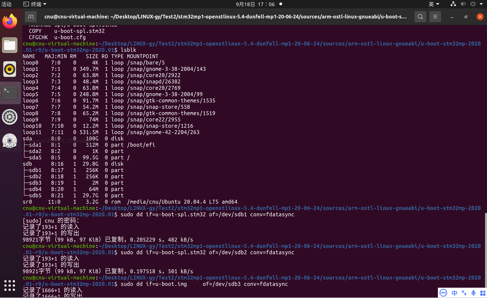
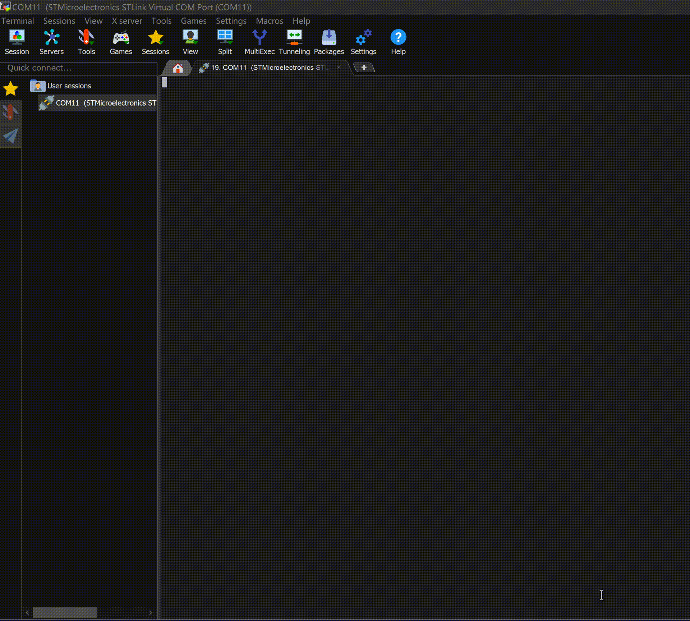
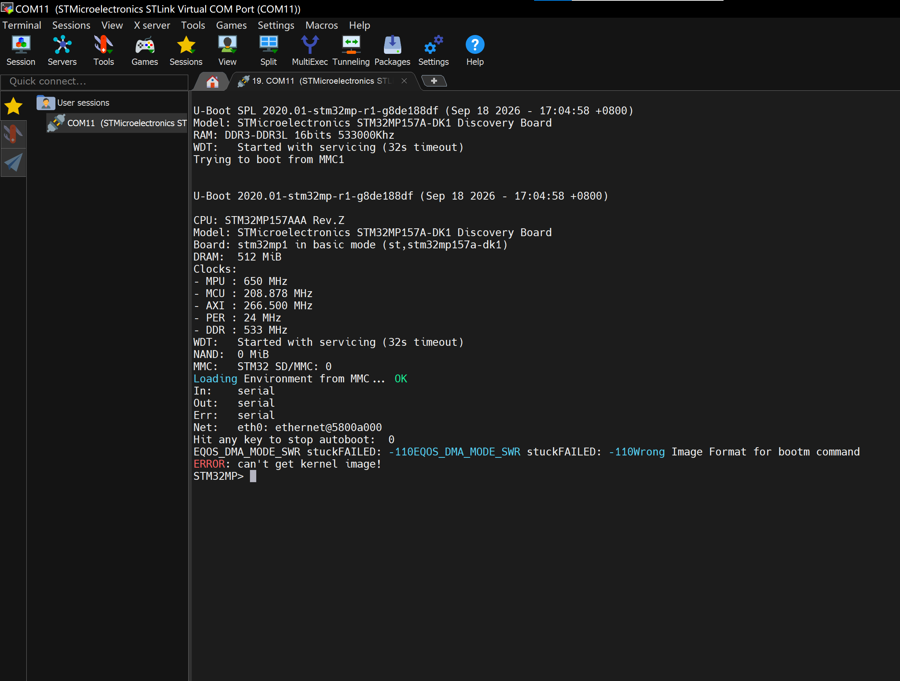

# 实验七 F-3 去掉 ADC 功能——关掉 DK1 的"开机电流检测"

> **对应课件**：《第3章 移植U-Boot》3.5 节，Slide 66-68
>
> **系列说明**：本系列基于华清远见 FS-MP1A（STM32MP157A）开发板，对应课件《第3章 移植U-Boot》。本文覆盖 Slide 66-68，是驱动修复系列（F-1~F-6）的第三站 **F-3**。前置：实验六（F-2）已完成——basic 版 U-Boot 首次完整启动，已停在 `STM32MP>` 命令行，但启动日志里还挂着 ADC 相关报错。

## 一、先看病根：DK1 靠 ADC 检测开机电流

实验六的实测日志里，`Err: serial` 之后跟着这几条报错：

```
stm32 vrefbuf timed out: -110
adc@0: can't enable vdd-supply!board_check_usb_power: single shot failed for adc@0[18]!
```

（`adc@0:` 与 `board_check_usb_power:` 两条挤在一行，与实验五 SPL 阶段的现象同类，是串口原样输出。）

课件 Slide 66 给出病因：

> 以下错误提示是由于dk1开发板会通过ADC检测开机电流，而FS-MP1A开发板无此功能
>
> 在u-boot配置中，去掉ADC功能即可，按如下路径去掉[ ]的*号

把这条电路拆开看：DK1 板上有一套"开机电流检测"设计——`vrefbuf`（参考电压缓冲器）给 ADC 提供基准电压，`adc@0` 是 ADC 本体；U-Boot 启动收尾时执行 `board_check_usb_power()`，用 ADC 做一次"single shot"（单次采样）来测开机电流，判断电源是否带得动整板。FS-MP1A 没有这条电路，于是"供基准 → 开 ADC → 采样"步步报错（`-110` = `-ETIMEDOUT`，超时）：


> 图：课件 Slide 66——串口报错截图：`stm32 vrefbuf timed out: -110`、`adc@0: can't enable vdd-supply!board_check_usb_power: single shot failed for adc@0[18]!`、`Net:` 等。病因是 DK1 通过 ADC 检测开机电流而 FS-MP1A 无此功能，需在 u-boot 配置中去掉 ADC 功能。

**修法**：这次不动设备树，改配置——menuconfig 里关掉两个开关：

- `Command line interface → Device access commands → adc`：命令行里的 `adc` 命令（配置项 `CONFIG_CMD_ADC`）；
- `Device Drivers → Enable ADC drivers using Driver Model`：ADC 驱动本体（配置项 `CONFIG_ADC`）。

为什么是两个？`adc` 命令只是命令行入口，它依赖 ADC 驱动；把驱动关掉，U-Boot 里就不存在 ADC 设备，`board_check_usb_power()` 那条检测链整个不再执行。两个一起关，才算"去掉 ADC 功能"。

## 二、实验环境（实际）

| 项目 | 实际值 |
|---|---|
| 虚拟机 | 同实验一（VMware + Ubuntu 20.04，4GB 内存） |
| 源码目录 | `~/Desktop/LINUX-gy/Test2/stm32mp1-openstlinux-5.4-dunfell-mp1-20-06-24/sources/arm-ostl-linux-gnueabi/u-boot-stm32mp-2020.01-r0/u-boot-stm32mp-2020.01` |
| 分支 | WORKING |
| 工具链 | `/opt/st/stm32mp1/3.1-openstlinux-5.4-dunfell-mp1-20-06-24`（**每个新终端都要重新激活**，`echo $CC` 确认） |
| 要修改的内容 | `.config`（menuconfig 关两个 ADC 开关）→ 收尾同步进 `configs/stm32mp15_fsmp1a_basic_defconfig` |
| 串口 | MobaXterm Serial 会话（COM11），115200（同实验一） |
| SD 卡 | `/dev/sdb`（实验四已分好区，本实验只需重烧三个镜像） |

## 三、课件 ↔ 步骤对应表

| 课件 Slide | 内容 | 对应步骤 |
|---|---|---|
| 66 | F-3 总述：ADC 报错病因与"去掉 ADC 功能"的思路 | 本文第一节 + 步骤 2 |
| 67 | menuconfig 路径一：Command line interface → Device access commands，去掉 `adc` 行的 `*` | 步骤 3 |
| 68 | menuconfig 路径二：Device Drivers，去掉 `Enable ADC drivers using Driver Model` 行的 `*` | 步骤 3 |
| —（沿用实验六 Slide 64 的流程） | 重新编译、烧写、上电验证 | 步骤 4~6 |

## 四、实验步骤

### 步骤 1：激活工具链，进入源码目录

```bash
cd ~/Desktop/LINUX-gy/Test2/stm32mp1-openstlinux-5.4-dunfell-mp1-20-06-24/sources/arm-ostl-linux-gnueabi/u-boot-stm32mp-2020.01-r0/u-boot-stm32mp-2020.01

. /opt/st/stm32mp1/3.1-openstlinux-5.4-dunfell-mp1-20-06-24/environment-setup-cortexa7t2hf-neon-vfpv4-ostl-linux-gnueabi

echo $CC    # 输出 arm-ostl-linux-gnueabi-gcc ... 才算激活成功
```

### 步骤 2：确认当前配置里 ADC 是开着的（Slide 66）

```bash
grep -E "^CONFIG_(CMD_)?ADC=y" .config
```

预期输出恰好两行：

```
CONFIG_ADC=y
CONFIG_CMD_ADC=y
```

两行都在，说明现在的镜像带着完整的 ADC 功能——正是启动报错的来源。接下来用 menuconfig 把它们关掉。

### 步骤 3：menuconfig 关掉两个 ADC 开关（Slide 67-68）

```bash
make menuconfig
```

按课件给的两条路径逐个走。


> 图：课件 Slide 67——去掉 ADC 功能的两条菜单路径总览：`Command line interface ---> → Device access commands ---> → [ ] adc - Access Analog to Digital Converters info and data`；以及 `Device Drivers ---> → [ ] Enable ADC drivers using Driver Model`。两项都要去掉 `*`。

**路径一：关掉 `adc` 命令**（Slide 67）

主菜单 → `Command line interface --->` → `Device access commands --->`，找到这一行：

```
[*] adc - Access Analog to Digital Converters info and data
```

光标移上去，按**空格**，`[*]` 变成 `[ ]`。

> menuconfig 小技巧：任何界面按 `/` 可按关键字搜索配置项，结果里直接给出该项所在的菜单路径——在两条路径之间迷路时，用它跳转最省事。

路径一在 menuconfig 里的实际界面（课件截图）：


> 图：课件 Slide 67——`Device access commands` 子菜单：高亮行 `[ ] adc - Access Analog to Digital Converters info and data` 已去掉 `*`；同屏的 `armflash`、`bcd`、`bind/unbind`、`clk`、`demo`、`dfu`、`dm`、`fastboot`、`fdcboot` 等其余命令保持原样，不要动。

**路径二：关掉 ADC 驱动**（Slide 68）

连按两次 `Esc`（或选 `Exit`）回到主菜单 → `Device Drivers --->`，找到这一行：

```
[*] Enable ADC drivers using Driver Model
```

同样按**空格**去掉 `*`。注意它正下方还有 Exynos / Sandbox / Meson / Rockchip 等一堆别的 ADC 驱动——它们本来就是 `[ ]` 未选中状态，**不用动**（课件截图里也在同一屏，看清高亮行再按键）。


> 图：课件 Slide 68——`Device Drivers` 子菜单：`[ ] Enable ADC drivers using Driver Model` 高亮，此行不要选中（去掉 `[ ]` 中的 `*` 号）；其下的 `Enable Exynos 54xx ADC driver`、`Enable Sandbox ADC test driver`、`Enable Amlogic Meson SARADC driver`、`Enable Rockchip SARADC driver` 本就是未选中状态，不用动。

最后一路 `Exit` 退出，弹出 `Do you wish to save your new configuration?` 时选 `<Yes>`——不保存等于白改。

改完自检：

```bash
grep -E "^# CONFIG_(CMD_)?ADC is not set" .config    # 预期恰好两行
grep -E "^CONFIG_(CMD_)?ADC=y" .config               # 预期无输出
```

**实际执行结果**：


> 图：menuconfig 改完保存后的自检实测——`grep -E "^# CONFIG_(CMD_)?ADC is not set" .config` 恰好两行（`CONFIG_CMD_ADC` 与 `CONFIG_ADC` 均已 not set），`grep -E "^CONFIG_(CMD_)?ADC=y" .config` 无输出。

### 步骤 4：重新编译（沿用实验六流程）

```bash
make -j2 all DEVICE_TREE=stm32mp157a-fsmp1a
```

这次关掉的是 C 代码级的驱动，比实验六"只重编设备树"要重编、重链的东西多一些，但仍几分钟内完成，照样以 `MKIMAGE spl/u-boot-spl.stm32` 收尾。

**实际执行结果**：编译收尾输出见下一步骤截图顶部（`MKIMAGE spl/u-boot-spl.stm32` → `COPY` → `CFGCHK u-boot.cfg`）。

### 步骤 5：烧写 SD 卡（沿用实验六流程）

```bash
lsblk                                   # 先确认 SD 卡仍是 /dev/sdb
sudo dd if=u-boot-spl.stm32 of=/dev/sdb1 conv=fdatasync
sudo dd if=u-boot-spl.stm32 of=/dev/sdb2 conv=fdatasync
sudo dd if=u-boot.img     of=/dev/sdb3 conv=fdatasync
```

配置开关是编进镜像里的，SPL 和 U-Boot 本体的二进制都变了，三条照旧全烧。

**实际执行结果**：


> 图：重新编译与烧写实测——编译以 `MKIMAGE spl/u-boot-spl.stm32`、`COPY`、`CFGCHK u-boot.cfg` 收尾（截图顶部）；`lsblk` 确认 SD 卡仍是 `/dev/sdb`（sdb1~sdb5 齐全）；三条 dd 分别写入 sdb1、sdb2（各 98921 字节）与 sdb3，全部成功。

### 步骤 6：上电验证

板子断电 → 插卡 → 拨码 `101` → 上电，看 MobaXterm 串口。

**这一站的里程碑**：实验六日志里的三条 ADC 报错（`stm32 vrefbuf timed out` / `adc@0: can't enable vdd-supply!` / `single shot failed`）消失，其余行为不变——仍停在 `STM32MP>` 命令行。

对照点：

| 看什么 | 达标判据 |
|---|---|
| `Err: serial` 与 `Net:` 之间 | `stm32 vrefbuf timed out`、`adc@0: can't enable vdd-supply!`、`single shot failed` **不再出现**——原来占着这里的三行报错没了 |
| 命令行 | 仍停在 `STM32MP>`，命令可用——去掉 ADC 没有影响其他功能 |

**实际执行结果**（2026-09-18 实测）：

```
U-Boot SPL 2020.01-stm32mp-r1-g8de188df (Sep 18 2026 - 17:04:58 +0800)
Model: STMicroelectronics STM32MP157A-DK1 Discovery Board
RAM: DDR3-DDR3L 16bits 533000Khz
WDT:   Started with servicing (32s timeout)
Trying to boot from MMC1

U-Boot 2020.01-stm32mp-r1-g8de188df (Sep 18 2026 - 17:04:58 +0800)

CPU: STM32MP157AAA Rev.Z
Model: STMicroelectronics STM32MP157A-DK1 Discovery Board
Board: stm32mp1 in basic mode (st,stm32mp157a-dk1)
DRAM:  512 MiB
Clocks:
- MPU : 650 MHz
- MCU : 208.878 MHz
- AXI : 266.500 MHz
- PER : 24 MHz
- DDR : 533 MHz
WDT:   Started with servicing (32s timeout)
NAND:  0 MiB
MMC:   STM32 SD/MMC: 0
Loading Environment from MMC... OK
In:    serial
Out:   serial
Err:   serial
Net:   eth0: ethernet@5800a000
Hit any key to stop autoboot:  0
EQOS_DMA_MODE_SWR stuckFAILED: -110EQOS_DMA_MODE_SWR stuckFAILED: -110Wrong Image Format for bootm command
ERROR: can't get kernel image!
STM32MP>
```

**怎么解读这份输出：**

| 看到什么 | 说明什么 |
|---|---|
| `Err: serial` 之后直接就是 `Net:`，原来挤在中间的三条 ADC 报错**全部消失** | **F-3 达标**。连 `stm32 vrefbuf timed out` 也没了——vrefbuf 给 ADC 供基准电压，ADC 驱动一关，"供基准 → 开 ADC → 采样"整条检测链不再执行 |
| 版本串 `g8de188df` 后面**没有** `-dirty` 后缀 | `.config` 是不入库的构建产物（被 `.gitignore` 忽略），改 menuconfig 不会弄脏工作区；这个哈希正是实验六收尾时 F-2 的提交——顺带证明那步提交已完成 |
| `EQOS_DMA_MODE_SWR stuck`×2、`Wrong Image Format for bootm command` 照旧 | 网卡（F-5 对象）与"卡上还没有内核"的报错，不归 F-3 管，与实验六完全一致 |
| 停在 `STM32MP>` | 去掉 ADC 没有影响其他功能，命令行照常可用 |


> 图：上电实测动图——从 SPL 到 U-Boot 本体的启动全程不再出现 `vrefbuf` / `adc@0` 报错，`Err: serial` 之后直接 `Net:`，autoboot 尝试失败后停在 `STM32MP>` 命令行。


> 图：串口完整启动日志截图（2026-09-18 17:04 构建的镜像，版本串 `g8de188df` 无 `-dirty`），与上文实测记录一致。

### 步骤 7：收尾——defconfig 同步 + git 提交

这次动过 menuconfig，按 F-1 定下的规矩：**`.config` 的改动必须固化回 defconfig**，否则下次 `make stm32mp15_fsmp1a_basic_defconfig` 会把这次的成果冲掉：

```bash
cp .config configs/stm32mp15_fsmp1a_basic_defconfig
git status          # 应只有 1 个文件被修改：configs/stm32mp15_fsmp1a_basic_defconfig
git add -A
git commit -m "F-3: 去掉 ADC 功能（关闭 CMD_ADC 与 DM ADC）"
```

**实际执行结果**：待补充

## 五、注意事项

1. **只关两个开关**：`Device access commands` 里的 `adc`、`Device Drivers` 里的 `Enable ADC drivers using Driver Model`。其余 ADC 驱动（Exynos/Sandbox/Meson/Rockchip）本来就未选中，不要顺手清理。
2. **两个开关缺一不可**：`adc` 命令依赖 ADC 驱动；只关驱动，menuconfig 会因依赖关系连命令一并隐藏，但显式把两个都确认一遍最稳。
3. **退出必须保存**：menuconfig 退出时的保存确认框选 `<Yes>`；不保存的退出等于什么都没做。
4. **defconfig 必须同步**：改过 menuconfig 就要 `cp .config configs/...`（F-1 规矩），提交里应只有 defconfig 一个文件。
5. **三条镜像照旧全烧**：配置开关编进了 SPL 与 U-Boot 本体，只烧 sdb3 不够。
6. **成功标准是"ADC 报错消失 + 命令行还在"**：网卡（EQOS）报错与 bootm 找不到内核的报错不在本站范围。

## 六、怎么验证 F-3 改对了

### 第一层：源码自检（半分钟）

```bash
grep -E "^# CONFIG_(CMD_)?ADC is not set" .config     # 期望恰好两行
grep ADC configs/stm32mp15_fsmp1a_basic_defconfig     # 步骤 7 之后执行：期望两行均为 # ... is not set
```

### 第二层：编译通过

开关关闭后，`drivers/adc/` 与 `cmd/adc.c` 不再参与编译；若误关了别的依赖项，Kconfig 或编译阶段会报错——此时先把两个 ADC 开关恢复，用 `git diff configs/stm32mp15_fsmp1a_basic_defconfig` 查出多关了什么。

### 第三层：上电实测（唯一能证明"真的生效"）

判据三条同时成立才算达标：

1. `stm32 vrefbuf timed out`、`adc@0: can't enable vdd-supply!`、`single shot failed` 不再出现；
2. U-Boot 横幅与 `Board: stm32mp1 in basic mode (...)` 照常出现；
3. 停在 `STM32MP>`，命令可用。

不达标时的排查顺序：

| 现象 | 先查什么 |
|---|---|
| ADC 三条报错原样还在 | 两个开关真的关了吗（`grep .config`）；退出 menuconfig 时保存了吗；镜像重新编译、三条 dd 重新烧写了吗（串口版本串的时间戳变没变） |
| 编译报错 / 配置跑偏 | 是否误关了别的项——`git diff configs/stm32mp15_fsmp1a_basic_defconfig` 看 defconfig 里除了 ADC 还变了什么 |
| 串口完全没有输出 | 回到实验四步骤 8 的排查（供电、拨码、串口） |

### 最后一道验证：提交本身

`git show --stat HEAD` 复核：本次应**只有 1 个文件**（`configs/stm32mp15_fsmp1a_basic_defconfig`）。多出别的文件，说明有"顺手改动"混进来了。

## 七、实验完成标志

- `.config` 与 `configs/stm32mp15_fsmp1a_basic_defconfig` 中 `CONFIG_ADC`、`CONFIG_CMD_ADC` 均为 not set
- 重新编译成功，三个镜像已重新烧写到 sdb1 / sdb2 / sdb3
- 串口不再出现 `stm32 vrefbuf timed out`、`adc@0: can't enable vdd-supply!`、`single shot failed`
- 串口仍停在 `STM32MP>` 命令行
- 已完成 defconfig 同步与 git 提交（仅 1 个文件）

## 八、下一步

ADC 这条电路从启动日志里清掉了，下一处"碍眼"的是显示：DK1 的屏幕在 U-Boot 阶段由 **LTDC 显示控制器**（LCD-TFT display controller）驱动，FS-MP1A 的屏与 DK1 接法不同，目前无法正常显示——而 U-Boot 阶段根本用不着屏幕，课件的办法是直接**关闭 LTDC**（设备树一处 `status` 改动）。请看《实验八 F-4 关闭 LTDC 显示》。
