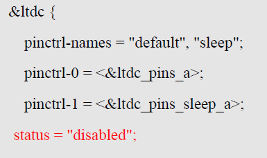
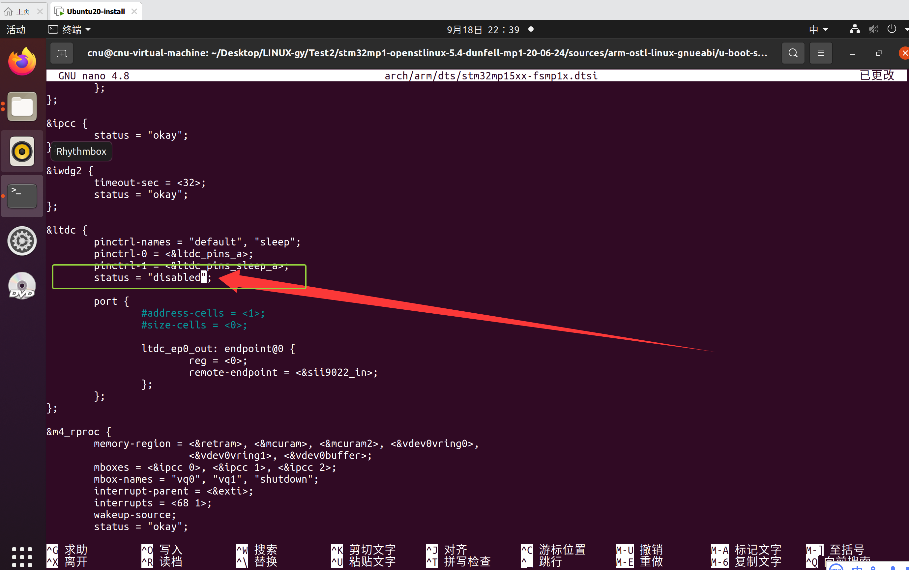
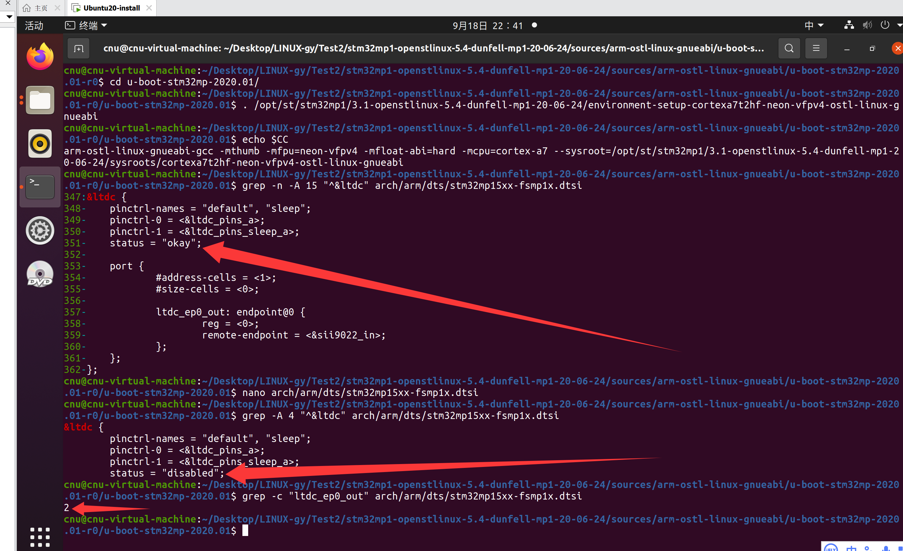
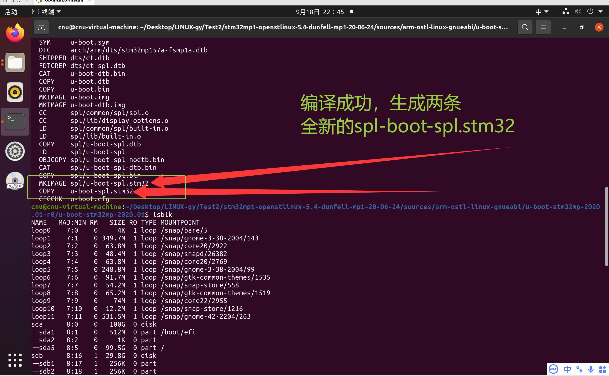
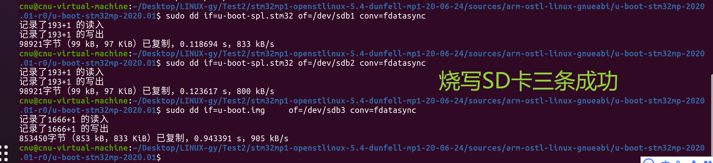
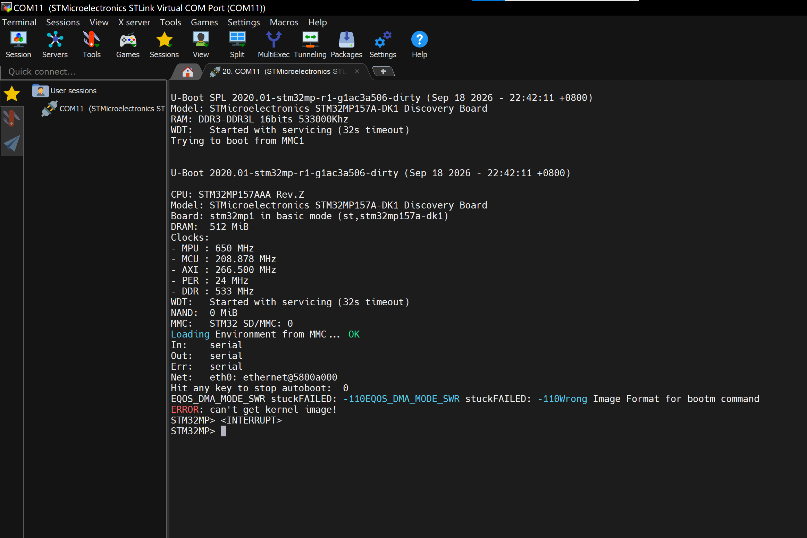
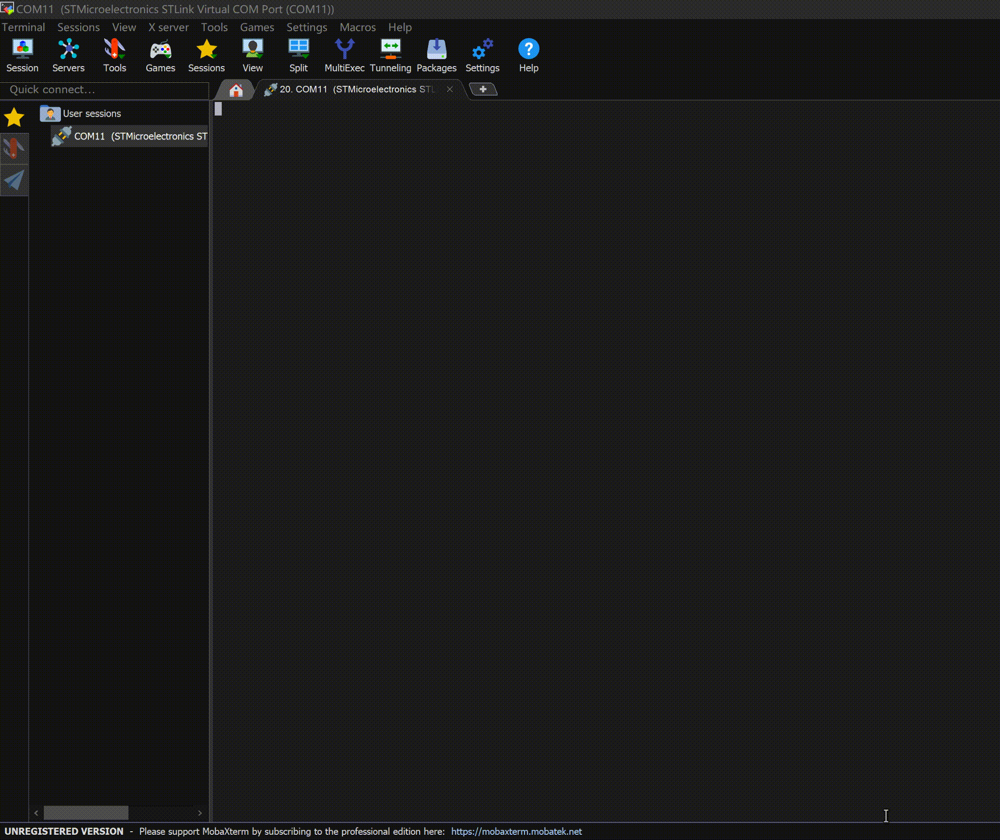

# 实验八 F-4 关闭 LTDC 显示——把用不上的屏幕控制器请出去

> **对应课件**：《第3章 移植U-Boot》3.5 节，Slide 69
>
> **系列说明**：本系列基于华清远见 FS-MP1A（STM32MP157A）开发板，对应课件《第3章 移植U-Boot》。本文覆盖 Slide 69，是驱动修复系列（F-1~F-6）的第四站 **F-4**。前置：实验七（F-3）已完成——ADC 相关报错全部消失，板子已能停在 `STM32MP>` 命令行，启动日志里还剩网卡等报错。

## 一、先看病根：用不上的显示控制器

**LTDC**（LCD-TFT display controller）是 STM32MP1 芯片内部的显示控制器：它把显存里的像素按行同步地"打"给显示屏，是整颗芯片负责画面输出的部件。

我们的设备树照抄自 DK1（实验三），DK1 的显示链路是这样的：LTDC 从 `port` 段送出像素，经 `ltdc_ep0_out` 端点交给 **sii9022**（挂在 I2C1 上的 HDMI 桥接芯片），最终从 HDMI 口输出。而 FS-MP1A 的显示接口与 DK1 硬件设计不同，这条链路对不上实物；更要紧的是——**U-Boot 阶段我们全程靠串口操作，屏幕根本用不上**。

课件 Slide 69 给出处理意见：

> 目前显示驱动还有问题，屏幕无法正常显现
>
> 在u-boot阶段不需要用到屏幕，因此关闭LTDC即可

**修法**：`arch/arm/dts/stm32mp15xx-fsmp1x.dtsi` 里 `&ltdc` 节点的 `status` 由 `"okay"` 改为 `"disabled"`，一行搞定。

先打个预防针：与 F-3"报错当场消失"不同，**F-4 在串口上是"看不出变化"的**——LTDC 在现有启动日志里本来就没冒过一句泡（它没报过错，只是一颗用不上还开着的控制器）。所以这一站的验证重心在源码与编译产物层面（第六节），串口只要"没有新报错 + 命令行照常"就是成功。

## 二、实验环境（实际）

| 项目 | 实际值 |
|---|---|
| 虚拟机 | 同实验一（VMware + Ubuntu 20.04，4GB 内存） |
| 源码目录 | `~/Desktop/LINUX-gy/Test2/stm32mp1-openstlinux-5.4-dunfell-mp1-20-06-24/sources/arm-ostl-linux-gnueabi/u-boot-stm32mp-2020.01-r0/u-boot-stm32mp-2020.01` |
| 分支 | WORKING |
| 工具链 | `/opt/st/stm32mp1/3.1-openstlinux-5.4-dunfell-mp1-20-06-24`（**每个新终端都要重新激活**，`echo $CC` 确认） |
| 要修改的文件 | `arch/arm/dts/stm32mp15xx-fsmp1x.dtsi`（只改 `&ltdc` 的 `status` 一行） |
| 串口 | MobaXterm Serial 会话（COM11），115200（同实验一） |
| SD 卡 | `/dev/sdb`（实验四已分好区，本实验只需重烧三个镜像） |

## 三、课件 ↔ 步骤对应表

| 课件 Slide | 内容 | 对应步骤 |
|---|---|---|
| 69 | F-4 总述：关闭 LTDC，`&ltdc` 的修改结果 | 本文第一节 + 步骤 2~3 |
| —（沿用实验六 Slide 64 的流程） | 重新编译、烧写、上电验证 | 步骤 4~6 |

## 四、实验步骤

### 步骤 1：激活工具链，进入源码目录

```bash
cd ~/Desktop/LINUX-gy/Test2/stm32mp1-openstlinux-5.4-dunfell-mp1-20-06-24/sources/arm-ostl-linux-gnueabi/u-boot-stm32mp-2020.01-r0/u-boot-stm32mp-2020.01

. /opt/st/stm32mp1/3.1-openstlinux-5.4-dunfell-mp1-20-06-24/environment-setup-cortexa7t2hf-neon-vfpv4-ostl-linux-gnueabi

echo $CC    # 输出 arm-ostl-linux-gnueabi-gcc ... 才算激活成功
```

### 步骤 2：定位 `&ltdc` 节点（Slide 69）

```bash
grep -n -A 15 "^&ltdc" arch/arm/dts/stm32mp15xx-fsmp1x.dtsi
```

预期输出恰好一处 `&ltdc` 节点（行号以你文件里的实际结果为准），全文如下：

```dts
&ltdc {
	pinctrl-names = "default", "sleep";
	pinctrl-0 = <&ltdc_pins_a>;
	pinctrl-1 = <&ltdc_pins_sleep_a>;
	status = "okay";

	port {
		#address-cells = <1>;
		#size-cells = <0>;

		ltdc_ep0_out: endpoint@0 {
			reg = <0>;
			remote-endpoint = <&sii9022_in>;
		};
	};
};
```

这就是 DK1 显示链路的设备树描述：三行 `pinctrl-*` 管引脚复用，`status = "okay"` 表示驱动会探测这个控制器，`port` 段把像素出口（`ltdc_ep0_out`）接向 sii9022 的入口（`sii9022_in`）。

> **先划一道红线**：本实验只改 `status` 一行，`port` 段**原样保留、绝对不要删**。原因见下一节——sii9022 那一头还引用着这里的 `ltdc_ep0_out` 标签。

### 步骤 3：把 `status` 改成 `disabled`（Slide 69）

用 nano 打开：

```bash
nano arch/arm/dts/stm32mp15xx-fsmp1x.dtsi
```

把 `&ltdc` 节点里的这一行：

```dts
	status = "okay";
```

改成：

```dts
	status = "disabled";
```

只动这一个词：`okay` → `disabled`。节点里其余内容（三行 `pinctrl-*` 和整个 `port` 段）**一个字都不要动**。保存退出（`Ctrl+S` 保存，`Ctrl+X` 退出）。

> 可选（一行替换，不用开编辑器）：
>
> ```bash
> sed -i '/^&ltdc {/,/^};/ s/status = "okay"/status = "disabled"/' arch/arm/dts/stm32mp15xx-fsmp1x.dtsi
> ```
>
> `/^&ltdc {/,/^};/` 把替换范围限定在 `&ltdc` 节点内部（顶格的 `};` 才是节点收尾，`port` 里缩进的 `};` 不会被误当边界），所以不会伤到文件里其他节点的 `status`。

**为什么只改这一行，课件截图里却"看不到"port 段？** 课件 Slide 69 的截图是节点**上半部分的截取**——连收尾的 `};` 都没拍到，红字标出的改动也只有 `status = "disabled";` 一行。要是把 `port` 段删掉，文件就编不过了：sii9022 节点里的端点写着 `remote-endpoint = <&ltdc_ep0_out>`，`port` 一删，这个标签就不存在了，设备树编译器立刻报 `Reference to non-existent node or label`。而 `status = "disabled"` 的节点里保留 `port` 完全合法——"关闭"关的是**驱动不再探测**这个控制器，节点结构本身还在，引用照常成立。

修改结果与课件 Slide 69 的红字一致：


> 图：课件 Slide 69——`&ltdc` 节点修改结果（红字 `status = "disabled";`）。课件截图是节点上半部分的截取，实际只需改红字这一行；三行 `pinctrl-*` 与 `port` 段原样保留。

改完自检：

```bash
grep -A 4 "^&ltdc" arch/arm/dts/stm32mp15xx-fsmp1x.dtsi     # status 应为 "disabled"
grep -c "ltdc_ep0_out" arch/arm/dts/stm32mp15xx-fsmp1x.dtsi # 应为 2（定义 + sii9022 的引用，port 还在的旁证）
```

**实际执行结果**（2026-09-18 实测）：


> 图：nano 里改完的样子——`status = "disabled";` 已就位（红箭头所指），下方 `port` 段原样保留。此刻尚未保存，接着 `Ctrl+S` 保存、`Ctrl+X` 退出。


> 图：自检实测——上方 `grep -n -A 15 "^&ltdc"` 是改动前定位（`&ltdc` 在第 347 行，`status = "okay"`，port 段完整可见）；nano 保存退出后再查，`grep -A 4` 显示 `status = "disabled"`（红箭头），`grep -c "ltdc_ep0_out"` 输出 `2`（port 段还在的旁证），全部与预期一致。

### 步骤 4：重新编译（沿用实验六流程）

```bash
make -j2 all DEVICE_TREE=stm32mp157a-fsmp1a
```

和实验六一样只动了设备树，编译是"重编 dtb + 重新打包"的轻量活，一两分钟，以 `MKIMAGE spl/u-boot-spl.stm32` 收尾。编译本身也是一次校验——万一 `port` 段被误删或改坏，`dtc` 在这一步就会把悬空引用揪出来。

**实际执行结果**（2026-09-18 实测）：编译顺利通过——`port` 段的保留经受住了 `dtc` 的检验。


> 图：编译收尾——`MKIMAGE spl/u-boot-spl.stm32`、`COPY u-boot-spl.stm32`、`CFGCHK u-boot.cfg` 后回到提示符（红框），与实验六同款收尾；截图下部的 `lsblk` 顺手确认 SD 卡仍在 `/dev/sdb`（sdb1/sdb2 各 256K 可见），为下一步烧写做准备。

### 步骤 5：烧写 SD 卡（沿用实验六流程）

```bash
lsblk                                   # 先确认 SD 卡仍是 /dev/sdb
sudo dd if=u-boot-spl.stm32 of=/dev/sdb1 conv=fdatasync
sudo dd if=u-boot-spl.stm32 of=/dev/sdb2 conv=fdatasync
sudo dd if=u-boot.img     of=/dev/sdb3 conv=fdatasync
```

> **为什么三条照旧全烧？** SPL 里也打包了一份同一套设备树（SPL 靠它做最小初始化）。虽然 SPL 阶段根本不碰显示，但三条全烧能保证卡上不存在"新旧混搭"，排查问题时不用多想一步。

**实际执行结果**（2026-09-18 实测）：


> 图：三条 dd 实测——`u-boot-spl.stm32` → sdb1、`u-boot-spl.stm32` → sdb2（各 98921 字节）、`u-boot.img` → sdb3（853450 字节），每条都以"记录了 … 的读入/写出"收尾，烧写成功。

### 步骤 6：上电验证

板子断电 → 插卡 → 拨码 `101` → 上电，看 MobaXterm 串口。

**这一站的里程碑**：串口输出与实验七**完全一致**——没有新增任何报错，U-Boot 横幅照常，仍停在 `STM32MP>` 命令行。再强调一遍预期：F-4 的改动在串口里"看不见"（LTDC 本来就不报错），"改对了"由步骤 2~3 的自检与第六节的产物级验证来证明，串口只要证明"没改坏"。

**实际执行结果**：

```
U-Boot SPL 2020.01-stm32mp-r1-g1ac3a506-dirty (Sep 18 2026 - 22:42:11 +0800)
Model: STMicroelectronics STM32MP157A-DK1 Discovery Board
RAM: DDR3-DDR3L 16bits 533000Khz
WDT:   Started with servicing (32s timeout)
Trying to boot from MMC1


U-Boot 2020.01-stm32mp-r1-g1ac3a506-dirty (Sep 18 2026 - 22:42:11 +0800)

CPU: STM32MP157AAA Rev.Z
Model: STMicroelectronics STM32MP157A-DK1 Discovery Board
Board: stm32mp1 in basic mode (st,stm32mp157a-dk1)
DRAM:  512 MiB
Clocks:
- MPU : 650 MHz
- MCU : 208.878 MHz
- AXI : 266.500 MHz
- PER : 24 MHz
- DDR : 533 MHz
WDT:   Started with servicing (32s timeout)
NAND:  0 MiB
MMC:   STM32 SD/MMC: 0
Loading Environment from MMC... OK
In:    serial
Out:   serial
Err:   serial
Net:   eth0: ethernet@5800a000
Hit any key to stop autoboot:  0
EQOS_DMA_MODE_SWR stuckFAILED: -110EQOS_DMA_MODE_SWR stuckFAILED: -110Wrong Image Format for bootm command
ERROR: can't get kernel image!
STM32MP>

```


> 图：MobaXterm（COM11）实测完整日志——从 SPL 横幅到 `STM32MP>`，与上方文本记录一致；版本串 `2020.01-stm32mp-r1-g1ac3a506-dirty (Sep 18 2026 - 22:42:11 +0800)`。


> 图：上电到 `STM32MP>` 的启动过程动图——节奏与实验七一致，全程无新报错。

**这份日志怎么读**（与实验七那份逐行对照，结论就是"完全一致"）：

| 日志片段 | 解读 |
|---|---|
| 版本串 `g1ac3a506-dirty` | 哈希 `g1ac3a506` = 当前 git HEAD，即**实验七步骤 7 那次 F-3 defconfig 提交**（对照实验六时的 `g8de188df`，哈希前进了恰好一格）；`-dirty` 则是本次 F-4 的 `fsmp1x.dtsi` 改动还在工作区未提交（步骤 7 才提交）——一切符合预期 |
| 无电源报错、无 ADC 报错，`Err: serial` 直达 `Net:` | F-1 / F-3 的成果原样保持 |
| `Loading Environment from MMC... OK` | 同实验六：读到的是卡数据区遗留的有效环境 |
| `EQOS_DMA_MODE_SWR stuckFAILED: -110`×2 → bootm 报错 → `STM32MP>` | 与实验七相同的两类遗留问题：网卡（F-5 处理）、卡上没有内核（内核阶段处理），本站不涉及 |
| 全程没有任何新增报错 | F-4 预期的"安静"：LTDC 本来就不报错，关掉它串口看不出变化——"改对了"由步骤 3 的自检与第六节的产物级验证证明，串口证明的是"没改坏" |

### 步骤 7：收尾——git 提交

F-4 验证通过，把它固化进版本库（沿用 F-1 以来的节奏：验证通过 → 提交留档）：

```bash
git status          # 应只有 1 个文件被修改：arch/arm/dts/stm32mp15xx-fsmp1x.dtsi
git add -A
git commit -m "F-4: 关闭 LTDC 显示控制器（status 改 disabled）"
```

> **为什么不用拷 defconfig？** 与实验六相同：只改设备树，没动 `.config`，`cp .config configs/...` 那一步是给"改过 menuconfig"的情况准备的。

**实际执行结果**（2026-09-18）：`git status` 确认被修改的只有 `arch/arm/dts/stm32mp15xx-fsmp1x.dtsi` 一个文件，提交回显：

```
[WORKING ec8c29dd] F-4: 关闭 LTDC 显示控制器（status 改 disabled）
 1 file changed, 1 insertion(+), 1 deletion(-)
```

版本串接力再进一格：实验四 `g3f0216e7`（初始）→ 实验六 `g2224655f`（F-1）→ 实验七 `g8de188df`（F-2）→ 实验八构建时 `g1ac3a506`（F-3，见步骤 6 日志）→ 本次提交 `ec8c29dd`（F-4）。实验九编译产物的版本串将从 `g ec8c29dd` 起跳。

## 五、注意事项

1. **只改 `status` 一行**：`okay` → `disabled`。三行 `pinctrl-*` 与 `port` 段都不动。
2. **`port` 段删了必编译失败**：`sii9022_in` 端点反向引用着本节点的 `ltdc_ep0_out` 标签，删掉 port 就是悬空引用，`dtc` 报 `Reference to non-existent node or label "ltdc_ep0_out"`。课件截图只是没拍到 port，不等于要删。
3. **`disabled` 不是"删除"**：`status = "disabled"` 的节点里保留 `port` 完全合法，关掉的是驱动探测，不是把节点从文件里抹掉。
4. **三条镜像照旧全烧**：SPL 的 dtb 里也带着这份设备树。
5. **别顺手动别的显示节点**：sii9022、`&dsi`、背光等本站一概不动，课件只改 `&ltdc` 的 `status`。
6. **成功标准**：串口与实验七一致、无新报错、命令行照常；改动本身的正确性靠源码与 dtb 层验证。

## 六、怎么验证 F-4 改对了

改动只有一行，验证分三层：前两层证明"改对了"，第三层证明"没改坏"。

### 第一层：源码自检（半分钟）

```bash
grep -A 4 "^&ltdc" arch/arm/dts/stm32mp15xx-fsmp1x.dtsi     # 期望 status = "disabled"
grep -c "ltdc_ep0_out" arch/arm/dts/stm32mp15xx-fsmp1x.dtsi  # 期望 2：port 里的定义 + sii9022 端点里的引用
```

第二条是"port 还活着"的旁证：定义和引用各占一处，缺一处都说明结构被破坏了。

### 第二层：编译 + 查编译产物（`dtc` 当裁判）

编译通过本身就排除了悬空引用。再从编译产物里反查一眼：

```bash
./scripts/dtc/dtc -I dtb -O dts u-boot.dtb 2>/dev/null | grep -A 8 "ltdc@"
```

反编译出来的节点里，`status` 应为 `"disabled"`（`pinctrl` 与 `port` 里的 phandle 会显示为编译期分配的数字，正常；节点里若多出一个 `u-boot,dm-pre-proper` 属性，那是 `stm32mp15-u-boot.dtsi` 叠加的 U-Boot 专属标记，与本站改动无关）：

```dts
ltdc@5a001000 {
	pinctrl-names = "default", "sleep";
	pinctrl-0 = <0x??>;
	pinctrl-1 = <0x??>;
	status = "disabled";
	...
};
```

### 第三层：上电实测（证明"没改坏"）

判据三条同时成立：

1. 启动日志与实验七完全一致，没有任何新增报错；
2. U-Boot 横幅与 `Board: stm32mp1 in basic mode (...)` 照常出现；
3. 停在 `STM32MP>`，命令可用。

实测（2026-09-18 22:42 构建）：三条全部成立（见步骤 6）。

> 说实话：这三条即使不改 `status` 也成立——所以第三层只能证明"没改坏"，"改对了"由第一、二层证明。这也是 F-4 与 F-1~F-3 最大的不同：前三站串口立刻"变脸"，这一站是安静的结构清理。

不达标时的排查顺序：

| 现象 | 先查什么 |
|---|---|
| 编译报 `Reference to non-existent node or label "ltdc_ep0_out"` | `port` 段是不是被删/改坏了——`grep -c "ltdc_ep0_out"` 应为 2；不对就 `git diff arch/arm/dts/stm32mp15xx-fsmp1x.dtsi` 看改动，改回来 |
| `grep` 里 `status` 还是 `"okay"` | 改错节点了？文件里 `status = "okay"` 有多处，确认 `-A 4` 上下文是 `&ltdc`；nano 是否保存了 |
| 串口完全没有输出 | 回到实验四步骤 8 的排查（供电、拨码、串口） |

### 最后一道验证：提交本身

`git show --stat HEAD` 复核：本次应**只有 1 个文件**（`arch/arm/dts/stm32mp15xx-fsmp1x.dtsi`）。多出别的文件，说明有"顺手改动"混进来了。

## 七、实验完成标志

- `stm32mp15xx-fsmp1x.dtsi` 中 `&ltdc` 的 `status` 已由 `"okay"` 改为 `"disabled"`，`port` 段原样保留（步骤 3 实测）
- 重新编译成功，三个镜像已重新烧写到 sdb1 / sdb2 / sdb3（步骤 4~5 实测）
- 串口启动日志与实验七一致（无新增报错），停在 `STM32MP>` 命令行（步骤 6 实测）
- 已完成 git 提交（仅 1 个文件，`ec8c29dd`）（步骤 7 实测）

## 八、下一步

启动日志里还剩的最后一串"大件"报错就是网卡：倒计时结束后 `EQOS_DMA_MODE_SWR stuckFAILED: -110` 连出两次。根子在于 DK1 板载的网卡芯片与 FS-MP1A 不同——FS-MP1A 用的是国产 MAE0621A 网卡芯片，U-Boot 里得换上对应的驱动文件。这是 F 系列里动手量最大的一站。请看《实验九 F-5 替换网卡驱动》。
