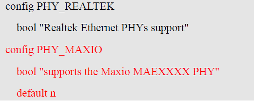
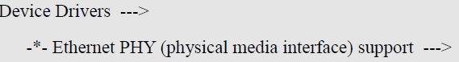
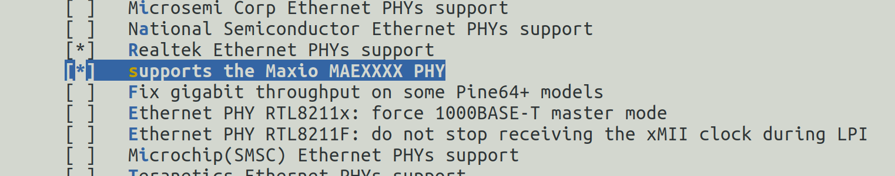
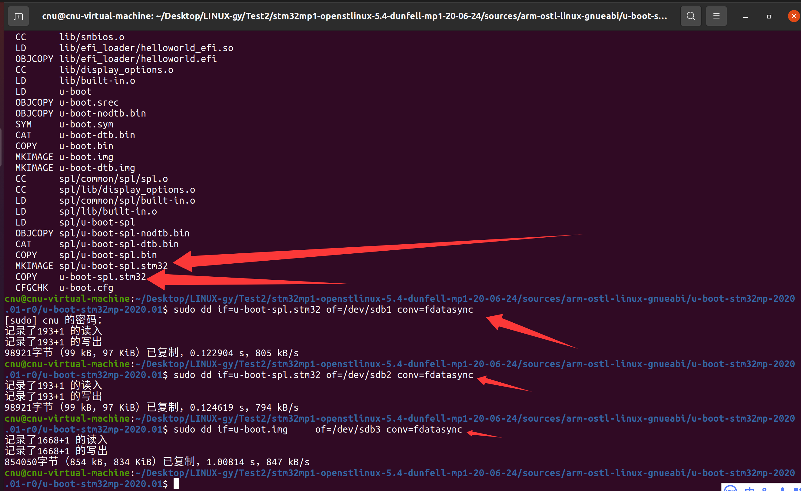
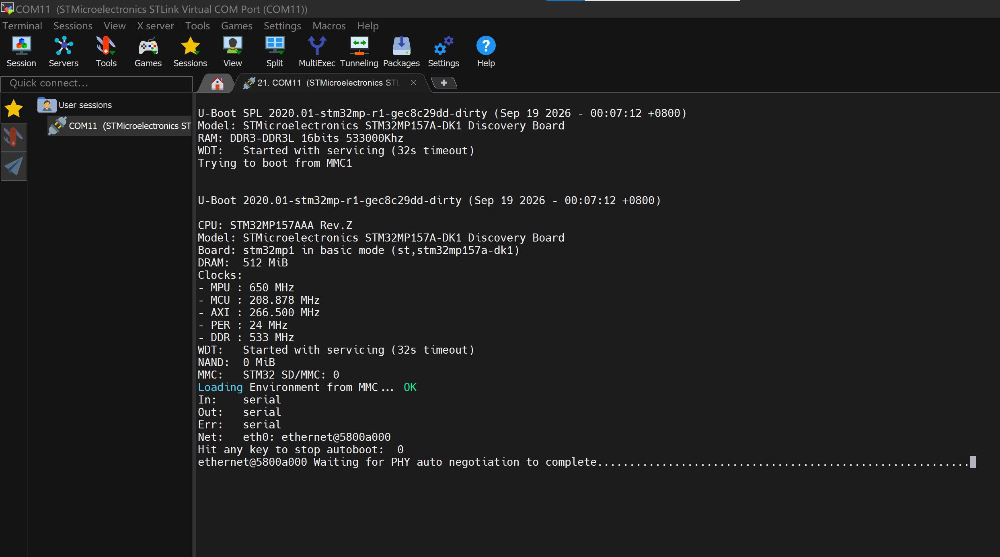
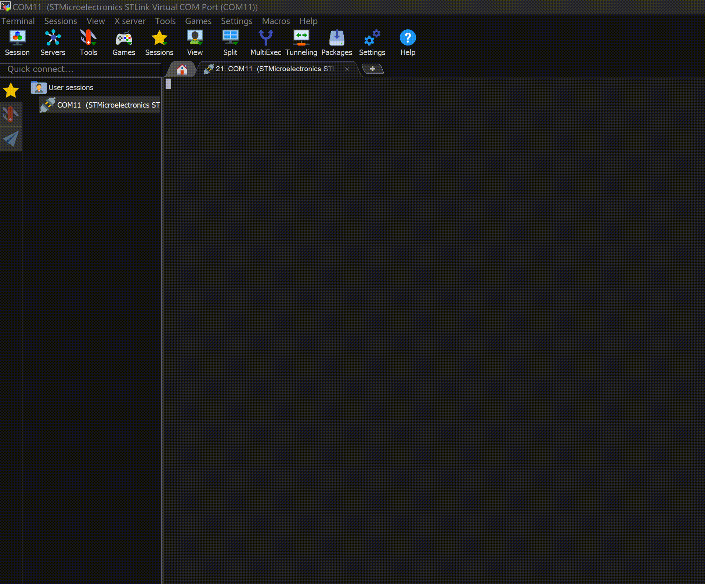
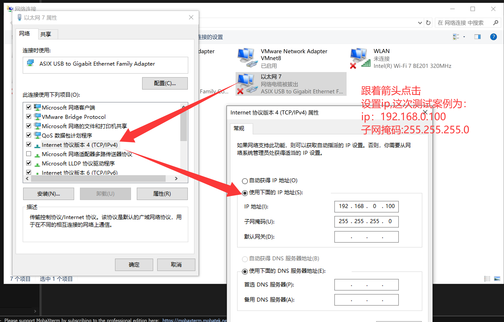
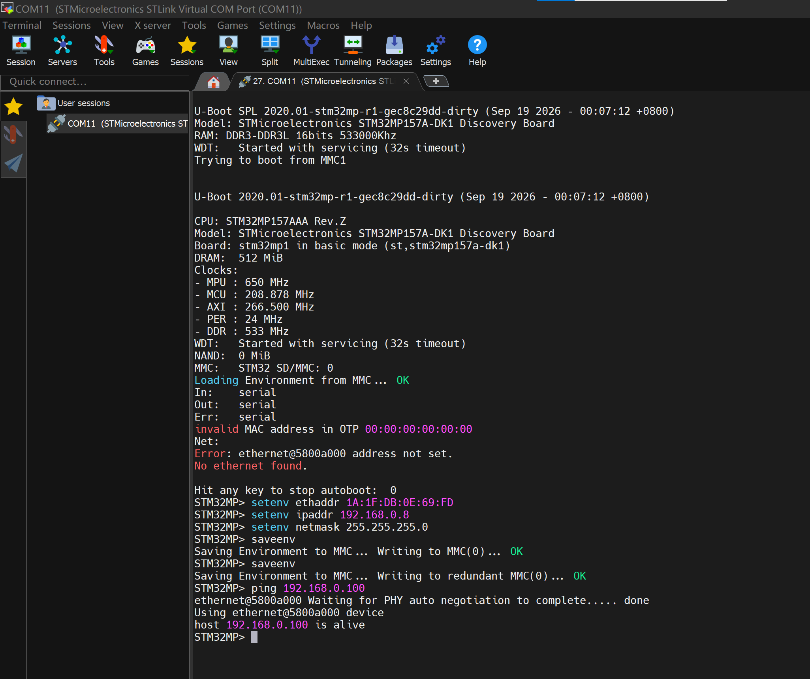
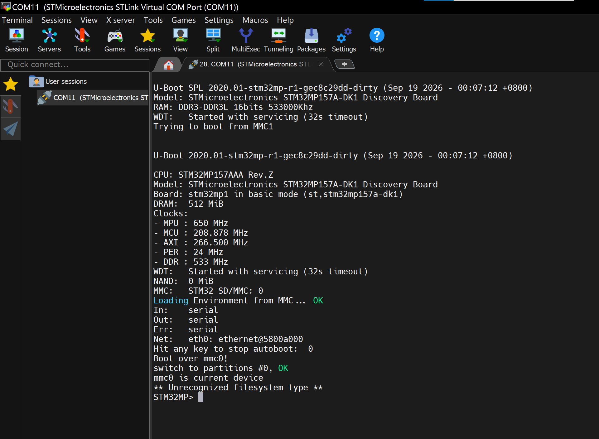

# 实验九 F-5 替换网卡驱动——为 MAE0621A 装上驱动

> **对应课件**：《第3章 移植U-Boot》3.5 节，Slide 70-74
>
> **系列说明**：本系列基于华清远见 FS-MP1A（STM32MP157A）开发板，对应课件《第3章 移植U-Boot》。本文覆盖 Slide 70-74，是驱动修复系列（F-1~F-6）的第五站 **F-5**。前置：实验八（F-4）已完成——LTDC 已关闭，串口无新增报错，启动日志里还剩网卡报错与"找不到内核"两类。

## 一、先看病根：网卡芯片换了，驱动还是 DK1 的

实验六以来的启动日志里，网卡相关的输出一直是这样的两段：

```
Net:   eth0: ethernet@5800a000
...
EQOS_DMA_MODE_SWR stuckFAILED: -110EQOS_DMA_MODE_SWR stuckFAILED: -110
```

`Net:` 一行说明网卡控制器（MAC）注册出来了；但倒计时一结束、U-Boot 真正去初始化网络时，就报 `EQOS_DMA_MODE_SWR stuck`——EQOS（DesignWare Ethernet QoS）是芯片里的 MAC 控制器，SWR 指它的 DMA 软件复位，"stuck" + `-110`（超时）意思是：驱动按 DK1 的路数去初始化，等不到应答。根子和 F-1~F-4 一脉相承——**板子硬件和 DK1 不一样**。

课件 Slide 70 给出病因与对策：

> FS-MP1A V3.0开发板改用了国产网卡芯片MAE0621A，u-boot中没此芯片的驱动，需要在u-boot中添加此芯片的驱动（不用自己写，芯片厂家会提供驱动源码）

网卡工作要"MAC + PHY"两颗芯片配合：MAC 在处理器内部（就是日志里的 `ethernet@5800a000`），PHY 是板上的物理层芯片（DK1 与 FS-MP1A 用的型号不同）。U-Boot 里既没有 MAE0621A 的 PHY 驱动，MAC 驱动 `dwc_eth_qos.c` 也是按 DK1 写的——芯片厂家提供了三个改造好的源文件：

| 文件 | 是什么 | 去向 |
|---|---|---|
| `maxio.c` | MAE0621A 的 PHY 驱动**本体**（纯新增） | `drivers/net/phy/` |
| `phy.c` | PHY 框架文件（改造版，`phy_init()` 里新增了对 `phy_maxio_init()` 的调用） | `drivers/net/phy/`（**覆盖**同名文件） |
| `dwc_eth_qos.c` | EQOS MAC 驱动（按 FS-MP1A 改造） | `drivers/net/`（**覆盖**同名文件） |

**修法总览**：拷 3 个文件 + 改 3 个文件（`include/phy.h`、`drivers/net/phy/Makefile`、`drivers/net/phy/Kconfig`）+ menuconfig 勾一项 + 重编烧写 + 配 IP 验证 `ping`。这是 F 系列里动手量最大的一站，但每一步都不难——难的是"三处配套修改缺一不可"，下面逐步说明为什么。

## 二、实验环境（实际）

| 项目 | 实际值 |
|---|---|
| 虚拟机 | 同实验一（VMware + Ubuntu 20.04，4GB 内存） |
| 源码目录 | `~/Desktop/LINUX-gy/Test2/stm32mp1-openstlinux-5.4-dunfell-mp1-20-06-24/sources/arm-ostl-linux-gnueabi/u-boot-stm32mp-2020.01-r0/u-boot-stm32mp-2020.01` |
| 分支 | WORKING |
| 工具链 | `/opt/st/stm32mp1/3.1-openstlinux-5.4-dunfell-mp1-20-06-24`（**每个新终端都要重新激活**：`source /stm32env`，`echo $CC` 确认） |
| 驱动源 | 资料包 `u-boot-网卡-MAE0621A驱动.rar`（内含 `phy.c`、`maxio.c`、`dwc_eth_qos.c` 三个文件） |
| 要修改的内容 | 拷入/覆盖 3 个驱动文件；改 `include/phy.h`、`drivers/net/phy/Makefile`、`drivers/net/phy/Kconfig`；menuconfig 勾选 `PHY_MAXIO` |
| 串口 | MobaXterm Serial 会话（COM11），115200（同实验一） |
| SD 卡 | `/dev/sdb`（实验四已分好区，本实验只需重烧三个镜像） |
| 网络 | 网线（板子与 PC 直连，或同接路由器）；PC 侧手动配 192.168.0.X |

## 三、课件 ↔ 步骤对应表

| 课件 Slide | 内容 | 对应步骤 |
|---|---|---|
| 70 | F-5 总述：三个驱动文件及复制去向 | 本文第一节 + 步骤 2~3 |
| 71 | `include/phy.h` 函数声明 + `Makefile` 编译项 | 步骤 4~5 |
| 72 | `Kconfig` 配置项 | 步骤 6 |
| 73 | menuconfig 选中 Maxio 驱动 | 步骤 7 |
| 74 | 重新编译烧写运行；配 MAC/IP；ping 通 PC 即成功 | 步骤 8~11 |
| —（沿用实验六 Slide 64 的流程） | 编译、烧写 | 步骤 8~9 |

## 四、实验步骤

### 步骤 1：激活工具链，进入源码目录

```bash
cd ~/Desktop/LINUX-gy/Test2/stm32mp1-openstlinux-5.4-dunfell-mp1-20-06-24/sources/arm-ostl-linux-gnueabi/u-boot-stm32mp-2020.01-r0/u-boot-stm32mp-2020.01

# /stm32env = 实验一步骤 6 建好的软链接，指向工具链的 environment-setup 脚本
source /stm32env

echo $CC    # 输出 arm-ostl-linux-gnueabi-gcc ... 才算激活成功
```

### 步骤 2：准备三个驱动文件（Slide 70）

驱动源在 Windows 的资料包里：`u-boot-网卡-MAE0621A驱动.rar`。在 Windows 上解压（右键解压即可），得到三个 `.c` 文件——`phy.c`、`maxio.c`、`dwc_eth_qos.c`。注意"右键解压"通常会生成一个**与压缩包同名的子目录**（实测就是 `u-boot-网卡-MAE0621A驱动/` 这一层），三个文件躺在子目录里——不用拆平，记住路径即可。

**复制到哪个目录**：虚拟机看不到 Windows 侧的任意路径，共享文件夹是文件进出虚拟机的唯一通道——所以要把三个文件（连同子目录）拷进**共享文件夹在 Windows 侧对应的目录**，即虚拟机里 `~/Desktop/LINUX-gy/Test2` 那一层。共享文件夹是自己在 VMware 里配置的，**每个人的路径都可能不一样**：以自己虚拟机终端提示符里的 `~/Desktop/…` 为准。本文全程按 `~/Desktop/LINUX-gy/Test2/` 书写，你的路径不同，就把后面命令里的源路径跟着改。

在虚拟机里确认能见到（源路径含解压出的子目录名）：

```bash
ls -l ~/Desktop/LINUX-gy/Test2/u-boot-网卡-MAE0621A驱动/
```

三个文件都在、大小非 0，即可进入下一步。

**实际执行结果**（2026-09-18）：Windows 侧解压出子目录 `u-boot-网卡-MAE0621A驱动/`，整体拷入共享文件夹；拷入前已抽查 `phy.c`（第 482 行有 `phy_maxio_init();` 调用，确认是改造版）。虚拟机里 `ls` 显示三文件齐全：

```
cnu@cnu-virtual-machine:~/Desktop/LINUX-gy/Test2/u-boot-网卡-MAE0621A驱动$ ls
dwc_eth_qos.c  maxio.c  phy.c
```

### 步骤 3：三个文件各就各位（Slide 70）

```bash
cp ~/Desktop/LINUX-gy/Test2/u-boot-网卡-MAE0621A驱动/phy.c         drivers/net/phy/phy.c       # 覆盖同名文件
cp ~/Desktop/LINUX-gy/Test2/u-boot-网卡-MAE0621A驱动/maxio.c       drivers/net/phy/maxio.c     # 新增
cp ~/Desktop/LINUX-gy/Test2/u-boot-网卡-MAE0621A驱动/dwc_eth_qos.c drivers/net/dwc_eth_qos.c   # 覆盖同名文件
```

> **前两条 cp 是故意覆盖**：源码树里本来就有 `drivers/net/phy/phy.c`（PHY 框架）和 `drivers/net/dwc_eth_qos.c`（EQOS MAC 驱动），厂商给的就是它们的 FS-MP1A 改造版——`cp` 无提示直接覆盖是预期行为。两个文件都被 git 跟踪着，改动随时 `git diff` 可查，不需要手动备份。`maxio.c` 则是纯新增文件。

自检：

```bash
grep -n "maxio" drivers/net/phy/phy.c   # 新 phy.c 里应有 phy_maxio_init 的调用
git status --short                       # 期望恰好三行：两条 M + 一条 ??（maxio.c 还是未跟踪的新文件）
```

**实际执行结果**（2026-09-18）：三条 `cp` 无输出；`grep -n "maxio" drivers/net/phy/phy.c` 输出 `482: phy_maxio_init();`；`git status --short` 恰好三行：

```
 M drivers/net/dwc_eth_qos.c
 M drivers/net/phy/phy.c
?? drivers/net/phy/maxio.c
```

### 步骤 4：`include/phy.h` 加函数声明（Slide 71）

先定位：

```bash
grep -n "phy_realtek_init\|phy_smsc_init" include/phy.h
```

两行相邻的声明就是要找的插入点。用 nano 打开：

```bash
nano include/phy.h
```

在 `int phy_realtek_init(void);` 的**下一行**插入：

```c
int phy_maxio_init(void);
```

插入后的样子（`maxio` 一行为新增）：


> 图：课件 Slide 71——`include/phy.h` 第 393~398 行的函数声明：`int phy_natsemi_init(void);`、`int phy_realtek_init(void);`、`int phy_maxio_init(void);`（红箭头所指，新增）、`int phy_smsc_init(void);`、`int phy_teranetics_init(void);`、`int phy_ti_init(void);`。

**为什么要这一行**：PHY 框架初始化时（`phy_init()`）会逐个调用各厂商的 `phy_xxx_init()`，把各自的驱动挂进链表；新的 maxio 驱动要被挂上，框架得先"认识"这个函数——头文件里的声明就是给框架看的。没有它，下一步改的 `phy.c` 里调用 `phy_maxio_init()` 时编译器会报"未声明的函数"。

**实际执行结果**（2026-09-19）：声明落在第 395 行：

```
395:int phy_maxio_init(void);
```

### 步骤 5：`drivers/net/phy/Makefile` 加编译项（Slide 71）

```bash
nano drivers/net/phy/Makefile
```

新增一行（课件加在 `mscc.o` 一行附近；这类 `obj-$()` 行的先后顺序不影响功能，与课件保持一致最好）：

```make
obj-$(CONFIG_PHY_MAXIO) += maxio.o
```


> 图：课件 Slide 71——`drivers/net/phy/Makefile` 中新增的编译项（红字）：`obj-$(CONFIG_PHY_MAXIO) += maxio.o`，其上两行为原有的 `obj-$(CONFIG_PHY_MSCC) += mscc.o` 和 `obj-$(CONFIG_PHY_FIXED) += fixed.o`。

**为什么要这一行**：Makefile 只认 `.o` 不认 `.c`——没有这行，`maxio.c` 永远不参与编译。`$(CONFIG_PHY_MAXIO)` 的意思是"配置里开了这个选项，这一行才生效"，选项本身由下一步的 Kconfig 和 menuconfig 决定。

自检：

```bash
grep -n "maxio" drivers/net/phy/Makefile   # 应见 obj-$(CONFIG_PHY_MAXIO) += maxio.o
```

**实际执行结果**（2026-09-19）：编译项落在第 34 行：

```
34:obj-$(CONFIG_PHY_MAXIO) += maxio.o
```

### 步骤 6：`drivers/net/phy/Kconfig` 加配置项（Slide 72）

```bash
nano drivers/net/phy/Kconfig
```

在 `config PHY_REALTEK` 那一段附近（课件加在其上方）插入三行：

```kconfig
config PHY_MAXIO
	bool "supports the Maxio MAEXXXX PHY"
	default n
```


> 图：课件 Slide 72——`drivers/net/phy/Kconfig` 中新增的配置项（红字）：`config PHY_MAXIO` / `bool "supports the Maxio MAEXXXX PHY"` / `default n`，其上为原有的 `config PHY_REALTEK` / `bool "Realtek Ethernet PHYs support"`。

**为什么要这三行**：menuconfig 的菜单是各目录 Kconfig 文件"拼"出来的；不加这条，配置界面里根本找不到可勾选的项。三行含义：配置项名叫 `PHY_MAXIO`、菜单里显示 `supports the Maxio MAEXXXX PHY`、默认不选（等我们手动勾）。

自检：

```bash
grep -n -A 2 "config PHY_MAXIO" drivers/net/phy/Kconfig
```

**实际执行结果**（2026-09-19）：三行配置项落在第 187~189 行：

```
187:config PHY_MAXIO
188-    bool "supports the Maxio MAEXXXX PHY"
189-    default n
```

### 步骤 7：menuconfig 选中 Maxio 驱动（Slide 73）

```bash
make menuconfig
```

按课件路径走：`Device Drivers --->` → `Ethernet PHY (physical media interface) support --->`（该行是 `-*-`，固定 inclusion，回车进子菜单）→ 找到 `supports the Maxio MAEXXXX PHY`，按**空格**勾成 `[*]`。


> 图：课件 Slide 73——menuconfig 中的菜单路径：`Device Drivers --->` → `-*- Ethernet PHY (physical media interface) support --->`。


> 图：课件 Slide 73——要选中的配置项：`[*] supports the Maxio MAEXXXX PHY`（红字，即 MAE0621A 驱动的配置项）。

子菜单里的实际界面：


> 图：课件 Slide 73——`Device Drivers → Ethernet PHY (physical media interface) support` 子菜单：`[*] Realtek Ethernet PHYs support` 本就是选中状态（不用动），高亮的 `[*] supports the Maxio MAEXXXX PHY` 是本次要勾选的一项；其余 Micrel、Microsemi、National Semiconductor、SMSC、Teranetics 等保持未选中。

一路 `Exit` 退出，保存确认框选 `<Yes>`。自检：

```bash
grep "MAXIO" .config    # 期望：CONFIG_PHY_MAXIO=y
```

**实际执行结果**（2026-09-19）：勾选完成，`[*] supports the Maxio MAEXXXX PHY` 实测已选中（Realtek 项保持原选中状态）：


> 图：menuconfig 实测——高亮行 `[*] supports the Maxio MAEXXXX PHY` 已勾选，其上 `[*] Realtek Ethernet PHYs support` 为原有选中项，其余 PHY 厂商项均未选。

（`grep "MAXIO" .config` 的输出未单独留档；`CONFIG_PHY_MAXIO=y` 确实生效由后两步佐证：`u-boot.img` 比实验八大 600 字节（新驱动代码），串口出现了老驱动走不到的 PHY 自协商等待——见步骤 8、10。）

### 步骤 8：重新编译（沿用实验六流程）

```bash
make -j2 all DEVICE_TREE=stm32mp157a-fsmp1a
```

这次有两个新 C 文件首次参与编译，比 F-3/F-4 那种"改配置改设备树"的轻量重编要久一点（仍远快于实验三的首次全量编译），照样以 `MKIMAGE spl/u-boot-spl.stm32` 收尾。顺手确认驱动真的编进来了：

```bash
ls -l drivers/net/phy/maxio.o    # 存在即 maxio.c 已参与编译
```

**实际执行结果**（2026-09-19 00:07 构建）：编译以 `MKIMAGE spl/u-boot-spl.stm32` / `COPY u-boot-spl.stm32` 收尾（见步骤 9 截图上半段）；`u-boot.img` 853450 → **854050 字节**（+600 = 新驱动代码入镜）。`ls drivers/net/phy/maxio.o` 未单独截图，驱动编入与否由上述体积差与步骤 10 的串口行为佐证。

### 步骤 9：烧写 SD 卡（沿用实验六流程）

```bash
lsblk                                   # 先确认 SD 卡仍是 /dev/sdb
sudo dd if=u-boot-spl.stm32 of=/dev/sdb1 conv=fdatasync
sudo dd if=u-boot-spl.stm32 of=/dev/sdb2 conv=fdatasync
sudo dd if=u-boot.img     of=/dev/sdb3 conv=fdatasync
```

MAC 驱动与 PHY 驱动编进了 U-Boot 本体，SPL 里也带着同一套设备树与配置——三条照旧全烧，避免新旧混搭。

**实际执行结果**（2026-09-19）：编译收尾与三条 dd 一气呵成，三条 dd 分别写入 sdb1 / sdb2 / sdb3：


> 图：编译收尾（`MKIMAGE spl/u-boot-spl.stm32`、`COPY u-boot-spl.stm32`，红箭头）与三条 `dd` 烧写——sdb1/sdb2 各 98921 字节（与实验八相同：SPL 不含网卡驱动），sdb3 854050 字节（比实验八的 853450 多 600 字节 = 新驱动编进 U-Boot 本体）。

### 步骤 10：上电验证——先看启动日志

板子断电 → 插卡 → 拨码 `101` → 上电，看 MobaXterm 串口（**此步先不接网线也行**，看日志不受影响）。

**这一站的里程碑（第一半）**：启动日志里不再出现 `EQOS_DMA_MODE_SWR stuck`，`Err: serial` 之后照旧直达 `Net:   eth0: ethernet@5800a000`；倒计时归零后的 autoboot 照旧落回 `STM32MP>`（`Wrong Image Format for bootm command` 是"卡上没有内核"的报错，不归本站管）。F-1~F-4 的成果（无电源报错、无 ADC 报错、无新报错）应全部保持。

**实际执行结果**（2026-09-19 00:07 构建；未插网线，倒计时归零后 autoboot 启动，期间按 Ctrl+C 中断）：

```

U-Boot SPL 2020.01-stm32mp-r1-gec8c29dd-dirty (Sep 19 2026 - 00:07:12 +0800)
Model: STMicroelectronics STM32MP157A-DK1 Discovery Board
RAM: DDR3-DDR3L 16bits 533000Khz
WDT:   Started with servicing (32s timeout)
Trying to boot from MMC1


U-Boot 2020.01-stm32mp-r1-gec8c29dd-dirty (Sep 19 2026 - 00:07:12 +0800)

CPU: STM32MP157AAA Rev.Z
Model: STMicroelectronics STM32MP157A-DK1 Discovery Board
Board: stm32mp1 in basic mode (st,stm32mp157a-dk1)
DRAM:  512 MiB
Clocks:
- MPU : 650 MHz
- MCU : 208.878 MHz
- AXI : 266.500 MHz
- PER : 24 MHz
- DDR : 533 MHz
WDT:   Started with servicing (32s timeout)
NAND:  0 MiB
MMC:   STM32 SD/MMC: 0
Loading Environment from MMC... OK
In:    serial
Out:   serial
Err:   serial
Net:   eth0: ethernet@5800a000
Hit any key to stop autoboot:  0
ethernet@5800a000 Waiting for PHY auto negotiation to complete...........................................................................................................................................................................................................................................................................................................................................................................................................user interrupt!
No linkFAILED: 0Using ethernet@5800a000 device
TFTP from server 192.168.202.6; our IP address is 192.168.202.12
Filename 'uImage'.
Load address: 0xc2000000
Loading: *
Abort
ethernet@5800a000 Waiting for PHY auto negotiation to complete.....user interrupt!
No linkFAILED: 0Using ethernet@5800a000 device
TFTP from server 192.168.202.6; our IP address is 192.168.202.12
Filename 'stm32mp157a-fsmp1a.dtb'.
Load address: 0xc4000000
Loading: *
Abort
Wrong Image Format for bootm command
ERROR: can't get kernel image!
STM32MP>

```



> 图：MobaXterm（COM11）实测完整日志——SPL 横幅到 `Waiting for PHY auto negotiation to complete…` 的长串点；版本串 `2020.01-stm32mp-r1-gec8c29dd-dirty (Sep 19 2026 - 00:07:12 +0800)`。


> 图：上电到 `STM32MP>` 的启动过程动图——倒计时归零后进入 PHY 自协商等待（长串点），Ctrl+C 中断后经 TFTP 尝试落回命令行。

**这份日志怎么读**（F-5 的"变脸"时刻）：

| 日志片段 | 解读 |
|---|---|
| 版本串 `gec8c29dd-dirty` | 哈希 `gec8c29dd` = 当前 git HEAD，即实验八步骤 7 的 F-4 提交（接力：`g3f0216e7`→`g2224655f`→`g8de188df`→`g1ac3a506`→`ec8c29dd`，与预测一致）；`-dirty` = F-5 改动还在工作区未提交（步骤 12 才提交） |
| **`EQOS_DMA_MODE_SWR stuck` 不再出现** | **F-5 里程碑第一半达成**。老 MAC 驱动走到 EQOS DMA 软复位就卡死报 `-110`；新驱动顺利过了这一关，走得更远了 |
| `Waiting for PHY auto negotiation to complete` + 长串点 | autoboot 用的是卡上遗留出厂环境的 bootcmd（TFTP 引导），要用网就得先把网卡拉起来；没插网线，PHY 自协商等不到链路，驱动每秒打一个点地等。**这一行本身就是新驱动在干活**——老驱动根本走不到"等 PHY"这一步 |
| `user interrupt!` → `No link` → `FAILED: 0` | 按下 Ctrl+C 中断 PHY 等待的正常回显（不是故障）：自协商被打断 → 报告"无链路" → bootcmd 继续往下走 |
| `TFTP from server 192.168.202.6; our IP address is 192.168.202.12` | 遗留出厂环境里的 `serverip`/`ipaddr`（课件配套环境的网段，与我们无关）。出厂 bootcmd 计划从 TFTP 服务器下载 `uImage` 与 `stm32mp157a-fsmp1a.dtb`——卡上没有内核，出厂流程从网络取 |
| `Loading: *` → `Abort`（两次） | 无链路 + Ctrl+C 中断，两次 TFTP 下载都放弃 |
| `Wrong Image Format for bootm command` / `ERROR: can't get kernel image!` → `STM32MP>` | 什么都没加载到，bootm 自然失败，落回命令行——与实验六以来"卡上没有内核"的遗留报错同类，不归本站管 |

**结论**：F-1~F-4 的成果全部保持（无电源/ADC 报错，`Err: serial` 直达 `Net:`）；`EQOS_DMA_MODE_SWR stuck` 消失，新驱动第一次真正"摸到了 PHY"。Ctrl+C 中断 autoboot 是常规操作，`user interrupt!` 与 `Abort` 都是它的正常回显，板子没有任何损坏。里程碑第二半（`ping` 通 PC）在步骤 11 插上网线后验证。

### 步骤 11：配置网络参数，ping 通 PC（Slide 74）

这是 F-5 独有的一步——前面的实验都在"修启动日志"，这一步要**真的用一次网卡**。

**先拦停 autoboot（关键一手）**：上电日志走到 `Hit any key to stop autoboot: ...` 时，**倒计时归零前按一下 Enter**，直接停在 `STM32MP>` 提示符——错过这一下，autoboot 会按遗留 bootcmd 去拉网卡，进入每秒一个点的 `Waiting for PHY auto negotiation` 长串等待（Ctrl+C 能掐，但没必要绕这一圈）。实测看准倒计时按 Enter，长串点根本不会出现（下方实测日志里 `Hit any key to stop autoboot: 0` 之后直接就是提示符）。

**板子侧**：在 `STM32MP>` 提示符下依次执行：

```
setenv ethaddr 1A:1F:DB:0E:69:FD
setenv ipaddr 192.168.0.8
setenv netmask 255.255.255.0
saveenv
```

> 四条要在**第一次使用网络之前**一口气敲完（刚进命令行就设）。U-Boot 的规矩：`ethaddr` 在本次上电里一旦被网络操作用过，就不允许再改——如果先 ping 后补设 MAC，会被拒绝，断电重启再按顺序来即可。`1A:1F:DB:0E:69:FD` 是课件给的示例 MAC（本地管理地址段，实验环境随便用）。

> 两个实测注意点（2026-09-19）：
>
> **其一，出厂遗留环境先清再设**：卡上环境变量区可能还压着出厂镜像的整套配置（`serverip 192.168.202.6` 之类）。先执行 `env default -a` 恢复默认环境——顺带清空遗留的 `ethaddr`（该变量被 U-Boot 设了 write-once 保护，已有值时 `setenv` 会被拒），然后按上面四条重新设置、`saveenv` 保存。
>
> **其二，终端里复制/粘贴用鼠标右键**：Ubuntu 终端与 MobaXterm 串口会话都是右键即粘贴；`Ctrl+C` 在终端里是"中断当前命令"，`Ctrl+V` 不生效。

**PC 侧**：网线把板子与 PC 直连（或同接一台路由器，确保同一子网）。在 Windows 上给对应有线网卡手动配 IPv4：IP `192.168.0.100`（`.X` 即可，但别用 `.8` 与板子撞车）、子网掩码 `255.255.255.0`，网关可留空。


> 图：Windows 实测——网络连接里找到接板子的有线网卡（本次用的是 ASIX USB 千兆网卡，"以太网 7"），IPv4 属性选"使用下面的 IP 地址"：IP `192.168.0.100`、子网掩码 `255.255.255.0`，默认网关留空。

**验证**：板子串口里：

```
ping 192.168.0.100
```

期望回显：

```
host 192.168.0.100 is alive
```

看到 `is alive`，网卡（MAC + PHY + 驱动）整条链路就算真正跑通了——这就是 Slide 74 说的"如果从开发板能ping通PC，则网卡已正常工作"。

> `saveenv` 会把这套环境变量写回 SD 卡（覆盖实验六以来读到的"出厂遗留环境"）——预期行为。此后每次上电 `Loading Environment from MMC... OK` 读到的就是这套参数，`ipaddr` 等不用重设；下次上电想改网段，重新 `setenv` + `saveenv` 即可。

**实际执行结果**（2026-09-19 实测）：先用 `env default -a` 清掉出厂遗留环境，重新上电（此时环境里已无 `ethaddr`），倒计时内按键拦停 autoboot，四条一次通过，`ping` 回 `is alive`：

```

Hit any key to stop autoboot:  0
STM32MP> setenv ethaddr 1A:1F:DB:0E:69:FD
STM32MP> setenv ipaddr 192.168.0.8
STM32MP> setenv netmask 255.255.255.0
STM32MP> saveenv
Saving Environment to MMC... Writing to MMC(0)... OK
STM32MP> saveenv
Saving Environment to MMC... Writing to redundant MMC(0)... OK
STM32MP> ping 192.168.0.100
ethernet@5800a000 Waiting for PHY auto negotiation to complete..... done
Using ethernet@5800a000 device
host 192.168.0.100 is alive
STM32MP>

```


> 图：MobaXterm（COM11）实测全程——环境清空后的首次上电先报 `invalid MAC address in OTP 00:00:00:00:00:00` 与 `Error: ethernet@5800a000 address not set.`（环境里还没有 `ethaddr`，预期现象）；四条命令后 `ping 192.168.0.100`，PHY 自协商完成，回显 `host 192.168.0.100 is alive`。

**这份日志怎么读**：

| 日志片段 | 解读 |
|---|---|
| `invalid MAC address in OTP 00:00:00:00:00:00` / `Error: ethernet@5800a000 address not set.` / `No ethernet found.` | 出厂遗留环境清掉后的首次上电：OTP 里本就没烧 MAC（裸板常态），环境里也还没设 `ethaddr`，注册网卡时便报"地址未设"——`setenv ethaddr` 之后即消，这也正是四条要一口气敲完的原因 |
| `setenv` 三条均无回显 | 设置成功（被拒时会报 `## Error: ...`）；write-once 拦截也没有出现——遗留环境确实清干净了 |
| `saveenv` 敲两次：先 `Writing to MMC(0)` 再 `Writing to redundant MMC(0)` | U-Boot 的环境在卡上存两份（主副本 + 冗余副本），第二次 `saveenv` 把冗余那份也刷了——多敲无害 |
| `Waiting for PHY auto negotiation to complete..... done` → `host 192.168.0.100 is alive` | 网线插上后 PHY 自协商几秒完成（对照步骤 10 未插网线的无限打点），ICMP 收到应答——**F-5 里程碑第二半达成**，Slide 74 的成功判据（ping 通 PC）达成 |


> 图：配置成功、保存环境后再次上电——`Loading Environment from MMC... OK` 后 `Net: eth0: ethernet@5800a000` 干净出现（不再报 address not set），证明 `saveenv` 已持久生效；autoboot 也从出厂遗留的 TFTP 引导换成了默认的 `Boot over mmc0!`（扫描卡上分区找不到可引导内容，`** Unrecognized filesystem type **` 落回 `STM32MP>`）——bootcmd 不再碰网卡，**那个每秒一个点的长串等待从此不会出现**。"卡上没内核"是后续内核实验的课题。

### 步骤 12：收尾——defconfig 同步 + git 提交

这次动过 menuconfig，按 F-1 定下的规矩把 `.config` 固化回 defconfig：

```bash
cp .config configs/stm32mp15_fsmp1a_basic_defconfig
git status --short
git add -A
git commit -m "F-5: 添加 MAE0621A 网卡驱动（maxio 驱动 + EQOS/PHY 框架适配）"
```

`git status` 此刻应列出 **7 个文件**：6 个修改（`drivers/net/phy/phy.c`、`drivers/net/dwc_eth_qos.c`、`include/phy.h`、`drivers/net/phy/Makefile`、`drivers/net/phy/Kconfig`、`configs/stm32mp15_fsmp1a_basic_defconfig`）+ 1 个新增（`drivers/net/phy/maxio.c`）——F 系列至今最大的一次提交，清单与第一节的三张表逐一对应。

> 能数出"恰好 7 个"的前提：实验八步骤 7 的 F-4 提交已先做掉。若 F-4 的 `fsmp1x.dtsi` 还压在工作区，这里会混进第 8 个文件。

**实际执行结果**（2026-09-19）：`cp` 后 `git status --short` 恰好 7 行（6 个 M + 1 个 ??），提交回显：

```
[WORKING dd36022e] F-5: 添加 MAE0621A 网卡驱动（maxio 驱动 + EQOS/PHY 框架适配）
 7 files changed, 161 insertions(+), 21 deletions(-)
 create mode 100755 drivers/net/phy/maxio.c
```

三点核对：

| 核对项 | 结果 |
|---|---|
| 文件数 | 恰好 7 = 6 改 + 1 新增，与第一节的清单逐一对应，没有"顺手改动"混入 |
| 版本串接力 | F-5 提交 `dd36022e`，接力至此为 `g3f0216e7`（初始）→ `g2224655f`（F-1）→ `g8de188df`（F-2）→ `g1ac3a506`（F-3）→ `ec8c29dd`（F-4）→ `dd36022e`（F-5）；实验十编译产物的版本串将从 `gdd36022e` 起跳 |
| 增删规模 | `161 insertions(+), 21 deletions(-)`——大头是新驱动 `maxio.c` 和两个覆盖文件里的针对性改造，与步骤 8 里 `u-boot.img` 只涨 600 字节互证：厂商的适配"小而准"，不是整文件重写 |

（`create mode 100755` 是 git 把厂商文件自带的 executable 权限位一并记录了，无害。）

## 五、注意事项

1. **三条 cp 里两条是覆盖**：`phy.c`、`dwc_eth_qos.c` 是厂商改造版覆盖原文件，故意为之；`git diff` 随时可查，不必备份。`maxio.c` 是新增。
2. **三处配套修改缺一不可**：头文件声明（步骤 4）不给，编译报"未声明的函数"；Makefile 项（步骤 5）不给，`maxio.c` 不参与编译；Kconfig 项（步骤 6）不给，menuconfig 里找不到可勾选项。三者的分工是"让框架认识 → 让编译器编译 → 让配置界面可见"。
3. **menuconfig 退出必须保存，defconfig 必须同步**：退出确认框选 `<Yes>`；收尾 `cp .config configs/...`（F-1 规矩），否则下次 defconfig 一加载，PHY_MAXIO 就丢了。
4. **`setenv` 四条要在首次用网前敲**：`ethaddr` 被用过就改不了；顺序错了就断电重来。
5. **`saveenv` 覆盖卡上遗留环境是预期行为**：从此环境变量是我们自己的了；`Loading Environment from MMC... OK` 依旧正常。
6. **ping 不通先查 Windows 防火墙**：Windows 默认可能拦截 ICMP 回显——先暂时关闭防火墙（或放行"文件和打印机共享（回显请求 - ICMPv4-IN）"）再试；再查 IP 是否同网段、网线是否插好。
7. **三条镜像照旧全烧**：配置与驱动编进了 U-Boot 本体，SPL dtb 里也带设备树，只烧 sdb3 不够。
8. **成功标准**：启动日志无 `EQOS_DMA_MODE_SWR stuck` + `ping` 回 `is alive`。autoboot 的 bootm 报错（找不到内核）不在本站范围。

## 六、怎么验证 F-5 改对了

四层验证：前两层查"改没改对"，第三层查"报错消没消"，第四层唯一能证明"驱动真的能跑"。

### 第一层：源码自检（半分钟）

```bash
grep -n "phy_maxio_init" include/phy.h           # 期望：int phy_maxio_init(void);
grep -n "maxio" drivers/net/phy/Makefile         # 期望：obj-$(CONFIG_PHY_MAXIO) += maxio.o
grep -n -A 2 "config PHY_MAXIO" drivers/net/phy/Kconfig   # 期望：三行配置项
grep -n "phy_maxio_init" drivers/net/phy/phy.c   # 期望：phy_init() 里有调用
grep "MAXIO" .config                             # 期望：CONFIG_PHY_MAXIO=y
grep "MAXIO" configs/stm32mp15_fsmp1a_basic_defconfig      # 步骤 12 之后执行：期望 =y
```

### 第二层：编译产物

编译通过本身排除了"声明缺失/Makefile 漏项"；再确认目标文件真的生成了：

```bash
ls -l drivers/net/phy/maxio.o    # 存在即新驱动已编入
```

### 第三层：上电看日志

`EQOS_DMA_MODE_SWR stuck` 不再出现，`Net:` 照常——驱动初始化走得通了。

### 第四层：ping 通 PC（唯一能证明"真的生效"）

`ping 192.168.0.100` 回 `host 192.168.0.100 is alive`。前三层都过但 ping 不通，问题多半在板外：网线、同网段、Windows 防火墙。

不达标时的排查顺序：

| 现象 | 先查什么 |
|---|---|
| `EQOS_DMA_MODE_SWR stuck` 还在 | ① 三条 dd 重烧了吗（串口版本串的时间戳变没变）；② `dwc_eth_qos.c` 覆盖成功了吗（`git diff drivers/net/dwc_eth_qos.c` 应有大量改动）；③ `CONFIG_PHY_MAXIO=y` 真在 `.config` 里吗（menuconfig 保存了吗）；④ `maxio.o` 生成了吗 |
| ping 不通 | ① Windows 防火墙；② PC IP 是否 192.168.0.X 且没与板子撞车；③ 板子 `printenv ipaddr` 核对、`saveenv` 做过吗；④ 网线两端是否插好、是否同一子网 |
| 编译报 `phy_maxio_init` 未声明 / 隐式声明 | `include/phy.h` 的声明漏了或敲错（分号、返回类型） |
| menuconfig 里找不到 Maxio 项 | `Kconfig` 三行没加或没保存——补上后重新进 menuconfig |
| 编译报 `maxio.c` 相关错误 | 三个文件是否拷全、拷对位置（`ls drivers/net/phy/maxio.c`）；rar 里解出来的文件是否完整 |

### 最后一道验证：提交本身

`git show --stat HEAD` 复核：本次应为 **7 个文件**（6 改 + 1 新增，清单见步骤 12）。少一个，说明有步骤漏做；多一个，说明有"顺手改动"混进来了。

## 七、实验完成标志

- 三个驱动文件各就各位：`drivers/net/phy/maxio.c`（新增）、`drivers/net/phy/phy.c` 与 `drivers/net/dwc_eth_qos.c`（覆盖为厂商改造版）（步骤 3 实测）
- `include/phy.h`、`drivers/net/phy/Makefile`、`drivers/net/phy/Kconfig` 三处配套修改齐全，menuconfig 已勾选 `CONFIG_PHY_MAXIO=y` 并同步进 defconfig（步骤 4~7、12 实测）
- 重新编译成功（`maxio.o` 生成），三个镜像已重新烧写到 sdb1 / sdb2 / sdb3（步骤 8~9 实测）
- 启动日志不再出现 `EQOS_DMA_MODE_SWR stuck`（步骤 10 实测）
- 板子 `ping` 通 PC（`host ... is alive`）（步骤 11 实测）
- 已完成 defconfig 同步与 git 提交（7 个文件，`dd36022e`）（步骤 12 实测）

## 八、下一步

网卡通了，basic 版的设备级报错只剩最后一项：**板载 eMMC**。U-Boot 的 eMMC 驱动代码是现成的，只是设备树还没有它的配置——补上之后，启动日志的 `MMC:` 一行会从"只有 SD 卡"变成"SD 卡 + eMMC"两个控制器；后续移植还能借 eMMC 里的出厂系统做验证。请看《实验十 F-6 支持 eMMC》。
