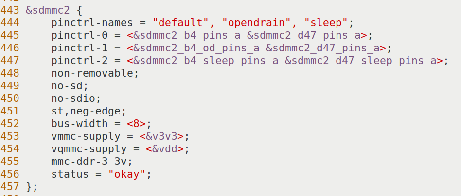
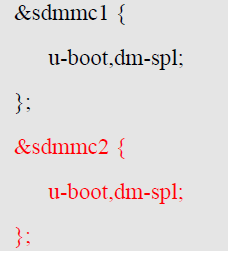
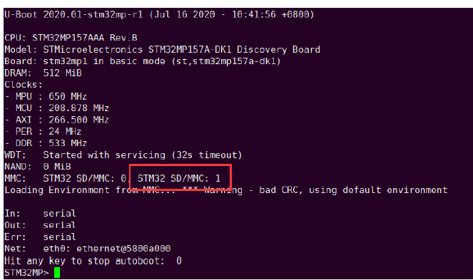

# 实验十 F-6 支持 eMMC——让 U-Boot 看见板载存储

> **对应课件**：《第3章 移植U-Boot》3.5 节，Slide 75-81
>
> **系列说明**：本系列基于华清远见 FS-MP1A（STM32MP157A）开发板，对应课件《第3章 移植U-Boot》。本文覆盖 Slide 75-81，是驱动修复系列（F-1~F-6）的最后一站 **F-6**。前置：实验九（F-5）已完成——网卡驱动装好、能 ping 通 PC，basic 版的设备级报错基本清零。

## 一、先看病根：驱动是现成的，设备树没配

课件 Slide 75 把这一站的情况说得很清楚：

> FS-MP1A开发板有板载eMMC Flash存储器，但当前u-boot缺少eMMC驱动，无法访问eMMC
>
> u-boot中已实现了eMMC的驱动代码，但当前的设备树没有eMMC的配置，因此需要修改设备树
>
> 支持eMMC有2个目的：一是后续移植工作可以借助eMMC中的出厂系统作验证；二是最终产品可以把程序烧到eMMC中，从eMMC启动系统

**eMMC 是什么**：焊在板上的大容量 Flash 芯片，内部自带控制电路、对外说 SDMMC 总线协议——可以理解为一张"焊死的 SD 卡"。FS-MP1A 上 SD 卡接 **SDMMC1** 总线（实验六修的就是它），eMMC 接 **SDMMC2** 总线。

为什么实验四以来启动日志的 `MMC:` 一行只有 `STM32 SD/MMC: 0`？U-Boot 的 sdmmc 驱动是通用的（SD 卡、eMMC 都归它管），但驱动要靠设备树知道"哪条总线接了什么设备"。DK1 的设备树只描述了 SDMMC1——DK1 压根没有 eMMC，自然不会替我们写好 SDMMC2。所以这一站**一行驱动代码都不用写**，纯粹是给设备树"补一段自我介绍"——F 系列里最顺的一站。

## 二、实验环境（实际）

| 项目 | 实际值 |
|---|---|
| 虚拟机 | 同实验一（VMware + Ubuntu 20.04，4GB 内存） |
| 源码目录 | `~/Desktop/LINUX-gy/Test2/stm32mp1-openstlinux-5.4-dunfell-mp1-20-06-24/sources/arm-ostl-linux-gnueabi/u-boot-stm32mp-2020.01-r0/u-boot-stm32mp-2020.01` |
| 分支 | WORKING |
| 工具链 | `/opt/st/stm32mp1/3.1-openstlinux-5.4-dunfell-mp1-20-06-24`（**每个新终端都要重新激活**，`echo $CC` 确认） |
| 要修改的文件 | `arch/arm/dts/stm32mp15xx-fsmp1x.dtsi`（新增 `&sdmmc2` 节点）、`arch/arm/dts/stm32mp157a-fsmp1a-u-boot.dtsi`（aliases 加 `mmc1` + `&sdmmc2` 的 `dm-spl`） |
| 串口 | MobaXterm Serial 会话（COM11），115200（同实验一） |
| SD 卡 | `/dev/sdb`（实验四已分好区，本实验只需重烧三个镜像） |

## 三、课件 ↔ 步骤对应表

| 课件 Slide | 内容 | 对应步骤 |
|---|---|---|
| 75 | F-6 总述：驱动现成、设备树没配，两个目的 | 本文第一节 |
| 76 | eMMC 与处理器连接引脚表 | 步骤 2 |
| 77 | `stm32mp15-pinctrl.dtsi` 引脚定义核对 | 步骤 2 |
| 78 | `fsmp1x.dtsi` 新增 `&sdmmc2` 节点 | 步骤 3 |
| 79 | `-u-boot.dtsi`：aliases 加 `mmc1`、`&sdmmc2` 加 `dm-spl` | 步骤 4 |
| 80 | 重新编译烧写运行：出现 `MMC1` 即成功 | 步骤 5~7 |
| 81 | basic 版移植适配完成 | 本文第八节 |

## 四、实验步骤

### 步骤 1：激活工具链，进入源码目录

```bash
cd ~/Desktop/LINUX-gy/Test2/stm32mp1-openstlinux-5.4-dunfell-mp1-20-06-24/sources/arm-ostl-linux-gnueabi/u-boot-stm32mp-2020.01-r0/u-boot-stm32mp-2020.01

. /opt/st/stm32mp1/3.1-openstlinux-5.4-dunfell-mp1-20-06-24/environment-setup-cortexa7t2hf-neon-vfpv4-ostl-linux-gnueabi

echo $CC    # 输出 arm-ostl-linux-gnueabi-gcc ... 才算激活成功
```

### 步骤 2：核对引脚定义（Slide 76-77）

先看课件从原理图整理出的引脚表——eMMC 的 10 根信号线接在处理器的哪些脚上：


> 图：课件 Slide 76——eMMC 与处理器连接引脚表（原理图网络编号、对应管脚、管脚功能、管脚功能码）：SD2_DATA0→PB14→SDMMC2_D0→AF9；SD2_DATA1→PB15→SDMMC2_D1→AF9；SD2_DATA2→PB3→SDMMC2_D2→AF9；SD2_DATA3→PB4→SDMMC2_D3→AF9；SD2_DATA4→PA8→SDMMC2_D4→AF9；SD2_DATA5→PA9→SDMMC2_D5→AF10；SD2_DATA6→PE5→SDMMC2_D6→AF9；SD2_DATA7→PD3→SDMMC2_D7→AF9；SD2_CLK→PE3→SDMMC2_CK→AF9；SD2_CMD→PG6→SDMMC2_CMD→AF10。

这些"引脚复用"定义（哪个脚在哪种模式下充当什么功能）不用我们写——STM32MP1 的公共引脚表在 `arch/arm/dts/stm32mp15-pinctrl.dtsi` 里，课件 Slide 77 让我们先核对它是否与上表一致：

```bash
grep -n "sdmmc2_b4_pins_a\|sdmmc2_b4_od_pins_a\|sdmmc2_b4_sleep_pins_a\|sdmmc2_d47_pins_a\|sdmmc2_d47_sleep_pins_a" arch/arm/dts/stm32mp15-pinctrl.dtsi
```

应看到 5 个定义（`sdmmc2_b4_pins_b`、`sdmmc2_b4_od_pins_b` 两组用不到，不用管）。再抽查 `sdmmc2_b4_pins_a` 的内容是否与引脚表一致：

```bash
grep -n -A 12 "sdmmc2_b4_pins_a: sdmmc2-b4-0" arch/arm/dts/stm32mp15-pinctrl.dtsi
```

课件核对过，是一致的：


> 图：课件 Slide 77——`arch/arm/dts/stm32mp15-pinctrl.dtsi` 中的引脚定义（代码很长，后续省略）：`sdmmc2_b4_pins_a: sdmmc2-b4-0 { pins1 { pinmux = <STM32_PINMUX('B', 14, AF9)>, /* SDMMC2_D0 */ <STM32_PINMUX('B', 15, AF9)>, /* SDMMC2_D1 */ <STM32_PINMUX('B', 3, AF9)>, /* SDMMC2_D2 */ <STM32_PINMUX('B', 4, AF9)>, /* SDMMC2_D3 */ <STM32_PINMUX('G', 6, AF10)>; /* SDMMC2_CMD */`——与引脚表一致（PB14/PB15/PB3/PB4 走 AF9、PG6 走 AF10）。

这一步**只看不改**：pinctrl 是芯片级公共文件，ST 早就写好了全部复用定义；设备树要做的只是"引用"它们——正是下一步的事。

**实际执行结果**：待补充

### 步骤 3：`fsmp1x.dtsi` 新增 `&sdmmc2` 节点（Slide 78）

先确认现状——这个文件里目前应该完全没有 sdmmc2：

```bash
grep -n "sdmmc2" arch/arm/dts/stm32mp15xx-fsmp1x.dtsi
```

无输出是正常的（设备树里还没有 eMMC 的配置），接下来就是要让它有。再找插入点：

```bash
grep -n "^&sdmmc1" arch/arm/dts/stm32mp15xx-fsmp1x.dtsi
```

用 nano 打开，在**整个 `&sdmmc1` 节点（到与它配对的顶格 `};`）之后**插入课件 Slide 78 给出的节点（课件文件里它落在第 442~457 行，即紧跟 sdmmc1；你的文件行号略有出入，位置一致即可）：

```bash
nano arch/arm/dts/stm32mp15xx-fsmp1x.dtsi
```

```dts
&sdmmc2 {
	pinctrl-names = "default", "opendrain", "sleep";
	pinctrl-0 = <&sdmmc2_b4_pins_a &sdmmc2_d47_pins_a>;
	pinctrl-1 = <&sdmmc2_b4_od_pins_a &sdmmc2_d47_pins_a>;
	pinctrl-2 = <&sdmmc2_b4_sleep_pins_a &sdmmc2_d47_sleep_pins_a>;
	non-removable;
	no-sd;
	no-sdio;
	st,neg-edge;
	bus-width = <8>;
	vmmc-supply = <&v3v3>;
	vqmmc-supply = <&vdd>;
	mmc-ddr-3_3v;
	status = "okay";
};
```


> 图：课件 Slide 78——`stm32mp15xx-fsmp1x.dtsi` 中新增的 `&sdmmc2` 节点（第 442~457 行）：三组 pinctrl、`non-removable`、`no-sd`、`no-sdio`、`st,neg-edge`、`bus-width = <8>`、`vmmc-supply = <&v3v3>`、`vqmmc-supply = <&vdd>`、`mmc-ddr-3_3v`、`status = "okay"`。

逐行看懂这段（几乎每行都能在前面的实验里找到对应物）：

| 属性 | 含义 |
|---|---|
| `pinctrl-names` + `pinctrl-0/1/2` | 引脚三态：default（正常）/ opendrain（初始化阶段的开漏模式，防总线冲突）/ sleep（休眠）。与 sdmmc1 同款套路 |
| `sdmmc2_b4_pins_a` + `sdmmc2_d47_pins_a` | `b4` = 数据线 0~3 加 CLK/CMD（4 位总线那部分），`d47` = 数据线 4~7——两组合起来正好是步骤 2 引脚表里的 10 根线 |
| `non-removable` | eMMC 焊在板上、永远"在位"，不需要 SD 卡那套 CD 卡检测（对照实验六给 sdmmc1 改的 `cd-gpios`——那是可插拔设备才需要的） |
| `no-sd` / `no-sdio` | 这条总线上只接了 eMMC，让驱动别浪费时间去探测 SD 卡 / SDIO 设备 |
| `st,neg-edge` | ST 控制器的时钟沿配置，与 sdmmc1 保持一致 |
| `bus-width = <8>` | 8 位数据线全用上（SD 卡只有 4 位）——eMMC 更快的原因之一，也是引脚表里有 DATA0~DATA7 的原因 |
| `vmmc-supply = <&v3v3>` / `vqmmc-supply = <&vdd>` | 两路供电（存储芯片本体 / 总线 IO）。**都是 F-1 新建的固定电源**——v3v3 的上一个用户是 sdmmc1，vdd 的上一个用户是 &adc/&vrefbuf，当时"替 DK1 电源树善后"的成果在这里直接兑现 |
| `mmc-ddr-3_3v` | 支持 3.3V 供电下的双倍速率（DDR）模式 |
| `status = "okay"` | 启用 |

保存退出，自检：

```bash
grep -n -A 13 "sdmmc2 {" arch/arm/dts/stm32mp15xx-fsmp1x.dtsi    # 新节点应完整出现
```

**实际执行结果**：待补充

### 步骤 4：`-u-boot.dtsi` 加启动通道（Slide 79）

```bash
nano arch/arm/dts/stm32mp157a-fsmp1a-u-boot.dtsi
```

**第一处：aliases 里加 `mmc1`**。找到 `aliases` 块，在 `mmc0 = &sdmmc1;` 的下一行插入：

```dts
		mmc1 = &sdmmc2;
```


> 图：课件 Slide 79——`stm32mp157a-fsmp1a-u-boot.dtsi` 中的 aliases 节点（红字为新增内容）：`aliases { i2c3 = &i2c4; mmc0 = &sdmmc1; mmc1 = &sdmmc2; usb0 = &usbotg_hs; };`，即增加启动通道 mmc1。

> **顺带解答一个眼熟的疑问**：aliases 里那行 `i2c3 = &i2c4;`——F-1 不是把 `&i2c4` 删了吗，怎么它还在、还一直编得过？因为 F-1 删掉的是**板级扩展段**（PMIC、type-C 那些子节点所在的 `&i2c4 { ... }`），而控制器节点本体 `i2c4: i2c@5c002000` 定义在 SoC 级公共文件 `stm32mp151.dtsi` 里，一直都在（status 默认 disabled）。aliases 只是"编号 → 节点"的映射表，指向一个存在但禁用的节点完全合法。

**第二处：`&sdmmc2` 的 SPL 标记**。文件里已有一段 `&sdmmc1 { u-boot,dm-spl; };`（DK1 原有，不用动），在它后面照样新增：

```dts
&sdmmc2 {
	u-boot,dm-spl;
};
```


> 图：课件 Slide 79——`stm32mp157a-fsmp1a-u-boot.dtsi` 中的另一处修改（红字为新增内容）：`&sdmmc1 { u-boot,dm-spl; };`、`&sdmmc2 { u-boot,dm-spl; };`，使 sdmmc2 也在 SPL 阶段可用。

`u-boot,dm-spl` 是"SPL 阶段也要绑定这个设备"的标记：SPL 要读卡加载 U-Boot 本体，所以 sdmmc 控制器都得在 SPL 里可用（`&sdmmc1` 那段就是干这个的）。给 `&sdmmc2` 也带上，eMMC 在 SPL 阶段同样可访问——为后续"从 eMMC 引导"留好门。

保存退出，自检：

```bash
grep -n -A 5 "aliases {" arch/arm/dts/stm32mp157a-fsmp1a-u-boot.dtsi    # 应见 i2c3 / mmc0 / mmc1 / usb0
grep -n -B 1 "u-boot,dm-spl" arch/arm/dts/stm32mp157a-fsmp1a-u-boot.dtsi    # 应见 &sdmmc1 与新增的 &sdmmc2 两段
```

**实际执行结果**：待补充

### 步骤 5：重新编译（沿用实验六流程）

```bash
make -j2 all DEVICE_TREE=stm32mp157a-fsmp1a
```

只改了设备树，轻量重编，一两分钟，以 `MKIMAGE spl/u-boot-spl.stm32` 收尾。

**实际执行结果**：待补充

### 步骤 6：烧写 SD 卡（沿用实验六流程）

```bash
lsblk                                   # 先确认 SD 卡仍是 /dev/sdb
sudo dd if=u-boot-spl.stm32 of=/dev/sdb1 conv=fdatasync
sudo dd if=u-boot-spl.stm32 of=/dev/sdb2 conv=fdatasync
sudo dd if=u-boot.img     of=/dev/sdb3 conv=fdatasync
```

设备树同时打进了 SPL 的 dtb 和 U-Boot 本体的 dtb，三条照旧全烧。

**实际执行结果**：待补充

### 步骤 7：上电验证（Slide 80）

板子断电 → 插卡 → 拨码 `101` → 上电，看 MobaXterm 串口。

**这一站的里程碑**：`MMC:` 一行从"只有 SD 卡"变成两个控制器——

```
MMC:   STM32 SD/MMC: 0  STM32 SD/MMC: 1
```

`STM32 SD/MMC: 1` 的出现就是 Slide 80 说的"出现如图的 MMC1 即成功"。F 系列其余成果应全部保持：无电源报错、无 ADC 报错、`Err: serial` 直达 `Net:`、无 EQOS 报错，最终停在 `STM32MP>`。


> 图：课件 Slide 80——重新编译烧写运行后的串口输出：`MMC: STM32 SD/MMC: 0  STM32 SD/MMC: 1`（红框，出现 MMC1 即 eMMC 支持成功）、`Loading Environment from MMC...`、`Net: eth0: ethernet@5800a000`、`Hit any key to stop autoboot: 0`、`STM32MP>`。（课件环境里环境变量是 bad CRC 警告——卡上没有遗留有效环境所致；我们的卡上有出厂遗留环境，显示 OK 同样正常。）

**深入一步（可选）**：在 `STM32MP>` 下用命令真正摸一摸 eMMC：

```
mmc dev 1
mmc info
```

`mmc dev 1` 应回 `switch to partitions #0, OK` 与 `Current device is: 1`；`mmc info` 会列出设备与容量（板载 eMMC 的实际大小）。想切回 SD 卡，`mmc dev 0` 即可。

**实际执行结果**：待补充

### 步骤 8：收尾——git 提交

本站没动 menuconfig，不涉及 defconfig 同步，直接提交设备树改动：

```bash
git status --short      # 应只有 2 个文件被修改：fsmp1x.dtsi 与 fsmp1a-u-boot.dtsi
git add -A
git commit -m "F-6: 设备树支持 eMMC（新增 sdmmc2 节点与启动通道）"
```

**实际执行结果**：待补充

## 五、注意事项

1. **本站只加不改不删**：`fsmp1x.dtsi` 里已有的内容一概不动——F-2 改的 `cd-gpios` 就在旁边不远，别误伤；插入位置是 `&sdmmc1` 节点**之后**，不是插进它内部。
2. **pinctrl 标签五个引用要对全**：`sdmmc2_b4_pins_a`、`sdmmc2_b4_od_pins_a`、`sdmmc2_b4_sleep_pins_a`、`sdmmc2_d47_pins_a`、`sdmmc2_d47_sleep_pins_a`，必须与 `stm32mp15-pinctrl.dtsi` 里的定义一字不差——拼错一个，编译时报 `Reference to non-existent node or label`。
3. **供电标签别写反**：`vmmc-supply`（存储芯片供电）= `&v3v3`，`vqmmc-supply`（总线 IO 供电）= `&vdd`。两个标签都来自 F-1 的固定电源，别顺手写成已删除的 PMIC 电源名。
4. **`dm-spl` 加在板级文件里**：改的是 `stm32mp157a-fsmp1a-u-boot.dtsi`（FS-MP1A 专属），别加到公共文件 `stm32mp15-u-boot.dtsi`（影响所有板卡）。
5. **三条镜像照旧全烧**：设备树在 SPL dtb 与 U-Boot dtb 里各有一份。
6. **成功标准是 `MMC:` 行出现两个控制器**：向 eMMC 烧写系统、从 eMMC 引导，是后续阶段（内核与产品化）的事，本站只要 U-Boot"看得见"它。

## 六、怎么验证 F-6 改对了

### 第一层：源码自检（半分钟）

```bash
grep -n -A 13 "sdmmc2 {" arch/arm/dts/stm32mp15xx-fsmp1x.dtsi              # 新节点完整
grep -n -A 5 "aliases {" arch/arm/dts/stm32mp157a-fsmp1a-u-boot.dtsi       # mmc1 = &sdmmc2 在列
grep -n -B 1 "u-boot,dm-spl" arch/arm/dts/stm32mp157a-fsmp1a-u-boot.dtsi   # sdmmc1、sdmmc2 两段
```

### 第二层：查编译产物（`dtc` 当裁判）

```bash
./scripts/dtc/dtc -I dtb -O dts u-boot.dtb 2>/dev/null | grep -A 12 "sdmmc2@"
```

反编译出来的节点应是 `sdmmc2@58005000`，`status = "okay"`、`bus-width = <0x8>`，并带着 `u-boot,dm-spl` 属性（pinctrl 等显示为 phandle 数字，正常）。

### 第三层：上电实测

`MMC:   STM32 SD/MMC: 0  STM32 SD/MMC: 1`——第二只控制器出现即达标；其余日志与实验九一致。

### 第四层：命令行摸底（可选）

`mmc dev 1` 能选中、`mmc info` 报出设备与容量，说明不只是"注册了"，而是真的能访问。

不达标时的排查顺序：

| 现象 | 先查什么 |
|---|---|
| `MMC:` 行仍只有一个控制器 | ① 两个文件的改动都保存了吗（自检 grep）；② 三条 dd 重烧了吗（串口版本串时间戳）；③ 改动真的编进 dtb 了吗（第二层 dtc 反查） |
| 编译报 `Reference to non-existent node or label` | 五个 pinctrl 标签或 `v3v3`/`vdd` 拼写核对（第一层自检 + `grep` pinctrl.dtsi） |
| SPL 阶段就不启动了 | `dm-spl` 段是否加错文件/加错位置——SPL 对设备树最敏感，`git diff arch/arm/dts/stm32mp157a-fsmp1a-u-boot.dtsi` 核对改动范围 |
| `MMC: 1` 出现但 `mmc dev 1` 报错 | 节点属性逐行与课件核对（`non-removable`、`bus-width`、供电标签最易错）；仍不行再考虑板卡硬件因素 |

### 最后一道验证：提交本身

`git show --stat HEAD` 复核：本次应**只有 2 个文件**（两个设备树文件）。多出别的文件，说明有"顺手改动"混进来了。

## 七、实验完成标志

- `stm32mp15xx-fsmp1x.dtsi` 中已有完整的 `&sdmmc2` 节点（属性与课件 Slide 78 一致）
- `stm32mp157a-fsmp1a-u-boot.dtsi` 中 aliases 已有 `mmc1 = &sdmmc2;`、已有 `&sdmmc2 { u-boot,dm-spl; };`
- 重新编译成功，三个镜像已重新烧写到 sdb1 / sdb2 / sdb3
- 串口 `MMC:` 行出现 `STM32 SD/MMC: 0  STM32 SD/MMC: 1`
- （可选）`mmc dev 1` 选中 eMMC、`mmc info` 显示设备与容量
- 已完成 git 提交（2 个文件）

## 八、下一步：basic 版收官

课件 Slide 81：**至此，basic 版的 U-Boot 已完成必要的移植适配。**

回顾这一版走过的路：F-1 删 DK1 电源树、F-2 改 SD 卡检测引脚、F-3 关 ADC、F-4 关 LTDC、F-5 换网卡驱动、F-6 补 eMMC 配置——启动日志从"复位循环"一路修到干干净净地停在 `STM32MP>`。最后一站换一种玩法：**不再让 SPL 当 FSBL，换 TF-A 上场**，U-Boot 也随之切换到 trusted 版——驱动全部沿用，只需改配置。请看《实验十一 trusted 版 U-Boot 移植》。
