# 附录 开发环境搭建——Linux系统安装

> **对应课件**：课程配套资料《1. 开发环境搭建-Linux系统安装.docx》（第 3 章实验之前的环境准备材料，不占本章 Slide 序号）
>
> **系列说明**：本篇是那份 docx 的**原样转换备查附录**（**附录**，不参与专栏实验序号，放在 `01_移植U-Boot/` 目录末尾备查）。第一~三节为原文转录——层级、编号、加粗、图片顺序都照原样，只在图下加一行图注；第四节「踩坑与环境差异」**不是原文内容**，是本仓库在这台机器上实打实踩出来的补充。后面凡是要动虚拟机网络（实验一装工具链、实验十三搭 TFTP 服务器）都要回到本篇这张网络拓扑来对表。
>
> **转录说明（四条，照着做之前先看）**：
>
> 1. 源文件 = `01_移植U-Boot/1. 开发环境搭建-Linux系统安装.docx`（4.6 MB，文件名带"1. "前缀和空格）。原文共 50 处图片位、48 张唯一截图（按 md5 去重：`08_虚拟机汇总页自定义硬件.png`、`22_虚拟机主页与设备摘要.png` 各被引用两次——前者用在"点自定义硬件"和"点完成"两处，后者用在"选中虚拟机"和"开启此虚拟机"两处），所以正文 50 条引用指向 48 个文件。
> 2. 原文示例用户名/密码为 `cnu` / `123456`，本仓库沿用。
> 3. 「配置Ubuntu」一节原文出现**两个"步骤6"**（Windows和Ubuntu之间复制粘贴、把shell环境修改为bash），系**原文编号笔误**，后者实为步骤 7；此处照原文转录并特此注明。
> 4. 原文末段说映射出来的网络硬盘是"Y 盘"，**本仓库实际使用的是 Z: 盘**——盘符只是映射那一步选中的字母，不影响功能（原文自己的截图里 Y: 和 Z: 还同时出现过，见最后一张图）。
> 5. 一~三节的正文是原文逐字转录，本仓库加进去的东西只有两类、都带明显标记：图片下面那行 `> 图：`，以及关键步骤末尾以 `**关联后续实验**：` 起头的一行——后者只说一件事：这一步的配置会在后面哪个实验里再被用到、那边出状况时先回看哪里。原文没有这两类东西，只想核对原文时可以直接跳过它们；第四节整节都是补充。

## 一、实验目的

在Windows系统的计算机中通过虚拟机安装Linux系统，搭建Windows+Linux的双系统环境，为后续实验准备好系统环境。

## 二、实验内容

（1）在虚拟机中安装Ubuntu；

（2）配置Ubuntu；

（3）Windows与Ubuntu共享文件。

## 注意事项

* 安装VMware Workstation前关闭各种杀毒软件的防火墙。
* VMware Workstation不要安装到磁盘分区的**根目录**下，例如不能安装到"D:\"，可以安装到"D:\ VMware\"。

## 三、实验步骤

### 1. Windows系统中通过VMware Workstation虚拟机安装Ubuntu

* **步骤1.** 下载并安装VMware Workstation，下载地址：
  https://softwareupdate.vmware.com/cds/vmw-desktop/ws/17.6.0/24238078/windows/core/VMware-workstation-17.6.0-24238078.exe.tar

* **步骤2.** 下载**20.04 LTS版本**Ubuntu安装文件，下载地址：

  https://releases.ubuntu.com/20.04/

  选择**desktop-amd64版iso文件**下载。

  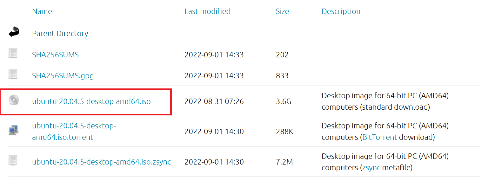
  > 图：课件截图——`releases.ubuntu.com/20.04/` 目录列表，红框选中 `ubuntu-20.04.5-desktop-amd64.iso`（3.6G，Last modified 2022-08-31 07:26，Desktop image for 64-bit PC (AMD64) computers）；同列另有 `.iso.torrent`（288K）与 `.iso.zsync`（7.2M）两个非本次目标的文件。

  **关联后续实验**：iso 一定认准 **20.04 的 desktop-amd64 版**。装成 18.04 / 22.04 或 server 版，实验一那份 SDK（`en.SDK-x86_64-stm32mp1-openstlinux-5.4-dunfell-mp1-20-06-24.tar.xz`）的安装脚本与依赖、以及后面 menuconfig 的界面就得重新验证一遍。原文"不升级、不升级、不升级"三条防的就是它自己升到 22.04。

* **步骤3**. 启动步骤1安装的VMware Workstation，然后点击"创建新的虚拟机"创建虚拟机。

  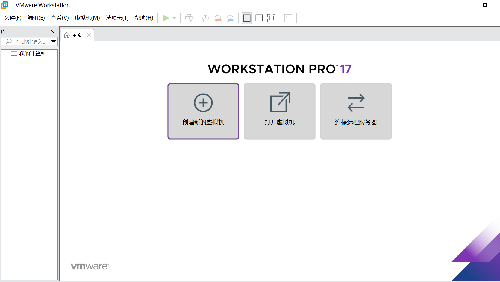
  > 图：课件截图——`WORKSTATION PRO 17` 主页，三个入口 `创建新的虚拟机`（紫框高亮）、`打开虚拟机`、`连接远程服务器`，左侧库里有"我的计算机"。

  虚拟机类型选择"典型"。

  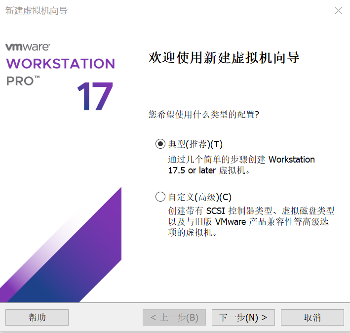
  > 图：课件截图——"欢迎使用新建虚拟机向导 / 您希望使用什么类型的配置？"，选中 `典型(推荐)(T)`（通过几个简单的步骤创建 Workstation 17.5 or later 虚拟机），另一项为 `自定义(高级)(C)`。

  选择"稍后安装操作系统"。

  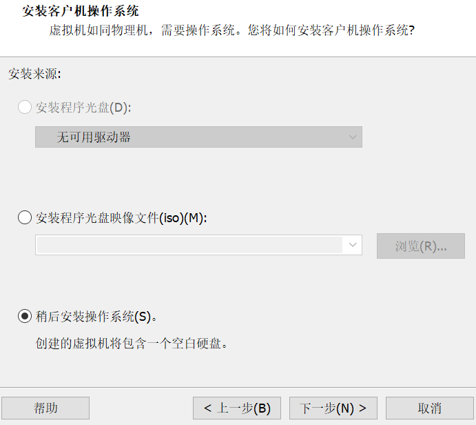
  > 图：课件截图——"安装客户机操作系统 / 安装来源"三项：`安装程序光盘(D)`（无可用驱动器）、`安装程序光盘映像文件(iso)(M)`（灰掉）、选中的 `稍后安装操作系统(S)`（创建的虚拟机将包含一个空白硬盘）。**这一步是"先建虚拟机、后挂 iso"路线的关键**，所以 iso 要留到步骤 4 再加载。

  "客户机操作系统"选择Linux Ubuntu 64位。

  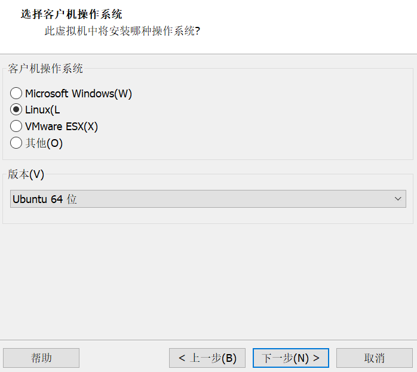
  > 图：课件截图——"选择客户机操作系统"：`Linux(L)` 选中，版本(V) 下拉为 `Ubuntu 64 位`。

  设置虚拟机名称，名称随意；设置虚拟机的存储位置，自己**选择一个剩余空间足够大的磁盘分区**。

  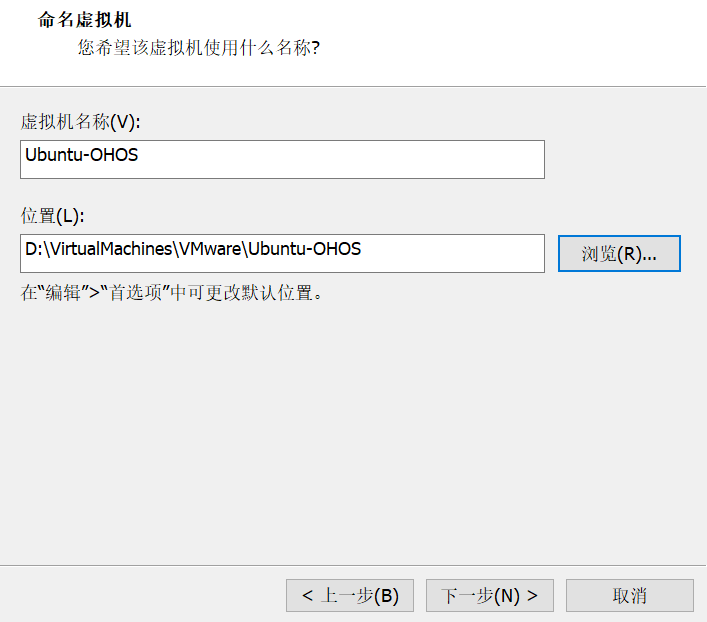
  > 图：课件截图——虚拟机名称(V) = `Ubuntu-OHOS`，位置(L) = `D:\VirtualMachines\VMware\Ubuntu-OHOS`，右侧"浏览(R)…"；下方小字"在'编辑'>''首选项'中可更改默认位置"。

  设置虚拟硬盘文件大小建议设置为**60GB**以上（未使用的空间不会占用物理硬盘）。

  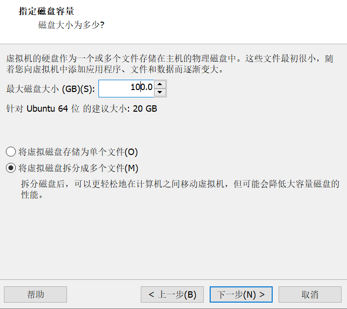
  > 图：课件截图——"指定磁盘容量"页，最大磁盘大小(GB)(S) 填的是 `100.0`，VMware 自己给出的提示是"针对 Ubuntu 64 位 的建议大小: 20 GB"，下方选中 `将虚拟磁盘拆分成多个文件(M)`。**正文说"建议 60GB 以上"，截图里给的是 100GB**——两者不冲突，60GB 是下限、100GB 是课件实际取的值；**本仓库就按 100 GB 建盘**（未使用的空间不占物理硬盘，宁大勿小）。

  **关联后续实验**：容量按 100 GB 建，别用 VMware 弹出来的 20 GB 建议值——实验一的 SDK 解压 + 安装、U-Boot/内核源码树与编译产物都吃这块盘，20 GB 撑不到第 5 章（详见 4.13）。虚拟盘未使用的空间不占物理硬盘，这一步宁大勿小；建好之后再扩容要动 `.vmdk`，比现在多敲三个 0 麻烦得多。

  选择"自定义硬件"对虚拟机硬件进行设置。

  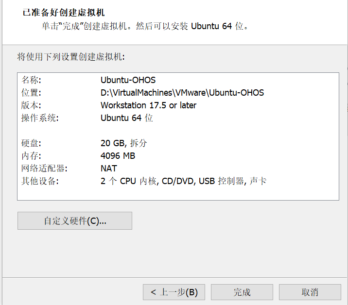
  > 图：课件截图——"已准备好创建虚拟机"汇总页：名称 `Ubuntu-OHOS`、位置 `D:\VirtualMachines\VMware\Ubuntu-OHOS`、版本 `Workstation 17.5 or later`、操作系统 `Ubuntu 64 位`、硬盘 `20 GB, 拆分`、内存 `4096 MB`、网络适配器 `NAT`、其他设备 `2 个 CPU 内核, CD/DVD, USB 控制器, 声卡`，下方是 `自定义硬件(C)...` 按钮。
  >
  > 两点值得注意：① 这张汇总里硬盘写的是 **20 GB**、与上一张 100 GB 的截图不是同一次操作（课件截图来自多次演示，数值别当标准答案）——我们按 100 GB 建盘的话，自己这一页应当显示 `100 GB, 拆分`，显示 20 GB 就说明上一步的容量没改过；② 此时网络适配器还是默认的 `NAT`，要到自定义硬件里改成"仅主机模式"。

  处理器内核总数根据物理机处理器数量设置，建议**2个以上，且不超过物理机逻辑处理器数量的50%**。

  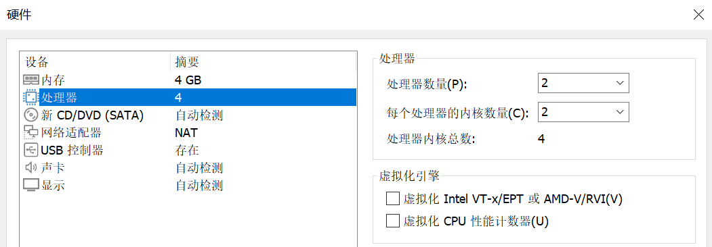
  > 图：课件截图——硬件页选中"处理器"（摘要 4），右侧 `处理器数量(P) = 2`、`每个处理器的内核数量(C) = 2`、`处理器内核总数: 4`；下方"虚拟化引擎"两项（`虚拟化 Intel VT-x/EPT 或 AMD-V/RVI(V)`、`虚拟化 CPU 性能计数器(U)`）均未勾选。设备列表此时为：内存 4 GB、处理器 4、新 CD/DVD (SATA) 自动检测、网络适配器 NAT、USB 控制器、声卡、显示。

  网络适配器选择"仅主机模式"。

  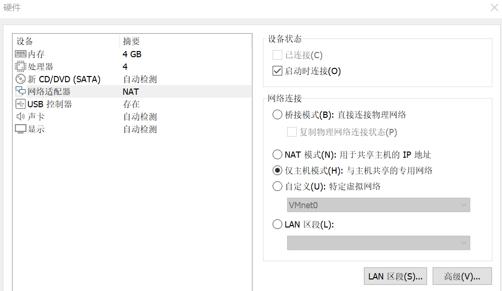
  > 图：课件截图——硬件页选中"网络适配器"（左侧摘要仍显示 NAT，右侧单选已点到 `仅主机模式(H): 与主机共享的专用网络`）。"设备状态"里 `启动时连接(O)` 已勾、`已连接(C)` 未勾（虚拟机未开机）。这一项就是**网卡 1**。

  **关联后续实验**：网卡 1 是后面**所有 Windows↔Ubuntu 搬文件的路**——第三节末尾映射出来的那个网络硬盘走它，实验十三复核 TFTP 服务器地址也走它。它的"类型"改错不是"配得不对"，而是 Windows 侧那块适配器会被整个删掉、盘当场掉线，见 4.1。

  额外再添加一个网络适配器，并选择为"NAT模式"。

  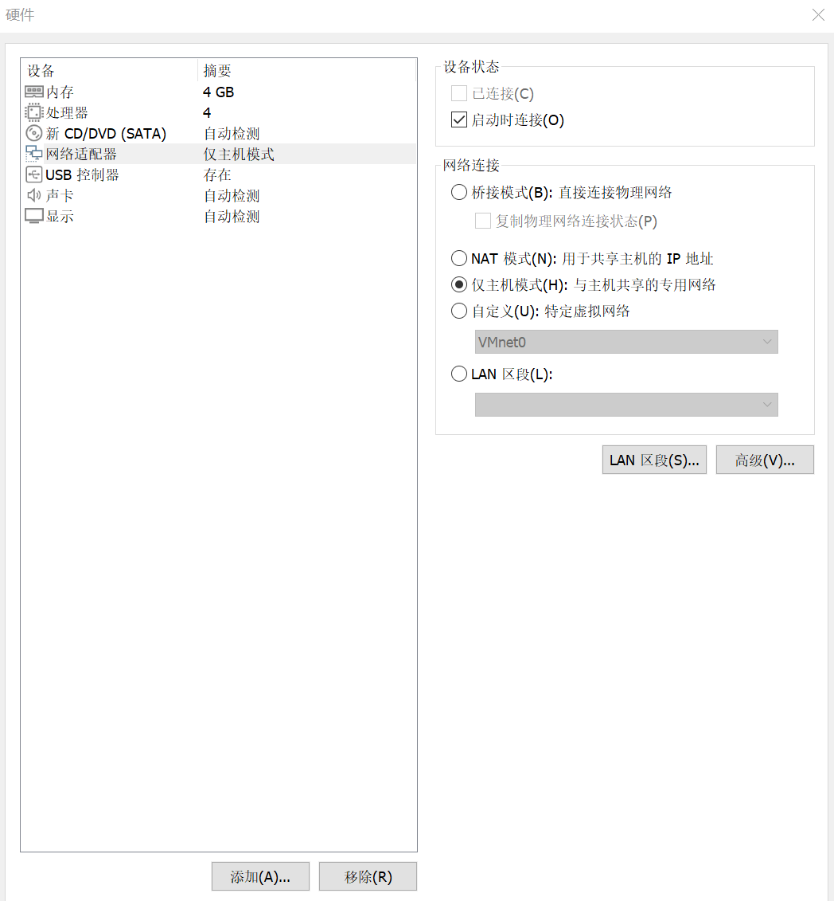
  > 图：课件截图——网卡 1 已改成"仅主机模式"（左侧设备列表摘要已刷新为 `网络适配器 仅主机模式`），要新增第二块卡**必须点对话框左下方的 `添加(A)...`**（其右侧是 `移除(R)`），不要去改这块已有的卡。

  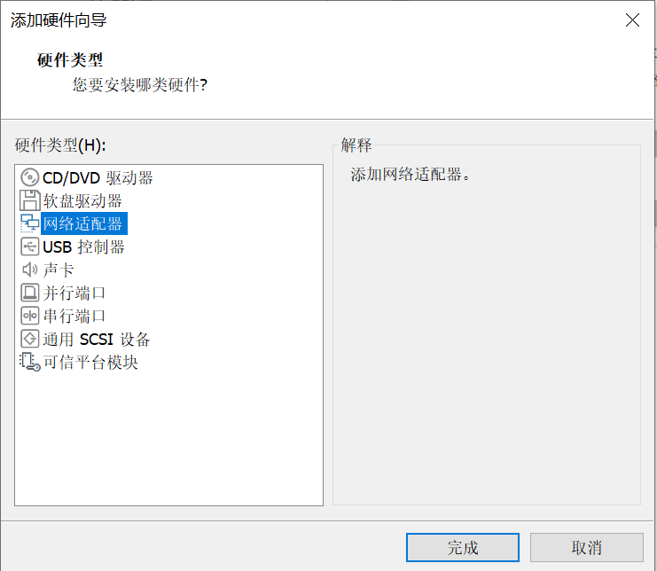
  > 图：课件截图——"添加硬件向导 / 硬件类型(H)"列表：CD/DVD 驱动器、软盘驱动器、**网络适配器**（高亮）、USB 控制器、声卡、并行端口、串行端口、通用 SCSI 设备、可信平台模块；右侧解释"添加网络适配器。"。

  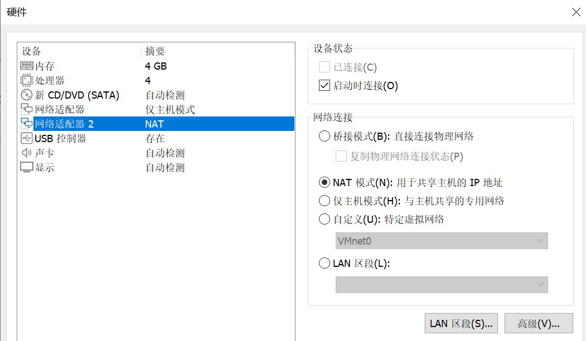
  > 图：课件截图——设备列表新增一行 `网络适配器 2   NAT`（高亮选中），右侧单选为 `NAT 模式(N): 用于共享主机的 IP 地址`。至此虚拟机内两块网卡到位：网卡 1 = 仅主机模式、网卡 2 = NAT。

  **关联后续实验**：网卡 2 管**联网装包**。实验一的 SDK 依赖、实验十三的 `tftpd-hpa`、解 rar 的工具，全部是 `apt install` 从这块卡出去的；它被删掉或被改成别的模式，后面每一步装包都会卡住。因此顺序上永远记住一句：**先联网装包，后改桥接**（见 4.5）。

  最后点击"完成"完成虚拟机创建

  
  > 图：与上面"选择自定义硬件"是同一张汇总页截图——先在这页点 `自定义硬件(C)...` 做前面的硬件设置，回到本页后再点 `完成` 创建虚拟机。

  点击"编辑"—>"虚拟网络编辑器"配置虚拟网卡。

  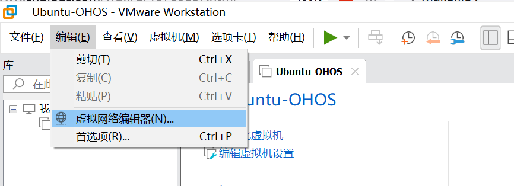
  > 图：课件截图——VMware 标题栏 `Ubuntu-OHOS - VMware Workstation`，"编辑(E)" 菜单展开，高亮项为 `虚拟网络编辑器(N)...`（其下还有 `首选项(R)...  Ctrl+P`）。

  如果有"桥接模式"的网卡，将其删除。

  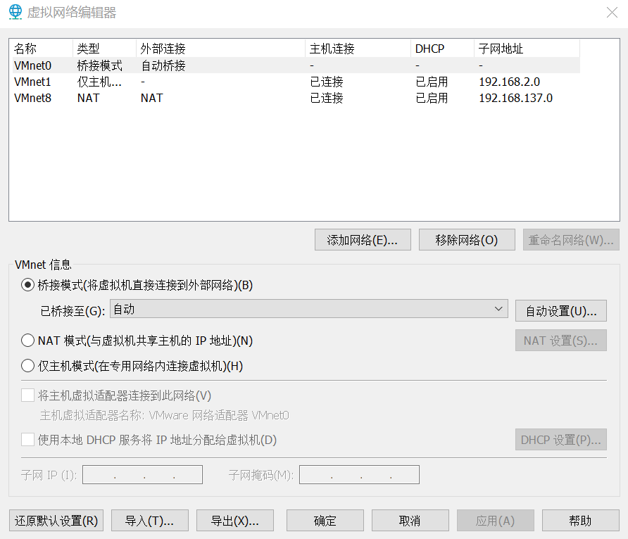
  > 图：课件截图——"虚拟网络编辑器"列表三行：`VMnet0 桥接模式 自动桥接 - - -`（选中）、`VMnet1 仅主机... - 已连接 已启用 192.168.2.0`、`VMnet8 NAT NAT 已连接 已启用 192.168.137.0`；下方 VMnet 信息区选中"桥接模式"，按钮 `移除网络(O)` 可用（`添加网络(E)...`、`重命名网络(W)...` 灰掉）。**注意 VMnet1 此刻的子网还是 `192.168.2.0`**，下一步才改成 56 网段。

  把"仅主机模式"的网卡"子网IP"设置为**192.168.56.0**，并把"将主机虚拟适配器连接到此网络"勾选上。（记住此网卡名称"VMnet1"后面配置网络还要用到）

  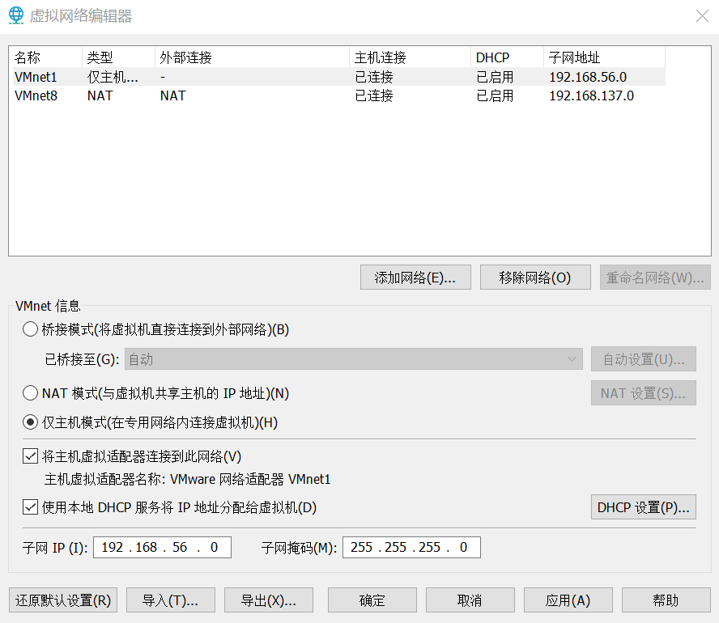
  > 图：课件截图——删除桥接后列表只剩 `VMnet1 仅主机... - 已连接 已启用 192.168.56.0` 与 `VMnet8 NAT NAT 已连接 已启用 192.168.137.0`；选中 VMnet1，下方 `仅主机模式(在专用网络内连接虚拟机)(H)` 打点，**两个勾全部勾上**：`将主机虚拟适配器连接到此网络(V)`（主机虚拟适配器名称: VMware 网络适配器 VMnet1）、`使用本地 DHCP 服务将 IP 地址分配给虚拟机(D)`，子网 IP(I) = `192.168.56.0`、子网掩码(M) = `255.255.255.0`。正文只提了第一个勾，**第二个勾（本地 DHCP）也要保持勾上**，右下角要点 `确定`/`应用(A)` 才落盘。

  **关联后续实验**：这一屏就是 4.1 那次事故的现场——**类型停在"仅主机模式"、两个勾常开**，三个条件少任何一个，`192.168.56.0/24` 这个网段就不存在，Z: 盘与两端互 ping 会同时失效；而"改完没点确定"等于没改，验证要看 `.vmx`（见 4.2）。

  在Windows中搜索"网络连接"打开网卡配置窗口，在窗口中找到**"仅主机模式"的网卡**（此处为"VMnet1"），将此网卡的IP设置为**192.168.56.10**，子网掩码**255.255.255.0**，网关**192.168.56.1**。

  
  > 图：课件截图——Windows 搜索框输入"网络连接"，最佳匹配为 `查看网络连接 / 控制面板`。

  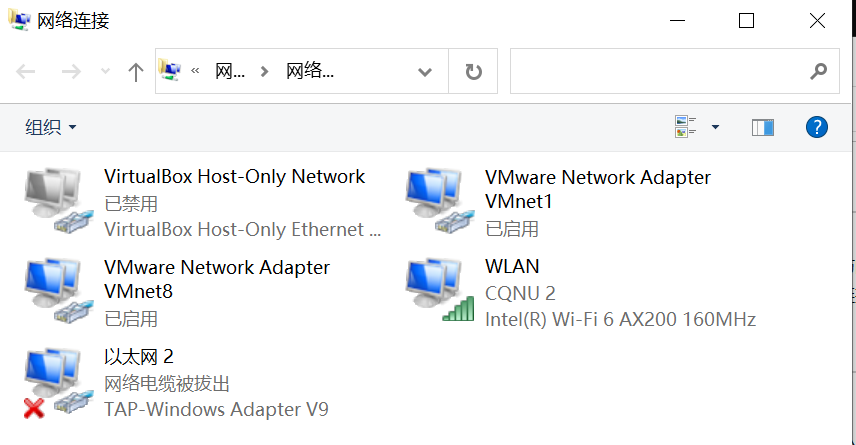
  > 图：课件截图——"网络连接"控制面板窗口，适配器清单里有 `VirtualBox Host-Only Network（已禁用）`、`VMware Network Adapter VMnet1（已启用）`、`VMware Network Adapter VMnet8（已启用）`、`WLAN CQNU 2 Intel(R) Wi-Fi 6 AX200 160MHz`、`以太网 2 网络电缆被拔出 TAP-Windows Adapter V9`。要配的是 **VMware Network Adapter VMnet1** 这一块。

  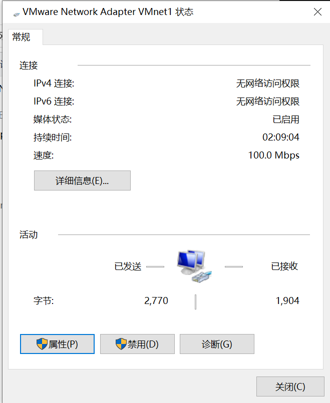
  > 图：课件截图——`VMware Network Adapter VMnet1 状态` 对话框：IPv4 连接 = 无网络访问权限、IPv6 连接 = 无网络访问权限、媒体状态 已启用、持续时间 02:09:04、速度 100.0 Mbps，已发送 2,770 / 已接收 1,904 字节；下方按钮 `属性(P)`、`禁用(D)`、`诊断(G)`。"无网络访问权限"是正常现象——这块卡本来就不通外网。

  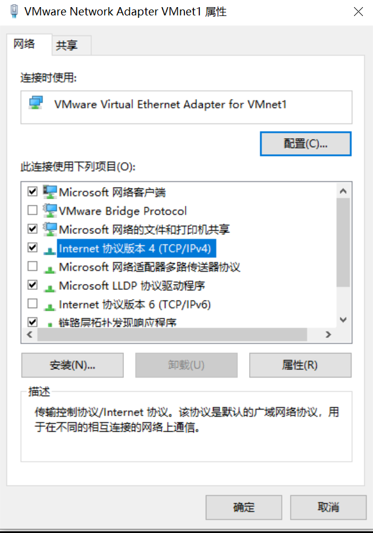
  > 图：课件截图——`VMware Network Adapter VMnet1 属性` 对话框，"连接时使用: VMWare Virtual Ethernet Adapter for VMnet1"，"此连接使用下列项目(O)"列表里高亮 `Internet 协议版本 4 (TCP/IPv4)`（同列还有 Microsoft 网络客户端、VMware Bridge Protocol、Microsoft 网络的文件和打印机共享、网络适配器多路传送器协议、LLDP 协议驱动程序、TCP/IPv6 等），下方按钮 `安装(N)...`、`卸载(U)`、`属性(R)`。

  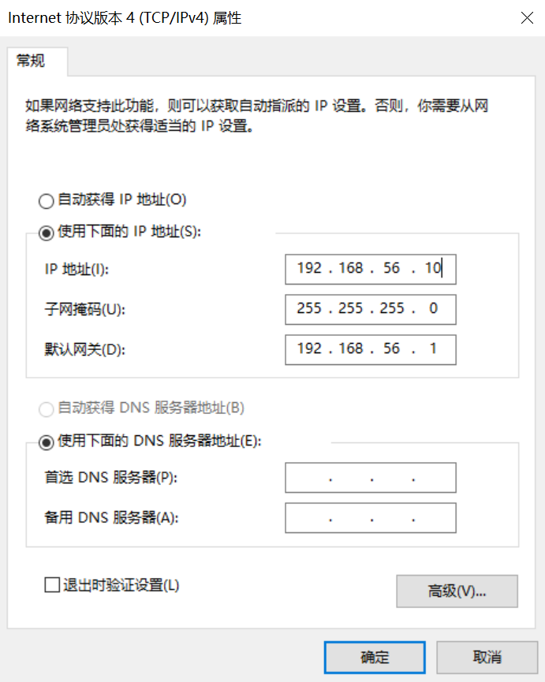
  > 图：课件截图——`Internet 协议版本 4 (TCP/IPv4) 属性`：选中 `使用下面的 IP 地址(S)`，IP 地址(I) = `192.168.56.10`、子网掩码(U) = `255.255.255.0`、默认网关(D) = `192.168.56.1`；DNS 选 `使用下面的 DNS 服务器地址(E)` 但两栏留空。

  **关联后续实验**：这一屏填的是 **Windows 侧**的地址（`.10`），"配置Ubuntu"里的网卡 1 填的是**虚拟机侧**（`.101`），`.1` 是网关位——三个地址记混了就会自己造出一个 ping 不通的现场。重建适配器后 VMware 可能把 `.1` 直接给到 Windows 侧，同网段照样通，不必来回改（见 4.4）。

* **步骤4.** 选中上一步创建的虚拟机，点击"CD/DVD(SATA)"加载步骤2下载的Ubuntu光盘iso文件。

  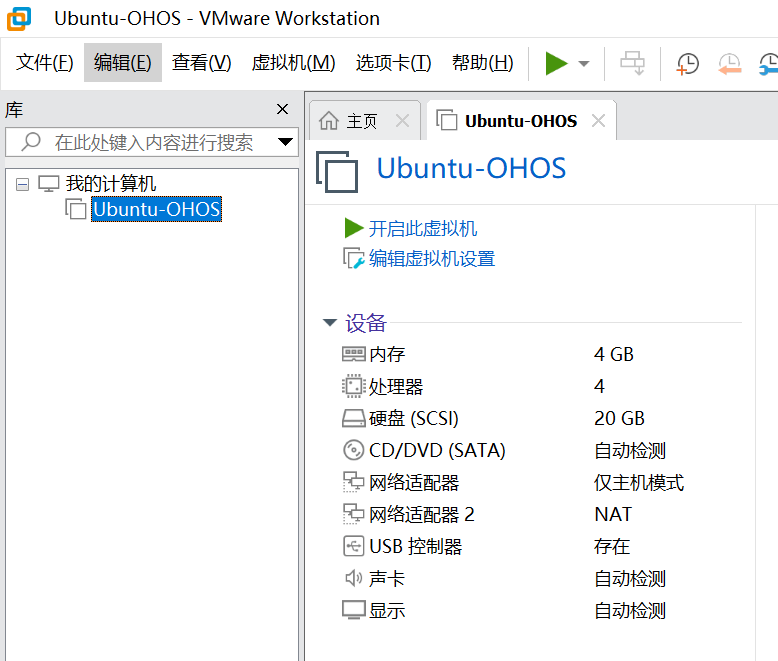
  > 图：课件截图——`Ubuntu-OHOS - VMware Workstation`，左侧库"我的计算机"下选中 `Ubuntu-OHOS`，右侧摘要：`开启此虚拟机`、`编辑虚拟机设置`，设备列表 内存 4 GB、处理器 4、硬盘 (SCSI) 20 GB、CD/DVD (SATA) 自动检测、**网络适配器 仅主机模式**、**网络适配器 2 NAT**、USB 控制器、声卡、显示。这张图既用来说明"选中虚拟机"，也用来说明"点击开启此虚拟机"（同一个位置）。

  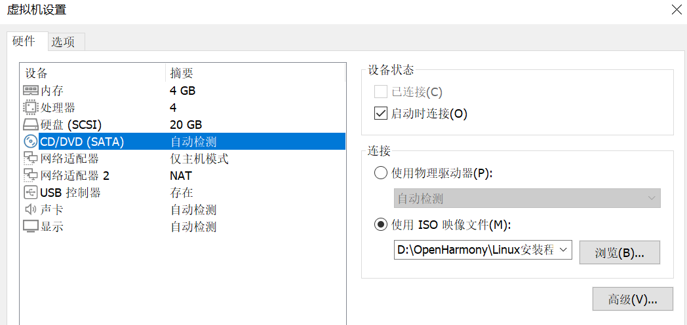
  > 图：课件截图——"虚拟机设置"硬件页选中 `CD/DVD (SATA)`（摘要 自动检测），右侧"连接"选 `使用 ISO 映像文件(M)`，路径框显示 `D:\OpenHarmony\Linux安装程…`（课件机器把 iso 放在 OpenHarmony 目录下），旁边是 `浏览(B)...`；`启动时设备` 处 `启动时连接(O)` 已勾。

  点击"开启此虚拟机"，开始安装Ubuntu。

  
  > 图：与上一步同一张截图（`开启此虚拟机` 就在摘要区第一行）。

  根据提示，选择"Install Ubuntu"安装系统；安装过程中，断开网络连接，以加快安装速度。

  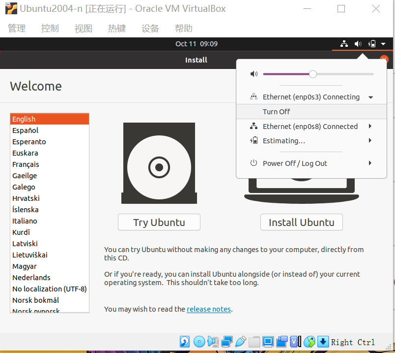
  > 图：**VirtualBox 截图**（标题栏 `Ubuntu2004-n [正在运行] - Oracle VM VirtualBox`，底部有 `Right Ctrl` 提示）——Ubuntu 安装器 Welcome 页，左侧语言列表 English 高亮，中间 `Try Ubuntu` / 右侧 `Install Ubuntu` 两个按钮；右上角系统菜单已展开：音量条、`Ethernet (enp0s3) Connecting`、`Turn Off`、`Ethernet (enp0s8) Connected`、`Estimating…`、`Power Off / Log Out`。**"断开网络连接"就是在右上角这个菜单里对两块以太网口分别 Turn Off**。

  **关联后续实验**：断网只到"装完系统"为止。进系统之后换源、装 gcc、装 open-vm-tools、装 samba 全要靠网卡 2 连回来（见 4.12）——装完还让两块卡都断着，"配置Ubuntu"这一节一步都走不动。

  根据提示设置用户名和密码，并选中Login automatically。为与后续的讲解统一，此处用户名设为：cnu，密码设为：123456。

  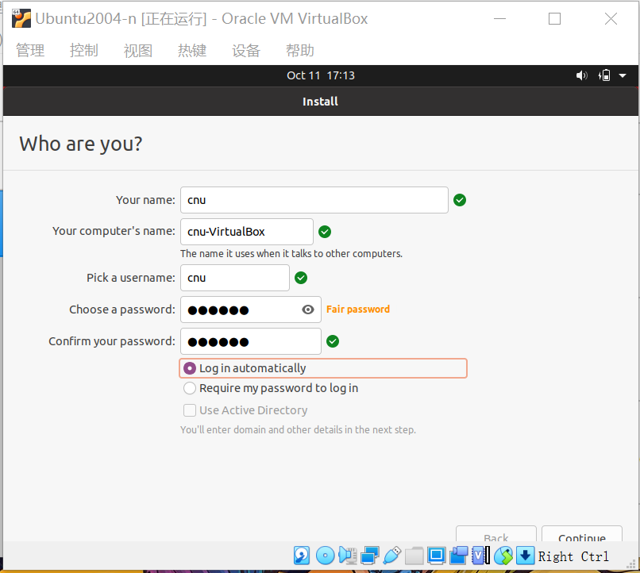
  > 图：**VirtualBox 截图**——安装器 "Who are you?" 页：Your name = `cnu`、Your computer's name = `cnu-VirtualBox`、Pick a username = `cnu`、Choose a password 6 位（右侧强度提示 `Fair password`）、Confirm your password 已打勾，`Log in automatically` 选中（红框），另有 `Require my password to log in`、`Use Active Directory` 未选。

### 2. 配置Ubuntu

安装完成，重启虚拟机进入Ubuntu，对其进行设置。在使用过程中，可能会出现系统升级的提示，注意选择**不升级**、**不升级、不升级**！

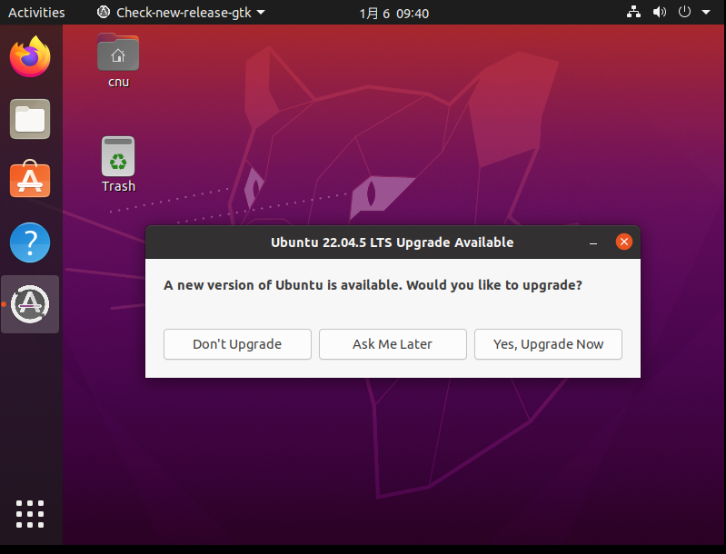
> 图：课件截图——Ubuntu 桌面（左侧 dock 有 Firefox、文件、Ubuntu Software、帮助）中央弹窗 `Ubuntu 22.04.5 LTS Upgrade Available`，"A new version of Ubuntu is available. Would you like to upgrade?"，三个按钮 `Don't Upgrade`、`Ask Me Later`、`Yes, Upgrade Now`——**按正文要求点 `Don't Upgrade`**。这张图里被升级到的目标版本是 22.04.5，正说明我们装的是 20.04，别一路点成 22.04。

* **步骤1.** 在VMware中全屏显示Ubuntu

  如果Ubuntu不能全屏显示，先关闭虚拟机，然后选择"显示"—>"指定监视器设置"，为虚拟机设置一个较大的分辨率，如1920*1080。

  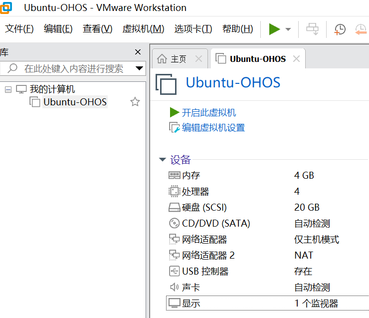
  > 图：课件截图——`Ubuntu-OHOS` 主页设备列表，底部 `显示  1 个监视器` 被虚线框选中；上方仍是 内存 4 GB / 处理器 4 / 硬盘 (SCSI) 20 GB / CD/DVD (SATA) 自动检测 / 网络适配器 仅主机模式 / 网络适配器 2 NAT / USB 控制器 / 声卡。

  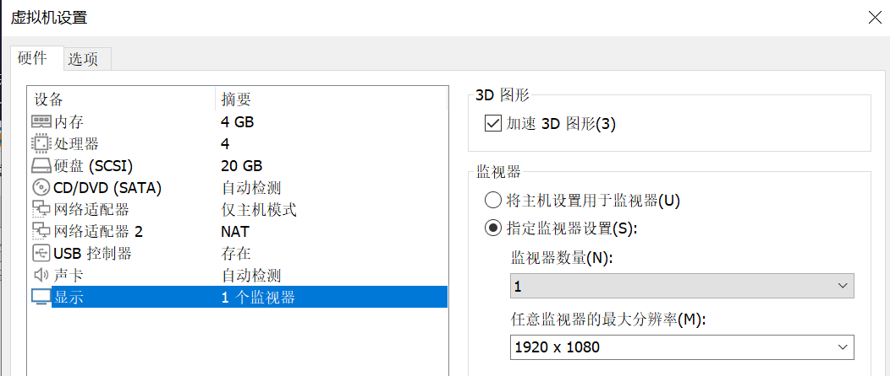
  > 图：课件截图——"虚拟机设置"选中"显示"（摘要 1 个监视器），右侧 3D 图形 `加速 3D 图形(3)` 已勾；监视器区选 `指定监视器设置(S)`，`监视器数量(N) = 1`，`任意监视器的最大分辨率(M) = 1920 x 1080`。

  启动虚拟机，进入Ubuntu桌面，点击鼠标右键选择"Display Settings"—>"Resolution"，把分辨率设置成与前面一致的分辨率，如1920*1080。

  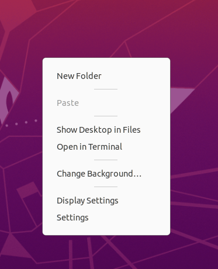
  > 图：课件截图——Ubuntu 桌面空白处右键菜单：`New Folder`、`Paste`（灰）、`Show Desktop in Files`、`Open in Terminal`、`Change Background…`、**`Display Settings`**、`Settings`。

  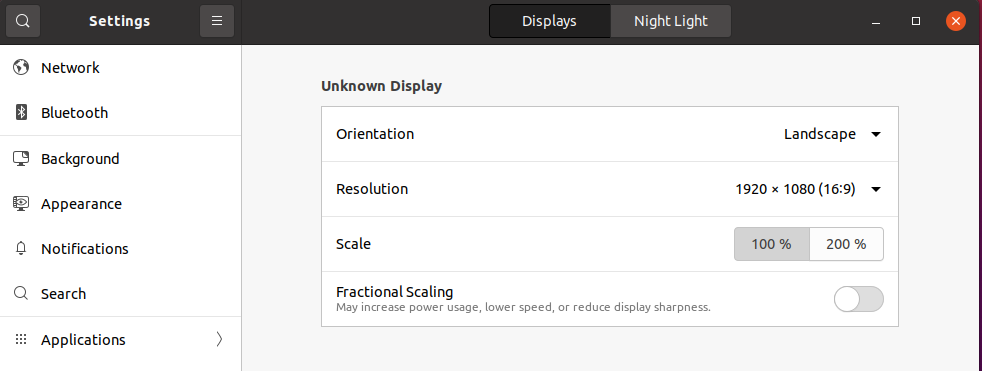
  > 图：课件截图——Settings → Displays（同排还有 Night Light）：Unknown Display，`Orientation = Landscape`、**`Resolution = 1920 × 1080 (16:9)`**、`Scale` 在 `100 %` / `200 %` 之间（当前 100%）、`Fractional Scaling` 关闭。左侧栏可见 Network、Bluetooth、Background、Appearance、Notifications、Search、Applications。

* **步骤2.** 配置网络

  设置网卡1的IP为192.168.56.x，其中x为1~254之间任意值，子网掩码为255.255.255.0，**注意不要填Gateway**，以免外网流量通过网卡1转发。为与后续的讲解统一，此处IP设置为：192.168.56.101。

  网卡2打开网络连接即可，无需设置IP。

  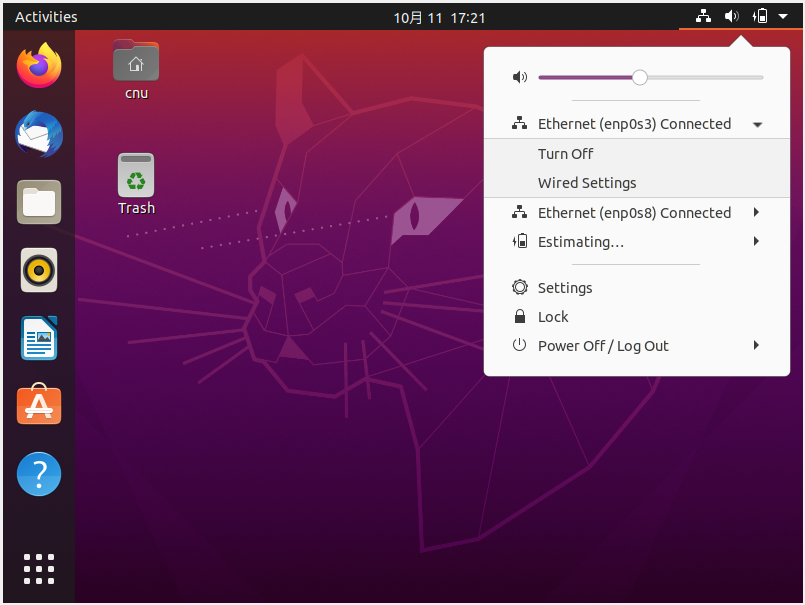
  > 图：课件截图——Ubuntu 右上角系统菜单展开：`Ethernet (enp0s3) Connected` 已展开出 `Turn Off` / **`Wired Settings`**，其下 `Ethernet (enp0s8) Connected`、`Estimating…`、`Settings`、`Lock`、`Power Off / Log Out`。两块以太网口对应虚拟机的网卡 1 与网卡 2。

  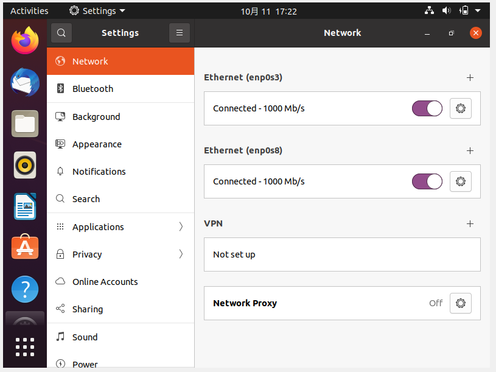
  > 图：课件截图——Settings → Network：`Ethernet (enp0s3)` = `Connected - 1000 Mb/s`（开关打开，右侧齿轮）、`Ethernet (enp0s8)` = `Connected - 1000 Mb/s`（开关打开）、`VPN = Not set up`、`Network Proxy = Off`。**给网卡 1 配静态 IP 就点它那一行右侧的齿轮**。

  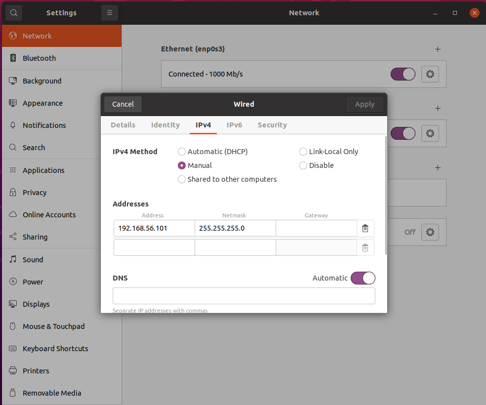
  > 图：课件截图——`Wired` 编辑对话框，页签 Details / Identity / **IPv4** / IPv6 / Security：`IPv4 Method` 选 `Manual`（另有 Automatic (DHCP)、Shared to other computers、Link-Local Only、Disable），Addresses 一行 `Address = 192.168.56.101`、`Netmask = 255.255.255.0`、**`Gateway` 栏空着**，DNS 的 Automatic 打开。右上角 `Apply`。这正是正文"**注意不要填 Gateway**"的界面落点。

  **关联后续实验**：Gateway 这一栏**空着**是硬规定，不是"暂时先不填"。填了它，外网流量就会往这块仅主机卡上走，NAT 形同废掉、apt 时好时坏；以后遇到"虚拟机上不了网"或"共享时通时不通"，第一个要回看的就是这一栏。

* **步骤3.** 更换软件源

  点击左下角的图标，在弹出的搜索框中搜索"Software & Updates"并打开。
  > 图：句内小图标 = Ubuntu 桌面 dock 左下角的"九点"Launchpad 图标（3×3 白点、深色底，原文以行内小图给出，不是截图）。

  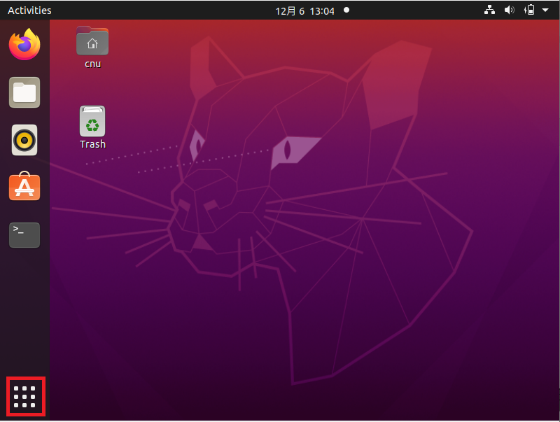
  > 图：课件截图——Ubuntu 20.04 桌面（时间 12月6 13:04，dock 有 Firefox、邮件、播放器、Ubuntu Software、终端），**左下角九点图标被红框框出**。

  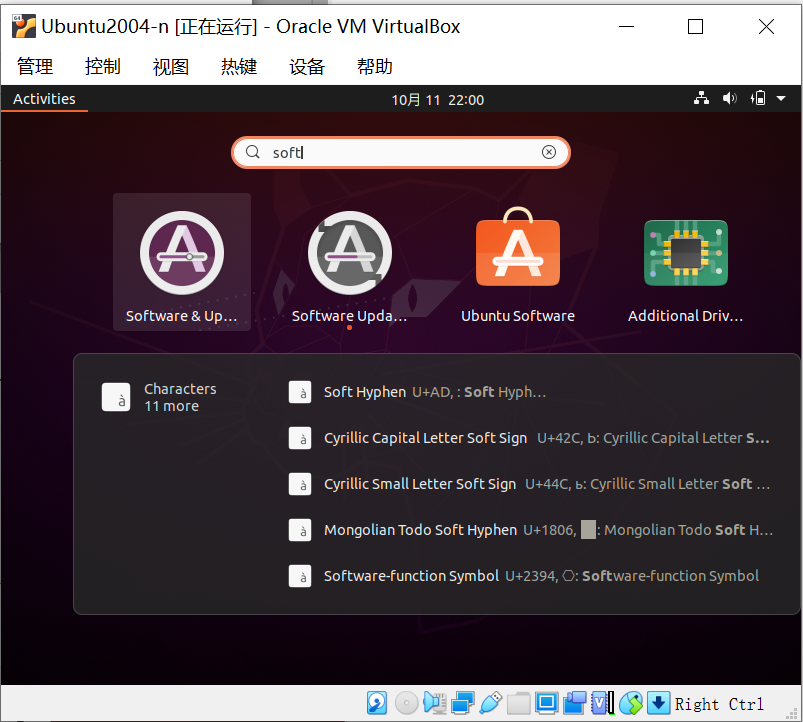
  > 图：**VirtualBox 截图**——Launchpad 搜索框输入 `soft`，命中四个应用：`Software & Up…`（即 Software & Updates，本次要打开的）、`Software Upda…`、`Ubuntu Software`、`Additional Driv…`；下方还列出 Characters/Unicode 一类无关结果（Soft Hyphen 等）。

  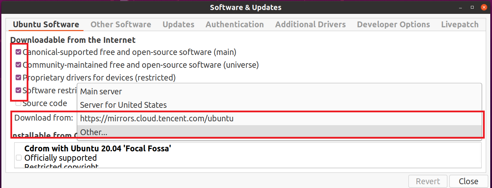
  > 图：课件截图——`Software & Updates` 的 `Ubuntu Software` 页，"Downloadable from the Internet" 下**四个选项已勾**（红框）：`Canonical-supported free and open-source software (main)`、`Community-maintained free and open-source software (universe)`、`Proprietary drivers for devices (restricted)`、`Software restricted by copyright or legal issues (multiverse)`，`Source code` 未勾；`Download from:`（红框）下拉展开，可见 `Main server`、`Server for United States`、`https://mirrors.cloud.tencent.com/ubuntu`、**`Other…`**（高亮）。下方 "Installable from cdroms" 显示 `Cdrom with Ubuntu 20.04 'Focal Fossa'`。

  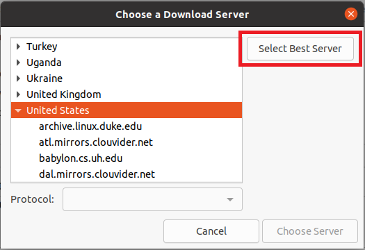
  > 图：课件截图——`Choose a Download Server` 对话框：左侧按国家展开的服务器树（Turkey、Uganda、Ukraine、United Kingdom、**United States** 展开出 archive.linux.duke.edu、atl.mirrors.clouvider.net、babylon.cs.uh.edu、dal.mirrors.clouvider.net…），右上角红框按钮 **`Select Best Server`**，底部 `Protocol:` 下拉、`Cancel` / `Choose Server`。

  **关联后续实验**：源换得好不好，决定后面**每一次** `apt install` 的等待时间——实验一装 SDK 的依赖、实验十三装 `tftpd-hpa`，成本都压在这一条上。换完源之后第一次 `apt update` 报错，通常是这一步没做完，不是网络坏了。

* **步骤4.** 关闭Ubuntu自动更新

  打开"Software & Updates"，选择如下图所示的配置。

  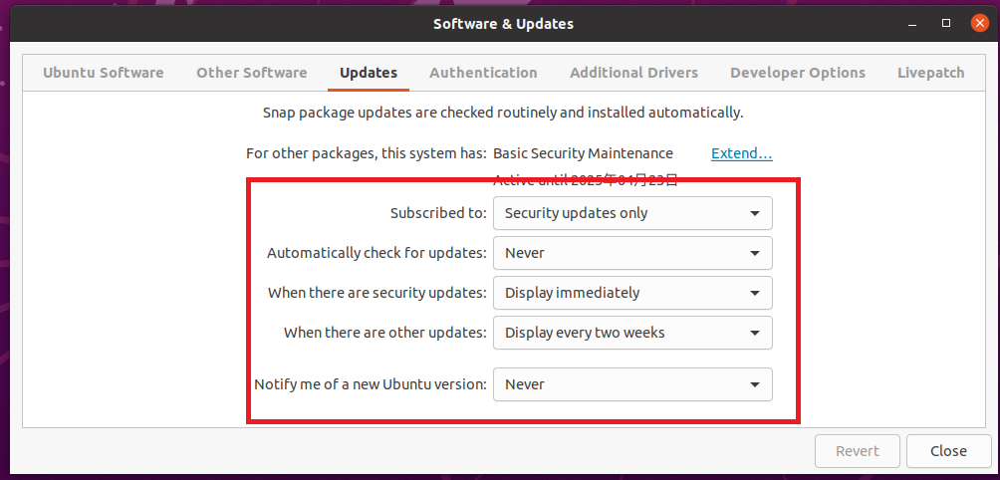
  > 图：课件截图——`Software & Updates` 的 `Updates` 页，红框内五项：`Subscribed to: Security updates only`、`Automatically check for updates: Never`、`When there are security updates: Display immediately`、`When there are other updates: Display every two weeks`、`Notify me of a new Ubuntu version: Never`；框外另有 `Snap package updates are checked routinely and installed automatically.` 与 `For other packages, this system has: Basic Security Maintenance Active until 2025年1月29日  Extend…`。

  **关联后续实验**：这一页与前面"不升级、不升级、不升级"是同一件事的两头——页面上 `Notify me of a new Ubuntu version` 选 **Never**，就是为了让那个升到 22.04 的弹窗永远不再出现。真被升上去了，实验一的 SDK 安装脚本与整套依赖都要重验一遍（步骤 2 末尾那条「关联后续实验」说的就是这件事）。

* **步骤5.** 安装gcc

  终端中执行以下命令：

  ```bash
  sudo apt update
  sudo apt install build-essential
  ```

  **关联后续实验**：这一步装的是**虚拟机自己的 x86 gcc，不是交叉编译器**。真正的 ARM 交叉工具链要到实验一才装（`/opt/st/stm32mp1/3.1-openstlinux-5.4-dunfell-mp1-20-06-24`，每个新终端 `source /stm32env` 激活）。两者的界线会在后面每次编译时现形：新终端忘了激活工具链就 `make`，编译器就落回这个 x86 gcc，报 `cc1: error: bad value ('generic-armv7-a') for '-mtune=' switch`（报错里列出一串 Intel/AMD 的 `-mtune` 取值就是铁证）——那时该补的是激活命令，不是重装 gcc。

* **步骤6.** Windows和Ubuntu之间复制粘贴

  终端中执行以下命令：

  ```bash
  sudo apt install open-vm-tools-desktop
  ```

  重启Ubuntu后生效。

  **关联后续实验**：后面每一个实验都要在 Windows 与 Ubuntu 之间来回搬命令、搬终端输出，这一条决定你是"复制粘贴"还是"照着屏幕手打"。装完**必须重启**才生效，别在旧会话里反复试。

* **步骤6.** 把shell环境修改为bash

  在终端中执行以下命令，查看符号链接sh 是否指向bash：

  ```bash
  ls -l /bin/sh
  ```

  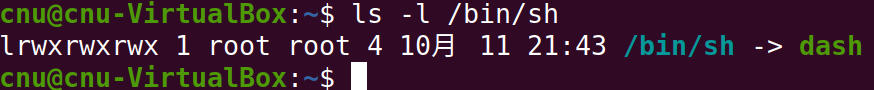
  > 图：课件截图（提示符 `cnu@cnu-VirtualBox`）——`ls -l /bin/sh` 输出 `lrwxrwxrwx 1 root root 4 10月 11 21:43 /bin/sh -> dash`，即默认指向 **dash**，所以要执行下面的修改命令。

  如果不是指向bash，执行以下命令进行修改：

  ```bash
  sudo dpkg-reconfigure dash
  ```

  在弹出对话框中选择**No**，如下图所示。

  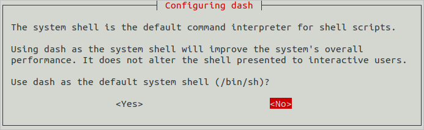
  > 图：课件截图——debconf 文本框 `Configuring dash`："The system shell is the default command interpreter for shell scripts. Using dash as the system shell will improve the system's overall performance. It does not alter the shell presented to interactive users."，问题 `Use dash as the default system shell (/bin/sh)?`，选项 `<Yes>` 与红框选中的 **`<No>`**。

  **关联后续实验**：改的是 `/bin/sh` 这个符号链接的指向，影响的是**所有用 `sh` 起的脚本**，不是当前终端的交互 shell（提示符那个 bash 一直就是 bash）。原文把它列为必修项，照做即可；改完用 `ls -l /bin/sh` 复核，应当显示 `-> bash`。本仓库没有单独复现过"因为 dash 而失败"的构建，所以不在这儿断言它会报什么错——但后面真碰上脚本类报错时，这一项是可以用一条命令排除掉的变量。

### 3. Windows访问Ubuntu

* **步骤1.** 检查网络是否连通

  在Windows的搜索栏中搜索"cmd"，打开"命令提示符"，在命令窗口中用ping命令ping Ubuntu网卡1的IP（此处为192.168.56.101），检查网络是否连通，确认连通后进入后续步骤。

  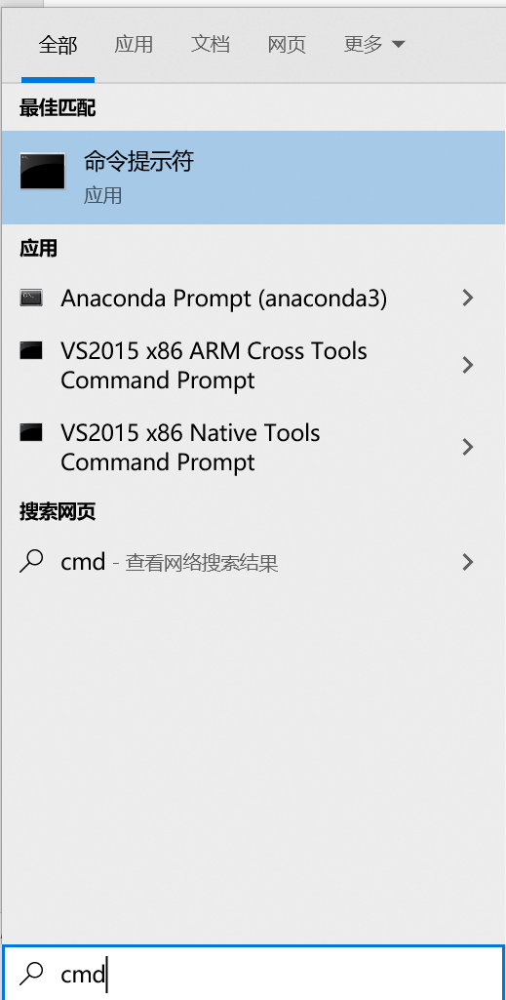
  > 图：课件截图——Windows 搜索框输入 `cmd`，最佳匹配 `命令提示符 / 应用`；"应用"区还列出 Anaconda Prompt (anaconda3)、VS2015 x86 ARM Cross Tools Command Prompt、VS2015 x86 Native Tools Command Prompt。

  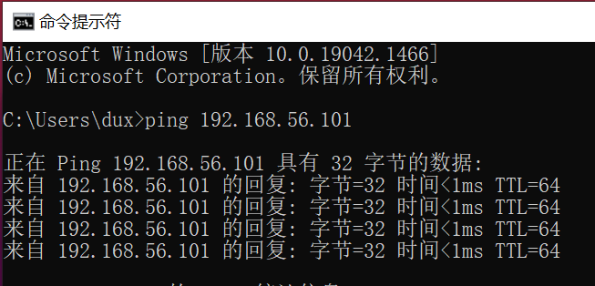
  > 图：课件截图——`Microsoft Windows [版本 10.0.19042.1466]`，`C:\Users\dux>ping 192.168.56.101`，四行 `来自 192.168.56.101 的回复: 字节=32 时间<1ms TTL=64` = **网卡 1 这条仅主机链路已通**（TTL 64 是 Linux 侧默认值）。

  **关联后续实验**：这条 `ping 192.168.56.101` 是以后每次"共享打不开 / Z 盘掉了"的第一根探针——4.1 那次事故最先给出的信号就是它变成"目标主机不可达"。它不通就别往下装 samba，装了也连不上。

* **步骤2.** 支持ssh登录Ubuntu

  在Ubuntu中执行以下命令，安装openssh-server。

  ```bash
  sudo apt install openssh-server
  ```

* **步骤3.** 在Ubuntu中安装samba服务器

  在Ubuntu中安装samba服务器，用于与Windows共享文件。在Ubuntu中，通过以下命令安装samba：

  ```bash
  sudo apt install samba
  ```

  执行以下命令，创建共享目录（此处目录名为share），并设置权限为读、写、执行：

  ```bash
  mkdir share
  sudo chmod 777 share
  ```

  执行以下命令，添加samba用户（此处用户名为：cnu，密码为：123456）

  ```bash
  sudo smbpasswd -a cnu
  ```

  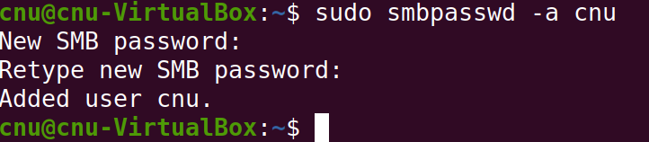
  > 图：课件截图（提示符 `cnu@cnu-VirtualBox`）——`sudo smbpasswd -a cnu` 后依次提示 `New SMB password:`、`Retype new SMB password:`，回显 `Added user cnu.`。**注意 `smbpasswd` 的密码是与系统登录密码独立的一套**，这里按正文填 123456。

  修改samba的配置文件/etc/samba/smb.conf。执行以下命令打开文件：

  ```bash
  sudo gedit /etc/samba/smb.conf
  ```

  在上述打开的文件中，添加以下内容：

  ```
  [share]
  comment = share folder
  browseable = yes
  path = /home/cnu/share
  create mask = 0700
  directory mask = 0700
  valid users = cnu
  force user = cnu
  force group = cnu
  public = yes
  available = yes
  writable = yes
  ```

  **关联后续实验**：这段配置里有四处会在后面撞上——① `path = /home/cnu/share` 的**用户名是写死的**，换用户名要同步改这一行；② `smbpasswd -a` 设的是 samba **独立的一套密码**，与 Ubuntu 登录密码不是一回事（第 47 张图里那行红字 `拒绝访问。` 就是填错的现场）；③ **这个 share 目录不能用来装交叉编译工具链**——VMware 共享不支持 Linux 符号链接，工具链必须装到 `/opt/st/...`（见 4.7 与实验一）；④ 实验十三的 TFTP 根目录是虚拟机里的 `/home/cnu/tftpboot`，**不在这个 share 里**，别到 Z: 盘去找它。

* 步骤4 在Windows中添加网络硬盘

  Windows中按快捷键"Win+R"打开"运行"窗口，在窗口中输入Ubuntu网卡1的IP，然后点击"确定"。

  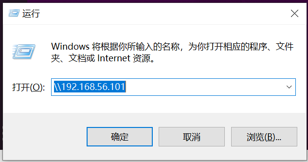
  > 图：课件截图——"运行"对话框，`打开(O):` 填 `\\192.168.56.101`（双反斜杠 + Ubuntu 网卡 1 的 IP），按钮 `确定` / `取消` / `浏览(B)...`。

  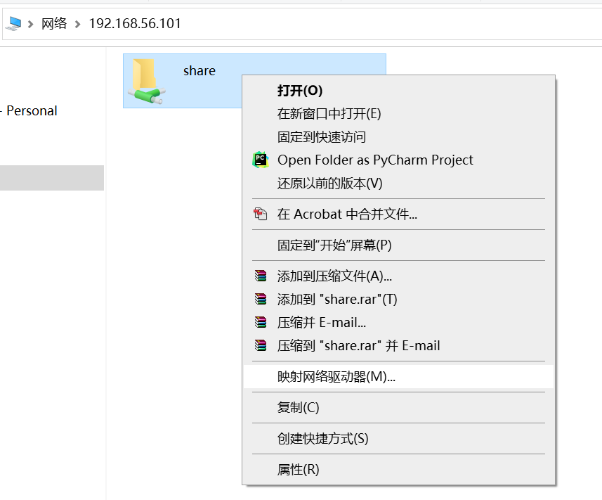
  > 图：课件截图——`网络 > 192.168.56.101` 里出现共享文件夹 `share`，右键菜单展开，菜单项 `映射网络驱动器(M)...` 高亮（同列还有 打开(O)、在新窗口中打开(E)、固定到快速访问、在 Acrobat 中合并文件…、复制(C)、属性(R) 等）。

  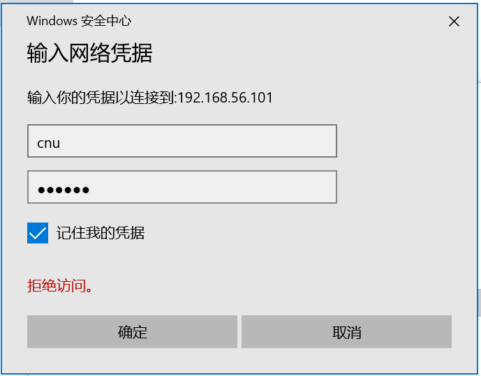
  > 图：课件截图——`Windows 安全中心 / 输入网络凭据`，"输入你的凭据以连接到:192.168.56.101"，用户名 `cnu`、密码 6 位、`记住我的凭据` 已勾；**图中密码框下方另有一行红字 `拒绝访问。`**（课件截图原样，原文没有解释它的成因）。要填的是**步骤 3 里 `smbpasswd -a` 设的那套 samba 用户名/密码**，不是 Ubuntu 登录密码——两者恰好都写成 cnu/123456 才看不出区别。

  该网络硬盘在Windows系统中可以看到为Y盘，访问Y盘即可访问Ubuntu的share目录。

  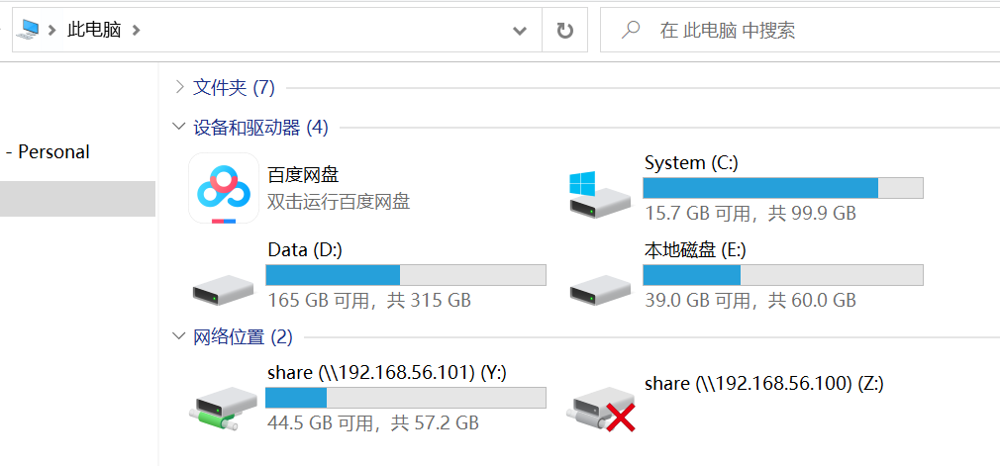
  > 图：课件截图——`此电脑`：设备和驱动器(4) = 百度网盘、System (C:) 15.7 GB 可用共 99.9 GB、Data (D:) 165 GB 可用共 315 GB、本地磁盘 (E:) 39.0 GB 可用共 60.0 GB；**网络位置(2)** = `share (\\192.168.56.101) (Y:)` 44.5 GB 可用共 57.2 GB、`share (\\192.168.56.100) (Z:)`（图标带红叉 = 当前未连接）。可见**盘符本身不是固定的**：原文写 Y 盘，课件自己这张截图里也同时挂着 Y: 和 Z: 两个共享。

  **关联后续实验**：这个映射盘**走的是网卡 1**，所以往后任何动网卡 1 的动作（改类型、改子网、还原默认设置）都会让它掉线——4.1 与 4.6 两条说的就是同一件事的两端。反过来，VMware Tools 的共享文件夹（hgfs）不吃网卡，掉盘时它还在，可以用来判断"是网断了还是 Samba 断了"。

## 四、踩坑与环境差异（本仓库实测补充，非原文内容）

这一节不是那份 docx 里的字，是我们照它做完、又在后面的实验里反复回到这套网络配置之后记下的账。原文那套步骤本身没错，错的基本都在"改错了对象""改动没落盘""把装 Ubuntu 阶段的规定当成了永久规定"这三类。

### 4.1 VMnet1 被改成"桥接模式"，结果 Windows 侧那块适配器整个消失

* **现象**：`\\192.168.56.101` 映射的网络硬盘（我们这边是 Z: 盘）打不开；Windows 与 Ubuntu 互 ping 全报"目标主机不可达"；而且**与 VMware 开没开机无关**。
* **根因**：虚拟网络编辑器里 VMnet1 的**类型**被改成了「桥接模式」，同时丢了「将主机虚拟适配器连接到此网络」这个勾。仅主机网段 `192.168.56.0/24` 随之不存在，VMware 直接把 Windows 侧的 `VMware Network Adapter VMnet1` **设备实例删掉了**——不是"IP 配错"，是那块网卡没了。原文步骤里"把子网IP设置为 192.168.56.0，并把'将主机虚拟适配器连接到此网络'勾选上"这一句，两个条件（类型 = 仅主机模式、勾要常开）都是硬要求。
* **怎么定位**（全是只读命令）：`Get-NetAdapter -IncludeHidden` 与 `pnputil /enum-devices` 都查不到这块适配器，但 `C:\Windows\System32\drivers\` 下的 `vmnet*.sys` 驱动文件都还在 → 结论是**不用重装 VMware**，把配置改回去就会重建设备。编辑器当时的样子也有诊断价值：列表只剩 `VMnet1 桥接模式 / 外部连接 ASIX` 和 `VMnet8 NAT`，**VMnet0 那一行整个不见了**。
* **怎么修**：编辑器里把 VMnet1 改回"仅主机模式"、勾上那两个勾、子网填回 `192.168.56.0`，点「确定」。若列表已经乱掉（VMnet0 缺失或整体错位），点左下角「**还原默认设置(R)**」重建三件套——这会顺带把 VMnet8 子网恢复成默认值，Ubuntu 的 NAT 网卡是 DHCP，会自动跟上，不用手动改。
* 同类事故（改 VMnet1 之后掉盘、以及加第三块网卡的全过程）在 `02_使用U-Boot/14_实验十三_网络操作命令与TFTP服务器搭建.md` 第六节「踩坑实录」里有带截图的现场记录。

### 4.2 加网卡要去点「添加(A)...」，在现有卡上改模式等于把网卡挪走

要"再加一块网卡"时，如果直接在设备列表里选中已有的"网络适配器"改它的模式，效果是**把网卡 1（仅主机）或网卡 2（NAT）改成了别的**，而不是新增一块——我们实测差点发生（编辑器里第一块卡被选中改成了"桥接模式"，幸好没点确定）。正确做法见第三节步骤 3 的第 11 张图：硬件对话框左下方「添加(A)...」→「网络适配器」→「完成」→ 再选模式。

**改动必须点「确定」才落盘**，图形界面里"看着已经加上了"不作数。验证方法（关机状态下看虚拟机目录里的 `.vmx`）：新增成功会多出下面这类行——

```
ethernet2.present = "TRUE"
ethernet2.connectionType = "custom"
ethernet2.vnet = "VMnet0"
```

### 4.3 认网卡一律看驱动描述，别认"以太网 N"这种编号

原文让我们改"仅主机模式的网卡（VMnet1）"，这在 Windows 侧是明确的；但到了做板子网络实验时，机器上往往还有**两块 USB 网卡**，Windows 只给"以太网 N"这种随插拔变化的显示名。有一次就是照编号改，把静态地址配到了 `Realtek USB 2.5GbE` 上，**校园网外网当场断**。稳定的认法：

| 要看的东西 | 稳定标识 |
|---|---|
| Windows 侧物理网卡 | 驱动描述：`ASIX USB to Gigabit Ethernet Family Adapter` = 接开发板（`192.168.0.x`）；`Realtek USB 2.5GbE Family Controller` = 上校园网（DHCP `10.253.x.x`） |
| Windows 侧虚拟网卡 | 名称就是 `VMware Network Adapter VMnet1` / `VMnet8`，不会变 |
| Ubuntu 侧 | `ip -4 addr show` + `ip route`，接口名 `ens33`/`ens37`/`ens38`（取自 PCI 插槽号，与 `.vmx` 的 `pciSlotNumber` 对应） |

改任何网卡之前先对一眼描述列：`ipconfig`（看"描述"）或 `Get-NetAdapter -IncludeHidden | Select-Object Name,InterfaceDescription,Status`。

### 4.4 原文的 Windows 侧 IP 是 192.168.56.10，重建后 VMware 给的是 192.168.56.1

原文规定 Windows 侧 VMnet1 = **192.168.56.10**、掩码 255.255.255.0、网关 **192.168.56.1**。走了一遍 4.1 的「还原默认设置」之后，VMware 给这块主机适配器的地址是 `192.168.56.1`（正好是该网段的网关位）。**同网段就通，不必来回改**；但要知道这个位置可能已被占用，Ubuntu 侧网卡 1 别再填 `192.168.56.1`（原文取的是 `.101`，本来也不冲突）。

### 4.5 "有桥接模式的网卡就删除"是装 Ubuntu 阶段的规定，第 4 章还要把桥接加回来

原文那句针对的是**装系统时**（避免安装过程被物理网络干扰）。到做板子网络的实验（实验十三起）时，课程另一套要求是**另加第三块网卡做桥接**：VMnet0 手动指定到那块 ASIX USB 网卡，虚拟机里静态 `192.168.0.100` 当板子的 `serverip`，Windows 那块 ASIX 从 `.100` 让位改成 `.99`。原有两块（仅主机 + NAT）保持不动，所以加第三块既不断外网、也不掉 Z: 盘。**别把"删除桥接"当成永久规定，也别用改现有网卡的方式去"加"桥接**（见 4.2）。

### 4.6 本篇的"共享"有两种，走的路完全不同，别混

| 共享方式 | 出处 | 走什么 | 动网卡 1 会怎样 |
|---|---|---|---|
| Samba 映射网络驱动器（Win+R → `\\192.168.56.101` → 映射成 Z: 盘） | 本篇「三、实验步骤」第 3 小节的全部内容 | **网卡 1（仅主机 VMnet1）** | **掉盘** |
| VMware Tools 共享文件夹（hgfs，挂载点 `~/Desktop/LINUX-gy`） | 装 `open-vm-tools-desktop` 后由 VMware 提供 | 宿主机文件系统直通 | 不受影响 |

两者的区别在 2026-09-22 那次掉盘事故里被彻底分清：Z: 盘掉线时 hgfs 那侧照常用。**盘符**（原文 Y 盘 / 我们 Z 盘）只是映射那一步选的字母，不是配置项。

### 4.7 共享文件夹里不能装交叉编译工具链（原文的 share 目录有个硬限制）

本篇把 `~/share` 映射成 Windows 网络盘，很自然想把源码和 SDK 都放进去。**SDK 不行**：VMware 共享文件夹不支持 Linux 符号链接，而交叉编译工具链整棵树都靠符号链接，装进去会坏。所以工具链必须装到虚拟机本地磁盘的默认目录 `/opt/st/stm32mp1/3.1-openstlinux-5.4-dunfell-mp1-20-06-24`（安装脚本是长名字的 `st-image-weston-*.sh`，不是 `install.sh`；目标目录**直接回车用默认值**）。源码放共享里能编，只是慢——细节见 `02_实验一_安装交叉编译工具链.md`。

### 4.8 Clash 的虚拟网卡会让端口探测给出假阳性

机器上挂着 Clash 时，它的 `Meta` 虚拟网卡占着默认路由，`Test-NetConnection 192.168.56.101 -Port 445` 会返回 **`TcpTestSucceeded = True` 而 `PingSucceeded = False`** 的假阳性。判 Samba 共享通不通，要看 `net use` 的实际映射状态、以及能不能真的列出 `\\192.168.56.101\share` 里的文件，别信端口探测那一行。

### 4.9 改虚拟机网络前先彻底关机；挂起不算关机

添加/修改适配器建议先在 Ubuntu 里 `sudo poweroff`（VMware 支持热插拔，但 NetworkManager 会给"新出现"的设备另建一条连接，而改虚拟网络编辑器本身还会让网络瞬断一次，两件事叠在一起很难判断是谁干的）。**挂起（suspend）状态下改配置不算安全**——挂起时虚拟机内部仍认为设备在位。

### 4.10 新加的网卡在 Ubuntu 里会一直停在"连接中（正在获取 IP 配置）"，这是正常的

第三块卡（桥接）加好后，那条线路上**没有 DHCP 服务器**，NetworkManager 等不到地址属正常现象，手工填静态即可。另外它的连接名可能是**中文**（实测叫「有线连接 1」），要用 `nmcli` 改配置时先 `nmcli connection show` 看一眼真实连接名，别照抄英文示例。

### 4.11 课件截图混用了 VirtualBox，界面与网卡名都对不上我们这台机器

本篇有若干张截图（第 24、25、36、40、44 张）来自 **VirtualBox**：标题栏写 `Ubuntu2004-n [正在运行] - Oracle VM VirtualBox`、终端提示符是 `cnu@cnu-VirtualBox`、网卡名是 `enp0s3` / `enp0s8`。我们的实验机是 **VMware**（主机名 `cnu-virtual-machine`，网卡 `ens33` / `ens37` / `ens38`）。**Ubuntu 桌面内部的设置界面是一致的**（Wired Settings、Software & Updates、Displays 这些），不一致的是虚拟机外壳——凡涉及 VMware 菜单、USB 设备转交、串口会话的操作，一律按 VMware 的界面做，别照抄课件截图。

### 4.12 装 Ubuntu 时"断开网络"，装完之后要记得连回来

原文步骤 4 说"安装过程中，断开网络连接，以加快安装速度"——那是安装阶段的加速手段。进系统之后，换软件源（步骤 3）、`sudo apt update`（步骤 5）、装 `open-vm-tools-desktop`（步骤 6）、装 `openssh-server` 与 `samba`（第三节）全都依赖联网，**走的是网卡 2（NAT）**。装完系统还让两块卡都断着，后面每一步都会卡在"Unable to connect"。

### 4.13 磁盘容量按 100 GB 建，别拿 VMware 弹的 20 GB 建议值就用

正文只说"建议 60GB 以上"，课件截图里填的是 100 GB，而 VMware 在同一个界面上自动给出的建议值是 20 GB——**按 100 GB 建**。理由不在 Ubuntu 系统本身，而在后面的实验：实验一要装的 ST SDK 安装包就有 `en.SDK-x86_64-stm32mp1-openstlinux-5.4-dunfell-mp1-20-06-24.tar.xz` 949,496,136 字节（约 0.89 GB），解压 + 安装到 `/opt/st/...` 之后成倍膨胀，再叠上 U-Boot/内核源码树、编译产物、烧写用的镜像，20 GB 撑不到第 5 章。虚拟盘"未使用的空间不占物理硬盘"，所以这一步宁大勿小；建好之后再放大容量就要动 `.vmdk`，比一开始填够麻烦得多。

### 4.14 本篇动作 → 后面哪一篇会用到 → 现在偷懒的后果

| 本篇动作 | 后面谁用 | 偷懒/做错的后果 |
|---|---|---|
| 网卡 1 = 仅主机 VMnet1，Ubuntu 侧静态 `192.168.56.101`、**不填 Gateway** | 实验一~十一的共享目录与 Z: 盘；实验十三复核 TFTP 服务器地址 | 填了 Gateway → 外网流量走这块卡，NAT 形同废掉、apt 时好时坏；类型改错 → 见 4.1，Z: 盘整个掉线 |
| 网卡 2 = NAT，打开连接即可 | 所有 `apt install`（实验一的依赖、实验十三的 `tftpd-hpa`、解 rar 的工具） | 删了或改走 → 装包全部卡住；顺序上必须**先 apt 装包、后改桥接** |
| 删除桥接网卡（装系统阶段的规定） | 第 4 章实验十三要**另加**第三块网卡桥到 ASIX | 误当成永久规定 → 到实验十三发现没有 VMnet0 可桥，只能还原默认设置重来 |
| `open-vm-tools-desktop`（Windows↔Ubuntu 复制粘贴） | 全程：把 Windows 侧准备好的命令粘进 Ubuntu 终端，以及把终端输出反向带回 Windows | 没装就只能手打；手打命令是我们踩过的那类错（`Unknown command 'setenv'` 的真因就是进串口的字节被污染，见 `10_实验九_F-5替换网卡驱动.md`） |
| `dpkg-reconfigure dash` 选 No（`/bin/sh` 指向 bash） | 后续所有 shell 脚本与构建脚本类操作 | 原文列为必修项，按它做即可；本仓库没有单独复现过因 dash 而失败的构建，**不在此断言具体报错** |
| Samba 共享 + 映射网络驱动器（Z: 盘） | 实验一把 SDK/源码搬进虚拟机；实验十一后曾整树复制到 `Z:\Linux\Test2` 供 Windows 直读源码 | 共享建不起来就只能靠 U 盘/拖拽搬文件；**但工具链不能装进共享**（4.7） |
| `openssh-server` | 可选：从 MobaXterm 用 SSH 会话登进虚拟机，比在 VMware 控制台里打字舒服 | 本仓库的实验都在 VMware 控制台里做，这一项装不装不影响实验成败 |

## 五、下一步

到这里环境就齐了：Ubuntu 20.04 双网卡 + bash + gcc + 与 Windows 互通的共享目录。第 3 章的第一个实验（安装交叉编译工具链）就从这套环境里开始，见 `02_实验一_安装交叉编译工具链.md`；那份指导里"工具链必须装默认目录 `/opt/st/...`"这一条，根因就在本篇第四节 4.7。
