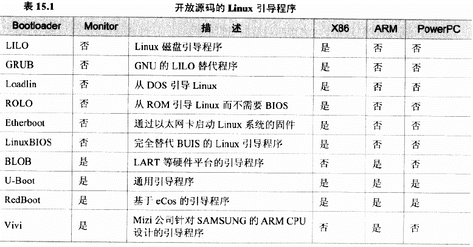
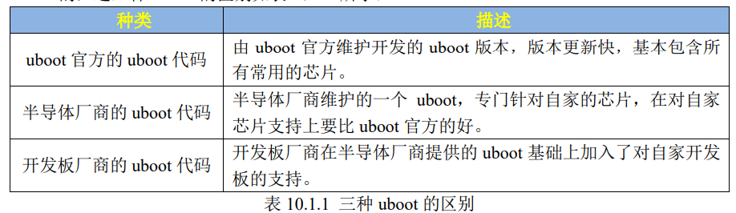
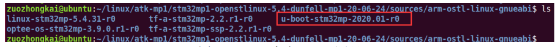
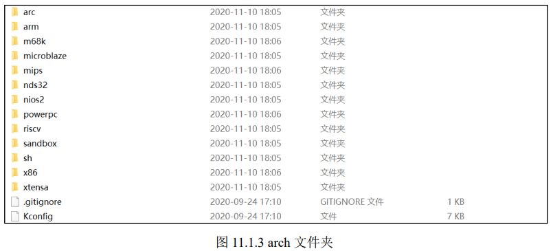
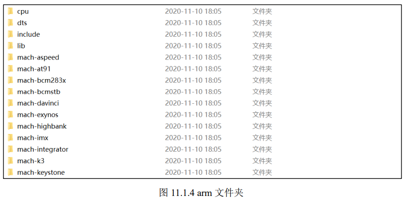
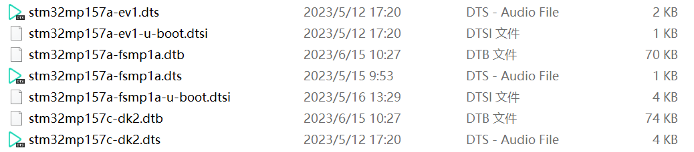
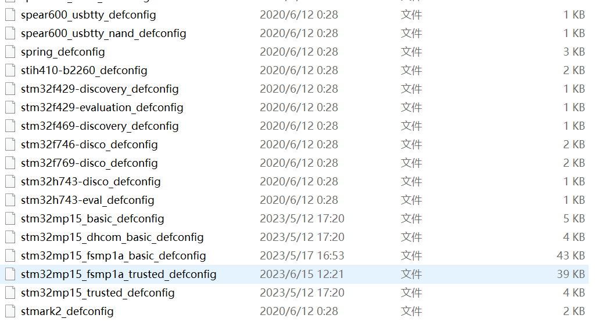

# 实验导论：看懂 U-Boot，再谈移植

> **系列说明**：本系列基于正点原子 FS-MP1A（STM32MP157A）开发板，实验指导从课件《第3章 移植U-Boot》3.4 节开始（Slide 28 起）。本篇是全套实验的**先导篇**，覆盖 3.1~3.3 节的理论基础（Slide 1-26）——动手之前，先想明白三件事：Bootloader 是干什么的、为什么是 U-Boot、它的源码长什么样。文末给出整个实验系列的全景路线图。

## 一、按下电源之后，Linux 之前：Bootloader 是干什么的？

开发板上电后并不是直接跑 Linux。内核（Linux）虽然强大，但它假设"硬件已经被初始化好了"——时钟得有人配好、内存（DDR）得有人初始化、存储控制器得有人打开。而刚上电时这些统统没就绪。

**Bootloader 就是补上这段空白的小程序**：它在系统启动初期最先运行，负责初始化硬件（关闭看门狗、关闭中断、设置系统时钟、初始化存储控制器等——其中一部分芯片厂商的 ROM 代码可能已经代劳），准备好软件环境，最后把操作系统内核加载到内存、跳转过去执行。内核一旦启动，就**不会再返回** Bootloader——这是一条单行道。

Bootloader 还可以带有开发用的增强功能（支持网络、通过串口或网络下载文件、烧写文件等），这种带"控制台"能力的 Bootloader 也叫 **Monitor**。

还有一个细节值得记住：Bootloader 是**高度依赖具体硬件**的。同为 ARM 板，内存型号、外设布局不同，Bootloader 就得改——"针对一块新板子修改 Bootloader"，正是本系列实验的主题（行话叫**移植**）。

### 两种工作模式：产品态与开发态

Bootloader 启动后有**两种操作模式**：

| 模式 | 行为 | 用途 |
|---|---|---|
| **启动加载（Boot loading）** | 倒计时结束后自动加载操作系统 | 最终产品 |
| **下载（Downloading）** | 停在命令行，等用户敲命令：下载文件、烧写、查看内存…… | 开发调试 |

两种模式可以切换，切换点就是那个著名的倒计时。回忆实验一串口日志的最后一行：

```
Hit any key to stop autoboot:  0
```

在倒计时归零前按任意键，板子就从"产品态"落入"开发态"——停在 U-Boot 命令行。以后我们调试内核、烧写系统，都要在这个命令行里干活。

### 它把什么交给了内核？

Bootloader 与内核的交互是**单向**的：交出控制权前，它要把启动参数（控制台是谁、根文件系统在哪……）告诉内核。传递方式取决于内核版本：

- 早期内核不支持设备树：参数放在内存中**约定好的地址**，内核启动后去那里取；
- 现代内核支持设备树：参数写进**设备树的 `chosen` 节点**下的 `bootargs` 属性。

现在不用深究 `bootargs` 的内容——只要知道：**将来我们在板子上启动 Linux 时，那些启动参数正是 U-Boot 替我们传进去的**，到时还会回来。

## 二、为什么是 U-Boot？

### 引导程序圈的家谱

Linux 的引导程序很多，但阵营分明：

  
> 图：常见开源 Linux 引导程序一览。x86 阵营的 LILO、GRUB 等都不带 Monitor 功能；嵌入式领域的 BLOB、Vivi 只支持特定 ARM 芯片；U-Boot 是表中唯一"通用引导程序"，x86/ARM/PowerPC 通吃且带 Monitor 功能。

x86 世界有 BIOS/UEFI + GRUB 这套成熟体系；而嵌入式世界**没有统一标准**，每家芯片的启动流程都不同。U-Boot 靠"通用"二字成为事实标准：支持多种处理器架构（PowerPC、ARM、x86、MIPS……）、多款嵌入式操作系统内核（Linux、VxWorks、QNX……），且开源（GPL）。

### 从 PPCBoot 到 U-Boot

U-Boot（Universal Boot Loader）的前身是德国 DENX 软件工程中心基于 8xxROM 创建的 **PPCBoot**——当年只支持 PowerPC 架构。后来逐步增加对其他架构 CPU 和众多开发板的支持，功能不断丰富（启动 Linux、网络启动等），更名为 U-Boot。这个名字里的 **Universal** 不是自夸，是它一路扩张架构支持的真实写照。

这个项目至今非常活跃（以下数据来自 U-Boot 维护者 Tom Rini 的概览）：约 **220 万行 C 代码**、3.5 万行汇编；约 50 名各架构/子系统维护者；**3 个月一个发布周期**；最近一年约 400 名贡献者、6000 次提交；与 Linux 内核联系紧密——部分子系统共享代码，同样使用设备树。

几个和本系列实验**直接相关**的机制，先记住名字：

- **SPL（Secondary Program Loader）**：U-Boot 太大，塞不进芯片内部的小 RAM，于是拆成两级——先跑一小段 SPL 初始化 DDR，再加载 U-Boot 本体。实验三编译出的 `u-boot-spl.stm32` 就是它；
- **设备树（Device Tree）**：用数据文件描述硬件，驱动按描述工作。实验三移植的主要工作就在设备树；
- **Kconfig / menuconfig**：图形化配置系统，决定哪些代码参与编译。实验三步骤 2-3 会实操；
- **driver model（驱动模型）、FIT 镜像格式、Verified Boot** 等——U-Boot 近年引入的现代化机制，与 Linux 内核的对应机制互相借鉴。

## 三、U-Boot 的"三层版本"——这个概念决定了实验怎么做

这是全篇最重要的一节。U-Boot 源码不是一个东西，而是**三层叠加**的生态：

  
> 图：三种 uboot 的区别。官方 uboot：版本更新快，基本包含所有常用芯片；半导体厂商 uboot：针对自家芯片，支持比官方的更全面；开发板厂商 uboot：在半导体厂商基础上加入对自家开发板的支持。

1. **U-Boot 官方源码**（DENX 社区维护，https://source.denx.de/u-boot/u-boot 或 https://ftp.denx.de/pub/u-boot/）——它其实也支持各厂商的芯片，但**绝对没有半导体厂商自己维护的全面**；
2. **半导体厂商的定制版**——ST 在官方 2020.01-r0 的基础上定制出自己的版本（补丁 + 配置），专门支持 STM32MP1 系列。ST 的源码包解开后，`sources` 目录下 U-Boot 和其他几位"引导链兄弟"并排躺着：

  
> 图：ST SDK 解压后 sources 目录：linux-stm32mp-5.4.31-r0（内核）、tf-a-stm32mp-2.2.r1-r0（第一级引导）、u-boot-stm32mp-2020.01-r0（红框，我们的主角）、optee-os-stm32mp-3.9.0.r1-r0（安全OS）。一块板子的引导与系统软件，就是由这几个包组装的。

3. **开发板厂商的版本**——ST 的 U-Boot 只支持自家评估板，开发板厂商（如本课程的华清远见）在此基础上修改，支持自己的板子。FS-MP1A 出厂 U-Boot 就是这样来的。

**那我们做实验，站在哪一层？** 答案：站在第 2 层上做第 3 层的事——

> **基于 ST 提供的源码进行修改，实现对 FS-MP1A 开发板的支持（以 ST 的 stm32mp157a-dk1 开发板代码为模板）。**

这句话就是实验二、实验三的全部逻辑：实验二把"第 2 层"（官方源码 + ST 的 6 个补丁）搭好；实验三以 dk1 为模板抄出 FS-MP1A 的配置和设备树。选 dk1 做模板的原因也在三层结构里——FS-MP1A 和 DK1 用同一颗 STM32MP157A，是血缘最近的参考板。

## 四、U-Boot 工程目录速览——移植要动哪几个地方

打完 ST 补丁、还没编译的 U-Boot 目录如下：

  
> 图：未编译的 uboot 目录。编译后会多出一批生成物：.config、System.map、u-boot、u-boot.bin、u-boot.dtb、u-boot.stm32 等（以及对应的 .cmd 命令文件）。

目录很多，但按"**这个目录回答什么问题**"分类就好记：

| 目录/文件 | 回答的问题 | 与本系列实验的关系 |
|---|---|---|
| `arch/` | 用的是什么 CPU 架构？ | 我们只走 `arch/arm/` 这一条路 |
| `board/` | 是哪家厂商的哪块板子？ | `board/st/` 里就是 ST 各板子的定制 C 代码 |
| `configs/` | 这块板的默认配置是什么？ | **实验三步骤 2**：复制 defconfig |
| `arch/arm/dts/` | 这块板的硬件长什么样？ | **实验三步骤 4-5**：复制设备树 + 注册编译 |
| `drivers/` | 各外设的驱动怎么工作？ | 后面 F-1~F-6 修驱动时会回来 |
| `doc/`、`README` | 有没有官方说明？ | 有问题先翻文档 |
| `Kconfig`、各级 `Makefile` | 菜单项和编译规则从哪来？ | Kconfig 生成 menuconfig 界面；顶层 Makefile 控制全局编译 |
| `.config` | 本次编译最终听谁的？ | `make xxx_defconfig` 的产物，编译行为的唯一依据 |

`arch/arm/` 内部还有三层值得单独看清（我们只关注圈出的这几个）：

  
> 图：arch 目录按处理器架构分类：arm、m68k、mips、riscv、x86 等。我们使用 ARM 处理器，只关注 arm 目录。

  
> 图：arch/arm 下的 "mach-" 开头目录对应具体处理器系列。STM32MP1 对应 mach-stm32mp。

  
> 图：arch/arm/cpu 按内核架构（指令集版本）分类。STM32MP1 是 Cortex-A7 内核（armv7 指令集），只关注 armv7 目录。

所以从顶层一路点下来，我们这颗芯片的家在：**`arch/arm/mach-stm32mp` + `arch/arm/cpu/armv7`**。设备树则在 `arch/arm/dts/`——注意下面这张课件截图里已经出现了 `stm32mp157a-fsmp1a` 的文件，那是**移植完成后的状态**，你做实验三之前自己的目录里还没有它们：

  
> 图：arch/arm/dts 目录。每款开发板都有自己的 .dts/.dtsi 设备树（及编译生成的 .dtb）。截图中已有 fsmp1a 三件套，这是移植后的效果。

`configs/` 目录同理——每块板一个 `xxx_defconfig`。截图里同样能看到 `stm32mp15_fsmp1a_basic_defconfig` 和 `stm32mp15_fsmp1a_trusted_defconfig`（高亮处），即移植完成后我们将会拥有的两个配置文件：

  
> 图：configs 目录存放各开发板的默认配置文件（xxx_defconfig）。截图中 stm32mp15_fsmp1a_basic/trusted_defconfig 为高亮，是本系列实验将要创建的目标。

最后补一个历史沿革，理解了它就理解了为什么实验三要敲 `make xxx_defconfig`：

- **老版 U-Boot**：配置直接写在 `<u-boot源码>/include/configs/xxx.h` 头文件里，改配置 = 改代码；
- **新版 U-Boot**：`make xxx_defconfig` 把某块板的默认配置生成为顶层 `.config`，再用 `make menuconfig` 进图形界面调整（修改记录在 `.config`）。本课程用的 2020.01 就是新版方式。

> 顺带说一句：因为 FS-MP1A 与 DK1 同芯同源，`board/` 下的板级 C 代码**一行都不用改**——我们只动"配置"（configs/）和"描述"（dts/）两层。这就是选 dk1 做模板在代码量上的直接回报。

## 五、全景路线图：从理论到移植

课件 3.4 节开宗明义——**移植目标：使 U-Boot 在 FS-MP1A 开发板上正常运行**。任务是要移植 **basic** 和 **trusted** 两个版本，且顺序固定：

- **basic 版**：无法启动 Linux，但可独立运行（自带完整 FSBL + SSBL）。先移植它，用它验证驱动的正确性；
- **trusted 版**：可以启动 Linux，但无法独立运行（只有 SSBL，FSBL 由 TF-A 担任）。等 basic 验证过的驱动成熟后，trusted 直接复用。

先易后难、问题归一，这条策略在实验三的指导里已经详细展开过。把整个系列串起来看：

| 阶段 | 内容 | 对应课件 |
|---|---|---|
| **本篇（导论）** | Bootloader / U-Boot / 工程目录基础 | 3.1~3.3（Slide 1-26） |
| **实验一** | 安装交叉编译工具链 + 辅助工具 | Slide 28-31 |
| **实验二** | 获取源码，打 ST 的 6 个补丁 | Slide 32-34 |
| **实验三** | basic 版：defconfig + 设备树 + 首次编译 | Slide 35-42 |
| **实验四** | SD 卡分区烧写 + 拨码 101 首次启动 | Slide 43 起 |
| **F-1~F-6** | 按串口报错迭代修驱动（电源/SD 检测/ADC/显示/网卡/eMMC） | 3.4 后续 |
| **trusted 版** | 换 TF-A 引导链，移植 trusted 版 | 3.4 末尾 |

理论部分到此为止。带着三个问题的答案进入实验一吧——**Bootloader 负责从上电到内核之间的全部工作；U-Boot 是嵌入式引导的事实标准；我们的移植 = 在 ST 源码上，以 dk1 为模板改配置和设备树**。

→ 下一篇：《实验一 安装交叉编译工具链——给 x86 电脑配一位"ARM 翻译官"》
