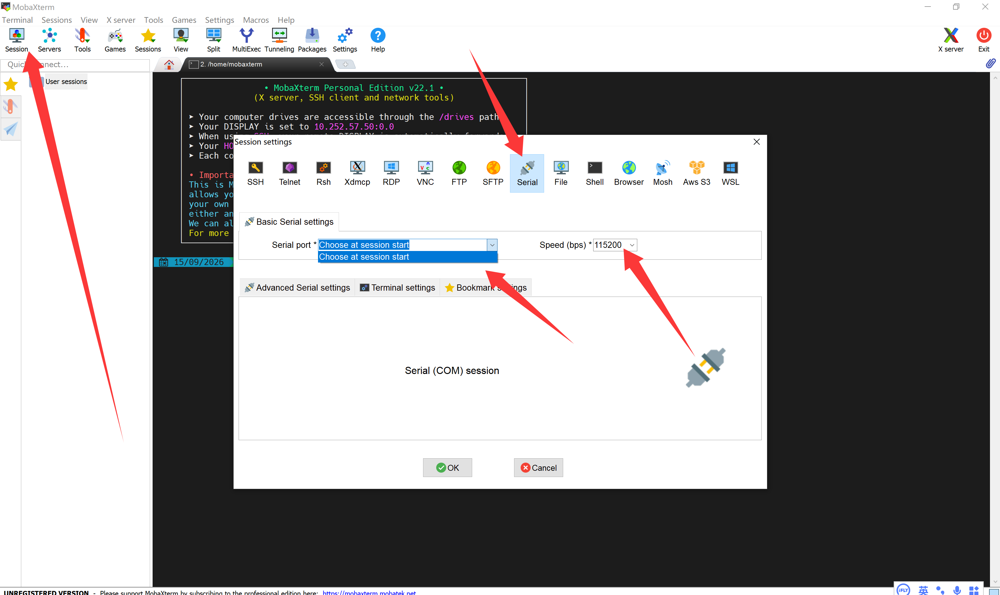

# 实验一 安装交叉编译工具链——给 x86 电脑配一位"ARM 翻译官"

> **系列说明**：本系列基于正点原子 FS-MP1A（STM32MP157A）开发板，对应课件《第3章 移植U-Boot》。本文覆盖 Slide 28-31。所有操作在 VirtualBox + Ubuntu 20.04 虚拟机中完成。

## 一、为什么第一个实验是装工具链？

先想一个问题：开发板上的 CPU 是 **ARM Cortex-A7**，我们电脑的 CPU 是 **x86-64**，两者指令集完全不同——在电脑上用普通 gcc 编译出的程序，板子根本"听不懂"。

要解决这个问题，就需要**交叉编译工具链（cross toolchain）**：它本身运行在 x86 电脑上，产出的却是 ARM 机器码。可以把它理解成一位常驻 PC 的"ARM 翻译官"——我们用 x86 的语言下指令，它负责翻译成板子听得懂的话。

ST 把整套翻译团队（交叉编译器、目标板 C 库、调试器、镜像制作工具……）打包成了一个 SDK 压缩包。本实验要做的事很简单：**把它装好、激活、验证**。

这个实验看似只是"装软件"，却是后面一切的地基——编译 U-Boot、内核、驱动全靠它，所以排在整个系列的第一位。

## 二、实验环境

| 项目 | 实际值 |
|---|---|
| 虚拟机 | VirtualBox + Ubuntu 20.04（focal），主机名 `cnu-virtual-machine`，用户 `cnu` |
| 网络 | 桥接网卡 |
| 共享文件夹 | `~/Desktop/share/Linux/Test1` |
| 工具链安装位置 | `/opt/st/stm32mp1/3.1-openstlinux-5.4-dunfell-mp1-20-06-24` |

---

## 三、实验步骤

### 步骤 1：先接好"眼睛"——验证串口

**做什么**：在 VirtualBox 中选择板载 ST-Link 的虚拟串口端口，波特率设为 **115200**（ST 方案出厂默认值），给开发板上电，观察终端输出。

**为什么第一步不是装软件，而是看串口？**

因为接下来的一系列实验里，板子上发生了什么、报了什么错，**全部要靠串口告诉我们**。串口就是整个移植过程的"眼睛"——必须最先确认它是通的。否则以后编译、烧写出了问题，你连"板子到底是没跑起来还是跑了没输出"都无从判断。

通电后成功抓到出厂固件的启动日志：

  
> 图：VirtualBox 串口终端抓到的开发板出厂固件启动日志（TF-A + U-Boot）。

```
............NOTICE:  CPU: STM32MP157AAA Rev.Z
NOTICE:  Model: HQYJ FS-MP1A Discovery Board
INFO:    Reset reason (0x14):
INFO:      Pad Reset from NRST
INFO:    Using SDMMC
INFO:      Instance 1
INFO:    Boot used partition fsbl1
NOTICE:  BL2: v2.2-r1.0(debug):a70053f
NOTICE:  BL2: Built : 09:55:29, Nov  5 2020
INFO:    Using crypto library 'stm32_crypto_lib'
INFO:    BL2: Doing platform setup
INFO:    RAM: DDR3-DDR3L 16bits 533000Khz
INFO:    Memory size = 0x20000000 (512 MB)
INFO:    BL2 runs SP_MIN setup
INFO:    BL2: Loading image id 4
INFO:    Loading image id=4 at address 0x2ffed000
INFO:    Image id=4 loaded: 0x2ffed000 - 0x2ffff000
INFO:    BL2: Loading image id 5
INFO:    Loading image id=5 at address 0xc0100000
INFO:    STM32 Image size : 855341
INFO:    Image id=5 loaded: 0xc0100000 - 0xc01d0d2d
WARNING: Skip signature check (header option)
NOTICE:  ROTPK is not deployed on platform. Skipping ROTPK verification.
NOTICE:  BL2: Booting BL32
INFO:    Entry point address = 0x2ffed000
INFO:    SPSR = 0x1d3
INFO:    Cannot find st,stpmic1 node in DT
NOTICE:  SP_MIN: v2.2-r1.0(debug):a70053f
NOTICE:  SP_MIN: Built : 09:55:29, Nov  5 2020
INFO:    ARM GICv2 driver initialized
INFO:    stm32mp IWDG1 (12): Secure
INFO:    ETZPC: CRYP1 (9) could be non secure
INFO:    SP_MIN: Initializing runtime services
INFO:    SP_MIN: Preparing exit to normal world


U-Boot 2020.01-stm32mp-r1-a-ged50d843 (Dec 12 2023 - 19:23:21 +0800)

CPU: STM32MP157AAA Rev.Z
Model: STMicroelectronics STM32MP157A-DK1 Discovery Board
Board: stm32mp1 in trusted mode (st,stm32mp157a-dk1)
DRAM:  512 MiB
Clocks:
- MPU : 650 MHz
- MCU : 208.878 MHz
- AXI : 266.500 MHz
- PER : 24 MHz
- DDR : 533 MHz
WDT:   Started with servicing (32s timeout)
NAND:  0 MiB
MMC:   STM32 SD/MMC: 0, STM32 SD/MMC: 1
Loading Environment from MMC... OK
In:    serial
Out:   serial
Err:   serial
Net:   eth0: ethernet@5800a000
Hit any key to stop autoboot:  0
ethernet@5800a000 Waiting for PHY auto negotiation to complete...........................
```

**这段日志值得精读**——它按时间顺序讲了一个完整的启动故事，而且埋着后面两个实验的伏笔：

1. **前半段是 TF-A 在说话**（`BL2` 那些行）：TF-A 是板子的第一级引导固件，它完成了平台初始化和 DDR 内存初始化（`Memory size = 0x20000000 (512 MB)`），然后加载下一段镜像——`Loading image id 5` 加载的那 855341 字节，就是 U-Boot。
2. **后半段是 U-Boot 在说话**（`U-Boot 2020.01-stm32mp-r1` 起）：它接过控制权，报告 CPU、内存、时钟、MMC 控制器等一串硬件信息。
3. **两个关键线索**：
   - `Board: stm32mp1 in trusted mode (st,stm32mp157a-dk1)`——出厂固件跑的是 **trusted 模式**。U-Boot 有 basic 和 trusted 两种启动模式，本系列会先移植 basic 再移植 trusted，这里先混个脸熟；
   - `Model: ... STM32MP157A-DK1`——出厂设备树用的是 **ST 官方 DK1 开发板**。FS-MP1A 和 DK1 用的是同一颗 STM32MP157A 芯片，这正是后面实验三"复制 dk1 设备树做模板"的依据，源头就在这行日志里。

**结论**：板子硬件正常、串口链路正常，可以放心往下走。

### 步骤 2：安装并配置 git——为"打补丁"备好工具

**做什么**：安装 git 并配置全局用户名、邮箱。

**为什么现在就装 git？**

下一个实验要给 U-Boot 源码打上 ST 的 6 个补丁，课件指定用 `git am` 命令来做。`git am` 会把每个补丁里的作者、提交说明**原样还原成一条 git 提交**——而创建提交就必须知道"作者是谁"，这正是 `user.name` / `user.email` 的用途。不先配置好，到时候 `git am` 会直接拒绝工作。所以这一步是实验二的前置条件，现在顺手做完。

```bash
sudo apt update && sudo apt install git
```

实际执行（节选）：

```
命中:1 http://mirrors.ustc.edu.cn/ubuntu focal InRelease
...
将会同时安装下列软件：
  git-man liberror-perl
下列【新】软件包将被安装：
  git git-man liberror-perl
...
正在设置 git (1:2.25.1-1ubuntu3.14) ...
正在处理用于 man-db (2.9.1-1) 的触发器 ...
```

配置并验证：

```bash
git config --global user.name "Gsheep0729" && git config --global user.email "2697438381@qq.com"
```

```
cnu@cnu-virtual-machine:~/Desktop/share/Linux/Test1$ git config --global user.name
Gsheep0729
cnu@cnu-virtual-machine:~/Desktop/share/Linux/Test1$ git config --global user.email
2697438381@qq.com
```

### 步骤 3：解压 SDK 压缩包

**做什么**：把 ST 提供的 SDK 压缩包从 Windows 拷进虚拟机，用 `tar` 解压。

**为什么要解压两步走（先 `cd` 再解压）？** 没有特殊讲究，只是解压会按包内的目录结构展开出一个同名目录，先固定好工作目录，后面的路径都好写。

```bash
cd ~/Desktop/share/Linux/Test1
tar -xf en.SDK-x86_64-stm32mp1-openstlinux-5.4-dunfell-mp1-20-06-24.tar.xz
```

> `tar -xf` 会自动识别压缩格式（这里是 xz），且**不删除原始压缩包**——万一后面要重装，包还在。

实际执行记录：

```
cnu@cnu-virtual-machine:~/Desktop/share/Linux/Test1$ ls
en.SDK-x86_64-stm32mp1-openstlinux-5.4-dunfell-mp1-20-06-24.tar.xz
cnu@cnu-virtual-machine:~/Desktop/share/Linux/Test1$ tar -xf en.SDK-x86_64-stm32mp1-openstlinux-5.4-dunfell-mp1-20-06-24.tar.xz 
cnu@cnu-virtual-machine:~/Desktop/share/Linux/Test1$ cd stm32mp1-openstlinux-5.4-dunfell-mp1-20-06-24/
cnu@cnu-virtual-machine:~/Desktop/share/Linux/Test1/stm32mp1-openstlinux-5.4-dunfell-mp1-20-06-24$ cd sdk/
```

### 步骤 4：认清安装脚本——别被长文件名吓住

解压出的 `sdk` 目录里有 6 个长名字文件，`ls` 一看：

```
st-image-weston-openstlinux-weston-stm32mp1-x86_64-toolchain-3.1-openstlinux-5.4-dunfell-mp1-20-06-24.host.manifest
st-image-weston-openstlinux-weston-stm32mp1-x86_64-toolchain-3.1-openstlinux-5.4-dunfell-mp1-20-06-24.license
st-image-weston-openstlinux-weston-stm32mp1-x86_64-toolchain-3.1-openstlinux-5.4-dunfell-mp1-20-06-24-license_content.html
st-image-weston-openstlinux-weston-stm32mp1-x86_64-toolchain-3.1-openstlinux-5.4-dunfell-mp1-20-06-24.sh
st-image-weston-openstlinux-weston-stm32mp1-x86_64-toolchain-3.1-openstlinux-5.4-dunfell-mp1-20-06-24.target.manifest
st-image-weston-openstlinux-weston-stm32mp1-x86_64-toolchain-3.1-openstlinux-5.4-dunfell-mp1-20-06-24.testdata.json
```

别慌，名字虽长，结构都是"前缀 + 后缀"，按后缀分类一下就清楚了：

| 后缀 | 含义 |
|---|---|
| `.sh` | **安装脚本**——我们要执行的就是它 |
| `.host.manifest` | 装到 PC（宿主机）上的文件清单 |
| `.target.manifest` | 目标板侧文件的清单 |
| `.license` / `-license_content.html` | 开源许可证及全文 |
| `.testdata.json` | 安装自测数据 |

**这里有个小坑**：想当然敲 `./install.sh` 会报"没有那个文件或目录"——ST 没有给脚本起这个名，**`.sh` 结尾的长名字文件才是安装脚本**。拿到陌生软件包，先 `ls` 看清楚再动手，这个习惯贯穿整个嵌入式开发。

### 步骤 5：运行安装脚本

```bash
./st-image-weston-openstlinux-weston-stm32mp1-x86_64-toolchain-3.1-openstlinux-5.4-dunfell-mp1-20-06-24.sh
```

安装器会依次问三件事，每一件都值得明白它"在问什么"：

1. **`Enter target directory for SDK (default: /opt/st/stm32mp1/...):`** ——"你想装到哪？"直接回车即可。默认的 `/opt` 是 Linux 文件系统层次标准（FHS）里约定的**第三方大型软件**安装位置，ST 的工具链放这里最合适。
   > ⚠️ 这里只能**直接回车**或输入**绝对路径**——输相对路径的话，SDK 会装进当前目录下的一个子文件夹里，位置不受控。另外切记不要装到 VirtualBox 共享文件夹里：共享文件夹的 vboxsf 文件系统**不支持 Linux 符号链接**，而工具链内部大量使用符号链接，装在那里后面编译必踩坑。
2. **`Proceed [Y/n]?`** ——"确认继续？"输入 `y`。
3. **`[sudo] password for cnu:`** ——要往 `/opt/st` 这个系统目录写文件，需要 root 权限，所以索取当前用户密码。

实际执行结果（✅ 安装成功）：

```
Extracting SDK................................................................................................................................................................................................................done
Setting it up...done
SDK has been successfully set up and is ready to be used.
Each time you wish to use the SDK in a new shell session, you need to source the environment setup script e.g.
 $ . /opt/st/stm32mp1/3.1-openstlinux-5.4-dunfell-mp1-20-06-24/environment-setup-cortexa7t2hf-neon-vfpv4-ostl-linux-gnueabi
```

注意最后一行提示——它已经把"每次使用工具链前该做什么"告诉我们了，这正是下一步的内容。

### 步骤 6：激活工具链并验证

**为什么要"激活"？** 安装只是把文件放到了磁盘上，当前终端并不知道它们的存在。`environment-setup-...` 脚本的作用就是设置一串环境变量：把工具链的 `bin` 目录加入 `PATH`、定义 `CC` 变量指向交叉 gcc、指定 `--sysroot`（目标板的 C 库根目录）等等。**每次新开终端都要重新执行一遍**——这是后面最容易忘、也最容易坑自己的地方。

**为什么必须用 `source`（或 `.`）执行，而不能 `./` 运行？** `source` 是"在当前 shell 进程里执行这段脚本"，设置的环境变量能留下来；而 `./xxx.sh` 会启动一个子进程，脚本跑完子进程退出，环境变量也随之消失——白忙一场。

课件的标准做法是先在根目录建一个符号链接，以后所有命令统一写 `source /stm32env`，简短好记：

```bash
sudo ln -s /opt/st/stm32mp1/3.1-openstlinux-5.4-dunfell-mp1-20-06-24/environment-setup-cortexa7t2hf-neon-vfpv4-ostl-linux-gnueabi /stm32env
source /stm32env
```

（直接 source 完整路径也是完全等价的，本文实际操作即采用这种方式。）

**验证**——看 `$CC` 变量：

```bash
echo $CC
```

实际输出（✅ 生效）：

```
cnu@cnu-virtual-machine:~/Desktop/share/Linux/Test1/stm32mp1-openstlinux-5.4-dunfell-mp1-20-06-24/sdk$ . /opt/st/stm32mp1/3.1-openstlinux-5.4-dunfell-mp1-20-06-24/environment-setup-cortexa7t2hf-neon-vfpv4-ostl-linux-gnueabi
cnu@cnu-virtual-machine:~/Desktop/share/Linux/Test1/stm32mp1-openstlinux-5.4-dunfell-mp1-20-06-24/sdk$ echo $CC
arm-ostl-linux-gnueabi-gcc -mthumb -mfpu=neon-vfpv4 -mfloat-abi=hard -mcpu=cortex-a7 --sysroot=/opt/st/stm32mp1/3.1-openstlinux-5.4-dunfell-mp1-20-06-24/sysroots/cortexa7t2hf-neon-vfpv4-ostl-linux-gnueabi
```

这一串输出同样值得逐段读懂——它就是"翻译官"的工作方式说明书：

| 片段 | 含义 |
|---|---|
| `arm-ostl-linux-gnueabi-gcc` | 目标平台三元组命名的交叉 gcc：ARM 架构 / OpenSTLinux / gnueabi 接口 |
| `-mcpu=cortex-a7` | 按 Cortex-A7 核生成指令 |
| `-mthumb` | 使用 Thumb 指令集（代码密度更高） |
| `-mfpu=neon-vfpv4 -mfloat-abi=hard` | 使用 NEON 硬件浮点，浮点参数走寄存器传递 |
| `--sysroot=...` | 编译时找头文件、链接时找库，都到**目标板的根目录**下找——保证链接的是板子上的 C 库，绝不混入 PC 的 glibc |

顺带一提：直接执行 `$CC` 会报 `fatal error: no input files`（没给它源文件），这是**正常现象**，只要出现了 `arm-ostl-linux-gnueabi-gcc` 字样就说明工具链已生效。

### 步骤 7：安装辅助工具

**为什么 SDK 装完了还要再装一堆？** 因为 SDK 只覆盖了"翻译官团队"，而编译 U-Boot 的过程中，构建系统本身还需要一些 PC 侧的基础工具。分工如下：

| 软件包 | 用途 |
|---|---|
| `bison` / `flex` | 语法/词法分析器生成器。U-Boot 的配置系统 Kconfig（`menuconfig` 的后台）和设备树编译器 `dtc` 都要用它们现场生成解析代码——不装，配置和编译设备树阶段直接报错 |
| `libncurses5-dev` | 字符终端图形库。`make menuconfig` 那个蓝色菜单界面就是它画出来的 |
| `libssl-dev` | OpenSSL 开发库。U-Boot 的主机端工具（如 `mkimage` 制作签名镜像）编译时需要它的头文件 |
| `libyaml-dev` | YAML 解析库，本课程后续内容会用到 |

```bash
sudo apt install bison flex libncurses5-dev libyaml-dev libssl-dev
```

实际执行（节选）：

```
cnu@cnu-virtual-machine:~/Desktop/share/Linux/Test1/stm32mp1-openstlinux-5.4-dunfell-mp1-20-06-24/sdk$   sudo apt install bison flex libncurses5-dev libyaml-dev libssl-dev
正在读取软件包列表... 完成
将会同时安装下列软件：
  libfl-dev libfl2 libncurses-dev libncurses6 libncursesw6 libsigsegv2 libssl1.1 libtinfo6 m4
下列【新】软件包将被安装：
  bison flex libfl-dev libfl2 libncurses-dev libncurses5-dev libsigsegv2 libssl-dev libyaml-dev m4
升级了 4 个软件包，新安装了 10 个软件包，要卸载 0 个软件包，有 502 个软件包未被升级。
需要下载 4,833 kB 的归档。
...
正在设置 libyaml-dev:amd64 (0.2.2-1) ...
...
正在设置 bison (2:3.5.1+dfsg-1) ...
update-alternatives: 使用 /usr/bin/bison.yacc 来在自动模式中提供 /usr/bin/yacc (yacc)
正在设置 flex (2.6.4-6.2) ...
...
正在处理用于 man-db (2.9.1-1) 的触发器 ...
```

安装成功，无报错。

---

## 四、注意事项（踩坑记录）

1. **目录里没有 `install.sh`**：安装脚本就是长名字的 `st-image-weston-...sh`。拿到任何安装包，先 `ls` 看清楚再执行。
2. **`source` 只对当前窗口有效**：新开终端必须重新激活，否则 `make` 会找不到交叉编译器（后果见实验三的实战案例）。
3. **工具链必须装在虚拟机本地磁盘**（`/opt/st`），不要装共享文件夹——vboxsf 不支持符号链接。

## 五、实验结果

| 检查项 | 结果 |
|---|---|
| 串口验证（VirtualBox，115200） | ✅ 抓到出厂固件启动日志 |
| git 安装并完成全局配置 | ✅ |
| SDK 安装到 `/opt/st/stm32mp1/3.1-openstlinux-5.4-dunfell-mp1-20-06-24` | ✅ successfully set up |
| 激活后 `echo $CC` 出现 `arm-ostl-linux-gnueabi-gcc` | ✅ sysroot 指向 /opt/st |
| bison / flex / libncurses5-dev / libyaml-dev / libssl-dev | ✅ 安装成功 |

## 六、下一步

工具链这位"翻译官"已经就位，但巧妇难为无米之炊——我们还缺"料"：**U-Boot 源码本身**。下一实验获取 ST 的源码包，并用 git 给它打上 6 个厂商补丁，请看《实验二 获取 U-Boot 源码并打 ST 补丁》。
