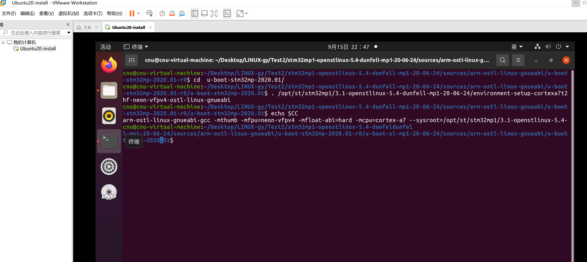
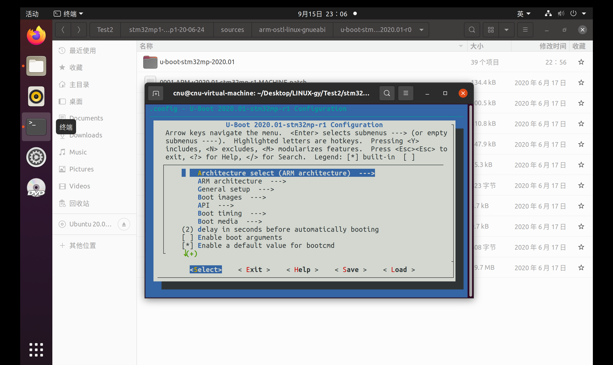
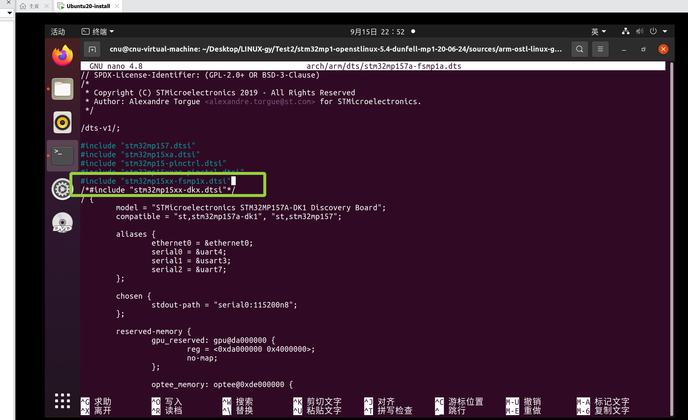
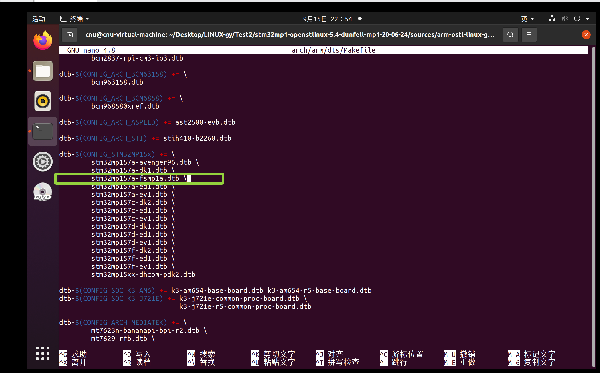
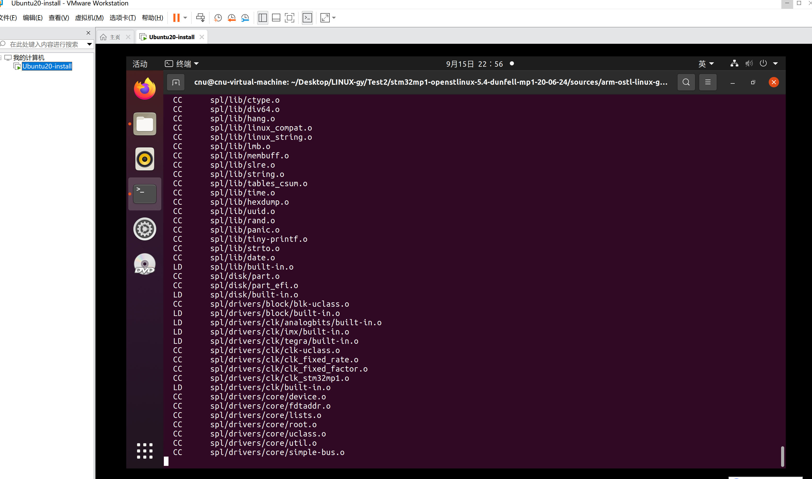
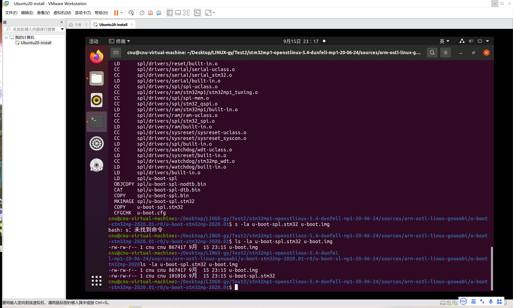

# 实验三 basic 版 U-Boot 配置与首次编译——教 U-Boot 认识你的板子

> **系列说明**：本系列基于正点原子 FS-MP1A（STM32MP157A）开发板，对应课件《第3章 移植U-Boot》。本文覆盖 Slide 35-42。前置：实验二已完成（源码已打上 6 个 ST 补丁，位于 WORKING 分支）。  
> **状态**：✅ 已全部完成并验证通过（2026-09-15，编译产物 u-boot-spl.stm32 + u-boot.img 已生成）。

## 一、所谓"移植"，到底在移什么？

U-Boot 官方源码支持几百块开发板。它凭什么区分"这板子有多少内存、串口在哪个引脚、从哪个设备启动"？靠两样东西：

1. **defconfig（默认配置）**——决定**哪些代码参与编译**。编译期生效，回答"要不要这个驱动"；
2. **设备树（Device Tree）**——描述**硬件长什么样**。运行期生效，回答"这个驱动管理的外设，寄存器地址是多少、接在哪个引脚"。

所以移植一块新板子，本质就两件事：**给它一份自己的 defconfig，给它一套自己的设备树**。而 FS-MP1A 很幸运——它和 ST 官方的 DK1 开发板用的是**同一颗 STM32MP157A 芯片**（实验一串口日志里的 `Model: ... STM32MP157A-DK1` 就是伏笔），底板设计也高度参考 DK1。所以我们的移植策略是：**以 DK1 为模板，复制出 FS-MP1A 自己的配置和设备树，再改不对的地方**。这是移植的经典套路——不写新的，先抄一个最接近的。

**为什么先编译 basic 版？** STM32MP1 的 U-Boot 有两种启动模式：

| 模式 | 启动链条 | 特点 |
|---|---|---|
| **basic** | ROM → **SPL**（u-boot-spl.stm32）→ U-Boot（u-boot.img） | 全程 U-Boot 自家代码，SPL 负责 DDR 初始化 |
| **trusted** | ROM → **TF-A**（BL2，负责 DDR 初始化）→ U-Boot | 出厂默认模式（实验一日志里的 `trusted mode`），安全性更好 |

FS-MP1A 出厂跑的是 trusted，但教学上**先 basic 后 trusted**：basic 版自带 SPL、独立性强，驱动问题（电源、网卡、eMMC……）都能在 basic 上定位清楚；等 basic 调通了，trusted 版直接复用全部结论，只需换掉引导链。先易后难，问题归一。

## 二、实验环境（实际）

| 项目 | 实际值 |
|---|---|
| 虚拟机 | 同实验一（4GB 内存） |
| 源码目录 | `~/Desktop/LINUX-gy/Test2/stm32mp1-openstlinux-5.4-dunfell-mp1-20-06-24/sources/arm-ostl-linux-gnueabi/u-boot-stm32mp-2020.01-r0/u-boot-stm32mp-2020.01` |
| 分支 | WORKING（7 条提交：源码 + 6 补丁） |
| 工具链 | `/opt/st/stm32mp1/3.1-openstlinux-5.4-dunfell-mp1-20-06-24` |

## 三、实验步骤（真实记录）

### 步骤 1：激活交叉编译工具链（编译前必做）

**为什么每个实验开头都要重复这一步？** 因为工具链是靠环境变量生效的（实验一步骤 6 讲过：`source` 只对当前窗口有效）。新开的终端就是全新的环境，不重新激活，`make` 找到的就是 PC 自带的 x86 gcc——用它编 ARM 代码，第一步就会翻车。

```bash
# 进入源码顶层目录
cd ~/Desktop/LINUX-gy/Test2/stm32mp1-openstlinux-5.4-dunfell-mp1-20-06-24/sources/arm-ostl-linux-gnueabi/u-boot-stm32mp-2020.01-r0/u-boot-stm32mp-2020.01

# 激活工具链，直接 source 完整路径：
. /opt/st/stm32mp1/3.1-openstlinux-5.4-dunfell-mp1-20-06-24/environment-setup-cortexa7t2hf-neon-vfpv4-ostl-linux-gnueabi

# 验证（课件 Slide 36 的要求：执行 make xxx_defconfig 前必须确认）
echo $CC
```

预期：输出 `arm-ostl-linux-gnueabi-gcc -mthumb -mfpu=neon-vfpv4 ...`（同实验一步骤 6 的验证结果）。

> 这一步是课件明确要求"执行 make 前必须确认"的。实战中它救过场：本系列曾在未激活工具链的状态下直接 `make`，报错 `cc1: error: bad value ('generic-armv7-a') for '-mtune=' switch`——报错里列出一排 Intel/AMD CPU 名字，就是"用了宿主机 x86 gcc"的铁证。记住这个特征，一眼定位病因。

**实际执行结果**：



### 步骤 2：创建并加载 FS-MP1A 的 defconfig（Slide 36）

```bash
# 复制 ST 的 stm32mp15 系列配置文件，作为 FS-MP1A 自己的默认配置
cp configs/stm32mp15_basic_defconfig configs/stm32mp15_fsmp1a_basic_defconfig

# 加载 FS-MP1A 默认配置（生成顶层 .config）
make stm32mp15_fsmp1a_basic_defconfig
```

**这两行在做什么？**

- 第一行：`configs/` 目录下躺着所有板子的默认配置，`stm32mp15_basic_defconfig` 是 ST 为 STM32MP15 系列准备的基本版配置——它已包含 STM32MP1 平台的串口、SD/MMC、DDR 驱动开关。我们复制一份改名为 `stm32mp15_fsmp1a_basic_defconfig`，从这一刻起，U-Boot 的配置清单里就"注册"了 FS-MP1A 这块板子；
- 第二行：`make xxx_defconfig` 不是编译，而是**生成配置**——构建系统把 `configs/` 里的默认值、各 Kconfig 文件里的依赖规则合并计算，最终写出顶层 `.config` 文件。后面每一行编译，都由 `.config` 说了算。

预期输出末尾会有 `configuration written to .config`。

**为什么现在不改任何配置项？** FS-MP1A 与 DK1 硬件同源，ST 的配置直接可用。真正需要动 menuconfig 的是后面按串口报错修问题时（关 ADC、关显示、换网卡驱动……），到时候再来。

### 步骤 3：（可选）make menuconfig 图形化配置（Slide 37）

```bash
make menuconfig
```

打开那个著名的蓝色字符界面逛一圈。**首次编译暂不需要修改任何配置**，直接退出即可。但要认识这个工具——它是后面所有驱动问题修复的主战场。

> 课件 Slide 40-41 还提到可选操作：在 `Device Tree Control -->` → `Default Device Tree for DT Control` 中把默认设备树设为 `stm32mp157a-fsmp1a`，以后编译就可以不带 `DEVICE_TREE=` 参数、直接 `make all`。本实验仍按课件主流程在 make 命令中显式指定设备树——显式参数更直观，也更不容易忘记自己编译的是哪块板子。

**实际执行结果**：



### 步骤 4：复制设备树"三件套"（Slide 38）

**做什么**：以 DK1 的设备树为模板，复制出 FS-MP1A 的设备树：

```bash
cp arch/arm/dts/stm32mp157a-dk1.dts arch/arm/dts/stm32mp157a-fsmp1a.dts
cp arch/arm/dts/stm32mp15xx-dkx.dtsi arch/arm/dts/stm32mp15xx-fsmp1x.dtsi
cp arch/arm/dts/stm32mp157a-dk1-u-boot.dtsi arch/arm/dts/stm32mp157a-fsmp1a-u-boot.dtsi
```

**为什么是三个文件而不是一个？** 先认识设备树的三层结构：

| 文件 | 角色 |
|---|---|
| `stm32mp157a-fsmp1a.dts` | **板级入口**——描述 FS-MP1A 独有的东西（我们后面要改的主要就是它） |
| `stm32mp15xx-fsmp1x.dtsi` | **公共包含层**——DK1/DK2/EV1 整个 DKx 系列共用的硬件描述，被 `.dts` 包含 |
| `stm32mp157a-fsmp1a-u-boot.dtsi` | **U-Boot 专属覆盖层**——U-Boot 和 Linux 共用前两个文件，但 U-Boot 需要一些额外标注（如 `u-boot,dm-pre-reloc`，标记重定位前就要用的驱动），就补在这层 |

三份一起复制，U-Boot 这边"DK1 的分身"就位。真正属于 FS-MP1A 的差异（电源配置、网卡型号等），等烧写启动暴露出问题后再逐个改——**先把流程跑通，再解决差异**。

### 步骤 5：两处必须同步的修改（Slide 39）

复制文件只是第一步，还要告诉构建系统两件事。

**5.1 修改 `arch/arm/dts/stm32mp157a-fsmp1a.dts` 第 13 行**

**为什么要改？** 步骤 4 的第二条 `cp` 把 `stm32mp15xx-dkx.dtsi` 改名成了 `stm32mp15xx-fsmp1x.dtsi`，但 `fsmp1a.dts` 里还 `#include` 着旧文件名——不改，编译设备树时就会报"找不到 stm32mp15xx-dkx.dtsi"（它已经被改名了）。

用 nano 打开：

```bash
nano arch/arm/dts/stm32mp157a-fsmp1a.dts
```

第 9~13 行的 include 改为（即把第 13 行的 `stm32mp15xx-dkx.dtsi` 改成 `stm32mp15xx-fsmp1x.dtsi`；为便于回溯，把旧行注释保留）：

```c
#include "stm32mp157.dtsi"
#include "stm32mp15xa.dtsi"
#include "stm32mp15-pinctrl.dtsi"
#include "stm32mp15xxac-pinctrl.dtsi"
#include "stm32mp15xx-fsmp1x.dtsi"
/*#include "stm32mp15xx-dkx.dtsi"*/
```

**实际执行结果**

**5.2 注册进 `arch/arm/dts/Makefile`（第 832 行附近）**

**为什么要改这个？** 设备树源文件（`.dts`）不会自动编译成二进制（`.dtb`）——`arch/arm/dts/Makefile` 里的 `dtb-$(CONFIG_...) += ...` 列表才是"哪些设备树参与编译"的注册表。不注册，`stm32mp157a-fsmp1a.dtb` 根本不会被生成；就算编译不报错，产物也是缺的——这是设备树移植最经典的"两处同步"，缺一处都不行。

```bash
nano arch/arm/dts/Makefile
```

在 `dtb-$(CONFIG_STM32MP15x) += \` 列表里、`stm32mp157a-dk1.dtb \` 一行后面**新增一行**：

```makefile
dtb-$(CONFIG_STM32MP15x) += \
	stm32mp157a-avenger96.dtb \
	stm32mp157a-dk1.dtb \
	stm32mp157a-fsmp1a.dtb \
	stm32mp157a-ed1.dtb \
	...
```

> ⚠️ 注意：每行末尾的续行符 `\` 前是一个 Tab 缩进、`\` 后不能有空格；新行也要以 ` \` 结尾，否则 Makefile 语法错误。

**实际执行结果**：

### 步骤 6：首次编译（Slide 40）

```bash
make all DEVICE_TREE=stm32mp157a-fsmp1a
# 4GB 内存的虚拟机建议 -j2 多线程加速（实测增量续编只需 1min；全新首次编译约 10~20 分钟）：
make -j2 all DEVICE_TREE=stm32mp157a-fsmp1a
```

**这里有一个实验二的"伏笔兑现"**：`DEVICE_TREE=stm32mp157a-fsmp1a` 这个 make 变量之所以能用，正是因为实验二里那个编号 0099 的补丁——"Add external var to allow build of new devicetree file"——它专门开了这个口子，让我们能指定一个官方清单外的新设备树。当时看似普通的一步，在这里派上了用场。

**`-j2` 是什么？** 让 make 用 2 个线程并行编译。虚拟机只有 4GB 内存，`-j2` 是安全上限——开太高（比如 `-j8`）每个 gcc 进程都要吃内存，可能被系统 OOM 杀掉，编译莫名其妙中断。

> 若编译在中途报错：先看**第一条** error（不要只看最后几行，make 的报错是滚雪球的，第一条才是病根）。若报符号链接/权限类错误，多半是共享文件夹所致——把 `u-boot-stm32mp-2020.01` 整个目录移到虚拟机本地磁盘（如 `~/FS-MP1A/`）再编译。

**实际执行结果**：

### 步骤 7：检查编译产物（Slide 42）

```bash
ls -la u-boot-spl.stm32 u-boot.img
```

编译成功后在源码顶层目录生成两个关键文件——对照实验三开头的启动链条表，它们正好就是 basic 模式链条的两环：

| 文件 | 实测大小 | 角色 |
|---|---|---|
| `u-boot-spl.stm32` | 约 101 KB | **FSBL**（First Stage SPL）——代码量小到能塞进 SoC 内部 RAM，负责初始化 DDR，然后把 U-Boot 本体加载进 DDR |
| `u-boot.img` | 约 867 KB | **SSBL**（Second Stage U-Boot）——真正的 U-Boot 本体，在 DDR 里运行，负责加载内核 |

（同时还会有 u-boot、u-boot.bin、u-boot.dtb 等其它生成物。）

> 细节：`.stm32` 后缀不是白叫的——这个文件在二进制头部加了 ST 专用的签名信息（加载地址、镜像名等），STM32MP1 的 ROM 代码只认带这个头的镜像。这也是为什么烧写时两个文件**不能混用** basic/trusted 版本。

**实际执行结果**：



---

## 四、注意事项

1. **新终端必须重新 `source /stm32env`**（或完整路径）——工具链激活只对当前窗口有效。特征：报错 `bad value ('generic-armv7-a') for '-mtune='` 且错误信息里出现一排 Intel/AMD CPU，就是忘了激活。
2. **`make ..._defconfig` 之前先 `echo $CC` 确认工具链**（课件 Slide 36 明确要求）。
3. **共享文件夹编译隐患**（实验一/二经验）：解压和 git 没问题，但编译阶段若在共享文件夹里报符号链接/权限类错误，把源码目录移到本地磁盘再编。
4. **虚拟机内存 4GB**：`-j2` 是安全上限，别开太高，否则可能被 OOM 杀掉编译进程。
5. **设备树修改要两处同步**：`fsmp1a.dts` 的 include 和 `dts/Makefile` 的新增 dtb 行，缺一个都会出问题（前者报找不到文件，后者根本不生成 dtb）。

## 五、实验完成标志

- [x] `stm32mp15_fsmp1a_basic_defconfig` 创建并加载成功（生成 .config）
- [x] 3 个设备树文件复制完成，第 13 行 include 和 dts/Makefile 修改完成
- [x] `make -j2 all DEVICE_TREE=stm32mp157a-fsmp1a` 编译成功，无 error
- [x] 顶层目录生成 `u-boot-spl.stm32`（FSBL）和 `u-boot.img`（SSBL）

## 六、下一步

至此，FS-MP1A 的 basic 版 U-Boot 已经编译出来——但还躺在电脑的磁盘里，板子并不认识它。下一实验要把这两个镜像**烧写进 SD 卡**，拨动启动开关，让板子真正用我们亲手编译的 U-Boot 启动。可以预告的是：首次启动大概率会**不断复位**——别慌，那正是"板子在告诉我们哪里不匹配"，接下来就进入按串口报错逐个修复（F-1 电源 → F-2 SD 卡检测 → F-3 ADC → F-4 显示 → F-5 网卡 → F-6 eMMC）的移植核心环节。请看《实验四 SD 卡分区烧写与首次启动》。
