# 实验四 SD 卡分区烧写与首次启动——让板子跑起我们自己的 U-Boot

> **系列说明**：本系列基于华清远见 FS-MP1A（STM32MP157A）开发板，对应课件《第3章 移植U-Boot》。本文覆盖 Slide 43-49。前置：实验三已完成（`u-boot-spl.stm32` + `u-boot.img` 已编译生成）。

## 一、本实验做什么？为什么"失败"才是成功？

实验三编译出的两个镜像还躺在电脑磁盘里，板子并不认识它们。本实验要做的是：给一张 SD 卡建好分区表，把镜像**按扇区原样写进对应分区**，然后拨动拨码开关，让板子从 SD 卡启动我们亲手编译的 U-Boot。

先打一剂预防针：**首次启动必定失败**——串口会看到电源初始化失败、板子不断复位。这不是做错了，而是本系列早已预告的"剧本"：设备树还是 DK1 的模板，里面描述的电源管理芯片（PMIC）FS-MP1A 板上根本没有。**能稳定地失败在"电源报错"这一步，恰恰证明前面编译、烧写、启动链条全部正确**——错误从"黑屏无输出"变成了"指名道姓的报错"，这就是移植工作的推进方式。修复它是实验五（F-1）的任务。

### 先认识 SD 卡分区表

烧写前要先分区。`sgdisk` 命令会把 SD 卡建成 GPT 分区表、分 5 个区，每个分区都有**专用名字**——名字不是随便起的，STM32MP1 的 ROM 代码就是**按名字**在 GPT 里找分区的：

| # | 名字 | 大小 | 作用 | 烧写内容 |
|---|---|---|---|---|
| 1 | `fsbl1` | 256 KiB | FSBL 第一份 | `u-boot-spl.stm32` |
| 2 | `fsbl2` | 256 KiB | FSBL 备份份 | `u-boot-spl.stm32`（再烧一次） |
| 3 | `ssbl` | 2 MiB | SSBL（U-Boot 本体） | `u-boot.img` |
| 4 | `bootfs` | 64 MiB | 内核/设备树启动分区 | 本次留空（内核实验用） |
| 5 | `rootfs` | 剩余全部 | 根文件系统 | 本次留空（文件系统实验用） |

> 整个课程只需要**分区这一次**。以后每改一版 U-Boot，只要重复"烧写"步骤（把三个文件重新 dd 一遍），不用重新分区。

## 二、实验环境（实际）

| 项目 | 实际值 |
|---|---|
| 虚拟机 | 同实验一（VMware + Ubuntu 20.04，4GB 内存） |
| 源码目录 | `~/Desktop/LINUX-gy/Test2/stm32mp1-openstlinux-5.4-dunfell-mp1-20-06-24/sources/arm-ostl-linux-gnueabi/u-boot-stm32mp-2020.01-r0/u-boot-stm32mp-2020.01` |
| 烧写产物 | 源码顶层目录的 `u-boot-spl.stm32`、`u-boot.img`（实验三生成） |
| 串口 | Windows 上用 MobaXterm 的 Serial 会话连板载 ST-Link 虚拟串口（COM 口），115200（同实验一步骤 1，已配好） |
| SD 卡 + 读卡器 | 经 USB 读卡器接电脑；插入后按 VMware 弹窗选「连接到虚拟机」（也可走菜单「虚拟机 → 可移动设备」） |

## 三、课件 ↔ 步骤对应表

| 课件 Slide | 内容 | 对应步骤 |
|---|---|---|
| 43 | 查看现有磁盘设备，找出 SD 卡 | 步骤 2~3 |
| 44 | 把读卡器（SD 卡）接入虚拟机 | 步骤 3 |
| 45 | 删除 SD 卡原有分区（含 umount） | 步骤 4 |
| 46 | sgdisk 重新分区（5 分区 GPT） | 步骤 5 |
| 47 | dd 烧写 u-boot 两个镜像 | 步骤 6 |
| 48 | 运行 u-boot：电源初始化失败（预期） | 步骤 8 |
| 49 | PC 串口工具介绍 | 步骤 7（补充说明） |

> 课件把串口工具（Slide 49）放在"运行"之后讲，属于补充知识；实践中串口必须在**上电之前**就绪，所以本指导把它挪到步骤 7。

## 四、实验步骤

### 步骤 1：课前检查——装 gdisk，确认产物还在

**为什么要装 gdisk？** 步骤 5 用的 `sgdisk` 命令在 `gdisk` 软件包里，Ubuntu 20.04 默认不带。实验一只装过 git 和 bison/flex 那批编译依赖，没装过它。

```bash
# 安装 sgdisk 所在的包（parted 系统自带，无需安装）
sudo apt install gdisk

# 验证
sgdisk --version
```

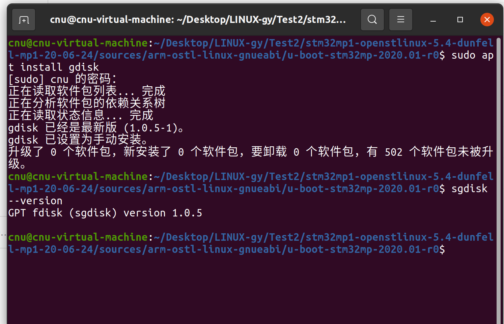
> 图：装 gdisk 并验证——提示“gdisk 已经是最新版（1.0.5-1）”，`sgdisk --version` 正常输出 1.0.5。

再确认实验三的编译产物还在（虚拟机终端）：

```bash
cd ~/Desktop/LINUX-gy/Test2/stm32mp1-openstlinux-5.4-dunfell-mp1-20-06-24/sources/arm-ostl-linux-gnueabi/u-boot-stm32mp-2020.01-r0/u-boot-stm32mp-2020.01
ls -la u-boot-spl.stm32 u-boot.img
```

预期：两个文件都在（大小约 101 KB / 867 KB，同实验三步骤 7 的实测值）。**本实验全程不编译，不需要激活工具链**——`dd` 是宿主机操作，跟交叉编译无关。

**实际执行结果**：

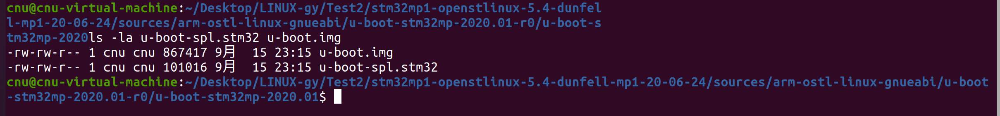
> 图：编译产物还在——u-boot.img（867417 字节）与 u-boot-spl.stm32（101016 字节），时间戳 9月15日 23:15，正是实验三的编译时间。

### 步骤 2：SD 卡接入虚拟机前，先摸清现有磁盘（Slide 43）

```bash
ls /dev/sd*
```

记下当前的输出（比如只有 `/dev/sda /dev/sda1`，这是虚拟机系统盘）。这一步是**基线**：插卡后再执行一遍，新增的就是 SD 卡。

**实际执行结果**：

```bash
cnu@cnu-virtual-machine:...$ ls /dev/sd*
/dev/sda  /dev/sda1  /dev/sda2  /dev/sda5
```

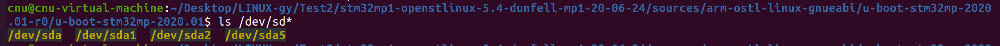
> 图：基线记录——只有虚拟机系统盘 `/dev/sda`（含 sda1/sda2/sda5），尚无其它 sd 设备；之后新增的必是 SD 卡。

此时只有虚拟机自己的系统盘 `/dev/sda`（及安装系统时划出的 sda1/sda2/sda5），没有其它 sd 设备——基线干净，之后新增的必是 SD 卡。

### 步骤 3：取下 SD 卡，通过读卡器接入虚拟机（Slide 44）

**先把卡从开发板上取下来**（开发板保持断电）。FS-MP1A 的卡槽是按压弹出式——用指尖把卡往里轻推一下，卡会弹出来：

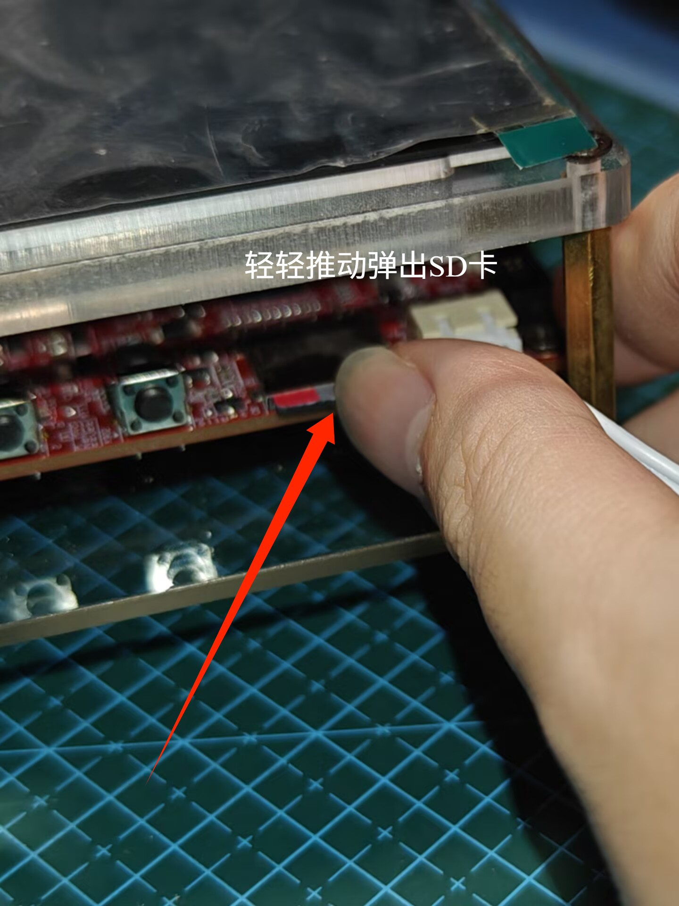
> 图：在开发板卡槽处轻轻往里推动，卡即弹出（板子先断电；卡槽就在按键旁边）。

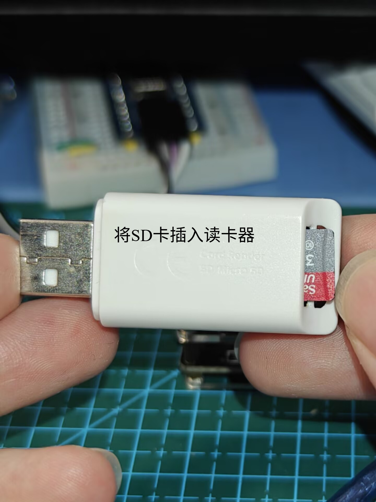
> 图：将 microSD 卡插入 USB 读卡器，再把读卡器插到电脑 USB 口。

插上读卡器后，VMware 会（几秒内）弹出「检测到新的 USB 设备」对话框——**选「连接到虚拟机」**、虚拟机名称选中 `Ubuntu20-install`，点「确定」——这一步等于把整个读卡器从主机"拔下"、再"插进"虚拟机。

没弹窗（比如勾选过“记住我的选择，以后不再询问”）也没关系——手动连接还有两个入口：菜单栏「虚拟机 → 可移动设备」，或窗口右下角状态栏的设备图标。VMware 的「可移动设备」提示框交代的正是这两处入口，以及 USB 的归属规则——**每个设备同一时刻只能连到主机或一台虚拟机**。下面这张红箭头标注版一眼看清三个要点：

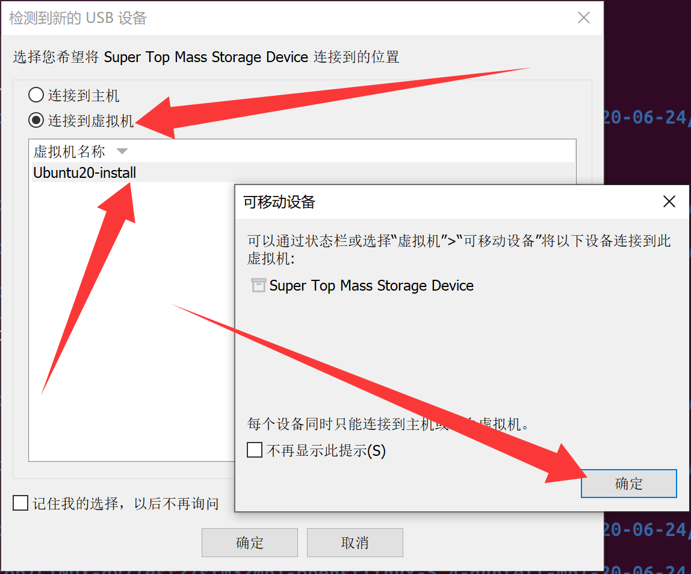
> 图：「检测到新的 USB 设备」+「可移动设备」提示框（红箭头标注版）——① 选“连接到虚拟机” ② 选中 Ubuntu20-install ③ 点“确定”；设备也可从状态栏或“虚拟机”→“可移动设备”连接，同一时刻只能连到主机或一台虚拟机。

> 课件 Slide 44 的截图是 VirtualBox 界面（窗口右下角 USB 图标上右键），我们用的是 VMware——入口位置不同、作用一样：都是把读卡器从主机转交给虚拟机。

**回到虚拟机终端，再执行一遍：**

```bash
ls /dev/sd*
```

新增的设备（课件例子里是 `/dev/sdb /dev/sdb1`）就是 SD 卡。

**强烈建议再用容量做双重确认**——后面 `dd`/`parted` 指定错盘会毁掉数据，多花 5 秒对一遍容量非常值：

```bash
lsblk -d -o NAME,SIZE,MODEL
```

按你 SD 卡的容量（16GB 卡约显示 14.9G、32GB 卡约 29.8G）锁定设备号。**下文以 `/dev/sdb` 为例，请以你的实际设备号为准**。

**实际执行结果**：

```bash
cnu@cnu-virtual-machine:...$ ls /dev/sd*
/dev/sda  /dev/sda1  /dev/sda2  /dev/sda5
cnu@cnu-virtual-machine:...$ lsblk -d -o NAME,SIZE,MODEL
NAME    SIZE MODEL
loop0     4K 
loop1 349.7M 
loop2  63.8M 
loop3  48.4M 
loop4  63.8M 
loop5 248.8M 
loop6  91.7M 
loop7  54.2M 
loop8  65.2M 
sda     100G VMware_Virtual_S

#---以下为接入读卡器后---
cnu@cnu-virtual-machine:...$ ls /dev/sd*
/dev/sda  /dev/sda1  /dev/sda2  /dev/sda5  /dev/sdb  /dev/sdb1  /dev/sdb2  /dev/sdb3  /dev/sdb4  /dev/sdb5
cnu@cnu-virtual-machine:...$ lsblk -d -o NAME,SIZE,MODEL
NAME    SIZE MODEL
loop0     4K 
loop1 349.7M 
loop2  63.8M 
loop3  48.4M 
loop4  63.8M 
loop5 248.8M 
loop6  91.7M 
loop7  54.2M 
loop8  65.2M 
sda     100G VMware_Virtual_S
sdb    29.8G Storage_Device
sr0     3.2G VMware_Virtual_SATA_CDRW_Drive
cnu@cnu-virtual-machine:...$ 
```

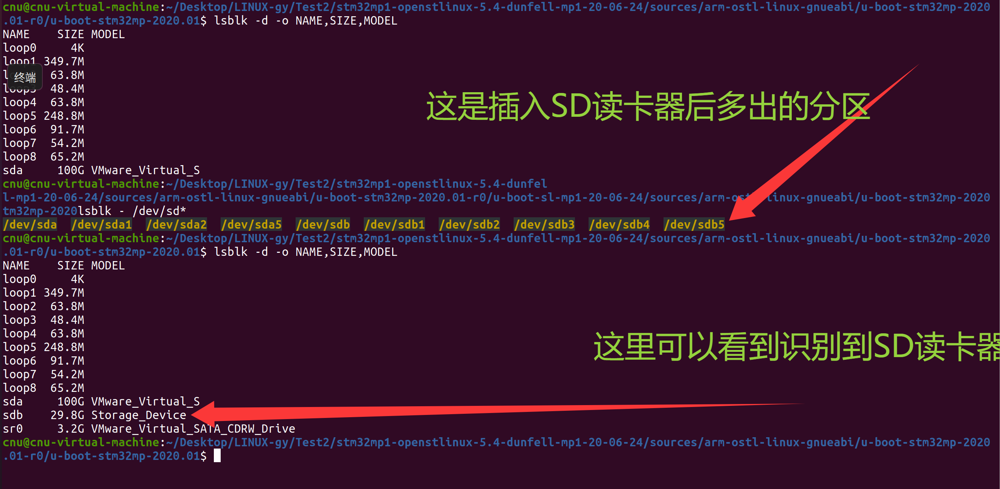
> 图：插入读卡器后的终端记录——`ls /dev/sd*` 对比基线新增 `sdb` 和 `sdb1~sdb5`；`lsblk` 确认 `sdb` 为 29.8G 的 `Storage_Device`。

**怎么读这份输出**：

- 与基线对比，新增了 `/dev/sdb` 和它的 5 个分区 `sdb1~sdb5`——SD 卡就是 **`/dev/sdb`**（`sdb1~sdb5` 是卡上**原有**分区：前人用同一套课件分的区，步骤 4 会先查看、再决定沿用还是重建）；
- 容量双重确认：`sdb` 是 **29.8G 的 Storage_Device**（读卡器，对应 32GB 标称的卡），而 `sda` 是 100G 的 VMware_Virtual_S（虚拟机系统盘）——两者容量、型号都不一样，绝不会认错；
- `loop0~loop8` 是 snap 软件包的循环设备、`sr0` 是虚拟光驱，都是虚拟机原有设备，与 SD 卡无关，忽略即可。

### 步骤 4：删除 SD 卡原有分区（Slide 45）

**动手之前先看清这块卡的“来历”。** 课程用的 SD 卡多是传承下来的——前人用同一套课件**分过区、烧写过**，所以插上就能看到 `sdb1~sdb5`，这很正常，不是卡有问题。先只读查看它的分区表：

```bash
sudo sgdisk -p /dev/sdb        # 只读命令（p = print），不会改动卡
```

对照第一节那张表检查三点：**GPT 分区表**、**恰好 5 个分区**、名字为 `fsbl1 / fsbl2 / ssbl / bootfs / rootfs`。

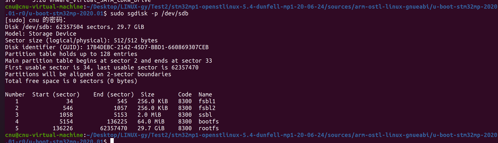
> 图：`sudo sgdisk -p /dev/sdb` 的输出——这块传承卡上前人留下的分区表：GPT、恰好 5 个分区，名字 `fsbl1 / fsbl2 / ssbl / bootfs / rootfs` 一字不差，是同一套课件分出来的。

- **三点都对得上** → 分区本身可以沿用，理论上能直接跳到步骤 6 的三条 `dd`；但**仍推荐按下面步骤 4/5 重做一遍**：前人卡的分区参数（起始扇区、bootfs 属性位）无法百分之百确认与课件一致，而重建只要几秒钟——等于把“来历不明的卡”变成“确定正确的卡”；
- **是新卡，或名字 / 分区数对不上** → 必须重建，照下面流程走。

> **注意**：重建分区会**抹掉卡上原有的一切**（包括前人烧入的镜像）。对练习卡来说这是预期操作——本课程的 U-Boot 都由我们自己编译烧入；若卡里有想保留的数据，先备份再动手。

**重建第一步：清空旧分区表**

```bash
sudo parted -s /dev/sdb mklabel msdos      # sdb 需按实际修改，删错盘 = 毁掉那块盘的数据！
```

若报错 `Error: Partition(s) on /dev/sdb are being used.`，说明 Ubuntu 自动挂载了原分区，先卸载再重试：

```bash
sudo umount /dev/sdb1                      # 有几个分区挂载就 umount 几个
```

> `mklabel msdos` 会先在卡上写一个空 MBR 标签，原有分区随之作废——确认设备号无误再回车。两个心理准备：① `-s` 是脚本模式，**执行成功时没有任何输出**，回到提示符就是执行完了（瞬间完成，不用等）；② 这条命令未必能把旧 GPT 结构擦干净（下方实际执行结果里有实证），不用纠结，后面 `sgdisk` 本来就会重建整张表。

**补一刀彻底清场（推荐）**：`parted` 执行完，复查一下 `sudo sgdisk -p /dev/sdb`；若输出和清空前一样（旧 GPT 残留），用 `sgdisk -Z` 彻底清一遍——zap 会把 GPT、MBR 数据结构一并摧毁，官方定位就是"重新分区之前"用它：

```bash
sudo sgdisk -Z /dev/sdb        # 彻底清空：GPT + MBR 一起摧毁
sudo partprobe /dev/sdb        # 让内核刷新分区视图，lsblk 里的 sdb1~sdb5 随之消失
```

**实际执行结果**：

```
cnu@cnu-virtual-machine:~/Desktop/LINUX-gy/Test2/stm32mp1-openstlinux-5.4-dunfell-mp1-20-06-24/sources/arm-ostl-linux-gnueabi/u-boot-stm32mp-2020.01-r0/u-boot-stm32mp-2020.01$ sudo sgdisk -p /dev/sdb
[sudo] cnu 的密码： 
Disk /dev/sdb: 62357504 sectors, 29.7 GiB
Model: Storage Device  
Sector size (logical/physical): 512/512 bytes
Disk identifier (GUID): 17B4DEBC-2142-45D7-BBD1-660869307CEB
Partition table holds up to 128 entries
Main partition table begins at sector 2 and ends at sector 33
First usable sector is 34, last usable sector is 62357470
Partitions will be aligned on 2-sector boundaries
Total free space is 0 sectors (0 bytes)

Number  Start (sector)    End (sector)  Size       Code  Name
   1              34             545   256.0 KiB   8300  fsbl1
   2             546            1057   256.0 KiB   8300  fsbl2
   3            1058            5153   2.0 MiB     8300  ssbl
   4            5154          136225   64.0 MiB    8300  bootfs
   5          136226        62357470   29.7 GiB    8300  rootfs
cnu@cnu-virtual-machine:~/Desktop/LINUX-gy/Test2/stm32mp1-openstlinux-5.4-dunfell-mp1-20-06-24/sources/arm-ostl-linux-gnueabi/u-boot-stm32mp-2020.01-r0/u-boot-stm32mp-2020.01$ sudo parted -s /dev/sdb mklabel msdos
cnu@cnu-virtual-machine:~/Desktop/LINUX-gy/Test2/stm32mp1-openstlinux-5.4-dunfell-mp1-20-06-24/sources/arm-ostl-linux-gnueabi/u-boot-stm32mp-2020.01-r0/u-boot-stm32mp-2020.01$ sudo sgdisk -p /dev/sdb
Disk /dev/sdb: 62357504 sectors, 29.7 GiB
Model: Storage Device  
Sector size (logical/physical): 512/512 bytes
Disk identifier (GUID): 17B4DEBC-2142-45D7-BBD1-660869307CEB
Partition table holds up to 128 entries
Main partition table begins at sector 2 and ends at sector 33
First usable sector is 34, last usable sector is 62357470
Partitions will be aligned on 2-sector boundaries
Total free space is 0 sectors (0 bytes)

Number  Start (sector)    End (sector)  Size       Code  Name
   1              34             545   256.0 KiB   8300  fsbl1
   2             546            1057   256.0 KiB   8300  fsbl2
   3            1058            5153   2.0 MiB     8300  ssbl
   4            5154          136225   64.0 MiB    8300  bootfs
   5          136226        62357470   29.7 GiB    8300  rootfs
cnu@cnu-virtual-machine:~/Desktop/LINUX-gy/Test2/stm32mp1-openstlinux-5.4-dunfell-mp1-20-06-24/sources/arm-ostl-linux-gnueabi/u-boot-stm32mp-2020.01-r0/u-boot-stm32mp-2020.01$ 

```

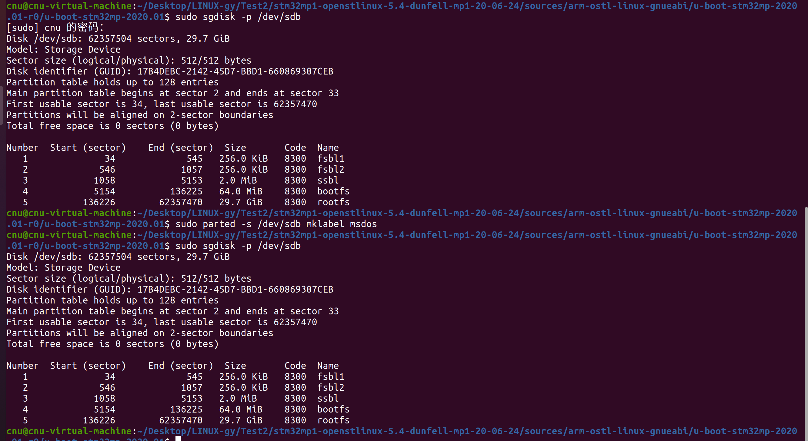
> 图：步骤 4 全程实录——① `sgdisk -p` 查看旧表；② `parted -s /dev/sdb mklabel msdos` 执行后**一行输出都没有**、直接回到提示符；③ 再 `sgdisk -p` 复查，输出与①**一模一样**。

> **两条 `sgdisk -p` 输出没有变化，是没清成功吗？** 命令本身执行成功了，但**旧 GPT 确实没被擦掉**。逐条对上：
>
> 1. **`-s`（脚本模式）成功即静默**：不打印任何东西、无报错、直接回到提示符 = 执行完毕。这条命令只改开头 1 个扇区，瞬间完成，**不需要等待**。
> 2. **`lsblk` / `/dev/sdb1~sdb5` 不变化是正常的**：它们来自**内核缓存的旧分区表**，重写盘上分区表后内核不会自动重扫，旧节点会一直"赖"着；`sudo partprobe /dev/sdb` 可让内核刷新。
> 3. **复查输出分毫不差（连 GUID `17B4DEBC-…` 都没变）= 旧 GPT 原样还在**：`parted mklabel msdos` 只在开头扇区写了个空 MBR 标签，并不会把 GPT 头 / 分区项数组一并擦除；`sgdisk` 打开盘发现 GPT 依然有效，就继续按 GPT 显示。这是 parted 切换标签不清旧 GPT 的固有行为，**不是操作失误**。
>
> **怎么办**：按上面"补一刀彻底清场"执行 `sudo sgdisk -Z /dev/sdb`，再照步骤 5 继续。（严格说直接用步骤 5 也未必出问题——它带 `-g`，会重建整张 GPT，主表和盘尾备份一起重写；但先清干净能让步骤 5 与课件假设的"空盘"完全一致，`partprobe` 后 `lsblk` 里 `sdb1~sdb5` 消失，也是第一次真正"看得见"的变化。）

**`sgdisk -Z` 实测**：注意两次 `partprobe` 的对比——第一次刷新后 `sdb1~sdb5` **还在**（旧 GPT 还躺在盘上，内核重读出来的自然还是旧分区）；`-Z` 清场之后再刷新，这 5 个节点才真正消失：

```bash
cnu@cnu-virtual-machine:...$ sudo partprobe /dev/sdb
cnu@cnu-virtual-machine:...$ ls /dev/sd*
/dev/sda  /dev/sda1  /dev/sda2  /dev/sda5  /dev/sdb  /dev/sdb1  /dev/sdb2  /dev/sdb3  /dev/sdb4  /dev/sdb5
cnu@cnu-virtual-machine:...$ sudo sgdisk -Z /dev/sdb
GPT data structures destroyed! You may now partition the disk using fdisk or
other utilities.
cnu@cnu-virtual-machine:...$ sudo partprobe /dev/sdb
cnu@cnu-virtual-machine:...$ ls /dev/sd*
/dev/sda  /dev/sda1  /dev/sda2  /dev/sda5  /dev/sdb
cnu@cnu-virtual-machine:...$ 
```

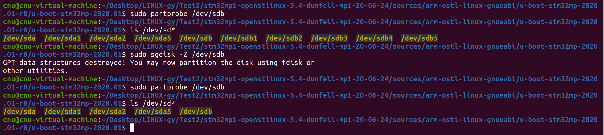
> 图：`sgdisk -Z` 清场实录——两次 `partprobe` 对比分明：**清场前**刷新，`sdb1~sdb5` 还在（旧 GPT 还躺在盘上，重读出来自然还是旧分区）；**清场后**再刷新，这 5 个分区节点才真正消失。`GPT data structures destroyed!` 就是清场成功的标志。

清空后再复查一次——这次是一张真正的"空盘"：分区数为 0、29.7 GiB 全部空闲（列表上方那行 GUID 只是空盘上临时生成的，写盘之前都做不得数）：

```bash
cnu@cnu-virtual-machine:~/Desktop/LINUX-gy$ ls /dev/sd*
/dev/sda  /dev/sda1  /dev/sda2  /dev/sda5  /dev/sdb
cnu@cnu-virtual-machine:~/Desktop/LINUX-gy$ sudo sgdisk -p /dev/sdb
[sudo] cnu 的密码： 
Creating new GPT entries in memory.
Disk /dev/sdb: 62357504 sectors, 29.7 GiB
Model: Storage Device
Sector size (logical/physical): 512/512 bytes
Disk identifier (GUID): 6D1951F2-C0B1-4FFF-B47B-02D7BCC7E886
Partition table holds up to 128 entries
Main partition table begins at sector 2 and ends at sector 33
First usable sector is 34, last usable sector is 62357470
Partitions will be aligned on 2048-sector boundaries
Total free space is 62357437 sectors (29.7 GiB)

Number  Start (sector)    End (sector)  Size       Code  Name
cnu@cnu-virtual-machine:~/Desktop/LINUX-gy$ 
```

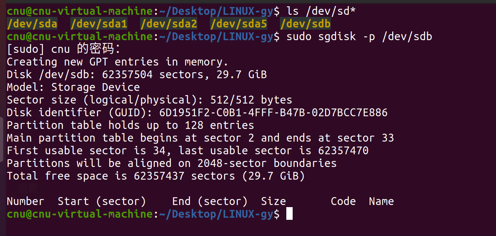
> 图：清空后的复查——分区列表为空、29.7 GiB 全部空闲，是一张真正的“空盘”；`Creating new GPT entries in memory.` 说明盘上已无任何分区表，sgdisk 现场在内存里新建了一张空 GPT（此时还没写盘，显示的 GUID 做不得数，以步骤 5 真正写盘后的为准）。

### 步骤 5：重新分区（Slide 46）

```bash
sudo sgdisk --resize-table=128 -a 1 -n 1:34:545 -c 1:fsbl1 -n 2:546:1057 -c 2:fsbl2 -n 3:1058:5153 -c 3:ssbl -n 4:5154:136225 -c 4:bootfs -n 5:136226 -c 5:rootfs -A 4:set:2 -p /dev/sdb -g
```

一条命令做完所有事，参数含义速查：

| 参数 | 含义 |
|---|---|
| `--resize-table=128` | GPT 分区表容量设为 128 项 |
| `-a 1` | 分区按 1 扇区对齐 |
| `-n 1:34:545` 等 | 创建分区：编号：起始扇区：结束扇区 |
| `-c 1:fsbl1` 等 | 给分区命名（ROM 代码按名字找分区） |
| `-A 4:set:2` | 给 4 号分区（bootfs）设置"可引导"属性位 |
| `-p /dev/sdb` | 完成后打印分区表（直接能看到结果） |
| `-g` | 使用 GPT 分区表（完整名 `--mbrtogpt`：负责把 MBR 标签的盘转换成 GPT；在 MBR/BSD 标签的盘上写入必须带它，否则 sgdisk 拒绝写盘） |

命令末尾会自动打印分区表。对照第一节那张表检查：**5 个分区、名字一字不差**（`fsbl1 / fsbl2 / ssbl / bootfs / rootfs`）。注意 rootfs 的结束扇区不用管——`-n 5:136226` 没写结束值，自动吃掉剩余全部空间，卡大小不同只影响它。

**实际执行结果**：

```bash
cnu@cnu-virtual-machine:~/Desktop/LINUX-gy$ sudo sgdisk --resize-table=128 -a 1 -n 1:34:545 -c 1:fsbl1 -n 2:546:1057 -c 2:fsbl2 -n 3:1058:5153 -c 3:ssbl -n 4:5154:136225 -c 4:bootfs -n 5:136226 -c 5:rootfs -A 4:set:2 -p /dev/sdb -g
Creating new GPT entries in memory.
Setting name!
partNum is 0
Setting name!
partNum is 1
Setting name!
partNum is 2
Setting name!
partNum is 3
Setting name!
partNum is 4
Disk /dev/sdb: 62357504 sectors, 29.7 GiB
Model: Storage Device  
Sector size (logical/physical): 512/512 bytes
Disk identifier (GUID): 69CB63CB-A123-4B5F-853B-AEC3C970B5AF
Partition table holds up to 128 entries
Main partition table begins at sector 2 and ends at sector 33
First usable sector is 34, last usable sector is 62357470
Partitions will be aligned on 1-sector boundaries
Total free space is 0 sectors (0 bytes)

Number  Start (sector)    End (sector)  Size       Code  Name
   1              34             545   256.0 KiB   8300  fsbl1
   2             546            1057   256.0 KiB   8300  fsbl2
   3            1058            5153   2.0 MiB     8300  ssbl
   4            5154          136225   64.0 MiB    8300  bootfs
   5          136226        62357470   29.7 GiB    8300  rootfs
The operation has completed successfully.
cnu@cnu-virtual-machine:~/Desktop/LINUX-gy$ 
```

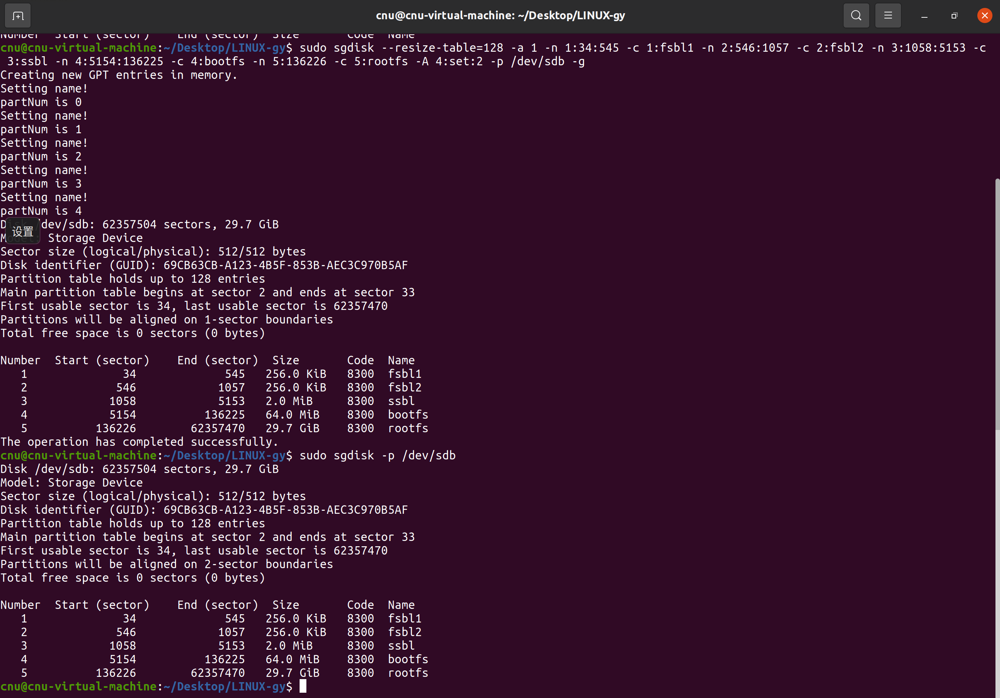
> 图：重建成功实录——5 个分区、名字 `fsbl1 / fsbl2 / ssbl / bootfs / rootfs` 一字不差，与第一节那张表完全对上（`Setting name! / partNum is N` 是给 5 个分区逐个命名的过程输出，末行 `The operation has completed successfully.` 即成功标志）。

### 步骤 6：烧写 u-boot 到 SD 卡（Slide 47）

还在源码顶层目录（步骤 1 已 cd 过去，确认能 `ls` 到两个镜像再继续）：

```bash
sudo dd if=u-boot-spl.stm32 of=/dev/sdb1 conv=fdatasync
sudo dd if=u-boot-spl.stm32 of=/dev/sdb2 conv=fdatasync
sudo dd if=u-boot.img     of=/dev/sdb3 conv=fdatasync
```

**三点说明**：

- **SPL 为什么烧两次？** ROM Code 启动时先加载 `fsbl1`，校验失败（比如烧坏、升级中断电）就自动改试 `fsbl2`——双备份保平安。正常情况下两份内容完全相同；
- **`conv=fdatasync`**：dd 返回前把数据真正落盘（SD 卡写入有缓存，不加这个参数可能"假完成"）；
- **为什么 dd 到分区而不是拷文件？** `fsbl1`/`fsbl2`/`ssbl` 这三个分区里**没有文件系统**，ROM Code 只会按扇区裸读镜像。`dd` 就是绕过文件系统、按扇区原样写入——这正是"烧写"与"拷贝"的区别。

dd 返回即落盘完成（三个分区都没有挂载，无需 `umount`/安全弹出）。把 SD 卡从读卡器取出，准备插到开发板上。

**实际执行结果**：

```bash
cnu@cnu-virtual-machine:...$ sudo dd if=u-boot-spl.stm32 of=/dev/sdb1 conv=fdatasync
[sudo] cnu 的密码： 
记录了197+1 的读入
记录了197+1 的写出
101016字节（101 kB，99 KiB）已复制，0.113013 s，894 kB/s
cnu@cnu-virtual-machine:...$ sudo dd if=u-boot-spl.stm32 of=/dev/sdb2 conv=fdatasync
记录了197+1 的读入
记录了197+1 的写出
101016字节（101 kB，99 KiB）已复制，0.111545 s，906 kB/s
cnu@cnu-virtual-machine:...$ sudo dd if=u-boot.img     of=/dev/sdb3 conv=fdatasync
记录了1694+1 的读入
记录了1694+1 的写出
867417字节（867 kB，847 KiB）已复制，0.959025 s，904 kB/s
cnu@cnu-virtual-machine:...$ 
```

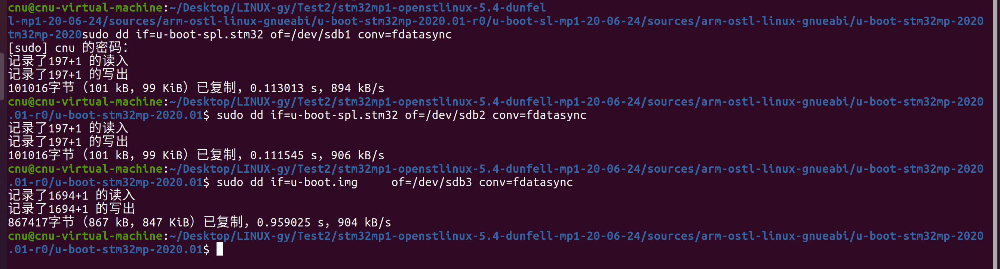
> 图：三条 `dd` 全部成功——SPL 分别写入 `fsbl1`/`fsbl2` 各 101016 字节（正是 `u-boot-spl.stm32` 的大小），U-Boot 本体写入 `ssbl` 867417 字节（正是 `u-boot.img` 的大小），各约 0.1~1 秒、无 I/O 错误。（开头的 `记录了 N+1 的读入/写出` 是 dd 的块计数，看末尾"已复制 x 字节"与速率即可。）

**读卡器用完怎么"还"给电脑？** 右键虚拟机窗口右下角状态栏的读卡器图标 →「断开连接」，设备就交还给宿主电脑，此时可以放心从 USB 口拔下：

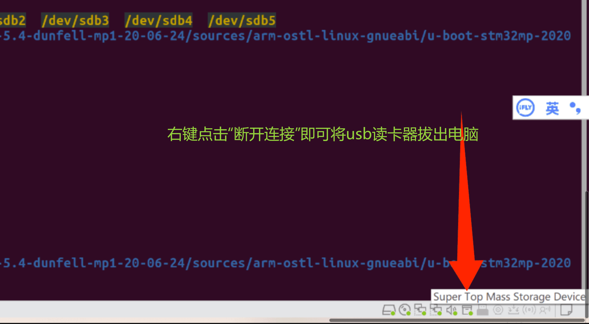
> 图：右键状态栏的 `Super Top Mass Storage Device` 图标选「断开连接」，即可把 USB 读卡器拔出电脑。

### 步骤 7：串口就位（Slide 49）

沿用实验一配好的串口方案——**Windows 上的 MobaXterm 开 Serial 会话**连板载 ST-Link 虚拟串口（COM 口）：保持 MobaXterm 窗口开着，断电状态下给开发板上电，窗口里刷出输出即链路正常。参数与实验一相同：**115200、8 数据位、1 停止位、无校验**。

> 关于串口工具（课件 Slide 49 给了两个选项）：Linux 里可以用 `minicom`（设备 `/dev/ttyACM0`），Windows 里用 **MobaXterm**（设备 `comX`）——我们用的正是后者（实验一步骤 1 已经用它抓到出厂日志）。两者参数一致：115200、8 数据位、1 停止位、无校验。

**实际执行结果**：串口链路就绪——MobaXterm 新建 Serial 会话，选中 `COM11（STMicroelectronics STLink Virtual COM Port）`（板载 ST-Link 的虚拟串口，实验一抓出厂日志用的同一个）。板子未上电时窗口一片空白；上电瞬间开始刷日志，抓到的实录见步骤 8。

### 步骤 8：上电启动，迎接"预期中的失败"（Slide 48）

1. **开发板断电**，把烧好的 SD 卡插到开发板卡槽；

2. 把启动**拨码开关置为 `101`**（从 SD 卡启动）——板上是三位拨码，丝印与 `BOOT2 / BOOT1 / BOOT0` 一一对应，`101` 即按“ON、OFF、ON”拨（1 = ON 侧，0 = OFF 侧）：

   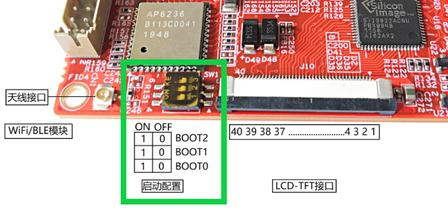
   > 图：FS-MP1A 的启动拨码（SW1）——三位自上而下对应 `BOOT2 / BOOT1 / BOOT0`，ON 侧为 1、OFF 侧为 0；从 SD 卡启动就拨成 `101`。

   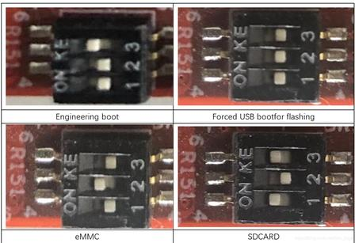
   > 图：拨码的四种典型配置（工程模式 / 强制 USB 烧写 / eMMC 启动 / **SD 卡启动**）——本实验用 SDCARD 那一档。

3. 接电源上电，盯着 MobaXterm 串口窗口。

预期串口输出（细节以实际为准，课件 Slide 48 截图转录）：

```
U-Boot SPL 2020.01-stm32mp-r1 (Jul 15 2020 - 14:06:26 +0800)   ← 你的编译时间戳会是自己的日期
Model: STMicroelectronics STM32MP157A-DK1 Discovery Board
stpmic1_read: failed to read register ... : -110
board_init_f: probe failed, clk=0 reset=0 pinctrl=0 power=-110
RAM: DDR3-DDR3L 16bits 533000Khz
stpmic1_read: failed to read register ... : -110
ddr power init failed
resetting ...
```

……然后从头再来，**无限复位循环**。

**怎么解读这份输出？三件事都值得看：**

| 看到什么 | 说明什么 |
|---|---|
| `U-Boot SPL 2020.01-stm32mp-r1` + **你自己的编译时间戳** | ROM Code → SPL 链条通了，跑的确实是实验三编出的镜像（不是出厂固件——出厂固件是 TF-A 引导，开头是 `NOTICE: BL2`） |
| SPL 成功初始化 DDR（`RAM: DDR3-DDR3L 16bits 533000Khz`） | 硬件、DDR 配置正常 |
| `stpmic1_read: failed ... power=-110` → `resetting ...` | **本实验的预期失败点**：SPL 按设备树去找 DK1 板上的电源管理芯片 STPMIC1（挂在 I2C4 总线），FS-MP1A 用的是分立电源电路、没有这颗芯片，读寄存器超时（`-110`），SPL 判定电源初始化失败后复位 |

对照实验一抓到的出厂固件日志（`NOTICE: BL2 ...`）能看到引导链换掉了：出厂是 trusted 模式（TF-A 先跑），现在是 basic 模式（SPL 先跑）。**看到"电源报错 + 复位循环"，实验四就算完成**——修复它就是实验五 F-1 的全部内容。

**实际执行结果**：

串口实录（原样转录，一轮结束后自动复位、从头再来）：

```
U-Boot SPL 2020.01-stm32mp-r1-g3f0216e7-dirty (Sep 15 2026 - 23:15:55 +0800)
Model: STMicroelectronics STM32MP157A-DK1 Discovery Board
stpmic1_read: failed to read register x : 32board_init_f: probe failed clk=0 reset=0 pinctrl=0 power=-110
RAM: DDR3-DDR3L 16bits 533000Khz
stpmic1_read: failed to read register x : 39ddr power init failed

resetting ...

U-Boot SPL 2020.01-stm32mp-r1-g3f0216e7-dirty (Sep 15 2026 - 23:15:55 +0800)
Model: STMicroelectronics STM32MP157A-DK1 Discovery Board
stpmic1_read: failed to read register x : 32board_init_f: probe failed clk=0 reset=0 pinctrl=0 power=-110
RAM: DDR3-DDR3L 16bits 533000Khz
stpmic1_read: failed to read register x : 39ddr power init failed

resetting ...

（如此往复，无限循环）
```

> 说明两点：① `register x : 32` 与 `board_init_f:` 挤在同一行、`39` 与 `ddr power init failed` 挤在同一行，是 SPL 个别日志缺换行的原样输出，不是转写错误；② 版本串里的 `Sep 15 2026 - 23:15:55` 正是实验三的编译时间戳（`g3f0216e7` 是构建时源码仓库的提交号），证明跑的就是我们自己的镜像。

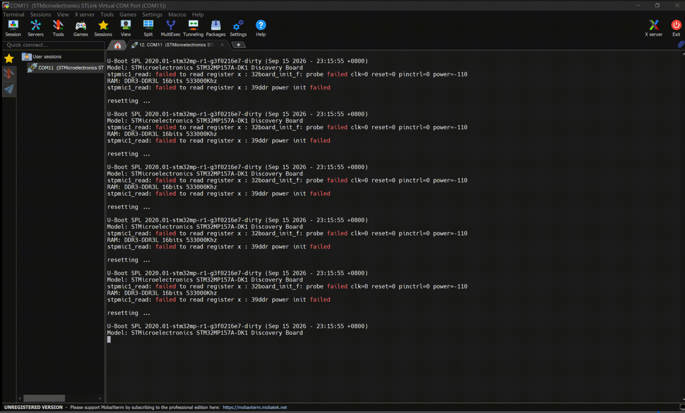
> 图：COM11 串口实录的静帧——同一段日志一遍遍重复，这就是“复位循环”的样子（即下方动图的一帧）。

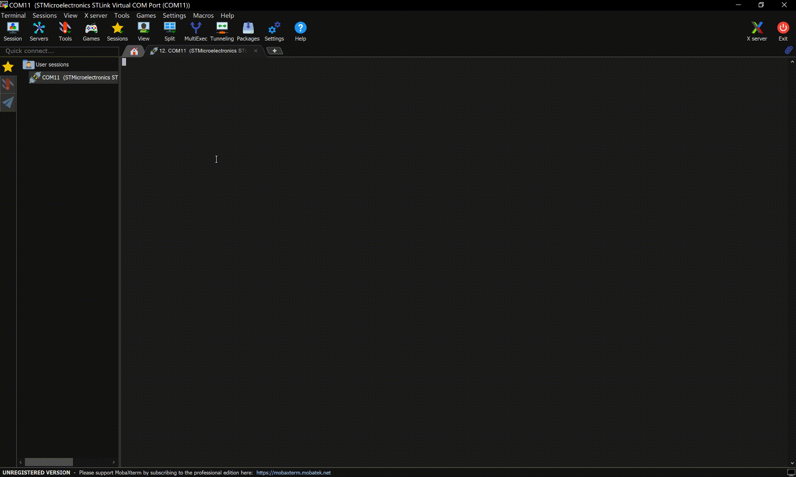
> 图（动图）：复位循环现场实录——每轮报错后 `resetting ...` 从头再来，无限重复；这个循环正是实验五（F-1）要终结的。

## 五、注意事项

1. **设备号是生死线**：`/dev/sdb` 只是课件示例，务必按步骤 2/3 的两次 `ls /dev/sd*` + `lsblk` 容量对照确认。`parted`/`sgdisk`/`dd of=` 指定到系统盘会把虚拟机磁盘毁掉。
2. **读卡器接给虚拟机后，Windows 就看不到这张卡了**（USB 设备被独占转交）；dd 完成前不要拔读卡器。
3. **插拔 SD 卡都在开发板断电状态下进行**；插好卡、拨好拨码再上电。
4. **复位循环不是故障**：能循环复位说明 SPL 在跑，是设备树电源配置与硬件不匹配的预期表现，别急着断电重烧。真正要警惕的反而是"串口毫无输出"——那才是烧写/启动环节出了问题（回查：卡是否插好、拨码是否 101、串口是否抓对设备）。
5. **分区只做一次**：后续实验（F-1~F-6、trusted 移植）只重复步骤 6 的三条 dd；只有换新卡才需要重新分区。

## 六、实验完成标志

- `sgdisk --version` 正常输出（gdisk 已装）
- 分区完成：`sgdisk -p`（或命令自动打印）显示 5 个分区，名字为 fsbl1 / fsbl2 / ssbl / bootfs / rootfs
- 三条 dd 命令执行成功（各显示写入记录，无 I/O 错误）
- 拨码 101 + SD 启动，串口抓到 SPL 输出，编译时间戳是自己的（`Sep 15 2026 - 23:15:55`）
- 观察到预期的 `stpmic1_read: failed ... -110` 与复位循环

## 七、下一步

电源这关卡住了整个启动链，实验五就从它开刀：**F-1 修改设备树电源配置**（Slide 50-59）——删掉 DK1 的 I2C4/PMIC 相关节点、补上 FS-MP1A 的固定电源（regulator-fixed）配置，menuconfig 里关掉 STPMIC1 支持项，重新编译、重新 dd 烧写，让 SPL 迈过电源初始化，撞上下一关（SD 卡检测引脚，F-2）。修改设备树的具体位置课件会逐张截图给出，照着改即可——"现在不要问为什么，照着改就完了"，设备树的原理留到驱动开发章节再展开。
