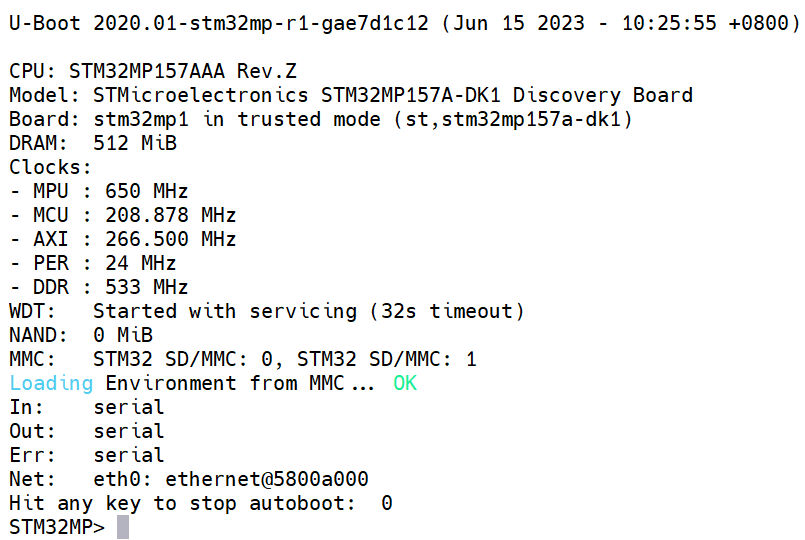
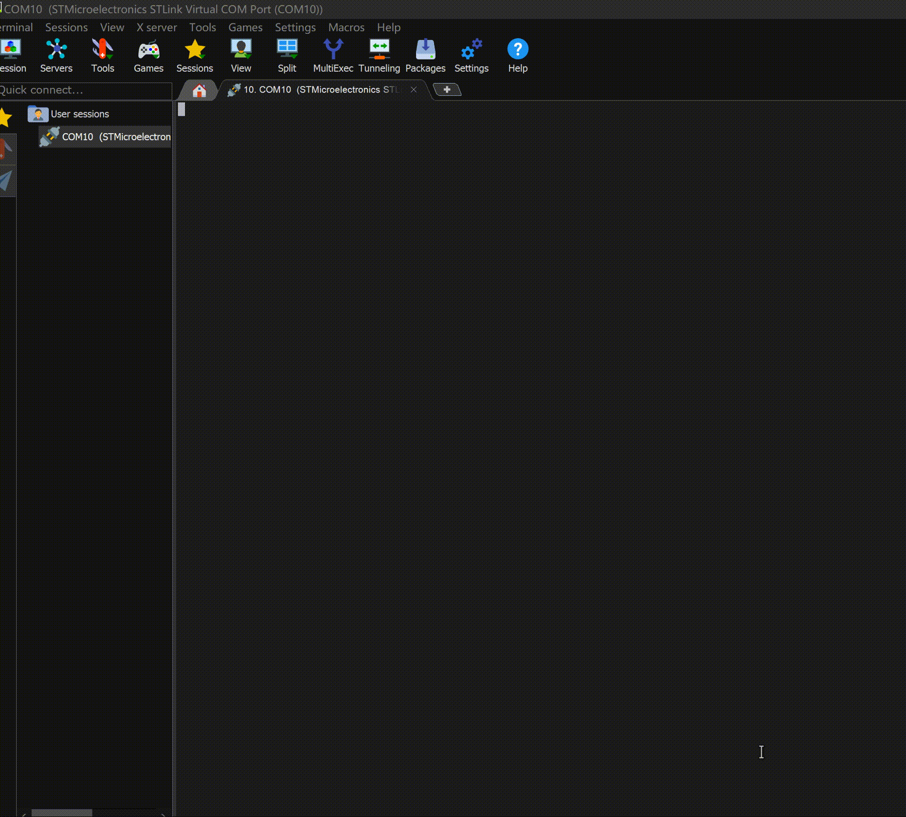
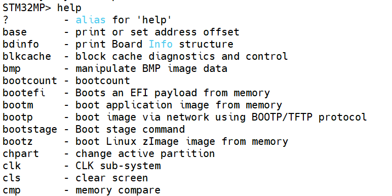
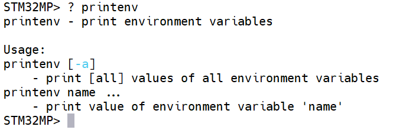
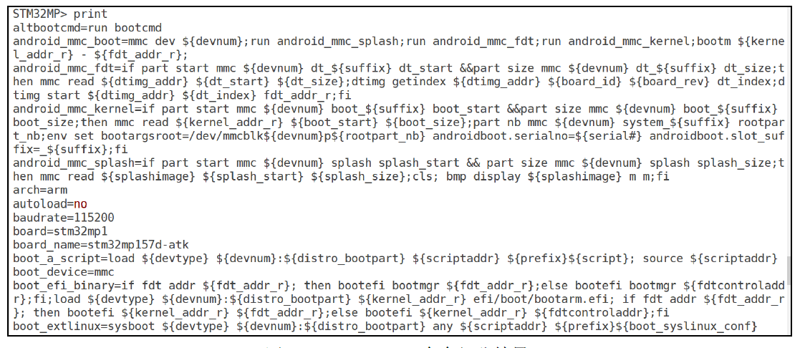
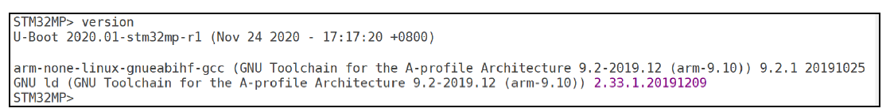
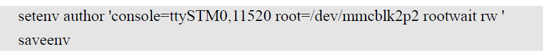
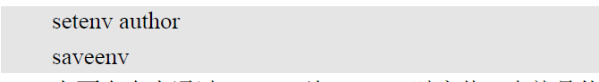

# 实验十二 U-Boot 命令行与环境变量——第 4 章《使用 U-Boot》开篇

> **对应课件**：《第4章 使用U-Boot》4.1~4.3 节，Slide 2-16
>
> **系列说明**：本系列基于华清远见 FS-MP1A（STM32MP157A）开发板，对应课件《第4章 使用U-Boot》。第 3 章《移植U-Boot》的十一个实验把启动链条第三环装到了板上——trusted 版 U-Boot 已能稳定停在 `STM32MP>` 命令行。但能停在命令行只是"装好了"，还谈不上"会用"。第 4 章就是使用篇：U-Boot 的命令行是后续内核移植、根文件系统实验的操作台——环境变量怎么设、文件怎么下载、内核怎么手动启动，全在这里练。本文覆盖 Slide 2-16：进入命令行、help 帮助系统、三条查询命令、环境变量的增删改与 saveenv 保存纪律。前置：第 3 章实验十一已完成（trusted 版收官，上电直达 `STM32MP>`）。

## 一、本篇的特殊之处：不碰源码

第 3 章的每个实验都从"激活工具链、进源码目录"开始；本篇全程**不用虚拟机、不编译、不烧写**——纯粹的板子侧操作，所有动作都发生在串口的 `STM32MP>` 提示符后面。这也是"使用"与"移植"的分野：移植时我们改的是 U-Boot 本身，使用时我们驱使的是已经装好的 U-Boot。

课件 Slide 2 的串口截图里，华清演示板跑的正是 trusted 版 U-Boot（横幅 `Board: stm32mp1 in trusted mode`）——与我们第 3 章收官后的板子状态完全同款，跟着课件走不会有"版本对不上"的困扰。

## 二、实验环境（实际）

| 项目 | 实际值 |
|---|---|
| 板子状态 | 第 3 章收官形态：SD 卡启动（拨码 `101`），trusted 版 U-Boot，`STM32MP>` 稳定可达 |
| 串口 | MobaXterm Serial 会话，115200；`COM11` 是**旧电脑**上的实测值，**新电脑上实测 `COM10`**（2026-09-24 起，标题栏为 `STMicroelectronics STLink Virtual COM Port (COM10)`）；换机后一律以 Windows 设备管理器里板载 ST-Link 的串口号为准（新机上可能还要先装 ST-LINK 驱动） |
| 环境变量基线 | 实验九设定并 saveenv：`ethaddr`、`ipaddr 192.168.0.8`、`netmask 255.255.255.0`，存于 SD 卡 |
| 本篇新增材料 | 无——不动源码、不编译、不烧写 |

> **开工自检（第一条命令就该干这个）**：上电看 `Hit any key to stop autoboot:` 后面那个数字。本篇默认它是 **0**（出厂环境的遗留值，换过板子、重新分区烧写后尤其会回到 0）——倒计时只有眨眼的一瞬，全靠抢按键。停进 `STM32MP>` 后的第一件事，先把它调成 5 秒再往下走：
>
> ```
> setenv bootdelay 5
> saveenv
> ```
>
> `reset` 之后倒计时从 5 数起，本篇步骤 1/3/6 的每一次拦停、以及第 4 章往后全部实验都不用再抢那一下。`setenv`/`saveenv` 与 `env set`/`env save` 是同一段代码的两个门牌，两套写法都可（详见步骤 2 的命令集差异提示）。换机换板后其他状态怎么复原，见 `01_移植U-Boot/附录_换机换板快速恢复到实验十一结束状态.md`。

## 三、课件 ↔ 步骤对应表

| 课件 Slide | 内容 | 对应步骤 |
|---|---|---|
| 2 | 上电拦停，进入 U-Boot 命令行 | 步骤 1 |
| 3~6 | help/？ 帮助系统、命令缩写、Tab 补全、十六进制参数 | 步骤 2 |
| 7~10 | 查询命令：bdinfo / printenv / version | 步骤 3 |
| 11~12 | 环境变量三剑客 printenv/setenv/saveenv；修改 bootdelay 实战 | 步骤 4 |
| 13 | 新增环境变量（author） | 步骤 5 |
| 14 | 删除环境变量；"改完必须 saveenv"纪律 | 步骤 6 |
| 15~16 | 重要的环境变量；网络四件套复核 | 步骤 7 |

## 四、实验步骤

### 步骤 1：上电拦停，进入命令行（Slide 2）

板子插好 SD 卡、拨码 `101`、上电（或按复位）。MobaXterm 串口里会依次看到：

1. **TF-A 引导日志**（`NOTICE:` / `INFO:` 开场，实验十一逐行解读过）；
2. **U-Boot 横幅**——`U-Boot 2020.01-stm32mp-r1-g88f08870-dirty (Sep 19 2026 - 14:51:04 +0800)` 一行起，到 `Net:   eth0: ethernet@5800a000` 为止；
3. **倒计时**：`Hit any key to stop autoboot:  0`——**看到这行立刻按 Enter**（实验九练过的动作：看准提示、倒计时内按键）；
4. 停在 `STM32MP>` 提示符。


> 图：课件 Slide 2——trusted 版 U-Boot 启动串口打印：横幅自报 `in trusted mode`，`MMC: STM32 SD/MMC: 0, STM32 SD/MMC: 1` 双控制器，`Net: eth0`，`Hit any key to stop autoboot: 0` 处按任意键，停在 `STM32MP>`。（华清演示板截图，版本串与时间戳与我们必然不同，认提示符即可。）

错过倒计时也不要紧：trusted 版的 autoboot 只会去扫 mmc 设备（`Boot over mmc0!` → `** Unrecognized filesystem type **`——卡上还没有内核，这是后续章节的课题），不会像 basic 阶段那样挂在网卡上，两行报错后照样落回 `STM32MP>`。想从头看日志，敲 `reset`（或按板上复位键）即可重放一遍。

> **本篇第一个动手项，其实就是给拦停留出反应时间**：`Hit any key to stop autoboot:` 后面那个数字是环境变量 `bootdelay`（单位：秒），出厂/默认环境里它是 **0**——倒计时只有一瞬，全靠看到提示的瞬间按键。进步行符后先把它改成 5 秒存盘，本篇后面每一步（以及第 4 章全部实验）都不用再抢那一下：
>
> ```
> setenv bootdelay 5
> saveenv
> ```
>
> `setenv`/`saveenv` 与 `env set`/`env save` 是同一段代码的两个门牌，`help` 列表里四条都在。要是敲下去报 `Unknown command 'setenv'`，先怀疑粘贴带进来的不可见字节（终端粘贴用右键，别从 PDF/网页直接拷），手敲一遍即见分晓。这一步在步骤 4 会正式练（改值 → 存盘 → `reset` 复验倒计时从 5 数起）。

**实际执行结果**：


> 图：实测动图——插卡上电后串口的完整过程：TF-A 的 `NOTICE:`/`INFO:` 开场 → U-Boot 横幅（`in trusted mode`、`MMC: 0, 1`、`Net: eth0`）→ 倒计时 → 停在 `STM32MP>` 提示符。2026-09-22 换机换板后的新板实拍。

### 步骤 2：help 帮助系统与命令行小抄（Slide 3~6）

U-Boot 命令行自带帮助系统，两条入口：

```
STM32MP> help
```

列出这个 U-Boot 支持的**全部**命令（一屏放不下，逐屏翻完）。`help` 与 `?` 等价。


> 图：课件 Slide 3——`STM32MP> help` 输出（节选）：`? - alias for 'help'`、`bdinfo - print Board Info structure`、`bootm - boot application image from memory`、`mmc - MMC sub-system` 等，每行一条"命令名 - 一句话说明"。

查单条命令的详细用法（usage）：

```
STM32MP> ? printenv
```


> 图：课件 Slide 4——`? printenv` 输出该命令的两行用法：`printenv [-a]` 打印全部环境变量、`printenv name ...` 打印指定名字的环境变量。

另外三条命令行小抄（课件 Slide 5~6，纯文字但天天要用）：

| 规则 | 说明 |
|---|---|
| **命令可缩写** | 前缀不歧义即可省略后缀：`print` 与 `printenv` 效果完全相同 |
| **Tab 补全** | 输入命令前几个字符按 Tab，自动补全；歧义时连按两次列出候选 |
| **回车重复** | 空命令行直接回车 = 重复执行上一条命令 |
| **数值一律十六进制** | 命令的数值型参数（地址、扇区号）都是十六进制，`0x` 前缀可写可不写——`tftp c2000000 uImage` 里的地址就没写 |

> **命令集差异提示**：trusted 版实测 `help` 列表里 `setenv`、`printenv`、`saveenv`、`env` 四条环境变量命令全在，照课件写即可（`env set` / `env print` / `env save` 是同一段代码的另一套门牌，与顶层老名字等价）。第 3 章 basic 版当年报 `printenv` 为 `Unknown command`、改用 `env print`——如今把两边的配置逐条比过，环境变量相关的开关同值（`CONFIG_CMD_SAVEENV=y`、`CONFIG_CMD_ENV_EXISTS=y`、`CONFIG_CMD_NVEDIT_INFO=y`，且这套源码里根本没有 `CMD_SETENV`/`CMD_PRINTENV` 这两个符号），所以那次报错更可能是**粘贴或手打带进来的不可见字符**（零宽字符、全角空格：终端不回显，U-Boot 却把它们算进命令名），留待回切 basic 版时复验。**报 `Unknown command` 的排查顺序**：先手敲一遍同样的命令，再 `help` 查列表，最后才怀疑配置。

**实际执行结果**（2026-09-22 实测，新板 trusted 版）：`?` 与 `help` 等价，打出来是一整屏按字母排序的命令表——不用背，这一版共 120 条，只要认准里面**环境变量这一族**：`printenv` / `setenv` / `saveenv` / `env`（外加 `editenv`、`eraseenv` 两条暂时用不上）——顶层老名字与 `env` 子命令族两套都在，等价；以及后面几篇要用的 `mmc` / `ext4ls` / `ext4load` / `ext4write` / `tftpboot` / `ping` / `run` / `reset`。

```
STM32MP> ?
?         - alias for 'help'
base      - print or set address offset
bdinfo    - print Board Info structure
blkcache  - block cache diagnostics and control
bmp       - manipulate BMP image data
bootcount - bootcount
bootefi   - Boots an EFI payload from memory
bootm     - boot application image from memory
bootp     - boot image via network using BOOTP/TFTP protocol
bootstage - Boot stage command
bootz     - boot Linux zImage image from memory
chpart    - change active partition
clk       - CLK sub-system
cls       - clear screen
cmp       - memory compare
coninfo   - print console devices and information
cp        - memory copy
crc32     - checksum calculation
date      - get/set/reset date & time
dcache    - enable or disable data cache
dfu       - Device Firmware Upgrade
dhcp      - boot image via network using DHCP/TFTP protocol
dm        - Driver model low level access
dtimg     - manipulate dtb/dtbo Android image
echo      - echo args to console
editenv   - edit environment variable
env       - environment handling commands
erase     - erase FLASH memory
eraseenv  - erase environment variables from persistent storage
exit      - exit script
ext2load  - load binary file from a Ext2 filesystem
ext2ls    - list files in a directory (default /)
ext4load  - load binary file from a Ext4 filesystem
ext4ls    - list files in a directory (default /)
ext4size  - determine a file's size
ext4write - create a file in the root directory
false     - do nothing, unsuccessfully
fastboot  - run as a fastboot usb or udp device
fatinfo   - print information about filesystem
fatload   - load binary file from a dos filesystem
fatls     - list files in a directory (default /)
fatsize   - determine a file's size
fdt       - flattened device tree utility commands
flinfo    - print FLASH memory information
fstype    - Look up a filesystem type
fuse      - Fuse sub-system
go        - start application at address 'addr'
gpio      - query and control gpio pins
gpt       - GUID Partition Table
help      - print command description/usage
i2c       - I2C sub-system
icache    - enable or disable instruction cache
itest     - return true/false on integer compare
lcdputs   - print string on video framebuffer
led       - manage LEDs
ln        - Create a symbolic link
load      - load binary file from a filesystem
loadb     - load binary file over serial line (kermit mode)
loads     - load S-Record file over serial line
loadx     - load binary file over serial line (xmodem mode)
loady     - load binary file over serial line (ymodem mode)
loop      - infinite loop on address range
ls        - list files in a directory (default /)
md        - memory display
mdio      - MDIO utility commands
meminfo   - display memory information
mii       - MII utility commands
mm        - memory modify (auto-incrementing address)
mmc       - MMC sub system
mmcinfo   - display MMC info
mtd       - MTD utils
mtdparts  - define flash/nand partitions
mtest     - simple RAM read/write test
mw        - memory write (fill)
nand      - NAND sub-system
nboot     - boot from NAND device
nfs       - boot image via network using NFS protocol
nm        - memory modify (constant address)
part      - disk partition related commands
ping      - send ICMP ECHO_REQUEST to network host
pinmux    - show pin-controller muxing
pmic      - PMIC sub-system
poweroff  - Perform POWEROFF of the device
printenv  - print environment variables
protect   - enable or disable FLASH write protection
pxe       - commands to get and boot from pxe files
random    - fill memory with random pattern
regulator - uclass operations
reset     - Perform RESET of the CPU
rproc     - Control operation of remote processors in an SoC
run       - run commands in an environment variable
save      - save file to a filesystem
saveenv   - save environment variables to persistent storage
setcurs   - set cursor position within screen
setenv    - set environment variables
setexpr   - set environment variable as the result of eval expression
sf        - SPI flash sub-system
showvar   - print local hushshell variables
size      - determine a file's size
sleep     - delay execution for some time
source    - run script from memory
sspi      - SPI utility command
stboard   - read/write board reference in OTP
stm32key  - Fuse ST Hash key
stm32prog - <link> <dev> [<addr>] [<size>]
start communication with tools STM32Cubeprogrammer on <link> with Flashlayout at <addr>
sysboot   - command to get and boot from syslinux files
test      - minimal test like /bin/sh
tftpboot  - boot image via network using TFTP protocol
time      - run commands and summarize execution time
timer     - access the system timer
true      - do nothing, successfully
ubi       - ubi commands
ubifsload - load file from an UBIFS filesystem
ubifsls   - list files in a directory
ubifsmount- mount UBIFS volume
ubifsumount- unmount UBIFS volume
ums       - Use the UMS [USB Mass Storage]
usb       - USB sub-system
usbboot   - boot from USB device
version   - print monitor, compiler and linker version

STM32MP> ? printenv
printenv - print environment variables

Usage:
printenv [-a]
    - print [all] values of all environment variables
printenv name ...
    - print value of environment variable 'name'
STM32MP>
```


### 步骤 3：三条查询命令（Slide 7~10）

4.2 节给出三条"只读"命令，逐条过：

**bdinfo** —— 开发板信息：

```
STM32MP> bdinfo
```


> 图：课件 Slide 8——`bdinfo` 输出（节选）：`boot_params = 0xc0000100`（启动参数地址）、`DRAM bank = 0` 的 `-> start = 0xc0000000`（内存起始）与 `-> size`（内存大小）、`baudrate = 115200` 等。

重点关注 DRAM 两行：`start = 0xc0000000` 是 DDR 的物理起始地址——后面 tftp/ext4load 往内存下载文件，地址都从这一带起步；`size` 一行课件截图是 `0x40000000`（1GB 机型），**我们的 512MB 板应显示 `0x20000000`**——实验十一日志里 TF-A 报的 `Memory size = 0x20000000 (512 MB)` 正是同一件事，两个数字可以互证。

**printenv**（简写 `print`）—— 查看环境变量（4.3 节的主角，这里先见一面）：

```
STM32MP> print
```


> 图：课件 Slide 9——`print` 输出环境变量（节选）：`arch=arm`、`baudrate=115200`、`board=stm32mp1` 等，一屏看不完。课件演示板的 `board_name=stm32mp157d-atk`，我们的板子由自编 U-Boot 报 DK1 设备树信息，变量值不同属正常。

**version** —— 版本信息：

```
STM32MP> version
```


> 图：课件 Slide 10——`version` 输出三行：U-Boot 版本串、交叉编译器版本、链接器版本。

我们的版本串会带着自己的哈希与构建时间（第 3 章收官时卡上镜像为 `2020.01-stm32mp-r1-g88f08870-dirty (Sep 19 2026 - 14:51:04 +0800)`），与课件截图的 `2020.01-stm32mp-r1 (Nov 24 2020 ...)` 必然不同——看结构，不看数值。这条命令还能反查"卡上跑的到底是哪次构建"，第 3 章的版本串接力就是靠它（SPL/U-Boot 横幅）做的。

**实际执行结果**（2026-09-22 实测，新板）：三条查询命令连着敲，原样复制如下——分三段解读在下面。

```
STM32MP> bdinfo
arch_number = 0x00000000
boot_params = 0xc0000100
DRAM bank   = 0x00000000
-> start    = 0xc0000000
-> size     = 0x20000000
baudrate    = 115200 bps
TLB addr    = 0xd9ff0000
relocaddr   = 0xd9f39000
reloc off   = 0x19e39000
irq_sp      = 0xd7ded570
sp start    = 0xd7ded560
FB base     = 0x00000000
Early malloc usage: 138c / 3000
fdt_blob    = 0xd7ded800
```

`bdinfo` 一眼要抓到三处：`-> start = 0xc0000000`（DDR 起始）、`-> size = 0x20000000`（512MB，与实验十一 TF-A 报的 `Memory size = 0x20000000 (512 MB)` 互证，也印证了注意事项 7 里"课件那台是 1GB"的差别）、`baudrate = 115200 bps`（串口速率，与 MobaXterm 会话设置一致）。`relocaddr`/`reloc off` 两行是本版 U-Boot 把自己搬到了内存高端去运行，第 3 章的 `Board: stm32mp1 in trusted mode` 之后就一直在，见到不用管。

`print` 打出来的是**整套**环境变量（这一屏 71 条、5610 字节，一屏滚不完）。别逐条读，按三类扫：① 开头 `arch=arm`/`board=stm32mp1`/`soc=stm32mp` 这类是 U-Boot 自报家门的；② `boot_*`/`android_*`/`scan_dev_for_*`/`distro_bootcmd` 这一大族是 ST 从原厂配置带进来的 **distro 启动脚本**，本篇只用到其中 `bootcmd`、`boot_device`、`boot_instance` 三条，其余原样摆着不用管；③ 最后是我们第 3 章亲手设的那几条。与本篇有关的关键行摘出来：

| 变量 | 实测值 | 说明 |
|---|---|---|
| `bootdelay` | `5` | 步骤 4 改的就是它（此时已生效） |
| `bootcmd` | `run bootcmd_stm32mp` | 它再往下转 `boot_device=mmc` + `boot_instance=0` → 就是串口那句 `Boot over mmc0!` 的出处 |
| `ipaddr` / `netmask` / `ethaddr` | `192.168.0.8` / `255.255.255.0` / `1A:1F:DB:0E:69:FD` | 实验九设、换板后按附录重设，三条都还在 |
| `serverip` | `192.168.1.1` | **注意：它不是"未设"，而是 ST 默认环境里就带着 192.168.1.1**——下一篇用 tftp 前必须改成 PC 的 `192.168.0.100`，否则板子会去敲别人家的地址 |
| `ver` | `U-Boot 2020.01-stm32mp-r1-g88f08870-dirty (Sep 19 2026 - 14:51:04 +0800)` | 环境里也存了一份版本串，与 `version` 命令同源 |
| `serial#` | `002E003A3131510836373834` | 芯片唯一序列号（OTP 读出），换板后这块板的编号与旧板不同，可作为"是哪块板"的铁证 |
| 末行 | `Environment size: 5610/8187 bytes` | 环境区总容量约 8KB、已用 5610 字节——改完东西别忘 saveenv，但也不必担心写满 |

```
STM32MP> print
altbootcmd=run bootcmd
android_mmc_boot=mmc dev ${devnum};run android_mmc_splash;run android_mmc_fdt;run android_mmc_kernel;bootm ${kernel_addr_r} - ${fdt_addr_r};
android_mmc_fdt=if part start mmc ${devnum} dt_${suffix} dt_start &&part size mmc ${devnum} dt_${suffix} dt_size;then mmc read ${dtimg_addr} ${dt_start} ${dt_size};dtimg getindex ${dtimg_addr} ${board_id} ${board_rev} dt_index;dtimg start ${dtimg_addr} ${dt_index} fdt_addr_r;fi
android_mmc_kernel=if part start mmc ${devnum} boot_${suffix} boot_start &&part size mmc ${devnum} boot_${suffix} boot_size;then mmc read ${kernel_addr_r} ${boot_start} ${boot_size};part nb mmc ${devnum} system_${suffix} rootpart_nb;env set bootargsroot=/dev/mmcblk${devnum}p${rootpart_nb} androidboot.serialno=${serial#} androidboot.slot_suffix=_${suffix};fi
android_mmc_splash=if part start mmc ${devnum} splash splash_start && part size mmc ${devnum} splash splash_size;then mmc read ${splashimage} ${splash_start} ${splash_size};cls; bmp display ${splashimage} m m;fi
arch=arm
autoload=no
baudrate=115200
board=stm32mp1
board_name=stm32mp157a-dk1
boot_a_script=load ${devtype} ${devnum}:${distro_bootpart} ${scriptaddr} ${prefix}${script}; source ${scriptaddr}
boot_device=mmc
boot_efi_binary=if fdt addr ${fdt_addr_r}; then bootefi bootmgr ${fdt_addr_r};else bootefi bootmgr ${fdtcontroladdr};fi;load ${devtype} ${devnum}:${distro_bootpart} ${kernel_addr_r} efi/boot/bootarm.efi; if fdt addr ${fdt_addr_r}; then bootefi ${kernel_addr_r} ${fdt_addr_r};else bootefi ${kernel_addr_r} ${fdtcontroladdr};fi
boot_extlinux=sysboot ${devtype} ${devnum}:${distro_bootpart} any ${scriptaddr} ${prefix}${boot_syslinux_conf}
boot_instance=0
boot_net_usb_start=true
boot_prefixes=/ /boot/
boot_script_dhcp=boot.scr.uimg
boot_scripts=boot.scr.uimg boot.scr
boot_syslinux_conf=extlinux/extlinux.conf
boot_targets=mmc1 ubifs0 mmc0 mmc2 pxe
bootcmd=run bootcmd_stm32mp
bootcmd_android=env set mmc_boot run android_mmc_boot;run bootcmd_stm32mp
bootcmd_mmc0=devnum=0; run mmc_boot
bootcmd_mmc1=devnum=1; run mmc_boot
bootcmd_mmc2=devnum=2; run mmc_boot
bootcmd_pxe=run boot_net_usb_start; dhcp; if pxe get; then pxe boot; fi
bootcmd_stm32mp=echo "Boot over ${boot_device}${boot_instance}!";if test ${boot_device} = serial || test ${boot_device} = usb;then stm32prog ${boot_device} ${boot_instance}; else run env_check;if test ${boot_device} = mmc;then env set boot_targets "mmc${boot_instance}"; fi;if test ${boot_device} = nand || test ${boot_device} = spi-nand ;then env set boot_targets ubifs0; fi;if test ${boot_device} = nor;then env set boot_targets mmc0; fi;run distro_bootcmd;fi;
bootcmd_ubifs0=devnum=0; run ubifs_boot
bootcount=6
bootdelay=5
cpu=armv7
distro_bootcmd=for target in ${boot_targets}; do run bootcmd_${target}; done
dtimg_addr=0xc4500000
efi_dtb_prefixes=/ /dtb/ /dtb/current/
env_check=env exists env_ver || env set env_ver ${ver};if env info -p -d -q; then env save; fi;if test "$env_ver" != "$ver"; then echo "*** Warning: old environment ${env_ver}"; echo '* set default: env default -a; env save; reset'; echo '* update current: env set env_ver ${ver}; env save';fi;
ethaddr=1A:1F:DB:0E:69:FD
fdt_addr_r=0xc4000000
fdtcontroladdr=d7ded800
fdtfile=stm32mp157a-dk1.dtb
ipaddr=192.168.0.8
kernel_addr_r=0xc2000000
load_efi_dtb=load ${devtype} ${devnum}:${distro_bootpart} ${fdt_addr_r} ${prefix}${efi_fdtfile}
loadaddr=0xc2000000
mmc_boot=if mmc dev ${devnum}; then devtype=mmc; run scan_dev_for_boot_part; fi
netmask=255.255.255.0
partitions=name=ssbl,size=2M;name=bootfs,size=64MB,bootable;name=vendorfs,size=16M;name=rootfs,size=746M;name=userfs,size=-
pxefile_addr_r=0xc4200000
ramdisk_addr_r=0xc4400000
scan_dev_for_boot=echo Scanning ${devtype} ${devnum}:${distro_bootpart}...; for prefix in ${boot_prefixes}; do run scan_dev_for_extlinux; run scan_dev_for_scripts; done;run scan_dev_for_efi;
scan_dev_for_boot_part=part list ${devtype} ${devnum} -bootable devplist; env exists devplist || setenv devplist 1; for distro_bootpart in ${devplist}; do if fstype ${devtype} ${devnum}:${distro_bootpart} bootfstype; then run scan_dev_for_boot; fi; done; setenv devplist
scan_dev_for_efi=setenv efi_fdtfile ${fdtfile}; if test -z "${fdtfile}" -a -n "${soc}"; then setenv efi_fdtfile ${soc}-${board}${boardver}.dtb; fi; for prefix in ${efi_dtb_prefixes}; do if test -e ${devtype} ${devnum}:${distro_bootpart} ${prefix}${efi_fdtfile}; then run load_efi_dtb; fi;done;if test -e ${devtype} ${devnum}:${distro_bootpart} efi/boot/bootarm.efi; then echo Found EFI removable media binary efi/boot/bootarm.efi; run boot_efi_binary; echo EFI LOAD FAILED: continuing...; fi; setenv efi_fdtfile
scan_dev_for_extlinux=if test -e ${devtype} ${devnum}:${distro_bootpart} ${prefix}${boot_syslinux_conf}; then echo Found ${prefix}${boot_syslinux_conf}; run boot_extlinux; echo SCRIPT FAILED: continuing...; fi
scan_dev_for_scripts=for script in ${boot_scripts}; do if test -e ${devtype} ${devnum}:${distro_bootpart} ${prefix}${script}; then echo Found U-Boot script ${prefix}${script}; run boot_a_script; echo SCRIPT FAILED: continuing...; fi; done
scriptaddr=0xc4100000
serial#=002E003A3131510836373834
serverip=192.168.1.1
soc=stm32mp
splashimage=0xc4300000
suffix=a
ubifs_boot=env exists bootubipart || env set bootubipart UBI; env exists bootubivol || env set bootubivol boot; if ubi part ${bootubipart} && ubifsmount ubi${devnum}:${bootubivol}; then devtype=ubi; run scan_dev_for_boot; fi
usb_boot=usb start; if usb dev ${devnum}; then devtype=usb; run scan_dev_for_boot_part; fi
vendor=st
ver=U-Boot 2020.01-stm32mp-r1-g88f08870-dirty (Sep 19 2026 - 14:51:04 +0800)

Environment size: 5610/8187 bytes
```

```
STM32MP> version
U-Boot 2020.01-stm32mp-r1-g88f08870-dirty (Sep 19 2026 - 14:51:04 +0800)

arm-ostl-linux-gnueabi-gcc (GCC) 9.3.0
GNU ld (GNU Binutils) 2.34.0.20200220
STM32MP>
```

`version` 三行的读法与第 3 章一样：第一行是 U-Boot 自己的版本串（哈希 `g88f08870` = F-6 那次提交、`-dirty` 是当次构建时工作区有未跟踪文件、时间戳 14:51:04 = 实验十一那轮编译），也就是**卡上跑的到底是哪次构建**的反查凭据；后两行是交叉编译器与链接器版本——`arm-ostl-linux-gnueabi-gcc 9.3.0` 说明它确实是虚拟机里那套 ST SDK 编出来的，不是宿主机 gcc（万一编错，这里会露馅）。

### 步骤 4：setenv 修改 bootdelay + saveenv 保存（Slide 11~12）

4.3 节的三剑客分工：`printenv` 查、`setenv` 改、`saveenv` 存。先拿 `bootdelay`（autoboot 倒计时秒数）练手：

```
STM32MP> setenv bootdelay 5
STM32MP> saveenv
```

`setenv env_name env_value`——环境变量的值都是字符串；`bootdelay 5` 的 `5` 也是字符串 `"5"`，只是 U-Boot 用它时按数字解释。`saveenv` 把**整套**环境变量写回 flash（我们板上即 SD 卡的 ssbl 分区）：


> 图：课件 Slide 12——`setenv bootdelay 5` 后执行 `saveenv`，输出 `Saving Environment to MMC... Writing to redundant MMC(1)... OK`。（华清演示板从 eMMC 启动所以写 MMC(1)；我们从 SD 卡启动，应见 `Writing to MMC(0)` 与 `Writing to redundant MMC(0)` 两条——主副本 + 冗余副本，实验九设网络变量时见过。）

敲 `reset` 复位，拦停——这回倒计时从容地数 `5、4、3、2、1、0`，五秒窗口，以后拦停再也不用手忙脚乱。

**实际执行结果**（2026-09-22 实测）：本篇是连着做完再整体复制的，`setenv bootdelay 5` 那两条命令的回显没单独截，但它的效果散在下面三段里，串起来看就是完整证据——

```
STM32MP> saveenv
Saving Environment to MMC... Writing to MMC(0)... OK
```

（这是步骤 5 那次 `saveenv` 的打印；步骤 6 再 saveenv 一次，打的是冗余副本：）

```
STM32MP> saveenv
Saving Environment to MMC... Writing to redundant MMC(0)... OK
```

（复验值：步骤 3 那屏整套环境里已有 `bootdelay=5`，步骤 6 复位后又单查过一次：）

```
STM32MP> print bootdelay
bootdelay=5
```

三条实测说明：

1. **`saveenv` 打的是 `MMC(0)`** —— 环境落在 SD 卡（编号 0 = mmc0），课件截图那个 `MMC(1)` 是演示板从 eMMC 启动。换板之后这一条仍然成立，说明我们的环境一直存在卡上，跟的是卡不是板。
2. **改动生效用 `print bootdelay` 确认**（值为 `5`）；两次 saveenv 分别刷到了主副本与冗余副本，两份都是新值才算存牢。
3. **一个坑：复制下来的日志里，倒计时永远显示 `0`，看不出改没改成。** U-Boot 打印倒计时是用退格原地改写那个数字（`5 → 4 → 3 → … → 0`），屏幕上你确实看见它从 5 数下来，但终端缓冲区最后留下的只有收尾的 `0`——所以下面步骤 6 那份复位日志里的 `Hit any key to stop autoboot:  0` **不代表 bootdelay 是 0**，它只是"倒计时跑完了"的残留。要确认数值，认 `print bootdelay`，别认这行。

### 步骤 5：新增环境变量（Slide 13）

`setenv` 同一条命令，换个用法就是"新增"——名字不存在就创建：

```
STM32MP> setenv author 'console=ttySTM0,115200 root=/dev/mmcblk2p2 rootwait rw'
STM32MP> saveenv
```


> 图：课件 Slide 13——`setenv author '...'` 新建环境变量，值含空格必须用引号引起来，随后 saveenv 保存。

两个语法点：

- **值里有空格，必须整体加引号**（单引号双引号都行）——否则 U-Boot 会把第二段当成另一条命令的参数；
- `author` 这个值长得像内核启动参数（bootargs 风格），但它此刻**没有任何作用**——我们只是借它练语法。bootargs 什么时候真正上场，是第 5 章启动内核时的事。

用 `print author` 验证：


> 图：课件 Slide 13——`print` 输出中红框标出新建的 `author=console=ttySTM0,11520 root=/dev/mmcblk2p2 rootwait rw`，与相邻变量并排出现。（课件截图里波特率少了一个 0，值本身无意义，不必纠结。）

**实际执行结果**：

```
STM32MP> setenv author 'console=ttySTM0,115200 root=/dev/mmcblk2p2 rootwait rw'
STM32MP> saveenv
Saving Environment to MMC... Writing to MMC(0)... OK
STM32MP> print author
author=console=ttySTM0,115200 root=/dev/mmcblk2p2 rootwait rw
STM32MP>
```

三条各说一句：`setenv` **没有回显**（它只在出错时说话，别以为敲了没生效）；`saveenv` 打的是 `Writing to MMC(0)... OK`——主副本被刷新，步骤 6 再存一次时打的是 `redundant` 那条，两份副本就是这么轮着写到的；`print author` 立刻把新值原样打回，既证明"名字不存在就创建"兑现，也证明含空格的值被引号兜住、没被拆成两条命令。


### 步骤 6：删除环境变量 + "重启即失"对照实验（Slide 14）

**删除**：给变量赋空值即删——`setenv` 后面只跟名字、不跟值：

```
STM32MP> setenv author
STM32MP> saveenv
```


> 图：课件 Slide 14——`setenv author`（赋空值即删除）后 saveenv 保存。

接下来做一组**对照实验**，把 4.3 节最重要的一句纪律钉死——课件原话：*对环境变量进行修改后，要用 saveenv 命令把修改保存到 flash，否则修改只在内存中，重启会丢失*。空口无凭，亲测一次：

```
STM32MP> setenv testvar hello          # 只进内存，故意不 saveenv
STM32MP> print testvar                 # hello——内存里确实有
STM32MP> reset                         # 复位（或按板上复位键），倒计时内按 Enter 拦停
STM32MP> print testvar                 ## Error: "testvar" not defined——丢了
STM32MP> print author                  ## Error: "author" not defined——删除操作还在
STM32MP> print bootdelay               # 5——步骤 4 的修改也还在
```

三个结果对照着看：

| 变量 | 做过什么 | saveenv 过吗 | 重启后 |
|---|---|---|---|
| `testvar` | 新增 | 没有 | **消失** |
| `author` | 删除 | 有（步骤 6 开头那条） | 维持删除 |
| `bootdelay` | 改成 5 | 有（步骤 4） | 维持 5 |

一句话结论：**内存里的环境变量是"草稿"，saveenv 才是"存盘"，reset/断电就是"关机不保存"**。以后每次 setenv 完，先问自己一句"要重启后生效吗"——要，就 saveenv。

**实际执行结果**：

```
STM32MP> setenv author
STM32MP> saveenv
Saving Environment to MMC... Writing to redundant MMC(0)... OK
STM32MP> setenv testvar hello
STM32MP> print testvar
testvar=hello
STM32MP> reset
resetting ...
（TF-A 的 `PSCI Power Domain Map` 到 U-Boot 横幅 `Err:   serial` 这 60 行，与实验十一步骤 7 那份逐行解读过的启动日志完全同款，本次一字未变，从略——省得读者翻两遍）
Net:   eth0: ethernet@5800a000
Hit any key to stop autoboot:  0
Boot over mmc0!
switch to partitions #0, OK
mmc0 is current device
** Unrecognized filesystem type **
STM32MP> print testvar
## Error: "testvar" not defined
STM32MP> print author
## Error: "author" not defined
STM32MP> print bootdelay
bootdelay=5
STM32MP>

```

对着上面那张三行表读，三个结果全部兑现：

- `testvar` 只在内存里存过（没 saveenv）→ 复位后 `## Error: "testvar" not defined`，**草稿没了**；
- `author` 在步骤 6 开头被"赋空值删除"并 saveenv → 复位后仍报 `not defined`，**删除这个动作被存住了**（"删"也是一次修改，同样要 saveenv，这一条最容易忘）；
- `bootdelay` 复位后仍是 `5` → 步骤 4 的修改活了下来。

顺带这份日志里有两处别当异常看：`Loading Environment from MMC... OK` = 读到的就是我们存在卡上的那份环境；`Hit any key to stop autoboot:  0` 那个 0 也**不是** bootdelay 退回去了，是倒计时数字被退格改写后留在屏幕上的残迹（原理见步骤 4 实测说明第 3 条），要认数值就敲 `print bootdelay`。至于 `Boot over mmc0!` → `** Unrecognized filesystem type **` 落回命令行，是老剧本——卡上还没有内核，那是第 5 章的活。


### 步骤 7：重要的环境变量与网络四件套复核（Slide 15~16）

课件 4.3 节末尾点名了一批"重要的环境变量"，逐个认识（不必动手改）：

| 变量 | 作用 | 备注 |
|---|---|---|
| `bootcmd` | 启动命令——autoboot 倒计时归零后执行的就是它 | 第 3 章的 `Boot over mmc0!` 就来自它；4.7 节（下一篇）重点 |
| `bootargs` | 启动参数——传给 Linux 内核的命令行 | 第 5 章启动内核时才真正用到 |
| `ipaddr` | 开发板 IP | 实验九已设 |
| `serverip` | 电脑（服务器）IP | tftp 下载时的对端 |
| `netmask` | 子网掩码——须使 ipaddr 与 serverip 同网段 | 实验九已设 |
| `gatewayip` | 网关 IP | 直连 PC 的拓扑用不上 |
| `ethaddr` | 网卡 MAC 地址——不设网卡不工作 | 实验九设过；**write-once**，本篇练习别碰它 |

网络四件套在第 3 章实验九已经亲手设过并 ping 通了 PC——这里只需 `print` 复核它们还在：

```
STM32MP> print ipaddr netmask ethaddr
```

课件 Slide 16 的 setenv 例子（serverip/ipaddr/netmask 三连 + saveenv）与实验九的操作完全同款，本文不再重复操作；等下一篇搭好 TFTP 服务器、真要下载文件时，再把 `serverip` 改成 PC 的地址——**注意它是"要改"而不是"要补"**，见下面实测。

**实际执行结果**：

```
STM32MP> print ipaddr netmask ethaddr
ipaddr=192.168.0.8
netmask=255.255.255.0
ethaddr=1A:1F:DB:0E:69:FD
STM32MP>
```

三条全部健在（换板后按附录重设的那套），`print` 支持一次查多条、按顺序各打一行。顺带一个这次才看清的事实：`serverip` **不是空的**——步骤 3 那屏整套环境里它是 `serverip=192.168.1.1`，ST 原厂默认配置自带的值。也就是说下一篇如果不先 `setenv serverip 192.168.0.100` + `saveenv` 就敲 `tftp`，板子不会报错说"没设服务器地址"，而是闷头去敲 `192.168.1.1`，然后在超时里干等。凡是"变量有默认值"的东西，都不能靠"没设会报错"来提醒自己。


## 五、注意事项

1. **拦停姿势**：看准 `Hit any key to stop autoboot` 按 Enter（任意键皆可）；本篇把 bootdelay 调到 5 之后，窗口宽裕得多。错过也只是多走一段 autoboot 报错，`reset` 重来即可。
2. **saveenv 纪律**：改完要重启生效的，必须 saveenv；`saveenv` 落盘的是**整套**环境（主 + 冗余两份副本），不是只存最后一条。
3. **`ethaddr` 不当练习品**：它有 write-once 属性（`mo` 双标志），设过一次后直接 `setenv` 会被拒（`Can't overwrite`）；真要改得 `env default -a` 清整套环境重来（实验九的解法）。练习增删改用 `author`、`testvar` 这类自造变量最安全。
4. **数值参数一律十六进制**：从下一篇的 `tftp c2000000 uImage` 开始满屏都是地址，记住 `0x` 可省、字母不分大小写。
5. **报 `Unknown command 'xxx'` 先怀疑字节，别先怀疑命令集**：本篇要用的 `setenv` / `printenv` / `saveenv` / `env` 四条，实测在 trusted 版里全都在（`help` 列表能查到，手敲 `setenv` 也正常打出用法）。换板当天敲课件原句 `setenv ethaddr ...` 却吃了 `Unknown command 'setenv'`——手敲同一个词立刻就好，病根在输入而不在固件：U-Boot 取命令词时只跳空格和制表符，粘进串口的那行里只要混进终端不显示的字符（零宽空格 U+200B、BOM U+FEFF、不换行空格 U+00A0、全角空格 U+3000），它们就被算进命令名，于是报"这个**名字**不存在"，而回显和事后复制出来的文本看着仍是干净的 `setenv`。**排查顺序固定：手敲一遍 → `help` 查列表 → 最后才怀疑配置。**
6. **终端粘贴用右键**：MobaXterm 里 Ctrl+C 是中断、Ctrl+V 不粘贴（第 3 章实验九的教训）；也别从 PDF/网页/Word 直接拷命令进串口——上一条那几个隐形字符就是这么进来的。
7. **课件截图的数值别硬对**：演示板是 1GB eMMC 机型（DRAM size `0x40000000`、saveenv 写 MMC(1)、`board_name=...-atk`），我们是 512MB SD 卡启动（`0x20000000`、MMC(0)、DK1 设备树信息）——对结构不对数值，对不上就是正常。

## 六、怎么验证

三条判据同时成立：

1. `help` 能列出命令全集、`？ printenv` 能给出用法——帮助系统在；
2. `bdinfo` 的 DRAM `size = 0x20000000`、`version` 报出我们的构建版本串——查询命令在；
3. 对照实验完整：`author` 增了能 print 到、删了报 not defined（saveenv 过，重启仍在）；`testvar` 没存盘，重启即失——**saveenv 纪律不是背出来的，是测出来的**。

不达标时的排查：

| 现象 | 先查什么 |
|---|---|
| 命令报 `Unknown command` | **先手敲一遍同样的命令**（粘贴常带进终端不显示的字符，见注意事项 5），再 `help` 查列表——`setenv`/`printenv`/`saveenv`/`env` 四条实测在 trusted 版全都在；真缺才考虑配置，basic 阶段那次 `printenv` 报错也已存疑为同因 |
| `saveenv` 报错或写不进 | 环境存于 SD 卡 ssbl 分区——卡插好了吗？`mmc dev` 看当前设备 |
| `setenv` 设 `ethaddr` 被拒 | write-once 正常行为，不是故障；要改见注意事项 3 |
| 拦停总来不及 | 敲 `print bootdelay` 看实际值——**别拿复制下来的 `stop autoboot:  0` 当依据**（倒计时数字是退格原地改写的，复制出来恒为 0，见步骤 4 实测说明第 3 条）；值已是 5 却还不生效，就是没 `saveenv`，补存盘再 `reset` |

## 七、实验完成标志

- 上电拦停进入 `STM32MP>` 命令行（步骤 1 实测，动图与日志同一次启动）
- `help` / `?` 列出本版全部 120 条命令、`? printenv` 给出两行用法；环境变量族 `printenv` / `setenv` / `saveenv` / `env` 四条都在表里（步骤 2 实测）
- 三条查询命令实测齐：`bdinfo` 报 DRAM `-> size = 0x20000000`（512MB，与 TF-A 那句 `Memory size = 0x20000000` 互证）、`print` 打出整套环境 71 条 / 5610 字节、`version` 反查出卡上镜像正是 `g88f08870-dirty (Sep 19 2026 - 14:51:04)` 那次构建（步骤 3 实测）
- `bootdelay` 改 5 并 saveenv（打印 `Writing to MMC(0)... OK`），复位后 `print bootdelay` 仍是 `5`（步骤 4 实测）
- `author` 新增 → `print author` 原样打得回；赋空值删除 + saveenv → 复位后仍报 `not defined`（步骤 5~6 实测）
- `testvar` 只进内存没存盘 → 复位后 `not defined`：saveenv 纪律的对照实验亲测成立（步骤 6 实测）
- 网络三条复核仍在——`ipaddr=192.168.0.8`、`netmask=255.255.255.0`、`ethaddr=1A:1F:DB:0E:69:FD`；顺带查出一个新事实：`serverip` 并非"未设"，ST 默认环境里带着 `192.168.1.1`（步骤 7 实测，详见步骤 7 说明）

## 八、下一步：网络操作命令

下一篇覆盖 4.4 节（Slide 17-22）：`ping` 回顾、`dhcp` 自动取 IP、`tftp` 把 PC 上的文件下载到板子内存、`nfs` 网络文件系统下载。tftp 是重头——它需要先在 PC 侧搭一台 TFTP 服务器；这条路打通之后，第 5 章的"网络加载自己编的 Linux 内核"就是水到渠成的事。
