# 实验十三 网络操作命令——Ubuntu 里搭 TFTP 服务器，板子第一次从网络拉文件

> **对应课件**：《第4章 使用U-Boot》4.4 节，Slide 17-22（并提前做完第 5 章 5.5 节的 TFTP 服务器搭建）
>
> **系列说明**：本系列基于华清远见 FS-MP1A（STM32MP157A）开发板，对应课件《第4章 使用U-Boot》。第 3 章实验九让板子 ping 通了 PC，但那只是确认"链路通"；本篇把这条链路铺成正经的开发通道——**在 Ubuntu 虚拟机里搭一台 `tftpd-hpa` 服务器**（与课件同款做法），板子用 `tftp` 命令把服务器上的文件拉进内存。这条通道是后续所有内核实验的命脉：第 5 章自己编的 Linux 内核，就是从这条路下载上板调试的。本文覆盖 Slide 17-22：ping 复核、serverip 落地、TFTP 服务器搭建、tftp 下载实战、dhcp 与 nfs 认知。前置：实验十二（bootdelay 已放宽到 5 秒，拦停从容）。
>
> **一个顺序上的说明**：课件第 4 章演示 `tftp` 时是**直接用**那台早已存在的服务器，真到教你怎么搭，是第 5 章 5.5 节（`sudo apt install tftpd-hpa` 那一套）。本篇把这一步提前做完，所以做完本篇，第 5 章 5.5 节就只剩复验。

## 一、网络命令四条与我们的拓扑

4.4 节给出四条网络命令：

| 命令 | 用途 | 本篇安排 |
|---|---|---|
| `ping` | 检测板子与服务器（PC/虚拟机）的连通性（只能板子 ping 服务器） | 步骤 1 动手 |
| `dhcp` | 从路由器的 DHCP 服务自动获取 ipaddr/netmask/gatewayip | 步骤 5 认知 |
| `tftp` | 把服务器上 TFTP 根目录里的文件下载到板子内存（DRAM） | 步骤 2~4 重头戏 |
| `nfs` | 从 NFS 服务器下载文件到 DRAM（须给完整路径） | 步骤 6 认知 |

课件的环境是"板子接路由器 + Ubuntu 虚拟机里开 TFTP/NFS 服务器"（它截图里的 `serverip 192.168.1.249`、NFS 路径 `/home/zuozhongkai/linux/nfs/uImage` 就是那台 Ubuntu）。我们跟课件走同一条技术路线——**服务器装在 Ubuntu 虚拟机里**，只把"板子接路由器"换成我们实验九就用惯的**网线直连**：

```
板子 eth0 ──网线── PC 的 USB 网卡（ASIX"以太网 7"） ──VMware 桥接 VMnet0── Ubuntu 虚拟机（tftpd-hpa）
```

为什么要"桥接"：虚拟机默认是 NAT 模式，它的网卡躲在 VMware 自己的 `192.168.x.x` 网段后面，和板子所在的 `192.168.0.x` **不在同一个二层**，板子根本够不到它。把 VMnet0 桥接到那块 USB 网卡上，虚拟机的网卡就等于直接插在这根网线的另一头，才能和板子同网段对话。

三个 IP 的分工（本篇要动两处，见步骤 3 第 0 步）：

| 设备 | IP | 谁配 | 说明 |
|---|---|---|---|
| 板子 | `192.168.0.8` | U-Boot 环境变量 `ipaddr` | 实验九设好，本篇不动 |
| **Ubuntu 虚拟机（网卡 3）** | **`192.168.0.100`** | 本篇步骤 3 ④ 手工配静态 | **服务器**，也就是板子的 `serverip` |
| Windows 宿主那块 USB 网卡 | `192.168.0.99` | 本篇步骤 3 ③ 改 | 原来它是 `192.168.0.100`，**必须让位**，否则和虚拟机抢同一个地址，板子取文件会时好时坏 |

板子侧的 `ipaddr`/`netmask`/`ethaddr` 实验九已就位，本篇要新增的只有一件事：让板子知道"服务器是谁"——`serverip`。

## 二、实验环境（实际）

| 项目 | 实际值 |
|---|---|
| 板子状态 | trusted 版 U-Boot，上电倒计时 5 秒（实验十二成果），`STM32MP>` 可达 |
| 串口 | MobaXterm Serial 会话，115200；**新机上实测 `COM10`**（会话标题栏为 `STMicroelectronics STLink Virtual COM Port (COM10)`，2026-09-24）；`COM11` 是旧电脑的值，换机后一律以 Windows 设备管理器里的 ST-Link 串口号为准 |
| 环境变量基线 | `ethaddr` / `ipaddr 192.168.0.8` / `netmask 255.255.255.0` 已设并 saveenv（实验九设定、换板后按附录重设，实验十二步骤 7 复核仍在）；`serverip` **出厂默认带着 `192.168.1.1`**（实验十二实测，不是空值）——本篇把它改成服务器的 `192.168.0.100` |
| 服务器（本篇新搭） | Ubuntu 20.04 虚拟机里的 **tftpd-hpa**；根目录 `/home/cnu/tftpboot`。这台按《开发环境搭建》配的虚拟机原有两块网卡（网卡 1 = 仅主机 VMnet1，Ubuntu 侧 `192.168.56.101`；网卡 2 = NAT 上外网），**两块都到不了板子**；本篇**新增第三块网卡**做桥接（VMnet0 → 那块 ASIX USB 网卡），静态 `192.168.0.100/24`、网关 DNS 留空 |
| Windows 宿主 | 那块 ASIX USB 网卡"以太网 7"从 `192.168.0.100` **改成 `192.168.0.99/24`**（给服务器让位，避免抢地址）；VMnet1 那块（`192.168.56.10`）不动 |
| 本篇新增材料 | 测试文件 `uImage`（7,546,640 字节，来自 `D:\桌面文件\资料\嵌入式linux\官方系统内核和设备树.zip`；zip 里只有 `uImage` 与 `stm32mp157a-fsmp1a-mipi050.dtb` 两个文件。传递路径见步骤 3 ⑥：解压 → 放进虚拟机共享目录 → `cp` 到 `/home/cnu/tftpboot/` → `ls -l` 看权限）。**不需要再装任何第三方软件**——`tftpd-hpa` 走 apt，且这一步顺手把第 5 章 5.5 节要用的服务器一起搭好了 |
| 装包与共享 | 加第三块网卡**不需要断网、也不需要来回改**：apt 照旧走网卡 2（NAT）；`\\192.168.56.101` 映射出来的网络硬盘（Z: 盘）照旧走网卡 1（仅主机）——**所以网卡 1 千万别动**，动了 Z: 盘就掉 |

> **开工自检（10 秒）**：上电先看 `Hit any key to stop autoboot:` 后面那个数字——若是 **0**（换过板子、重新分区烧写后最容易回到 0），先补一句 `setenv bootdelay 5` + `saveenv`（`env set` / `env save` 等价写法）再 `reset`，往后每一步拦停才来得及按 Enter。

### 素材与出处（每一项都能查到来源）

本篇不引入任何来路不明的文件或软件。凡是要往板子/服务器里放的东西、凡是要敲的命令，出处都列在这里：

| 东西 | 精确出处 | 校验值 |
|---|---|---|
| `uImage`（TFTP 测试文件） | 资料包 `D:\桌面文件\资料\嵌入式linux\官方系统内核和设备树.zip`，解压后套一层同名目录，**里面只有两个文件**：`uImage` 与 `stm32mp157a-fsmp1a-mipi050.dtb` | `uImage` = **7,546,640 字节**（板子下载完应回 `Bytes transferred = 7546640 (732710 hex)`）；dtb = 71,805 字节（本篇不用，实验十六用） |
| 文件怎么进虚拟机 | 解压 zip → 放进**共享目录**（虚拟机里能看到宿主机文件的那个目录，本机落在 `~/Desktop/LINUX-gy/Test2/官方系统内核和设备树/`）→ 再 `cp` 进 `/home/cnu/tftpboot`。**共享目录不是 TFTP 根目录**，只是搬运的中转站 | `cp` 之后必须 `ls -l` 看权限列（实测带过来的是 `-rwx------`，tftpd 读不到，见 ⑥ 的 `chmod 644`） |
| `/home/cnu/tftpboot`（TFTP 根目录） | 课件《第 5 章移植 Linux 内核》**5.5 节第 2 步**原文：`mkdir /home/cnu/tftpboot` + `sudo chmod 777 /home/cnu/tftpboot` | 与课件一字不差 |
| `tftpd-hpa` / `tftp-hpa` | 课件 5.5 第 1 步原文：`sudo apt install tftpd-hpa`（服务端）、`sudo apt install tftp-hpa`（客户端）。走 Ubuntu 官方源，**不需要任何第三方软件** | 实测版本 `5.2+20150808-1ubuntu4` |
| `/etc/default/tftpd-hpa` 四行 | 课件 5.5 第 3 步截图（Slide 59）原样：`TFTP_USERNAME="tftp"`、`TFTP_DIRECTORY="/home/cnu/tftpboot"`、`TFTP_ADDRESS=":69"`、`TFTP_OPTIONS="-l -c -s"` | 三个选项的含义课件正文有解释，见 ⑤ |
| 虚拟机两块网卡的原始配置（仅主机 VMnet1 `192.168.56.0/24` + NAT、**不填网关**、"有桥接网卡就删掉"） | 课程资料《**1. 开发环境搭建-Linux系统安装-V4.docx**》（同一资料包目录内），第 49、55、72、78、86、138 行 | 那份文档的"删桥接"是**装系统阶段**的规定，第 4 章做网络实验时要加回来，见 ③ |
| 本篇的 IP 规划（板子 `.8` / 服务器 `.100` / Windows `.99`） | **我们自己定的，不是课件给的**——课件演示环境是 `serverip 192.168.1.249`、板子 `192.168.1.250`（作者局域网 + 路由器）。我们沿用实验九起就一直在用的 `192.168.0.x` 静态规划，只把"服务器在哪台机器"从 Windows 挪到了 Ubuntu | 与课件的差别只在网段，命令与判据完全同构 |
| 板子侧四条命令（`ping`/`setenv serverip`/`tftp`/`dhcp`）与地址 `c2000000` | 课件《第 4 章 使用 U-Boot》4.4 节，Slide 17-22 原文 | 见第三节对应表 |

### 本篇每一步与后续实验的关联

这一列写清楚"现在做的这件事，第几篇会再撞上它"——照着做的时候就知道哪一步不能含糊。

| 本篇动作 | 后面谁会用 | 现在偷懒的后果 |
|---|---|---|
| 步骤 2 `setenv serverip 192.168.0.100` + `saveenv` | **实验十五**（`tftp c0000000 uImage` 再 `ext4write`）、**实验十六**（`tftp` 下内核 + dtb 手动 `bootm`）——三篇都直接吃这个值 | 不改的话板子会去敲出厂默认的 `192.168.1.1`，表现为 `tftp` 卡在 `Loading:` 干等超时，且不报"没设服务器" |
| 步骤 3 ③④ 三网卡方案（仅主机 / NAT / 桥接） | 第 5 章 5.5 节（就是本篇提前做的那节）、5.6 网络启动、第 6 章 **NFS 挂载根文件系统**（`nfsroot=192.168.0.100:...`） | 桥接没桥对物理卡 → 板子永远拉不到文件；把网卡 1 改掉 → Z: 盘/共享掉线，传文件全断 |
| 步骤 3 ⑤ `TFTP_OPTIONS="-l -c -s"` 里的 **`-s`** | **实验十五**要用 `ext4write` 往 eMMC 写文件、第 6 章可能要用 TFTP **上传**——`-c` 才是"允许新建文件"的开关，`-s` 决定"只能按文件名取、给不了绝对路径" | 只知下载不知这两个字母，到需要写文件时会莫名其妙被拒 |
| 步骤 4 的地址约定：内核 → `c2000000`，设备树 → `c4000000` | **实验十五**（改用 `c0000000` 做中转下载）、**实验十六**（`tftp c2000000 uImage` + `tftp c4000000 ...dtb` + `bootm c2000000 - c4000000`）——第 5 章沿用同一套 | 地址记混，`bootm` 会把设备树当内核，报 `Wrong Image Format` |
| 步骤 4 的**字节数对账法**（`Bytes transferred` 对比服务器文件 `ls -l`） | 每一次下载都用：实验十六下 dtb（71,805）、第 5 章下自己编的 `uImage`/`zImage` | 不对账就可能出现"下载"成功但文件残缺，报错却出现在内核启动阶段，查半天 |
| 步骤 5 `dhcp` 的现象（这根线上没有 DHCP → 广播超时） | 第 6 章若改用路由器拓扑做网络启动会真的用到 DHCP | 不知道它为什么超时，会误判"网卡坏了" |
| 步骤 6 `nfs` 只认格式不搭建 | **第 6 章构建根文件系统**：`setenv bootargs '... nfsroot=192.168.0.100:/home/cnu/nfsboot/rfs ...'`（课件 6 章原文）——那时服务器就在 Ubuntu，只差一个 `nfs-kernel-server` | 现在不记路径格式，到第 6 章要重新查 |

## 三、课件 ↔ 步骤对应表

| 课件 Slide | 内容 | 对应步骤 |
|---|---|---|
| 17 | 网络命令总览 | —（本节第一节） |
| 18 | ping 检测连通性 | 步骤 1 |
| 16 末尾例子的落地 | setenv serverip + saveenv | 步骤 2 |
| —（4.4 直接假设服务器已就绪；搭建教程原本在第 5 章 5.5 节） | Ubuntu 侧搭建 tftpd-hpa 服务器 + 桥接 | 步骤 3 |
| 20 | tftp 下载文件到 DRAM | 步骤 4 |
| 21 | tftp 的 "Permission denied" 排查 | 步骤 4 末尾排查表 |
| 19 | dhcp 自动获取 IP（路由器场景） | 步骤 5 |
| 22 | nfs 下载（须完整路径） | 步骤 6 |

## 四、实验步骤

### 步骤 1：ping 复核链路（Slide 18）

上电，倒计时 5 秒内按 Enter 拦停，进 `STM32MP>`：

> 倒计时还是眨眼就没（`Hit any key to stop autoboot:  0` 显示 0）说明 `bootdelay` 没落成 5——先补一句再往下做：`setenv bootdelay 5` + `saveenv`（`env set` / `env save` 等价写法），`reset` 后窗口就有 5 秒。换过板子或换过卡之后尤其容易回到 0，见第 3 章末《附录 换电脑 / 换板子后，快速恢复到实验十一结束状态》。

```
STM32MP> ping 192.168.0.100
```

预期输出（实验九见过同款）：

```
ethernet@5800a000 Waiting for PHY auto negotiation to complete......... done
Using ethernet@5800a000 device
host 192.168.0.100 is alive
```

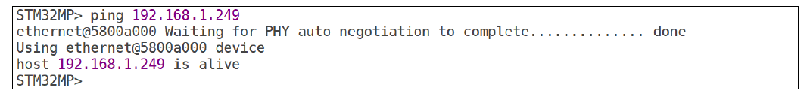
> 图：课件 Slide 18——`ping 192.168.1.249` 的输出：`Waiting for PHY auto negotiation to complete......... done` 后 `host 192.168.1.249 is alive`。（课件 IP 是它的路由器环境，我们打自己的 `192.168.0.100`。）

`is alive` = 物理链路、MAC、IP、子网掩码四件事全部就位。注意 ping 只有板子打服务器这一个方向，服务器 ping 板子无响应（U-Boot 不回 ICMP echo），这不是故障。

> **先读步骤 3 再判成败**：本篇里 `192.168.0.100` 的含义会变——**桥接配好之前它是 Windows 那块网卡，配好之后它是 Ubuntu 虚拟机**。所以这一步 ping 通，只证明"板子到这根网线的另一头"通，不证明服务器在线；真正的判据是步骤 4 那条 `Bytes transferred = 7546640`。若你在步骤 3 之后重跑这一步，ping 到的就是虚拟机了（虚拟机防火墙默认不拦 ICMP）。

**实际执行结果**（2026-09-22 实测）：`ping 192.168.0.100` 回 `host 192.168.0.100 is alive`——注意这一刻 `192.168.0.100` 还是 Windows 那块 ASIX 网卡的地址（步骤 3 之后它才归虚拟机），所以这条只证明"板子到网线另一头"通，服务器在线与否要等步骤 4 才算数。截图残影见步骤 2 实测那张图的顶行。

**关联后续实验**：`ping` 是本系列唯一的"分层探针"——以后 `tftp` 卡住时，先用它判断断在哪一层（板子→网线→服务器），再决定查防火墙还是查服务。实验十六手动起内核那一段排障全靠这个顺序。

### 步骤 2：设定 serverip 并保存

课件 4.3 节 Slide 16 那组网络变量例子，在实验十二只做了"print 复核"，本篇落地真正要用的那条——`192.168.0.100` 指的就是步骤 3 那台 Ubuntu 服务器：

```
STM32MP> setenv serverip 192.168.0.100
STM32MP> saveenv
STM32MP> print serverip
```

`saveenv` 后应见实验九同款两条：`Writing to MMC(0)... OK` + `Writing to redundant MMC(0)... OK`（主副本 + 冗余副本）。`serverip` 从此存盘——后续实验篇篇依赖它，设一次管到底。

**实际执行结果**（2026-09-22 实测）：

```
STM32MP> setenv serverip 192.168.0.100
STM32MP> saveenv
Saving Environment to MMC... Writing to redundant MMC(0)... OK
STM32MP> print serverip
serverip=192.168.0.100
```

出厂默认的 `192.168.1.1` 就此被覆盖（实验十二步骤 7 实测到的那个值）。`saveenv` 这次打的是 `Writing to redundant MMC(0)`——冗余副本那份；主副本在实验十二步骤 4/5 已经刷过，两条打印都见过才算两份副本都是新值。

**关联后续实验**：`serverip` 是"设一次管到底"的变量——实验十五要用 `tftp c0000000 uImage` 下载后再 `ext4write` 写进 eMMC、实验十六要用它下内核和设备树手动 `bootm`，两篇都不再设这个变量；哪天换服务器（比如换回 Windows 或换网段），第一个要改的就是它。

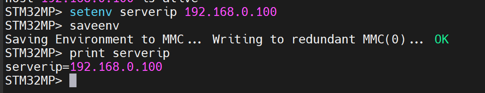
> 图：实测串口——`setenv serverip 192.168.0.100` → `saveenv` → `print serverip` 回 `serverip=192.168.0.100`；截图最上面那行残影 `host 192.168.0.100 is alive` 正是步骤 1 的 ping 结果。

### 步骤 3：Ubuntu 侧搭建 TFTP 服务器（tftpd-hpa，提前做完课件 5.5 节）

本节全部在**虚拟机 Ubuntu** 里做（串口先放一放）。因为这台虚拟机是"三块网卡并存"（见③的说明表），改桥接不影响上网，所以步骤顺序不必刻意讲究——先装包、后加卡，或反过来都行。

**① 装 TFTP 服务（与课件 5.5 节第 1 步一致）**

apt 走的是那块 NAT 网卡（网卡 2），全程在线：

```bash
sudo apt install tftpd-hpa     # 服务端
sudo apt install tftp-hpa      # 客户端（本机自测用）
```

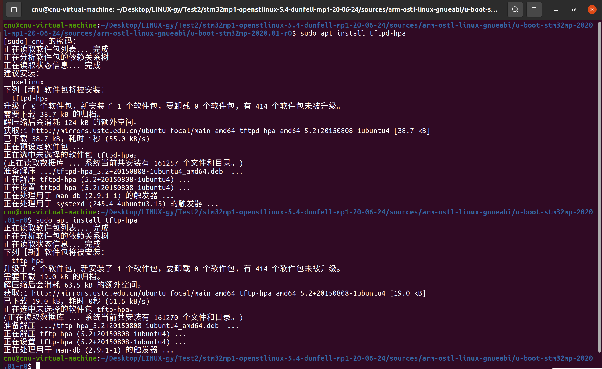
> 图：实测——`sudo apt install tftpd-hpa` 与 `sudo apt install tftp-hpa` 两条各装一个包，版本都是 `5.2+20150808-1ubuntu4`（服务端 38.7 kB、客户端 19.0 kB，从 `mirrors.ustc.edu.cn` 拉），全程走那块 NAT 网卡，说明"加桥接卡不影响上网"这句话是真的。

**② 建工作目录（课件 5.5 第 2 步）**

```bash
mkdir -p /home/cnu/tftpboot
sudo chmod 777 /home/cnu/tftpboot
```

`777` 是课件原样写法——TFTP 匿名传输没有账号体系，目录不可写就会报 `Permission denied`（Slide 21 那个错正是这件事）。

**关联后续实验**：目录名 `/home/cnu/tftpboot` 与第 6 章那套 NFS 目录 `/home/cnu/nfsboot/rfs`（课件 6 章原文）是同一路数的"服务器侧导出目录"，届时再建一个平行目录、不动这个；两个目录的权限问题都会以 `Permission denied` 的形式出现，排查手法一样（`ls -ld` 看目录、`ls -l` 看文件）。

**③ Windows 侧让位 + VMware 桥接**

> **出处**：本步骤里"控制面板 → 网络连接 → 网卡属性 → IPv4 手动"这套路径，以及**「不要填 Gateway」**这条纪律，都来自课程资料《1. 开发环境搭建-Linux系统安装-V4.docx》（第 86 行给 Windows 侧 VMnet1 填 `192.168.56.10`、第 138 行明写"注意不要填 Gateway，以免外网流量通过网卡 1 转发"）。**"把 ASIX 从 `.100` 改成 `.99` 让位"这一步是我们自己 IP 规划引出的**——课件环境里服务器是路由器后面的一台 Ubuntu（`192.168.1.249`），没有"宿主机网卡抢地址"这个问题，所以课件里没有对应步骤。

先改宿主机：控制面板 → 网络连接 → **接板子那块网卡** → 属性 → IPv4 → 手动改为 `192.168.0.99`、掩码 `255.255.255.0`、网关留空。

> **认准是哪块卡再动手**。这台机器上有**两块 USB 网卡**，Windows 显示的"以太网 N"只是会变编号的别名，**要看驱动描述那一列**：接板子的是 `ASIX USB to Gigabit Ethernet Family Adapter`；另一块 `Realtek USB 2.5GbE Family Controller` 是插校园网线、上外网用的（DHCP，地址形如 `10.253.x.x`），千万别动。实测踩过：照着"以太网 7"这个编号去改，改到了 Realtek 那块上，Windows 外网当场断掉。改完在 cmd 里敲 `ipconfig` 复核——`192.168.0.99` 要挂在描述为 ASIX 的那块下面。
>
> **原来它是 `192.168.0.100`，这一步之后 100 归虚拟机**——本篇起，"PC = 192.168.0.100"这句老话作废，100 是服务器（Ubuntu），99 才是 Windows。

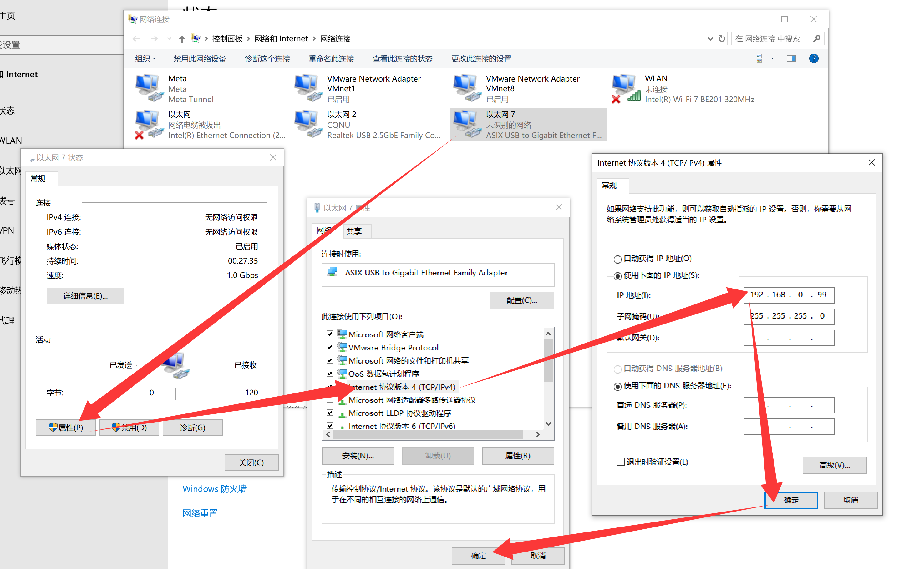
> 图：实测——「控制面板 → 网络连接」里这台机器的网卡全景，**两块 USB 网卡并排可见**：`以太网 2`（描述 `Realtek USB 2.5GbE Family Controller`，插校园网线、上外网）与 `以太网 7`（描述 `ASIX USB to Gigabit Ethernet Family Adapter`，接开发板，状态"未识别的网络"属正常，这条链路上没有 DHCP）。右半是操作路径：选中 ASIX 那块 → 状态窗口「属性(P)」→ 「Internet 协议版本 4 (TCP/IPv4)」→ 属性 → 使用下面的 IP 地址：`192.168.0.99` / `255.255.255.0`、**默认网关与 DNS 全部留空** → 两次确定。**认准描述里的 ASIX，别认"以太网 7"这个编号。**

这台虚拟机按《1. 开发环境搭建-Linux系统安装》配的**两块网卡**是这样的（IP 也照那份文档走的 `192.168.56.x`）：

| 现有网卡 | 模式 | 实际用途 | 本篇怎么处理 |
|---|---|---|---|
| 网卡 1 | **仅主机模式 VMnet1**（`192.168.56.0/24`；Ubuntu = `.101`，Windows 侧 VMnet1 = `.10`） | Windows 与 Ubuntu 互访：`\\192.168.56.101` 映射网络驱动器（你那几个 Z: 盘就是这么来的）、Samba 传文件 | **原样不动** |
| 网卡 2 | **NAT（VMnet8）** | Ubuntu 上外网、apt 装包 | **原样不动** |

关键问题就在这：**这两块卡都到不了板子**。仅主机模式只在 Windows 内部那条虚拟网段里打转，物理网卡不在其中；NAT 是"只出不进"，外面的设备（板子）主动连不进来。而本篇要的是**板子主动来敲 Ubuntu 的门**（tftp 取文件），所以必须**再添加第三块网卡做桥接**——不是把哪块改掉，是加一块，原有的共享与上网全不受影响，也就不存在"来回改配置"。

| 本篇新增 | 模式 | 用途 |
|---|---|---|
| 网卡 3 | **桥接 VMnet0 → 手动指定那块 ASIX USB 网卡**，静态 `192.168.0.100`、**网关与 DNS 留空** | 只跟板子说话；本篇起所有 tftp / 网络启动实验走它 |

（那份环境文档里确实写着"如果有桥接模式的网卡，将其删除"——那是**装 Ubuntu 阶段**的要求：安装时断网能快很多、也不希望有别的网络路径干扰。到第 4 章做网络实验，桥接是绕不开的：课件演示的服务器 `192.168.1.249` 能被板子访问，本身就在桥接/局域网这一侧。所以本篇加第三块卡与那份文档不冲突，装完系统之后再加。）

顺带把我上一轮说错的一句更正：VMware Tools 的"共享文件夹"（Ubuntu 里 `~/Desktop/LINUX-gy` 那类挂载）确实与网卡无关；但**《开发环境搭建》文档里那套"映射网络驱动器"（Win+R 输 `\\192.168.56.101` → 网络硬盘）是走网卡 1 的 Samba**，它吃网络。所以网卡 1 千万别动，动了 Z: 盘会掉。

还有一点那份文档已经提醒过、这里同样适用：**给新网卡配 IP 时不要填网关**——原文写的是"注意不要填 Gateway，以免外网流量通过网卡 1 转发"。Ubuntu 只认一条默认路由，我们这条桥接链路又不通外网，填了网关就会把 apt 和浏览器带偏，症状是"配完 IP 反而上不了网"。配完敲 `ip route` 复核：`default via` 那一行应该仍走网卡 2 的 NAT 网段。

再加桥接这一环（VMware Workstation 一台虚拟机最多可挂 4 块网卡，加第三块没压力）。**要不要关客户机？**网络适配器是支持热插拔的设备，虚拟机开着也能添加或改模式，加完 Ubuntu 里 `ip link` 会立刻冒出新接口；但**建议先 `sudo poweroff` 彻底关机再做**（挂起不算），两个理由：一是热插拔后 NetworkManager 会给新设备另建一份连接配置，运行时改来改去容易和现有连接混在一起——本篇后面全靠"哪块卡有哪个地址"来认卡，干净些省得回头查自己；二是改虚拟网络编辑器（VMnet0 桥到哪块物理卡、VMnet1 的勾选）时 VMware 会重启虚拟网络服务，运行中的虚拟机网络会瞬断，正在跑的 apt/tftp 可能莫名其妙失败一次，白白多一个可疑因素。

操作：菜单「虚拟机 → 设置 → 添加 → 网络适配器」，选中新出现的「网络适配器 3」，右侧网络连接选「**自定义(U)：特定虚拟网络**」，下拉里指定 **`VMnet0 (桥接模式)`** → 勾上「启动时连接(O)」→ **点「确定」保存**。

三个容易错的点：

- 下拉里**别选成 `VMnet1 (仅主机模式)` 或 `VMnet8 (NAT 模式)`**——前面那次把 VMnet1 主机适配器搞消失，就是从这种"以为在改第三块、其实选中了别的行"的误操作来的。选「桥接模式(B)：直接连接物理网络」与「自定义 → VMnet0」是等价的（桥接就是绑 VMnet0），但显式选 VMnet0 更不容易看错。
- 硬件列表里那行摘要若显示「桥接模式（**自动**）」，说明 VMnet0 的"桥接至"还是自动选物理网卡——这才是会挑到无线/Realtek 的坑，靠③下一步（虚拟网络编辑器里手动指定 ASIX）解决，不是在虚拟机设置里解决。
- **改完必须点「确定」才落盘**。验证办法（关机状态下用记事本打开虚拟机的 `.vmx`，或在 Linux 里 `grep ethernet *.vmx`）：应多出 `ethernet2.present = "TRUE"` 与 `ethernet2.connectionType = "custom"` + `ethernet2.vnet = "VMnet0"`（或 `connectionType = "bridged"`）。**只有 `.vmx` 里出现了 ethernet2，Ubuntu 开机才会多出第三块卡**；图形界面里看着加了但没确定，客户机里是查不到的。

同时确认原有两块没被顺手改动：网卡 1 = 仅主机 VMnet1、网卡 2 = NAT（它们在本机 `.vmx` 里是 `ethernet0.connectionType = "hostonly"`、`ethernet1.connectionType = "nat"`，PCI 插槽号 33/37 也就是 Ubuntu 里 `ens33`/`ens37` 这两个名字的来历）。

然后配 VMnet0 到底桥在哪块物理网卡上：菜单「编辑 → 虚拟网络编辑器」→ 右下角「更改设置」（VMware 要以管理员身份运行，否则这个按钮点不动）→ 选中 **VMnet0（桥接模式）** → 下方「桥接至」把默认的「自动」改成**手动指定那块 ASIX 网卡**——**认驱动描述 `ASIX USB to Gigabit Ethernet Family Adapter`，别认"以太网 7"这种会变编号的显示名**。"自动"会挑一块它认为活着的网卡，很容易挑到无线或那块 Realtek 上，那是本篇最难查的一种翻车。改完「应用」（VMware 会重启虚拟网络服务，瞬时断一下网属正常）。

> **同一处界面上还有两处不能错**（本篇实测就在这上面摔过一次）：一是 **VMnet1 那一行的类型必须保持「仅主机模式」**，二是选中它时「**将主机虚拟适配器连接到此网络**」和「**使用本地 DHCP 服务将 IP 地址分配给虚拟机**」两个勾都要在。当时 VMnet1 被改成了"桥接模式"、两个勾也没了，后果是：仅主机网段整个消失 → Windows 那块 `VMware Network Adapter VMnet1` **设备实例被删除**（不是断开、不是禁用，`Get-NetAdapter` 连隐藏设备都查不到，但 `vmnet*.sys` 驱动文件都还在，所以**不用重装 VMware**）→ `\\192.168.56.101` 映射的网络硬盘当场掉线、两端互相 ping 都报"目标主机不可达"，而且**跟 VMware 主程序开没开无关**。修复：把 VMnet1 改回"仅主机模式"、勾上那两个勾、子网填回 `192.168.56.0`；要是列表里连 VMnet0 那一行都不见了（只剩 VMnet1/VMnet8），直接点左下角「**还原默认设置(R)**」重建三件套。勾回后 VMware 会重建该适配器，但给的地址是 `192.168.56.1`（它本就是该网段的网关），而《开发环境搭建》文档要求填 `192.168.56.10`——同网段都能通，不必来回折腾，只是别误以为配错了。

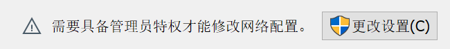
> 图：实测——虚拟网络编辑器右下角的提示条「需要具备管理员特权才能修改网络配置。」与「更改设置(C)」按钮。**不点这个盾牌按钮，下面所有单选框、勾选框、子网栏都是灰的**，改了也不会保存（本篇那次"点了应用没生效"就是卡在这里）。

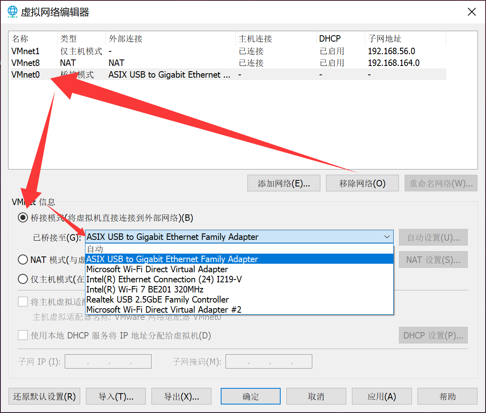
> 图：实测（提权后）——列表三行分别是 `VMnet1 仅主机模式`（主机连接"已连接"、DHCP"已启用"、子网 `192.168.56.0`）、`VMnet8 NAT`（子网 `192.168.164.0`）、`VMnet0 桥接模式`（外部连接显示那块 ASIX，子网栏为 `-`，因为桥接没有虚拟子网）。下方选中 VMnet0、「桥接模式(将虚拟机直接连接到外部网络)」已选，「已桥接至(G)」下拉里高亮 **`ASIX USB to Gigabit Ethernet Family Adapter`**——下拉同时列出 `自动`、`Microsoft Wi-Fi Direct Virtual Adapter`、`Intel(R) Ethernet Connection (24) I219-V`、`Intel(R) Wi-Fi 7 BE201 320MHz`、`Realtek USB 2.5GbE Family Controller` 等，**选错任何一条，板子都会连不进来**，这就是"桥接至"必须手动指定的原因。

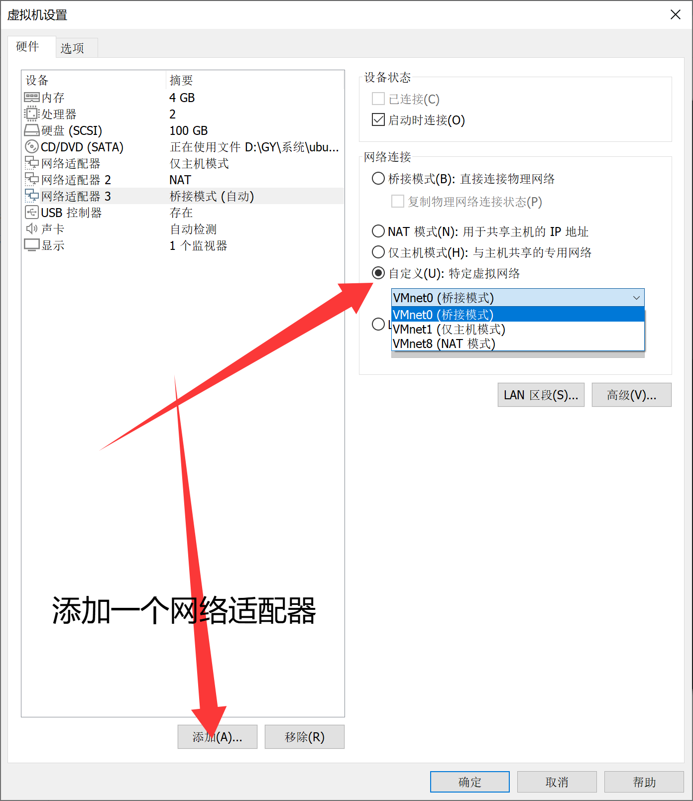
> 图：实测——「虚拟机 → 设置 → 硬件」列表底部「添加(A)...」加出来的**「网络适配器 3」**（摘要"桥接模式（自动）"），右侧网络连接选**「自定义(U)：特定虚拟网络」**、下拉指定 **`VMnet0 (桥接模式)`**，并勾上「启动时连接(O)」。下拉里另外两项 `VMnet1 (仅主机模式)`、`VMnet8 (NAT 模式)` 千万别选。上面两行「网络适配器」（仅主机模式）与「网络适配器 2」（NAT）保持原样不动。**加完必须点「确定」才会写进配置文件。**

**④ 给网卡 3 配静态 IP `192.168.0.100`**

> **静态 IP 在客户机里面配，不在虚拟网络编辑器里配。**桥接这一行（VMnet0）下方的"子网 IP / 子网掩码"**是灰的、改不动——这是正常现象**：VMware 只为"仅主机 VMnet1"和"NAT VMnet8"维护虚拟子网和自带的 DHCP，桥接则是把虚拟机直接挂到物理链路上，地址完全由这条链路自己的规划决定（我们的规划就是 `192.168.0.0/24`：板子 `.8`、Ubuntu `.100`、Windows `.99`）。所以在编辑器里只做一件事——把"桥接至"指定到那块 ASIX 网卡；IP 到 Ubuntu 里填（见④的截图）。

三块卡在 Ubuntu 里的名字是 `ens33`、`ens37` 这样按插槽来的编号（本机实测：`ens33` = 仅主机、`ens37` = NAT，新加的桥接卡会是另一个号），**别照名字猜，照地址认**：

```bash
ip -4 addr show
nmcli device status
```

按你这套配置，判据很清楚：带 `192.168.56.101` 的是网卡 1（仅主机，动它 Z: 盘会掉）；带 `192.168.164.x` 之类 DHCP 地址的是网卡 2（NAT，你机器上 Windows 侧那块 VMnet8 就是 `192.168.164.1`，所以虚拟机通常落在 `192.168.164.x`，以实际为准）；**新出现、还没有任何地址的那块就是网卡 3**。

给网卡 3 配静态：设置 → 网络 → 对应连接 → IPv4 → 手动，地址 `192.168.0.100`、掩码 `255.255.255.0`、**网关与 DNS 都留空**（理由见③最后一段），保存后把该网卡关掉再打开一次生效。

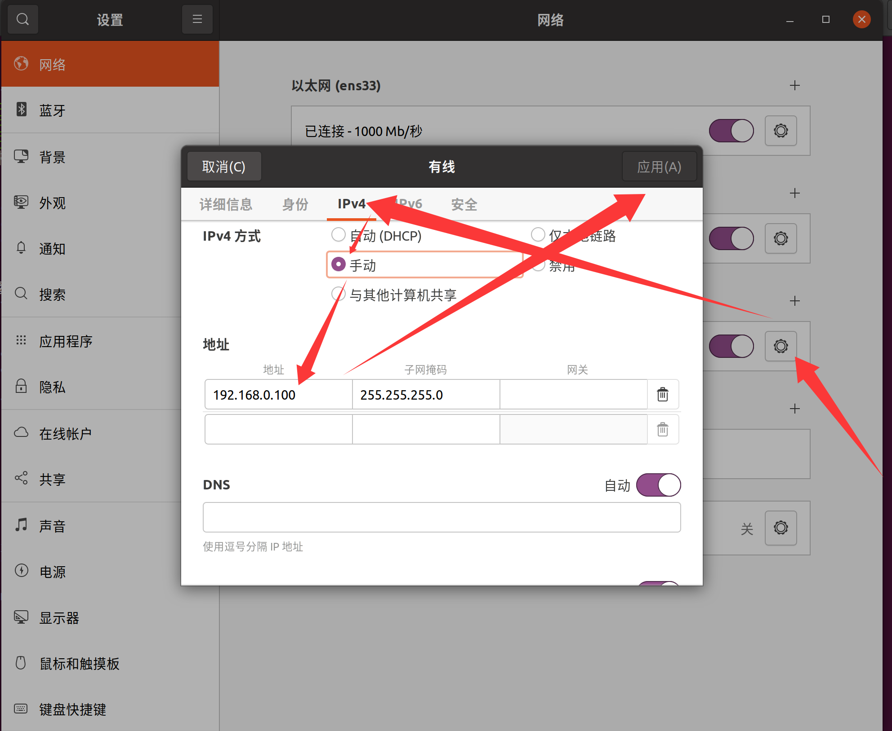
> 图：实测——GNOME「设置 → 网络」里给新桥接卡配静态的完整点位：列表右侧那一列**齿轮图标**进入对应连接 → 弹窗选 **IPv4** 页 → 「IPv4 方式」选**手动** → 地址栏填 `192.168.0.100`、子网掩码 `255.255.255.0`、**网关那一格留空** → 右上「应用(A)」。三块卡在列表里都显示"已连接 - 1000 Mb/秒"（链路速率能读到 1000M，也侧面说明物理链路起来了）。**注意齿轮要点对行**——三条连接只有新加的那条要改，动错行就是把网卡 1 或网卡 2 的地址改掉（Z: 盘或 apt 立刻出问题）。

不爱点图形界面的等价命令（**连接名以 `nmcli connection show` 的实际输出为准**——本机新加的那块叫中文的「有线连接 1」，英文系统下才可能是 `Wired connection 3`，别照抄）：

```bash
sudo nmcli connection modify "有线连接 1" \
     ipv4.method manual ipv4.addresses 192.168.0.100/24 \
     ipv4.gateway "" ipv4.dns "" connection.autoconnect yes
sudo nmcli connection up "有线连接 1"
```

> 别去改 `/etc/netplan/`：桌面版 Ubuntu 的网络由 NetworkManager 接管，netplan 和它两套配置同时生效时会互相打架，出现"改了不生效 / 重启后地址丢了"这类更难查的现象。netplan 是无桌面的服务器版才用的路子。

复核并顺手验一遍二层通了：

```bash
ip -4 addr show            # 网卡 3 上应出现 192.168.0.100
ping -c 3 192.168.0.99     # 打 Windows 宿主，通 = 桥接成功
ip route                   # default via 仍应指向网卡 2 的 NAT 网段
```

`ping 192.168.0.99` 不通就别往下走了，回头查 ③（十有八九是 VMnet0 桥错了物理网卡，或 Windows 那块 ASIX 网卡被禁用/没插网线）。要是三块卡实在分不清，用一锤定音的办法：`sudo tcpdump -i ens35 -n`（换着试），同时在板子上敲 `ping 192.168.0.100`——**能刷出板子 ARP 请求的那块卡就是网卡 3**，同时也顺带证明了板子到虚拟机的链路已经通。

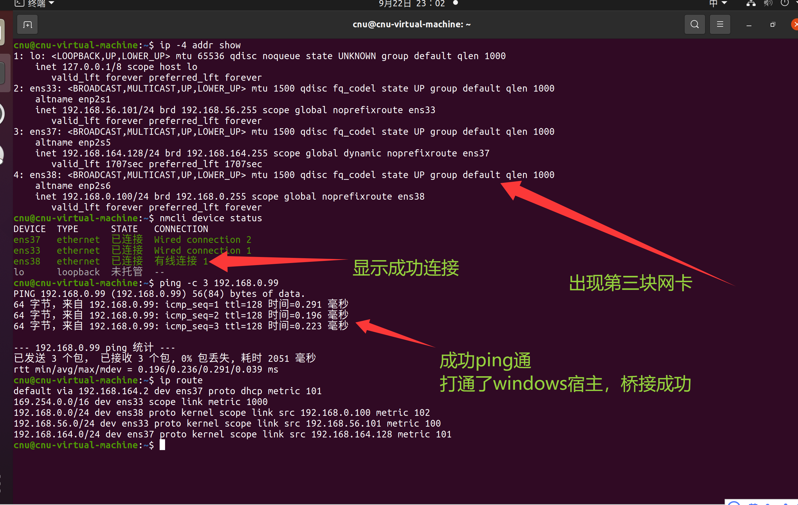
> 图：实测（④ 完成后）——`ip -4 addr show` 里第四项 `ens38` 已拿到 `192.168.0.100/24`（绿框处）；`nmcli device status` 三块卡全部"已连接"，`ens38` 对应的连接名是中文的**「有线连接 1」**；`ping -c 3 192.168.0.99` 三个包 0% 丢失、`ttl=128`（Windows 的特征值）→ 桥接成功、虚拟机已经挂在这根网线的另一头；末尾 `ip route` 的 `default via 192.168.164.2 dev ens37` 说明默认路由仍在 NAT 卡上，没被桥接卡带偏。

**⑤ 配置并启动服务（课件 5.5 第 3、4 步）**

```bash
sudo nano /etc/default/tftpd-hpa
```

按课件改成四行：

```
TFTP_USERNAME="tftp"
TFTP_DIRECTORY="/home/cnu/tftpboot"
TFTP_ADDRESS=":69"
TFTP_OPTIONS="-l -c -s"
```

`TFTP_DIRECTORY` 必须与②建的目录一字不差；`TFTP_ADDRESS` 必须是 69；`TFTP_OPTIONS` 三个字母的含义（课件原文）：`-c` 允许新建文件、`-s` 把根目录锁死在 `TFTP_DIRECTORY`（所以板子只能按文件名取该目录内的文件，给不了绝对路径）、`-l` 以独立服务模式运行而非挂在 inetd 下。

**关联后续实验**：`-c` 这个字母现在看着没用，**实验十五**要用 TFTP 把文件下载进内存再 `ext4write` 写进 eMMC（那条不经过 TFTP 上传，所以暂时用不上），但**第 6 章**做根文件系统时常见玩法是"板子把日志/文件传回服务器"——那时没有 `-c` 就会被拒。`-s` 则解释了为什么本篇命令里只写文件名 `uImage`、不写路径：TFTP 协议本身也没有目录概念，`-s` 只是把根钉死。**别嫌这三个字母罗嗦，将来卡住的就是它们。** 然后：

```bash
sudo service tftpd-hpa restart
sudo service tftpd-hpa status      # Active: active (running)
```

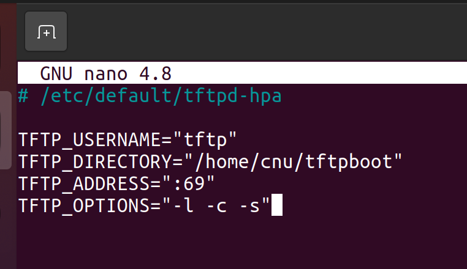
> 图：实测——`sudo nano /etc/default/tftpd-hpa`（GNU nano 4.8）改成的四行，与课件 5.5 第 3 步截图逐字一致：`TFTP_USERNAME="tftp"`、`TFTP_DIRECTORY="/home/cnu/tftpboot"`、`TFTP_ADDRESS=":69"`、`TFTP_OPTIONS="-l -c -s"`。

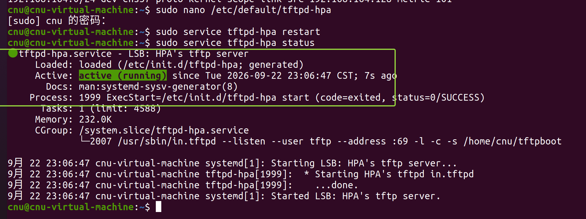
> 图：实测——`sudo service tftpd-hpa restart` 后 `status` 的输出：`Active: active (running) since Tue 2026-09-22 23:06:47 CST`，日志四行 `Starting LSB: HPA's tftp server` → `* Starting HPA's tftpd in.tftpd` → `...done.` → `Started LSB: HPA's tftp server.`。最有力的一行是进程树里那条：`/usr/sbin/in.tftpd --listen --user tftp --address :69 -l -c -s /home/cnu/tftpboot`——**配置文件里的四个值原样出现在运行命令行上**，等于当场验收：`--listen`=`-l`、`--address :69`、`-c`、`-s`、根目录 `/home/cnu/tftpboot`，一个都没漏。

**⑥ 放文件 + 本机自测（课件 5.5 第 5 步）**

**测试文件从哪来**：资料包里的 `官方系统内核和设备树.zip`，解压后**有且只有两个文件**——`uImage`（7,546,640 字节）与 `stm32mp157a-fsmp1a-mipi050.dtb`（71,805 字节）。本篇只要 `uImage`，那份 dtb 留着实验十六用。

**传递路径就两步**：把解压出来的文件放进**共享目录**（就是虚拟机里平时能看到宿主机文件的那个目录），再从共享目录 `cp` 进 TFTP 根目录：

```bash
cd ~/Desktop/LINUX-gy/Test2/官方系统内核和设备树      # 解压后放进共享目录的位置
ls -l                                               # 应看到 uImage 与 dtb 两个文件
cp uImage /home/cnu/tftpboot/
ls -l /home/cnu/tftpboot                            # 大小 7546640
```

> **`cp` 之后这一步 `ls -l` 不是走过场，必须看权限列**。本篇实测就栽在这里：从共享目录 `cp` 过来的文件权限是 `-rwx------`（700，只有 cnu 自己能读写），而 tftpd 是以 `--user tftp` 这个**另一个用户**的身份去读文件的——目录 777 也没用，文件本身对它不可读，于是本机自测直接吃 `Error code 0: Permission denied`。补一条 `chmod 644` 就好：
>
> ```bash
> chmod 644 /home/cnu/tftpboot/uImage
> ls -l /home/cnu/tftpboot        # 期望 -rw-r--r-- 1 cnu cnu 7546640 ...
> ```

放好文件，先在虚拟机自己身上打一发，确认服务活着（`-s` 之下只写文件名即可）：

```bash
cd /tmp
tftp 127.0.0.1
tftp> get uImage
tftp> q
ls -l /tmp/uImage               # 7546640 = 本机自测通过
```

> **另一个坑，藏在 `ls -l /tmp/uImage` 里**：`get` 失败时 tftp 往往**已经先把目标文件创建出来了**，留下一个 **0 字节**的 `uImage`。只看"文件在不在"会误判成功，必须看大小那一列；重测前先把这个空壳 `rm /tmp/uImage` 删掉，免得下次又对着一个 0 字节文件发愣。（本机自测的完整命令行见步骤 3 末尾的「实际执行结果」。）

本机自测通过、板子却拉不动，问题就只剩网络与防火墙（`sudo ufw status`，Ubuntu 桌面版默认 inactive；若是 active 需 `sudo ufw allow 69/udp`）；**如果板子那侧连链路都起不来，先看第六节坑 8（PHY 灯不亮）**。

**这一步"先本机自测"的习惯是买命的**：它把"服务活着吗"和"网络通吗"一刀切成两段——本篇搭服务器卡了一晚上，真正值钱的每一条命令都是这种"只证明一件事"的命令。**关联后续实验**：实验十六手动起内核要一次下载两个文件（内核 + dtb），届时同样先在服务器上 `ls -l` 对字节数、再本机 `tftp 127.0.0.1` 各取一次，最后才让板子上场，排障成本能省一半。

服务保持运行，步骤 4 就让它直接对板子干活。

**实际执行结果**（2026-09-22 实测，①~⑤ 完成）：

刚加好网卡 3 时，它卡在"获取 IP 配置"——桥接链路已经通到物理口（拿得到链路层信号才会有这个状态），但这条网线上没有 DHCP 服务器，等不到地址：

```
cnu@cnu-virtual-machine:~$ nmcli device status
DEVICE  TYPE      STATE                       CONNECTION
ens37   ethernet  已连接                      Wired connection 2
ens33   ethernet  已连接                      Wired connection 1
ens38   ethernet  连接中（正在获取 IP 配置）  有线连接 1
```

按 ④ 填完静态地址后，三块卡各就各位（注意它的连接名是中文的**「有线连接 1」**，`nmcli` 里要用这个名字，别照抄英文示例）：

```
cnu@cnu-virtual-machine:~$ ip -4 addr show
2: ens33: <BROADCAST,MULTICAST,UP,LOWER_UP> mtu 1500 ... state UP
    inet 192.168.56.101/24 brd 192.168.56.255 scope global noprefixroute ens33
3: ens37: <BROADCAST,MULTICAST,UP,LOWER_UP> mtu 1500 ... state UP
    inet 192.168.164.128/24 brd 192.168.164.255 scope global dynamic noprefixroute ens37
4: ens38: <BROADCAST,MULTICAST,UP,LOWER_UP> mtu 1500 ... state UP
    inet 192.168.0.100/24 brd 192.168.0.255 scope global noprefixroute ens38

cnu@cnu-virtual-machine:~$ ping -c 3 192.168.0.99
64 字节，来自 192.168.0.99: icmp_seq=1 ttl=128 时间=0.291 毫秒
64 字节，来自 192.168.0.99: icmp_seq=2 ttl=128 时间=0.196 毫秒
64 字节，来自 192.168.0.99: icmp_seq=3 ttl=128 时间=0.223 毫秒
已发送 3 个包，已接收 3 个包, 0% 包丢失, 耗时 2051 毫秒

cnu@cnu-virtual-machine:~$ ip route
default via 192.168.164.2 dev ens37 proto dhcp metric 101
169.254.0.0/16 dev ens33 scope link metric 1000
192.168.0.0/24 dev ens38 proto kernel scope link src 192.168.0.100 metric 102
192.168.56.0/24 dev ens33 proto kernel scope link src 192.168.56.101 metric 100
192.168.164.0/24 dev ens37 proto kernel scope link src 192.168.164.128 metric 101
```

三处判读，一处都不能省：

- **`ens38` 拿到 `192.168.0.100/24`**：服务器地址就位，板子的 `serverip` 从此有了对应的主机。
- **`ping 192.168.0.99` 三个包 0% 丢失、`ttl=128`**：`ttl=128` 是 Windows 的特征值，说明这一跳打到的确实是宿主上那块 ASIX 网卡——**桥接成功，虚拟机已经"挂"在这根网线的另一头**；往返 0.2 ms 也是直连的量级。
- **`ip route` 里 `default via 192.168.164.2 dev ens37`**：默认路由仍走 NAT 那块，桥接卡只带一条 `192.168.0.0/24` 的直连路由、没有网关——③ 里"别填网关"那条纪律兑现了，apt 和浏览器不受影响。

设备名的来历也顺便清楚了：`ens33`/`ens37`/`ens38` 取自 PCI 插槽号（`altname enp2s1`/`enp2s5`/`enp2s6` 是同一件事的另一种写法），配置文件 `Ubuntu20-install.vmx` 里三块网卡依次是 `ethernet0.connectionType = "hostonly"`、`ethernet1.connectionType = "nat"`、`ethernet2.connectionType = "custom"` + `ethernet2.vnet = "VMnet0"`——**看到 `ethernet2` 这几行在文件里，才算真的加上了网卡**（图形界面里点了「添加」但没点「确定」，客户机里是查不到的，实测踩过）。

⑤ 配置与启动服务的实测（`nano` 四行、`restart` 后 `status` 的完整回显）见本节上面两张图；这里补一段纯文本，方便日后 grep 对照：

```
cnu@cnu-virtual-machine:~$ sudo service tftpd-hpa restart
cnu@cnu-virtual-machine:~$ sudo service tftpd-hpa status
● tftpd-hpa.service - LSB: HPA's tftp server
     Active: active (running) since Tue 2026-09-22 23:06:47 CST; 7s ago
     Process: 1999 ExecStart=/etc/init.d/tftpd-hpa start (code=exited, status=0/SUCCESS)
      Memory: 232.0K
             └─2007 /usr/sbin/in.tftpd --listen --user tftp --address :69 -l -c -s /home/cnu/tftpboot
9月 22 23:06:47 cnu-virtual-machine systemd[1]: Starting LSB: HPA's tftp server...
9月 22 23:06:47 cnu-virtual-machine tftpd-hpa[1999]:  * Starting HPA's tftpd in.tftpd
9月 22 23:06:47 cnu-virtual-machine tftpd-hpa[1999]:    ...done.
9月 22 23:06:47 cnu-virtual-machine systemd[1]: Started LSB: HPA's tftp server.
```

⑥ 首次自测**没有通过**，卡在了文件权限上（完整现场与修法见第六节坑 7）：

```
cnu@cnu-virtual-machine:~$ ls -l /home/cnu/tftpboot
总用量 7372
-rwx------ 1 cnu cnu 7546640 9月  23 00:19 uImage      ← 700，tftpd（--user tftp）读不到

cnu@cnu-virtual-machine:/tmp$ tftp 127.0.0.1
tftp> get uImage
Error code 0: Permission denied
tftp> q
cnu@cnu-virtual-machine:/tmp$ ls -l /tmp/uImage
-rw-rw-r-- 1 cnu cnu 0 9月  23 20:36 /tmp/uImage       ← 失败也建了文件，0 字节
```

`chmod 644` 之后复测——**⑥ 通过**：

```
cnu@cnu-virtual-machine:/tmp$ chmod 644 /home/cnu/tftpboot/uImage
cnu@cnu-virtual-machine:/tmp$ ls -l /home/cnu/tftpboot
总用量 7372
-rw-r--r-- 1 cnu cnu 7546640 9月  23 00:19 uImage      ← 700 变 644

cnu@cnu-virtual-machine:/tmp$ tftp 127.0.0.1
tftp> get uImage
tftp> q
cnu@cnu-virtual-machine:/tmp$ ls -l /tmp/uImage
-rw-rw-r-- 1 cnu cnu 7546640 9月  23 21:01 /tmp/uImage  ← 不再是 0 字节
```

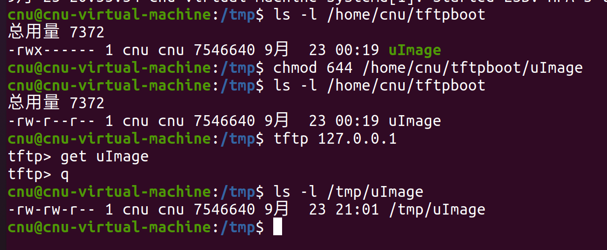
> 图：实测——同一屏把因果串起来了：`ls -l` 先显示 `-rwx------`（700）→ `chmod 644` → 再 `ls -l` 变 `-rw-r--r--` → `tftp 127.0.0.1` 里 `get uImage` **一句报错都没有** → `ls -l /tmp/uImage` 拿到 **7,546,640 字节**。tftp 客户端成功时是**沉默**的，所以判成败只能看最后那个 `ls -l` 的字节数。

至此服务器侧全部就绪（服务 active、文件可读、本机可取）。剩下的就是板子侧那一条 `tftp c2000000 uImage`（步骤 4）。

另外本篇还撞到一个链路层的怪现象：**网线插好时板子网口灯不亮，要在板子上先 `ping` 一次把 PHY 自协商跑起来，灯才亮、两侧才互通**——记在第六节坑 8，遇到"互相 ping 不通"时先按它排查，别急着怀疑 IP 与防火墙。

### 步骤 4：tftp 下载实战（Slide 20）

板子侧，把服务器上的 uImage 拉到 DRAM 的 `0xc2000000` 处（课件同款地址，第 5 章沿用）：

```
STM32MP> tftp c2000000 uImage
```

> **命令名两说**：`help` 列表里那条叫 **`tftpboot`**（`tftpboot - boot image via network using TFTP protocol`），课件写的是 `tftp`。实测两个名字**都能用**（`tftp c2000000 uImage` 一次跑通，见本节实测），所以照课件写就行；万一哪天遇到 `Unknown command 'tftp'` 的构建，改敲 `tftpboot` 即可，参数完全相同。

预期输出：

```
STM32MP> ping 192.168.0.100
ethernet@5800a000 Waiting for PHY auto negotiation to complete...... done
Using ethernet@5800a000 device
host 192.168.0.100 is alive
STM32MP> ping 192.168.0.99
Using ethernet@5800a000 device
host 192.168.0.99 is alive
STM32MP> tftp c2000000 uImage
Using ethernet@5800a000 device
TFTP from server 192.168.0.100; our IP address is 192.168.0.8
Filename 'uImage'.
Load address: 0xc2000000
Loading: #################################################################
         #################################################################
         #################################################################
         #################################################################
         #################################################################
         #################################################################
         #################################################################
         ############################################################
         1.7 MiB/s
done
Bytes transferred = 7546640 (732710 hex)
STM32MP>

```

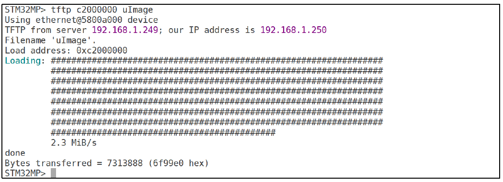
> 图：课件 Slide 20——`tftp c2000000 uImage` 下载成功的完整回显：`TFTP from server ...; our IP address is ...`、`Filename 'uImage'.`、`Load address: 0xc2000000`、进度条、`Bytes transferred = ...`。

三处对账，一处都不能错：

- `TFTP from server 192.168.0.100; our IP address is 192.168.0.8`——两个 IP 与步骤 2/实验九的设定一致；
- `Bytes transferred = 7546640`——与服务器上 `/home/cnu/tftpboot/uImage` 的大小一字不差（虚拟机里 `ls -l /home/cnu/tftpboot` 看，或在 Windows 侧看文件属性），这是"完整下载"的唯一铁证；
- `732710 hex`——就是 7,546,640 的十六进制，顺带复习"U-Boot 数值一律十六进制"。

几 MB 的文件几秒钟传完。这个 7.2 MiB 的内核镜像下载到 `0xc2000000` 之后**本篇不用管它**——实验十六会在同一地址把它点火。

**关联后续实验（这条最重要）**：本篇的三件事在第 4、5 章会被原样复用，一个都不许含糊——

1. **地址约定**：内核 `c2000000`、设备树 `c4000000`（`printenv` 里的 `kernel_addr_r`/`fdt_addr_r` 就是这两个值，见实验十二步骤 3 那屏）。实验十五改用 `c0000000` 做中转下载、实验十六用 `c2000000`+`c4000000` 下载后 `bootm c2000000 - c4000000`，第 5 章编出自己的内核后还是这一套。记混的报法是 `Wrong Image Format for bootm command`。
2. **字节数对账**：`Bytes transferred = 7546640 (732710 hex)` 必须等于服务器上 `ls -l /home/cnu/tftpboot` 的那个数。以后每下载一个新文件（自己的内核、dtb、根文件系统镜像）都先对这一行，**不对账就别往下走**——残缺文件引发的报错会出现在内核启动阶段，跟下载环节看起来毫无关系，最难查。
3. **`tftp` 依赖的三个变量**：`ipaddr`（板子）、`serverip`（服务器）、`netmask`（同网段判定）。第 5 章换网段或换服务器时，这三个一起检查，缺一个都是"卡在 `Loading:` 不动"。

**卡住/报错的排查表**：

| 现象 | 原因与解法 |
|---|---|
| `Loading:` 后光标久闪不动 / `Retry count exceeded` | 按顺序三问：① 服务器在跑吗（`sudo service tftpd-hpa status`）；② **文件读得到吗**（`ls -l /home/cnu/tftpboot` 权限列，`-rwx------` 就要 `chmod 644`，见坑 7）；③ 链路起来了吗（板子网口灯亮不亮，不亮先在板子上 `ping 192.168.0.100` 拉一次 PHY，见坑 8）。都过了再怀疑 ufw（`sudo ufw allow 69/udp`）。**最省事的分界法**：在服务器上先 `tftp 127.0.0.1` 本机自测一次——本机都取不下来就轮不到网络的事 |
| `TFTP from server 192.168.1.1` | `serverip` 忘了改（出厂默认就是这个），回步骤 2 |
| `TFTP error: 'Permission denied' (0)` | 课件 Slide 21 的场景（下图）。**本篇实测复现过一次，根因是文件权限不是目录权限**：共享目录 `cp` 过来的文件是 `-rwx------`（700），而 tftpd 以 `--user tftp` 换用户去读 → 被拒。`ls -l /home/cnu/tftpboot` 看权限列、`chmod 644` 该文件即可；详见第六节坑 7（含"失败也会留下 0 字节空壳"那个陷阱） |
| `TFTP error: 'File not found'` | 文件名大小写要对（`uImage`，TFTP 区分大小写）；`-s` 已把根锁在 `TFTP_DIRECTORY`，所以只能给该目录里的文件名，给绝对路径反而找不到 |

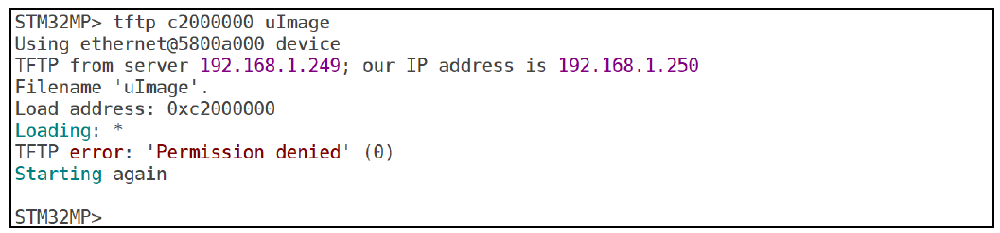
> 图：课件 Slide 21——tftp 报 `TFTP error: 'Permission denied' (0)` 后 `Starting again` 的样子。课件给出的两个可能原因：文件所在目录无 read 权限、文件本身无 read 权限，服务器上 `chmod` 解决。

**实际执行结果**（2026-09-23 实测，**本步骤达标——第 4 章第一条真正的"从网络拉文件"打通**）：

```
STM32MP> ping 192.168.0.100
ethernet@5800a000 Waiting for PHY auto negotiation to complete...... done
Using ethernet@5800a000 device
host 192.168.0.100 is alive
STM32MP> ping 192.168.0.99
Using ethernet@5800a000 device
host 192.168.0.99 is alive
STM32MP> tftp c2000000 uImage
Using ethernet@5800a000 device
TFTP from server 192.168.0.100; our IP address is 192.168.0.8
Filename 'uImage'.
Load address: 0xc2000000
Loading: #################################################################
         #################################################################
         #################################################################
         #################################################################
         #################################################################
         #################################################################
         #################################################################
         ############################################################
         1.7 MiB/s
done
Bytes transferred = 7546640 (732710 hex)
```

逐行验收，四条全过：

1. **`tftp` 这条命令名直接可用**——`help` 列表里显示的是 `tftpboot`，实测 `tftp c2000000 uImage` 一样跑通：两者是同一命令的两个名字，课件的写法在我们这版上不用改。
2. **`TFTP from server 192.168.0.100; our IP address is 192.168.0.8`**——两个地址与 `serverip`/`ipaddr` 一字不差，说明步骤 2 存的值真的被用上了（不是默认的 `192.168.1.1`）。
3. **`Bytes transferred = 7546640 (732710 hex)`**——与服务器上 `ls -l /home/cnu/tftpboot` 的字节数完全一致，`732710` 就是它的十六进制写法。这一行是本步骤唯一的硬判据。
4. **进度条与速率**：每行 65 个 `#` 是一个数据包（TFTP 块大小 1456 字节，U-Boot 每收一块打一个 `#`），八行多打完 7.2 MiB、约 4.5 秒，收尾 `1.7 MiB/s`。这个速率比后面第 5 章反复下载自己编的内核时要有心理准备——**内核越大越要等，但不会失败**；真要提速是调 `tftpblocksize`，本篇不动。

另外这次还顺手补了一个证据：`ping 192.168.0.99` 也回 `is alive`——**板子一侧同时能打到 Ubuntu（.100）和宿主机（.99）**，说明桥接是把虚拟机真正挂在了这根网线上，而不是虚拟机在偷偷做地址转换。

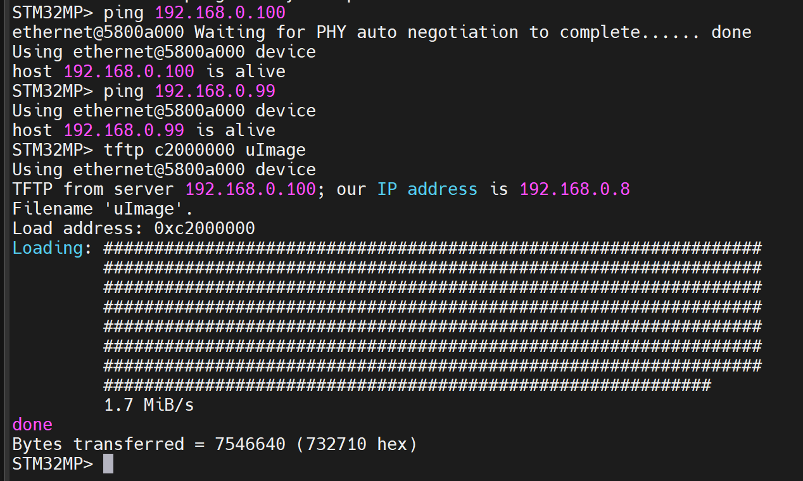
> 图：实测串口——`ping 192.168.0.100`（含 `Waiting for PHY auto negotiation to complete...... done`，即坑 8 里那次把链路拉起来的自协商）→ `ping 192.168.0.99` → `tftp c2000000 uImage` 满屏进度条、`1.7 MiB/s`、`done`、**`Bytes transferred = 7546640 (732710 hex)`**。
### 步骤 5：dhcp——知道它是干嘛的（Slide 19）

`dhcp` 的适用场景是"板子接路由器，路由器开着 DHCP 服务"：一条命令自动把 `ipaddr`、`netmask`、`gatewayip` 全拿到，省掉手工 setenv。课件截图里 `DHCP client bound to address 192.168.1.7 (787 ms)` 就是这个效果：


> 图：课件 Slide 19——`dhcp` 输出 `BOOTP broadcast 1 / 2 / 3` 后 `DHCP client bound to address 192.168.1.7 (787 ms)`，IP 是路由器分派的。

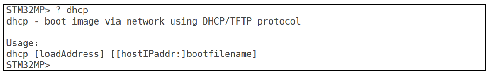
> 图：课件 Slide 19——`? dhcp` 给出的用法：`dhcp [loadAddress] [[hostIPaddr:]bootfilename]`——它本质上还能借 TFTP 顺带下载并启动内核（"boot image via network using DHCP/TFTP protocol"）。

**我们这根网线上敲 `dhcp` 会怎样**：网线那头是 Windows 网卡与桥接过去的虚拟机，这条链路上没有任何 DHCP 服务，板子会 `BOOTP broadcast 1、2、3…` 广播几轮后超时放弃退出。**这是预期行为，不是故障**——想看到课件同款的"自动分到 IP"，把板子接到开了 DHCP 的路由器下即可（拿到什么 IP 与本系列的 `192.168.0.x` 静态规划无关，实验完改回静态值即可）。本步骤敲一次、观察到广播超时、能讲清"为什么课件能拿到我们拿不到"，就达标。

**实际执行结果**（2026-09-23 实测，**本步骤达标**）：

```
STM32MP> dhcp
BOOTP broadcast 1
BOOTP broadcast 2
BOOTP broadcast 3
  ...（中略，一路到 17）
BOOTP broadcast 17

Retry time exceeded; starting again
STM32MP>
```

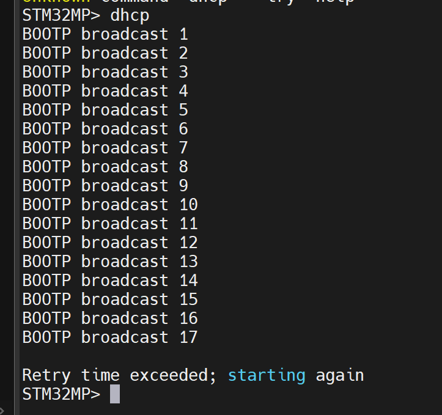
> 图：实测——`dhcp` 连发 `BOOTP broadcast 1` 到 `17` 后 `Retry time exceeded; starting again` 落回提示符。与课件 Slide 19 的 `DHCP client bound to address 192.168.1.7 (787 ms)` 正好是一体两面：课件那根线上有路由器在做 DHCP 服务器，我们这根线上只有板子和一块"没人应答"的网卡。**广播发得出去、没人回答**，就是这条链路健康但无 DHCP 服务的标准长相——所以这一步不但不是故障，反而顺手证明了 PHY 链路是通的（对比实验九那次 `No link`，那才是链路没起来）。

### 步骤 6：nfs——知道它和 tftp 的差别（Slide 22）

`nfs` 同样能把服务器上的文件下载到 DRAM，两点不同：

- 前置更重：服务器上要搭的是 **NFS 服务**（不是 TFTP，但可以是同一台 Ubuntu）；
- 命令更啰嗦：必须给出文件在服务器上的**完整路径**，课件原话"使用不太方便"：

```
STM32MP> nfs 0xc2000000 192.168.1.249:/home/zuozhongkai/linux/nfs/uImage
```


> 图：课件 Slide 22——`nfs 0xc2000000 192.168.1.249:/home/zuozhongkai/linux/nfs/uImage`：注意命令里带着服务器上的绝对路径 `/home/zuozhongkai/linux/nfs/uImage`。

本系列**本篇不搭** NFS：`tftp` 已经把"把文件从服务器弄进板子内存"这件事完全覆盖了。不过现在服务器就在 Ubuntu 里，NFS 与 TFTP 同机部署只差一个 `nfs-kernel-server`——**第 6 章做根文件系统、要用 NFS 挂载启动时就会回来搭它**（课件 6 章那套 `nfsroot=192.168.0.100:/home/cnu/nfsboot/rfs` 正需要这台服务器，届时目录换成 NFS 的导出路径即可）。本篇到此认识 `nfs` 的格式、记住它与 `tftp` 的两点差异即达标。

**实际执行结果**（2026-09-23 实测，**本步骤达标——现象与"为什么"都对上了**）：把课件那条命令原样敲进来（IP 与路径都还是课件作者环境的）：

```
STM32MP> nfs 0xc2000000 192.168.1.249:/home/zuozhongkai/linux/nfs/uImage
Using ethernet@5800a000 device
File transfer via NFS from server 192.168.1.249; our IP address is 192.168.0.8
Filename '/home/zuozhongkai/linux/nfs/uImage'.
Load address: 0xc2000000
Loading: ## Warning: gatewayip needed but not set
## Warning: gatewayip needed but not set
## Warning: gatewayip needed but not set
## Warning: gatewayip needed but not set

ARP Retry count exceeded; starting again
STM32MP>
```

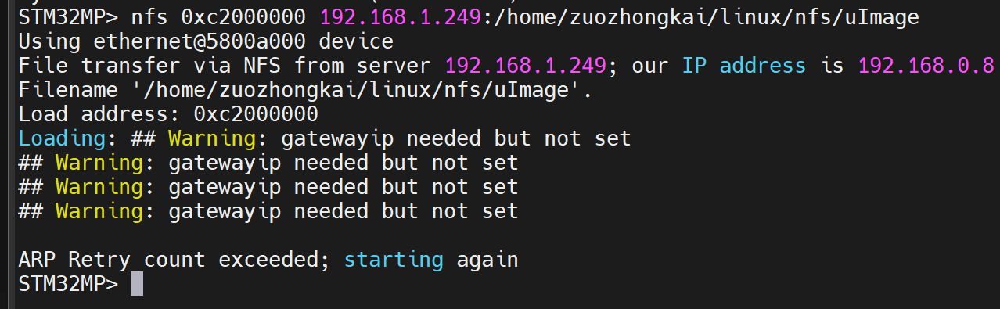
> 图：实测串口——课件原命令照敲，`File transfer via NFS from server 192.168.1.249; our IP address is 192.168.0.8` 之后连着四行 `## Warning: gatewayip needed but not set`，最后 `ARP Retry count exceeded; starting again` 落回提示符。**这不是命令坏了，是"目标在别的网段 + 我们没有网关"的必然结果。**

逐句读这三件事：

- **服务器地址来自命令本身**（`192.168.1.249`），不吃环境变量 `serverip`——`tftp` 恰恰相反，它只读 `serverip`、命令里给不了地址。这是课件说 nfs "使用不太方便"的第一层：路径要写全，地址要现给。
- **`## Warning: gatewayip needed but not set`**：`192.168.1.249` 与板子的 `192.168.0.8/24` **不在同一网段**，跨网段的包必须交给"下一跳"（网关）转发，而 `gatewayip` 是空的，U-Boot 不知道该把以太网帧发给谁。
- **`ARP Retry count exceeded`**：于是它在本地网段里广播 ARP 去找那个"下一跳"，四无人应，重试耗尽放弃。
- 对照：**步骤 4 的 `tftp` 为什么没有这两句？** 因为 `serverip 192.168.0.100` 与板子同网段，直接 ARP 对方 MAC 就能送达，压根用不着网关。

**三条出路，按需选**：

| 想干什么 | 怎么做 |
|---|---|
| 本篇"认识格式"（当前目标） | 到这儿就够：能讲清两句警告的成因即达标 |
| 想看它走到"同网段"那一步 | 把地址换成我们自己的服务器：`nfs 0xc2000000 192.168.0.100:/home/cnu/nfsboot/uImage`——同网段不会再有 `gatewayip` 警告，接着会因为**服务器上没装 NFS 服务**而一路重试。**本篇已实测，日志与读法见下面「第二发」** |
| 真要跑 NFS（第 6 章的事） | 在这台 Ubuntu 上装 `nfs-kernel-server`、导出 `/home/cnu/nfsboot`，板子同网段直取；课件 6 章那套 `nfsroot=192.168.0.100:/home/cnu/nfsboot/rfs` 就是这么来的。**届时服务器还是这台 Ubuntu，本篇的网络配置一行都不用改**——这就是把服务器放进虚拟机（与课件一致）换来的回报 |

一句提醒：直连拓扑下 `gatewayip` 永远是空的，**别为了消警告去随便填一个网关**——这根线上没有路由器可去，填了照样不通，只会多一个可疑变量。

**第二发（2026-09-23 实测）**：把地址换成我们自己的服务器，同网段、路径照课件的目录风格写（`/home/cnu/nfsboot` 这个目录本篇根本没建，服务器上也没有 NFS 服务）：

```
STM32MP> nfs 0xc2000000 192.168.0.100:/home/cnu/nfsboot/uImage
```

这一发**果然一行 `gatewayip` 警告都没有**（同网段不需要网关），接着因为**这台 Ubuntu 上还没装 NFS 服务**而一路重试。两发放在一起，`nfs` 与 `tftp` 的差别就不再是一句话，而是两种看得见的失败：

```
STM32MP> nfs 0xc2000000 192.168.0.100:/home/cnu/nfsboot/uImage
Using ethernet@5800a000 device
File transfer via NFS from server 192.168.0.100; our IP address is 192.168.0.8
Filename '/home/cnu/nfsboot/uImage'.
Load address: 0xc2000000
Loading: T T T T T T T T T T T T T T T T T T T T T T T T T T T T T T
Retry count exceeded; starting again
STM32MP>
```

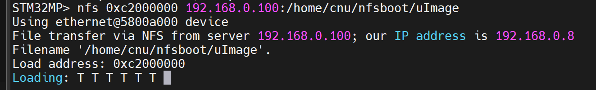

> 图：实测串口——同一个 `nfs` 命令，服务器地址换成 `192.168.0.100` 后，`File transfer via NFS from server 192.168.0.100; our IP address is 192.168.0.8` 之后**四行网关警告全部消失**，`Loading:` 后面一路打了 30 个 `T`，最后收在 `Retry count exceeded; starting again` 并落回 `STM32MP>` 提示符。

这发日志要读出三层信息：

- **前四行与第一发一字不差**，只有服务器地址从 `192.168.1.249` 换成 `192.168.0.100`——`nfs` 的地址确实只认命令里给的那个，`serverip` 一点作用都没有（与 `tftp` 相反，这就是"两点差别"里的第一点）。
- **`gatewayip` 警告消失**：`.100` 与板子 `.8/24` 同网段，不需要下一跳，U-Boot 直接在本链路广播 ARP 问 `.100` 的 MAC。
- **`Loading: T T T…` 一路打下去，而不是 `ARP Retry count exceeded`**：这是本次实测最有价值的一处对照——ARP 已经问到了对方 MAC、包也发出去了（否则又会像第一发那样卡在 ARP），只是**对面没有任何程序应答 NFS 的请求**，每 `T` 是一次重试超时。换句话说：网络这一段全绿，缺的只剩"服务器上那个服务"。
- **收尾那行是 `Retry count exceeded; starting again`，注意它前面没有 `ARP` 三个字**：第一发是 `ARP Retry count exceeded`（找 MAC 就没找到），第二发打了 30 个 `T` 之后才是 `Retry count exceeded`（MAC 找到了、请求发出去了、等不到应答）。**两行的差别本身就是诊断信息**：有没有 `ARP` 前缀 = 断在链路层还是断在应用层。

| 敲的是哪一发 | 报什么 | 说明什么 |
|---|---|---|
| 课件原样（`192.168.1.249`，跨网段） | `## Warning: gatewayip needed but not set` ×4 → `ARP Retry count exceeded` | 卡在**路由**：找不到下一跳，连 ARP 都没处问 |
| 换成同网段（`192.168.0.100`，实测） | 无网关警告，`Loading:` 后 30 个 `T` → `Retry count exceeded; starting again` | 卡在**服务**：链路、IP、ARP 全通，服务器上根本没有 NFS 可导 |
| 对照：`tftp c2000000 uImage` | 一次成功，`Bytes transferred = 7546640` | tftp 只要一个 `tftpd-hpa` 就够，前置最轻 |

顺带一句：第二发的失败方式（一路 `T` 到超时）与步骤 3 那次"文件权限还没修好"的干等超时是同一个形状。**看到 `T` 就该往服务器侧查（服务在不在跑、端口对不对、权限与目录导出没有），看到带 `ARP` 的超时才往链路/网段查**——这条分界以后排障会反复用到。

**关联后续实验（第 6 章就靠这两发垫底）**：第 6 章 6.1 节（课件 Slide 49-51）要在这台 Ubuntu 上装 `nfs-kernel-server` + `nfs-common`、建 `/home/cnu/nfsboot`、在 `/etc/exports` 里加一行 `/home/cnu/nfsboot *(rw,sync,no_root_squash,no_subtree_check)`，课件还特别注明要**使能 NFS v2**（"开发板上的 nfs 客户端是 V2 版本"）。届时第二发就会通。另外提前记一笔：课件 6 章那串 bootargs 里板子 IP 写的是 `ip=192.168.0.2`，而我们全系列用的是 `ipaddr 192.168.0.8`——**到第 6 章要二选一对齐**（改 bootargs 里的 `ip=` 成 `.8`，或把 `ipaddr` 改成 `.2`），别两边各说各话。

## 五、注意事项

1. **三块网卡各干各的，谁也别动谁**：网卡 1（仅主机 VMnet1，`192.168.56.101`）管 Windows↔Ubuntu 的文件往来——`\\192.168.56.101` 映射出来的网络硬盘全靠它，动了就掉盘；网卡 2（NAT）管 apt 上外网；网卡 3（桥接 VMnet0）只管跟板子说话。本篇**只加网卡 3、只给网卡 3 配 IP**，前两块原样不动，所以既不用断网、也不用来回改配置。
2. **`192.168.0.100` 归虚拟机**：Windows 那块网卡必须让位、改成 `192.168.0.99`。两边都占 `.100` 就是 IP 冲突，症状很阴——板子拉文件时通时不通。本篇之后，"PC = 192.168.0.100"这句从实验九用到现在的话**作废**：100 是服务器（Ubuntu），99 才是 Windows。
3. **VMnet0 要手动指定网卡**：默认"自动"很可能桥到无线网卡上，表现为虚拟机 `ping 192.168.0.99` 不通、板子 `tftp` 干等超时。这是本篇最难自查的一条，配完桥接先用虚拟机 ping 宿主确认。
4. **防火墙这次不在 Windows 上**：服务器换到 Linux，Windows 防火墙这一关基本消失；Ubuntu 侧只有开了 ufw 才需要 `sudo ufw allow 69/udp`（桌面版默认 inactive）。实验九那次 ICMP 被拦是 Windows 防火墙，别把两个对象搞混。
5. **文件放 `/home/cnu/tftpboot` 根下**、文件名一字不差（区分大小写）：`TFTP_OPTIONS` 里的 `-s` 已把根锁在这个目录，传绝对路径反而找不到文件。
6. **`tftp` 的地址参数是十六进制**：`c2000000` 即 `0xC2000000`，`0x` 可省——从本篇起这个地址约定（内核 → `c2000000`、设备树 → `c4000000`）全系列统一，第 5 章沿用。
7. **`dhcp` 超时不是故障**：这根网线上没有 DHCP 服务器（桥接段是孤岛网段），广播几轮放弃是正常收场。
8. **终端粘贴用右键**：MobaXterm 里 Ctrl+C 是中断、Ctrl+V 不粘贴（实验九的教训）。
9. **改任何网卡前先对驱动描述**：这台机器有两块 USB 网卡（`ASIX` = 板子、`Realtek USB 2.5GbE` = 校园网上外网），Windows 的"以太网 N"只是会变编号的别名。动错的代价实测过：外网当场断。
10. **`Test-NetConnection` 的 445 可能骗你**：装了 Clash/代理（本机有块 `Meta` 虚拟网卡占着默认路由）时，`Test-NetConnection 192.168.56.101 -Port 445` 会报 `TcpTestSucceeded True` 而 `PingSucceeded False`——那个"成功"是代理接过去的，不是 Ubuntu 应答。判断网络硬盘到底通不通，看 `net use` 里那条映射是不是 `OK`、能不能真的打开 `\\192.168.56.101\share` 列文件。

## 六、踩坑实录：这台新电脑的网络是怎么一步步走弯的

本篇的服务器搭建卡了整整两个晚上，九个坑全部踩过一遍。按"现象 → 根因 → 怎么定位 → 怎么修"记在这里，遇到同类症状可以直接对号。**结论先行：这九个坑里没有一个是"命令敲错了"，全是"改错了对象"、"没确认改动是否落盘"，或者"权限/链路这类看不见的东西"。**

**坑 1：想加桥接，结果把 VMnet1 改成了桥接模式 → 网络硬盘（Z: 盘）当场掉线。**

现象最唬人：Ubuntu 里 `192.168.56.101` 明明还在、`smbd` 也 `active`，可 `ping 192.168.56.10` 报"来自 192.168.56.101 目标主机不可达"，Windows 那边 `\\192.168.56.101` 也打不开。根因在虚拟网络编辑器：

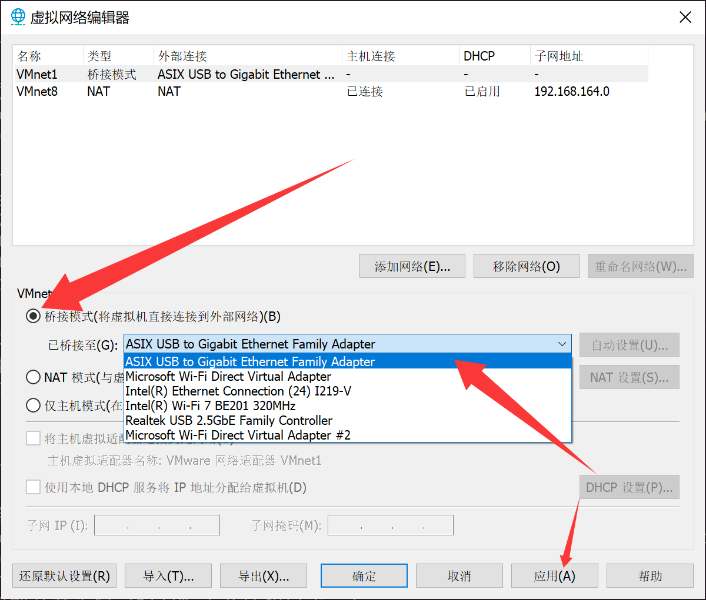
> 图：踩坑现场——编辑器列表里**只剩 `VMnet1 桥接模式（外部连接 ASIX…）` 和 `VMnet8 NAT` 两行，VMnet0 那一行整个不见了**：仅主机模式的 VMnet1 被改成了桥接。上面那组"网络应用模式"单选框显示的是当前选中行的类型，所以点进去看着是"桥接"、点了「更改设置」又变回别的——**判断自己选中哪一行要看列表里那行的"类型"列，别看上方单选组**。这也是后来那句"VMnet0 显示成仅主机"困惑的源头。

定位手段（都是只读命令，Windows PowerShell）：

```powershell
Get-NetAdapter -IncludeHidden | Select Name,InterfaceDescription,Status   # 看 VMnet1 适配器还在不在
Get-NetIPAddress -AddressFamily IPv4 | Select InterfaceAlias,IPAddress    # 看 192.168.56.x 挂在谁身上
```

那次查出来 `VMware Network Adapter VMnet1` **连隐藏设备里都没有**（设备实例被删除，不是"禁用"也不是"断开"），而 `C:\Windows\System32\drivers\` 下 `vmnet*.sys` 四个驱动文件全在——所以**不用重装 VMware**，只是那块虚拟网卡被从系统里摘掉了。

修法：编辑器里把 VMnet1 改回「仅主机模式」、勾上「将主机虚拟适配器连接到此网络」与「使用本地 DHCP 服务…」、子网填回 `192.168.56.0`；要是列表已经乱到 VMnet0 都找不回，直接点左下「**还原默认设置(R)**」重建三件套（VMnet8 子网会回到默认，Ubuntu 的 NAT 卡是 DHCP，自动跟上）。重建后 Windows 侧那块适配器拿到的是 `192.168.56.1`（网关位），课程文档写的是 `.10`——同网段都通，别来回折腾。

**坑 2：在「虚拟机 → 设置」里改现有的"网络适配器"，而不是点「添加」。**

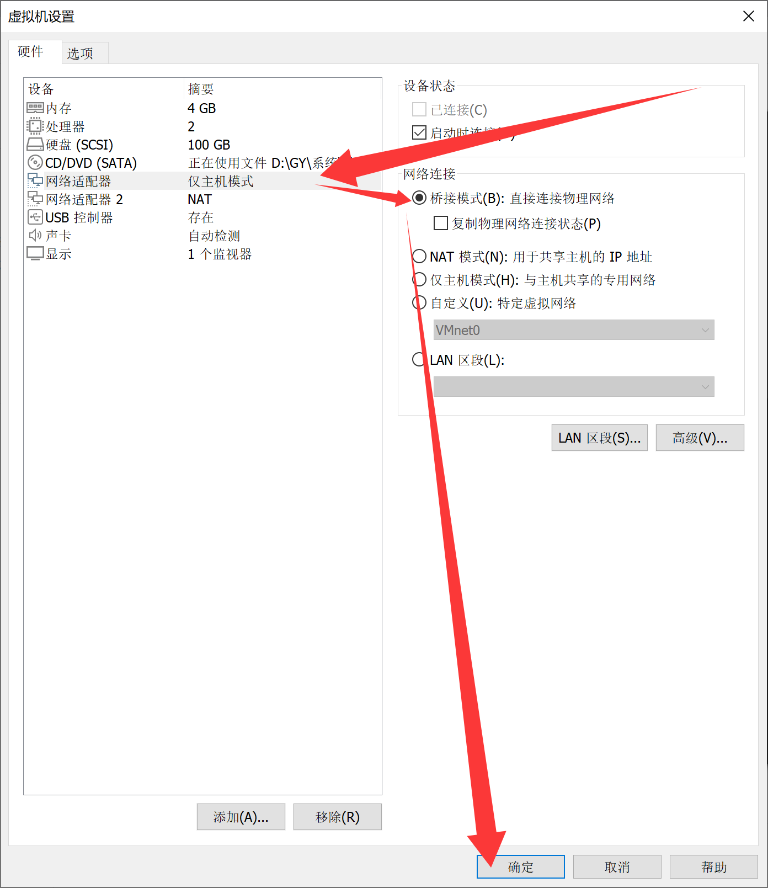
> 图：踩坑现场——左侧列表选中的是第一块「网络适配器」（摘要"仅主机模式"），右侧把连接方式点成了「桥接模式(B)」。这**不是加网卡，是把网卡 1 从仅主机挪走**：真点「确定」，`ens33` 的 `192.168.56.101` 立刻消失，Z: 盘再掉一次。加网卡必须走列表下方的「**添加(A)...**」→「网络适配器」，加完左侧应出现第三行「网络适配器 3」。

**坑 3：加是加对了，但没点「确定」→ 客户机里死活没有第三块卡。**

现象：虚拟机设置里明明有"网络适配器 3"，Ubuntu 里 `ip -4 addr show` 只有 `lo`/`ens33`/`ens37`。根因：设置窗口没确认，改动没写进配置文件。定位办法很干脆——直接看虚拟机的 `.vmx`：

```bash
grep -aiE "^ethernet[0-9]+\.(present|connectiontype|vnet)" Ubuntu20-install.vmx
```

三块卡齐了应该是 `ethernet0 = hostonly`、`ethernet1 = nat`、`ethernet2 = custom` + `ethernet2.vnet = "VMnet0"`。**以 `.vmx` 为准，不以界面记忆为准。**

**坑 4：把 `192.168.0.99` 配到了另一块 USB 网卡上 → Windows 外网断。**

这台机器有**两块 USB 网卡**：`ASIX USB to Gigabit Ethernet Family Adapter`（接开发板）和 `Realtek USB 2.5GbE Family Controller`（插校园网、上外网，DHCP 拿 `10.253.x.x`）。Windows 显示的名字只是"以太网 2 / 以太网 7"这种**会变编号的别名**，照编号改就改错了对象：默认路由还指着 `10.253.255.254`，地址却成了 `192.168.0.99`，两头对不上，网当场断。修法：把 Realtek 那块改回「自动获得 IP」，再到 ASIX 那块上配 `.99`。定位与预防一律用 `ipconfig`（看每块卡的**描述**列）。

**坑 5：`Test-NetConnection -Port 445` 报了个假阳性。**

排查 Z: 盘时用 `Test-NetConnection 192.168.56.101 -Port 445`，得到 `PingSucceeded False` 但 `TcpTestSucceeded True`——差点据此判定"共享其实是通的"。实际上 VMnet1 适配器都不存在，物理上不可能到得了 `192.168.56.101`；那个 TCP "成功"是本机代理软件（`Meta` 虚拟网卡，占着默认路由）把连接接过去握了手。**判共享是否恢复，要看 `net use` 里那条映射是不是 `OK`、能不能真的列出 `share` 目录内容**，不要看端口探测。

**坑 6：新加的 `ens38` 一直停在"正在获取 IP 配置"。**

这不是故障：桥接这条线（板子 ↔ USB 网卡 ↔ 虚拟机）上没有任何 DHCP 服务器，它永远等不到地址。填上静态 `192.168.0.100`（网关、DNS 留空）后立刻"已连接"，`ping 192.168.0.99` 也就通了（见 ④ 实测）。

**坑 7：服务一切正常，本机自测却报 `Error code 0: Permission denied`，还留下一个 0 字节的假文件。**

现象：`service tftpd-hpa status` 明明白白 `active (running)`，配置文件四行与课件一字不差，目录也是课件要求的 777——可 `tftp 127.0.0.1` 里 `get uImage` 就是被拒，而且失败之后 `/tmp` 里还多了个 `uImage`：

```
cnu@cnu-virtual-machine:/tmp$ tftp 127.0.0.1
tftp> get uImage
Error code 0: Permission denied
tftp> q
cnu@cnu-virtual-machine:/tmp$ ls -l /tmp/uImage
-rw-rw-r-- 1 cnu cnu 0 9月  23 20:36 /tmp/uImage      ← 0 字节，是失败留下的空壳
```

根因在**文件权限**，不在目录权限：`cp` 从共享目录带过来的 `uImage` 是 `-rwx------ cnu cnu`（700），而 `status` 的进程行里写着 `in.tftpd --listen --user tftp ...`——tftpd 是**换成 `tftp` 这个用户**去读文件的，700 的权限只允许 `cnu` 自己读，别人一律不给。目录 777 只解决"能不能走进这个目录"，不解决"这个文件给不给你读"。

定位手法就两句话，对照着看立刻明白：

```bash
ls -l /home/cnu/tftpboot        # 看文件的权限列
sudo service tftpd-hpa status   # 看进程行里的 --user 是谁
```

修法：

```bash
chmod 644 /home/cnu/tftpboot/uImage
rm -f /tmp/uImage               # 先删掉失败留下的 0 字节空壳，否则下次误判"成功"
cd /tmp && tftp 127.0.0.1
tftp> get uImage
tftp> q
ls -l /tmp/uImage               # 这次必须是 7546640
```

这正是课件 Slide 21 那个 `Permission denied` 的现场版——课件给的解释（"文件所在目录无读权限、文件本身无读权限"）完全正确，我们只是补上了它在真实环境里的具体成因。

**坑 8：网线插好了，板子的网口灯就是不亮；先在板子上 `ping` 一次，灯才亮。**

现象：线两端都插到位，但板子 RJ45 上的指示灯不亮，此时从 Ubuntu `ping 192.168.0.99` 不通（或时通时不通）。在板子上敲一条：

```
STM32MP> ping 192.168.0.100
ethernet@5800a000 Waiting for PHY auto negotiation to complete..... done
Using ethernet@5800a000 device
host 192.168.0.100 is alive
```

**这一下之后板子的网口灯才亮**，紧接着 Ubuntu 侧 `ping -c 3 192.168.0.99` 就是 0% 丢失：

```
64 字节，来自 192.168.0.99: icmp_seq=1 ttl=128 时间=0.589 毫秒
已发送 3 个包，已接收 3 个包, 0% 包丢失, 耗时 2027 毫秒
```

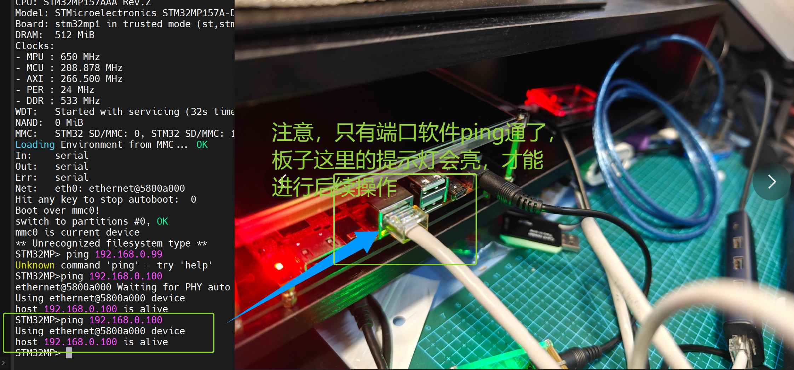
> 图：实测现场（左串口、右实物）——左边是板子串口日志：trusted 版横幅、`Boot over mmc0!` → `** Unrecognized filesystem type **` 落回命令行，然后 `ping 192.168.0.99` 报 `Unknown command 'ping'`（**注意这一条**：`ping` 明明在 `help` 列表里，那次是粘贴带进了不可见字符，与实验十二注意事项 5 同一回事，手敲即好），再往下手敲 `ping 192.168.0.100` 才出现 `Waiting for PHY auto negotiation to complete..... done` + `host 192.168.0.100 is alive`；右边实物照片里板子 RJ45 的绿link 灯已经点亮（绿框与箭头标的就是它）。图上那句手写提示是本坑的结论：**只有端口软件 ping 通了，板子这个提示灯才会亮，才能进行后续操作。**

原理：以太网链路不是"插上就有"的。两头的 PHY 要跑一次**自动协商**（MDI 线序、速率、双工）才会把 link 拉起来，而 U-Boot 里只有真正要用网卡的命令（`ping`/`tftp`/`dhcp`）才会去驱动这次协商——串口那句 `Waiting for PHY auto negotiation to complete..... done` 就是链路起来的时刻，灯亮只是它的物理指示。宿主机那块 ASIX 在链路起来之前是"媒体断开"状态，桥在它上面的虚拟机流量当然过不去。

所以以后遇到"两边互相 ping 不通"，**第一步不是查 IP 和防火墙，而是在板子上敲一次 `ping 对端IP`，看灯亮不亮**，再双向复测。若每次上电都得先 ping 一下才亮，可以再查一个方向：设备管理器 → ASIX 网卡属性 → 电源管理 → 取消「允许计算机关闭此设备以节约电源」——这条本篇没有实测，只作为备选记在这里。

**坑 9：同一串命令在 Ubuntu 里和在板子上完全不是一回事。**

现象：服务器一切就绪，在 Ubuntu 终端里敲 `tftp c2000000 uImage`，得到的是：

```
Error: Temporary failure in name resolution
c2000000: unknown host
```

根因：`tftp` 这个名字在两边都存在，但语法毫不相干。U-Boot 的 `tftp` 是 **`tftp <加载地址> <文件名>`**，服务器地址取自环境变量 `serverip`；Ubuntu 的 `tftp`（`tftp-hpa` 客户端）是 **`tftp <服务器IP>`** 进去再 `get/put`，第一个参数会被当作**主机名去解析**——于是 `c2000000`（一块内存地址）被当成域名，报 `unknown host`。

判断自己在哪一侧只需要看提示符：`STM32MP>` 是板子（U-Boot），`cnu@...$` 是 Ubuntu。本篇往后所有 `tftp`/`mmc`/`ext4load`/`setenv` 都是**板子侧**命令，别在 Linux 里敲；反过来 `ls -l`、`chmod`、`service` 是 Linux 的，在串口里敲只会得到 `Unknown command`。

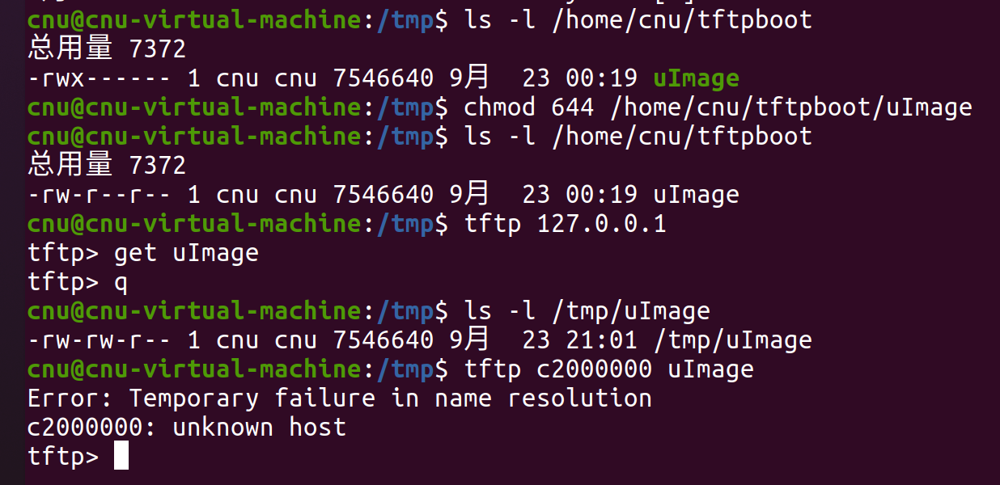
> 图：踩坑现场（Ubuntu 终端）——上半段其实是**好消息**：`chmod 644` 之后 `ls -l` 变 `-rw-r--r--`、`tftp 127.0.0.1` 里 `get uImage` 零报错、`/tmp/uImage` 拿到 7,546,640 字节（⑥ 本机自测通过）；下半段才是本坑——在同一个窗口里顺手敲了 `tftp c2000000 uImage`，Linux 的 tftp 客户端把 `c2000000` 当主机名去解析，于是 `Error: Temporary failure in name resolution` / `c2000000: unknown host`。同一屏里"成功"和"用错地方"挨着出现，正是这个坑最迷惑的地方。

**一条通用纪律收尾**：改任何一层网络配置之前，先把三处底账抄下来——Windows 的 `ipconfig`、Ubuntu 的 `ip -4 addr show` + `ip route`、虚拟机的 `.vmx` 里 `ethernet*` 那几行；改完再照一次。这六个坑没有一个能被"眼睛盯着界面回忆"抓出来，但每一处都能在前后对比里一眼看见。

## 七、怎么验证

两条硬判据（**本篇均已实测达成**）：

1. `ping 192.168.0.100` 回 `host 192.168.0.100 is alive`——实测达成，且 `ping 192.168.0.99` 同样 `is alive`（板子能同时打到 Ubuntu 与宿主机）；
2. `tftp c2000000 uImage` 回 `Bytes transferred = 7546640 (732710 hex)`——实测达成，速率 `1.7 MiB/s`，与服务器上 `ls -l /home/cnu/tftpboot` 的字节数一字不差。

软判据：`print serverip` 显示已保存（实测 `serverip=192.168.0.100`）；能口头讲清 dhcp 在我们拓扑为何超时（实测 `BOOTP broadcast 1…17` → `Retry time exceeded`）、nfs 与 tftp 的两点差别（两发实测：地址来自命令本身 + 跨网段要网关，见步骤 6）。

不达标时的排查：

| 现象 | 先查什么 |
|---|---|
| ping 不通 | **先看板子网口的灯亮不亮**：不亮就先在板子上敲一次 `ping 192.168.0.100` 把 PHY 自协商拉起来（坑 8），再双向复测。还不通才轮到查配置：网线两端插紧？宿主机那块 ASIX 是否已改 `192.168.0.99`、虚拟机是否已配 `192.168.0.100`（`ip -4 addr show`）；VMnet0 是否手动桥到了那块 ASIX 网卡（注意事项 3、坑 1） |
| ping 通但 tftp 卡住 | 服务器上 `sudo service tftpd-hpa status` 在不在跑；步骤 3 ⑥ 的本机自测过不过（过了才轮到查网络）；文件权限是不是又变回 700（坑 7）；Ubuntu 是否开了 ufw |
| `## Warning: gatewayip needed but not set` | 目标 IP 与 `ipaddr` **不同网段**（本篇步骤 6 用课件的 `192.168.1.249` 就是这个下场）。直连拓扑没有网关可填，把地址换成同网段的 `192.168.0.100` 才是正路 |
| `Loading: T T T T…` 一路重试（没有 ARP 报错） | 二层与 IP 都通了，**问题在服务器侧没人应答**：服务没跑（`sudo service tftpd-hpa status`）、端口不对，或压根没装这个服务（步骤 6 第二发的 `nfs` 就是这种） |
| `unknown host` / `Temporary failure in name resolution` | 你在 **Ubuntu 终端**里敲了板子的命令（坑 9），回串口 `STM32MP>` 再敲 |
| `File not found` | 文件名大小写；文件是否在 `/home/cnu/tftpboot` 根下（`ls -l` 看） |
| 字节数对不上 | 传输被打断——重跑一遍 `tftp`；仍不对则对比服务器上文件是否完整拷入（`ls -l /home/cnu/tftpboot` 应 7546640） |

## 八、实验完成标志

- `ping 192.168.0.100` 通（步骤 1 实测——当时 `.100` 还是 Windows 那块 ASIX，服务器在线与否由步骤 4 定案）
- `serverip` 已设并 saveenv，`print serverip` 复验在（步骤 2 实测：`serverip=192.168.0.100`，`saveenv` 打 `Writing to redundant MMC(0)... OK`）——出厂默认是 `192.168.1.1`，是"改"不是"补"，见实验十二步骤 7 实测
- Ubuntu 侧 tftpd-hpa 装好、`/etc/default/tftpd-hpa` 四行按课件配齐、`service tftpd-hpa status` 报 `active (running)` 且进程命令行带上 `--address :69 -l -c -s /home/cnu/tftpboot`（步骤 3 ①~⑤ 实测）；虚拟机三网卡到位：`ens33` 仅主机 `.101`、`ens37` NAT 上外网、`ens38` 桥接 `.100`，`ping 192.168.0.99` 通且 `ip route` 默认路由仍在 `ens37`（步骤 3 ④ 实测）
- `/home/cnu/tftpboot/uImage` 已就位（7,546,640 字节；传递路径 zip → 共享目录 → `cp` 进根目录）；本机 `tftp 127.0.0.1` 首测被**文件权限**挡住（坑 7），`chmod 644` 后**复测通过**——`/tmp/uImage` = 7,546,640 字节（步骤 3 ⑥ 实测）
- `tftp c2000000 uImage` 下载成功，`Bytes transferred = 7546640 (732710 hex)`、`1.7 MiB/s`（步骤 4 实测达标；这条要在**板子上**敲，在 Ubuntu 里敲会报 `unknown host`，见坑 9）
- `dhcp` 在这根网线上 `BOOTP broadcast 1…17` → `Retry time exceeded; starting again`——现象亲测、原因说得清（步骤 5 实测达标）
- nfs 与 tftp 的两点差别实测到位：地址来自命令本身、跨网段必须有网关——第一发 `nfs 0xc2000000 192.168.1.249:...` 实测回四行 `## Warning: gatewayip needed but not set` + `ARP Retry count exceeded`；第二发换成同网段的 `192.168.0.100`，实测**网关警告全消**、`Loading:` 后一路打了 30 个 `T` 才收在 `Retry count exceeded; starting again`（**注意没有 `ARP` 前缀**——链路层已经通了），失败点从"路由"挪到"服务器上没这个服务"，成因与三条出路见步骤 6（步骤 6 两发均实测达标）
- 九个坑的成因与定位手段能复述，尤其是"改错对象""没确认落盘""权限与链路这类看不见的东西""同名命令两侧不同义"这四类（第六节踩坑实录）

## 九、下一步：eMMC 和 SD 卡操作命令

下一篇覆盖 4.5 节（Slide 23-34）：`mmc` 命令族——`mmc info` / `mmc list` / `mmc dev` / `mmc part` / `mmc read`。第 3 章实验十只摸过 eMMC 的芯片信息，本篇要把它的**分区表**摸出来——这张"地图"是实验十五（ext4 文件操作）和实验十七（从 eMMC 启动）的入场券。
