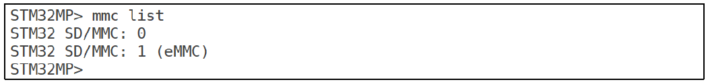
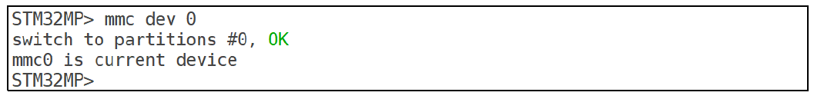

# 实验十四 eMMC 和 SD 卡操作命令——mmc 全家桶，顺带给 eMMC 摸底

> **对应课件**：《第4章 使用U-Boot》4.5 节，Slide 23-34
>
> **系列说明**：本系列基于华清远见 FS-MP1A（STM32MP157A）开发板，对应课件《第4章 使用U-Boot》。U-Boot 操作存储的双手是 `mmc` 命令族——SD 卡和 eMMC 在它眼里是同一种设备。第 3 章实验十只用 `mmc dev 1` 和 `mmc info` 验证过 F-6（eMMC 芯片活着），本篇把这一族命令过全，并做一件更重要的事：把板上 eMMC 的**分区表**摸清楚。这张底牌直接决定后面两篇怎么打——ext4 文件操作（实验十五）和从 eMMC 启动内核（实验十七）都得按它给的地名走路。本文覆盖 Slide 23-34：mmc 命令总览、info/list/dev/part/read 动手实测、write/erase/hwpartition 只认不动。前置：实验十二（本篇不碰网络、不碰 PC）。

## 一、两块板，两套"默认值"

SD 卡和 eMMC 用的同一类控制器，U-Boot 统一编为 mmc 设备：**0 号 = SD 卡，1 号 = eMMC**（两块板都如此）。但"默认当前设备 = 从哪个设备启动"，两块板不一样：

| 对比项 | 课件演示板 | 我们的 FS-MP1A |
|---|---|---|
| SD 卡 | 16GB（SC16G，14.8 GiB） | 32GB 卡（约 29.x GiB，`lsblk` 里的 29.8G 同源） |
| eMMC | 8GB（8GTF4，7.3 GiB，MMC 5.1） | 4GB（004GA，3.7 GiB，MMC 5.0，实验十实测） |
| 启动设备 | eMMC → 默认当前设备 = **1 号** | SD 卡 → 默认当前设备 = **0 号** |
| eMMC 分区 | 出厂系统三分区（ssbl / boot / rootfs） | **未知——本篇步骤 4 探明** |

所以同一条 `mmc info`，课件截图书的是 eMMC、我们板报的是 SD 卡——对结构不对数值，这正是第一课。

## 二、实验环境（实际）

| 项目 | 实际值 |
|---|---|
| 板子状态 | trusted 版 U-Boot，倒计时 5 秒，`STM32MP>` 可达 |
| 串口 | MobaXterm Serial 会话（COM11），115200 |
| SD 卡（mmc 0） | 32GB，实验四分区：fsbl1 / fsbl2 / ssbl / bootfs / rootfs 五区；自编 trusted U-Boot 在 fsbl1/fsbl2/ssbl；bootfs/rootfs 尚未建文件系统 |
| eMMC（mmc 1） | 3.7 GiB（004GA，MMC 5.0，8-bit 总线，实验十 `mmc info` 验证）；分区内容本篇探明 |
| 环境变量基线 | 实验九网络三件套 + 实验十三的 `serverip`；`bootdelay 5` |

> **开工自检（10 秒）**：上电先看 `Hit any key to stop autoboot:` 后面那个数字——若是 **0**（换过板子、重新分区烧写后最容易回到 0），先补一句 `setenv bootdelay 5` + `saveenv`（`env set` / `env save` 等价写法）再 `reset`，往后每次拦停都来得及按 Enter。做法见《实验十二》步骤 1 与步骤 4。

## 三、课件 ↔ 步骤对应表

| 课件 Slide | 内容 | 对应步骤 |
|---|---|---|
| 23 | `? mmc` 子命令总览 | 步骤 1 |
| 24 | mmc 命令速查表 | 步骤 1 |
| 25 | mmc info（课件：当前设备 = eMMC） | 步骤 2 |
| 26 | mmc list（0 = SD，1 = eMMC） | 步骤 2 |
| 27~28 | mmc dev 0 切 SD 卡 + SD 卡的 mmc info | 步骤 3 |
| 30~31 | mmc part 查当前设备分区表 | 步骤 4 |
| 29 | mmc dev 1 2 把分区设为当前设备 | 步骤 5 |
| 32~33 | mmc read 读扇区到 DRAM（回显十进制） | 步骤 6 |
| 34 | mmc write / mmc erase 命令格式 | 步骤 7（只认不动） |

## 四、实验步骤

### 步骤 1：mmc 命令族总览（Slide 23~24）

上电拦停进 `STM32MP>`，先看这一族命令的全貌：

```
STM32MP> ? mmc
```


> 图：课件 Slide 23——`? mmc` 列出 MMC 子系统全部子命令：`mmc info`、`mmc read`、`mmc write`、`mmc erase`、`mmc rescan`、`mmc part`、`mmc dev`、`mmc list`、`mmc hwpartition`（附 WARNING：硬件分区是 write-once 设置）、`mmc bootbus`、`mmc bootpart-resize`、`mmc partconf`、`mmc rst-function`（附 WARNING：write-once 字段）、`mmc setdsr`。


> 图：课件 Slide 24——mmc 命令速查表：info/read/write/rescan/part/dev/list/hwpartition/bootbus/bootpart/partconf/rst/setdsr 各一句话说明。

本篇的安排：`info`、`list`、`dev`、`part`、`read` 五条动手（步骤 2~6）；`write`、`erase` 只认格式；`hwpartition`、`bootbus`、`partconf`、`rst-function` 这几条高危 write-once 只在帮助里见一见（步骤 7 说为什么）。

**实际执行结果**：待补充

### 步骤 2：当前设备是谁——mmc info + mmc list（Slide 25~26）

```
STM32MP> mmc dev
STM32MP> mmc info
STM32MP> mmc list
```

`mmc dev` 不带参数 = 只报告当前设备（不带 `dev [dev]` 时是 show 不是 set）。课件板从 eMMC 启动，所以课件截图里当前设备是 eMMC：


> 图：课件 Slide 25——`mmc info` 报 eMMC：Name 8GTF4、`Mode: MMC High Speed (52MHz)`、Capacity 7.3 GiB、`Bus Width: 8-bit`、Boot Capacity 4 MiB、RPMB Capacity 512 KiB。


> 图：课件 Slide 26——`mmc list` 列出 `STM32 SD/MMC: 0` 与 `STM32 SD/MMC: 1 (eMMC)`：0 号 SD 卡、1 号 eMMC。

我们从 SD 卡启动，**当前设备应是 0 号**——`mmc info` 会报 SD 卡的信息，和课件截图报道的设备不同源，属于正常现象（步骤 3 会专门看 SD 卡的信息，此处先把命令跑通、把 `mmc list` 的"0 = SD、1 = eMMC"记牢）。

**实际执行结果**：待补充

### 步骤 3：mmc dev 0——切到 SD 卡看信息（Slide 27~28）

```
STM32MP> mmc dev 0
STM32MP> mmc info
```

`mmc dev 0` 的回显（课件 Slide 27 同款结构）：

```
switch to partitions #0, OK
mmc0 is current device
```


> 图：课件 Slide 27——`mmc dev 0` 从 eMMC 切到 SD 卡：`switch to partitions #0, OK`、`mmc0 is current device`。


> 图：课件 Slide 28——切到 SD 卡后的 `mmc info`：Name SC16G、`Mode: SD High Speed (50MHz)`、`SD version 3.0`、Capacity 14.8 GiB、`Bus Width: 4-bit`、`Erase Group Size: 512 Bytes`。

对照着看 SD 卡与 eMMC 的参数差异（课件两图互为对照，我们也一样）：SD 卡 `Bus Width: 4-bit`、eMMC `8-bit`（实验十的 `mmc info` 见过 8-bit——F-1 固定电源 + F-6 `bus-width=<8>` 兑现的那条）；容量一栏我们应报约 `29.x GiB`，Name/Manufacturer 与课件的 SC16G 不同属正常。

**实际执行结果**：待补充

### 步骤 4：mmc part——给 eMMC 摸底（Slide 30~31）

这是本篇最重要的一步。切到 1 号设备，看它的分区表：

```
STM32MP> mmc dev 1
STM32MP> mmc part
```


> 图：课件 Slide 31——先 `mmc dev 1`（`mmc1(part 0) is current device`）再 `mmc part`：`Partition Map for MMC device 1 -- Partition Type: EFI`，三个分区：第 1 分区 `ssbl`（0x400~0x13ff，放 U-Boot 镜像）、第 2 分区 `boot`（0x1400~0x213ff，放内核，attrs 带legacy boot 标志）、第 3 分区 `rootfs`（0x21400~0xe8fbff，根文件系统，占满剩余空间），并附各分区的 Type GUID 与 Partition GUID。

课件板的 eMMC 带着出厂系统的三分区。**我们的 eMMC 分区状态此前从未查过**，两种可能都正常：

- **带华清出厂系统**：`mmc part` 列出类似 ssbl/boot/rootfs（或 fsbl 前缀）的分区——最好情况，后续实验十五的 ext4 操作、实验十七的 eMMC 启动都有现成落点；
- **空盘或陌生布局**：`mmc part` 报空表或报错——也不碍事，ext4/eMMC 启动的分支到时按实际表调整，本篇的任务只是**把真实情况记录下来**。

无论哪种结果，把 `mmc part` 的完整输出截图存档——这就是后续两篇的地图。顺带一提：我们的 SD 卡也能用 `mmc part` 查（切回 `mmc dev 0`），能看到实验四建的 fsbl1~rootfs 五分区，正好和 eMMC 的表对照。

**实际执行结果**：待补充

### 步骤 5：mmc dev 1 2——把分区设为当前设备（Slide 29）

mmc 设备本身还分硬件分区，`mmc dev` 的第二个参数可以直接把某个**软件分区**设为当前：

```
STM32MP> mmc dev 1 2
```


> 图：课件 Slide 29——`mmc dev 1 2` 把 eMMC 的 2 号分区设为当前：`switch to partitions #2, OK`、`mmc1(part 2) is current device`——注意回显里的 `(part 2)` 后缀（实验十 `mmc dev 1` 时见过的 `(part 0)` 就是这个位置）。

**分区号以步骤 4 实测的表为准**：课件写 `2` 是因为它的 `boot` 分区恰好是 2 号；我们板上 2 号分区存不存在、叫什么，查了才知道。挑表里真实存在的一个分区号练手即可；若 eMMC 是空盘无分区，用 SD 卡练——`mmc dev 0 2`（我们的 bootfs 是 2 号... 以 `mmc part` 实测为准）。练完 `mmc dev 1`（不带分区参数）回到整个设备视角。

**实际执行结果**：待补充

### 步骤 6：mmc read——从存储读扇区到 DRAM（Slide 32~33）

命令格式（课件 Slide 32）：`mmc read addr blk# cnt`——`addr` 是 DRAM 目标地址，`blk#` 是起始扇区号，`cnt` 是扇区数（一个扇区 512 字节）。三个参数都是十六进制。把 eMMC 从 `0x400` 扇区起的 16 个扇区读到 `0xc0000000`：

```
STM32MP> mmc dev 1
STM32MP> mmc read c0000000 400 10
```


> 图：课件 Slide 32——`mmc read` 命令格式文本：`mmc read addr blk# cnt`。


> 图：课件 Slide 33——`mmc read c0000000 400 10` 的回显：`MMC read: dev # 1, block # 1024, count 16 ... 16 blocks read: OK`。课件特别提醒：**回显里的 1024 和 16 是十进制**。

回显里藏着本篇的小彩蛋：命令里写的是十六进制 `400` 和 `10`，回显报的是十进制 `1024`（= 0x400）和 `16`（= 0x10）——输入输出进制不同，别慌，算得上来就行。`16 blocks read: OK` 就是全部里程碑；读的是哪块内容取决于板上 eMMC 里到底有什么，本篇不深究。

**深入一步（可选）**：`md.b c0000000 40` 把读上来的原始字节显示在串口——`mmc read` 把数据放进了 DRAM，`md`（memory display）就能看。配合步骤 4 表里的 Start LBA，可以读任何分区的开头几扇区瞅瞅原始数据长什么样。读操作永远安全，随便试。

**实际执行结果**：待补充

### 步骤 7：write / erase / 高危命令——只认格式，不动手（Slide 34 + Slide 23 的 WARNING）

课件 Slide 34 给了两条写类命令的格式：

```
mmc write addr blk# cnt     ; 把 DRAM 中数据写入当前设备（写入前相应区域需先 erase）
mmc erase blk# cnt          ; 擦除当前设备的数据
```

本篇**只认格式、不做练习**，三条红线：

1. **`mmc write` / `mmc erase` 直接改存储内容**：我们 SD 卡上是自己移植的 U-Boot、eMMC 上可能有出厂系统——一次手滑的 `erase` 就是"重走实验四"。真要用它的场景（裸写镜像）第 3 章已用 `dd` 在 PC 侧完成，更稳。
2. **`mmc hwpartition` 是 write-once 硬件分区**：`? mmc` 帮助里原文 `WARNING: Partitioning is a write-once setting`——eMMC 的硬件分区（Boot/RPMB）一旦设为 complete **永久生效**，没有任何撤销。看一眼格式即可。
3. **`bootbus` / `partconf` / `rst-function` 同族高危**：帮助里的 WARNING 同样写着 write-once（rst-function 只许写 0/1/2）。这些都是 eMMC 寄存器级配置，玩具期不碰。

认识危险本身就是本步骤的产出：`? mmc` 输出里两条 WARNING 的位置，现在知道在哪了。

**实际执行结果**：待补充

## 五、注意事项

1. **对结构不对数值**：课件截图的容量（14.8/7.3 GiB）、Name（SC16G/8GTF4）、分区表数字全是它的板子的，我们的板对不上就是正常——结构（设备序号、分区类型、回显格式）一致即可。
2. **默认当前设备 = 启动设备**：课件板报 eMMC、我们报 SD 卡，不是谁错了，是启动设备不同。
3. **分区号以实测为准**：步骤 5 的 `mmc dev 1 2`、后续 ext4 命令里的 `mmc 1:2`，那个 `2` 都是课件板的分区号——我们板上几号，步骤 4 的 `mmc part` 说了算。
4. **读永远安全，写才是刀**：`mmc read`/`md.b` 放心玩；`write`/`erase`/`hwpartition` 及同族本篇不碰。
5. **练完回到"整设备"视角**：`mmc dev 1 2` 练完记得 `mmc dev 1`（或 `mmc dev 0`）回去，避免下篇实验在"分区 2 视角"里迷路。

## 六、怎么验证

1. `mmc list` 能指出 0 = SD 卡、1 = eMMC；
2. `mmc dev 0` / `mmc dev 1` 来回切换，各自的 `mmc info` 报出不同参数（SD：4-bit、约 29.x GiB；eMMC：8-bit、3.7 GiB、004GA）；
3. `mmc part` 对 eMMC 的分区表有了实测记录（后续两篇的地图）；
4. `mmc read c0000000 400 10` 回 `16 blocks read: OK`，且能说出回显的 1024/16 是十进制；
5. `mmc write`/`erase`/`hwpartition` 三条红线说得出。

不达标时的排查：

| 现象 | 先查什么 |
|---|---|
| `mmc dev 1` 后 `mmc info` 报错或空 | eMMC 没被识别？回想实验十的 `MMC: STM32 SD/MMC: 0, STM32 SD/MMC: 1` 横幅在不在 |
| `mmc part` 报无分区 | eMMC 可能是空盘——记录现状即可，不是故障；SD 卡（`mmc dev 0` + `mmc part`）可作替代练习对象 |
| `mmc read` 报错 | 设备/分区视角对吗（`mmc dev` 先确认）；扇区号是否超出设备容量 |

## 七、实验完成标志

- `? mmc` 总览实测，说得出本篇动手五条与不碰四条（步骤 1、7，待实测）
- `mmc info` / `mmc list` 实测——0 = SD、1 = eMMC，默认当前设备与启动设备一致（步骤 2，待实测）
- `mmc dev 0` 切换 + SD 卡 `mmc info`（4-bit、容量与实验四的卡对得上）（步骤 3，待实测）
- **eMMC 分区表 `mmc part` 实测存档**（步骤 4，后续两篇的地图；换过板子后这一条必须重做）
- `mmc dev 1 <分区号>` 指定分区切换实测，`(part N)` 回显认得（步骤 5，待实测）
- `mmc read` 实测 `16 blocks read: OK`，十进制回显换算说得出（步骤 6，待实测）

## 八、下一步：ext4 文件系统操作命令

下一篇覆盖 4.6 节（Slide 35-42）：`ext4ls` / `ext4load` / `ext4write`——不经过 PC，直接在 U-Boot 里看 eMMC 分区里的文件、读文件进内存、把内存数据写成文件。步骤 4 摸出来的分区表就是它的入场券：ext4 命令都得指名道姓"哪个设备哪个分区"。
