# 实验十四 eMMC 和 SD 卡操作命令——mmc 全家桶，顺带给 eMMC 摸底

> **对应课件**：《第4章 使用U-Boot》4.5 节，Slide 23-34
>
> **系列说明**：本系列基于华清远见 FS-MP1A（STM32MP157A）开发板，对应课件《第4章 使用U-Boot》。U-Boot 操作存储的双手是 `mmc` 命令族——SD 卡和 eMMC 在它眼里是同一种设备。第 3 章实验十只用 `mmc dev 1` 和 `mmc info` 验证过 F-6（eMMC 芯片活着），本篇把这一族命令过全，并做一件更重要的事：把板上 eMMC 的**分区表**摸清楚。这张底牌直接决定后面两篇怎么打——ext4 文件操作（实验十五）和从 eMMC 启动内核（实验十七）都得按它给的地名走路。本文覆盖 Slide 23-34：mmc 命令总览、info/list/dev/part/read 动手实测、write/erase/hwpartition 只认不动。前置：实验十二（本篇不碰网络、不碰 PC）。

## 一、两块板，两套"默认值"

**四个名词先对齐，后面就不绕了**：

- **SD 卡** = 插拔式的存储卡，我们烧写进去的 U-Boot 就在它上面；**eMMC** = 直接焊在板子上的存储芯片，容量固定、拔不下来，相当于"板载硬盘"。两者用的是同一类控制器，所以 U-Boot 用同一族 `mmc` 命令管它们。
- **扇区（LBA）** = 存储设备的最小读写块，一律 **512 字节**；`mmc part` 表里的 `Start LBA`/`End LBA` 就是"这个分区从第几号扇区开始、到第几号扇区结束"，扇区数减一减、乘 512 就是分区大小（本篇步骤 4 会带你算一遍）。
- **分区表 / GPT** = 记在盘开头的一张"目录表"，写明每个分区的起止扇区和名字；`Partition Type: EFI` 里的 EFI 就是 GPT 这套标准的另一个叫法（同一东西，U-Boot 两个词混着用）。
- **设备号 0 / 1** = U-Boot 给这两块存储编的号，**0 号 = SD 卡、1 号 = eMMC**（我们板子从 SD 卡启动）。注意这套号跟下面会讲的"分区号"是两码事，本篇步骤 5 专门辨析。

SD 卡和 eMMC 用的同一类控制器，U-Boot 统一编为 mmc 设备：**0 号 = SD 卡，1 号 = eMMC**（两块板都如此）。但"默认当前设备 = 从哪个设备启动"，两块板不一样：

| 对比项 | 课件演示板 | 我们的 FS-MP1A |
|---|---|---|
| SD 卡 | 16GB（SC16G，14.8 GiB） | 32GB 卡，`mmc info` 实测 `Name: SD32G`、`Capacity: 29.7 GiB`（步骤 2/3 实测） |
| eMMC | 8GB（8GTF4，7.3 GiB，MMC 5.1） | 4GB（004GA，3.7 GiB，MMC 5.0，`Bus Width: 8-bit`）——**本篇步骤 4 在新板上复测通过** |
| 启动设备 | eMMC → 默认当前设备 = **1 号** | SD 卡 → 默认当前设备 = **0 号**（步骤 2 实测 `mmc0 is current device`） |
| eMMC 分区 | 出厂系统三分区（ssbl / boot / rootfs） | **五分区**：ssbl / bootfs / vendorfs / rootfs / userfs（GPT）——步骤 4 实测，完整表在那一步 |

所以同一条 `mmc info`，课件截图书的是 eMMC、我们板报的是 SD 卡——对结构不对数值，这正是第一课。

## 二、实验环境（实际）

| 项目 | 实际值 |
|---|---|
| 板子状态 | trusted 版 U-Boot，倒计时 5 秒，`STM32MP>` 可达 |
| 串口 | MobaXterm Serial 会话，115200；**新机上实测 `COM10`**（会话标题栏为 `STMicroelectronics STLink Virtual COM Port (COM10)`，2026-09-24）；`COM11` 是旧电脑的值，换机后一律以 Windows 设备管理器里的 ST-Link 串口号为准 |
| SD 卡（mmc 0） | 32GB，`Name: SD32G`、`29.7 GiB`、4-bit；实验四分区：fsbl1 / fsbl2 / ssbl / bootfs / rootfs 五区（步骤 4 末 `mmc part` 实测复核）；自编 trusted U-Boot 在 fsbl1/fsbl2/ssbl；bootfs/rootfs 尚未建文件系统 |
| eMMC（mmc 1） | 4GB 芯片（实验十 `mmc info`：004GA、MMC 5.0、3.7 GiB、8-bit）；**分区表本篇步骤 4 已探明 = GPT 五分区** ssbl(2 MiB) / bootfs(64 MiB) / vendorfs(16 MiB) / rootfs(1.13 GiB) / userfs(2.41 GiB)，带着华清的出厂系统 |
| 环境变量基线 | 实验九网络三件套 + 实验十三的 `serverip`；`bootdelay 5` |

> **开工自检（10 秒）**：上电先看 `Hit any key to stop autoboot:` 后面那个数字——若是 **0**（换过板子、重新分区烧写后最容易回到 0），先补一句 `setenv bootdelay 5` + `saveenv`（`env set` / `env save` 等价写法）再 `reset`，往后每次拦停都来得及按 Enter。做法见《实验十二》步骤 1 与步骤 4。

## 三、课件 ↔ 步骤对应表

| 课件 Slide | 内容 | 对应步骤 |
|---|---|---|
| 23 | `? mmc` 子命令总览 | 步骤 1 |
| 24 | mmc 命令速查表 | 步骤 1 |
| 25 | mmc info（课件：当前设备 = eMMC） | 步骤 2 |
| 26 | mmc list（0 = SD，1 = eMMC） | 步骤 2 |
| 27~28 | mmc dev 0 切 SD 卡 + SD 卡的 mmc info | 步骤 3 |
| 30~31 | mmc part 查当前设备分区表 | 步骤 4 |
| 29 | mmc dev 1 2 把分区设为当前设备 | 步骤 5 |
| 32~33 | mmc read 读扇区到 DRAM（回显十进制） | 步骤 6 |
| 34 | mmc write / mmc erase 命令格式 | 步骤 7（只认不动） |

### 本篇动作 → 后面谁用 → 现在偷懒的后果

| 本篇动作 | 后面哪一篇要用 | 现在含糊的后果 |
|---|---|---|
| 步骤 4 的 **eMMC 分区表**（五分区 + 各自 LBA） | 实验十五：`ext4ls/ext4load/ext4write mmc 1:2` 里那个 `2`；实验十七：从 eMMC 启动时"内核在哪个分区、根文件系统在哪个分区"全看它 | 没存档 → 下两篇每次都要重新 `mmc part` 猜地名；**换板子或重刷 eMMC 后这张表会变**，旧表会把人带偏 |
| 步骤 2/3 认下的"0 = SD、1 = eMMC，默认当前设备 = 启动设备" | 实验十五、十六、十七：`mmc dev` 选错设备 = 往 SD 卡上写 eMMC 的文件（或反之），一整条链路都在错的对象上排查 | 分不清当前设备，就会把"命令没生效"当成"命令写错了" |
| 步骤 6 的进制口径（输入十六进制、回显十进制）+ `blk#` 是扇区（512 字节） | 实验十五 `ext4write` 的 `sizebytes`、实验十六 `bootm` 的地址、以及任何"从某偏移读一块"的排障 | 少乘一个 512、或者把回显的 1024 当十六进制，就会读错位置还以为数据坏了 |
| 步骤 5 辨清的"两套分区编号"（硬件分区窗口 vs GPT 分区号，已用只读探针定案） | 实验十五的 `mmc 1:2` 用的是 **GPT 号**；实验十七若要碰 eMMC 的 boot 区才会用到硬件分区窗口那一套 | 混为一谈 → 用 `mmc dev 1 2` 去"选中 bootfs"，接着 `ext4ls`/`mmc part` 只会拿到 `Invalid GPT`，然后误以为分区表被自己搞坏了 |
| 步骤 7 的三条红线（write / erase / hwpartition 等 write-once） | 全系列往后：需要改裸块时都用 PC 侧 `dd`（第 3 章的做法），不在 U-Boot 里写 | 一次手滑的 `mmc erase` = 重走实验四；`mmc hwpartition` 设成 complete 是**不可逆**的 |

本篇**不需要任何 PC 侧文件**（不碰网络、不碰 TFTP），只要板子能进 `STM32MP>`。

## 四、实验步骤

### 步骤 1：mmc 命令族总览（Slide 23~24）

上电拦停进 `STM32MP>`，先看这一族命令的全貌：

```
STM32MP> ? mmc
```

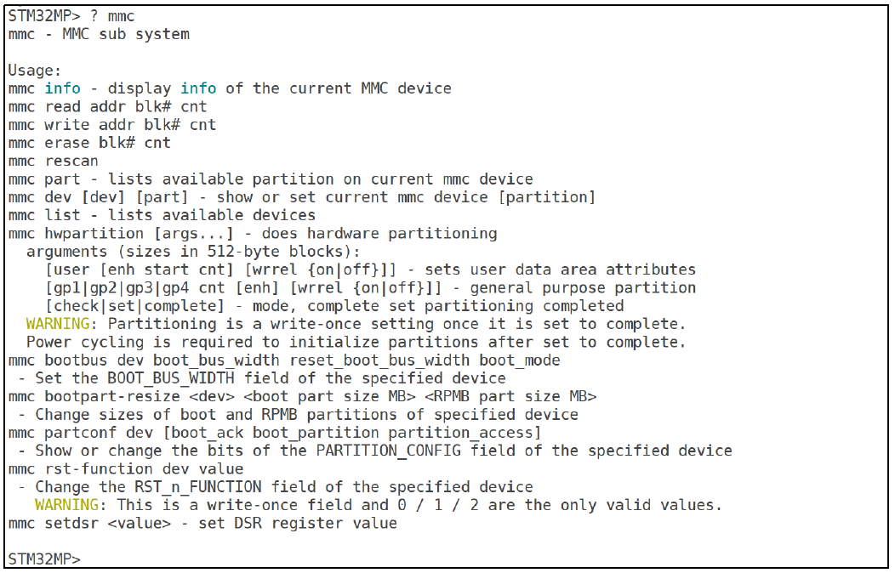
> 图：课件 Slide 23——`? mmc` 列出 MMC 子系统全部子命令：`mmc info`、`mmc read`、`mmc write`、`mmc erase`、`mmc rescan`、`mmc part`、`mmc dev`、`mmc list`、`mmc hwpartition`（附 WARNING：硬件分区是 write-once 设置）、`mmc bootbus`、`mmc bootpart-resize`、`mmc partconf`、`mmc rst-function`（附 WARNING：write-once 字段）、`mmc setdsr`。


> 图：课件 Slide 24——mmc 命令速查表：info/read/write/rescan/part/dev/list/hwpartition/bootbus/bootpart/partconf/rst/setdsr 各一句话说明。

本篇的安排：`info`、`list`、`dev`、`part`、`read` 五条动手（步骤 2~6）；`write`、`erase` 只认格式；`hwpartition`、`bootbus`、`partconf`、`rst-function` 这几条高危 write-once 只在帮助里见一见（步骤 7 说为什么）。

**实际执行结果**（2026-09-24 实测）：`? mmc` 打出 15 条子命令，与课件 Slide 23 逐条对得上（顺序也一样），两条 WARNING 都在：

```
STM32MP> ? mmc
mmc - MMC sub system

Usage:
mmc info - display info of the current MMC device
mmc read addr blk# cnt
mmc write addr blk# cnt
mmc erase blk# cnt
mmc rescan
mmc part - lists available partition on current mmc device
mmc dev [dev] [part] - show or set current mmc device [partition]
mmc list - lists available devices
mmc hwpartition [args...] - does hardware partitioning
  arguments (sizes in 512-byte blocks):
    [user [enh start cnt] [wrrel {on|off}]] - sets user data area attributes
       [gp1|gp2|gp3|gp4 cnt [enh] [wrrel {on|off}]] - general purpose partition
    [check|set|complete] - mode, complete set partitioning completed
  WARNING: Partitioning is a write-once setting once it is set to complete.
  Power cycling is required to initialize partitions after set to complete.
mmc bootbus dev boot_bus_width reset_boot_bus_width boot_mode
 - Set the BOOT_BUS_WIDTH field of the specified device
mmc bootpart-resize <dev> <boot part size MB> <RPMB part size MB>
 - Change sizes of boot and RPMB partitions of specified device
mmc partconf dev [boot_ack boot_partition partition_access]
 - Show or change the bits of the PARTITION_CONFIG field of the specified device
mmc rst-function dev value
 - Change the RST_n_FUNCTION field of the specified device
   WARNING: This is a write-once field and 0 / 1 / 2 are the only valid values.
mmc setdsr <value> - set DSR register value
```

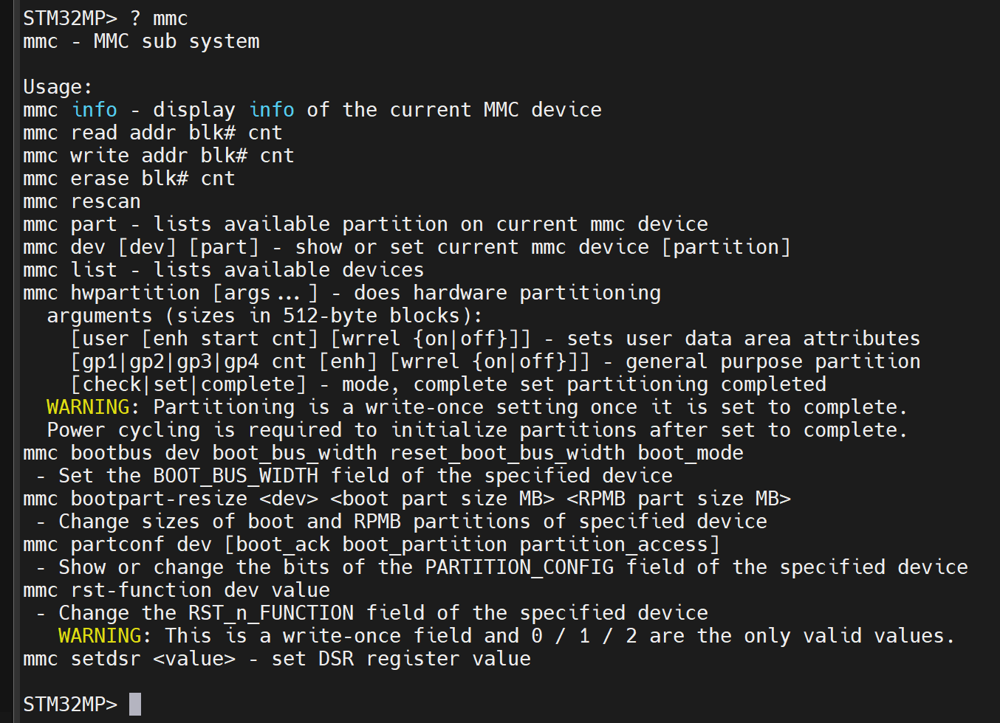
> 图：实测串口——`? mmc` 整屏输出，15 条子命令一屏装完；两处黄色 `WARNING` 分别跟在 `mmc hwpartition`（"Partitioning is a write-once setting once it is set to complete" + 设完必须断电重启才生效）和 `mmc rst-function`（"This is a write-once field and 0 / 1 / 2 are the only valid values"）下面。步骤 7 讲的三条红线，出处就是这两行。

该读的是**参数写法**而不是条数：`mmc read addr blk# cnt` / `mmc write addr blk# cnt` / `mmc erase blk# cnt` 三条的地址与扇区号都是裸十六进制（不带 `0x`），而 `mmc dev [dev] [part]` 方括号表示可省——省掉参数就是"只报告当前设备"，这个区别步骤 2 和步骤 5 会各用一次。

### 步骤 2：当前设备是谁——mmc info + mmc list（Slide 25~26）

```
STM32MP> mmc dev
STM32MP> mmc info
STM32MP> mmc list
```

`mmc dev` 不带参数 = 只报告当前设备（不带 `dev [dev]` 时是 show 不是 set）。课件板从 eMMC 启动，所以课件截图里当前设备是 eMMC：


> 图：课件 Slide 25——`mmc info` 报 eMMC：Name 8GTF4、`Mode: MMC High Speed (52MHz)`、Capacity 7.3 GiB、`Bus Width: 8-bit`、Boot Capacity 4 MiB、RPMB Capacity 512 KiB。


> 图：课件 Slide 26——`mmc list` 列出 `STM32 SD/MMC: 0` 与 `STM32 SD/MMC: 1 (eMMC)`：0 号 SD 卡、1 号 eMMC。

我们从 SD 卡启动，**当前设备应是 0 号**——`mmc info` 会报 SD 卡的信息，和课件截图报道的设备不同源，属于正常现象（步骤 3 会专门看 SD 卡的信息，此处先把命令跑通、把 `mmc list` 的"0 = SD、1 = eMMC"记牢）。

**实际执行结果**（2026-09-24 实测）：三条命令连着敲：

```
STM32MP> mmc dev
switch to partitions #0, OK
mmc0 is current device
STM32MP> mmc info
Device: STM32 SD/MMC
Manufacturer ID: 3
OEM: 5344
Name: SD32G
Bus Speed: 50000000
Mode: SD High Speed (50MHz)
Rd Block Len: 512
SD version 3.0
High Capacity: Yes
Capacity: 29.7 GiB
Bus Width: 4-bit
Erase Group Size: 512 Bytes
STM32MP> mmc list
STM32 SD/MMC: 0 (SD)
STM32 SD/MMC: 1
```

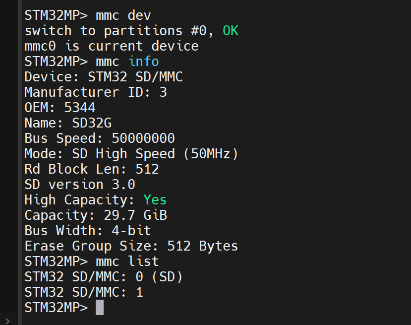
> 图：实测串口——一屏三条命令：`mmc dev` 报 `mmc0 is current device`；`mmc info` 报 SD 卡全套参数（`Name: SD32G`、`Capacity: 29.7 GiB`、`Bus Width: 4-bit`、`Mode: SD High Speed (50MHz)`）；`mmc list` 两行 `STM32 SD/MMC: 0 (SD)` 与 `STM32 SD/MMC: 1`。

逐行读四件事：

- **默认当前设备就是 0 号**（`mmc0 is current device`）——和"我们从 SD 卡启动"对上；课件板报 eMMC 是它的启动方式不同，不是谁配错了。
- `mmc info` 报的是**卡**：`Name: SD32G`、`Capacity: 29.7 GiB`（32GB 卡扣掉保留区后的可用容量，与课件 14.8 GiB 同一路数）、`Bus Width: 4-bit`、`Mode: SD High Speed (50MHz)`、`SD version 3.0`。`Manufacturer ID: 3` / `OEM: 5344` 是卡厂编码，与课件的 8GTF4 那套不同——**认卡认 Name 和 Capacity，别对 ID**。
- `Erase Group Size: 512 Bytes` 这行是步骤 7 讲"为什么写操作危险"时的背景：擦除以擦除组为最小单位，SD 卡这里是 512 字节（一个扇区）。
- `mmc list` 两行 = 两个控制器都在场（实验十 F-6 那句 `MMC: STM32 SD/MMC: 0, STM32 SD/MMC: 1` 的延续）。**后缀与课件不同**：我们这版给 0 号打了 `(SD)`、1 号留空；课件那版 0 号留空、1 号打 `(eMMC)`。这个后缀是 U-Boot 现场判断出来贴的标签，不同版本打法不一样——**认设备只认序号，再拿 `mmc info` 的 Name 复核，别认后缀**（1 号没写 eMMC 不代表它不是 eMMC，步骤 4 的 `mmc part` 会直接给出它的分区表）。

### 步骤 3：mmc dev 0——切到 SD 卡看信息（Slide 27~28）

```
STM32MP> mmc dev 0
STM32MP> mmc info
```

`mmc dev 0` 的回显（课件 Slide 27 同款结构）：

```
switch to partitions #0, OK
mmc0 is current device
```


> 图：课件 Slide 27——`mmc dev 0` 从 eMMC 切到 SD 卡：`switch to partitions #0, OK`、`mmc0 is current device`。

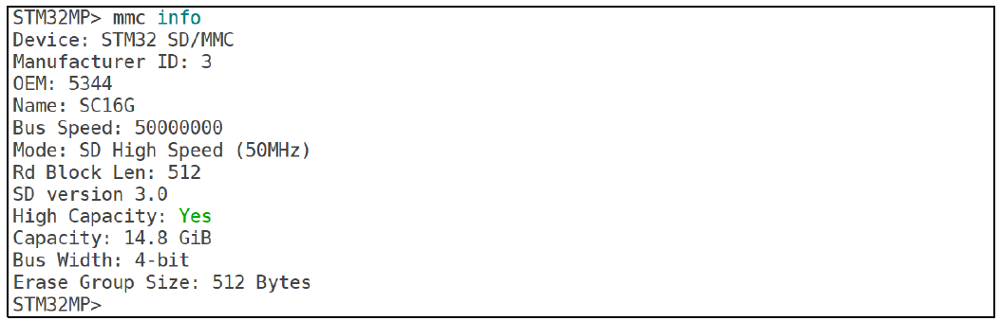
> 图：课件 Slide 28——切到 SD 卡后的 `mmc info`：Name SC16G、`Mode: SD High Speed (50MHz)`、`SD version 3.0`、Capacity 14.8 GiB、`Bus Width: 4-bit`、`Erase Group Size: 512 Bytes`。

对照着看 SD 卡与 eMMC 的参数差异（课件两图互为对照，我们也一样）：SD 卡 `Bus Width: 4-bit`、eMMC `8-bit`（实验十的 `mmc info` 见过 8-bit——F-1 固定电源 + F-6 `bus-width=<8>` 兑现的那条）；Name/Manufacturer 与课件的 SC16G 不同属正常。

**实际执行结果**（2026-09-24 实测）：

```
STM32MP> mmc dev 0
switch to partitions #0, OK
mmc0 is current device
STM32MP> mmc info
Device: STM32 SD/MMC
Manufacturer ID: 3
OEM: 5344
Name: SD32G
Bus Speed: 50000000
Mode: SD High Speed (50MHz)
Rd Block Len: 512
SD version 3.0
High Capacity: Yes
Capacity: 29.7 GiB
Bus Width: 4-bit
Erase Group Size: 512 Bytes
```

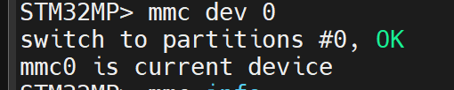
> 图：实测串口——`mmc dev 0` 的两行回显 `switch to partitions #0, OK` / `mmc0 is current device`，与课件 Slide 27 结构一致。

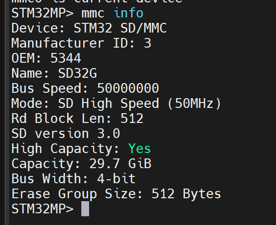
> 图：实测串口——SD 卡的 `mmc info` 全 12 行：`Name: SD32G`、`Capacity: 29.7 GiB`、`Bus Width: 4-bit`、`Mode: SD High Speed (50MHz)`、`SD version 3.0`、`High Capacity: Yes`、`Rd Block Len: 512`、`Erase Group Size: 512 Bytes`。

两点如实记录，别当成"切设备一定有新东西"：

1. **我们这一步是"原地确认"**：默认当前设备本来就是 `mmc0`（步骤 2 实测），所以 `mmc dev 0` 的回显与步骤 2 的 `mmc dev` 一字不差。课件那一步是**真切换**（它默认在 eMMC），所以它的回显有"换设备"的信息量。想在我们的板上看到真正的切换，看步骤 4 的 `mmc dev 1`。
2. **容量这一栏对上了预判**：32GB 卡报 `29.7 GiB`（课件 16GB 卡报 14.8 GiB，同一比例）；`Bus Width: 4-bit` 也和 eMMC 的 8-bit 形成对照——**这条差异是设备本身的，不是我们配错**。

### 步骤 4：mmc part——给 eMMC 摸底（Slide 30~31）

这是本篇最重要的一步。切到 1 号设备，看它的分区表：

```
STM32MP> mmc dev 1
STM32MP> mmc part
```


> 图：课件 Slide 31——先 `mmc dev 1`（`mmc1(part 0) is current device`）再 `mmc part`：`Partition Map for MMC device 1 -- Partition Type: EFI`，三个分区：第 1 分区 `ssbl`（0x400~0x13ff，放 U-Boot 镜像）、第 2 分区 `boot`（0x1400~0x213ff，放内核，attrs 带legacy boot 标志）、第 3 分区 `rootfs`（0x21400~0xe8fbff，根文件系统，占满剩余空间），并附各分区的 Type GUID 与 Partition GUID。

开工前这篇文档留了两种可能（带出厂系统 / 空盘），**实测落在第一种，而且比课件还多两个分区**：

**实际执行结果**（2026-09-24 实测，本篇最重要的一张地图）：

```
STM32MP> mmc dev 1
switch to partitions #0, OK
mmc1(part 0) is current device
STM32MP> mmc part

Partition Map for MMC device 1  --   Partition Type: EFI

Part    Start LBA       End LBA         Name
        Attributes
        Type GUID
        Partition GUID
  1     0x00000022      0x00001021      "ssbl"
        attrs:  0x0000000000000000
        type:   ebd0a0a2-b9e5-4433-87c0-68b6b72699c7
        type:   data
        guid:   8ef917d1-2c6f-4bd0-a5b2-331a19f91cb2
  2     0x00001022      0x00021021      "bootfs"
        attrs:  0x0000000000000004
        type:   ebd0a0a2-b9e5-4433-87c0-68b6b72699c7
        type:   data
        guid:   77877125-add0-4374-9e60-02cb591c9737
  3     0x00021022      0x00029021      "vendorfs"
        attrs:  0x0000000000000000
        type:   ebd0a0a2-b9e5-4433-87c0-68b6b72699c7
        type:   data
        guid:   b4b84b8a-04e3-48ae-8536-aff5c9c495b1
  4     0x00029022      0x0028d021      "rootfs"
        attrs:  0x0000000000000000
        type:   ebd0a0a2-b9e5-4433-87c0-68b6b72699c7
        type:   data
        guid:   491f6117-415d-4f53-88c9-6e0de54deac6
  5     0x0028d022      0x0075ffde      "userfs"
        attrs:  0x0000000000000000
        type:   ebd0a0a2-b9e5-4433-87c0-68b6b72699c7
        type:   data
        guid:   35219908-c613-4b08-9322-3391ff571e19
```

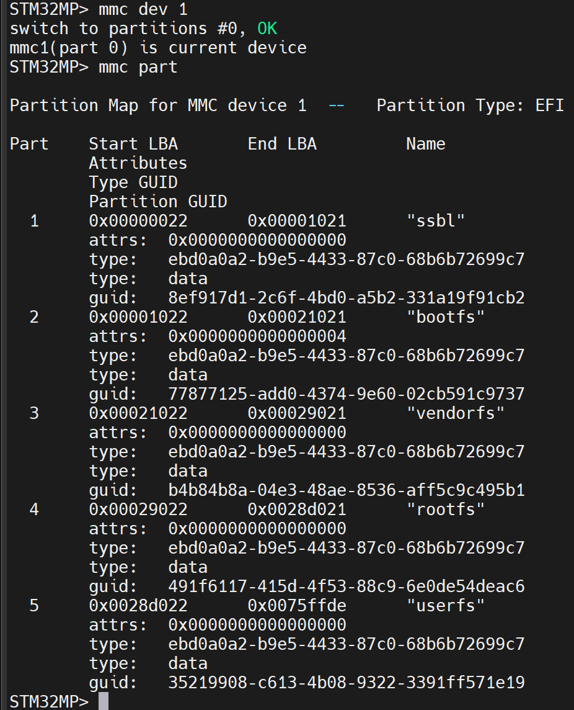
> 图：实测串口——`mmc dev 1` 报 `mmc1(part 0) is current device` 后 `mmc part` 打出 `Partition Map for MMC device 1 -- Partition Type: EFI`，五个分区一次列全：`ssbl` / `bootfs` / `vendorfs` / `rootfs` / `userfs`；每个分区下面三行元数据（`attrs`、`type`、`guid`），其中 `type` 会连打两遍——先给原始 GUID `ebd0a0a2-…`，再给它的可读名 `data`（这是 GPT 里"基本数据分区"那个众所周知 GUID）。五行的 Start/End LBA 全是 8 位十六进制且首尾相接（上一个 End + 1 = 下一个 Start），没有重叠也没有空洞。

把这张表换算成"能记住的尺寸"（扇区数 = End − Start + 1，一个扇区 512 字节）：

| 分区号 | 名字 | Start LBA ~ End LBA | 扇区数 | 容量 | 这一格该装什么 |
|---|---|---|---|---|---|
| 1 | `ssbl` | `0x22` ~ `0x1021` | 4,096 | 2 MiB | U-Boot 镜像（ssbl = Secondary Program Loader，与 SD 卡 3 号分区同名同职） |
| 2 | `bootfs` | `0x1022` ~ `0x21021` | 131,072 | 64 MiB | 内核 + 设备树那一类启动文件；**attrs = `0x4`（legacy BIOS bootable 标志），与课件 `boot` 分区那一栏对上了** |
| 3 | `vendorfs` | `0x21022` ~ `0x29021` | 32,768 | 16 MiB | 厂商分区（出厂附带），本系列全程不碰 |
| 4 | `rootfs` | `0x29022` ~ `0x28d021` | 2,375,680 | 1.13 GiB | 根文件系统 |
| 5 | `userfs` | `0x28d022` ~ `0x75ffde` | 5,058,493 | 2.41 GiB | 用户数据区 |

表尾复核：最后一个扇区 `0x75ffde` = 7,733,214，×512 ≈ **3.69 GiB**，与实验十 `mmc info` 报的 `Capacity: 3.7 GiB` 吻合——说明分区表铺满了整个用户区，没有"表外空间"。

三条结论直接给后面两篇用：

1. **课件通篇写的 `mmc 1:2`，在我们板上不用改**——2 号分区就叫 `bootfs`，位置（64 MiB）和 attrs（legacy boot 标志）都和课件那个 `boot` 分区同一路数。实验十五的 `ext4ls mmc 1:2` / `ext4write mmc 1:2 ...` 可以照抄。
2. **但"分区存在"不等于"里面有 ext4、里面有文件"**：出厂系统的分区表在，内容却被我们前几章反复折腾过（我们往 SD 卡上烧过自己的 U-Boot，eMMC 一直没动过）。**里面到底有没有东西，是实验十五第一条 `ext4ls mmc 1:2` 要回答的问题**——那一步如果列出文件，本条结论 1 才算完全落地；如果报空或报"not a valid ext4"，就按实验十五的备用分支走（自己 `mmc` + 格式化一个分区来练）。
3. **和 SD 卡的布局差异**：SD 卡是实验四我们亲手分的 `fsbl1 / fsbl2 / ssbl / bootfs / rootfs`（两个 fsbl 副本 + 一个 ssbl），eMMC 这套出厂表里**只有一个 `ssbl`，没有 fsbl1/fsbl2，却多了 `vendorfs` 和 `userfs`**。这不代表 eMMC 里没有 TF-A——原因就在 `mmc info` 的 `Boot Capacity` 那一行（本节末尾实测给出）。**至于 boot 区里到底装的什么，本篇不验，等实验十七真要从 eMMC 启动时再说**（届时先看 `mmc partconf` 的只读显示，别写）。

**补一发（本篇验证判据要）**：步骤 2/3 只看了 SD 卡的 `mmc info`，eMMC 这边补上——换过板子后 `Name: 004GA`、`MMC version 5.0`、`Capacity: 3.7 GiB`、`Bus Width: 8-bit` 这四行必须重新对一遍（尤其 `8-bit`，它是 F-1 固定电源 + F-6 `bus-width=<8>` 的兑现证据）。

```
STM32MP> mmc dev 1
STM32MP> mmc info
```

**实际执行结果**（2026-09-24 实测，四行全部对上，新板没退化）：

```
STM32MP> mmc dev 1
switch to partitions #0, OK
mmc1(part 0) is current device
STM32MP> mmc info
Device: STM32 SD/MMC
Manufacturer ID: 11
OEM: 100
Name: 004GA
Bus Speed: 52000000
Mode: MMC High Speed (52MHz)
Rd Block Len: 512
MMC version 5.0
High Capacity: Yes
Capacity: 3.7 GiB
Bus Width: 8-bit
Erase Group Size: 512 KiB
HC WP Group Size: 4 MiB
User Capacity: 3.7 GiB WRREL
Boot Capacity: 2 MiB ENH
RPMB Capacity: 512 KiB ENH
```

拿它和步骤 3 的 SD 卡逐项并排，`mmc info` 这张表才算真读通了（左列数据来自步骤 3 实测）：

| 行 | SD 卡（mmc 0） | eMMC（mmc 1） | 该读出什么 |
|---|---|---|---|
| `Name` | `SD32G` | `004GA` | 型号名，认设备先看这一行 |
| Manufacturer ID / OEM | `3` / `5344` | `11` / `100` | 厂商编码，两块卡不同厂，**别拿它当身份** |
| `Bus Speed` / `Mode` | `50000000` / `SD High Speed (50MHz)` | `52000000` / `MMC High Speed (52MHz)` | 各自规范里的"高速档"，数值接近但**不是一回事** |
| 版本行 | `SD version 3.0` | `MMC version 5.0` | SD 规范 3.0 / eMMC 规范 5.0 |
| `Capacity` | `29.7 GiB` | `3.7 GiB` | 与上面的 32GB / 4GB 标称对得上 |
| `Bus Width` | **`4-bit`** | **`8-bit`** | eMMC 快一倍的来源之一；这一行是 F-1 + F-6 的验收位 |
| `Erase Group Size` | `512 Bytes` | **`512 KiB`** | **差 1024 倍**：eMMC 上"擦一下"的破坏半径以擦除组为单位铺开，这是步骤 7 那条红线最量化的理由 |
| `HC WP Group Size` | （无此行） | `4 MiB` | 写保护组大小，SD 卡不报 |
| `User/Boot/RPMB Capacity` | （无这三行） | `3.7 GiB WRREL` / **`2 MiB ENH`** / `512 KiB ENH` | **eMMC 独有的硬件分区**：用户区、boot1/boot2（各 2 MiB）、RPMB（512 KiB）。步骤 5 那套"访问窗口"能切来切去，切的就是这几块 |

`Boot Capacity: 2 MiB ENH` 这一行顺手把上面**结论 3** 补实了：eMMC 自带 2 MiB 的 boot 硬件分区，SD 卡没有——所以 eMMC 的 GPT 表里不出现 `fsbl1`/`fsbl2` 完全正常，TF-A 是写进 boot 硬件分区的，不占用户区的 GPT 名额。再回看步骤 5 的探针：切到窗口 `#2`（boot2）读到的是全零，说明出厂只用了一个 boot 区（boot2 空着）。**boot1 里到底是不是 TF-A，本篇不验证**（要验就 `mmc dev 1 1` 之后 `mmc read c0000000 0 1` + `md.b`，纯读；留给实验十七碰 eMMC 启动时一起做）。

顺带拿 SD 卡对照一下（切回 0 号看它的分区表——那是实验四我们自己分的五区）：

```
STM32MP> mmc dev 0
STM32MP> mmc part
```

**实际执行结果**（2026-09-24 实测）：

```
STM32MP> mmc dev 0
switch to partitions #0, OK
mmc0 is current device
STM32MP> mmc part

Partition Map for MMC device 0  --   Partition Type: EFI

Part    Start LBA       End LBA         Name
        Attributes
        Type GUID
        Partition GUID
  1     0x00000022      0x00000221      "fsbl1"
        attrs:  0x0000000000000000
        type:   0fc63daf-8483-4772-8e79-3d69d8477de4
        type:   linux
        guid:   a8efd59c-e6fb-443d-9e1e-78f55b02c9c0
  2     0x00000222      0x00000421      "fsbl2"
        attrs:  0x0000000000000000
        type:   0fc63daf-8483-4772-8e79-3d69d8477de4
        type:   linux
        guid:   ac6f9d2a-a326-4f03-96d3-d105165951fe
  3     0x00000422      0x00001421      "ssbl"
        attrs:  0x0000000000000000
        type:   0fc63daf-8483-4772-8e79-3d69d8477de4
        type:   linux
        guid:   8252cf1b-d48f-4a19-8660-bdd70c6489d7
  4     0x00001422      0x00021421      "bootfs"
        attrs:  0x0000000000000004
        type:   0fc63daf-8483-4772-8e79-3d69d8477de4
        type:   linux
        guid:   68d03b73-7ce1-4471-a822-fcb51549deef
  5     0x00021422      0x03b77fde      "rootfs"
        attrs:  0x0000000000000000
        type:   0fc63daf-8483-4772-8e79-3d69d8477de4
        type:   linux
        guid:   f9e88da6-6a27-44b6-8fe2-c7545f625cb4
```

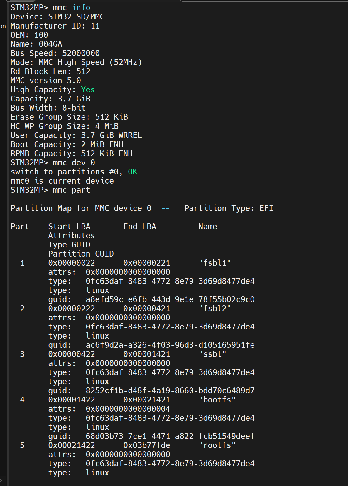
> 图：实测串口（一屏两件事）——上半屏是 1 号设备的 `mmc info`：`Name: 004GA`、`MMC version 5.0`、`Capacity: 3.7 GiB`、`Bus Width: 8-bit`、`Erase Group Size: 512 KiB`，末尾三行 `User Capacity: 3.7 GiB WRREL` / `Boot Capacity: 2 MiB ENH` / `RPMB Capacity: 512 KiB ENH` 是 SD 卡不会有的；下半屏是 `mmc dev 0` 切回 SD 卡后的 `mmc part`：`Partition Map for MMC device 0`，五个分区 `fsbl1` / `fsbl2` / `ssbl` / `bootfs` / `rootfs`，每个分区的 `type` 都连打两遍（GUID + 可读名 `linux`）。

换算成尺寸（扇区数 = End − Start + 1，×512 字节）：

| 分区号 | 名字 | Start LBA ~ End LBA | 扇区数 | 容量 | 装什么 |
|---|---|---|---|---|---|
| 1 | `fsbl1` | `0x22` ~ `0x221` | 512 | 256 KiB | TF-A 主副本（实验四烧写时 `dd` 进去的 `fsbl1.stm32`） |
| 2 | `fsbl2` | `0x222` ~ `0x421` | 512 | 256 KiB | TF-A 备份副本 |
| 3 | `ssbl` | `0x422` ~ `0x1421` | 4,096 | 2 MiB | U-Boot（我们自编的 trusted 版就在这里） |
| 4 | `bootfs` | `0x1422` ~ `0x21421` | 131,072 | 64 MiB | 实验四只建了分区、**还没做文件系统** |
| 5 | `rootfs` | `0x21422` ~ `0x3b77fde` | 62,221,245 | 29.7 GiB | 同上，留给第 6 章 |

表尾复核：`0x3b77fde` = 62,357,470 号扇区，×512 ≈ **29.67 GiB**，与步骤 3 `mmc info` 的 `Capacity: 29.7 GiB` 吻合——SD 卡也是铺满用户区。

两张表并排，三条对照值得记：

1. **`attrs: 0x4` 落在不同的分区号上**：SD 卡带 legacy-boot 标志的是 **4 号** `bootfs`，eMMC 带它的是 **2 号** `bootfs`。**同一个角色、两个号**——所以 ext4 那三条命令里的分区号必须按设备查表：eMMC 是 `mmc 1:2`，SD 卡是 `mmc 0:4`。这是本篇最实用的一条。
2. **`type` 那一行给了两个不同的可读名**：SD 卡五个分区都是 `0fc63daf-8483-4772-8e79-3d69d8477de4` → U-Boot 认得它、打第二行 `linux`；eMMC 那五个是 `ebd0a0a2-b9e5-4433-87c0-68b6b72699c7` → 打 `data`。同一张 GPT 的两类标签，正好反映两套分区工具（SD 卡是实验四我们按 ST 官方脚本分的，eMMC 是出厂分区）。
3. **`ssbl` 两边都是 2 MiB，起点不同**：eMMC 的 `ssbl` 紧跟 GPT（`0x22` 起），SD 卡的前面还压着 `fsbl1`/`fsbl2` 两个 256 KiB 副本（所以 `ssbl` 从 `0x422` 起）。**SD 卡需要两个 fsbl 副本是因为它没有 boot 硬件分区，只能自己在用户区里做双备份**；eMMC 有 boot1/boot2 可以用（见上面 `Boot Capacity: 2 MiB ENH`）。

### 步骤 5：mmc dev 1 2——把分区设为当前设备（Slide 29）

mmc 设备本身还分硬件分区，`mmc dev` 的第二个参数可以直接把某个**软件分区**设为当前：

```
STM32MP> mmc dev 1 2
```


> 图：课件 Slide 29——`mmc dev 1 2` 把 eMMC 的 2 号分区设为当前：`switch to partitions #2, OK`、`mmc1(part 2) is current device`——注意回显里的 `(part 2)` 后缀（实验十 `mmc dev 1` 时见过的 `(part 0)` 就是这个位置）。

**实际执行结果**（2026-09-24 实测）：

```
STM32MP> mmc dev 1 2
switch to partitions #2, OK
mmc1(part 2) is current device
```

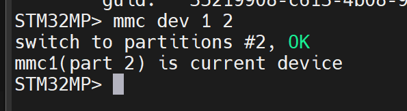
> 图：实测串口——`mmc dev 1 2` 的两行回显与课件 Slide 29 一字不差：`switch to partitions #2, OK`、`mmc1(part 2) is current device`；截图顶行还能看到上一步 `mmc part` 输出的最后一个 guid（`35219908-c613-4b08-9…` = 5 号 `userfs`），说明这条命令是在打完分区表之后紧接着敲的。

回显结构对上了，但**这个 `2` 到底是什么编号，得说清楚——它和实验十五 ext4 命令里的 `mmc 1:2` 不是同一个东西**：

- 课件与本篇旧稿都写作"把某个分区设为当前"，容易读成"切到 GPT 的 2 号分区"；
- 可实测回显给了反证：**不带第二个参数时它打的是 `switch to partitions #0`（见步骤 2、3、4 每一张截图），而 GPT 表里最小是 1 号分区，根本没有 0 号**。所以这个编号是另一套体系——eMMC 芯片自己的**硬件分区访问窗口**（EXT_CSD 的 `PARTITION_CONFIG` 字段：0 = 用户区、1/2 = boot1/boot2、3 = RPMB、4~7 = GP1~GP4），`? mmc` 帮助里 `mmc partconf` 那一行说的就是这个字段；
- 换句话说：`mmc dev 1 2` 是把"读写窗口"挪到 eMMC 的 boot2 硬件区，**不是**选中 `bootfs`。ext4 那三条命令里的 `1:2` 才是 GPT 分区号，两套编号各走各的。

这条差异用一条**只读探针**当场定案（全程只有读，不写任何东西）：

```
STM32MP> mmc dev 1 2
STM32MP> mmc part          ← 看五分区表还在不在
STM32MP> mmc dev 1         ← 回到 0 号窗口（用户区）
STM32MP> mmc part          ← 表应当重新出现
```

**实际执行结果**（2026-09-24 实测，结论一次到底）：

```
STM32MP> mmc dev 1 2
switch to partitions #2, OK
mmc1(part 2) is current device
STM32MP> mmc part

Partition Map for MMC device 1  --   Partition Type: EFI

GUID Partition Table Header signature is wrong: 0x0 != 0x5452415020494645
find_valid_gpt: *** ERROR: Invalid GPT ***
GUID Partition Table Header signature is wrong: 0x0 != 0x5452415020494645
find_valid_gpt: *** ERROR: Invalid Backup GPT ***
STM32MP> mmc dev 1
switch to partitions #0, OK
mmc1(part 0) is current device
STM32MP> mmc part

Partition Map for MMC device 1  --   Partition Type: EFI

Part    Start LBA       End LBA         Name
        Attributes
        Type GUID
        Partition GUID
  1     0x00000022      0x00001021      "ssbl"
  ……（五个分区原样重现，与步骤 4 那张一字不差，此处从略）
```

三行报错怎么读：

- **`0x5452415020494645` 就是 GPT 头的签名常量**——按字节倒着拼是 ASCII `"EFI PART"`（`45 46 49 20 50 41 52 54`）。U-Boot 期望在第 1 号逻辑块读到它，实际读到 `0x0`（全零），所以判定签名不符。
- **主表、备份表各报一次**（`Invalid GPT` + `Invalid Backup GPT`）：GPT 在盘头、盘尾各存一份，两份同时读不到，说明**不是哪里被写坏了，而是"读的位置"整片换掉了**。
- **`mmc dev 1` 回到 `#0` 后五分区表原样列出**：分区表一直好端端在那，只是刚才那一眼不在同一个窗口里。

于是这一节定案：

> **`mmc dev [dev] [part]` 的第二个参数是 eMMC 的硬件分区访问窗口号**（EXT_CSD 的 `PARTITION_CONFIG` 字段：`0` = 用户区、`1`/`2` = boot1/boot2、`3` = RPMB、`4~7` = GP1~GP4），**与 GPT 分区号无关**。课件 Slide 29 那句"把 eMMC 的 2 号分区设为当前"，在我们板上按实测应读作"把读写窗口切到硬件分区 #2（boot2）"。
>
> 这一发只证明了"boot2 窗口开头没有 GPT"。华清的 FSBL 到底落在哪个窗口的哪些扇区，本篇**不猜**——那是实验十七要碰 eMMC 启动时才需要弄清的事。

**这条定案有个直接的安全后果**：万一哪天你在 `mmc dev 1 2` 的状态下敲 `mmc write` / `mmc erase`，动的是 **boot2 硬件区**，而不是你以为的 `bootfs`——写错对象还看不出来。这就是注意事项 5"练完必须 `mmc dev 1` 回 `#0`"的硬理由，步骤 6 的实测截图开头正是这一条。

### 步骤 6：mmc read——从存储读扇区到 DRAM（Slide 32~33）

命令格式（课件 Slide 32）：`mmc read addr blk# cnt`——`addr` 是 DRAM 目标地址，`blk#` 是起始扇区号，`cnt` 是扇区数（一个扇区 512 字节）。三个参数都是十六进制。把 eMMC 从 `0x400` 扇区起的 16 个扇区读到 `0xc0000000`：

```
STM32MP> mmc dev 1
STM32MP> mmc read c0000000 400 10
```

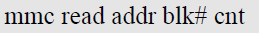
> 图：课件 Slide 32——`mmc read` 命令格式文本：`mmc read addr blk# cnt`。

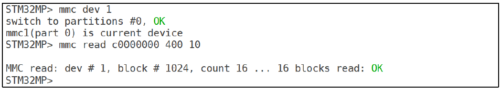
> 图：课件 Slide 33——`mmc read c0000000 400 10` 的回显：`MMC read: dev # 1, block # 1024, count 16 ... 16 blocks read: OK`。课件特别提醒：**回显里的 1024 和 16 是十进制**。

**实际执行结果**（2026-09-24 实测）：

```
STM32MP> mmc dev 1
switch to partitions #0, OK
mmc1(part 0) is current device
STM32MP> mmc read c0000000 400 10
MMC read: dev # 1, block # 1024, count 16 ... 16 blocks read: OK
STM32MP>
```

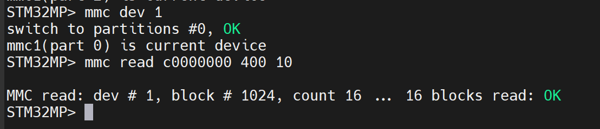
> 图：实测串口——开头两行是步骤 5 结尾要求的"回到用户区视角"（`switch to partitions #0, OK` / `mmc1(part 0) is current device`），随后 `mmc read c0000000 400 10` 一次成功：`MMC read: dev # 1, block # 1024, count 16 ... 16 blocks read: OK`，绿色 `OK` 收尾。

三点读法：

- **进制彩蛋（本篇最容易看错的一处）**：命令里 `400`、`10` 按十六进制解释，回显报的 `1024`、`16` 是十进制（1024 = 0x400、16 = 0x10）。输入十六进制、回显十进制，两边对得上就说明命令没错，别看到"数字变了"就以为读错了地方。
- **这次读到的是哪一块**：`0x400` = 第 1024 号扇区，落在步骤 4 那张表的 **1 号分区 `ssbl`（`0x22`~`0x1021`）区间内**，也就是 eMMC 上放 U-Boot 镜像的地方；16 个扇区 = 8,192 字节，被搬进 DRAM 的 `0xc0000000` 起。
- **为什么 `0xc0000000` 敢拿来当临时落点**：U-Boot 早就把自己重定位到 DRAM 上端了（实验十二 `bdinfo` 实测 `relocaddr = 0xd9f39000`），低端这几 MB 在它跑起来之后是可用空间，所以课件拿 `c0000000` 当"随便倒一倒"的中转地址是安全的。内核镜像另用 `c2000000`（实验十三起全系列统一），正是为了和这类临时缓冲区错开。

**深入一步（可选，本篇没做）**：`mmc read` 只负责把数据搬进 DRAM，要看内容用 `md.b c0000000 40`（memory display，按字节显示）。配合步骤 4 表里的 Start LBA，可以挑任何分区的开头几扇区瞅原始数据长什么样——读操作不动内容，放心试。

**顺手发现（实测）**：`mmc read` 不带参数直接回车，U-Boot 不会只报"缺参数"，而是把**整族 `mmc` 帮助**重新打一遍——和步骤 1 那句 `? mmc` 同一屏内容。忘了语法时不必往上翻记录，敲一句裸 `mmc read` 就能重看参数写法和那两条 WARNING。

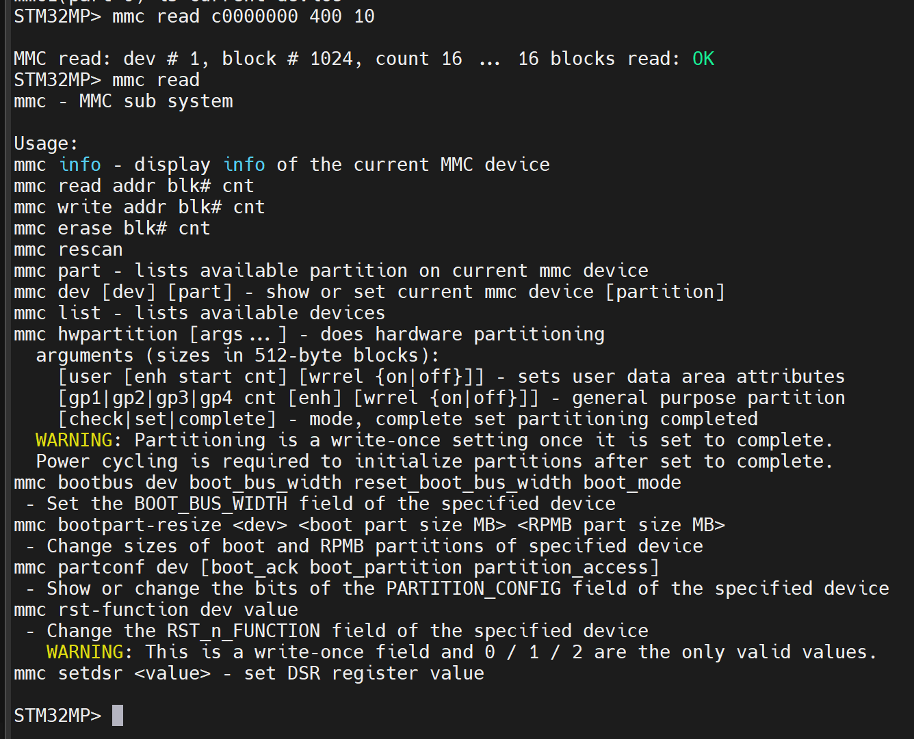
> 图：实测串口——`mmc read c0000000 400 10` 成功之后紧接着敲了一个不带参数的 `mmc read`，屏幕重新出现完整的 `mmc - MMC sub system` / `Usage:` 帮助（15 条子命令、两条黄色 WARNING 全在，与步骤 1 那张实测图同源同构），末尾回到 `STM32MP>`。

### 步骤 7：write / erase / 高危命令——只认格式，不动手（Slide 34 + Slide 23 的 WARNING）

课件 Slide 34 给了两条写类命令的格式：

```
mmc write addr blk# cnt     ; 把 DRAM 中数据写入当前设备（写入前相应区域需先 erase）
mmc erase blk# cnt          ; 擦除当前设备的数据
```

本篇**只认格式、不做练习**，三条红线：

1. **`mmc write` / `mmc erase` 直接改存储内容**：我们 SD 卡上是自己移植的 U-Boot、eMMC 上可能有出厂系统——一次手滑的 `erase` 就是"重走实验四"。真要用它的场景（裸写镜像）第 3 章已用 `dd` 在 PC 侧完成，更稳。
2. **`mmc hwpartition` 是 write-once 硬件分区**：`? mmc` 帮助里原文 `WARNING: Partitioning is a write-once setting`——eMMC 的硬件分区（Boot/RPMB）一旦设为 complete **永久生效**，没有任何撤销。看一眼格式即可。
3. **`bootbus` / `partconf` / `rst-function` 同族高危**：帮助里的 WARNING 同样写着 write-once（rst-function 只许写 0/1/2）。这些都是 eMMC 寄存器级配置，玩具期不碰。

认识危险本身就是本步骤的产出：`? mmc` 输出里两条 WARNING 的位置，现在知道在哪了。

**实际执行结果**：本篇按课件要求不动手，无实测记录。两条 write-once WARNING 的位置与 `mmc write` / `mmc erase` 的参数行，步骤 1 那张实测截图（`03_实测mmc子命令全列表.png`）里已经全部在场，不必另开一屏。

## 五、注意事项

1. **对结构不对数值**：课件截图的容量（14.8/7.3 GiB）、Name（SC16G/8GTF4）、分区表数字全是它的板子的，我们的板对不上就是正常——结构（设备序号、分区类型、回显格式）一致即可。
2. **默认当前设备 = 启动设备**：课件板报 eMMC、我们报 SD 卡，不是谁错了，是启动设备不同。
3. **两套"分区号"别混（本篇已用只读探针定案）**：步骤 4 `mmc part` 列出的 1~5 是 **GPT 分区号**（ext4 命令里的 `mmc 1:2` 用它，我们板上 2 号 = `bootfs`，与课件同号所以命令可照抄）；步骤 5 `mmc dev 1 2` 的那个 `2` 是 **eMMC 硬件分区的访问窗口号**（EXT_CSD `PARTITION_CONFIG`）。实测铁证：切到窗口 2 之后 `mmc part` 直接报 `Invalid GPT` / `Invalid Backup GPT`，`mmc dev 1` 回窗口 0 又原样列出五分区——**它挪走的是"读写窗口"，不是"选中的分区"**。
4. **读永远安全，写才是刀**：`mmc read`/`md.b` 放心玩；`write`/`erase`/`hwpartition` 及同族本篇不碰。
5. **练完回到"用户区视角"**：`mmc dev 1 2` 练完记得 `mmc dev 1`（回显应打 `switch to partitions #0, OK`）回去，否则下一篇会在"窗口停在 boot2"的状态下找不到文件。步骤 6 的实测截图开头正是这一条。

## 六、怎么验证

1. `mmc list` 能指出 0 = SD 卡、1 = eMMC——**已实测**（`STM32 SD/MMC: 0 (SD)` / `STM32 SD/MMC: 1`；后缀打法与课件不同，认序号不认后缀）；
2. `mmc dev 0` / `mmc dev 1` 来回切换，各自的 `mmc info` 报出不同参数（SD：4-bit、约 29.x GiB；eMMC：8-bit、3.7 GiB、004GA）——**两侧均已实测**：SD 卡 `SD32G` / `29.7 GiB` / `4-bit` / `SD version 3.0`；eMMC `004GA` / `3.7 GiB` / `8-bit` / `MMC version 5.0`（新板复测通过，F-1 + F-6 未退化）；
3. `mmc part` 对 eMMC 的分区表有了实测记录（后续两篇的地图）——**已实测**：GPT 五分区 ssbl / bootfs / vendorfs / rootfs / userfs，尾扇区 `0x75ffde` 换算 ≈3.69 GiB 与实验十报的 3.7 GiB 吻合；
4. `mmc read c0000000 400 10` 回 `16 blocks read: OK`，且能说出回显的 1024/16 是十进制——**已实测**（`MMC read: dev # 1, block # 1024, count 16 ... 16 blocks read: OK`）；
5. 说得出 `mmc dev 1 2` 的 `2` 与 ext4 命令 `mmc 1:2` 的 `2` **不是一套编号**，并知道撞见 `Invalid GPT` 时先 `mmc dev` 看自己停在哪个窗口——**已实测**（步骤 5 探针：切窗口 → GPT 两份都读不到 → 回 `#0` 表原样回来）；
6. `mmc write`/`erase`/`hwpartition` 三条红线说得出（步骤 7）——待复述。

不达标时的排查：

| 现象 | 先查什么 |
|---|---|
| `mmc dev 1` 后 `mmc info` 报错或空 | eMMC 没被识别？回想实验十的 `MMC: STM32 SD/MMC: 0, STM32 SD/MMC: 1` 横幅在不在 |
| `mmc part` 报无分区 | eMMC 可能是空盘——记录现状即可，不是故障；SD 卡（`mmc dev 0` + `mmc part`）可作替代练习对象 |
| `mmc part` 报 `GUID Partition Table Header signature is wrong: 0x0 != 0x5452415020494645` + `Invalid GPT` / `Invalid Backup GPT` | **九成是你还停在硬件分区窗口里**（刚敲过 `mmc dev 1 2` 之类）。先 `mmc dev` 看回显是 `part 几`，再 `mmc dev 1` 回到 `#0` 用户区，表就回来了——本篇步骤 5 实测过这条完整链路，盘没坏 |
| `mmc read` 报错 | 设备/窗口视角对吗（`mmc dev` 先确认）；扇区号是否超出设备容量 |

## 七、实验完成标志

- `? mmc` 总览实测：15 条子命令与课件逐条对得上，两条 write-once WARNING 的位置认得（步骤 1 实测；步骤 7 的红线复述待做）
- `mmc info` / `mmc list` 实测——默认当前设备 `mmc0`（与"从 SD 卡启动"一致），`mmc list` 两行 0/1 都在（步骤 2 实测）
- `mmc dev 0` + SD 卡 `mmc info` 实测：`Name: SD32G`、`Capacity: 29.7 GiB`、`Bus Width: 4-bit`、`Mode: SD High Speed (50MHz)`（步骤 3 实测；这一步在我们板上是"原地确认"，因为默认就是 0 号）
- **eMMC 分区表 `mmc part` 实测存档**（步骤 4 实测，本篇的地图）：GPT 五分区 `ssbl`(2 MiB) / `bootfs`(64 MiB，attrs 带 legacy-boot 标志) / `vendorfs`(16 MiB) / `rootfs`(1.13 GiB) / `userfs`(2.41 GiB)。**换过板子或重刷过 eMMC，这一条必须重做**
- eMMC 侧 `mmc info` 复测（步骤 4 补一发，2026-09-24 实测通过）：`004GA` / `MMC version 5.0` / `3.7 GiB` / `Bus Width: 8-bit` 四行在新板上全部对上，另读出 SD 卡没有的 `Boot Capacity: 2 MiB ENH` 与 `RPMB Capacity: 512 KiB ENH`——硬件分区窗口的物质基础
- SD 卡分区表对照（步骤 4 末尾，2026-09-24 实测）：五区 `fsbl1`(256 KiB) / `fsbl2`(256 KiB) / `ssbl`(2 MiB) / `bootfs`(64 MiB，attrs `0x4`) / `rootfs`(29.7 GiB)，与 eMMC 那张并排读出了"同一个角色、两个分区号"：eMMC 的 bootfs 是 2 号、SD 卡的是 4 号
- `mmc dev 1 2` 指定分区切换实测：`switch to partitions #2, OK` + `mmc1(part 2) is current device`（步骤 5 实测）；只读探针也已定案——该编号是**硬件分区访问窗口**而非 GPT 分区号（切窗口后 `mmc part` 报 `Invalid GPT`/`Invalid Backup GPT`，`mmc dev 1` 回 `#0` 后五分区表原样重现）
- `mmc read` 实测 `16 blocks read: OK`，十进制回显换算说得出，并知道 `0x400` 落在 1 号分区 `ssbl` 区间内（步骤 6 实测）

## 八、下一步：ext4 文件系统操作命令

下一篇覆盖 4.6 节（Slide 35-42）：`ext4ls` / `ext4load` / `ext4write`——不经过 PC，直接在 U-Boot 里看 eMMC 分区里的文件、读文件进内存、把内存数据写成文件。步骤 4 摸出来的分区表就是它的入场券：ext4 命令都得指名道姓"哪个设备哪个分区"。

本篇给实验十五留下的三个确定值：

1. **设备号与分区号都不用改课件的命令**——eMMC 是 1 号，2 号分区就叫 `bootfs`（64 MiB、attrs 带 legacy-boot 标志），所以课件的 `ext4ls mmc 1:2` 在我们板上原样可用；
2. **但"分区在"不等于"里面有 ext4 文件系统、里面有文件"**——`ext4ls mmc 1:2` 是实验十五的第一发，它列出文件才说明出厂系统还在里面；报空或报文件系统无效，就走实验十五的备用分支（自己格式化一个分区来练）。开跑前记得把本篇步骤 4 那张表抄在手边。
3. **两张地图都存好了，设备号别记混**：eMMC 的 `bootfs` 是 2 号（`mmc 1:2`），SD 卡的 `bootfs` 是 4 号（`mmc 0:4`）——想换到 SD 卡上练 ext4，号要跟着换；而且 SD 卡的 bootfs/rootfs 从实验四起一直没建文件系统，真要在它上面练得先在 Linux 侧 `mkfs.ext4`（U-Boot 里没有格式化命令）。
