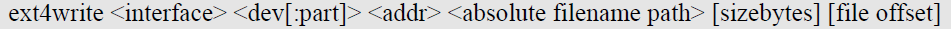
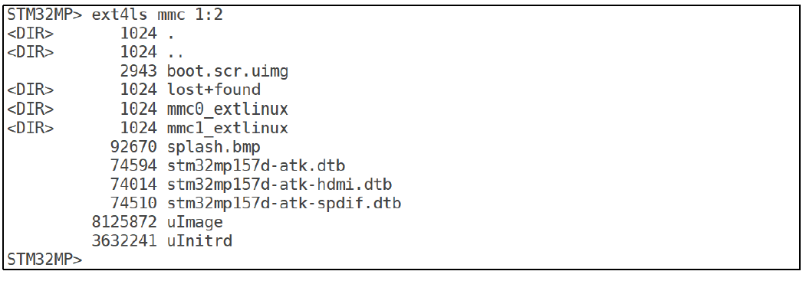
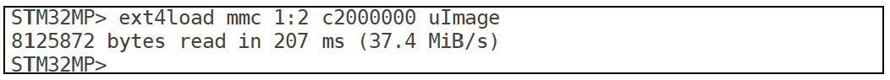
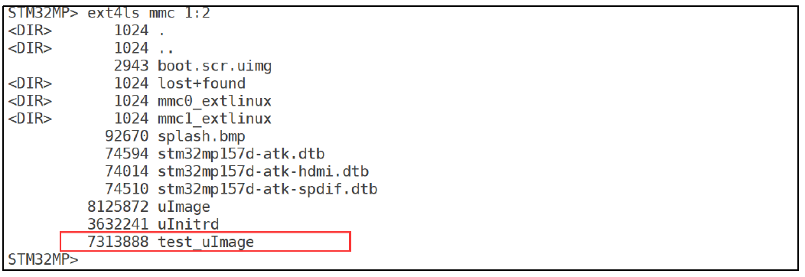

# 实验十五 ext4 文件系统操作命令——U-Boot 里的文件管理器

> **对应课件**：《第4章 使用U-Boot》4.6 节，Slide 35-42
>
> **系列说明**：本系列基于华清远见 FS-MP1A（STM32MP157A）开发板，对应课件《第4章 使用U-Boot》。`mmc read` 读的是裸扇区，可分区里的内容是有文件系统的——stm32mp1 的系统镜像分区都是 ext4 格式。U-Boot 内置了三条 ext4 命令：`ext4ls` 列目录、`ext4load` 读文件进内存、`ext4write` 把内存数据写成文件——相当于 U-Boot 里的"文件管理器"。本篇把三条全部过手，并用 tftp + ext4write 完成"从网络下载、落盘到 eMMC"的完整链路。本文覆盖 Slide 35-42。前置：实验十三（tftp 通）、实验十四（eMMC 分区表实测）。

## 一、先认门牌号：<interface> <dev:part>

ext4 三条命令都绕不开一个地址格式——"哪个设备哪个分区"：

```
ext4ls <interface> [<dev[:part]>] [directory]
ext4load <interface> [<dev[:part]> [<addr> [<filename> [bytes [pos]]]]]
ext4write <interface> <dev[:part]> <addr> <absolute filename path> [sizebytes] [file offset]
```

- `<interface>`：设备接口，我们只用 `mmc`；
- `<dev[:part]>`：设备号：分区号，如 `mmc 1:2` = 1 号设备（eMMC）的 2 号分区；
- ext4load 的 `bytes`/`pos`：读取字节数与偏移，`0` 或省略 = 读到文件尾/从头读。


> 图：课件 Slide 36——`ext4ls` 命令格式文本：`ext4ls <interface> [<dev[:part]>] [directory]`。


> 图：课件 Slide 40——`ext4write` 命令格式文本：`ext4write <interface> <dev[:part]> <addr> <absolute filename path> [sizebytes] [file offset]`——文件名必须是**绝对路径**（`/` 开头）。

**分区号以实验十四 `mmc part` 的实测为准**：课件板出厂 boot 分区是 2 号，所以课件通篇写 `mmc 1:2`。我们板上 ext4 分区是几号，按实验十四存档的地图代入——下文沿用课件的 `mmc 1:2` 书写，替换规则不再重复。

## 二、实验环境（实际）

| 项目 | 实际值 |
|---|---|
| 板子状态 | trusted 版 U-Boot，倒计时 5 秒，`STM32MP>` 可达 |
| 串口 | MobaXterm Serial 会话（COM11），115200 |
| 网络 | `serverip 192.168.0.100` 已存盘（实验十三）；PC 侧 tftpd64 运行中，`D:\tftpboot` 里有 `uImage`（7,546,640 字节） |
| eMMC 分区表 | 实验十四 `mmc part` 实测（ext4 分区号以实测为准，本文按课件的 `1:2` 书写） |
| 环境变量基线 | 实验九网络三件套 + `serverip` + `bootdelay 5` |

## 三、课件 ↔ 步骤对应表

| 课件 Slide | 内容 | 对应步骤 |
|---|---|---|
| 35 | ext2/ext4 支持说明，三条命令总览 | 第一节 |
| 36 | ext4ls 命令格式 | 第一节 |
| 37 | ext4ls 列出 eMMC 2 号分区内容 | 步骤 1 |
| 38~39 | ext4load 格式 + 读 uImage 到 DRAM | 步骤 2 |
| 40 | ext4write 命令格式 | 第一节 |
| 41 | tftp 下载 uImage 到 DRAM | 步骤 3 |
| 42 | ext4write 写入 + ext4ls 验证 | 步骤 4~5 |

## 四、实验步骤

### 步骤 1：ext4ls——看分区里有什么（Slide 37）

```
STM32MP> ext4ls mmc 1:2
```


> 图：课件 Slide 37——`ext4ls mmc 1:2` 列出课件板 eMMC boot 分区内容：`boot.scr.uimg`、`lost+found`、`mmc0_extlinux`/`mmc1_extlinux` 目录、`splash.bmp`、`stm32mp157d-atk.dtb` 等 dtb、`uImage`（8125872 字节）、`uInitrd`——一份完整的出厂启动文件清单。

课件板的分区里躺着完整的出厂启动文件（内核 uImage、设备树 dtb、开机画面 splash.bmp）。我们的 eMMC 若带出厂系统，`ext4ls` 应报出类似结构的清单（文件名可能带 `fsmp1a` 字样）；若是空盘，这里会报 `Can't set block device` 之类的错——**按实验十四的分区表换其他分区号试**，哪个分区能列出 ext4 内容，后面步骤就用哪个号。

文件列表里 `<DIR>` 标目录、数字是文件字节数——和 Linux 里 `ls -l` 一个读法。

**实际执行结果**：待补充

### 步骤 2：ext4load——把分区里的文件读进 DRAM（Slide 39）

若步骤 1 的清单里有 `uImage`（出厂内核），直接读它：

```
STM32MP> ext4load mmc 1:2 c2000000 uImage
```


> 图：课件 Slide 39——`ext4load mmc 1:2 c2000000 uImage` 的回显：`8125872 bytes read in 207 ms (37.4 MiB/s)`——8 MB 出厂内核两百毫秒进内存。

回显的字节数 = 步骤 1 清单里该文件的大小，一眼对账。ext4load 的完整格式里还有 `bytes [pos]` 两个可选参数（读多少字节、从文件哪里开始读），默认全文件读入——内核加载用默认就好。

**分支**：分区里没有 `uImage` 这个名字的文件（空盘或文件名不同）——先跳过本步骤，做步骤 3~5（我们自己写一个进去），回头再回来补做，正好验证 ext4write 的闭环。

**实际执行结果**：待补充

### 步骤 3：tftp 再下一份 uImage 到另一个地址（Slide 41）

ext4write 的数据源是 DRAM——先把 PC 上的 uImage 下载到内存，这次用 `0xc0000000`（课件同款，与步骤 2 的 `c2000000` 错开）：

```
STM32MP> tftp c0000000 uImage
```


> 图：课件 Slide 41——`tftp c0000000 uImage` 下载成功：`Bytes transferred = 7313888 (6f99e0 hex)`。

**记下回显里的十六进制字节数**——下一步 ext4write 要用。我们的 uImage 应报 `Bytes transferred = 7546640 (732710 hex)`（实验十三下载同一文件时的老数字）。

**实际执行结果**：待补充

### 步骤 4：ext4write——把 DRAM 数据落盘成分区里的文件（Slide 42）

```
STM32MP> ext4write mmc 1:2 c0000000 /test_uImage 0x732710
```


> 图：课件 Slide 42——`ext4write mmc 1:2 c0000000 /test_uImage 0x6f99e0` 写入成功：`File System is consistent`、`update journal finished`、`7313888 bytes written in 335 ms (20.8 MiB/s)`。

三个语法点：

- 文件名是**绝对路径** `/test_uImage`——ext4write 不能创建子目录，文件落在分区根；
- 最后的 `sizebytes` 用上一步 tftp 回显的**十六进制**字节数（我们 = `0x732710`；课件例子里是 `0x6f99e0`，对应它的 7,313,888 字节）；
- 成功标志是三连：`File System is consistent`（文件系统一致性检查过）→ `update journal finished`（日志区更新完）→ `N bytes written`（N 应与 tftp 的字节数一致）。

`ext4write` 的目标分区是课件板出厂 boot 分区——**写之前想一秒**：分区号写对没有（`1:2`）？写错分区可能毁掉出厂文件。认准实验十四的地图再回车。

**实际执行结果**：待补充

### 步骤 5：ext4ls 复验（Slide 42 下半）

```
STM32MP> ext4ls mmc 1:2
```


> 图：课件 Slide 42——再次 `ext4ls mmc 1:2`，文件清单里红框标出新增的 `7313888 test_uImage`，与原有出厂文件并列。

清单里多出 `7546640 test_uImage`——从 PC 下载到 DRAM、再从 DRAM 落盘到 eMMC，全链路在 U-Boot 命令行里手工走通。这个 `test_uImage` 本篇之后有两个用途：实验十七的 eMMC 启动路径拿它当内核；它也会一直留在分区里——**U-Boot 没有 ext4 删除命令**，7 MB 的文件留着无害，第 5 章有了 Linux 环境再清理。

**实际执行结果**：待补充

### 步骤 6（可选）：顺手把设备树也写进去——为实验十七铺路

实验十七的 eMMC 启动路径需要"内核 + 设备树"一对文件。若步骤 1 清单里已有配套的 fsmp1a 系 dtb 可跳过；没有的话，把 PC 侧解压好的 `stm32mp157a-fsmp1a-mipi050.dtb`（71,805 字节）放进 `D:\tftpboot`，然后：

```
STM32MP> tftp c0000000 stm32mp157a-fsmp1a-mipi050.dtb
STM32MP> ext4write mmc 1:2 c0000000 /stm32mp157a-fsmp1a-mipi050.dtb 0x1187d
```

（`0x1187d` = 71,805 的十六进制，以 tftp 回显为准。）课件没有这一步，是为我们后两篇加的铺垫。

**实际执行结果**：待补充

## 五、注意事项

1. **`mmc 1:2` 的 `2` 是课件板的分区号**：我们的 ext4 分区是几号，以实验十四 `mmc part` 实测为准——全篇最重要的替换项。
2. **ext4write 是本篇唯一的"刀"**：写之前核对设备：分区（写错分区会毁掉那格里的现有文件）；写完 `ext4ls` 复验是固定动作。
3. **U-Boot 没有 ext4 删除命令**：写进去的 `test_uImage`（和 dtb）会留在分区里，无害，有 Linux 环境后可清。
4. **sizebytes 是十六进制**：直接抄 tftp 回显括号里的 hex 值最稳，别手算十进制再输进去。
5. **ext4load/ext4write 的大文件速度**：课件里 8 MB 读入 207 ms（37 MiB/s）、写入 335 ms（20 MiB/s）量级——我们同一量级即为正常，慢一个数量级才需要排查。
6. **终端粘贴用右键**（实验九教训）；dtb 文件名长，逐字核对——U-Boot 的 Tab 补全只补命令名，不补文件名。

## 六、怎么验证

1. `ext4ls mmc 1:N` 能列出分区内容（N = 实验十四实测的 ext4 分区号）；
2. `ext4load` 读文件的回显字节数 = `ext4ls` 清单里该文件的大小；
3. tftp + ext4write 链路：`Bytes transferred` = `bytes written` = `ext4ls` 里 `test_uImage` 的大小，三个数字一字不差；
4. （选做）dtb 已落盘，为实验十七备好"内核 + 设备树"一对。

不达标时的排查：

| 现象 | 先查什么 |
|---|---|
| `ext4ls` 报 `Can't set block device` | 分区号不对或该分区不是 ext4——回实验十四的分区表换号 |
| ext4write 报 `Can't write to device` | 分区号、设备号写对了吗；分区是不是只读属性（`mmc part` 的 attrs 列） |
| `bytes written` 与 tftp 字节数不符 | sizebytes 抄错——重抄 tftp 回显的 hex 值再来 |
| ext4load 报 `** Unable to read file **` | 文件名大小写、文件在不在该分区（`ext4ls` 先看一眼） |

## 七、实验完成标志

- [ ] `ext4ls` 列出 eMMC ext4 分区内容（步骤 1）
- [ ] `ext4load` 读 uImage 进 DRAM，回显字节数与清单一致（步骤 2）
- [ ] `tftp c0000000 uImage` + `ext4write ... /test_uImage 0x732710` 全链路走通（步骤 3~4）
- [ ] `ext4ls` 复验看到 `7546640 test_uImage`（步骤 5）
- [ ] （选做）dtb 已写入分区，实验十七的 eMMC 启动料已备齐（步骤 6）

## 八、下一步：启动 Linux 内核命令

下一篇覆盖 4.7 节（Slide 43-50）：`bootm` / `bootz` / `boot` / `bootd`——第 3 章以来 autoboot 里那句 bootm 找不到内核的报错，答案终于揭晓：不是 U-Boot 坏了，是内存里压根没有内核。本篇 tftp/ext4load 攒下的加载本事，加上出厂内核一对文件，`bootm c2000000 - c4000000` 一声令下——Linux 第一次被我们亲手点火。
