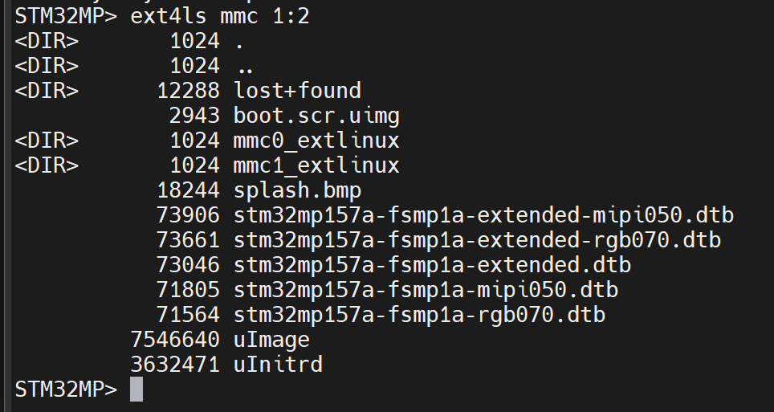
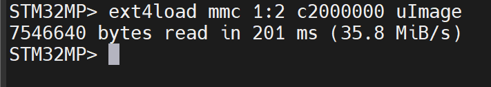
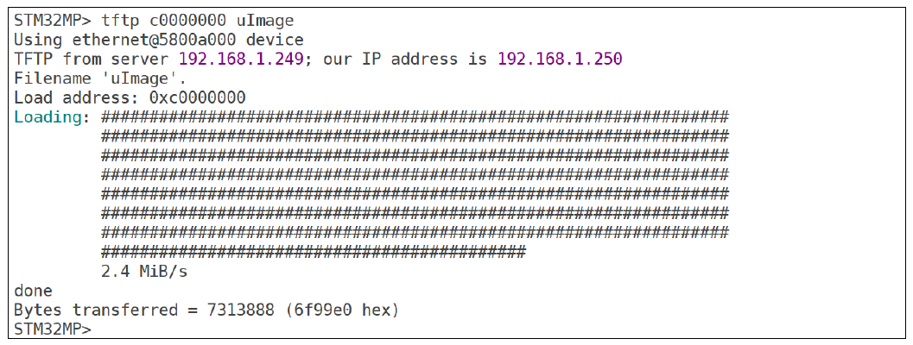
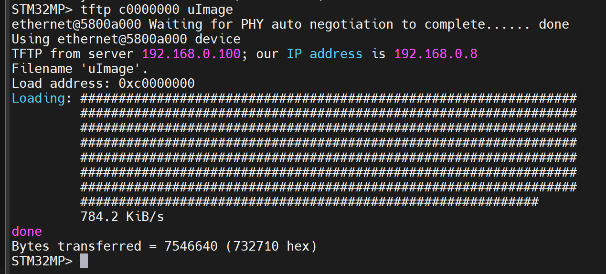
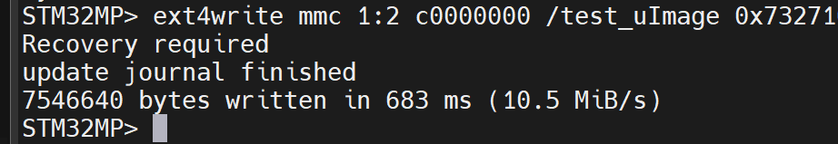
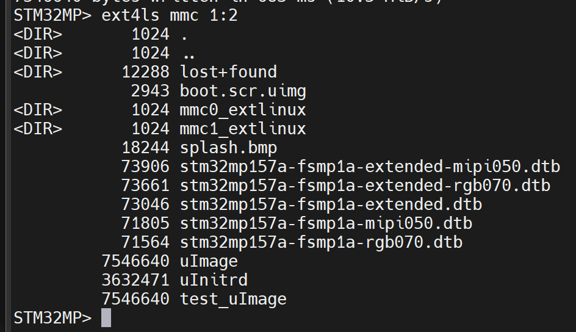
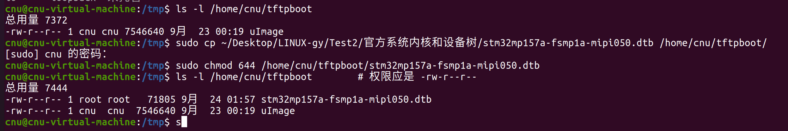
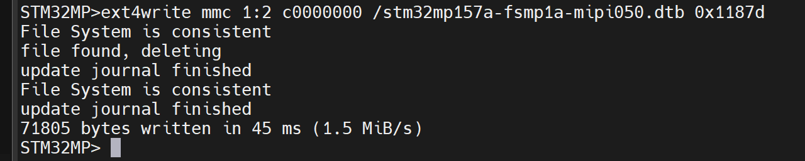

# 实验十五 ext4 文件系统操作命令——U-Boot 里的文件管理器

> **对应课件**：《第4章 使用U-Boot》4.6 节，Slide 35-42
>
> **系列说明**：本系列基于华清远见 FS-MP1A（STM32MP157A）开发板，对应课件《第4章 使用U-Boot》。`mmc read` 读的是裸扇区，可分区里的内容是有文件系统的——stm32mp1 的系统镜像分区都是 ext4 格式。U-Boot 内置了三条 ext4 命令：`ext4ls` 列目录、`ext4load` 读文件进内存、`ext4write` 把内存数据写成文件——相当于 U-Boot 里的"文件管理器"。本篇把三条全部过手，并用 tftp + ext4write 完成"从网络下载、落盘到 eMMC"的完整链路。本文覆盖 Slide 35-42。前置：实验十三（tftp 通）、实验十四（eMMC 分区表实测）。

## 一、先认门牌号：<interface> <dev:part>

**先说清 ext4 是什么**：它是 Linux 最常见的磁盘文件系统格式（就是"分区里怎么存文件名、目录、权限"的那套规则）。实验十四的 `mmc read` 是**绕过文件系统直接读扇区**，读上来一堆字节却叫不出文件名；而 ST 这套系统的镜像分区都是 ext4 格式，所以 U-Boot 额外内置了三条命令直接按文件名操作——**这就是 `ext4ls` / `ext4load` / `ext4write` 与 `mmc read` 的分工**。

ext4 三条命令都绕不开一个地址格式——"哪个设备哪个分区"：

```
ext4ls <interface> [<dev[:part]>] [directory]
ext4load <interface> [<dev[:part]> [<addr> [<filename> [bytes [pos]]]]]
ext4write <interface> <dev[:part]> <addr> <absolute filename path> [sizebytes] [file offset]
```

- `<interface>`：设备接口，我们只用 `mmc`；
- `<dev[:part]>`：设备号：分区号，如 `mmc 1:2` = 1 号设备（eMMC）的 2 号分区；
- ext4load 的 `bytes`/`pos`：读取字节数与偏移，`0` 或省略 = 读到文件尾/从头读。


> 图：课件 Slide 36——`ext4ls` 命令格式文本：`ext4ls <interface> [<dev[:part]>] [directory]`。


> 图：课件 Slide 40——`ext4write` 命令格式文本：`ext4write <interface> <dev[:part]> <addr> <absolute filename path> [sizebytes] [file offset]`——文件名必须是**绝对路径**（`/` 开头）。

**分区号以实验十四 `mmc part` 的实测为准**：课件板出厂 boot 分区是 2 号，所以课件通篇写 `mmc 1:2`。**本篇步骤 1 已经实测确认：我们板上也是 2 号（就叫 `bootfs`），下文所有 `mmc 1:2` 原样照敲即可**；只有当你想在 SD 卡上练，才换成 `mmc 0:4`（实验十四实测：SD 卡的 `bootfs` 是 4 号，而且还没建文件系统）。

## 二、实验环境（实际）

| 项目 | 实际值 |
|---|---|
| 板子状态 | trusted 版 U-Boot，倒计时 5 秒，`STM32MP>` 可达 |
| 串口 | MobaXterm Serial 会话，115200；**新机上实测 `COM10`**（会话标题栏为 `STMicroelectronics STLink Virtual COM Port (COM10)`，2026-09-24）；`COM11` 是旧电脑的值，换机后一律以 Windows 设备管理器里的 ST-Link 串口号为准 |
| 网络 | Ubuntu 侧 `tftpd-hpa` 运行中（实验十三搭的那台：`/home/cnu/tftpboot`，`serverip 192.168.0.100` 已存盘），里面有 `uImage`（7,546,640 字节）；`stm32mp157a-fsmp1a-mipi050.dtb`（71,805 字节）本篇步骤 6 补进去 |
| eMMC 分区表 | 实验十四 `mmc part` 实测：GPT 五分区，**2 号 = `bootfs`（64 MiB，attrs `0x4`）**——本篇按课件的 `mmc 1:2` 书写且已验证可用；SD 卡对应的是 `mmc 0:4` |
| 环境变量基线 | 实验九网络三件套 + `serverip` + `bootdelay 5` |

> **开工自检（10 秒）**：上电先看 `Hit any key to stop autoboot:` 后面那个数字——若是 **0**（换过板子、重新分区烧写后最容易回到 0），先补一句 `setenv bootdelay 5` + `saveenv`（`env set` / `env save` 等价写法）再 `reset`，往后每次拦停都来得及按 Enter。做法见《实验十二》步骤 1 与步骤 4。

## 三、课件 ↔ 步骤对应表

| 课件 Slide | 内容 | 对应步骤 |
|---|---|---|
| 35 | ext2/ext4 支持说明，三条命令总览 | 第一节 |
| 36 | ext4ls 命令格式 | 第一节 |
| 37 | ext4ls 列出 eMMC 2 号分区内容 | 步骤 1 |
| 38~39 | ext4load 格式 + 读 uImage 到 DRAM | 步骤 2 |
| 40 | ext4write 命令格式 | 第一节 |
| 41 | tftp 下载 uImage 到 DRAM | 步骤 3 |
| 42 | ext4write 写入 + ext4ls 验证 | 步骤 4~5 |

### 本篇动作 → 后面谁用 → 现在含糊的后果

| 本篇动作 | 后面哪一篇要用 | 现在含糊的后果 |
|---|---|---|
| 认下"2 号 `bootfs` 是活的 ext4、里面有出厂 `uImage` + 配套 dtb"（步骤 1 实测清单） | 实验十六：`ext4load mmc 1:2 c2000000 uImage` 直接有东西可读；实验十七：从 eMMC 启动内核的"内核 + 设备树"这一对就在这个分区里 | 没记下清单里的**真实文件名**（`uImage`、`stm32mp157a-fsmp1a-mipi050.dtb`），下两篇 `ext4load` 就会读不到文件，而那种报错看起来像"命令坏了" |
| `ext4load` 的用法与"回显字节数 = 清单大小"的对账习惯 | 实验十六全程用它把内核/设备树读进 `c2000000`、`c4000000` | 不核对账，读到半截或读错文件也看不出来，`bootm` 失败时排查方向直接错 |
| `tftp` + `ext4write` 这条"网络 → 内存 → 落盘"链路 | 实验十七的 eMMC 启动路径靠它把文件放进分区；第 5 章移植内核后，**新内核与新设备树就是靠这条链路刷进板上**（不必拔卡回 PC） | 只会从 PC 侧 `dd`，第 5 章每次改完内核都要关机取卡 |
| `sizebytes` 抄 tftp 回显的 hex（本篇 `0x732710`） | 第 5、6 章任何一次 `ext4write`；以及 `bootm` 的地址参数口径 | 手算十进制再输，写进去的文件长度不对，`ext4load` 回来就少一截 |
| 写完必做 `ext4ls` 复扫（新文件在 + 老文件没伤） | 全系列往有内容的分区里写东西时的固定动作 | 只确认"我的文件进去了"，把出厂文件顶掉了还不知道——**U-Boot 里没有 ext4 删除命令，也没有回收站** |

本篇之后服务器侧要备**两个**文件：`uImage`（实验十三已放）与 `stm32mp157a-fsmp1a-mipi050.dtb`（本篇步骤 6 放好，71,805 字节、权限 644）。实验十六走网络下载"内核 + 设备树"时两个都要从 `/home/cnu/tftpboot` 拉；缺哪个，板子上就会报 `TFTP error: 'File not found' (1)`——那是服务器上没这个文件名，不是网络故障（实验十三的排查表里有这一条）。

## 四、实验步骤

### 步骤 1：ext4ls——看分区里有什么（Slide 37）

```
STM32MP> ext4ls mmc 1:2
```


> 图：课件 Slide 37——`ext4ls mmc 1:2` 列出课件板 eMMC boot 分区内容：`boot.scr.uimg`、`lost+found`、`mmc0_extlinux`/`mmc1_extlinux` 目录、`splash.bmp`、`stm32mp157d-atk.dtb` 等 dtb、`uImage`（8125872 字节）、`uInitrd`——一份完整的出厂启动文件清单。

课件板的分区里躺着完整的出厂启动文件（内核 uImage、设备树 dtb、开机画面 splash.bmp）。我们的 eMMC 若带出厂系统，`ext4ls` 应报出类似结构的清单（文件名可能带 `fsmp1a` 字样）；若是空盘或那个分区不是 ext4，`ext4ls` 会直接报错、列不出内容（我们这次没踩到，只作方向提示）——**按实验十四的分区表换其他分区号试**，哪个分区能列出 ext4 内容，后面步骤就用哪个号。

文件列表里 `<DIR>` 标目录、数字是文件字节数——和 Linux 里 `ls -l` 一个读法。

**实际执行结果**（2026-09-24 实测，**实验十四留的那个问号在这里落地：2 号分区是活的 ext4，而且里面是一套完整的出厂启动文件**）：

```
STM32MP> ext4ls mmc 1:2
<DIR>      1024 .
<DIR>      1024 ..
<DIR>     12288 lost+found
      2943 boot.scr.uimg
<DIR>      1024 mmc0_extlinux
<DIR>      1024 mmc1_extlinux
     18244 splash.bmp
     73906 stm32mp157a-fsmp1a-extended-mipi050.dtb
     73661 stm32mp157a-fsmp1a-extended-rgb070.dtb
     73046 stm32mp157a-fsmp1a-extended.dtb
     71805 stm32mp157a-fsmp1a-mipi050.dtb
     71564 stm32mp157a-fsmp1a-rgb070.dtb
   7546640 uImage
   3632471 uInitrd
```


> 图：实测串口——`ext4ls mmc 1:2` 一次列出 12 个条目（3 个 `<DIR>` 目录 + `boot.scr.uimg` + `splash.bmp` + 五个 dtb + `uImage` + `uInitrd`）；`uImage` 那行是 **7546640**、`stm32mp157a-fsmp1a-mipi050.dtb` 那行是 **71805**。

四条读法：

1. **结构与课件一致，名字不同**：`boot.scr.uimg` / `splash.bmp` / 若干 dtb / `uImage` / `uInitrd` 全在，只是 dtb 从课件板的 `stm32mp157d-atk.dtb`（正点原子）换成我们的 `stm32mp157a-fsmp1a-*.dtb`（华清）。**课件通篇的 `mmc 1:2` 在我们板上原样可用**，实验十四那条预判（2 号就叫 `bootfs`、attrs 同为 legacy-boot）到此完全落地。
2. **`uImage` = 7,546,640 字节**，与实验十三从 TFTP 拉下来的那个字节数一字不差；**`stm32mp157a-fsmp1a-mipi050.dtb` = 71,805 字节**，与资料包 `官方系统内核和设备树.zip` 里那个也完全一致。这就是那对文件的**出处**：课程资料包（华清远见）把出厂 bootfs 里这两个文件原样打包发下来，所以你在分区清单里看到的 `uImage` 和 `mipi050.dtb`，与 zip 里那两个是同一对。
3. 五个 dtb 是按屏/接口配的：`mipi050`（MIPI 屏）、`rgb070`（RGB 屏）、`extended*`（带扩展板的组合）。我们全系列跟资料包配套用 `stm32mp157a-fsmp1a-mipi050.dtb`；**换别的板卡配置时这里要跟着换**，否则内核会因设备树与实际硬件不符而起不来。
4. **容量账要算一下**：bootfs 只有 64 MiB（实验十四实测），目前已占约 11.5 MiB；本篇步骤 4 还要再写 7.5 MiB 的 `test_uImage`，写到约 19 MiB 仍然宽裕。**留个心**：U-Boot 里没有 ext4 删除命令，写进去就取不出来（规矩见注意事项 2）。

### 步骤 2：ext4load——把分区里的文件读进 DRAM（Slide 39）

若步骤 1 的清单里有 `uImage`（出厂内核），直接读它：

```
STM32MP> ext4load mmc 1:2 c2000000 uImage
```


> 图：课件 Slide 39——`ext4load mmc 1:2 c2000000 uImage` 的回显：`8125872 bytes read in 207 ms (37.4 MiB/s)`——8 MB 出厂内核两百毫秒进内存。

回显的字节数 = 步骤 1 清单里该文件的大小，一眼对账。ext4load 的完整格式里还有 `bytes [pos]` 两个可选参数（读多少字节、从文件哪里开始读），默认全文件读入——内核加载用默认就好。

**分支**：分区里没有 `uImage` 这个名字的文件（空盘或文件名不同）——先跳过本步骤，做步骤 3~5（我们自己写一个进去），回头再回来补做，正好验证 ext4write 的闭环。

**实际执行结果**（2026-09-24 实测，分支未触发，走主线）：

```
STM32MP> ext4load mmc 1:2 c2000000 uImage
7546640 bytes read in 201 ms (35.8 MiB/s)
```


> 图：实测串口——`ext4load mmc 1:2 c2000000 uImage` 一行回显 `7546640 bytes read in 201 ms (35.8 MiB/s)`。

三点对账：

- **7,546,640 = 步骤 1 清单里 `uImage` 那一行的字节数**，也 = 资料包与 TFTP 那一份的大小——同一个文件从"分区里的目录项"到"DRAM 里的实际数据"全程数字自洽，这就是 ext4load 的验收方式。
- **35.8 MiB/s 是本地读**（eMMC → DRAM，不经过网络），比实验十三那次 TFTP 网络下载的 1.7 MiB/s 快一个数量级。同一块盘、同一份数据，差别全在"走没走网线"——这也是为什么后面几章要从网络启动调试、而量产要落回 eMMC。
- 与课件的 8,125,872 字节不同是**文件不同**（课件板那份出厂内核），结构与回显格式一致即可。

### 步骤 3：tftp 再下一份 uImage 到另一个地址（Slide 41）

ext4write 的数据源是 DRAM——先把服务器上的 uImage 下载到内存，这次用 `0xc0000000`（课件同款，与步骤 2 的 `c2000000` 错开）：

```
STM32MP> tftp c0000000 uImage
```


> 图：课件 Slide 41——`tftp c0000000 uImage` 下载成功：`Bytes transferred = 7313888 (6f99e0 hex)`。

**记下回显里的十六进制字节数**——下一步 ext4write 要用。我们的 uImage 应报 `Bytes transferred = 7546640 (732710 hex)`（实验十三下载同一文件时的老数字）。

**实际执行结果**（2026-09-24 实测，与预判一字不差）：

```
STM32MP> tftp c0000000 uImage
ethernet@5800a000 Waiting for PHY auto negotiation to complete...... done
Using ethernet@5800a000 device
TFTP from server 192.168.0.100; our IP address is 192.168.0.8
Filename 'uImage'.
Load address: 0xc0000000
Loading: #################################################################
         #################################################################
         #################################################################
         #################################################################
         #################################################################
         #################################################################
         #################################################################
         #################################################################
         784.2 KiB/s
done
Bytes transferred = 7546640 (732710 hex)
```


> 图：实测串口——开头 `ethernet@5800a000 Waiting for PHY auto negotiation to complete...... done`，随后 `TFTP from server 192.168.0.100; our IP address is 192.168.0.8`、`Load address: 0xc0000000`、八行满进度 `#`、`784.2 KiB/s`，收尾 `Bytes transferred = 7546640 (732710 hex)`。

四点：

- **`Bytes transferred = 7546640 (732710 hex)` 与实验十三完全一致**：同一台 Ubuntu 服务器、同一个 `/home/cnu/tftpboot/uImage`，只是这次落在 `0xc0000000`（课件同款地址，与步骤 2 的 `c2000000` 错开）——**内存里于是同时躺着两份 uImage**，一份来自 eMMC 分区、一份来自网络，互不覆盖，这正是课件把两个地址分开的用意。
- **开头那行 `Waiting for PHY auto negotiation to complete...... done` 是实验十三坑 8 的正面照**：链路不是常亮的，U-Boot 在真正发包前会把 PHY 自协商跑完（这次六个点就 done 了）。哪天遇到"第一次必超时、第二次就通"，回看那条坑。
- **速率这次是 784.2 KiB/s，实验十三是 1.7 MiB/s**——TFTP 速率本来就会抖，**验收只看 `Bytes transferred` 那一行**，别拿速率当指标。
- 把 **`732710`** 记下来，下一步 `ext4write` 的 `sizebytes` 就填 `0x732710`。

### 步骤 4：ext4write——把 DRAM 数据落盘成分区里的文件（Slide 42）

```
STM32MP> ext4write mmc 1:2 c0000000 /test_uImage 0x732710
```


> 图：课件 Slide 42——`ext4write mmc 1:2 c0000000 /test_uImage 0x6f99e0` 写入成功：`File System is consistent`、`update journal finished`、`7313888 bytes written in 335 ms (20.8 MiB/s)`。

三个语法点：

- 文件名是**绝对路径** `/test_uImage`——ext4write 不能创建子目录，文件落在分区根；
- 最后的 `sizebytes` 用上一步 tftp 回显的**十六进制**字节数（我们 = `0x732710`；课件例子里是 `0x6f99e0`，对应它的 7,313,888 字节）；
- 成功标志是三连：**日志检查那一行**（`File System is consistent` 或 `Recovery required`，见下方实测）→ `update journal finished`（日志区更新完）→ `N bytes written`（N 应与 tftp 的字节数一致）。

`ext4write` 的目标分区是课件板出厂 boot 分区——**写之前想一秒**：分区号写对没有（`1:2`）？写错分区可能毁掉出厂文件。认准实验十四的地图再回车。

**实际执行结果**（2026-09-24 实测）：

```
STM32MP> ext4write mmc 1:2 c0000000 /test_uImage 0x732710
Recovery required
update journal finished
7546640 bytes written in 683 ms (10.5 MiB/s)
```


> 图：实测串口——命令行末尾的 `0x73271…` 被截图右边缘裁掉了一位，从回显 `7546640 bytes written` 可反推参数就是 `0x732710`；下面三行依次是 `Recovery required`、`update journal finished`、`7546640 bytes written in 683 ms (10.5 MiB/s)`。

**与课件那屏唯一的差别在第一行**：课件打 `File System is consistent`，我们打 **`Recovery required`**。这是同一处判断的两个分支——ext4 分区带日志（journal），U-Boot 写文件之前先看一眼日志要不要回放：课件那次判定"一致、不用回放"，我们这次判定"有未回放的日志、需要先恢复"。**两条分支后面都紧跟 `update journal finished`，且写入字节数与 tftp 一致（7,546,640）**，说明走的是正常路径，不是报错。

所以这一屏的正确读法是把最后一行当判据：**`7546640 bytes written` = 上一步 `Bytes transferred = 7546640`**，落盘成功。第一行是 consistent 还是 Recovery required 只反映分区当时的日志状态，不影响成败——**别看到 `Recovery required` 就以为写坏了**。真正的失败信号是：命令直接报错，或者最后一行的字节数与 tftp 对不上。

顺带一条与实验十四呼应的安全提醒：这次写的是 2 号 `bootfs` 的**根目录**、文件名是新建的 `test_uImage`，不覆盖任何出厂文件；如果哪天把文件名写成 `/uImage`，就会把出厂内核顶掉（U-Boot 里删不回来）。**练手一律用带 `test_` 前缀的新文件名。**

### 步骤 5：ext4ls 复验（Slide 42 下半）

```
STM32MP> ext4ls mmc 1:2
```


> 图：课件 Slide 42——再次 `ext4ls mmc 1:2`，文件清单里红框标出新增的 `7313888 test_uImage`，与原有出厂文件并列。

清单里多出 `7546640 test_uImage`——从服务器下载到 DRAM、再从 DRAM 落盘到 eMMC，全链路在 U-Boot 命令行里手工走通。这个 `test_uImage` 之后还有个用处：实验十七的 eMMC 启动路径可以拿它当内核。它也会一直留在分区里——U-Boot 没有 ext4 删除命令，7 MB 留着无害，第 5 章有了 Linux 环境再清理。

**实际执行结果**（2026-09-24 实测，全链路闭环）：

```
STM32MP> ext4ls mmc 1:2
<DIR>      1024 .
<DIR>      1024 ..
<DIR>     12288 lost+found
      2943 boot.scr.uimg
<DIR>      1024 mmc0_extlinux
<DIR>      1024 mmc1_extlinux
     18244 splash.bmp
     73906 stm32mp157a-fsmp1a-extended-mipi050.dtb
     73661 stm32mp157a-fsmp1a-extended-rgb070.dtb
     73046 stm32mp157a-fsmp1a-extended.dtb
     71805 stm32mp157a-fsmp1a-mipi050.dtb
     71564 stm32mp157a-fsmp1a-rgb070.dtb
   7546640 uImage
   3632471 uInitrd
   7546640 test_uImage
```


> 图：实测串口——与步骤 1 那一屏逐行相同，只在末尾多出一行 **`7546640 test_uImage`**；原有 12 个条目（含 `uImage` 7546640、`uInitrd` 3632471、五个 dtb）一个没少。

这一步真正要确认的是**两件事同时成立**：

1. **新文件在**：`test_uImage` 出现，字节数 7,546,640 与 tftp/ext4write 两处一致——服务器 → DRAM → eMMC 分区 这条链路在 U-Boot 命令行里手工走通了，不依赖 Linux、不依赖 PC 侧的 `dd`。
2. **老文件没伤**：把这一屏与步骤 1 逐行对照，出厂的 `uImage`/`uInitrd`/五个 dtb/`boot.scr.uimg`/两个 extlinux 目录全部还在、字节数一字未变——说明"新建文件"没有动到分区里已有的内容。

两次 `ext4ls` 前后对照就是本步骤的验收方式，比只看"新文件出现"更严——**往带出厂文件的分区里写东西，永远要复扫一遍没动别人**。

### 步骤 6（可选）：顺手把设备树也写进去——为实验十七铺路

实验十七的 eMMC 启动路径需要"内核 + 设备树"一对文件。若步骤 1 清单里已有配套的 fsmp1a 系 dtb，"往分区里写一份"这半可以省；但**服务器那半省不掉**——实验十六要走网络下载"内核 + 设备树"，`/home/cnu/tftpboot` 里没有 dtb 就拉不动。所以这一步实际拆成两件事：① 把 dtb 放上 TFTP 服务器（本篇要做，实验十六要用）；② 要不要再写进分区（分区里已有，本可不做——我们顺手练了一次，结果练出一条重要行为，见实测）。

先按实验十三那条路把文件送进服务器：解压 `官方系统内核和设备树.zip` → 放进共享目录 → `sudo cp` 到 `/home/cnu/tftpboot/` → **`chmod 644`**（共享目录 `cp` 过来默认是 700，tftpd 换用户读会 `Permission denied`，见实验十三坑 7），然后：

```
STM32MP> tftp c0000000 stm32mp157a-fsmp1a-mipi050.dtb
STM32MP> ext4write mmc 1:2 c0000000 /stm32mp157a-fsmp1a-mipi050.dtb 0x1187d
```

（`0x1187d` = 71,805 的十六进制，以 tftp 回显为准。）课件没有这一步，是为我们后两篇加的铺垫。

**实际执行结果**（2026-09-24）：

先在 Ubuntu 里把 dtb 放进 TFTP 根目录——**这一步不做，板子上敲 `tftp` 会直接报 `TFTP error: 'File not found' (1)`**（那是服务器上没这个文件，不是网络故障，排查表里"文件名/目录"那一类）：

```bash
sudo cp ~/Desktop/LINUX-gy/Test2/官方系统内核和设备树/stm32mp157a-fsmp1a-mipi050.dtb /home/cnu/tftpboot/
sudo chmod 644 /home/cnu/tftpboot/stm32mp157a-fsmp1a-mipi050.dtb
ls -l /home/cnu/tftpboot
```


> 图：实测 Ubuntu 终端——`/home/cnu/tftpboot` 从只有一个 `uImage`（总用量 7372）变成两个文件并排，新进去的 dtb 是 `-rw-r--r-- 1 root root 71805`。属主是 root 因为用了 `sudo cp`；`tftpd-hpa` 以 `--user tftp` 换用户来读文件，只要"其他用户可读"那三位成立就够，所以 644 即可（共享目录直接拷过来是 700 就会 `Permission denied`，见实验十三坑 7）。

板子上拉这份 dtb：

```
STM32MP> tftp c0000000 stm32mp157a-fsmp1a-mipi050.dtb
Using ethernet@5800a000 device
TFTP from server 192.168.0.100; our IP address is 192.168.0.8
Filename 'stm32mp157a-fsmp1a-mipi050.dtb'.
Load address: 0xc0000000
Loading: #####
         1.6 MiB/s
done
Bytes transferred = 71805 (1187d hex)
```

`Bytes transferred = 71805 (1187d hex)` 与步骤 1 清单里那一行、与资料包 zip 里那个文件**三处字节数一致**；`1187d` 就是下一步 `ext4write` 的 `sizebytes`。71 KB 的文件进度条只走了五个 `#`——`#` 的个数代表块数，不代表文件大小，别看它少就以为没传完。

**接着练 ext4write——这里冒出一条值得记的行为。** 明知道分区里已经有同名文件，还是把这条写了下去：

```
STM32MP> ext4write mmc 1:2 c0000000 /stm32mp157a-fsmp1a-mipi050.dtb 0x1187d
File System is consistent
file found, deleting
update journal finished
File System is consistent
update journal finished
71805 bytes written in 45 ms (1.5 MiB/s)
```


> 图：实测串口——`ext4write mmc 1:2 c0000000 /stm32mp157a-fsmp1a-mipi050.dtb 0x1187d` 的回显里出现 **`file found, deleting`**，随后 `File System is consistent` / `update journal finished` 各打了两遍，末尾 `71805 bytes written in 45 ms (1.5 MiB/s)`。

**`file found, deleting` 这一行是本次最值钱的发现**：ext4write 遇到同名文件**不会拒绝、也不会提示确认，而是先删掉旧的再写新的**。这次侥幸无害——DRAM 里那份 dtb 与分区里那份同源、字节数一致（都是华清出厂那套 `mipi050`），等于用同样的内容重写了一遍。但行为本身要记住：

- **写错文件名 = 毁掉出厂文件**，而 **U-Boot 里没有 ext4 删除/恢复命令**，删掉就回不来（要恢复只能回 PC 侧重刷系统或从 Linux 侧补）；
- 所以本篇定的规矩在这儿再强调一次：**练手一律用 `test_` 前缀的新名字**（步骤 4 的 `test_uImage` 就是这么来的）；真要把某个文件"更新"进分区，先 `ext4ls` 看清目标名字、再想一秒里面躺着什么；
- 严格说我们只对了**字节数**一致，没做逐字节校验（`md5sum` 那类比对要到 Linux 环境里才方便）。如果实验十六/十七出现"内核能起但外设不对"这类像设备树问题的现象，**回看这一格**：分区里那份 dtb 是 2026-09-24 由我们自己重写过一遍的。

顺带解释这次回显为什么比步骤 4 长：这一发里 U-Boot 做了**两笔日志事务**（先删旧文件、再写新文件），所以 `File System is consistent` 与 `update journal finished` 各出现两次；步骤 4 那次是纯新建，只有一笔。**判据始终是最后一行的字节数**——`71805 bytes written` = 上一步 `Bytes transferred = 71805`，落盘成功。

**收尾必做（本篇的固定动作）**：每写一次就复扫一遍分区，确认新文件在、老文件没伤。

**实际执行结果**（2026-09-24 实测）：

```
STM32MP> ext4ls mmc 1:2
<DIR>       1024 .
<DIR>       1024 ..
<DIR>      12288 lost+found
            2943 boot.scr.uimg
<DIR>       1024 mmc0_extlinux
<DIR>       1024 mmc1_extlinux
           18244 splash.bmp
           73906 stm32mp157a-fsmp1a-extended-mipi050.dtb
           73661 stm32mp157a-fsmp1a-extended-rgb070.dtb
           73046 stm32mp157a-fsmp1a-extended.dtb
           71805 stm32mp157a-fsmp1a-mipi050.dtb
           71564 stm32mp157a-fsmp1a-rgb070.dtb
         7546640 uImage
         3632471 uInitrd
         7546640 test_uImage
STM32MP>
```

三件事全部核对通过：`stm32mp157a-fsmp1a-mipi050.dtb` 仍是 **71805**、步骤 4 写进去的 `test_uImage` **7546640** 还在、其余出厂条目一个不少。

不过这一屏还有一层更值得记的意思：**整份清单与步骤 5 那一屏逐行一字不差**——因为这次是"同名同长度重写"，`ext4ls` 只告诉你"名字在、长度是这些"，**看不出内容有没有被换过**。所以复扫能证明"没伤到别人"，却不能证明"自己那份写对了"；要逐字节校验，得等第 5、6 章进了 Linux 环境用 `md5sum` 那类工具比对。

**新手最容易在这里想反**：把"复扫没看出变化"理解成"什么都没发生"。实际发生的是一次不可撤销的覆盖，只是这张清单的分辨率看不见它——所以真正的保险不是复扫，而是**别用出厂文件名练手**（注意事项 2）。

于是实验十七与实验十六要用的料，现在**板上和服务器各一套**，都齐了：

| 用途 | 位置 | 文件名 | 字节数 |
|---|---|---|---|
| 出厂内核（实验十七可直接 `ext4load`） | eMMC 2 号分区 | `uImage` | 7,546,640 |
| 配套设备树（本篇重写过一次，内容同源） | eMMC 2 号分区 | `stm32mp157a-fsmp1a-mipi050.dtb` | 71,805 |
| 本篇写进去的测试内核 | eMMC 2 号分区 | `test_uImage` | 7,546,640 |
| 网络源（实验十六走 `tftp` 下载用） | Ubuntu `/home/cnu/tftpboot` | `uImage` + `stm32mp157a-fsmp1a-mipi050.dtb` | 7,546,640 / 71,805 |

一句提醒：**这份 dtb 是按 `mipi050`（MIPI 屏）配的**，步骤 1 清单里另有 `rgb070`、`extended*` 四份是给别的屏/扩展板组合的。第 5 章我们自编内核时，内核与设备树都要换成自己移植的那份，别再拿这套出厂件。

## 五、注意事项

1. **`mmc 1:2` 在我们板上不用改号（本篇已实测确认）**：eMMC 的 2 号分区 `bootfs` 就是 ext4，`ext4ls mmc 1:2` 直接列出出厂文件；**但换到 SD 卡上练要写 `mmc 0:4`**（实验十四实测：SD 卡的 `bootfs` 是 4 号，而且还没建文件系统）。
2. **ext4write 是本篇唯一的"刀"，而且它遇同名会"先删后写"**：实测回显里出现过 `file found, deleting`（步骤 6）——不拒绝、不提示确认。所以写之前要核对两件事：**设备:分区号**（写错格子会毁掉那格里的现有文件）与**目标文件名是否已存在**（`ext4ls` 先看一眼）；练手一律用 `test_` 前缀的新名字；写完 `ext4ls` 复验是固定动作。
3. **U-Boot 没有 ext4 删除命令，也没有"撤销"**：写进去的 `test_uImage` 会一直留在分区里（本篇重写的那份 dtb 也覆盖了原件——内容同源、字节数一致，但严格说是一次不可撤销的操作），有 Linux 环境后可清。
4. **sizebytes 是十六进制**：直接抄 tftp 回显括号里的 hex 值最稳，别手算十进制再输进去。
5. **ext4load/ext4write 的大文件速度**：课件里 8 MB 读入 207 ms（37 MiB/s）、写入 335 ms（20 MiB/s）量级——我们同一量级即为正常，慢一个数量级才需要排查。
6. **终端粘贴用右键**（实验九教训）；dtb 文件名长，逐字核对——U-Boot 的 Tab 补全只补命令名，不补文件名。

## 六、怎么验证

1. `ext4ls mmc 1:N` 能列出分区内容（N = 实验十四实测的 ext4 分区号）——**已实测**，N = 2，列出 12 个条目（含 `uImage`、五个 dtb、`uInitrd`、`boot.scr.uimg`、两个 `*_extlinux` 目录、`lost+found`）；
2. `ext4load` 读文件的回显字节数 = `ext4ls` 清单里该文件的大小——**已实测**，两处都是 **7,546,640**（`7546640 bytes read in 201 ms (35.8 MiB/s)`）；
3. tftp + ext4write 链路：`Bytes transferred` = `bytes written` = `ext4ls` 里 `test_uImage` 的大小，三个数字一字不差——**已实测**，三处全是 **7,546,640**（tftp 回显 `7546640 (732710 hex)`、ext4write 回显 `7546640 bytes written`、复扫清单 `7546640 test_uImage`）；
4. （选做）dtb 已放上服务器、并练了一次 `ext4write`——**已实测**：`Bytes transferred = 71805 (1187d hex)` → `71805 bytes written`，与步骤 1 清单、与资料包 zip 三处字节数一致；这一发回显里的 `file found, deleting` 记下了"同名文件先删后写"这条行为（步骤 6）。收尾复扫也做了：清单与步骤 5 逐行一致——**注意这恰恰说明 `ext4ls` 看不出内容被换过，只能看出名字与长度**。**实验十六/十七的"内核 + 设备树"板上与网络各一套，料已齐。**

不达标时的排查：

| 现象 | 先查什么 |
|---|---|
| `ext4ls` 报错、列不出内容 | 分区号不对或该分区不是 ext4——回实验十四的分区表换号（本篇 2 号一次成功，这一行按方向备查） |
| `ext4write` 报错 | 设备号:分区号写对了吗（`mmc dev` 先确认当前设备）；那一格是不是只读（看 `mmc part` 的 attrs 列） |
| `bytes written` 与 tftp 字节数不符 | sizebytes 抄错——重抄 tftp 回显的 hex 值再来 |
| `ext4load` 读不到文件 | 文件名大小写、文件在不在该分区（先 `ext4ls` 看一眼清单再敲） |

## 七、实验完成标志

- `ext4ls` 列出 eMMC ext4 分区内容（步骤 1 实测：2 号 `bootfs` 是活的 ext4，12 个条目，出厂启动文件齐全）
- `ext4load` 读 uImage 进 DRAM，回显字节数与清单一致（步骤 2 实测：`7546640 bytes read in 201 ms (35.8 MiB/s)`，与清单里 `uImage` 那行对账通过）
- `tftp c0000000 uImage` + `ext4write ... /test_uImage 0x732710` 全链路走通（步骤 3~4 实测：`Bytes transferred = 7546640 (732710 hex)` → `7546640 bytes written in 683 ms (10.5 MiB/s)`；第一行是 `Recovery required` 而非课件的 `File System is consistent`，属日志回放分支，不影响成败）
- `ext4ls` 复验看到 `7546640 test_uImage`（步骤 5 实测：新文件在、原有 12 个条目一字未变）
- （选做）dtb 已放上服务器、并练了一次 `ext4write` 落盘（步骤 6 实测：`Bytes transferred = 71805 (1187d hex)` → `71805 bytes written`；回显里的 `file found, deleting` 记下"同名文件先删后写"这条行为）；收尾复扫 `ext4ls` 也已实测——12 个条目与步骤 5 逐行一致，dtb 仍 71805、`test_uImage` 7546640、出厂件一个不少。实验十六/十七的"内核 + 设备树"板上与网络各一套，料已齐

## 八、下一步：启动 Linux 内核命令

下一篇覆盖 4.7 节（Slide 43-50）：`bootm` / `bootz` / `boot` / `bootd`——第 3 章以来 autoboot 里那句 bootm 找不到内核的报错，答案终于揭晓：不是 U-Boot 坏了，是内存里压根没有内核。本篇 tftp/ext4load 攒下的加载本事，加上出厂内核一对文件，`bootm c2000000 - c4000000` 一声令下——Linux 第一次被我们亲手点火。

本篇给实验十六备好的料（全部已在板上/服务器上，实测确认）：eMMC 2 号分区里的 `uImage`（7,546,640）与 `stm32mp157a-fsmp1a-mipi050.dtb`（71,805）、本篇写进去的 `test_uImage`（7,546,640）、以及 Ubuntu `/home/cnu/tftpboot/uImage` 那份网络源。**实验十六从 eMMC 读文件点火即可，不必再依赖网络**——网络那条路留给它做对照。
