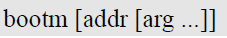
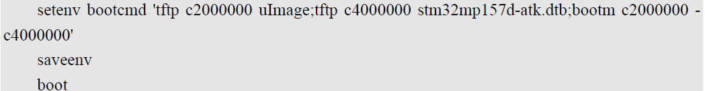
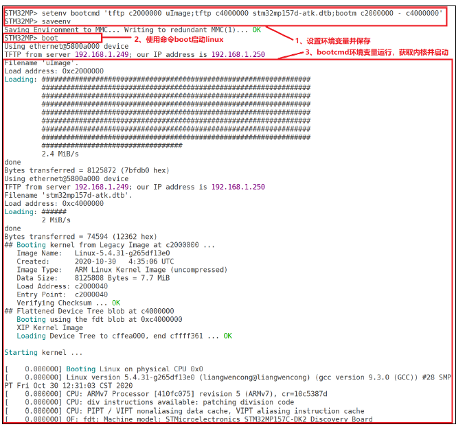

# 实验十六 启动 Linux 内核命令——bootm 点火，第一章悬案揭晓

> **对应课件**：《第4章 使用U-Boot》4.7 节，Slide 43-50
>
> **系列说明**：本系列基于华清远见 FS-MP1A（STM32MP157A）开发板，对应课件《第4章 使用U-Boot》。第 3 章以来，autoboot 收尾总有一句 bootm 找不到内核的报错——本篇揭晓谜底：不是 U-Boot 坏了，是 DRAM 里压根没有内核。把出厂内核（uImage + 设备树）用 tftp 装进内存，`bootm` 一声令下，Linux 第一次被我们亲手点火；再把这三条命令写进 `bootcmd` 环境变量，就是 autoboot 每次自动执行的那件事。本文覆盖 Slide 43-50：bootm/bootz/boot/bootd 四条命令、例 1 手动启动、例 2 固化到 bootcmd。前置：实验十三（tftp 通）、实验十五（可选：eMMC 里已备好内核文件）。

## 一、命令族四兄弟

| 命令 | 干什么 | 备注 |
|---|---|---|
| `bootm [addr [arg ...]]` | 启动 DRAM 里的 **uImage** 镜像 | stm32mp1 用 uImage，本篇主角 |
| `bootz [addr [arg ...]]` | 启动 DRAM 里的 **zImage** 镜像 | zImage 是另一种内核镜像格式；用哪种取决于厂商给哪种，命令格式与 bootm 相同 |
| `boot` / `bootd` | 执行 `bootcmd` 环境变量里保存的命令 | 两条是同一个命令的别名；**课件原话：ST 提供的 U-Boot 未使能 boot 命令**——报 `Unknown command` 就用 `run bootcmd` 等效 |

uImage 是"U-Boot 格式"的内核镜像（带头部信息），zImage 是裸压缩内核——第 5 章自己编内核时会亲手生成 uImage，本篇先用出厂现成的。

## 二、实验环境（实际）

| 项目 | 实际值 |
|---|---|
| 板子状态 | trusted 版 U-Boot，倒计时 5 秒，`STM32MP>` 可达 |
| 串口 | MobaXterm Serial 会话（COM11），115200 |
| 网络 | tftpd64 运行中；`D:\tftpboot` 里需有 `uImage`（7,546,640 字节，实验十三已在）+ `stm32mp157a-fsmp1a-mipi050.dtb`（71,805 字节，从 `官方系统内核和设备树.zip` 解压目录拷入——zip 里仅此一对文件，配套出厂品，无变体纠结） |
| 环境变量基线 | 实验九网络三件套 + `serverip 192.168.0.100` + `bootdelay 5`；`bootcmd` 仍为 ST 默认（autoboot 扫 mmc 落空那条路） |

## 三、课件 ↔ 步骤对应表

| 课件 Slide | 内容 | 对应步骤 |
|---|---|---|
| 43 | 启动命令族总览 | 第一节 |
| 44 | bootm 命令格式与参数顺序 | 步骤 1 |
| 45~46 | 例 1：tftp 下载内核 + 设备树，bootm 启动 | 步骤 2 |
| 47 | bootz 与 bootm 的异同 | 第一节 |
| 48 | boot/bootd 执行 bootcmd；ST 未使能说明 | 步骤 3 |
| 49~50 | 例 2：三条命令存入 bootcmd，boot 启动 | 步骤 3 |

## 四、实验步骤

### 步骤 1：bootm 的参数语法（Slide 44）


> 图：课件 Slide 44——bootm 命令格式文本：`bootm [addr [arg ...]]`。

`bootm` 的参数有固定顺序，空位用 `-` 占位：

```
bootm <内核地址> <initrd地址> <设备树地址>
bootm c2000000 - c4000000     ; 没有 initrd，用减号占位
```

三件套里我们只有两件（内核 + 设备树），中间的 initrd 位置写 `-`——这个减号占位是 bootm 语法的精髓，写漏或写成空格都会启动失败。

**实际执行结果**：待补充

### 步骤 2：例 1——tftp 装弹，bootm 点火（Slide 45~46）

```
STM32MP> tftp c2000000 uImage
STM32MP> tftp c4000000 stm32mp157a-fsmp1a-mipi050.dtb
STM32MP> bootm c2000000 - c4000000
```


> 图：课件 Slide 45——例 1 前两步：`tftp c2000000 uImage`（Bytes transferred = 7310904）与 `tftp c4000000 stm32mp157d-atk.dtb`（Bytes transferred = 63833），内核与设备树分别落位两个地址。

dtb 文件名长，逐字核对（Tab 不补文件名，实验十五提过）。两条 tftp 都报 `Bytes transferred` 后，才轮到主角：

```
## Booting kernel from Legacy Image at c2000000 ...
   Image Name:   Linux-5.4.31...
   Created:      ...
   Image Type:   ARM Linux Kernel Image (uncompressed)
   Data Size:    7546576 Bytes = 7.2 MiB
   Load Address: c2000040
   Entry Point:  c2000040
   Verifying Checksum ... OK
## Flattened Device Tree blob at c4000000
   Booting using the fdt blob at 0xc4000000
   XIP Kernel Image
Loading Device Tree to cfed0000, end cffff958 ... OK

Starting kernel ...
```


> 图：课件 Slide 46——`bootm c2000000 - c4000000` 的完整回显：`## Booting kernel from Legacy Image ...`、镜像名 Linux-5.4.31、校验 OK、加载设备树，最后 `Starting kernel ...` 之后接续打印 Linux 内核启动日志（`Booting Linux on physical CPU 0x0`、`Linux version 5.4.31 ...`、`Machine model: ...`）。

以上结构逐行对照（具体数值以实测为准：Data Size 与 tftp 字节数联动、Image Name 报我们出厂内核的版本串）。**`Starting kernel ...` 之后串口刷出的就是 Linux 的启动日志**——U-Boot 的历史使命完成，控制权移交内核：

- `Booting Linux on physical CPU 0x0`、`Linux version 5.4.31 ...`——内核活了；
- `Machine model: ...`——大概率报 `HQYJ FS-MP1A` 字样（出厂 TF-A 在实验十一自报过同款，同一家的出厂设备树），以实测为准。

**预期结局**：内核日志滚到某处停下——大概率是 `VFS: Unable to mount root fs` 或 kernel panic 一类。**这不是失败**：我们没传 bootargs（`bootargs` 环境变量还空着）、板上也没有它能认的根文件系统——内核无根可挂，只好停住。这行报错就是第 5 章的大门：内核移植篇要做的正是"自己编内核 + 自己给根文件系统"。记录下**日志停在哪一行**——那是第 5 章的起跑线。

**看门狗彩蛋**：若内核停住约半分钟后板子自己复位（TF-A 横幅重新滚起），是启动横幅里那句 `WDT: Started with servicing (32s timeout)` 的看门狗在履行职责——没人喂狗了，它按约定复位系统，属正常收场。按复位键或等它自己复位，回到 `STM32MP>`。

**实际执行结果**：待补充

### 步骤 3：例 2——把启动命令固化进 bootcmd（Slide 48~50）

手动三连每次都要敲三行，`bootcmd` 环境变量就是它们的"快捷方式"——autoboot 倒计时归零后执行的就是它：

```
STM32MP> setenv bootcmd 'tftp c2000000 uImage;tftp c4000000 stm32mp157a-fsmp1a-mipi050.dtb;bootm c2000000 - c4000000'
STM32MP> saveenv
STM32MP> run bootcmd
```


> 图：课件 Slide 49——例 2 命令：`setenv bootcmd 'tftp c2000000 uImage;tftp c4000000 stm32mp157d-atk.dtb;bootm c2000000 - c4000000'` + `saveenv`，最后执行 `boot`。


> 图：课件 Slide 50——例 2 运行：`saveenv` 落盘（Writing to redundant MMC(1)... OK）后，`boot` 触发 bootcmd：两条 tftp 先后下载内核与设备树，`## Booting kernel ...` 接 `Starting kernel ...`，随后滚出 Linux 日志。

几个要点：

- **三条命令打包在一个引号里**，用分号串联——整个字符串是一个环境变量的值（实验十二练过的语法：值含空格必须加引号）；
- `run bootcmd` 手动执行它；`boot` 命令与之等效——若报 `Unknown command`，就是课件 Slide 48 说的"ST 未使能 boot 命令"，`run bootcmd` 即可，两者一回事；
- **saveenv 之后行为变化**：此后每次上电，倒计时归零 = 自动走网络启动。**PC 与 tftpd64 必须在线**，否则 bootcmd 里的 tftp 重试几轮后 Abort 落回命令行（无害，就是慢）。倒计时 5 秒内按 Enter 照旧可以拦停；
- 想还原"归零后安静落提示符"：`setenv bootcmd`（赋空值）+ `saveenv`——第 5 章会更 handy 地管理它，届时再说。

**实际执行结果**：待补充

## 五、注意事项

1. **内核与设备树必须配套**：`uImage` 与 `stm32mp157a-fsmp1a-mipi050.dtb` 出自同一份出厂 zip——别拿课件截图里的 `stm32mp157d-atk.dtb` 名字照打，那是别人板子的设备树。
2. **地址约定全系列统一**：内核 `c2000000`、设备树 `c4000000`（实验十三起的约定，课件同款）。bootm 的三个地址要与 tftp 下载地址一字不差。
3. **`-` 占位不能丢**：`bootm c2000000 - c4000000` 中间的减号两侧空格都在——写成 `bootm c2000000 c4000000` 会把设备树当地址用，启动失败。
4. **`Starting kernel ...` 之后无输出**：先等 10 秒（内核解压/早期初始化要时间），再确认 dtb 是不是 fsmp1a 那份（控制台配置不对会"哑火"）；再不行回查 tftp 的 Bytes transferred。
5. **固化 bootcmd 后 PC 要常在线**：tftpd64 没开时上电会多等几轮 tftp 超时才落回命令行——不是死机。
6. **终端粘贴用右键**；bootcmd 那条长命令务必整体复制粘贴，手打容易丢分号。

## 六、怎么验证

1. `bootm c2000000 - c4000000` 后能看到 `Starting kernel ...` 并滚出 Linux 内核日志（`Booting Linux on physical CPU 0x0` 一行起）；
2. 内核日志最后一行有记录——第 5 章的起跑线；
3. `run bootcmd` 能复现同一启动过程（bootcmd 已 saveenv，`print bootcmd` 可查验）；
4. `boot` 报 `Unknown command` 时知道用 `run bootcmd` 等效（课件 Slide 48 的知识点落地）。

不达标时的排查：

| 现象 | 先查什么 |
|---|---|
| `bootm` 报 `Wrong Image Format for bootm command` | `c2000000` 处不是 uImage——tftp 那步成功了吗（Bytes transferred）；地址有没有打错 |
| `## Flattened Device Tree blob` 后卡住 | dtb 地址对不对（`c4000000`）、dtb 是不是 fsmp1a 那份 |
| `Starting kernel ...` 后永久无输出 | 多等 10 秒；换 PC 侧确认 tftp 下载的 dtb 字节数 = 71,805；仍无输出则记录现象，第 5 章编自己的内核时自然解决 |
| 内核日志滚出后 panic | **预期结局**——记录停在哪一行，这正是第 5 章要解决的问题 |

## 七、实验完成标志

- [ ] `tftp` 两条（内核 `c2000000` + 设备树 `c4000000`）字节数对账通过（步骤 2）
- [ ] `bootm c2000000 - c4000000` 点火成功——`Starting kernel ...` 后滚出 Linux 日志（步骤 2）
- [ ] 内核日志停止位置有记录（第 5 章起跑线）（步骤 2）
- [ ] `bootcmd` 三连已 saveenv，`run bootcmd` 复现启动（步骤 3）
- [ ] `boot`/`bootd` 与 `run bootcmd` 的等效关系验证过（步骤 3）

## 八、下一步：其他命令与自定义启动变量

下一篇覆盖 4.8 节（Slide 51-55）：`reset` / `run` / `go` 三条边角命令，主角是 `run`——用自定义环境变量实现"网络启动 / eMMC 启动一键切换"（课件例 3），Linux 系统调试期的日常动作。这也是第 4 章收官篇：U-Boot 的命令行武器库到本篇全部过手。
