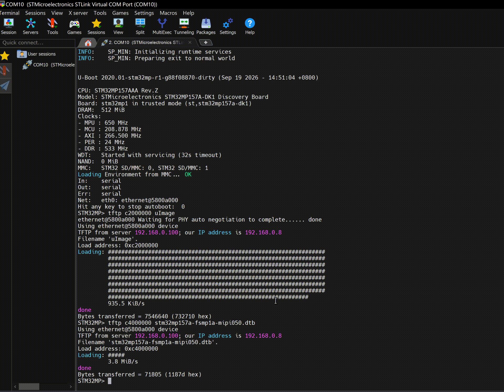
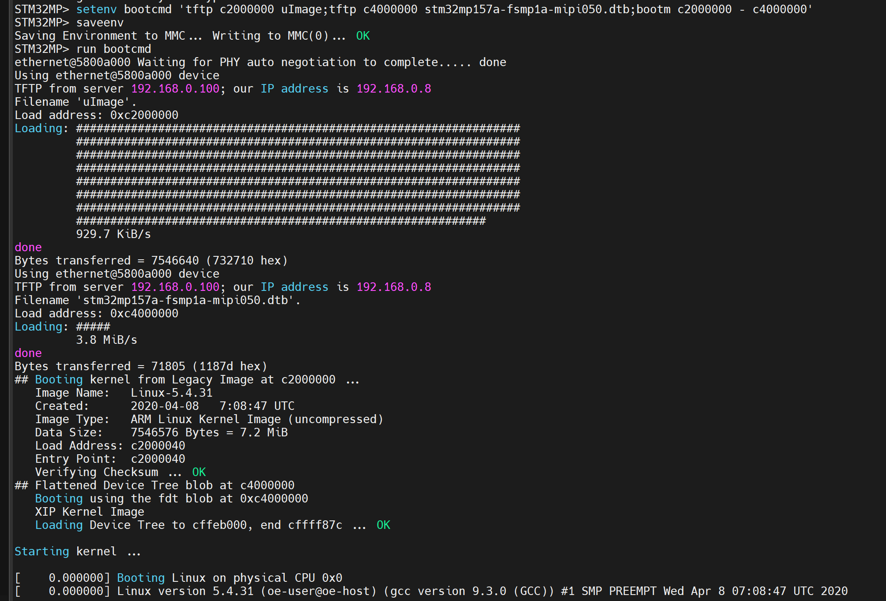

# 实验十六 启动 Linux 内核命令——bootm 点火，第一章悬案揭晓

> **对应课件**：《第4章 使用U-Boot》4.7 节，Slide 43-50
>
> **系列说明**：本系列基于华清远见 FS-MP1A（STM32MP157A）开发板，对应课件《第4章 使用U-Boot》。第 3 章以来，autoboot 收尾总有一句 bootm 找不到内核的报错——本篇揭晓谜底：不是 U-Boot 坏了，是 DRAM 里压根没有内核。把出厂内核（uImage + 设备树）用 tftp 装进内存，`bootm` 一声令下，Linux 第一次被我们亲手点火；再把这三条命令写进 `bootcmd` 环境变量，就是 autoboot 每次自动执行的那件事。本文覆盖 Slide 43-50：bootm/bootz/boot/bootd 四条命令、例 1 手动启动、例 2 固化到 bootcmd。前置：实验十三（tftp 通）、实验十五（可选：eMMC 里已备好内核文件）。

## 一、命令族四兄弟

| 命令 | 干什么 | 备注 |
|---|---|---|
| `bootm [addr [arg ...]]` | 启动 DRAM 里的 **uImage** 镜像 | stm32mp1 用 uImage，本篇主角 |
| `bootz [addr [arg ...]]` | 启动 DRAM 里的 **zImage** 镜像 | zImage 是另一种内核镜像格式；用哪种取决于厂商给哪种，命令格式与 bootm 相同 |
| `boot` / `bootd` | 执行 `bootcmd` 环境变量里保存的命令 | 两条是同一个命令的别名；**课件原话：ST 提供的 U-Boot 未使能 boot 命令**——报 `Unknown command` 就用 `run bootcmd` 等效 |

uImage 是"U-Boot 格式"的内核镜像（带头部信息），zImage 是裸压缩内核——第 5 章自己编内核时会亲手生成 uImage，本篇先用出厂现成的。

## 二、实验环境（实际）

| 项目 | 实际值 |
|---|---|
| 板子状态 | trusted 版 U-Boot，倒计时 5 秒，`STM32MP>` 可达 |
| 串口 | MobaXterm Serial 会话，115200；**新机上实测 `COM10`**（会话标题栏为 `STMicroelectronics STLink Virtual COM Port (COM10)`，2026-09-24）；`COM11` 是旧电脑的值，换机后一律以 Windows 设备管理器里的 ST-Link 串口号为准 |
| 网络 | Ubuntu 侧 `tftpd-hpa` 运行中（实验十三那台，`serverip 192.168.0.100`）；`/home/cnu/tftpboot` 里两个文件**都已在位**：`uImage`（7,546,640 字节，实验十三放入）+ `stm32mp157a-fsmp1a-mipi050.dtb`（71,805 字节，实验十五步骤 6 补入并实测 `Bytes transferred = 71805 (1187d hex)`，权限 644）——zip 里仅此一对文件，配套出厂品，无变体纠结 |
| 环境变量基线 | 实验九网络三件套 + `serverip 192.168.0.100` + `bootdelay 5`；`bootcmd` 仍为 ST 默认（autoboot 扫 mmc 落空那条路） |

> **开工自检（10 秒）**：上电先看 `Hit any key to stop autoboot:` 后面那个数字——若是 **0**（换过板子、重新分区烧写后最容易回到 0），先补一句 `setenv bootdelay 5` + `saveenv`（`env set` / `env save` 等价写法）再 `reset`，往后每次拦停都来得及按 Enter。做法见《实验十二》步骤 1 与步骤 4。

## 三、课件 ↔ 步骤对应表

| 课件 Slide | 内容 | 对应步骤 |
|---|---|---|
| 43 | 启动命令族总览 | 第一节 |
| 44 | bootm 命令格式与参数顺序 | 步骤 1 |
| 45~46 | 例 1：tftp 下载内核 + 设备树，bootm 启动 | 步骤 2 |
| 47 | bootz 与 bootm 的异同 | 第一节 |
| 48 | boot/bootd 执行 bootcmd；ST 未使能说明 | 步骤 3 |
| 49~50 | 例 2：三条命令存入 bootcmd，boot 启动 | 步骤 3 |

### 本篇动作 → 后面谁用 → 现在含糊的后果

| 本篇动作 | 后面哪一篇要用 | 现在含糊的后果 |
|---|---|---|
| 认下"点火前内存里必须有镜像"这个顺序（两条 `tftp` → `bootm`） | 实验十七的自定义变量 `mybootnet` 就是这三条的打包；第 5 章换成自己编的内核与 dtb，**顺序一个字都不用改** | 只记 `bootm` 不记"装弹"，就会撞 `Wrong Image Format` 还以为是命令坏了（本篇实测就撞了一次，见第五节） |
| 会读 bootm 的镜像头：`Data Size` / `Load Address` / `Entry Point` | 第 5 章用 `mkimage` 自己造 uImage 时，`-a`（加载地址）与 `-e`（入口地址）就是这里看到的 `c2000040` 那两个值 | 到第 5 章对着 `mkimage -a ... -e ...` 不知道参数该填什么、为什么填这个 |
| `bootcmd` 已被固化成"网络启动三连"并 saveenv | 实验十七要在它旁边再立 `mybootnet` / `mybootemmc` 两个变量，还要比较"上电自动跑的到底是哪条" | 忘了自己改过 `bootcmd`：下次上电自动跑网络启动、还 32 秒复位一次，看起来像板子异常 |
| 记下内核停在哪一行（`VFS: Unable to mount root fs`） | 第 5 章的验收 = 这一行往后挪；第 6 章挂上 NFS 根之后它应当彻底消失 | 没留基线，第 5 章"进步在哪一步"说不清 |
| 认下"看门狗 32 秒会自动复位"这件事 | 第 5、6 章内核起不来的每一次都会遇到 | 每被复位一次就怀疑供电或板子坏了，白拆一次卡 |

本篇用到的两个文件都来自资料包 `官方系统内核和设备树.zip`（`uImage` 7,546,640 + `stm32mp157a-fsmp1a-mipi050.dtb` 71,805），实验十三/十五已把它们放进 `/home/cnu/tftpboot`——**本篇不需要新资料**。

## 四、实验步骤

### 步骤 1：bootm 的参数语法（Slide 44）


> 图：课件 Slide 44——bootm 命令格式文本：`bootm [addr [arg ...]]`。

`bootm` 的参数有固定顺序，空位用 `-` 占位：

```
bootm <内核地址> <initrd地址> <设备树地址>
bootm c2000000 - c4000000     ; 没有 initrd，用减号占位
```

三件套里我们只有两件（内核 + 设备树），中间的 initrd 位置写 `-`——这个减号占位是 bootm 语法的精髓，写漏或写成空格都会启动失败。

**实际执行结果**：本步骤只认语法、**不敲命令**，无实测记录。特别提醒：**别照着这一节的格式行直接点火**——`tftp` 那两条还没跑，DRAM 里根本没有镜像，`bootm` 必然报 `Wrong Image Format`（正常现象，不是故障）。请先做完步骤 2 的"装弹"再回来对照语法，真实回显也在步骤 2。

### 步骤 2：例 1——tftp 装弹，bootm 点火（Slide 45~46）

```
STM32MP> tftp c2000000 uImage
STM32MP> tftp c4000000 stm32mp157a-fsmp1a-mipi050.dtb
STM32MP> bootm c2000000 - c4000000
```


> 图：课件 Slide 45——例 1 前两步：`tftp c2000000 uImage`（Bytes transferred = 7310904）与 `tftp c4000000 stm32mp157d-atk.dtb`（Bytes transferred = 63833），内核与设备树分别落位两个地址。

dtb 文件名长，逐字核对（Tab 不补文件名，实验十五提过）。两条 tftp 都报 `Bytes transferred` 后，**先花 30 秒确认内存里真有东西再点火**：`md.l c2000000 1` 应见 uImage 魔数 `27051956`、`md.l c4000000 1` 应见设备树魔数 `d00dfeed`（我们这一遍就是先照步骤 1 的格式行敲了一次点火命令，撞上了那句 `Wrong Image Format`——现场与判读见第五节「跳步提醒」）。确认无误才点火，课件那屏长这样：


> 图：课件 Slide 46——`bootm c2000000 - c4000000` 的完整回显：`## Booting kernel from Legacy Image ...`、镜像名 Linux-5.4.31、`Verifying Checksum ... OK`、`## Flattened Device Tree blob at ...`、`Loading Device Tree to ...  OK`，最后 `Starting kernel ...` 之后接续打印 Linux 内核启动日志（`Booting Linux on physical CPU 0x0`、`Linux version 5.4.31 ...`、`Machine model: ...`）。**我们这一遍的完整原样回显在下面「实际执行结果」的 ②**，两处数值不同是因为镜像不同（课件板 8 MB 内核、我们这份 7.2 MB），结构逐行对得上即可。

**`Starting kernel ...` 之后串口刷出的就是 Linux 的启动日志**——U-Boot 的历史使命完成，控制权移交内核：

- `Booting Linux on physical CPU 0x0`、`Linux version ...`——内核活了；
- `Machine model: ...`——报的是板子厂商标识（出厂 TF-A 在实验十一自报过同款，同一家的出厂设备树）。**实测这一行是 `HQYJ STM32MP157 FSMP1A MIPI Discovery Board`，见下方 ③**。

**预期结局**：内核日志滚到某处停下——大概率是 `VFS: Unable to mount root fs` 或 kernel panic 一类。**这不是失败**：我们没传 `bootargs`（这个环境变量还空着——**它是 U-Boot 在点火那一刻传给内核的启动参数串**，`console=`（日志往哪个串口发）、`root=`（根文件系统在哪）全写在里面，第 5、6 章会正式用到），板上也没有它能认的根文件系统——内核无根可挂，只好停住。这行报错就是第 5 章的大门：内核移植篇要做的正是"自己编内核 + 自己给根文件系统"。记录下**日志停在哪一行**——那是第 5 章的起跑线。（实测停在 `Kernel panic - not syncing: VFS: Unable to mount root fs on unknown-block(0,0)`，见下方 ④。）

**看门狗彩蛋**：若内核停住约半分钟后板子自己复位（TF-A 横幅重新滚起），是启动横幅里那句 `WDT: Started with servicing (32s timeout)` 的看门狗在履行职责——没人喂狗了，它按约定复位系统，属正常收场。按复位键或等它自己复位，回到 `STM32MP>`。（本次就是这个结局，复位原因被 TF-A 打印成 `IWDG2 Reset`，见下方 ⑤。）

**实际执行结果**（2026-09-24 实测，**内核真的起来了**——第 3 章以来第一次由我们亲手点火）：

**① 装弹。** 两条 `tftp` 各自落位，字节数与实验十五完全对得上：

```
STM32MP> tftp c2000000 uImage
ethernet@5800a000 Waiting for PHY auto negotiation to complete..... done
...
Bytes transferred = 7546640 (732710 hex)
STM32MP> tftp c4000000 stm32mp157a-fsmp1a-mipi050.dtb
...
Bytes transferred = 71805 (1187d hex)
```


> 图：实测录屏（MobaXterm 串口会话，标题栏可见本次用的是 `COM10 (STMicroelectronics STLink Virtual COM Port)`）——从上电的 TF-A 尾段 `SP_MIN: Preparing exit to normal world`、U-Boot 横幅（`WDT: Started with servicing (32s timeout)`、`MMC: STM32 SD/MMC: 0, STM32 SD/MMC: 1`、`Net: eth0: ethernet@5800a000`），到 `tftp c2000000 uImage`（满屏 `#`、`935.5 KiB/s`、`Bytes transferred = 7546640 (732710 hex)`）与 `tftp c4000000 stm32mp157a-fsmp1a-mipi050.dtb`（五个 `#`、`3.8 MiB/s`、`= 71805 (1187d hex)`）两条命令先后落位。

**② 点火。** `bootm` 这一段头信息是全篇最该逐行读的东西（原样照抄，未删字段）：

```
STM32MP> bootm c2000000 - c4000000
## Booting kernel from Legacy Image at c2000000 ...
   Image Name:   Linux-5.4.31
   Created:      2020-04-08   7:08:47 UTC
   Image Type:   ARM Linux Kernel Image (uncompressed)
   Data Size:    7546576 Bytes = 7.2 MiB
   Load Address: c2000040
   Entry Point:  c2000040
   Verifying Checksum ... OK
## Flattened Device Tree blob at c4000000
   Booting using the fdt blob at 0xc4000000
   XIP Kernel Image
   Loading Device Tree to cffeb000, end cffff87c ... OK

Starting kernel ...
```

- **`Data Size = 7546576`，比 tftp 的 `7546640` 少 64 字节**——那 64 字节就是 uImage 的头（`Image Name` / `Created` / `Image Type` / 大小 / 加载地址那一包）。所以 `Load Address` 与 `Entry Point` 都是 `c2000040` 而不是 `c2000000`：真正的内核代码从"地址 + 0x40"开始。**看到这两个数对不上不要以为哪里错了，这是带头镜像的正常形状。**
- `Verifying Checksum ... OK` = 头里记的校验和与实际数据吻合，说明下载没坏包。
- 设备树被从 `c4000000` **搬到了 `cffeb000`**（U-Boot 会给它挑一个不会被内核压掉的位置）——所以事后 `md.l c4000000` 已经看不到 `d00dfeed` 是正常现象。
- `Starting kernel ...` 之后，串口就是 Linux 的天下，U-Boot 交权。

**③ 内核活了（摘六行）。** 原日志从这里往后还有几百行驱动初始化，全贴没意义，挑出该读的：

```
[    0.000000] Booting Linux on physical CPU 0x0
[    0.000000] Linux version 5.4.31 (oe-user@oe-host) (gcc version 9.3.0 (GCC)) #1 SMP PREEMPT Wed Apr 8 07:08:47 UTC 2020
[    0.000000] OF: fdt: Machine model: HQYJ STM32MP157 FSMP1A MIPI Discovery Board
[    0.000000] Kernel command line:
[    0.180787] SMP: Total of 2 processors activated (96.00 BogoMIPS).
[    4.665168] VFS: Cannot open root device "(null)" or unknown-block(0,0): error -6
```

- **`Machine model: HQYJ STM32MP157 FSMP1A MIPI Discovery Board`**——上面讲解里那句"报的是板子厂商标识"落地，同时证明 `mipi050` 那份设备树被内核正确认领（不是 `stm32mp157d-atk`，也不是 U-Boot 横幅里那个 DK1——**U-Boot 说 DK1、内核说 FSMP1A，两者不矛盾**：U-Boot 的设备树还是 DK1 模板那份，内核用的是我们给它的那份 dtb）。
- **`Kernel command line:` 后面是空的**——这一行就是本篇的题眼：没设 `bootargs`，所以 `console=`、`root=` 一个都没传。双核已起、驱动已探（触摸、显示、以太网、MMC 都在日志里露过面），只差"根"。
- 中间那几百行里内核把两块盘都认了出来：`mmcblk1: SD32G 29.7 GiB`、`mmcblk2: 004GA0 3.69 GiB`——**实验十四在 U-Boot 里摸的那两块盘，Linux 侧是同一对名字**，两套工具互证。


> 图：实测实物（同一时刻的板子）——MIPI 屏点亮、网口接入，**板载指示灯由红转绿**：红色是"只有固件在跑"，转绿代表 Linux 内核已经接管并把电源/背光这类外设驱动初始化到位（日志里能看到 `stm32-display ... fb0: stmdrmfb frame buffer device` 与 `Console: switching to colour frame buffer device 60x53`）。**这是不用读日志也能一眼判断"内核活了"的物理信号**——串口刷得快时容易看漏，抬头看一眼灯最省事。

**④ 预期结局：panic。** 日志停在这两行（中间还夹着栈回溯，可忽略）：

```
[    5.017253] Kernel panic - not syncing: VFS: Unable to mount root fs on unknown-block(0,0)
[    5.406484] ---[ end Kernel panic - not syncing: VFS: Unable to mount root fs on unknown-block(0,0) ]---
```

**起跑线记录在案**：第 5 章要做的正是"自己编内核 + 自己给根文件系统"，届时这条 panic 会先变成"有 `bootargs` 但根还不对"，再变成能登录。

**⑤ 看门狗彩蛋也兑现了。** panic 之后板子约半分钟自己复位，重启时 TF-A 把原因明明白白打了出来：

```
NOTICE:  CPU: STM32MP157AAA Rev.Z
NOTICE:  Model: HQYJ FS-MP1A Discovery Board
INFO:    Reset reason (0x214):
INFO:      IWDG2 Reset (rst_iwdg2)
```

正是启动横幅那句 `WDT: Started with servicing (32s timeout)` 在履职——没人喂狗，它按约定复位系统。**不是板子坏了，别去查电源。**

**⑥ 顺手白捡的一次互证。** panic 前内核把可用分区列了一遍（`Please append a correct "root=" boot option; here are the available partitions` 那一段），`mmcblk2p1`~`p5` 后面跟的 GUID 与实验十四 `mmc part` 表里的 Partition GUID 一字不差（例如 2 号 `77877125-add0-4374-9e60-02cb591c9737` = `bootfs`）；`mmcblk2boot0`/`boot1` 各 **2.00 MiB**、`mmcblk2rpmb` **512 KiB**，也正是实验十四 `mmc info` 里 `Boot Capacity: 2 MiB ENH` / `RPMB Capacity: 512 KiB ENH` 在 Linux 侧的名字。**两张地图对上了**，实验十四那次摸底没白做。

### 步骤 3：例 2——把启动命令固化进 bootcmd（Slide 48~50）

手动三连每次都要敲三行，`bootcmd` 环境变量就是它们的"快捷方式"——autoboot 倒计时归零后执行的就是它：

```
STM32MP> setenv bootcmd 'tftp c2000000 uImage;tftp c4000000 stm32mp157a-fsmp1a-mipi050.dtb;bootm c2000000 - c4000000'
STM32MP> saveenv
STM32MP> run bootcmd
```


> 图：课件 Slide 49——例 2 命令：`setenv bootcmd 'tftp c2000000 uImage;tftp c4000000 stm32mp157d-atk.dtb;bootm c2000000 - c4000000'` + `saveenv`，最后执行 `boot`。


> 图：课件 Slide 50——例 2 运行：`saveenv` 落盘（Writing to redundant MMC(1)... OK）后，`boot` 触发 bootcmd：两条 tftp 先后下载内核与设备树，`## Booting kernel ...` 接 `Starting kernel ...`，随后滚出 Linux 日志。

几个要点：

- **三条命令打包在一个引号里**，用分号串联——整个字符串是一个环境变量的值（实验十二练过的语法：值含空格必须加引号）；
- `run bootcmd` 手动执行它；`boot` 命令与之等效——若报 `Unknown command`，就是课件 Slide 48 说的"ST 未使能 boot 命令"，`run bootcmd` 即可，两者一回事；
- **saveenv 之后行为变化**：此后每次上电，倒计时归零 = 自动走网络启动。**Ubuntu 与它的 `tftpd-hpa` 必须在线**，否则 bootcmd 里的 tftp 重试几轮后 Abort 落回命令行（无害，就是慢）。倒计时 5 秒内按 Enter 照旧可以拦停；
- 想还原"归零后安静落提示符"：`setenv bootcmd`（赋空值）+ `saveenv`——第 5 章会更 handy 地管理它，届时再说。

**实际执行结果**（2026-09-24 实测，**一条命令顶步骤 2 那三行，结果一字不差**）：

```
STM32MP> setenv bootcmd 'tftp c2000000 uImage;tftp c4000000 stm32mp157a-fsmp1a-mipi050.dtb;bootm c2000000 - c4000000'
STM32MP> saveenv
Saving Environment to MMC... Writing to MMC(0)... OK
STM32MP> run bootcmd
ethernet@5800a000 Waiting for PHY auto negotiation to complete..... done
Using ethernet@5800a000 device
TFTP from server 192.168.0.100; our IP address is 192.168.0.8
Filename 'uImage'.
Load address: 0xc2000000
Loading: #################################################################
         ...（八行 #）
         929.7 KiB/s
done
Bytes transferred = 7546640 (732710 hex)
Using ethernet@5800a000 device
TFTP from server 192.168.0.100; our IP address is 192.168.0.8
Filename 'stm32mp157a-fsmp1a-mipi050.dtb'.
Load address: 0xc4000000
Loading: #####
         3.8 MiB/s
done
Bytes transferred = 71805 (1187d hex)
## Booting kernel from Legacy Image at c2000000 ...
   Image Name:   Linux-5.4.31
   ...（镜像头与步骤 2 完全一致）
   Verifying Checksum ... OK
## Flattened Device Tree blob at c4000000
   Booting using the fdt blob at 0xc4000000
   XIP Kernel Image
   Loading Device Tree to cffeb000, end cffff87c ... OK

Starting kernel ...

[    0.000000] Booting Linux on physical CPU 0x0
[    0.000000] Linux version 5.4.31 (oe-user@oe-host) (gcc version 9.3.0 (GCC)) #1 SMP PREEMPT Wed Apr 8 07:08:47 UTC 2020
```


> 图：实测串口——`setenv bootcmd '...'` → `saveenv`（`Saving Environment to MMC... Writing to MMC(0)... OK`）→ `run bootcmd` 之后两条 tftp 依次落位（`7546640 (732710 hex)`、`71805 (1187d hex)`），紧接 `## Booting kernel from Legacy Image at c2000000 ...` 到 `Starting kernel ...`、`Booting Linux on physical CPU 0x0`、`Linux version 5.4.31 ...`——**与步骤 2 手动三连的结局完全相同，只是敲了一行。**

四点读法：

1. **`Writing to MMC(0)... OK` 而不是课件那屏的 `MMC(1)`**——环境存在**启动设备**上，我们从 SD 卡启动所以是 `MMC(0)`（实验十二、十三已两次实测过这条）。设备号跟着启动方式走，不是谁配错了。
2. **`run bootcmd` = 把那个字符串原样敲进命令行执行**，所以两条 `Bytes transferred`、镜像头、`Starting kernel ...` 全都一模一样。这就是"快捷方式"的含义：**固化的是命令串，不是启动结果**，服务器没开时它照样几轮超时。
3. **第二发 tftp 前不再打 `Waiting for PHY auto negotiation to complete...`**——PHY 只在第一次需要自协商，同一上电周期内后续复用链路。看到"第一发等一点、第二发不等"是正常的，别以为链路掉了。
4. 后续结局同步骤 2：内核日志滚到 `VFS: Unable to mount root fs` panic，约半分钟后被 IWDG2 复位。**复位后上电倒计时归零，它会自动重跑这条 bootcmd**——这就是注意事项 5 说的"服务器要常在线"；不想每次都自动跑，就 `setenv bootcmd`（赋空）+ `saveenv` 还原。

## 五、注意事项

1. **内核与设备树必须配套**：`uImage` 与 `stm32mp157a-fsmp1a-mipi050.dtb` 出自同一份出厂 zip——别拿课件截图里的 `stm32mp157d-atk.dtb` 名字照打，那是别人板子的设备树。
2. **地址约定全系列统一**：内核 `c2000000`、设备树 `c4000000`（实验十三起的约定，课件同款）。bootm 的三个地址要与 tftp 下载地址一字不差。
3. **`-` 占位不能丢**：`bootm c2000000 - c4000000` 中间的减号两侧空格都在——写成 `bootm c2000000 c4000000` 会把设备树当地址用，启动失败。
4. **`Starting kernel ...` 之后无输出**：先等 10 秒（内核解压/早期初始化要时间），再确认 dtb 是不是 fsmp1a 那份（控制台配置不对会"哑火"）；再不行回查 tftp 的 Bytes transferred。
5. **固化 bootcmd 后服务器要常在线**：`tftpd-hpa` 没开（或虚拟机没启动）时，上电会多等几轮 tftp 超时才落回命令行——不是死机。
6. **终端粘贴用右键**；bootcmd 那条长命令务必整体复制粘贴，手打容易丢分号。

### 跳步提醒：只照步骤 1 的格式行点火，必然报 `Wrong Image Format`

现象（2026-09-24 实测）：本次在做到步骤 2 之前，先照步骤 1 那行格式顺手敲了一次点火命令：

```
STM32MP> bootm c2000000 - c4000000
Wrong Image Format for bootm command
ERROR: can't get kernel image!
STM32MP>
```

**原因不神秘：两条 `tftp` 还没跑，`0xc2000000` 里本来就没有内核。** 这两行报错是 U-Boot 在如实汇报"这个地址上没有镜像"——不是板子问题、不是命令写错、更不是网络问题。步骤 1 本来只讲语法、不敲命令，但格式行长得太像可以直接执行的命令，读者很容易顺手抄进终端（本次就是），所以已在步骤 1 末尾补了一句"本步骤不要敲命令"。

想自己验证，用两条只读命令就够了（`md.l` = 按 32 位显示内存内容，不改任何东西）：

```
STM32MP> md.l c2000000 4
c2000000: 55555555 20166330 81143000 28303350    UUUU0c. .0..P30(
STM32MP> md.l c4000000 2
c4000000: 55555555 bbbfdff7                      UUUU....
```

**两个地址里都没有镜像头**：uImage 的头一个字段是魔数 `27051956`，设备树（FDT）是 `d00dfeed`。这里读到的是一串无意义的花纹值，说明点火那一刻 **DRAM 里既没有内核也没有设备树**——枪膛是空的。

修法就一句：按顺序做完步骤 2（两条 `tftp` 都打出 `Bytes transferred` 之后）再 `bootm`。

**另外两种会产生同样报错的真实情况**，后面几章还会遇到，一并记在这儿：

1. **下载之后板子重启过。** DRAM 是易失的：按了复位键、拔过电源，甚至内核起不来后被看门狗自动复位（本篇步骤 2 那条"看门狗彩蛋"，32 秒就咬一次），内存里的镜像就全没了。重启后 U-Boot 回到干净状态，`c2000000` 剩的就是上面那种花纹值——**必须重新 `tftp` 再 `bootm`**。
2. **地址打串了。** 实验十五练手用的是 `tftp c0000000 uImage`（为了配合 `ext4write`），本篇要的是 `tftp c2000000 uImage`。下到 `c0000000`、却在 `c2000000` 点火，报的就是这个。

**值得养成的固定动作（30 秒）**：`bootm` 之前先 `md.l c2000000 1` 和 `md.l c4000000 1`，看到 `27051956` 与 `d00dfeed` 再点火。少这一步，`bootm` 只会丢给你一句"格式不对"；有这一步，"里面根本没东西"和"东西在但不对"两种病当场分开——定位速度差一个数量级。

## 六、怎么验证

1. `bootm c2000000 - c4000000` 后能看到 `Starting kernel ...` 并滚出 Linux 内核日志（`Booting Linux on physical CPU 0x0` 一行起）——**已实测**（2026-09-24，`## Booting kernel from Legacy Image at c2000000 ...` → `Verifying Checksum ... OK` → `Starting kernel ...` 一路正常）；
2. 内核日志最后一行有记录——第 5 章的起跑线——**已记录**：`Kernel panic - not syncing: VFS: Unable to mount root fs on unknown-block(0,0)`，且 `Kernel command line:` 为空（bootargs 未设）是直接原因；
3. `run bootcmd` 能复现同一启动过程（bootcmd 已 saveenv，`print bootcmd` 可查验）——**已实测**：`saveenv` 打 `Writing to MMC(0)... OK`，`run bootcmd` 一条命令复现两条 tftp + 镜像头 + `Starting kernel ...`，与手动三连结果一致；
4. `boot` 报 `Unknown command` 时知道用 `run bootcmd` 等效（课件 Slide 48 的知识点落地）——本篇直接用 `run bootcmd` 完成，`boot` 这条命令在本版固件上是否内建**未单独验证**，留到实验十七盘点命令时一并确认。

不达标时的排查：

| 现象 | 先查什么 |
|---|---|
| `bootm` 报 `Wrong Image Format for bootm command` + `ERROR: can't get kernel image!` | **不是 bootm 写错了，是内存里没装弹**：最常见就是**跳过了步骤 2 的两条 `tftp`**（照步骤 1 的格式行直接点火）；其次是两条 tftp 本次没成功、或下载后板子重启过（DRAM 易失）。自检：`md.l c2000000 1` 应见魔数 `27051956`、`md.l c4000000 1` 应见 `d00dfeed`。完整现场与判读见第五节「跳步提醒」 |
| `## Flattened Device Tree blob` 后卡住 | dtb 地址对不对（`c4000000`）、dtb 是不是 fsmp1a 那份 |
| `Starting kernel ...` 后永久无输出 | 多等 10 秒；再确认 tftp 下载的 dtb 字节数 = 71,805（服务器侧 `ls -l /home/cnu/tftpboot` 也对一次）；仍无输出则记录现象，第 5 章编自己的内核时自然解决 |
| 内核日志滚出后 panic | **预期结局**——记录停在哪一行，这正是第 5 章要解决的问题 |

## 七、实验完成标志

- `tftp` 两条（内核 `c2000000` + 设备树 `c4000000`）字节数对账通过（步骤 2 实测：`7546640 (732710 hex)` 与 `71805 (1187d hex)`）
- `bootm c2000000 - c4000000` 点火成功——`Starting kernel ...` 后滚出 Linux 日志（步骤 2 实测：`Linux version 5.4.31`、`Machine model: HQYJ STM32MP157 FSMP1A MIPI Discovery Board`、双核起来、驱动探完）
- 内核日志停止位置有记录（第 5 章起跑线）（步骤 2 实测：`Kernel panic - not syncing: VFS: Unable to mount root fs on unknown-block(0,0)`；`Kernel command line:` 为空；约半分钟后 `IWDG2 Reset` 自动复位，看门狗彩蛋同步兑现）
- `bootcmd` 三连已 saveenv，`run bootcmd` 复现启动（步骤 3 实测：`Saving Environment to MMC... Writing to MMC(0)... OK` → `run bootcmd` 一条命令走完两条 tftp + `bootm`，`Starting kernel ...` 与手动三连一致）
- `boot`/`bootd` 与 `run bootcmd` 的等效关系：本篇用 `run bootcmd` 完成启动，`boot` 是否内建留实验十七确认（步骤 3）

## 八、下一步：其他命令与自定义启动变量

下一篇覆盖 4.8 节（Slide 51-55）：`reset` / `run` / `go` 三条边角命令，主角是 `run`——用自定义环境变量实现"网络启动 / eMMC 启动一键切换"（课件例 3），Linux 系统调试期的日常动作。这也是第 4 章收官篇：U-Boot 的命令行武器库到本篇全部过手。
