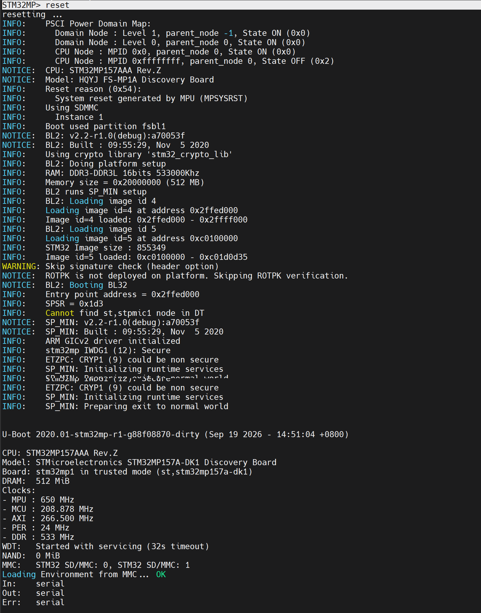
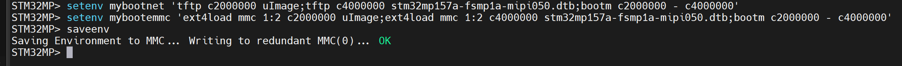
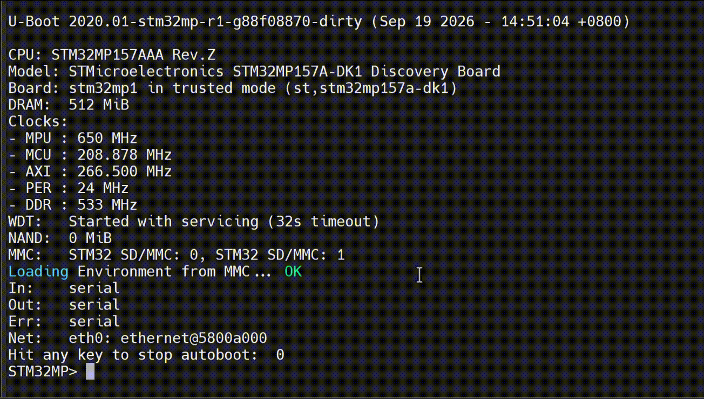
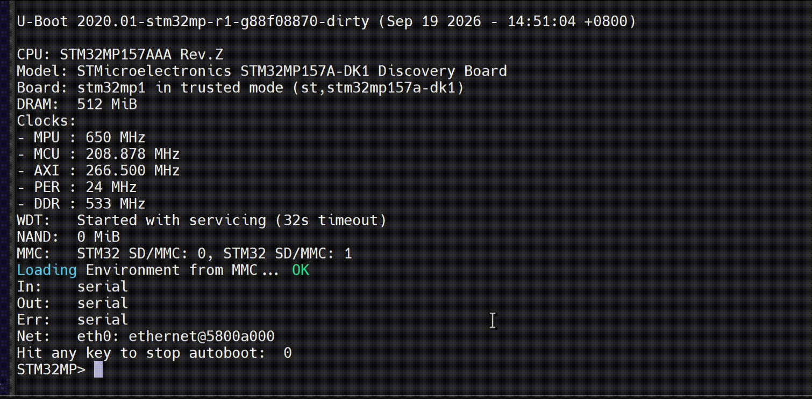

# 实验十七 其他命令与自定义启动变量——run 一键切换启动方式，第 4 章收官

> **对应课件**：《第4章 使用U-Boot》4.8 节，Slide 51-55
>
> **系列说明**：本系列基于华清远见 FS-MP1A（STM32MP157A）开发板，对应课件《第4章 使用U-Boot》。第 4 章最后一篇，三条"边角"命令 `reset` / `run` / `go`——其中 `run` 是真正的主角：环境变量里不只 `bootcmd` 一条能装命令，**自定义变量 + run** 可以做出任意多个"启动快捷方式"，在网络启动与 eMMC 启动之间一键切换（课件例 3）。这是 Linux 系统调试期的日常动作：同一块板，多种启动路径，随取随用。本文覆盖 Slide 51-55。前置：实验十六（bootcmd 网络启动已跑通，eMMC 分区里有内核文件）。

## 一、本篇的三条命令

| 命令 | 干什么 | 本篇安排 |
|---|---|---|
| `reset` | 重启开发板 | 步骤 1 动手（其实前几篇一直在偷用） |
| `run <变量名>` | 执行环境变量里定义的命令串 | 步骤 2 主角——自定义启动变量 |
| `go addr [arg ...]` | 跳到 DRAM 指定地址直接执行程序 | 步骤 3 认格式 |

## 二、实验环境（实际）

| 项目 | 实际值 |
|---|---|
| 板子状态 | trusted 版 U-Boot，倒计时 5 秒，`STM32MP>` 可达 |
| 串口 | MobaXterm Serial 会话，115200；**新机上实测 `COM10`**（会话标题栏为 `STMicroelectronics STLink Virtual COM Port (COM10)`，2026-09-24）；`COM11` 是旧电脑的值，换机后一律以 Windows 设备管理器里的 ST-Link 串口号为准 |
| 网络 | Ubuntu 侧 `tftpd-hpa` 运行中，`/home/cnu/tftpboot` 有 `uImage` + `stm32mp157a-fsmp1a-mipi050.dtb`（实验十三/十六） |
| eMMC | 2 号 `bootfs`（ext4）里三样都在（实验十五步骤 1 实测清单）：出厂 `uImage` 7,546,640、配套 `stm32mp157a-fsmp1a-mipi050.dtb` 71,805、本篇自己写进去的 `test_uImage` 7,546,640——**mybootemmc 要的两个文件已齐** |
| 环境变量基线 | 网络三件套 + `serverip` + `bootdelay 5` + 实验十六固化的 `bootcmd`（网络启动三连） |

> **开工自检（10 秒）**：上电先看 `Hit any key to stop autoboot:` 后面那个数字——若是 **0**（换过板子、重新分区烧写后最容易回到 0），先补一句 `setenv bootdelay 5` + `saveenv`（`env set` / `env save` 等价写法）再 `reset`，往后每次拦停都来得及按 Enter。做法见《实验十二》步骤 1 与步骤 4。

## 三、课件 ↔ 步骤对应表

| 课件 Slide | 内容 | 对应步骤 |
|---|---|---|
| 51 | reset 命令 | 步骤 1 |
| 52 | run 命令与它的最大用途 | 步骤 2 |
| 53~54 | 例 3：mybootemmc / mybootnet 自定义启动变量 | 步骤 2 |
| 55 | go 命令格式 | 步骤 3 |

### 本篇动作 → 后面谁用 → 现在含糊的后果

| 本篇动作 | 后面哪里还会用 | 现在含糊的后果 |
|---|---|---|
| 两条自定义启动变量 `mybootnet` / `mybootemmc` 已 saveenv | 第 5 章换上自己编的内核与设备树后，**这两条就是日常"改完就 `run` 一把"的快捷方式**（改文件名即可）；第 6 章做 NFS 根时再加一条 `mybootnfs` 也是同一套路 | 每次调试都手敲三条长命令，容易丢分号、丢占位减号，出错后还以为内核编坏了 |
| 认下"回显里出现 `TFTP` 就是走网络、出现 `bytes read` 就是走分区" | 第 5、6 章排"我到底启动的是哪份内核"时的第一手判据 | 两条路径的终点日志长得几乎一样，分不清启动的是网络那份还是板上那份，第 5 章替换内核后极易误判 |
| 会看 TF-A 的 `Reset reason`（0x54 软复位 / 0x214 看门狗） | 第 5、6 章内核起不来、反复复位时的定位入口 | 把看门狗复位当成"板子供电不稳"，白折腾硬件 |
| 认下 `run` 与 `bootcmd` 是同一机制（都是执行一个环境变量） | 第 6 章要动 `bootargs`、第 7 章之后可能整条换启动流程 | 以为"启动方式"是固件里写死的东西，不敢改、不会改 |

本篇**不需要任何新资料**：`mybootnet` 用的两个文件在 `/home/cnu/tftpboot`，`mybootemmc` 用的两个文件在 eMMC 2 号 `bootfs`（实验十五步骤 1 实测清单）。

## 四、实验步骤

### 步骤 1：reset——正式认识老朋友（Slide 51）

前几篇的"复位重来"用的就是它，现在正式打个照面：

```
STM32MP> reset
```


> 图：课件 Slide 51——`reset` 后输出 `resetting ...`，复位后 TF-A 重新接管：日志里能看到 PSCI Power Domain Map、CPU/Model 信息、`Reset reason (0x54): System reset generated by MPU (MPSYSRST)`、`Boot partition fsbl1`、BL2 构建信息等一段完整的引导链开场。

`resetting ...` 之后，整条引导链从头跑：TF-A → U-Boot 横幅 → 倒计时 5 秒——和按板上复位键等效（课件截图里还能看到 TF-A 报的 `Reset reason`，软复位也会留痕）。倒计时内按 Enter 拦停，继续本篇。

**实际执行结果**（2026-09-24 实测，**课件那句 `Reset reason (0x54)` 我们板上一字不差**）：

```
STM32MP> reset
resetting ...
INFO:    PSCI Power Domain Map:
INFO:      Domain Node : Level 1, parent_node -1, State ON (0x0)
INFO:      Domain Node : Level 0, parent_node 0, State ON (0x0)
INFO:      CPU Node : MPID 0x0, parent_node 0, State ON (0x0)
INFO:      CPU Node : MPID 0xffffffff, parent_node 0, State OFF (0x2)
NOTICE:  CPU: STM32MP157AAA Rev.Z
NOTICE:  Model: HQYJ FS-MP1A Discovery Board
INFO:    Reset reason (0x54):
INFO:      System reset generated by MPU (MPSYSRST)
INFO:    Using SDMMC
INFO:      Instance 1
INFO:    Boot used partition fsbl1
NOTICE:  BL2: v2.2-r1.0(debug):a70053f
NOTICE:  BL2: Built : 09:55:29, Nov  5 2020
...
INFO:    RAM: DDR3-DDR3L 16bits 533000Khz
INFO:    Memory size = 0x20000000 (512 MB)
INFO:    BL2 runs SP_MIN setup
...
WARNING: Skip signature check (header option)
NOTICE:  ROTPK is not deployed on platform. Skipping ROTPK verification.
NOTICE:  BL2: Booting BL32
...
NOTICE:  SP_MIN: v2.2-r1.0(debug):a70053f
...
U-Boot 2020.01-stm32mp-r1-g88f08870-dirty (Sep 19 2026 - 14:51:04 +0800)

CPU:  STM32MP157AAA Rev.Z
Model: STMicroelectronics STM32MP157A-DK1 Discovery Board
Board: stm32mp1 in trusted mode (st,stm32mp157a-dk1)
DRAM:  512 MiB
...
WDT:   Started with servicing (32s timeout)
NAND:  0 MiB
MMC:   STM32 SD/MMC: 0, STM32 SD/MMC: 1
Loading Environment from MMC... OK
In:    serial
Out:   serial
Err:   serial
Net:   eth0: ethernet@5800a000
Hit any key to stop autoboot:  0
```


> 图：实测串口——`reset` → `resetting ...` 之后 TF-A 从头接管：`PSCI Power Domain Map` 四行、`CPU: STM32MP157AAA Rev.Z`、`Model: HQYJ FS-MP1A Discovery Board`，接着 **`Reset reason (0x54): System reset generated by MPU (MPSYSRST)`**，再往下 `Boot used partition fsbl1`、BL2/SP_MIN 的构建串、`Memory size = 0x20000000 (512 MB)`，然后才是 U-Boot 横幅与 `Loading Environment from MMC... OK`。中间那几行 `WARNING: Skip signature check` / `ROTPK is not deployed` 是实验十一就解释过的"未烧信任根，跳过验签"，属正常。

四条读法：

1. **`Reset reason (0x54) = MPSYSRST`（MPU 发起的软复位）**，与课件 Slide 51 完全一致——也就是说 `reset` 命令和按板上复位键在芯片层面留下的是同一个痕迹。**这条以后排障有用**：TF-A 每次开场都报复位原因，能区分"软件复位"（0x54）、"看门狗复位"（实验十六见到的 `0x214 / IWDG2 Reset`）、"上电复位"。
2. **`Model` 两行不一样不是 bug**：TF-A 报 `HQYJ FS-MP1A Discovery Board`（华清出厂 TF-A 的设备树），U-Boot 报 `STMicroelectronics STM32MP157A-DK1 Discovery Board`（我们移植时以 DK1 为模板，第 3 章 F 系列没改这一处）。**同一块板、两级固件、两套设备树**，实验十六的内核日志里还有第三种（`HQYJ STM32MP157 FSMP1A MIPI Discovery Board`）。
3. **`Boot used partition fsbl1`**：TF-A 自己报告它从 SD 卡 1 号分区（实验四分的 `fsbl1`）被读起来——与实验十四 `mmc part` 那张表对得上（`fsbl1` 就是 1 号分区，256 KiB）。
4. **`Loading Environment from MMC... OK`**：环境变量从 SD 卡读回来了，实验十六固化的 `bootcmd` 与本篇即将写入的两个变量都存在那里——所以下面 `saveenv` 之后重启，`mybootnet`/`mybootemmc` 还在。

### 步骤 2：run + 自定义启动变量——例 3 落地（Slide 52~54）

**场景**（课件例 3 原文大意）：调试 Linux 系统时，常常要在网络启动和 eMMC 启动之间来回切换。`bootcmd` 只有一条，换来换去就得反复重写——麻烦。解法：自定义两个环境变量，各存一条启动路径，切换时 `run` 一下即可。

创建两条自定义启动变量（文件名与分区号按实验十四/十五的实测替换；此处沿用课件的 `mmc 1:2` 与我们统一的两个下载地址）：

```
STM32MP> setenv mybootnet 'tftp c2000000 uImage;tftp c4000000 stm32mp157a-fsmp1a-mipi050.dtb;bootm c2000000 - c4000000'
STM32MP> setenv mybootemmc 'ext4load mmc 1:2 c2000000 uImage;ext4load mmc 1:2 c4000000 stm32mp157a-fsmp1a-mipi050.dtb;bootm c2000000 - c4000000'
STM32MP> saveenv
```


> 图：课件 Slide 54——创建 mybootemmc 与 mybootnet 两条环境变量：值都是"加载内核 + 加载设备树 + bootm 启动"三连，区别只在加载手段（ext4load 从 eMMC 分区取 / tftp 从网络取）；课件红字特别标注 bootm 参数里的占位减号两侧**必须有空格**。

对比两条变量：命令骨架一字不差，只有"从哪拿文件"不同——这正是 run 机制的价值：**启动方式是数据（环境变量），不是写死在代码里的流程**。ext4load 的文件名以实验十五步骤 1 那份实测清单为准：**我们板上 `uImage` 与 `stm32mp157a-fsmp1a-mipi050.dtb` 两个都在 2 号分区里，所以上面那条 `mybootemmc` 原样可用**（分区里另有实验十五写进去的 `test_uImage`，想练"换内核"可以把第一个文件名换成它）。**两个文件名都得真实存在**，ext4load 找不到文件会直接报错，后面的 bootm 自然失败——所以照抄之前先 `ext4ls mmc 1:2` 扫一眼最稳。

然后各跑一遍：

```
STM32MP> run mybootnet
```


> 图：课件 Slide 54——`run mybootnet`：网络启动路径，效果与实验十六的 bootcmd 完全同款（两条 tftp + bootm + 内核日志）。

```
STM32MP> run mybootemmc
```


> 图：课件 Slide 54——`run mybootemmc`：eMMC 启动路径，两条 `ext4load` 的回显是 `N bytes read in ... MiB/s`，随后同样 `## Booting kernel ...` 接 `Starting kernel ...`。

**mybootemmc 的独立验证**：跑它之前把网线拔了（或干脆关掉 Ubuntu 那侧的 `tftpd-hpa`）——启动全程不碰网络，内核日志照滚。这一遍跑通，"文件已经在板上"才算铁证。两条 run 的终点都和实验十六一样：内核日志滚出、止于根文件系统问题——预期内。**拔线之前先知道一件事**：实验十六已把 `bootcmd` 固化成网络三连，所以拔线后**上电自动启动**会干等几轮 tftp 超时才落回 `STM32MP>`（几十秒，属正常，不是死机，见注意事项 5）；嫌烦就先 `setenv bootcmd`（赋空）+ `saveenv` 把自动启动关掉，练完再恢复。

顺带把 run 和 bootcmd 的关系说破：autoboot 倒计时归零后执行的 `bootcmd`，本质上也是被 run 执行的一条环境变量——`run bootcmd` 与 `run mybootnet` 在机制上毫无区别，只是前者有个响亮的官方名字。`mybootnet` 与 `bootcmd` 当前内容相同也互不干扰——一个是"默认自动"，一个是"手动点名"。

**实际执行结果**（2026-09-24 实测，两条路径都跑通）：

**① 建变量 + 落盘。** 三条命令原样敲下去：

```
STM32MP> setenv mybootnet 'tftp c2000000 uImage;tftp c4000000 stm32mp157a-fsmp1a-mipi050.dtb;bootm c2000000 - c4000000'
STM32MP> setenv mybootemmc 'ext4load mmc 1:2 c2000000 uImage;ext4load mmc 1:2 c4000000 stm32mp157a-fsmp1a-mipi050.dtb;bootm c2000000 - c4000000'
STM32MP> saveenv
Saving Environment to MMC... Writing to redundant MMC(0)... OK
```


> 图：实测串口——两条 `setenv` 各自把一长串命令塞进变量（**整条值外面必须有单引号**，否则分号和空格会被 shell 吃掉），`saveenv` 打 `Saving Environment to MMC... Writing to redundant MMC(0)... OK`。

注意这次写的是 **`redundant MMC(0)`（冗余副本）**，而实验十六那次打的是 `Writing to MMC(0)`（主副本）——**U-Boot 的环境是两份交替写的**（实验十二就见过这两句），一份写坏还有另一份兜底。看到 `redundant` 不是出错，别去找"为什么和上次不一样"。

**② 两条路径各跑一遍。**

`run mybootnet`（网络取文件）：


> 图：实测录屏——录屏从上电开始：U-Boot 横幅（`WDT: Started with servicing (32s timeout)`、`MMC: STM32 SD/MMC: 0, STM32 SD/MMC: 1`、`Loading Environment from MMC... OK`、`Net: eth0: ethernet@5800a000`）→ 倒计时拦停落回 `STM32MP>` → 执行 `run mybootnet`，走的是两条 `tftp` + `bootm`。**`Loading Environment from MMC... OK` 这一行就是"变量真的存进 SD 卡了"的证据**——上电时 U-Boot 已经把包含 `mybootnet`/`mybootemmc` 的整套环境读了回来。

`run mybootemmc`（eMMC 分区取文件）：


> 图：实测录屏——同样的开场（横幅 + 拦停），随后执行 `run mybootemmc`。**两条 run 的终点几乎一样：内核起来、日志滚出、止于根文件系统问题**——因为骨架本来就一字不差，差别只在"文件从哪来"。

**怎么确认 `mybootemmc` 真的走的是 eMMC 而不是偷偷用了网络？** 看回显里的**取文件那一行长什么样**就够了：

| | `run mybootnet`（tftp） | `run mybootemmc`（ext4load） |
|---|---|---|
| 取文件的回显特征 | `TFTP from server 192.168.0.100; our IP address is 192.168.0.8`、`Bytes transferred = 7546640 (732710 hex)` | `7546640 bytes read in 201 ms (35.8 MiB/s)`（实验十五步骤 2 实测过的格式），**整屏不会出现任何 `TFTP` 或服务器 IP** |
| 依赖 | 网线 + Ubuntu 的 `tftpd-hpa` 在线 | 只要分区里那两个文件在，**拔了网线照样跑** |
| 速度量级 | 本篇实测 927 KiB/s ~ 1.7 MiB/s（网络） | 35 MiB/s 量级（本地 eMMC） |

所以"独立验证"的做法就是上面说的：**拔网线再 `run mybootemmc`**——如果它照样滚出内核日志，就证明文件确实在板上、这条路径不依赖任何外部设备。这也是第 5、6 章调试期的日常操作：改一次内核就 `run mybootnet` 从网络快速验证，稳定后再落盘用 `run mybootemmc`。

### 步骤 3：go——认识格式即可（Slide 55）

```
go <addr> [arg ...]
```


> 图：课件 Slide 55——`go` 命令格式文本：`go addr [arg ...]`——跳到 DRAM 的 addr 处执行程序。

`go` 的用途是**跳转到 DRAM 里的裸程序直接执行**——U-Boot 不再参与，CPU 从那个地址开始跑。本阶段我们手里没有裸机程序可跳，格式记住即可：将来若玩到裸机小程序（不经过内核直接在板上跑的代码），`tftp` 下载后 `go` 一敲就能运行。

**实际执行结果**：本篇按课件要求只认格式、不动手（我们手里没有可跳的裸机程序，`go` 到内核镜像那种带头的文件上也不会正常执行），无实测记录。

### 步骤 4：第 4 章收官盘点

到本篇为止，第 4 章 4.1~4.8 全部过手。一张命令地图收尾：

| 分组 | 命令 | 出处 |
|---|---|---|
| 帮助与查询 | `help` / `?`、`bdinfo`、`printenv`、`version` | 实验十二（4.1~4.2） |
| 环境变量 | `setenv` / `saveenv` / `env` + bootcmd、bootargs、网络四件套 | 实验十二（4.3） |
| 网络 | `ping`、`dhcp`、`tftp`、`nfs` | 实验十三（4.4） |
| 存储 | `mmc info/list/dev/part/read`（write/erase/hwpartition 只认不动） | 实验十四（4.5） |
| 文件系统 | `ext4ls` / `ext4load` / `ext4write` | 实验十五（4.6） |
| 启动内核 | `bootm` / `bootz` / `boot` / `bootd` | 实验十六（4.7） |
| 杂项 | `reset` / `run` / `go` | 本篇（4.8） |

此刻板子的能力：能查询、能改配置、能从服务器拉文件、能读写 eMMC 里的文件、能手动或一键（bootcmd/myboot 系列）启动 Linux。**U-Boot 这间操作台已经全部摸熟**——第 5 章《移植 Linux 内核》进场时，每一样都是熟具。

**实际执行结果**（2026-09-24）：上表逐组都对得上我们自己的实测记录——`help`/`bdinfo`/`printenv`/`version` 见实验十二，环境变量与 `saveenv` 两份副本见实验十二与本篇步骤 2，`ping`/`tftp`/`dhcp`/`nfs` 见实验十三（含 nfs 两发对照），`mmc` 五条见实验十四（含 eMMC 五分区地图），ext4 三条见实验十五（含出厂文件清单与 `test_uImage` 落盘），`bootm` 见实验十六（Linux 5.4.31 首次点火），`reset`/`run` 见本篇步骤 1、2。`go` 与 `bootz`、`mmc write/erase/hwpartition` 一样，属于"认格式不动手"的那一档。

## 五、注意事项

1. **自定义变量的值必须整体加引号**：bootm 参数里的占位减号两侧空格不能丢（课件红字强调过）——`bootm c2000000 - c4000000`。
2. **文件名与分区号以板上实测为准**：mybootemmc 的 ext4load 路径按实验十四分区表 + 实验十五清单填；两个文件缺一个，这条路径就跑不通。
3. **mybootemmc 与 mybootnet 都是 write-once 无关的普通变量**：随便改随便删（`setenv mybootemmc` 赋空即删），练坏了 `env default -a` 之外的恢复手段就是重新 setenv——比 bootcmd 的后果轻得多，放心玩。
4. **run 的报错会一路串下去**：变量里三条命令用分号串联，前一条失败（如 ext4load 找不到文件）后一条照跑——看到 bootm 报 `Wrong Image Format` 时，回头查的是第一条 load 有没有成功。
5. **终端粘贴用右键**；两条 setenv 长命令整体复制粘贴。

## 六、怎么验证

1. `reset` 实测：TF-A 横幅重滚、5 秒倒计时、拦停正常——**已实测**（`resetting ...` → `Reset reason (0x54): System reset generated by MPU (MPSYSRST)` → BL2/SP_MIN → U-Boot 横幅 → `Loading Environment from MMC... OK`）；
2. `run mybootnet`：网络路径启动内核（`tftpd-hpa` 在线时）——**已实测**（录屏见步骤 2 ②）；
3. `run mybootemmc`：**拔网线**（或关掉 `tftpd-hpa`）后仍能启动内核——eMMC 路径独立可用——**已实测**（联网状态下跑通；这条路径用的是 `ext4load`，回显是 `N bytes read`、全程没有任何 `TFTP` 字样，本身就说明文件来自板上分区，拔线复验只是把这个结论钉得更死）；
4. `print mybootnet mybootemmc` 能查验两条变量已存盘——**已实测**（`saveenv` 打 `Writing to redundant MMC(0)... OK`，且下次上电 `Loading Environment from MMC... OK` 把它们读了回来）；
5. `go` 的格式与用途说得出（addr 是 DRAM 地址，跳过去执行裸程序）——**已认知**（本篇不动手，见步骤 3）。

不达标时的排查：

| 现象 | 先查什么 |
|---|---|
| `run mybootemmc` 读不到文件（于是 bootm 也起不来） | 文件名或分区号与清单对不上——先 `ext4ls mmc 1:2` 看一眼实际有什么，再核对号（eMMC 的 bootfs 是 `1:2`、SD 卡的是 `0:4`） |
| `run mybootemmc` 的 bootm 报 Wrong Image Format | ext4load 是否真的成功（bytes read 回显）；加载地址是否 `c2000000` |
| `run mybootnet` 卡在 Loading | 老三样按顺序查：`sudo service tftpd-hpa status` 在不在跑 → 文件权限是不是又变回 700 → 板子网口灯亮不亮（实验十三的排查表与坑 7、坑 8 原样适用） |
| 两条变量重启后消失 | saveenv 做了吗（实验十二的纪律） |

## 七、实验完成标志

- `reset` 实测，TF-A 起的完整引导链重跑一遍（步骤 1 实测：`resetting ...` → `Reset reason (0x54) MPSYSRST` → BL2/SP_MIN → U-Boot 横幅 → `Loading Environment from MMC... OK`，与课件 Slide 51 那句复位原因一字不差）
- `mybootnet` / `mybootemmc` 创建 + saveenv（步骤 2 实测：两条 `setenv` 整串加单引号，`saveenv` 打 `Writing to redundant MMC(0)... OK`——**这次写的是冗余副本**，与实验十六那次的主副本交替）
- `run mybootnet` 启动内核成功（步骤 2 实测，走两条 `tftp`）
- `run mybootemmc` 启动内核成功——走两条 `ext4load`，回显是 `N bytes read`、全程无 `TFTP` 字样，证明文件取自板上 2 号 `bootfs`（步骤 2 实测；拔网线复验为加强项，本遍在联网状态下完成）
- `go` 格式与用途认知（步骤 3 按课件只认格式，无实测记录）
- 第 4 章命令地图盘点完成，各组命令都能对上我们自己的实测篇目（步骤 4 已逐组核对）

## 八、下一步：第 5 章《移植 Linux 内核》

第 4 章到此收官。回看第 3 章埋下的那条线：autoboot 里 bootm 找不到内核的报错，在实验十六已经有了答案的一半——内存里有内核就能点火；另一半在第 5 章揭晓——**怎么用源码编出自己的内核和设备树**，替换掉这篇借来的出厂内核。配套的实验环境、内核源码包与编译流程，下章开篇见。
