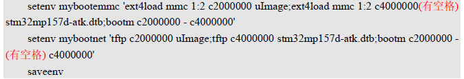
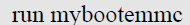

# 实验十七 其他命令与自定义启动变量——run 一键切换启动方式，第 4 章收官

> **对应课件**：《第4章 使用U-Boot》4.8 节，Slide 51-55
>
> **系列说明**：本系列基于华清远见 FS-MP1A（STM32MP157A）开发板，对应课件《第4章 使用U-Boot》。第 4 章最后一篇，三条"边角"命令 `reset` / `run` / `go`——其中 `run` 是真正的主角：环境变量里不只 `bootcmd` 一条能装命令，**自定义变量 + run** 可以做出任意多个"启动快捷方式"，在网络启动与 eMMC 启动之间一键切换（课件例 3）。这是 Linux 系统调试期的日常动作：同一块板，多种启动路径，随取随用。本文覆盖 Slide 51-55。前置：实验十六（bootcmd 网络启动已跑通，eMMC 分区里有内核文件）。

## 一、本篇的三条命令

| 命令 | 干什么 | 本篇安排 |
|---|---|---|
| `reset` | 重启开发板 | 步骤 1 动手（其实前几篇一直在偷用） |
| `run <变量名>` | 执行环境变量里定义的命令串 | 步骤 2 主角——自定义启动变量 |
| `go addr [arg ...]` | 跳到 DRAM 指定地址直接执行程序 | 步骤 3 认格式 |

## 二、实验环境（实际）

| 项目 | 实际值 |
|---|---|
| 板子状态 | trusted 版 U-Boot，倒计时 5 秒，`STM32MP>` 可达 |
| 串口 | MobaXterm Serial 会话（COM11），115200 |
| 网络 | tftpd64 运行中，`D:\tftpboot` 有 `uImage` + `stm32mp157a-fsmp1a-mipi050.dtb`（实验十三/十六） |
| eMMC | ext4 分区里有 `test_uImage`（7,546,640 字节，实验十五写入）；dtb 按实验十五步骤 6 的选做情况而定 |
| 环境变量基线 | 网络三件套 + `serverip` + `bootdelay 5` + 实验十六固化的 `bootcmd`（网络启动三连） |

## 三、课件 ↔ 步骤对应表

| 课件 Slide | 内容 | 对应步骤 |
|---|---|---|
| 51 | reset 命令 | 步骤 1 |
| 52 | run 命令与它的最大用途 | 步骤 2 |
| 53~54 | 例 3：mybootemmc / mybootnet 自定义启动变量 | 步骤 2 |
| 55 | go 命令格式 | 步骤 3 |

## 四、实验步骤

### 步骤 1：reset——正式认识老朋友（Slide 51）

前几篇的"复位重来"用的就是它，现在正式打个照面：

```
STM32MP> reset
```


> 图：课件 Slide 51——`reset` 后输出 `resetting ...`，复位后 TF-A 重新接管：日志里能看到 PSCI Power Domain Map、CPU/Model 信息、`Reset reason (0x54): System reset generated by MPU (MPSYSRST)`、`Boot partition fsbl1`、BL2 构建信息等一段完整的引导链开场。

`resetting ...` 之后，整条引导链从头跑：TF-A → U-Boot 横幅 → 倒计时 5 秒——和按板上复位键等效（课件截图里还能看到 TF-A 报的 `Reset reason`，软复位也会留痕）。倒计时内按 Enter 拦停，继续本篇。

**实际执行结果**：待补充

### 步骤 2：run + 自定义启动变量——例 3 落地（Slide 52~54）

**场景**（课件例 3 原文大意）：调试 Linux 系统时，常常要在网络启动和 eMMC 启动之间来回切换。`bootcmd` 只有一条，换来换去就得反复重写——麻烦。解法：自定义两个环境变量，各存一条启动路径，切换时 `run` 一下即可。

创建两条自定义启动变量（文件名与分区号按实验十四/十五的实测替换；此处沿用课件的 `mmc 1:2` 与我们统一的两个下载地址）：

```
STM32MP> setenv mybootnet 'tftp c2000000 uImage;tftp c4000000 stm32mp157a-fsmp1a-mipi050.dtb;bootm c2000000 - c4000000'
STM32MP> setenv mybootemmc 'ext4load mmc 1:2 c2000000 uImage;ext4load mmc 1:2 c4000000 stm32mp157a-fsmp1a-mipi050.dtb;bootm c2000000 - c4000000'
STM32MP> saveenv
```


> 图：课件 Slide 54——创建 mybootemmc 与 mybootnet 两条环境变量：值都是"加载内核 + 加载设备树 + bootm 启动"三连，区别只在加载手段（ext4load 从 eMMC 分区取 / tftp 从网络取）；课件红字特别标注 bootm 参数里的占位减号两侧**必须有空格**。

对比两条变量：命令骨架一字不差，只有"从哪拿文件"不同——这正是 run 机制的价值：**启动方式是数据（环境变量），不是写死在代码里的流程**。ext4load 的文件名按实验十五的实际情况填（分区里有出厂 `uImage` 就用出厂的；只有 `test_uImage` 就用 `test_uImage`；dtb 同理——实验十五步骤 6 写入的那份，或出厂清单里配套的 fsmp1a 系 dtb）。**两个文件名都得真实存在**，ext4load 找不到文件会报 `** Unable to read file **`，后面的 bootm 自然失败。

然后各跑一遍：

```
STM32MP> run mybootnet
```


> 图：课件 Slide 54——`run mybootnet`：网络启动路径，效果与实验十六的 bootcmd 完全同款（两条 tftp + bootm + 内核日志）。

```
STM32MP> run mybootemmc
```


> 图：课件 Slide 54——`run mybootemmc`：eMMC 启动路径，两条 `ext4load` 的回显是 `N bytes read in ... MiB/s`，随后同样 `## Booting kernel ...` 接 `Starting kernel ...`。

**mybootemmc 的独立验证**：跑它之前把网线拔了（或干脆不开 tftpd64）——启动全程不碰网络，内核日志照滚。这一遍跑通，"文件已经在板上"才算铁证。两条 run 的终点都和实验十六一样：内核日志滚出、止于根文件系统问题——预期内。

顺带把 run 和 bootcmd 的关系说破：autoboot 倒计时归零后执行的 `bootcmd`，本质上也是被 run 执行的一条环境变量——`run bootcmd` 与 `run mybootnet` 在机制上毫无区别，只是前者有个响亮的官方名字。`mybootnet` 与 `bootcmd` 当前内容相同也互不干扰——一个是"默认自动"，一个是"手动点名"。

**实际执行结果**：待补充

### 步骤 3：go——认识格式即可（Slide 55）

```
go <addr> [arg ...]
```


> 图：课件 Slide 55——`go` 命令格式文本：`go addr [arg ...]`——跳到 DRAM 的 addr 处执行程序。

`go` 的用途是**跳转到 DRAM 里的裸程序直接执行**——U-Boot 不再参与，CPU 从那个地址开始跑。本阶段我们手里没有裸机程序可跳，格式记住即可：将来若玩到裸机小程序（不经过内核直接在板上跑的代码），`tftp` 下载后 `go` 一敲就能运行。

**实际执行结果**：待补充

### 步骤 4：第 4 章收官盘点

到本篇为止，第 4 章 4.1~4.8 全部过手。一张命令地图收尾：

| 分组 | 命令 | 出处 |
|---|---|---|
| 帮助与查询 | `help` / `?`、`bdinfo`、`printenv`、`version` | 实验十二（4.1~4.2） |
| 环境变量 | `setenv` / `saveenv` / `env` + bootcmd、bootargs、网络四件套 | 实验十二（4.3） |
| 网络 | `ping`、`dhcp`、`tftp`、`nfs` | 实验十三（4.4） |
| 存储 | `mmc info/list/dev/part/read`（write/erase/hwpartition 只认不动） | 实验十四（4.5） |
| 文件系统 | `ext4ls` / `ext4load` / `ext4write` | 实验十五（4.6） |
| 启动内核 | `bootm` / `bootz` / `boot` / `bootd` | 实验十六（4.7） |
| 杂项 | `reset` / `run` / `go` | 本篇（4.8） |

此刻板子的能力：能查询、能改配置、能从 PC 拉文件、能读写 eMMC 里的文件、能手动或一键（bootcmd/myboot 系列）启动 Linux。**U-Boot 这间操作台已经全部摸熟**——第 5 章《移植 Linux 内核》进场时，每一样都是熟具。

**实际执行结果**：待补充

## 五、注意事项

1. **自定义变量的值必须整体加引号**：bootm 参数里的占位减号两侧空格不能丢（课件红字强调过）——`bootm c2000000 - c4000000`。
2. **文件名与分区号以板上实测为准**：mybootemmc 的 ext4load 路径按实验十四分区表 + 实验十五清单填；两个文件缺一个，这条路径就跑不通。
3. **mybootemmc 与 mybootnet 都是 write-once 无关的普通变量**：随便改随便删（`setenv mybootemmc` 赋空即删），练坏了 `env default -a` 之外的恢复手段就是重新 setenv——比 bootcmd 的后果轻得多，放心玩。
4. **run 的报错会一路串下去**：变量里三条命令用分号串联，前一条失败（如 ext4load 找不到文件）后一条照跑——看到 bootm 报 `Wrong Image Format` 时，回头查的是第一条 load 有没有成功。
5. **终端粘贴用右键**；两条 setenv 长命令整体复制粘贴。

## 六、怎么验证

1. `reset` 实测：TF-A 横幅重滚、5 秒倒计时、拦停正常；
2. `run mybootnet`：网络路径启动内核（tftpd64 在线时）；
3. `run mybootemmc`：**拔网线**（或关 tftpd64）后仍能启动内核——eMMC 路径独立可用；
4. `print mybootnet mybootemmc` 能查验两条变量已存盘；
5. `go` 的格式与用途说得出（addr 是 DRAM 地址，跳过去执行裸程序）。

不达标时的排查：

| 现象 | 先查什么 |
|---|---|
| `run mybootemmc` 报 `** Unable to read file **` | 文件名与分区里的实际清单对不上——`ext4ls mmc 1:N` 先看一眼 |
| `run mybootemmc` 的 bootm 报 Wrong Image Format | ext4load 是否真的成功（bytes read 回显）；加载地址是否 `c2000000` |
| `run mybootnet` 卡在 Loading | 防火墙/tftpd64 老三样（实验十三的排查表原样适用） |
| 两条变量重启后消失 | saveenv 做了吗（实验十二的纪律） |

## 七、实验完成标志

- [ ] `reset` 实测，TF-A 起的完整引导链重跑一遍（步骤 1）
- [ ] `mybootnet` / `mybootemmc` 创建 + saveenv，`print` 可查验（步骤 2）
- [ ] `run mybootnet` 启动内核成功（步骤 2）
- [ ] **断网状态下 `run mybootemmc` 启动内核成功**——eMMC 路径独立验证（步骤 2）
- [ ] `go` 格式与用途认知（步骤 3）
- [ ] 第 4 章命令地图盘点完成，各组命令都能对上实验编号（步骤 4）

## 八、下一步：第 5 章《移植 Linux 内核》

第 4 章到此收官。回看第 3 章埋下的那条线：autoboot 里 bootm 找不到内核的报错，在实验十六已经有了答案的一半——内存里有内核就能点火；另一半在第 5 章揭晓——**怎么用源码编出自己的内核和设备树**，替换掉这篇借来的出厂内核。配套的实验环境、内核源码包与编译流程，下章开篇见。
