# 实验十八 认识 Linux 内核——版本号、源码目录与"内核文件四兄弟"

> **对应课件**：《第5章 移植Linux内核》5.1~5.3 节，Slide 2-24
>
> **系列说明**：本系列基于华清远见 FS-MP1A（STM32MP157A）开发板，对应课件《第5章 移植Linux内核》。第 4 章我们用出厂内核（uImage 7,546,640 字节 + `stm32mp157a-fsmp1a-mipi050.dtb`）把 Linux 点着了，但它是别人编好的——第 5 章要做的是**自己动手把它编出来、移植出来**：装交叉编译器、拿 ST 源码打补丁、配菜单、改设备树、补驱动，最后用 `bootm` 点火验证。本篇是第 5 章开篇的**认知篇**：内核版本号怎么读、源码目录长什么样、`vmlinux`/`Image`/`zImage`/`uImage` 四个文件什么关系——这些概念不先立住，后面每一步命令都会变成"照抄天书"。前置：第 4 章实验十六~十七（亲手点火过出厂内核，本篇所有概念都挂在那次经历上）。

## 一、先把两组名词对齐

**内核（kernel）与根文件系统（rootfs）是两码事**：内核负责驱动硬件、调度进程，它自己不提供 `ls`、`ping` 这些命令——那些属于根文件系统。实验十六点火后停在 `Kernel panic - not syncing: VFS: Unable to mount root fs`，正是"内核起来了、但没找到根文件系统"：两样东西缺一不可。**第 5 章解决内核侧**（自己编内核 + 自己的设备树 + 补驱动），根文件系统是第 6 章的事——本篇先在心里把这条边界划清，后面看到"root"字样就知道那是第 6 章的活。

**设备树（.dtb）是内核的"硬件说明书"**：同一份内核镜像，喂给它 DK1 的 dtb 就按 DK1 的硬件跑，喂给我们板的 dtb 就按我们的板跑（实验十六 `Machine model:` 一行就是证据）。第 5 章要加的 eMMC 节点、网卡节点，改的都是设备树源文件——它们决定内核"看得见哪些硬件"，配合 `.config` 决定"驱动编译了没有"，两者缺一硬件就不通。

## 二、版本号：四个字段，读一遍就懂

Linux 内核版本写在**源码顶层目录的 `Makefile` 文件**开头，四个字段：

| 字段 | 含义 | 出厂内核（我们板上那份）的值 |
|---|---|---|
| `VERSION` | 主版本号 | 5 |
| `PATCHLEVEL` | 次版本号 | 4 |
| `SUBLEVEL` | 修改次数（安全补丁、bug 修复时递增） | 31 |
| `EXTRAVERSION` | 附加串，通常为空；`-rc6` 这类是开发预览版 | 空 |

拼起来就是 **5.4.31**——实验十六点火时 U-Boot 报的 `Image Name: Linux-5.4.31`、内核日志第一屏的 `Linux version 5.4.31 (oe-user@oe-host)...`，说的都是它。

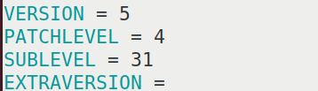
> 图：课件 Slide 2——内核源码顶层 Makefile 中的版本号定义：`VERSION = 5`、`PATCHLEVEL = 4`、`SUBLEVEL = 31`、`EXTRAVERSION` 为空。**实验十九解压源码后我们会真的打开自己这份 Makefile**，实验二十还会往里加两行，到时候回来看这张图。

为什么直接从 4.x 跳到了 5.0？Linus 本人在 5.0 的发布公告邮件里说了实话——数字大到"手指脚趾加起来不够数了"，没有别的含义：

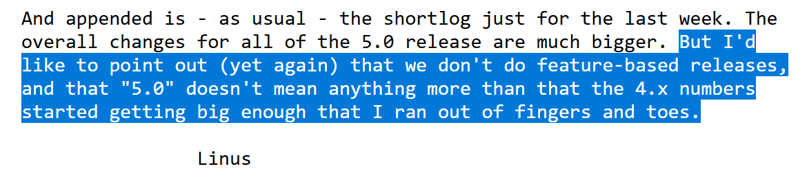
> 图：课件 Slide 3——Linus Torvalds 发布 5.0 的公告邮件片段（英文）："...that \"5.0\" doesn't mean anything more than that the 4.x numbers started getting big enough that I ran out of fingers and toes."——**版本号只是数字变大，不是按功能划分的**，这句原文值得留个印象：以后看到 6.x、7.x 也不用大惊小怪。

两个延伸知识点：

- 4.0 版本之前，`PATCHLEVEL` 奇数是开发版、偶数是稳定版；**现在已经不区分奇偶**。`PATCHLEVEL` 递增到 19~20 左右就进位（VERSION +1），`SUBLEVEL` 只在安全补丁、bug 修复时递增。
- 简明版本史（课件 Slide 4~5）：1991 年 0.01 起家 → 1994 年 1.0 官方版（仅 386）→ 1995 年 1.2 首个多平台版 → 1996 年 2.0 首个 SMP（多核）版 → 2003 年 2.6 大改版（新调度器、可抢占、支持无 MMU 处理器）→ 课件成稿时的最新稳定版是 6.4.5（2023 年 7 月）。我们手里的 5.4.31 是 5.4 LTS（长期支持）线上的一个点，ST 为 STM32MP1 维护它。

源码从官网 **www.kernel.org** 获取：

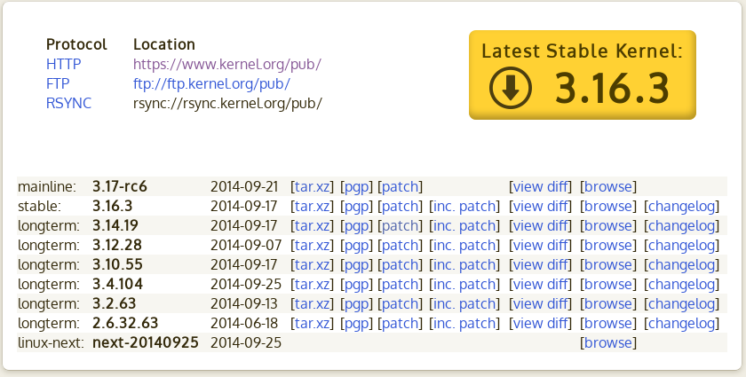
> 图：课件 Slide 6~9——kernel.org 首页：HTTP/FTP/RSYNC 三种下载方式，版本按 **mainline（主线开发）/ stable（稳定版）/ longterm（长期支持版）/ linux-next（前瞻集成）** 四条线列出（截图是课件制作时的 3.x 时代页面）。**但我们不用去官网下**：ST 把 5.4.31 官方源码连同它家的补丁一起打包放在了课程资料里（`en.SOURCES-*.tar.xz`，已复制到本目录），实验十九直接解压它——这也是 embedded 圈的常态：芯片厂商基于 LTS 内核加自家补丁再发布，很少有人裸用 kernel.org 的源码。

## 三、源码目录：60K+ 个文件，先认顶层

5.4.31 版内核有 60K+ 个文件、2.5M+ 行代码，但顶层目录是有章法的：

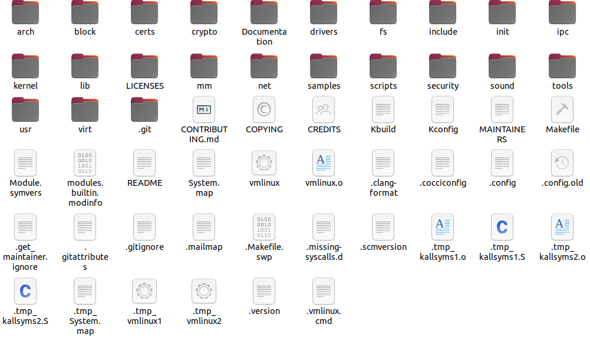
> 图：课件 Slide 10——5.4.31 版内核源码顶层目录（含编译生成文件）：`arch`、`block`、`certs`、`crypto`、`Documentation`、`drivers`、`fs`、`include`、`init`、`ipc`、`kernel`、`lib`、`mm`、`net`、`samples`、`scripts`、`security`、`sound`、`tools`、`usr`、`virt` 等目录，以及 `.config`、`Makefile`、`vmlinux`、`System.map` 等文件。**实验十九解压完源码后，自己的目录长的一模一样**——到时候 `ls` 一下逐个对号。

每类目录管一摊，课件 Slide 11~12 两张表逐个点名：

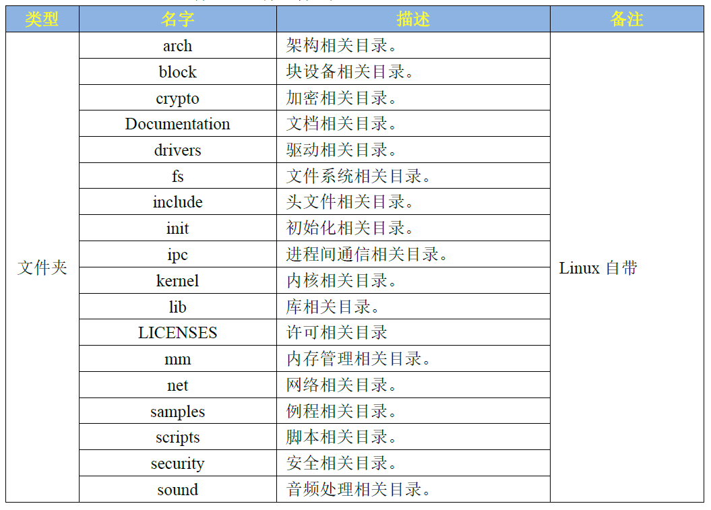
> 图：课件 Slide 11——顶层目录说明表（前半）：`arch` 架构相关、`block` 块设备、`crypto` 加密、`Documentation` 文档、`drivers` 驱动、`fs` 文件系统、`include` 头文件、`init` 初始化、`ipc` 进程间通信、`kernel` 内核核心、`lib` 库、`LICENSES` 许可、`mm` 内存管理、`net` 网络、`samples` 例程、`scripts` 脚本、`security` 安全、`sound` 音频，均为 Linux 自带。

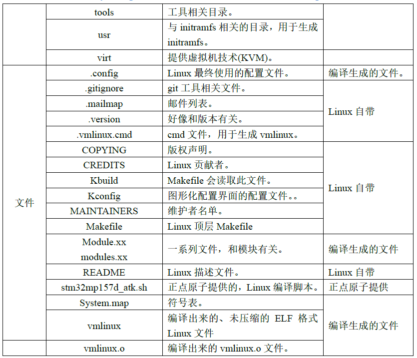
> 图：课件 Slide 12——顶层目录说明表（后半）：`tools`、`usr`（initramfs）、`virt`（KVM 虚拟化）；文件类 `.config`（**编译生成的配置文件**，内核最终按它决定编译什么）、`Kbuild`/`Kconfig`（配置体系）、`Makefile`（顶层构建脚本）、`README`（官方编译说明）、`System.map`（符号表）、`vmlinux`（编译生成）。表里还列了 `stm32mp157d_atk.sh`——那是正点原子给它们板子写的编译脚本，我们不用它。

**第 5 章实验只会碰到其中五个**，现在先记住它们的位置：

| 目录/文件 | 管什么 | 第 5 章哪一步碰 |
|---|---|---|
| `arch/arm/` | 32 位 ARM 架构全部相关代码（引导、系统调用、主频设置等） | 头号常客 |
| `arch/arm/configs/` | 各开发板的默认配置文件（`xxx_defconfig`） | 实验十九：加载 `multi_v7_defconfig`，并把我们自己的配置存成 `stm32_fsmp1a_defconfig` 存在这里 |
| `arch/arm/boot/` | 编译生成的 `uImage`/`zImage`/`Image` | 实验二十编完内核来取货 |
| `arch/arm/boot/dts/` | 设备树源文件（`.dts`/`.dtsi`）与编译产物（`.dtb`） | 实验二十~二十二：放入 fsmp1a 设备树、改三处 |
| `drivers/net/phy/` | 以太网 PHY 驱动 | 实验二十二：放 MAE0621A 网卡驱动 |

`arch/arm` 里面长这样：

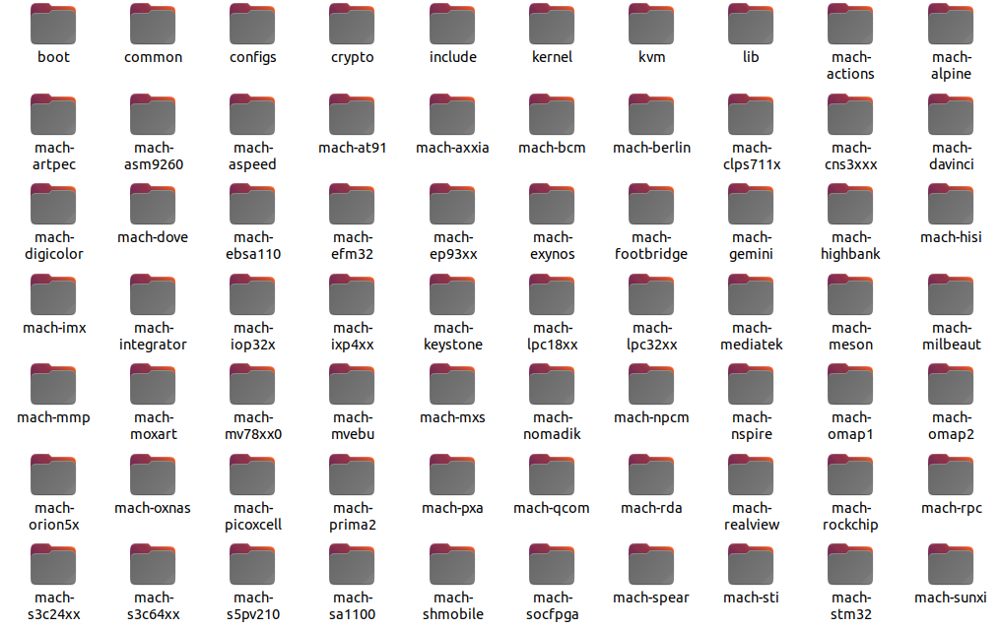
> 图：课件 Slide 14——`arch/arm` 目录截图：`boot`、`common`、`configs`、`crypto`、`include`、`kernel`、`kvm`、`lib` 子目录，加几十个 `mach-xxx` 平台目录（`mach-stm32` 就是 STM32 系列的驱动与初始化文件所在）。

`configs` 里躺着各板子的默认配置：

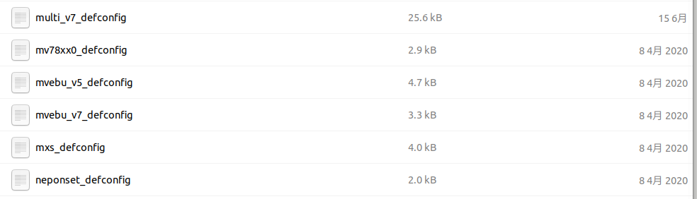
> 图：课件 Slide 15——`arch/arm/configs` 目录截图：各平台 `xxx_defconfig`。其中 `multi_v7_defconfig` 是 fsmp1a 参考的配置（实验十九会加载它），我们自己生成的 `stm32_fsmp1a_defconfig` 以后也存在这个目录。

**再看一眼内核的构建体系**（课件 5.3，实验十九动手时逐个对号）：内核不是靠一个 Makefile 编出来的，而是五类 Makefile 分工协作——

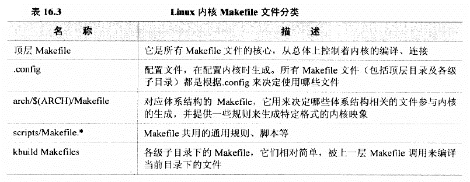
> 图：课件 Slide 19——Linux 内核 Makefile 分类表：**顶层 Makefile**（核心，总体控制）、**.config**（配置文件，所有 Makefile 都按它决定编什么）、**arch/$(ARCH)/Makefile**（架构相关）、**scripts/Makefile.\***（通用规则与脚本）、**kbuild Makefiles**（各级子目录自己的 Makefile，被上层调用）。详细说明在 `Documentation/kbuild/makefiles.txt`。

合起来的工作方式：`.config` 定义变量 → 各级 Makefile 按变量决定哪些文件编进内核（`=y`）、编成模块（`=m`）或跳过 → 顶层 Makefile 按 `arch/arm/kernel/vmlinux.lds` 链接脚本组织生成 `vmlinux`。**实验十九的 `make ARCH=arm multi_v7_defconfig` 干的就是"生成 .config"这一步；实验二十的 `make uImage` 就是让这条流水线跑到头**。

## 四、内核文件四兄弟：vmlinux → Image → zImage → uImage

这一节直接挂在我们实验十六的经历上。内核编出来是一条**加工链**：

| 文件 | 是什么 | 与实验十六的账 |
|---|---|---|
| `vmlinux` | 编译得到的最原始内核文件，**ELF 格式、未压缩** | —— |
| `Image` | `vmlinux` 去掉 ELF 信息转成纯二进制（bin），**仍未压缩** | —— |
| `zImage` | `Image` **压缩**后得到 | —— |
| `uImage` | **U-Boot 专用**：在 zImage 基础上加 **64 字节（0x40）文件头** | **实验十六实测对上了**：tftp 下载 7,546,640 字节，bootm 报 `Data Size: 7546576`——少的 64 字节就是头；`Load Address: c2000040` = 0xC2000000 + 0x40 也是这个头让出来的 |

**记住这条链**：实验二十编内核时，`make uImage` 这一条命令就会把这四级全部走完；而 `LOADADDR=0xC2000040` 这个参数为什么是这个值，等的就是实验十六那次实测的解释——uImage 放在 0xC2000000，头占 0x40，真身从 0xC2000040 开始。

## 五、内核配置：.config、menuconfig 与三种状态

内核功能**上千项**，全部状态记录在源码顶层的 **`.config`** 文件里（隐藏文件，配置工具自动生成，**不要手改**）。配置工具有图形界面，在内核顶层目录执行：

```
make menuconfig
```

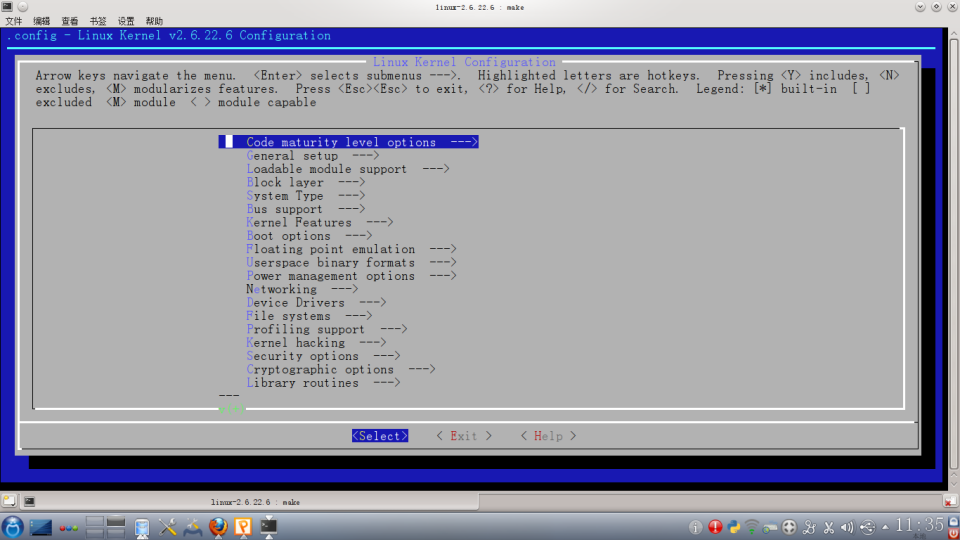
> 图：课件 Slide 23——`make menuconfig` 启动的配置工具界面：方向键移动、`<Enter>` 进子菜单、`Y/N/M` 三键选状态、连按 `<Esc><Esc>` 退出、`/` 键搜索。主菜单从 `Code maturity level options` 到 `Library routines` 共十几项。**实验十九、二十一、二十二都会打开它**，到时候标题栏会显示 Linux/arm 5.4.31 Kernel Configuration。

每个选项有三种状态，`.config` 里长这样：

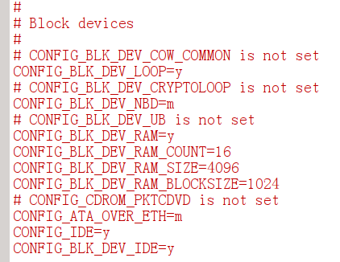
> 图：课件 Slide 20——`.config` 的块设备片段：**编进内核**（`CONFIG_BLK_DEV_LOOP=y`）、**编成模块**（`CONFIG_BLK_DEV_NBD=m`）、**不使用**（`# CONFIG_BLK_DEV_COW_COMMON is not set`）。三种写法一一对应 menuconfig 里的 `[*]` / `<M>` / `[ ]`。

menuconfig 里的具体长相：

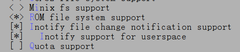
> 图：课件 Slide 24——选项示例：`< >` 未使用、`<*>` 编进内核、`[*]` 编进内核（无模块形态）、`[ ]` 未选中。

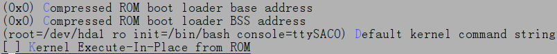
> 图：课件 Slide 24——需要赋值的选项：十六进制数（`(0x0) Compressed ROM boot loader base address`）、字符串（`(root=/dev/hda1 ro init=/bin/bash console=ttySAC0) Default kernel command string`）。**注意这个字符串就是内核的默认命令行**（CONFIG_CMDLINE）——实验十六我们看到的"`Kernel command line:` 是空的"，空的就是它；第 5 章实验二十三设 `bootargs` 环境变量，传的就是这一类内容。

上千项逐项配是不现实的，**通常做法是拿一份现成的、硬件相近的 defconfig 打底再改**——我们用的就是 ST 官方适配好的 `multi_v7_defconfig`（实验十九落地，叠 ST 的 fragment 碎片配置）。

## 六、实验环境（实际）

| 项目 | 实际值 |
|---|---|
| 板子状态 | 第 4 章收官形态：trusted U-Boot + `bootcmd` 网络三连 + `mybootnet`/`mybootemmc` 两条自定义变量（实验十七） |
| Ubuntu 虚拟机 | 工具链 ST SDK 已装（实验一，`arm-ostl-linux-gnueabi-`）；本篇不动它 |
| 本篇新增材料 | 无——本篇是认知篇，不敲板子命令、不编译 |

> **开工自检（10 秒）**：本篇不上板。板子可以不开，虚拟机也不用开；要做的只是把第 5 章的概念与我们已跑过的经历对上号。

## 七、课件 ↔ 步骤对应表

| 课件 Slide | 内容 | 对应本篇 |
|---|---|---|
| 2~9 | 5.1 版本号四字段、Linus 邮件、kernel.org | 第二节 |
| 10~18 | 5.2 源码顶层目录、arch/arm、.config/Makefile | 第三节 |
| 19~21 | 5.3 内核 Makefile 体系 | 第三节的延伸（实验十九动手时再对号） |
| 22 | **内核文件四兄弟 vmlinux/Image/zImage/uImage** | 第四节 |
| 23~24 | menuconfig 与三种配置状态 | 第五节 |
| 25 | "拿相近板子的 defconfig 打底"的通常做法 | 第五节末 |

### 本篇概念 → 后面谁用 → 现在含糊的后果

| 本篇概念 | 后面哪一篇用 | 现在含糊的后果 |
|---|---|---|
| 版本号四字段（5.4.31） | 实验十九解压源码后核对 `Makefile`；实验二十编出的 `uImage` 版本串里带它 | 拿错源码包都不知道 |
| `arch/arm/configs/` 与 `xxx_defconfig` | 实验十九：加载 `multi_v7_defconfig` 并存档 `stm32_fsmp1a_defconfig` | defconfig 与 `.config` 的关系搞反，配置改了不生效 |
| **uImage 比 zImage 多 0x40 头** | 实验二十：`make uImage LOADADDR=0xC2000040` 的 `0xC2000040` 就是"0xC2000000 + 头"；也解释实验十六 `Data Size` 与 tftp 字节数差的 64 | LOADADDR 随手写成 0xC2000000，内核搬错位置起不来 |
| menuconfig 三种状态与 `.config` | 实验十九（合并 fragment）、实验二十一（确认 SDMMC）、实验二十二（勾 MAXIO PHY） | 勾了选项但没保存、或直接手改 `.config`，改动丢失/打架 |
| 内核 vs 根文件系统的边界 | 实验二十三（借出厂根点火）、第 6 章全部 | 以为"编出内核就能进命令行"，panic 时不知道缺的是哪半边 |

本篇**不需要任何新资料**——全部是概念对齐。第 5 章真正要用的三个文件（`en.SOURCES-*.tar.xz` 139,946,924 字节、`kernel-初始设备树.zip` 2,226 字节、`kernel-网卡驱动.zip` 18,708 字节）已复制到本目录，实验十九起逐个登场（md5 见实验十九"素材与出处"）。

## 八、自测一览

本篇是认知篇，无板子操作。对照下表逐条自问自答，答不上来的回到对应小节重读：

| 自测问题 | 达标答案 | 在哪一节 |
|---|---|---|
| 拿到一份内核源码，去哪里看版本号？ | 顶层 `Makefile` 的 `VERSION/PATCHLEVEL/SUBLEVEL/EXTRAVERSION` 四个字段 | 第二节 |
| 从 4.x 直接跳到 5.0 有什么特殊含义？ | 没有——Linus 原话"手指脚趾不够数了" | 第二节 |
| 内核 60K+ 个文件，第 5 章常打交道的是哪五个位置？ | `arch/arm/`、`arch/arm/configs/`、`arch/arm/boot/`、`arch/arm/boot/dts/`、`drivers/net/phy/` | 第三节 |
| `zImage` 与 `uImage` 差在哪？ | uImage = zImage + 64 字节 U-Boot 头；所以实验十六里 tftp 的 7,546,640 与 bootm 的 `Data Size: 7546576` 差 64 | 第四节 |
| menuconfig 里 `[*]`、`<M>`、`[ ]` 分别对应 `.config` 里的什么？ | `=y` 编进内核、`=m` 编成模块、`is not set` 不使用 | 第五节 |
| "自己编出内核"之后还差什么才能进命令行？ | 根文件系统——实验十六的 VFS panic 就是它缺席（第 6 章解决） | 第一节 |

## 九、下一步：内核源码准备与配置

下一篇（实验十九）进入动手篇：装 ARM 官方交叉编译器 `gcc-arm-9.2`（为什么不用第 3 章的 SDK 编译器？它编 busybox 会缺库）、装 `u-boot-tools`（没有 `mkimage` 编 uImage 会报错）、解压 ST 源码并打补丁、合并 fragment 配置——把"能编内核的地基"打好。
