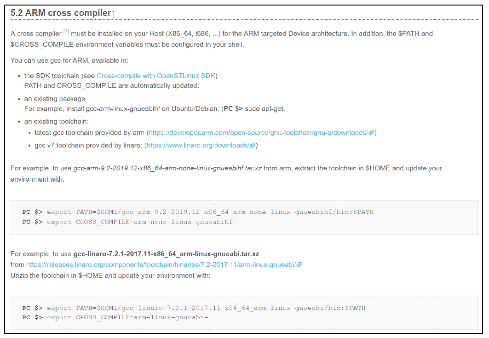
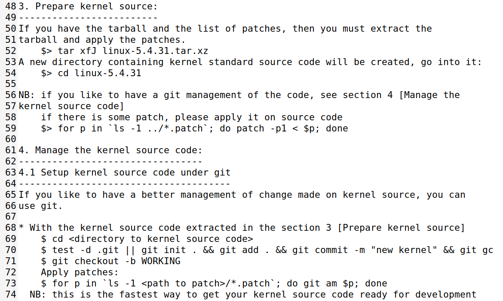

# 实验十九 内核源码准备与配置——装编译器、打补丁、生成 FS-MP1A 的 defconfig

> **对应课件**：《第5章 移植Linux内核》5.4 节步骤 0~3（Slide 26~40）
>
> **系列说明**：本系列基于华清远见 FS-MP1A（STM32MP157A）开发板，对应课件《第5章 移植Linux内核》。实验十八立好了概念，本篇开始动手：装一套新的交叉编译器（ARM 官方 `gcc-arm-9.2`，而不是第 3 章的 SDK 编译器——原因见步骤 1）、装 `mkimage`、把 ST 提供的 5.4.31 源码解压并打上补丁、合并 fragment 配置生成 `.config`，最后把我们的配置存成 `stm32_fsmp1a_defconfig` 备用。**本篇全部在 Ubuntu 虚拟机里操作，板子可以不开**。前置：实验十八（概念）、实验一（SDK 已装、Ubuntu 已就绪）。

## 一、为什么这些准备是必须的

| 准备项 | 不装/不做的下场 |
|---|---|
| ARM 官方交叉编译器 `gcc-arm-9.2` | 用 SDK 编译器也能编内核，但配置麻烦、易出错；**而且它缺库，编不了 busybox**（第 6 章构建根文件系统要用）——一次装对，两章受益 |
| `u-boot-tools`（提供 `mkimage`） | 内核编到 `UIMAGE arch/arm/boot/uImage` 一步报错退出（课件 Slide 35 有报错实拍），uImage 生成不出来 |
| ST 补丁（0020~0023 四个 `.patch`） | 官方 5.4.31 源码只适配 ST 官方板；不打 ST 补丁，STM32MP1 的平台代码缺失，编不出能上我们板子的内核 |
| fragment 配置合并 | 只加载 `multi_v7_defconfig` 缺 ST 板级功能，后面 menuconfig 要一项项手工补，量太大 |

## 二、实验环境（实际）

| 项目 | 实际值 |
|---|---|
| 操作位置 | 全程在 **Ubuntu 虚拟机**（第 3 章那台，NAT 网卡上网）；板子不开 |
| 已装工具链 | ST SDK（`/opt/st/...`，实验一装，`arm-ostl-linux-gnueabi-` 前缀）——本篇之后内核改用新编译器 |
| 素材（本目录） | `en.SOURCES-stm32mp1-openstlinux-5-4-dunfell-mp1-20-06-24.tar.xz`（139,946,924 字节，md5 `42176cf65cf261df8083cacfaa5366f2`）——内含 `linux-5.4.31.tar.xz`、ST 补丁与 fragment 配置 |

> **开工自检（10 秒）**：本篇不碰板子、不碰串口。要确认的只有两件：① 虚拟机能上网（`ping -c 2 mirrors.aliyun.com` 之类，装包用）；② 三个素材文件已从 Windows 拷进虚拟机共享目录（做法同实验十三步骤 3 ⑥：解压 → 放共享目录 → Ubuntu 里 `cp` 到工作目录）。

## 三、课件 ↔ 步骤对应表

| 课件 Slide | 内容 | 对应步骤 |
|---|---|---|
| 26 | 移植目标：基于 ST 5.4.31，支持 FS-MP1A，让板子进 Linux 命令行 | 开篇 |
| 27~34 | 步骤 0：三种交叉编译器来源、选 ARM 官方 gcc-arm-9.2、命名规则 | 步骤 1 |
| 35~36 | 步骤 0 续：装 u-boot-tools（mkimage） | 步骤 2 |
| 37~38 | 步骤 1：解压 ST 源码包、按 README.HOW_TO 打补丁 | 步骤 3 |
| 39~40 | 步骤 2~3：生成默认配置、合并 fragment、存 stm32_fsmp1a_defconfig | 步骤 4 |

### 本篇动作 → 后面谁用 → 现在含糊的后果

| 本篇动作 | 后面哪一篇要用 | 现在含糊的后果 |
|---|---|---|
| 新编译器装在 `/usr/local/arm/...` 并写入 `/etc/profile` | 实验二十起的每一次 `make`；第 6 章 busybox 编译 | `PATH` 没生效就编不出 ARM 程序，报错满屏还以为内核坏了 |
| `CROSS_COMPILE=arm-none-linux-gnueabihf-` 前缀 | 实验二十顶层 Makefile 里那两行 `ARCH`/`CROSS_COMPILE` | 前缀写错（比如漏 `hf`），编出的内核硬件浮点用不了 |
| `mkimage`（u-boot-tools） | 实验二十 `make uImage` 的最后一步 | 编到最后一步崩，前面 20 分钟白跑 |
| 解压+打补丁后的源码目录 `linux-5.4.31/` | 实验二十（编译）、二十一（eMMC 驱动）、二十二（网卡驱动）、二十三（点火） | 补丁没打全，menuconfig 里找不到 ST 平台选项 |
| `stm32_fsmp1a_defconfig`（存在 `arch/arm/configs/`） | 实验二十之后每次重编内核的**恢复配置**第一条 | 改乱了配置回不去，只能重打补丁重来 |

本篇需要的资料都在 `03_移植Linux内核/`：`en.SOURCES-*.tar.xz`（源码+补丁+fragment）、`kernel-初始设备树.zip`（实验二十用）、`kernel-网卡驱动.zip`（实验二十二用）。**交叉编译器 `gcc-arm-9.2-2019.12-x86_64-arm-none-linux-gnueabihf.tar.xz` 不在课程资料包里**，需到 ARM 官网下载（地址见步骤 1）——这是第 5 章唯一要自己从网上拿的东西。

## 四、实验步骤

### 步骤 1：安装 ARM 官方交叉编译器（Slide 27~34）

**为什么不用第 3 章的 SDK 编译器**：SDK 那套（`arm-ostl-linux-gnueabihf-`）编 U-Boot 没问题，但课件明说它"使用上比较麻烦，编译过程容易出错"，且**缺少一些库，无法直接编译 busybox**——第 6 章构建根文件系统绕不开 busybox，所以本章换一套一步到位。

ST 官方文档给了三种来源：


> 图：课件 Slide 28——ST 官方文档"5.2 ARM cross compiler"：(1) SDK 自带工具链（PATH 与 CROSS_COMPILE 自动更新）；(2) 发行版自带包（Ubuntu 上 `sudo apt install gcc-arm-linux-gnueabihf`）；(3) ARM/Linaro 官方工具链，并给出 gcc-arm-9.2 的 PATH/CROSS_COMPILE 设置示例。

本篇选 **(3) ARM 官方 `gcc-arm-9.2-2019.12-x86_64-arm-none-linux-gnueabihf`**：


> 图：课件 Slide 30——ARM Developer 下载页，三组编译器；红框选中的是 **AArch32 target with hard float** 分组下的 `gcc-arm-9.2-2019.12-x86_64-arm-none-linux-gnueabihf.tar.xz`。下载地址：`https://developer.arm.com/downloads/-/gnu-a`（页面随年份更新，认文件名里的 `arm-none-linux-gnueabihf` 与 `9.2` 即可）。

**落地动作**（在 Ubuntu 里）：

```bash
# 1. 建目录并解压（tar 包从 ARM 官网下载后放进共享目录，再拷到 Ubuntu）
sudo mkdir -p /usr/local/arm
sudo tar xf gcc-arm-9.2-2019.12-x86_64-arm-none-linux-gnueabihf.tar.xz -C /usr/local/arm/

# 2. 把编译器加入 PATH：编辑 /etc/profile，在文件末尾添加一行
sudo nano /etc/profile
#    末尾加：
#    export PATH=$PATH:/usr/local/arm/gcc-arm-9.2-2019.12-x86_64-arm-none-linux-gnueabihf/bin

# 3. 重新登录（或注销重进）让 /etc/profile 生效，然后验证
arm-none-linux-gnueabihf-gcc
```


> 图：课件 Slide 31——`/etc/profile` 末尾新增的一行：`export PATH=$PATH:/usr/local/arm/gcc-arm-9.2-2019.12-x86_64-arm-none-linux-gnueabihf/bin`。**加的是 gcc 可执行文件所在目录**；环境变量要重新登录才生效，别改完就立刻试。


> 图：课件 Slide 32——验证方式：终端敲 `arm-none-linux-gnueabihf-gcc`，输出 `fatal error: no input files / compilation terminated.` **就说明装成了**——它抱怨"没有输入文件"而不是"找不到命令"。

**顺带把命名规则读懂**（课件 Slide 33~34，以后看任何工具链名字都能拆）：

```
arch [-vendor] [-os] [-(gnu)eabi]
arm - none - linux - gnueabihf
```

- `arm`：目标架构；`none`：无特定厂商；`linux`：生成支持 Linux 操作系统的程序（不带 linux 的如 `arm-none-eabi-` 是裸机用的）；`gnueabi`：遵循 EABI 接口、glibc 库；`hf`：**hard float**，硬件浮点。

### 步骤 2：安装 u-boot-tools（提供 mkimage）（Slide 35~36）

编 uImage 的最后一步要调用 `mkimage` 给 zImage 加那 64 字节的头（实验十八讲过的"四兄弟"最后一级）。没有它就是这个下场：


> 图：课件 Slide 35——编译到 `UIMAGE arch/arm/boot/uImage` 时报 `"mkimage" command not found - U-Boot images will not be built`，随后 `make[1]`/`make` 连环 Error 退出。**前面全对，最后一步崩**——所以先把它装了。

二选一：

```bash
# 方式 A（推荐，一条命令）：Ubuntu 官方源里有现成的
sudo apt install u-boot-tools

# 方式 B：用第 3 章编译 U-Boot 时生成的那个
#   在 u-boot 源码的 tools/ 目录里找到 mkimage，拷到 /bin 并加执行权限
sudo cp <u-boot源码>/tools/mkimage /bin/
sudo chmod +x /bin/mkimage
```

验证：`mkimage -help` 有输出（或 `which mkimage` 找得到路径）即成。

### 步骤 3：解压 ST 源码并打补丁（Slide 37~38）

ST 给的不是现成源码树，而是一个"官方源码 + 补丁 + 配置碎片"的组合包。把本目录的 `en.SOURCES-*.tar.xz` 拷进虚拟机后解压，`linux-stm32mp-5.4.31-r0/` 目录里就是：


> 图：课件 Slide 37——解压后源码包内容：`README.HOW_TO.txt`（15.5 kB，**操作步骤全在这里面**）、`linux-5.4.31.tar.xz`（109.5 MB，官方源码本体）、`fragment-03-systemd.config`（9.8 kB）、`fragment-05-modules.config`（434 bytes）、`fragment-06-signature.config`（331 bytes）、`fragment-04-optee.config`（28 bytes）以及 `0020~0023-ARM-stm32mp1-r1-*.patch` 四个 ST 补丁（DEVICETREE 那个最大，330.6 kB）。

**所有动作都照 `README.HOW_TO.txt` 的步骤来**（这是 ST 写给自己用户的官方操作手册，课件 Slide 38 截的就是它的 48~74 行）：


> 图：课件 Slide 38——README.HOW_TO.txt 的"3. Prepare kernel source"：`tar xfJ linux-5.4.31.tar.xz` 解压出源码目录，`cd linux-5.4.31`，然后 `for p in ...; do patch -p1 < $p; done` 把补丁逐个打上；"4. Manage the kernel source code" 用 `git init` + `git add .` + `git commit` 把打完补丁的源码纳管，并 `git checkout -b WORKING` 开工作分支。

落地（在 `linux-stm32mp-5.4.31-r0/` 目录里）：

```bash
tar xfJ linux-5.4.31.tar.xz          # 解出 linux-5.4.31/ 源码目录（1~2 分钟）
cd linux-5.4.31
for p in `ls -1 ../*.patch`; do patch -p1 < $p; done
#   依次打上 0020~0023 四个补丁，屏幕逐个回显 patching file ...
```

**给源码建 git 管理**（照 README 第 4 节）——第 3 章改 U-Boot 时我们吃过这个甜头：改坏了能 `git diff` 看、能回退：

```bash
test -d .git || git init . && git add . && git commit -m "new kernel" && git gc
git checkout -b WORKING
```

> **两条纪律**（都是第 3 章用血泪换来的）：① **在虚拟机本地磁盘建工作目录**（如 `~/kernel/`），别把源码放进共享文件夹里编译——共享盘 IO 慢一个数量级，还可能有符号链接权限问题；② **素材出处要记**：这份源码来自 `en.SOURCES-*.tar.xz`（md5 `42176cf65cf261df8083cacfaa5366f2`），补丁是 ST 的 0020~0023 四个，以后出问题知道"官方底子 + ST 补丁"这条底账。

### 步骤 4：生成默认配置并存成 stm32_fsmp1a_defconfig（Slide 39~40）

内核的编译行为全部由 `.config` 决定。我们的打法是**三层叠加**：

1. 官方 `multi_v7_defconfig` 打底（ARM 多平台通用配置）；
2. 叠加 ST 的 `fragment*.config`（ST 板级功能碎片配置）；
3. `make oldconfig` 把没覆盖到的新选项一律按默认值确认。


> 图：课件 Slide 39——README.HOW_TO.txt 第 137~158 行：`make ARCH=arm multi_v7_defconfig fragment*.config`；有 fragment 时用 `scripts/kconfig/merge_config.sh -m -r .config ../fragment-xx.config` 逐个合并（或 `for f in ...; do ...; done` 循环）；最后 **`yes '' | make ARCH=arm oldconfig`**。课件红字特别提醒：**`yes` 后面是两个单引号 `''`，不是一个双引号 `""`，别敲错！**

落地（在 `linux-5.4.31/` 顶层）：

```bash
make ARCH=arm multi_v7_defconfig fragment*.config
for f in `ls -1 ../fragment*.config`; do scripts/kconfig/merge_config.sh -m -r .config $f; done
yes '' | make ARCH=arm oldconfig
```

`yes ''` 的作用：oldconfig 遇到新增选项会逐个提问，`yes ''` 自动用"默认值"回答每一个问题，人不用守着敲几百次回车。

最后把我们这份配置**存档成自己的 defconfig**（课件 Slide 40 原文命令）：

```bash
cp .config arch/arm/configs/stm32_fsmp1a_defconfig
```

以后（实验二十之后的每一次重编）恢复配置只要一条：

```bash
make ARCH=arm stm32_fsmp1a_defconfig
```

## 五、注意事项

1. **两套编译器别混用**：SDK 的 `arm-ostl-linux-gnueabi-`（实验一装的）本篇之后不再用于内核；新的是 `arm-none-linux-gnueabihf-`。**两者前缀不同、定位不同**：前者编 U-Boot（已收官），后者编内核与 busybox。
2. **`/etc/profile` 改完必须重新登录**才生效——`source` 也行，但重登录最干净；验证方式是敲 `arm-none-linux-gnueabihf-gcc` 看它报"no input files"而不是"command not found"。
3. **打补丁时每个 patch 都要成功**：屏幕上如果出现 `.rej` 文件或 `FAILED` 字样，说明底包与补丁不配套——停下来核对源码包版本，别硬往下走。
4. **`yes ''` 是两个单引号**（课件红字）：敲成 `yes ""` 效果不同，oldconfig 可能卡住等你输入。
5. **`.config` 不要手改**（实验十八说过）：它是配置工具的产物；要改功能用 `make menuconfig`，要恢复用 `stm32_fsmp1a_defconfig`。
6. **源码目录放虚拟机本地**，共享目录只当素材中转（同第 3 章的教训）。

## 六、怎么验证

1. `arm-none-linux-gnueabihf-gcc` 敲下去报 `no input files`（不是 command not found）——**编译器在位**；
2. `mkimage -help` 有输出——**mkimage 在位**；
3. `ls` 源码目录能看到 `arch/`、`drivers/`、`Makefile`、`.config`（`ls -a`），且 `git log` 有一条 "new kernel" 提交、当前分支 WORKING——**源码在位且已纳管**；
4. `grep CONFIG_ARCH_STM32 .config` 有输出——**ST 平台配置已生效**；
5. `ls arch/arm/configs/stm32_fsmp1a_defconfig` 存在——**我们的配置已存档**。

不达标时的排查：

| 现象 | 先查什么 |
|---|---|
| `command not found`（arm-none-linux-gnueabihf-gcc） | `/etc/profile` 加没加、重新登录没；`ls /usr/local/arm/` 看目录名与 PATH 里写的一致不一致 |
| `patch` 报 `FAILED` 或生成 `.rej` | 底包与补丁不配套——核对 `linux-5.4.31.tar.xz` 是否出自 `en.SOURCES-*` 这份包，重解压重打 |
| `merge_config.sh` 报 `not found` | 当前目录不在内核顶层（脚本在 `scripts/kconfig/` 下，要 Relative 引用） |
| oldconfig 卡住不动 | `yes ''` 的引号敲成了双引号；Ctrl+C 后重敲 |

## 七、实验完成标志

- ARM 官方交叉编译器安装到 `/usr/local/arm/` 并验证通过（步骤 1，待实测）
- `/etc/profile` 已加 PATH、重新登录后生效（步骤 1，待实测）
- `u-boot-tools` 装好、`mkimage` 可用（步骤 2，待实测）
- `linux-5.4.31/` 源码解压 + 0020~0023 补丁全部打上 + git 纳管（WORKING 分支）（步骤 3，待实测）
- fragment 合并完成、`.config` 生成、`CONFIG_ARCH_STM32` 在列（步骤 4，待实测）
- 配置已存档 `arch/arm/configs/stm32_fsmp1a_defconfig`（步骤 4，待实测）

## 八、下一步：编译内核与设备树

地基打好，下一篇（实验二十）一口气把"内核文件四兄弟"造出来：顶层 Makefile 加 `ARCH`/`CROSS_COMPILE` 两行 → `make uImage LOADADDR=0xC2000040` → 添加 fsmp1a 的设备树文件 → `make dtbs`。编完就能回答一个问题：**我们自己编的内核，能不能像出厂那份一样把板子点着？**
