# 实验十九 内核源码准备与配置——装编译器、打补丁、生成 FS-MP1A 的 defconfig

> **对应课件**：《第5章 移植Linux内核》5.4 节步骤 0~3（Slide 26~40）
>
> **系列说明**：本系列基于华清远见 FS-MP1A（STM32MP157A）开发板，对应课件《第5章 移植Linux内核》。实验十八立好了概念，本篇开始动手：装一套新的交叉编译器（ARM 官方 `gcc-arm-9.2`，而不是第 3 章的 SDK 编译器——原因见步骤 1）、装 `mkimage`、把 ST 提供的 5.4.31 源码解压并打上补丁、合并 fragment 配置生成 `.config`，最后把我们的配置存成 `stm32_fsmp1a_defconfig` 备用。**本篇全部在 Ubuntu 虚拟机里操作，板子可以不开**；每个动作后面都紧跟一条只读验证命令，做完一段确认一段，卡住了能当场看出卡在哪一步。前置：实验十八（概念）、实验一（SDK 已装、Ubuntu 已就绪）、实验二（`en.SOURCES-*.tar.xz` 已解压过，本篇那棵源码树就在它里面）。

## 一、为什么这些准备是必须的

| 准备项 | 不装/不做的下场 |
|---|---|
| ARM 官方交叉编译器 `gcc-arm-9.2` | 用 SDK 编译器也能编内核，但配置麻烦、易出错；**而且它缺库，编不了 busybox**（第 6 章构建根文件系统要用）——一次装对，两章受益 |
| `u-boot-tools`（提供 `mkimage`） | 内核编到 `UIMAGE arch/arm/boot/uImage` 一步报错退出（课件 Slide 35 有报错实拍），uImage 生成不出来 |
| ST 补丁（0020~0023 四个 `.patch`） | 官方 5.4.31 源码只适配 ST 官方板；不打 ST 补丁，STM32MP1 的平台代码缺失，编不出能上我们板子的内核 |
| fragment 配置合并 | 只加载 `multi_v7_defconfig` 缺 ST 板级功能，后面 menuconfig 要一项项手工补，量太大 |

## 二、实验环境（实际）

| 项目 | 实际值 |
|---|---|
| 操作位置 | 全程在 **Ubuntu 虚拟机**（第 3 章那台，NAT 网卡上网）；板子不开 |
| 已装工具链 | ST SDK（`/opt/st/...`，实验一装，`arm-ostl-linux-gnueabi-` 前缀）——本篇之后内核改用新编译器 |
| 编译器安装包 | `gcc-arm-9.2-2019.12-x86_64-arm-none-linux-gnueabihf.tar.xz`——**在 Ubuntu 里 `wget` 直接下**，19 秒 / 13.1 MB/s / 264,181,856 字节（步骤 1 实测），不用从 Windows 拷 |
| 内核源码素材 | `en.SOURCES-stm32mp1-openstlinux-5-4-dunfell-mp1-20-06-24.tar.xz`（139,946,924 字节，md5 `42176cf65cf261df8083cacfaa5366f2`）——内含 `linux-5.4.31.tar.xz`、ST 补丁与 fragment 配置 |

> **开工自检（10 秒）**：本篇不碰板子、不碰串口。要确认的只有三件：
> ① **虚拟机能上网**（装包、下编译器都要）——这条已由步骤 1 的 `wget` 兑现，`200 OK` 就是证据；
> ② **编译器包已到位**——`ls` 当前目录能看到 `gcc-arm-9.2-...tar.xz` 那一行（步骤 1 实测）；
> ③ **内核源码那棵树已经在位**——`en.SOURCES-*.tar.xz` 在实验二步骤 1 就解压过了（第 3 章编 U-Boot 用的就是同一个包），本篇直接进它的 `linux-stm32mp-5.4.31-r0/` 目录。本机实测这棵树在共享文件夹里：`~/Desktop/LINUX-gy/Test2/stm32mp1-openstlinux-5.4-dunfell-mp1-20-06-24/sources/arm-ostl-linux-gnueabi/`；**路径因人而异，以自己终端的提示符为准**（步骤 3 开头有定位它的一条命令）。

## 三、课件 ↔ 步骤对应表

| 课件 Slide | 内容 | 对应步骤 |
|---|---|---|
| 26 | 移植目标：基于 ST 5.4.31，支持 FS-MP1A，让板子进 Linux 命令行 | 开篇 |
| 27~34 | 步骤 0：三种交叉编译器来源、选 ARM 官方 gcc-arm-9.2、命名规则 | 步骤 1 |
| 35~36 | 步骤 0 续：装 u-boot-tools（mkimage） | 步骤 2 |
| 37~38 | 步骤 1：解压 ST 源码包、按 README.HOW_TO 打补丁 | 步骤 3.1~3.3 |
| 39~40 | 步骤 2~3：生成默认配置、合并 fragment、存 stm32_fsmp1a_defconfig | 步骤 4.1~4.2 |

### 本篇动作 → 后面谁用 → 现在含糊的后果

| 本篇动作 | 后面哪一篇要用 | 现在含糊的后果 |
|---|---|---|
| 新编译器装在 `/usr/local/arm/...` 并写入 `/etc/profile` | 实验二十起的每一次 `make`；第 6 章 busybox 编译 | `PATH` 没生效就编不出 ARM 程序，报错满屏还以为内核坏了 |
| `CROSS_COMPILE=arm-none-linux-gnueabihf-` 前缀 | 实验二十顶层 Makefile 里那两行 `ARCH`/`CROSS_COMPILE` | 前缀写错（比如漏 `hf`），编出的内核硬件浮点用不了 |
| `mkimage`（u-boot-tools） | 实验二十 `make uImage` 的最后一步 | 编到最后一步崩，前面 20 分钟白跑 |
| 解压+打补丁后的源码目录 `linux-5.4.31/` | 实验二十（编译）、二十一（eMMC 驱动）、二十二（网卡驱动）、二十三（点火） | 补丁没打全，menuconfig 里找不到 ST 平台选项 |
| `stm32_fsmp1a_defconfig`（存在 `arch/arm/configs/`） | 实验二十之后每次重编内核的**恢复配置**第一条 | 改乱了配置回不去，只能重打补丁重来 |

### 本篇要备齐哪些文件

| 文件 | 大小 | 哪一步用 | 从哪来 |
|---|---|---|---|
| `gcc-arm-9.2-2019.12-x86_64-arm-none-linux-gnueabihf.tar.xz` | 264,181,856 字节（252M） | 步骤 1 装编译器 | **课程资料包里没有，要自己下载**（步骤 1 现下现用） |
| `en.SOURCES-stm32mp1-openstlinux-5-4-dunfell-mp1-20-06-24.tar.xz` | 139,946,924 字节 | 步骤 3 解压打补丁、步骤 4 配配置 | 课程资料包里有，不用下载。**而且它在实验二步骤 1 就已经解压过了**（第 3 章那份 u-boot 源码也出自这一个包），本篇直接进它解出来的 `linux-stm32mp-5.4.31-r0/` 目录干活 |
| `kernel-初始设备树.zip` | 2,226 字节 | **本篇不动**，实验二十才用 | 课程资料包里有 |
| `kernel-网卡驱动.zip` | 18,708 字节 | **本篇不动**，实验二十二才用 | 课程资料包里有 |

一句话：**整个第 5 章只有交叉编译器这一个包要自己从网上拿**，其余都随资料发齐了。后两个 zip 这篇用不上，只要确认它们还在、没漏下载就行。

## 四、实验步骤

### 步骤 1：安装 ARM 官方交叉编译器（Slide 27~34）

**为什么不用第 3 章的 SDK 编译器**：SDK 那套（`arm-ostl-linux-gnueabihf-`）编 U-Boot 没问题，但课件明说它"使用上比较麻烦，编译过程容易出错"，且**缺少一些库，无法直接编译 busybox**——第 6 章构建根文件系统绕不开 busybox，所以本章换一套一步到位。

ST 官方文档给了三种来源：

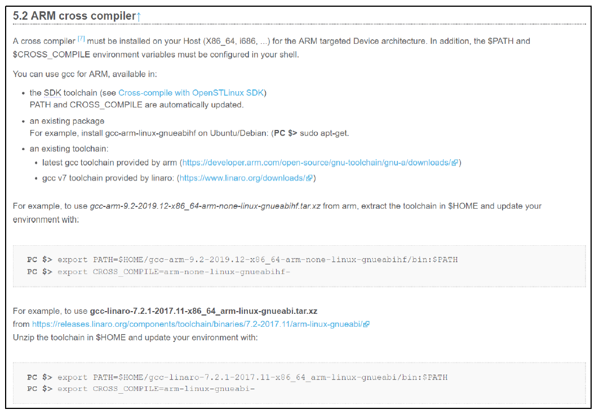
> 图：课件 Slide 28——ST 官方文档"5.2 ARM cross compiler"：(1) SDK 自带工具链（PATH 与 CROSS_COMPILE 自动更新）；(2) 发行版自带包（Ubuntu 上 `sudo apt install gcc-arm-linux-gnueabihf`）；(3) ARM/Linaro 官方工具链，并给出 gcc-arm-9.2 的 PATH/CROSS_COMPILE 设置示例。

本篇选 **(3) ARM 官方 `gcc-arm-9.2-2019.12-x86_64-arm-none-linux-gnueabihf`**：

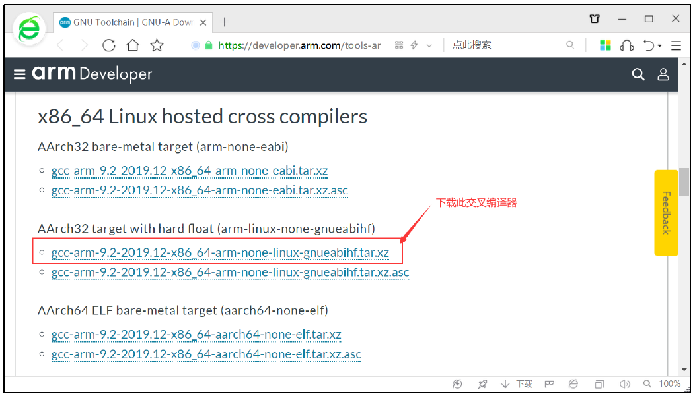
> 图：课件 Slide 30——ARM Developer 下载页，三组编译器；红框选中的是 **AArch32 target with hard float** 分组下的 `gcc-arm-9.2-2019.12-x86_64-arm-none-linux-gnueabihf.tar.xz`。

#### 1.1 拿到安装包：课件那个地址上已经找不到这个包，改用清华 TUNA 镜像（实测）

课件 Slide 29 给的地址是 `https://developer.arm.com/downloads/-/gnu-a`。本次按这个地址去找，**列表里已经没有 `gcc-arm-9.2-2019.12` 这一版了**。包名不用换、也别降级成别的编译器：**认准文件名里的 `9.2-2019.12` 和 `arm-none-linux-gnueabihf` 这两个词**——下面 `/etc/profile` 里那行 PATH、实验二十 Makefile 里的 `CROSS_COMPILE` 前缀写的都是这个名字，差一个字符都对不上。

> 下面这个镜像地址**是我自己找的，不是课件要求的**：Armbian 项目原样转发了 ARM 官方那几个工具链包（`_toolchain` 目录里连 2019-12-16 的时间戳和 `.asc` 签名文件都保留着），国内走清华大学 TUNA 镜像。**装出来的就是课件同款编译器**，第 6 章编 busybox、第 10 章 Qt Creator 里选交叉编译器，找的都是 `/usr/local/arm/gcc-arm-9.2-2019.12-x86_64-arm-none-linux-gnueabihf/` 这个路径——所以**解压出来那层目录别自己改名**。

在 Ubuntu 里一条 `wget` 下完（走 NAT 网卡出网）：

```bash
cd ~/Desktop/LINUX-gy/Test2      # 本篇的工作目录（虚拟机共享文件夹）
wget https://mirrors.tuna.tsinghua.edu.cn/armbian-releases/_toolchain/gcc-arm-9.2-2019.12-x86_64-arm-none-linux-gnueabihf.tar.xz
```

**实际执行结果**（2026-09-25 实测）：

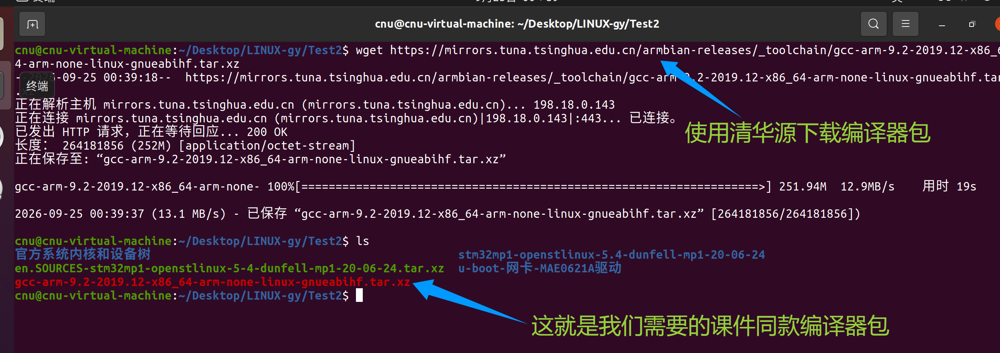
> 图：实测——Ubuntu 里 `wget` 清华镜像拉编译器的完整回显，最后 `ls` 里红字那一行就是我们要的包。两处蓝框标注：上=「使用清华源下载编译器包」，下=「这就是我们需要的课件同款编译器包」。

这一屏该读四行：

1. `已发出 HTTP 请求，正在等待回应... 200 OK`——地址有效、包确实在服务器上；这里若是 `404` 就是文件名打错了一个字符；
2. `长度： 264181856 (252M)` 和收尾的 `[264181856/264181856]`——**首尾两个数相等 = 一个字节都没少**，252 MB 的包下到这份上就算完整，不用再另外校验；
3. `251.94M 12.9MB/s 用时 19s`——国内镜像的实际速度，比去官网翻找快得多；
4. 末尾 `ls` 打出的 `gcc-arm-9.2-2019.12-x86_64-arm-none-linux-gnueabihf.tar.xz`——包就在当前目录，下一步原地解压。

> 一个看着奇怪的细节：这次域名解析到的是 `198.18.0.143`。`198.18.x.x` 是代理软件（Clash）的假地址段，说明这台机器开着代理——**不影响这次下载**，看到 `200 OK` 就别管它。

#### 1.2 解压安装、挂进 PATH（还在同一个目录里执行）

```bash
# 1. 建目录并解压（解压目标是虚拟机本地磁盘，不是共享文件夹）
sudo mkdir -p /usr/local/arm
sudo tar xf gcc-arm-9.2-2019.12-x86_64-arm-none-linux-gnueabihf.tar.xz -C /usr/local/arm/

# 2. 把编译器加入 PATH：编辑 /etc/profile，在文件末尾添加一行
sudo nano /etc/profile
#    末尾加：
#    export PATH=$PATH:/usr/local/arm/gcc-arm-9.2-2019.12-x86_64-arm-none-linux-gnueabihf/bin

# 3. 重新登录（或注销重进）让 /etc/profile 生效，然后验证
arm-none-linux-gnueabihf-gcc
```

**验证（装完立刻做，别留到最后）**：两条命令，各查一件事。

```bash
ls /usr/local/arm/
#   应打出 gcc-arm-9.2-2019.12-x86_64-arm-none-linux-gnueabihf
#   ——解压到位了，而且目录名与下面 PATH 里写的完全一致

arm-none-linux-gnueabihf-gcc        # 重新登录之后敲
#   期望两行：arm-none-linux-gnueabihf-gcc: fatal error: no input files
#            compilation terminated.
```

**看到 `no input files` 就是装成了**——它在抱怨"你没给我源文件"，说明命令已找到、能跑起来；敲成 `command not found` 就是 PATH 没生效（`/etc/profile` 那行没加对，或加了但没重新登录）。**这一步不验的代价**：实验二十 `make` 一上来就报 `arm-none-linux-gnueabihf-gcc: command not found`，看着像内核坏了，其实编译器根本没就位。

**实际执行结果**（2026-09-25 实测，提示符里的长路径折行；此刻在 `sources/arm-ostl-linux-gnueabi/` 下，与步骤 3 那棵树同一处）：

```
cnu@cnu-virtual-machine:…/sources/arm-ostl-linux-gnueabi$ ls /usr/local/arm/
gcc-arm-9.2-2019.12-x86_64-arm-none-linux-gnueabihf
cnu@cnu-virtual-machine:…/sources/arm-ostl-linux-gnueabi$ arm-none-linux-gnueabihf-gcc
arm-none-linux-gnueabihf-gcc: 致命错误： 没有输入文件
编译中断。
```

两条都对上了：`ls` 打出的目录名与 PATH 里写的完全一致；gcc 回的两行就是课件那屏的中文说法（这台 Ubuntu 是中文语言环境，`致命错误： 没有输入文件 / 编译中断。` = 英文的 `fatal error: no input files / compilation terminated.`）——**认"它在抱怨没有输入文件"这个意思，别认语言**。

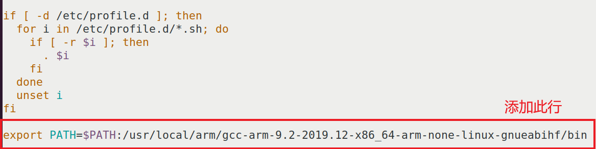
> 图：课件 Slide 31——`/etc/profile` 末尾新增的一行：`export PATH=$PATH:/usr/local/arm/gcc-arm-9.2-2019.12-x86_64-arm-none-linux-gnueabihf/bin`。**加的是 gcc 可执行文件所在目录**；环境变量要重新登录才生效，别改完就立刻试。

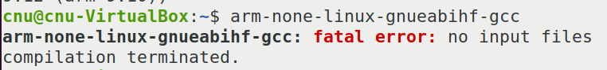
> 图：课件 Slide 32——验证方式：终端敲 `arm-none-linux-gnueabihf-gcc`，输出 `fatal error: no input files / compilation terminated.` **就说明装成了**——它抱怨"没有输入文件"而不是"找不到命令"。

> **本篇两处解压写法不同，不是笔误**：这里用 `tar xf`，步骤 3 解压 ST 源码用 `tar xfJ`——GNU tar 会自己认压缩格式，`J` 只是显式声明 xz，两种都能跑。
> **`-C /usr/local/arm/` 别换成共享目录**：共享文件夹不支持 Linux 符号链接（第 3 章装 SDK 时踩过），工具链解压进去会当场崩一堆 `Cannot create symlink`。

**顺带把命名规则读懂**（课件 Slide 33~34，以后看任何工具链名字都能拆）：

```
arch [-vendor] [-os] [-(gnu)eabi]
arm - none - linux - gnueabihf
```

- `arm`：目标架构；`none`：无特定厂商；`linux`：生成支持 Linux 操作系统的程序（不带 linux 的如 `arm-none-eabi-` 是裸机用的）；`gnueabi`：遵循 EABI 接口、glibc 库；`hf`：**hard float**，硬件浮点。

### 步骤 2：安装 u-boot-tools（提供 mkimage）（Slide 35~36）

编 uImage 的最后一步要调用 `mkimage` 给 zImage 加那 64 字节的头（实验十八讲过的"四兄弟"最后一级）。没有它就是这个下场：

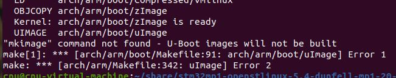
> 图：课件 Slide 35——编译到 `UIMAGE arch/arm/boot/uImage` 时报 `"mkimage" command not found - U-Boot images will not be built`，随后 `make[1]`/`make` 连环 Error 退出。**前面全对，最后一步崩**——所以先把它装了。

二选一：

```bash
# 方式 A（推荐，一条命令）：Ubuntu 的软件源里有现成的
sudo apt install u-boot-tools

# 方式 B：用第 3 章编译 U-Boot 时生成的那个
#   在 u-boot 源码的 tools/ 目录里找到 mkimage，拷到 /bin 并加执行权限
sudo cp <u-boot源码>/tools/mkimage /bin/
sudo chmod +x /bin/mkimage
```

**装完立刻验**（一条命令）：

```bash
mkimage -help
```

**实际执行结果**（2026-09-25 实测）：

```
cnu@cnu-virtual-machine:~/Desktop/LINUX-gy/Test2$ sudo apt install u-boot-tools
下列【新】软件包将被安装：
  device-tree-compiler libfdt1 libubootenv-tool libubootenv0.1 u-boot-tools
升级了 0 个软件包，新安装了 5 个软件包，要卸载 0 个软件包，有 414 个软件包未被升级。
需要下载 446 kB 的归档。
已下载 446 kB，耗时 1秒 (557 kB/s)
正在设置 u-boot-tools (2021.01+dfsg-3ubuntu0~20.04.5) ...
cnu@cnu-virtual-machine:~/Desktop/LINUX-gy/Test2$ mkimage -help
mkimage: invalid option -- 'h'
Error: Invalid option
Usage: mkimage -l image
          -l ==> list image header information
          mkimage [-x] -A arch -O os -T type -C comp -a addr -e ep -n name -d data_file[:data_file...] image
...
          mkimage -V ==> print version information and exit
Use '-T list' to see a list of available image types
```

> **这一屏最容易看走眼**：开头两行 `mkimage: invalid option -- 'h'` 和 `Error: Invalid option` **不是装失败**——`mkimage` 没把 `h` 列进合法选项，所以 `-help` 它不认，转头把整段用法打给你看。**判据是打出 `Usage: mkimage -l image` 这一大段 = 命令在位**；真没装成是另一副样子：`mkimage: command not found`。想干净一点就敲 `mkimage -V`，用法末行就写着它"打印版本并退出"。

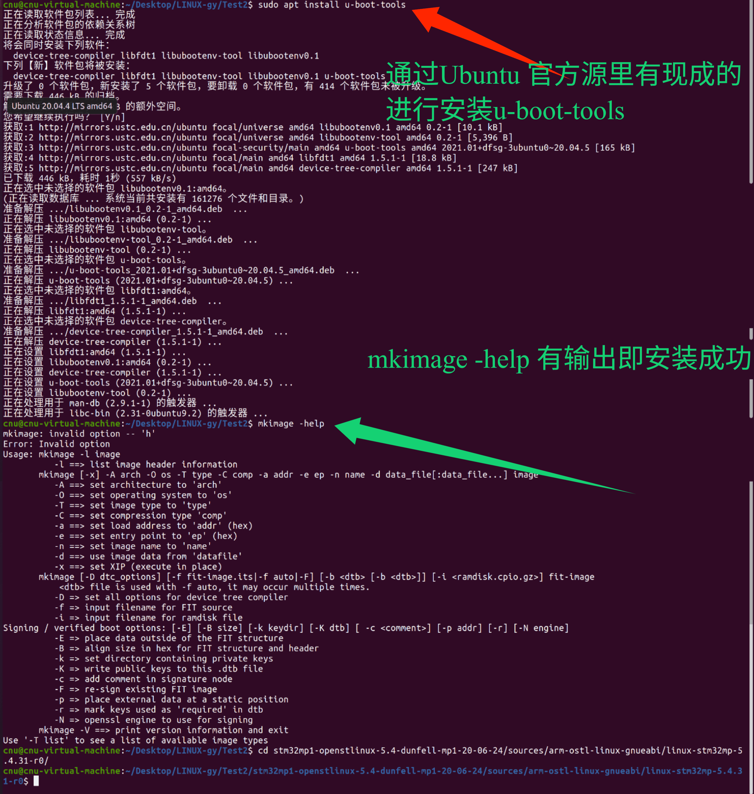
> 图：实测——`sudo apt install u-boot-tools` 全过程（连带装上 device-tree-compiler、libfdt1、libubootenv-tool、libubootenv0.1，共 5 个包 446 kB，1 秒装完；这台机器的 apt 源已换成中科大镜像 `mirrors.ustc.edu.cn`，所以快）＋随后 `mkimage -help` 打出的整段 Usage。最底下那行 `cd .../linux-stm32mp-5.4.31-r0/` 就是进步骤 3 的目录。

**关联后续实验**：`mkimage` 只在编 uImage 的最后一步出场（实验二十），但它一缺席就是**整场内核编译白跑**——课件 Slide 35 那屏报错就是它。另外顺手记一句：这次 apt 还捎带装了 `device-tree-compiler`（提供 `dtc`），实验二十 `make dtbs` 编译设备树要用的就是它。

### 步骤 3：解压 ST 源码并打补丁（Slide 37~38）

ST 给的不是现成源码树，而是一个"官方源码 + 补丁 + 配置碎片"的组合包。这个包**实验二步骤 1 就解压过了**（第 3 章那份 u-boot 源码也出自它），所以本篇不用重新下载、也不用再解外层包，直接进内核那一层：

```bash
cd ~/Desktop/LINUX-gy/Test2/stm32mp1-openstlinux-5.4-dunfell-mp1-20-06-24/sources/arm-ostl-linux-gnueabi/linux-stm32mp-5.4.31-r0/
ls
```

`Test2` 那一段按自己的实际路径改（以自己终端提示符为准）。这一句 `ls` 是**进本步骤的第一道验证**：目录里应当躺着 `README.HOW_TO.txt`、`linux-5.4.31.tar.xz`、四个 `fragment-*.config`、四个 `0020~0023-*.patch`——缺哪样都别往下走，回实验二核对包。

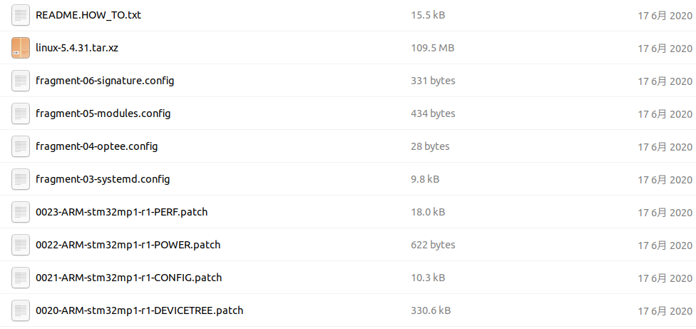
> 图：课件 Slide 37——解压后源码包内容：`README.HOW_TO.txt`（15.5 kB，**操作步骤全在这里面**）、`linux-5.4.31.tar.xz`（109.5 MB，官方源码本体）、`fragment-03-systemd.config`（9.8 kB）、`fragment-05-modules.config`（434 bytes）、`fragment-06-signature.config`（331 bytes）、`fragment-04-optee.config`（28 bytes）以及 `0020~0023-ARM-stm32mp1-r1-*.patch` 四个 ST 补丁（DEVICETREE 那个最大，330.6 kB）。

**所有动作都照 `README.HOW_TO.txt` 的步骤来**（这是 ST 写给自己用户的官方操作手册，课件 Slide 38 截的就是它的 48~74 行）：

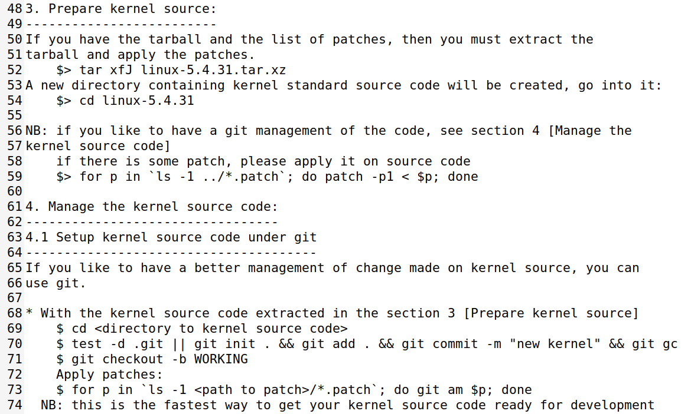
> 图：课件 Slide 38——README.HOW_TO.txt 的"3. Prepare kernel source"：`tar xfJ linux-5.4.31.tar.xz` 解压出源码目录，`cd linux-5.4.31`，然后 `for p in ...; do patch -p1 < $p; done` 把补丁逐个打上；"4. Manage the kernel source code" 用 `git init` + `git add .` + `git commit` 把打完补丁的源码纳管，并 `git checkout -b WORKING` 开工作分支。

#### 3.1 解压出源码树，先验一眼再打补丁

```bash
tar xfJ linux-5.4.31.tar.xz          # 109.5 MB 的包解出 1 GB 出头，一到两分钟
cd linux-5.4.31
ls
```

**就地验证**：`ls` 要看到内核顶层那一排——`arch`、`block`、`crypto`、`drivers`、`fs`、`include`、`kernel`、`lib`、`mm`、`net`、`scripts`、`security`、`sound`、`tools`、`usr`、`virt` 加一个 `Makefile`（这一屏在步骤 4 末尾那张实测图里也拍到了，同一棵树）。**解坏了的症状**：`linux-5.4.31/` 空的或只剩半截——xz 解压中断就会这样，删掉目录重解一次。

#### 3.2 打四个 ST 补丁

```bash
for p in `ls -1 ../*.patch`; do patch -p1 < $p; done
```

屏幕会刷几百行 `patching file ...`。**要看的不是行数多不多，而是有没有这两类字样**：

- `FAILED` / `can't find file to patch`——底包与补丁不配套（版本不对），停下来核对，别硬往下走；
- `Reversed (or previously applied) patch detected!`——补丁已经打过了，`patch` 在问你要不要撤销；敲 `n` 退出就行，说明这一步重复执行了。

**就地验证**（两条只读命令，几秒钟）：

```bash
ls ../*.patch        # 应列出 4 个：0020、0021、0022、0023
find . -name '*.rej' # 应无输出——.rej 是 patch 失败时留下的残片
```

**实际执行结果**（2026-09-25 实测）：一条 `for` 循环跑完，从上到下全是 `patching file`，能认出来的关键文件有 `arch/arm/kernel/time.c`、`arch/arm/mach-stm32/Kconfig`、`arch/arm/mach-stm32/board-dt.c`、`drivers/clk/clk-stm32mp1.c`、`drivers/gpu/drm/stm/ltdc.c`、`drivers/mmc/host/mmci_stm32_sdmmc.c`、`drivers/net/ethernet/stmicro/stmmac/dwmac-stm32.c`——**平台时钟、显示、MMC、网卡这几条主线全被补丁覆盖到了**，正是后面实验二十一（eMMC 驱动）、二十二（网卡驱动）要动的地方。无 `FAILED`、无 `.rej`。

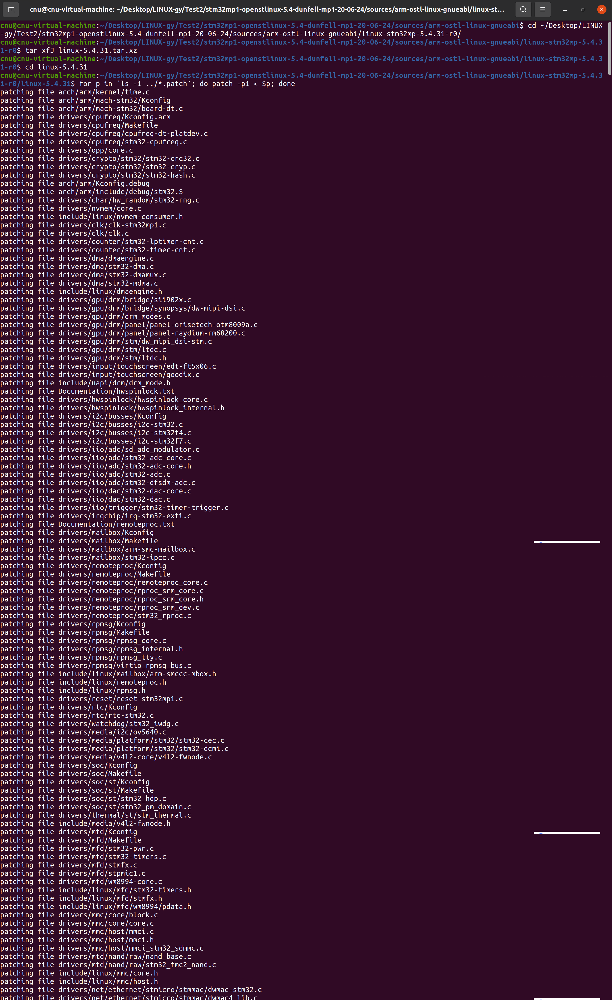
> 图：实测——在 `linux-5.4.31/` 里跑那条 `for` 循环的回显，整屏 `patching file`；顶上还能看到前面的 `tar xfJ linux-5.4.31.tar.xz` 与 `cd linux-5.4.31` 两条。

#### 3.3 把打完补丁的源码交给 git 管

照 README 第 4 节——第 3 章改 U-Boot 时我们吃过这个甜头：改坏了能 `git diff` 看、能回退。

```bash
test -d .git || git init . && git add . && git commit -m "new kernel" && git gc
git checkout -b WORKING
```

**就地验证**（三条）：

```bash
git log --oneline -1         # 应有一条 new kernel
git branch                   # 当前分支应是 * WORKING
git status --short | head    # 应无输出 = 工作区干净
```

**实际执行结果**（2026-09-25 实测）：`git add .` + `git commit` 打出一长串 `create mode 100644 ...`（整棵树几万个文件逐个入库），随后 `git gc` 报了一句：

```
fatal: 已经有一个 gc 正运行在机器 'cnu-virtual-machine' pid 6355（如果不是，使用 --force）
```

**这句无害**——第 3 章就撞过同一句：`git gc` 发现已经有一个 gc 在跑就让路，提交本身早已成功。接着 `git checkout -b WORKING` 回显 `切换到一个新分支 'WORKING'`，与第 3 章那棵 U-Boot 树的工作分支同名，往后的改动都落在这条分支上。

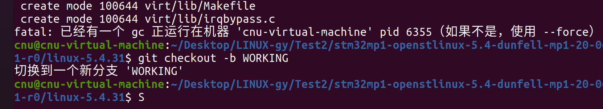
> 图：实测——`git commit` 尾部的 `create mode` 行、`git gc` 那句"已经有一个 gc 正运行"（无害），以及 `git checkout -b WORKING` 回显 `切换到一个新分支 'WORKING'`。

> **素材出处这条底账记下**：这份源码 = 官方 `linux-5.4.31.tar.xz` + ST 的 0020~0023 四个补丁，出自 `en.SOURCES-*.tar.xz`（md5 `42176cf65cf261df8083cacfaa5366f2`）。以后内核出怪问题，第一个要回答的就是"底子对不对"。
> **本篇实测是在共享文件夹里做的**（`~/Desktop/LINUX-gy/Test2/...`，与第 3 章编 U-Boot 同一处）：解压、打补丁、配配置一路跑通，没碰到符号链接问题。**真正吃 IO 的是实验二十那条 `make`**——共享盘上能编但明显慢，第 3 章的既有经验是：编到一半想掐可以 Ctrl+C、`make -j2` 接着编（进度保留）；若真报符号链接或权限类错误，就把源码移到虚拟机本地磁盘（如 `~/kernel/`）再编，**挪动后要 `make distclean` + 重做一遍步骤 4 的配置**。

### 步骤 4：生成默认配置并存成 stm32_fsmp1a_defconfig（Slide 39~40）

内核的编译行为全部由 `.config` 决定。我们的打法是**三层叠加**：

1. 官方 `multi_v7_defconfig` 打底（ARM 多平台通用配置）；
2. 叠加 ST 的 `fragment*.config`（ST 板级功能碎片配置）；
3. `make oldconfig` 把没覆盖到的新选项一律按默认值确认。

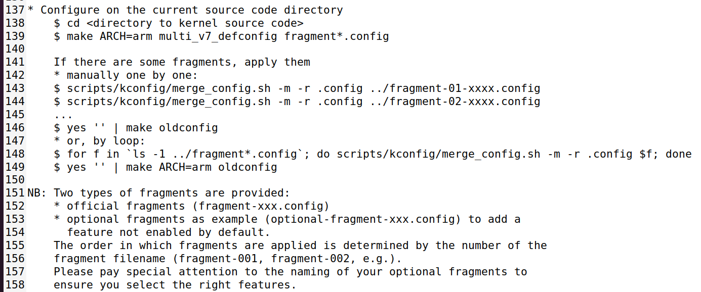
> 图：课件 Slide 39——README.HOW_TO.txt 第 137~158 行：`make ARCH=arm multi_v7_defconfig fragment*.config`；有 fragment 时用 `scripts/kconfig/merge_config.sh -m -r .config ../fragment-xx.config` 逐个合并（或 `for f in ...; do ...; done` 循环）；最后 **`yes '' | make ARCH=arm oldconfig`**。课件红字特别提醒：**`yes` 后面是两个单引号 `''`，不是一个双引号 `""`，别敲错！**

#### 4.1 三条命令生成 `.config`

落地（在 `linux-5.4.31/` 顶层）：

```bash
make ARCH=arm multi_v7_defconfig fragment*.config
for f in `ls -1 ../fragment*.config`; do scripts/kconfig/merge_config.sh -m -r .config $f; done
yes '' | make ARCH=arm oldconfig
```

`yes ''` 的作用：oldconfig 遇到新增选项会逐个提问，`yes ''` 自动用"默认值"回答每一个问题，人不用守着敲几百次回车。

**就地验证**（一条只读命令，别急着往下存档）：

```bash
grep CONFIG_ARCH_STM32 .config
```

**实际执行结果**（2026-09-25 实测）：

```
CONFIG_ARCH_STM32=y
```

**这一行是"ST 平台已被选中"的凭据**。它是空的话，说明上面三条里有一条没落地（最常见是 `multi_v7_defconfig` 那步打错、或 `.config` 根本没生成出来）——回头重跑这三条，别带着一个不完整的 `.config` 进实验二十，那样报的错会看起来像源码坏了。

#### 4.2 存档成自己的 defconfig，顺手验一次"能不能原样恢复回来"

把我们这份配置存档（课件 Slide 40 原文命令）：

```bash
cp .config arch/arm/configs/stm32_fsmp1a_defconfig
```

**光 `cp` 还不算验过**——存档的意义是"以后能用它把配置恢复回来"，所以紧接着就用它恢复一次：

```bash
make ARCH=arm stm32_fsmp1a_defconfig
```

**实际执行结果**（2026-09-25 实测，提示符里的长路径折行显示，原样见配图）：

```
cnu@cnu-virtual-machine:…/linux-stm32mp-5.4.31-r0/linux-5.4.31$ cp .config arch/arm/configs/stm32_fsmp1a_defconfig
cnu@cnu-virtual-machine:…/linux-5.4.31$ make ARCH=arm stm32_fsmp1a_defconfig
#
# No change to .config
#
cnu@cnu-virtual-machine:…/linux-5.4.31$ ls
arch   certs            COPYING  crypto         drivers  include  ipc     Kconfig  lib       MAINTAINERS  mm   README   scripts   sound  usr
block  CONTRIBUTING.md  CREDITS  Documentation  fs       init     Kbuild  kernel   LICENSES  Makefile     net  samples  security  tools  virt
cnu@cnu-virtual-machine:…/linux-5.4.31$ grep CONFIG_ARCH_STM32 .config
CONFIG_ARCH_STM32=y
cnu@cnu-virtual-machine:…/linux-5.4.31$ ls arch/arm/configs/stm32_fsmp1a_defconfig
arch/arm/configs/stm32_fsmp1a_defconfig
```

**这一屏该读三处**：

1. `# No change to .config #`——**这句是本篇最值钱的一行**。它的意思是"按刚存的 `stm32_fsmp1a_defconfig` 重新生成一遍 `.config`，结果一个选项都没变"，等于**存档与当前配置一字不差**，以后靠它就能原样退回今天这个状态。要是这里刷出一大片改动行、或报 `*** No rule to make target 'stm32_fsmp1a_defconfig'`，就说明 `cp` 没成功、文件没落进 `arch/arm/configs/`；
2. `ls` 那一屏顶层目录——`arch` `drivers` `Makefile` `scripts` `tools` 全在，顺手把步骤 3.1 那句"解压没解坏"的账也结了（`.config` 是隐藏文件，`ls` 看不见，要看它得 `ls -a`）；
3. 最后一条 `ls arch/arm/configs/stm32_fsmp1a_defconfig` 原样回显了这个路径——**文件确实在 configs 目录里躺着**，实验二十之后每次重编都用它恢复配置。

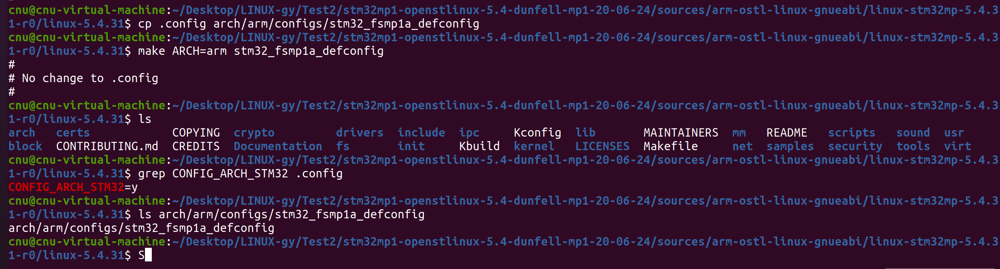
> 图：实测——步骤 4 收尾这一串：`cp .config arch/arm/configs/stm32_fsmp1a_defconfig` → `make ARCH=arm stm32_fsmp1a_defconfig` 回 `# No change to .config #` → `ls` 顶层目录 → `grep CONFIG_ARCH_STM32 .config` 回红字 `CONFIG_ARCH_STM32=y` → `ls arch/arm/configs/stm32_fsmp1a_defconfig` 文件存在。

以后（实验二十之后的每一次重编）恢复配置只要一条：

```bash
make ARCH=arm stm32_fsmp1a_defconfig
```

## 五、注意事项

1. **本篇的规矩是一步一验**：每个动作后面都紧跟一条只读命令确认它成了，再往下走。八个验证点集中在第六节那张表里。**攒到最后一起验的代价**是——真出错时你分不清是编译器没装、补丁没打，还是配置没合并，只能从头重来一遍（这篇"从头"是解压 1 GB 源码 + 重打四个补丁）。
2. **两套编译器别混用**：SDK 的 `arm-ostl-linux-gnueabi-`（实验一装的）本篇之后不再用于内核；新的是 `arm-none-linux-gnueabihf-`。**两者前缀不同、定位不同**：前者编 U-Boot（已收官），后者编内核与 busybox。
3. **`/etc/profile` 改完必须重新登录**才生效——`source` 也行，但重登录最干净；验证方式就是步骤 1.2 那两条（`ls /usr/local/arm/` 看目录、`arm-none-linux-gnueabihf-gcc` 看它报"no input files"而不是"command not found"）。
4. **打补丁时每个 patch 都要成功**：屏幕上出现 `FAILED`、或有 `.rej` 文件留下，说明底包与补丁不配套——停下来核对源码包版本，别硬往下走（步骤 3.2 有这两条命令）。
5. **`yes ''` 是两个单引号**（课件红字）：敲成 `yes ""` 效果不同，oldconfig 可能卡住等你输入。
6. **`.config` 不要手改**（实验十八说过）：它是配置工具的产物；要改功能用 `make menuconfig`，要恢复用 `stm32_fsmp1a_defconfig`。
7. **本篇在共享文件夹里做得完**（实测），但实验二十那条 `make` 才是考验——见步骤 3.3 末尾那段"共享盘 vs 本地磁盘"的说明。

## 六、八个验证点一览

这一节不是"最后再跑一遍"，而是把各步骤里**就地**该敲的验证命令汇总成一张表，方便对照自查（每条命令都在对应步骤里出现过，判据也写在那儿）。

| 验证点 | 命令 | 通过的样子 | 在哪一步敲 |
|---|---|---|---|
| 编译器包下到位 | `ls`（工作目录） | 有 `gcc-arm-9.2-...tar.xz`，`wget` 收尾是 `[264181856/264181856]` | 步骤 1.1 |
| 编译器能用 | `ls /usr/local/arm/`、`arm-none-linux-gnueabihf-gcc` | 目录名与 PATH 里写的一致；命令报"没有输入文件"（英文环境是 `no input files`） | 步骤 1.2 |
| `mkimage` 能用 | `mkimage -help` | 打出整段 `Usage: mkimage -l image`（前面带 `invalid option` 属正常） | 步骤 2 |
| 源码解压完好 | `ls`（`linux-5.4.31/` 顶层） | `arch`、`drivers`、`Makefile`、`scripts`、`tools` 那一排齐全 | 步骤 3.1 |
| 四个补丁都打上 | `ls ../*.patch`、`find . -name '*.rej'` | 列出 4 个补丁；`.rej` 一条都没有 | 步骤 3.2 |
| 源码已交给 git 管 | `git log --oneline -1`、`git branch` | 有一条 `new kernel`；当前 `* WORKING` | 步骤 3.3 |
| ST 平台已选中 | `grep CONFIG_ARCH_STM32 .config` | `CONFIG_ARCH_STM32=y` | 步骤 4.1 |
| 配置存档可恢复 | `make ARCH=arm stm32_fsmp1a_defconfig`、`ls arch/arm/configs/stm32_fsmp1a_defconfig` | `# No change to .config #`；文件确实存在 | 步骤 4.2 |

不达标时的排查：

| 现象 | 先查什么 |
|---|---|
| 按课件地址在 ARM 官网找不到包 / `wget` 报 `404 Not Found` | 官网那页已经不挂 `9.2-2019.12` 了，改用步骤 1 的清华镜像地址；文件名**整段复制**别手打，长文件名打错一个字符就是 404 |
| `command not found`（arm-none-linux-gnueabihf-gcc） | `/etc/profile` 加没加、重新登录没；`ls /usr/local/arm/` 看目录名与 PATH 里写的一致不一致 |
| `patch` 报 `FAILED` 或生成 `.rej` | 底包与补丁不配套——核对 `linux-5.4.31.tar.xz` 是否出自 `en.SOURCES-*` 这份包，重解压重打 |
| `merge_config.sh` 报 `not found` | 当前目录不在内核顶层（脚本在 `scripts/kconfig/` 下，要按相对路径引用） |
| oldconfig 卡住不动 | `yes ''` 的引号敲成了双引号；Ctrl+C 后重敲 |
| `make ARCH=arm stm32_fsmp1a_defconfig` 报 `No rule to make target` | `cp` 那一步没成功、文件没进 `arch/arm/configs/`——先 `ls arch/arm/configs/stm32_fsmp1a_defconfig` 确认，再回步骤 4.2 |

## 七、实验完成标志

- 编译器安装包已从清华镜像下到位：`200 OK`、264,181,856 字节、19 秒（步骤 1.1 实测）
- ARM 官方交叉编译器解压到 `/usr/local/arm/`，`/etc/profile` 加了 PATH，重新登录后 `arm-none-linux-gnueabihf-gcc` 报"没有输入文件"（步骤 1.2 实测：`ls` 见 `gcc-arm-9.2-2019.12-x86_64-arm-none-linux-gnueabihf`，gcc 回 `致命错误： 没有输入文件 / 编译中断。`）
- `u-boot-tools` 装好，`mkimage -help` 打出整段 Usage（步骤 2 实测：5 个包 446 kB / 1 秒，版本 `2021.01+dfsg-3ubuntu0~20.04.5`）
- `linux-5.4.31/` 源码解压完好、0020~0023 四个补丁全部打上（无 `FAILED`、无 `.rej`）、git 纳管并切到 WORKING 分支（步骤 3 实测）
- fragment 合并完成、`.config` 生成，`grep CONFIG_ARCH_STM32 .config` 回 `CONFIG_ARCH_STM32=y`（步骤 4.1 实测）
- 配置已存档 `arch/arm/configs/stm32_fsmp1a_defconfig`，且用它恢复回显 `# No change to .config #`（步骤 4.2 实测）

## 八、下一步：编译内核与设备树

地基打好，下一篇（实验二十）一口气把"内核文件四兄弟"造出来：顶层 Makefile 加 `ARCH`/`CROSS_COMPILE` 两行 → `make uImage LOADADDR=0xC2000040` → 添加 fsmp1a 的设备树文件 → `make dtbs`。编完就能回答一个问题：**我们自己编的内核，能不能像出厂那份一样把板子点着？**
