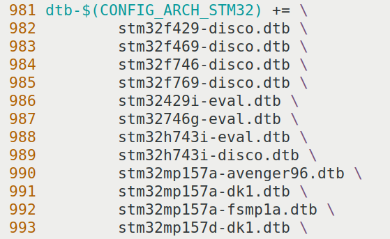

# 实验二十 编译内核与设备树——第一次编出自己的 uImage 和 fsmp1a.dtb

> **对应课件**：《第5章 移植Linux内核》5.4 节步骤 3~4（Slide 41~46）
>
> **系列说明**：本系列基于华清远见 FS-MP1A（STM32MP157A）开发板，对应课件《第5章 移植Linux内核》。地基打好（实验十九），本篇一口气产出第 5 章最重要的两个文件：**自己编的 `uImage`** 和 **自己编的 `stm32mp157a-fsmp1a.dtb`**。编完先不改任何东西——这份"零修改"内核本来就适配 ST 官方板，**大概率能把我们的板子点着到与实验十六一模一样的 panic**（因为根文件系统还没解决）；eMMC 驱动和网卡驱动是实验二十一、二十二的事。前置：实验十九（源码、补丁、配置、两套工具全部就位）。

## 一、本篇要产出的两个文件，和它们的"去处"

| 产出 | 生成位置 | 后面怎么用 |
|---|---|---|
| `arch/arm/boot/uImage` | 编内核的终点产物 | 拷进 `/home/cnu/tftpboot`，实验二十三 `tftp c2000000 uImage` 点火 |
| `arch/arm/boot/dts/stm32mp157a-fsmp1a.dtb` | 编设备树的产物 | 同上，`tftp c4000000 stm32mp157a-fsmp1a.dtb` |

与出厂件的区别只在"谁编的"：出厂 `uImage` 是华清拿 ST 包编的（7,546,640 字节），我们这份大小不会一样——**大小不同没关系，能不能点火由实验二十三验收**。

## 二、实验环境（实际）

| 项目 | 实际值 |
|---|---|
| 操作位置 | Ubuntu 虚拟机，`~/kernel/linux-5.4.31/`（实验十九建好的源码目录） |
| 编译器 | `arm-none-linux-gnueabihf-`（实验十九装的 ARM 官方 gcc 9.2） |
| 配置基线 | `.config`（由 `multi_v7_defconfig` + fragment 合并而来），已存档 `stm32_fsmp1a_defconfig` |
| 板子 | 本篇不开（编译全程在虚拟机） |

> **开工自检（10 秒）**：`ls arch/arm/configs/stm32_fsmp1a_defconfig` 在不在（实验十九的存档）；`mkimage -help` 有没有输出。两条都在才开工，否则回实验十九。

## 三、课件 ↔ 步骤对应表

| 课件 Slide | 内容 | 对应步骤 |
|---|---|---|
| 41 | 顶层 Makefile 加 ARCH/CROSS_COMPILE 两行 | 步骤 1 |
| 41 | `make uImage LOADADDR=0xC2000040`，产物在 arch/arm/boot | 步骤 2 |
| 43 | 设备树：参考 dk1，新增 fsmp1x.dtsi + fsmp1a.dts（老师提供） | 步骤 3 |
| 44 | dts/Makefile 加一行使新设备树被编译 | 步骤 4 |
| 45 | `make dtbs`，产物 stm32mp157a-fsmp1a.dtb | 步骤 5 |
| 46 | 缺 eMMC 驱动时卡 `Waiting for root device /dev/mmcblk1p4` | 步骤 6（认知） |

### 本篇动作 → 后面谁用 → 现在含糊的后果

| 本篇动作 | 后面哪一篇要用 | 现在含糊的后果 |
|---|---|---|
| 顶层 Makefile 的 `ARCH := arm`、`CROSS_COMPILE := arm-none-linux-gnueabihf-` 两行 | 实验二十一、二十二每次重编译——写一次管到第 5 章结束 | 不写就得每条 make 命令都带 `ARCH=arm CROSS_COMPILE=...`，长命令更容易错 |
| `LOADADDR=0xC2000040` | 实验二十三点火时 uImage 落在 0xC2000000、真身在 +0x40（实验十六实测互证） | 写成 0xC2000000，U-Boot 头说好的入口和实际代码错位，点火失败 |
| `stm32mp157a-fsmp1a.dtb`（我们的设备树） | 实验二十一、二十二改的就是它的源文件；实验二十三点火要用它 | 误用出厂 `mipi050.dtb` 替代，则后面改驱动的步骤全部白做 |
| `make dtbs` 的产物验证 | 实验二十三点火前 `md.l` 验 FDT 魔数 `d00dfeed` | dtb 没编出来或拷错文件，点火报错还以为是内核问题 |

本篇需要的资料：`kernel-初始设备树.zip`（2,226 字节，md5 `38190d0400d9504bebc3caaf48ed6fed`）——里面是老师提供的两个设备树源文件，步骤 3 解压使用。

## 四、实验步骤

### 步骤 1：顶层 Makefile 加两行（Slide 41）

打开内核源码**顶层** `Makefile`（`linux-5.4.31/Makefile`），找到第 360 行附近的 `ARCH ?= $(SUBARCH)`，在它附近加上两行：

```makefile
ARCH := arm
CROSS_COMPILE := arm-none-linux-gnueabihf-
```


> 图：课件 Slide 41——顶层 Makefile 第 360~367 行片段：原有 `ARCH ?= $(SUBARCH)`，新增两行 `ARCH := arm`、`CROSS_COMPILE := arm-none-linux-gnueabihf-`；其后是 `UTS_MACHINE := $(ARCH)` 等原有内容。

这两行就是实验十九讲的"前缀"落地点：**从此每条 make 命令都自动带上架构与编译器前缀**，不用再写 `ARCH=arm CROSS_COMPILE=...`。加完后用 `git diff` 看一眼（实验十九给源码建了 git 管理），确认只加了两行没动别处。

### 步骤 2：编内核——make uImage LOADADDR=0xC2000040（Slide 41~42）

```bash
make uImage LOADADDR=0xC2000040 -j4
```

- `-j4`：4 线程并行（虚拟机分配几核就写几，第一次编 20~40 分钟，**后面的重编只需 1~2 分钟**——make 只重编改动过的文件）；
- `LOADADDR=0xC2000040`：**uImage 头里记录的"内核加载/入口地址"**。实验十六实测过：uImage 放在 0xC2000000，头占 0x40，真身从 0xC2000040 开始——这个参数就是把这层关系写死进镜像头里。

编完验证：

```bash
ls -l arch/arm/boot/uImage
# 出厂那份是 7,546,640 字节；我们这份大小不同属正常（配置与编译器版本不同）
# 相同点：它 = zImage + 64 字节头
```

顺手记两个数：`uImage` 的字节数（后面实验二十三点火时与 tftp 的 `Bytes transferred` 对账）；如果想要"未经 U-Boot 头包装"的对照，`arch/arm/boot/zImage` 就在不远处，它应比 uImage 小 64 字节。

### 步骤 3：放入 FS-MP1A 的设备树源文件（Slide 43）

5.4.31 内核必须配设备树才能跑。ST 官方板的设备树是 `arch/arm/boot/dts/` 下的 `stm32mp15xx-dkx.dtsi` + `stm32mp157a-dk1.dts`；**FS-MP1A 的对应文件老师已提供**，就是资料包 `kernel-初始设备树.zip` 里的两个文件：

| zip 里的文件 | 放到内核源码的位置 | 角色 |
|---|---|---|
| `stm32mp15xx-fsmp1x.dtsi` | `arch/arm/boot/dts/` | FS-MP1A 的公共外设描述（后面实验二十一、二十二往它里面加 eMMC 与网卡的节点） |
| `stm32mp157a-fsmp1a.dts` | `arch/arm/boot/dts/` | 板级入口文件（引用 .dtsi） |

```bash
cd <源码>/arch/arm/boot/dts/
unzip -o "D:.../kernel-初始设备树.zip" 的两个文件拷到这里   # 具体路径按你的共享目录来
# 或从 Windows 共享目录 cp 进来后解压
```

文件内容**现在不用看懂**——它就是第 3 章 F 系列在 U-Boot 里做过的同类事（引用 pintrl、挂总线节点）的内核版；实验二十一、二十二会各往 `stm32mp15xx-fsmp1x.dtsi` 里加一段，到时候逐行读。

### 步骤 4：让 dts/Makefile 认识新设备树（Slide 44）

设备树不会自动被编译——要在 `arch/arm/boot/dts/Makefile` 的 STM32 那一组里**加一行**：

```makefile
stm32mp157a-fsmp1a.dtb \
```


> 图：课件 Slide 44——`arch/arm/boot/dts/Makefile` 第 981~993 行：`dtb-$(CONFIG_ARCH_STM32) += \` 后跟着一串 `.dtb`，其中新增的第 992 行 `stm32mp157a-fsmp1a.dtb \` 使新设备树进入编译清单。**位置要插在 stm32mp157a 系列那一组里，行尾的反斜杠 `\` 一个都不能少**（它表示"续行"）。

### 步骤 5：编设备树——make dtbs（Slide 45）

```bash
make dtbs
```

编完验证：

```bash
ls -l arch/arm/boot/dts/stm32mp157a-fsmp1a.dtb
# 大小几万字节量级（出厂的 mipi050.dtb 是 71,805 字节；我们这份因源文件不同，数值会不同）
```

`make dtbs` 只编设备树、不重编内核，几秒钟完事——以后每次改 `.dtsi` 都只用敲它（实验二十一、二十二全是这个节奏）。

### 步骤 6：认知——此时点火会发生什么（Slide 46）

本篇先不动板子，但要预告：**现在的内核没配 eMMC 驱动**，它启动时默认去 eMMC 找根文件系统，会一直等：


> 图：课件 Slide 46——内核启动日志的结尾：驱动探完一轮后，最后一行停在 **`Waiting for root device /dev/mmcblk1p4...`**（一直等 eMMC 上的根文件系统分区，不会 panic 退出）。注意课件板的 eMMC 是 `mmcblk1`，**我们板上是 `mmcblk2`**（实验十四、十六双实测），到实验二十三点火时看到的行号会跟着变。

对比实验十六：出厂内核把两块盘都认出来了、panic 在"没有 root= 参数"；我们这份"零修改"内核则**连 eMMC 都认不出**——差别就是 ST 那份出厂配置勾了 SDMMC 控制器而 `multi_v7` 没勾。这就是实验二十一（eMMC 驱动）要解决的第一件事。

## 五、注意事项

1. **第一次 `make uImage` 时间长是正常的**（20~40 分钟量级，看虚拟机核数与磁盘）；中途 Ctrl+C 也没关系，重敲会**从断点续编**（make 的增量特性，第 3 章编 U-Boot 时验证过）。
2. **LOADADDR 别写成 0xC2000000**：差 0x40 就是差一个头。它在头里的 `Load Address`/`Entry Point` 两栏出现——实验十六 bootm 回显里见过。
3. **`stm32mp157a-fsmp1a.dtb` 与出厂的 `stm32mp157a-fsmp1a-mipi050.dtb` 是两份不同的 dtb**：前者是我们源码里编的（后面三篇持续改它），后者是华清出厂 bootfs 里的（实验十六点火用的）。实验二十三点火用**我们自己这份**，别拿错。
4. **dts/Makefile 加行注意续行符 `\`**：加错位置或漏 `\`，`make dtbs` 不会编出我们的 dtb，且不报错——`ls arch/arm/boot/dts/stm32mp157a-fsmp1a.dtb` 是唯一判据。
5. 改 Makefile 前后用 `git diff` 过一眼（源码已纳管），改坏了好回退。
6. 编译报 `arm-none-linux-gnueabihf-gcc: command not found` → 回实验十九步骤 1（PATH/重新登录）。

## 六、怎么验证

1. `ls -l arch/arm/boot/uImage` 存在，字节数**记在本篇完成标志里**（待实测回填）；
2. `ls -l arch/arm/boot/zImage` 比 uImage **小 64 字节**（四兄弟链条的现场验证）；
3. `ls -l arch/arm/boot/dts/stm32mp157a-fsmp1a.dtb` 存在（不为 0 字节）；
4. `git status` 只显示预期中的改动（顶层 Makefile 两行、dts/Makefile 一行、新增两个 dts 文件），无意外文件。

不达标时的排查：

| 现象 | 先查什么 |
|---|---|
| `make uImage` 报 `"mkimage" command not found` | 实验十九步骤 2 的 u-boot-tools 装了没 |
| 编译一开始就报架构/编译器相关错误 | 顶层 Makefile 两行的拼写；`arm-none-linux-gnueabihf-gcc` 单独敲一下（实验十九验证法） |
| `make dtbs` 后找不到我们的 dtb | dts/Makefile 那一行加的位置与行尾 `\`；`ls arch/arm/boot/dts/stm32mp157a-fsmp1a.dts` 在不在（步骤 3 有没有拷对） |
| 磁盘满 | 虚拟机磁盘扩容或清理（源码 + 编译产物约 2~3 GB） |

## 七、实验完成标志

- 顶层 Makefile 已加 `ARCH`/`CROSS_COMPILE` 两行（步骤 1，待实测）
- `make uImage LOADADDR=0xC2000040` 编译成功，`arch/arm/boot/uImage` 生成且字节数已记录（步骤 2，待实测）
- `arch/arm/boot/zImage` 存在且比 uImage 小 64 字节（步骤 2，待实测）
- `stm32mp15xx-fsmp1x.dtsi` 与 `stm32mp157a-fsmp1a.dts` 已放入 `arch/arm/boot/dts/`（步骤 3，待实测）
- dts/Makefile 已加 `stm32mp157a-fsmp1a.dtb \` 一行（步骤 4，待实测）
- `make dtbs` 编出 `stm32mp157a-fsmp1a.dtb` 且字节数已记录（步骤 5，待实测）

## 八、下一步：移植 eMMC 驱动

内核编出来了，但它"看不见"eMMC——点火会停在 `Waiting for root device`。下一篇（实验二十一）给它装上眼睛：设备树加 `sdmmc2` 节点 + menuconfig 勤 STM32 SDMMC 控制器 + 重编译，让内核像出厂那份一样把 `mmcblk2` 认出来。
