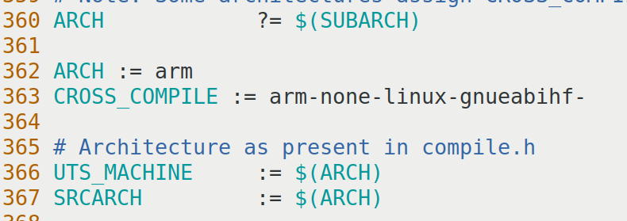
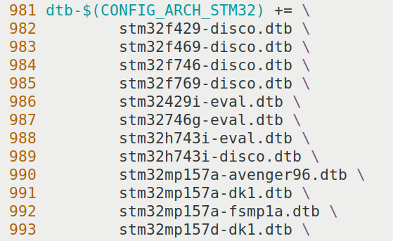
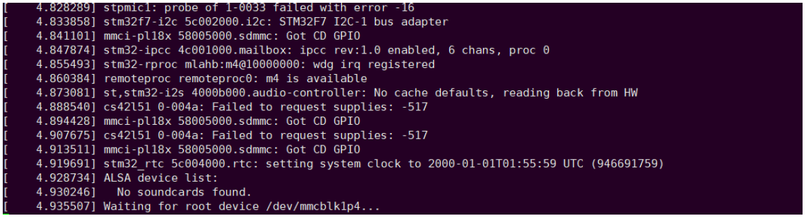

# 实验二十 编译内核与设备树——第一次编出自己的 uImage 和 fsmp1a.dtb

> **对应课件**：《第5章 移植Linux内核》5.4 节步骤 3~4（Slide 41~46）
>
> **系列说明**：本系列基于华清远见 FS-MP1A（STM32MP157A）开发板，对应课件《第5章 移植Linux内核》。地基打好（实验十九），本篇一口气产出第 5 章最重要的两个文件：**自己编的 `uImage`** 和 **自己编的 `stm32mp157a-fsmp1a.dtb`**。编完先不改任何东西——这份"零修改"内核加上老师给的设备树，就是我们后面移植 eMMC、网卡驱动的底版；eMMC 驱动和网卡驱动是实验二十一、二十二的事。前置：实验十九（源码、23 个补丁、配置、两套工具全部就位）。

## 一、本篇要产出的两个文件，和它们的"去处"

| 产出 | 生成位置 | 后面怎么用 |
|---|---|---|
| `arch/arm/boot/uImage` | 编内核的终点产物 | 拷进 `/home/cnu/tftpboot`，实验二十三 `tftp c2000000 my_uImage` 点火 |
| `arch/arm/boot/dts/stm32mp157a-fsmp1a.dtb` | 编设备树的产物 | 同上，`tftp c4000000 stm32mp157a-fsmp1a.dtb` |

与出厂件的区别只在"谁编的"：出厂 `uImage` 是华清拿 ST 包编的（7,546,640 字节），我们这份大小不会一样——**大小不同没关系，能不能点火由实验二十三验收**。还有一个更好认的记号：我们编的 uImage 版本串带 git 哈希（`Linux-5.4.31-g<哈希>`，实验十九步骤 3.3 说过原因），出厂那份是干净的 `Linux-5.4.31`——以后从 U-Boot 的 `Image Name:` 一行就能看出点的哪份内核。

## 二、实验环境（实际）

| 项目 | 实际值 |
|---|---|
| 操作位置 | Ubuntu 虚拟机，实验十九那棵源码树（在共享目录 `~/Desktop/LINUX-gy/Test2/...` 或本地 `~/kernel/linux-5.4.31/`，**以你实际位置为准**） |
| 编译器 | `arm-none-linux-gnueabihf-`（实验十九装的 ARM 官方 gcc 9.2） |
| 配置基线 | `.config`（由 `multi_v7_defconfig` + fragment 合并而来），已存档 `stm32_fsmp1a_defconfig` |
| 板子 | 本篇不开（编译全程在虚拟机） |

> **开工自检（10 秒）**：四条都在才开工——① 当前目录是**内核源码顶层**（提示符末段是 `linux-5.4.31`，层级图与认层判据见实验十九步骤 3；若站在带 `-r0` 的材料包层，`cd linux-5.4.31` 再开工）；② `ls arch/arm/configs/stm32_fsmp1a_defconfig`（实验十九的存档）；③ `mkimage -V` 有版本输出（实验十九装的 u-boot-tools）；④ `arm-none-linux-gnueabihf-gcc` 单独敲一下报"没有输入文件"（编译器在 PATH）。哪条不对回实验十九对应步骤。

## 三、课件 ↔ 步骤对应表

| 课件 Slide | 内容 | 对应步骤 |
|---|---|---|
| 41 | 顶层 Makefile 加 ARCH/CROSS_COMPILE 两行 | 步骤 1 |
| 41~42 | `make uImage LOADADDR=0xC2000040`，产物在 arch/arm/boot | 步骤 2 |
| 43 | 设备树：参考 dk1，新增 fsmp1x.dtsi + fsmp1a.dts（老师提供） | 步骤 3 |
| 44 | dts/Makefile 加一行使新设备树被编译 | 步骤 4 |
| 45 | `make dtbs`，产物 stm32mp157a-fsmp1a.dtb | 步骤 5 |
| 46 | 此刻点火会怎样：无根文件系统的结局 | 步骤 6（认知） |

### 本篇动作 → 后面谁用 → 现在含糊的后果

| 本篇动作 | 后面哪一篇要用 | 现在含糊的后果 |
|---|---|---|
| 顶层 Makefile 的 `ARCH := arm`、`CROSS_COMPILE := arm-none-linux-gnueabihf-` 两行 | 实验二十一、二十二每次重编译——写一次管到第 5 章结束 | 不写就得每条 make 命令都带 `ARCH=arm CROSS_COMPILE=...`，长命令更容易错 |
| `LOADADDR=0xC2000040` | 实验二十三点火时 uImage 落在 0xC2000000、真身在 +0x40（实验十六实测互证） | 写成 0xC2000000，U-Boot 头说好的入口和实际代码错位，点火失败 |
| `stm32mp157a-fsmp1a.dtb`（我们的设备树） | 实验二十一、二十二改的就是它的源文件；实验二十三点火要用它 | 误用出厂 `mipi050.dtb` 替代，则后面改驱动的步骤全部白做 |
| 两个产物的字节数记录 | 实验二十三点火后与 tftp 的 `Bytes transferred` 对账 | 拷错文件、下错版本都发现不了 |

本篇需要的资料：`kernel-初始设备树.zip`（2,226 字节，md5 `38190d0400d9504bebc3caaf48ed6fed`）——里面是老师提供的两个设备树源文件，步骤 3 解压使用。

## 四、实验步骤

### 步骤 1：顶层 Makefile 加两行（Slide 41）

打开内核源码**顶层** `Makefile`，定位到第 360 行——一行用 TAB 缩进的 `ARCH ?= $(SUBARCH)`：

```bash
grep -n "ARCH ?=" Makefile        # 应打出 360:ARCH		?= $(SUBARCH)
```

在它后面（第 362 行 `# Architecture as present in compile.h` 注释之前）插入两行：

```makefile
ARCH := arm
CROSS_COMPILE := arm-none-linux-gnueabihf-
```


> 图：课件 Slide 41——顶层 Makefile 第 360~367 行片段：原有第 360 行 `ARCH ?= $(SUBARCH)`，第 362~363 行为新增两行 `ARCH := arm`、`CROSS_COMPILE := arm-none-linux-gnueabihf-`；其后是 `# Architecture as present in compile.h`、`UTS_MACHINE := $(ARCH)`、`SRCARCH := $(ARCH)` 等原有内容。

这两行就是实验十九讲的"前缀"落地点：**从此每条 make 命令都自动带上架构与编译器前缀**，不用再写 `ARCH=arm CROSS_COMPILE=...`（两种写法等价，课件选择写死在 Makefile 里，我们照做；后面实验十九那些 `make ARCH=arm xxx_defconfig` 命令多写一遍 `ARCH=arm` 也无害）。

**就地验证**（改完立刻做）：

```bash
grep -n "^ARCH := arm" Makefile                     # 应打出新增那行
grep -n "^CROSS_COMPILE := arm-none" Makefile       # 应打出新增那行
git diff --stat                                     # 应只有 Makefile 一处、+2 行
```

### 步骤 2：编内核——make uImage LOADADDR=0xC2000040（Slide 41~42）

```bash
make uImage LOADADDR=0xC2000040 -j4
```

- `-j4`：4 线程并行（第一次编 20~40 分钟，**后面的重编只需几分钟**——make 只重编改动过的文件）。**虚拟机只分了 4GB 内存的话**，`-j4` 编译中途可能被杀（终端打出 `Killed`、编译戛然而止）——那是内存耗尽的 OOM，不是源码问题：改用 `make uImage LOADADDR=0xC2000040 -j2` 接着编即可，进度保留（第 3 章编 U-Boot 的老经验）；
- `LOADADDR=0xC2000040`：**uImage 头里记录的"内核加载/入口地址"**。实验十六实测过：uImage 放在 0xC2000000，头占 0x40，真身从 0xC2000040 开始——这个参数就是把这层关系写死进镜像头里。漏了它会用默认值，点火必挂且难查。

编完验证：

```bash
ls -l arch/arm/boot/uImage arch/arm/boot/zImage
# uImage 应比 zImage 恰好大 64 字节（"四兄弟"加工链的现场版）
# 两个字节数都记下来——实验二十三点火时与 tftp 的 Bytes transferred 对账
```

### 步骤 3：放入 FS-MP1A 的设备树源文件（Slide 43）

5.4.31 内核必须配设备树才能跑。ST 官方板的设备树是 `arch/arm/boot/dts/` 下的 `stm32mp15xx-dkx.dtsi` + `stm32mp157a-dk1.dts`（前者也是 0020-DEVICETREE 补丁新建的，实验十九说过）；**FS-MP1A 的对应文件老师已提供**，就是资料包 `kernel-初始设备树.zip`。

> **zip 的结构先看清**：解压出来不是一个光秃秃的文件，而是套了一层 `kernel-初始设备树/` 目录，两个文件在目录里——直接 `cp zip 里的文件` 会扑空。

| zip 里的文件（在 `kernel-初始设备树/` 一层目录下） | 放到内核源码的位置 | 角色 |
|---|---|---|
| `stm32mp15xx-fsmp1x.dtsi`（3,662 字节，177 行） | `arch/arm/boot/dts/` | FS-MP1A 的公共外设描述（实验二十一、二十二往它里面加 eMMC 与网卡的节点） |
| `stm32mp157a-fsmp1a.dts`（724 字节，35 行） | `arch/arm/boot/dts/` | 板级入口文件（引用 .dtsi） |

把 zip 拷进虚拟机共享目录后（第 3 章的老流程），在 Ubuntu 里解包并拷入——`unzip -j` 的 `-j` 表示"拍平目录"，两个文件直接落进 dts 目录：

```bash
cd <源码>/arch/arm/boot/dts/
unzip -j -o ~/Desktop/LINUX-gy/Test2/kernel-初始设备树.zip -d .   # zip 路径按你的共享目录改
```

**就地验证**（两条）：

```bash
ls -l stm32mp15xx-fsmp1x.dtsi stm32mp157a-fsmp1a.dts    # 两个新文件都在
ls stm32mp157.dtsi stm32mp15xa.dtsi stm32mp15-pinctrl.dtsi stm32mp15xxaa-pinctrl.dtsi
# 这四个"新命名"文件是 0020-DEVICETREE 补丁带进来的（实验十九步骤 3.2 说过）
# 四个都在 = 补丁打全了，我们文件的 include 才接得上；缺了就回实验十九重打
```

文件内容**现在不用看懂**，但三个彩蛋先埋好：① 它里头已经写好了 `v3v3`、`vdd` 两路固定电源（后面实验二十一的 eMMC 节点直接引用）；② 它的 `&sdmmc1`（SD 卡）节点里 `cd-gpios` 用的正是 `gpioh 3`——**第 3 章 F-2 在 U-Boot 里手工做的那个改动（PB7→PH3），内核侧老师给的文件原生就是这么写的**，同一块板、两个 bootloader 各自印证；③ 它把看门狗 `&iwdg2` 设成 32 秒超时并使能——实验十六 panic 后约半分钟自动复位的幕后主使，源码出处就在这儿。实验二十一、二十三会分别再碰到它们。

### 步骤 4：让 dts/Makefile 认识新设备树（Slide 44）

设备树不会自动被编译——要在 `arch/arm/boot/dts/Makefile` 的 STM32 那一组里**加一行**。定位：

```bash
grep -n "CONFIG_ARCH_STM32" arch/arm/boot/dts/Makefile   # 第 981 行起是它的 dtb 清单
```

在第 991 行 `stm32mp157a-dk1.dtb \` 之后插入一行：

```makefile
stm32mp157a-fsmp1a.dtb \
```


> 图：课件 Slide 44——`arch/arm/boot/dts/Makefile` 第 981~993 行：`dtb-$(CONFIG_ARCH_STM32) += \` 后跟着一串 `.dtb`，其中新增的第 992 行 `stm32mp157a-fsmp1a.dtb \` 使新设备树进入编译清单。**行尾的反斜杠 `\` 是续行符，一个都不能少**——它告诉 make"清单还没列完"。

**就地验证**：

```bash
grep -n "fsmp1a.dtb" arch/arm/boot/dts/Makefile    # 应恰有一行（dtb 清单里那条）
```

### 步骤 5：编设备树——make dtbs（Slide 45）

```bash
make dtbs
```

`make dtbs` 只编设备树、不重编内核，几秒钟完事（编 `.dtb` 用的 `dtc` 就是实验十九 apt 装 u-boot-tools 时捎带上的 `device-tree-compiler`）。**以后每次改 `.dtsi` 都只用敲它**——实验二十一、二十二全是这个节奏。

编完验证：

```bash
ls -l arch/arm/boot/dts/stm32mp157a-fsmp1a.dtb
# 几万字节量级（出厂的 mipi050.dtb 是 71,805 字节；我们这份因源文件不同，数值会不同）
# 字节数记下来，实验二十三对账用
```

### 步骤 6：认知——此刻点火会发生什么（Slide 45~46）

本篇不动板子，但要把"零修改内核点火"的预期算清楚，实验二十三全靠它对照。课件 Slide 45~46 给的预告是：**缺 eMMC 驱动**，内核启动会一直停在：


> 图：课件 Slide 46——内核启动日志的结尾：驱动探完一轮后，最后一行停在 **`Waiting for root device /dev/mmcblk1p4...`**。注意两点：① 课件板的 eMMC 盘号是 `mmcblk1`，与我们板无必然对应（盘号怎么定看实验二十三）；② 这屏日志里 `Kernel command line` 带了 `root=...`——那是课件板 U-Boot 环境里留着的 bootargs 传进去的，**不是内核自带的默认值**。

课件说"缺 eMMC 驱动"，这话对了一半——源码层面看得更细（实验十九打完补丁的这棵树里可以验证）：

- **控制器驱动其实已经在**：menuconfig 里的 `STMicroelectronics STM32 SDMMC Controller`（配置符号 `CONFIG_MMC_STM32_SDMMC`）依赖 ARM AMBA MMC 且 **`default y`**——实验十九生成的 `.config` 里它天生就是 `=y`。实验二十一还会让你开 menuconfig 看一眼，到时它已经是勾上的；
- **真正缺的是设备树节点**：SoC 级 `stm32mp151.dtsi` 里 `sdmmc2`（eMMC 那条总线）默认 `status = "disabled"`，老师给的 `fsmp1x.dtsi` 又没写它的板级节点——**设备树不描述，驱动再全也没人去接管**。SD 卡那条总线（sdmmc1）在 `fsmp1x.dtsi` 里节点齐全，所以零修改内核认得出 SD 卡、认不出 eMMC——一出一入，正好是实验二十一要补的对照。

再挂上我们的环境差异：课件板的 U-Boot 环境里留着出厂 bootargs（`root=/dev/mmcblk1p4`），所以它"等根设备"；**我们的板从实验九清过环境、bootargs 从没设过**——同样点火会走实验十六的老结局：`Kernel command line:` 为空 → 直接 `Kernel panic - not syncing: VFS: Unable to mount root fs`。等还是 panic，差别只在 bootargs；**eMMC 认不出来这件事，两边是一样的**。

## 五、注意事项

1. **第一次 `make uImage` 时间长是正常的**（20~40 分钟量级）；中途 Ctrl+C 也没关系，重敲会**从断点续编**（make 的增量特性，第 3 章编 U-Boot 时验证过）。编译里打出 `Killed` 是 4GB 虚拟机内存不够（OOM），换 `-j2` 接着编。
2. **LOADADDR 别写成 0xC2000000**：差 0x40 就是差一个头。它在头里的 `Load Address`/`Entry Point` 两栏出现——实验十六 bootm 回显里见过。
3. **`stm32mp157a-fsmp1a.dtb` 与出厂的 `stm32mp157a-fsmp1a-mipi050.dtb` 是两份不同的 dtb**：前者是我们源码里编的（后面两篇持续改它，`model` 字段是 `HQYJ STM32MP157 FSMP1A Discovery Board`，**不带 MIPI**），后者是华清出厂 bootfs 里的（`...FSMP1A MIPI...`）。实验二十三点火用**我们自己这份**，别拿错。
4. **dts/Makefile 加行注意续行符 `\`**：加错位置或漏 `\`，`make dtbs` 不会编出我们的 dtb，且不报错——`grep fsmp1a.dtb` 与 `ls` 产物是唯一判据。
5. 改 Makefile 前后用 `git diff` 过一眼（源码已纳管），改坏了好回退。
6. 编译报 `arm-none-linux-gnueabihf-gcc: command not found` → 回实验十九步骤 1（PATH/重新登录）。
7. **在共享文件夹里编译能跑但慢**（实验十九已实测解压/打补丁无碍；吃 IO 的是 make）——慢到不能忍或报符号链接/权限类错误时，把源码挪到虚拟机本地磁盘（如 `~/kernel/`），**挪后要 `make distclean` + 用 `stm32_fsmp1a_defconfig` 重做配置**，再回到本篇步骤 1。

## 六、验证点一览

这一节把各步骤里**就地**该敲的验证汇总成表，方便对照自查（每条的判据都写在对应步骤里）：

| 验证点 | 命令 | 通过的样子 | 在哪一步敲 |
|---|---|---|---|
| 顶层 Makefile 两行 | `grep -n "^ARCH := arm" Makefile`、`grep -n "^CROSS_COMPILE := arm-none" Makefile` | 两行各打出一条 | 步骤 1 |
| uImage 生成 | `ls -l arch/arm/boot/uImage` | 存在，字节数记下与实验二十三对账 | 步骤 2 |
| 四兄弟账目 | `ls -l arch/arm/boot/uImage arch/arm/boot/zImage` | zImage 恰比 uImage 小 64 字节 | 步骤 2 |
| 设备树源文件到位 | `ls -l stm32mp15xx-fsmp1x.dtsi stm32mp157a-fsmp1a.dts`（dts 目录里） | 两个新文件在，字节数 3,662/724 | 步骤 3 |
| 补丁带来的依赖齐全 | `ls stm32mp157.dtsi stm32mp15xa.dtsi stm32mp15-pinctrl.dtsi stm32mp15xxaa-pinctrl.dtsi` | 四个都在（0020 补丁的货） | 步骤 3 |
| dts/Makefile 加行 | `grep -n "fsmp1a.dtb" arch/arm/boot/dts/Makefile` | 恰一条，行尾带 `\` | 步骤 4 |
| dtb 生成 | `ls -l arch/arm/boot/dts/stm32mp157a-fsmp1a.dtb` | 存在，字节数记下与实验二十三对账 | 步骤 5 |
| 工作区改动清白 | `git status --short` | 只有预期项：顶层 Makefile、dts/Makefile、两个新 dts 文件（+`.config` 等忽略项之外无意外文件） | 收尾 |

不达标时的排查：

| 现象 | 先查什么 |
|---|---|
| `make uImage` 报 `"mkimage" command not found` | 实验十九步骤 2 的 u-boot-tools 装了没（`mkimage -V`） |
| 编译一开始就报架构/编译器相关错误 | 顶层 Makefile 两行的拼写；`arm-none-linux-gnueabihf-gcc` 单独敲一下 |
| `make dtbs` 报找不到 `stm32mp157.dtsi` 等 include | 0020-DEVICETREE 补丁没打全（实验十九步骤 3.2）——`ls ../*.patch | wc -l` 应为 23，重打补丁 |
| `make dtbs` 后找不到我们的 dtb | dts/Makefile 那行的位置与行尾 `\`；`grep fsmp1a.dtb` 核对 |
| 编译中途 `Killed` | 4GB 内存 OOM——换 `-j2` 续编 |
| 磁盘满 | 清理或扩容（源码 + 编译产物约 2~3 GB） |

## 七、实验完成标志

- 顶层 Makefile 已加 `ARCH`/`CROSS_COMPILE` 两行，`grep` 两条都能打出（步骤 1）
- `make uImage LOADADDR=0xC2000040` 编译成功：`arch/arm/boot/uImage` 生成、zImage 恰比它小 64 字节、两个字节数已记入本篇（步骤 2）
- `stm32mp15xx-fsmp1x.dtsi`（3,662 字节）与 `stm32mp157a-fsmp1a.dts`（724 字节）已放入 `arch/arm/boot/dts/`，四个"新命名"依赖文件都在（步骤 3）
- dts/Makefile 已加 `stm32mp157a-fsmp1a.dtb \` 一行，`grep` 恰一条（步骤 4）
- `make dtbs` 编出 `arch/arm/boot/dts/stm32mp157a-fsmp1a.dtb`，字节数已记入本篇（步骤 5）
- `git status --short` 只显示预期改动（步骤 1~4 的四个文件）

## 八、下一步：移植 eMMC 驱动

内核编出来了，但它"看不见"eMMC——缺的是设备树里的 sdmmc2 节点。下一篇（实验二十一）补上它：往 `fsmp1x.dtsi` 加一段节点 + 开 menuconfig 确认那个"天生已开"的控制器选项 + 重编译，让内核像出厂那份一样把 eMMC 认出来。
