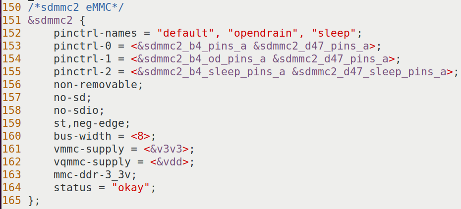
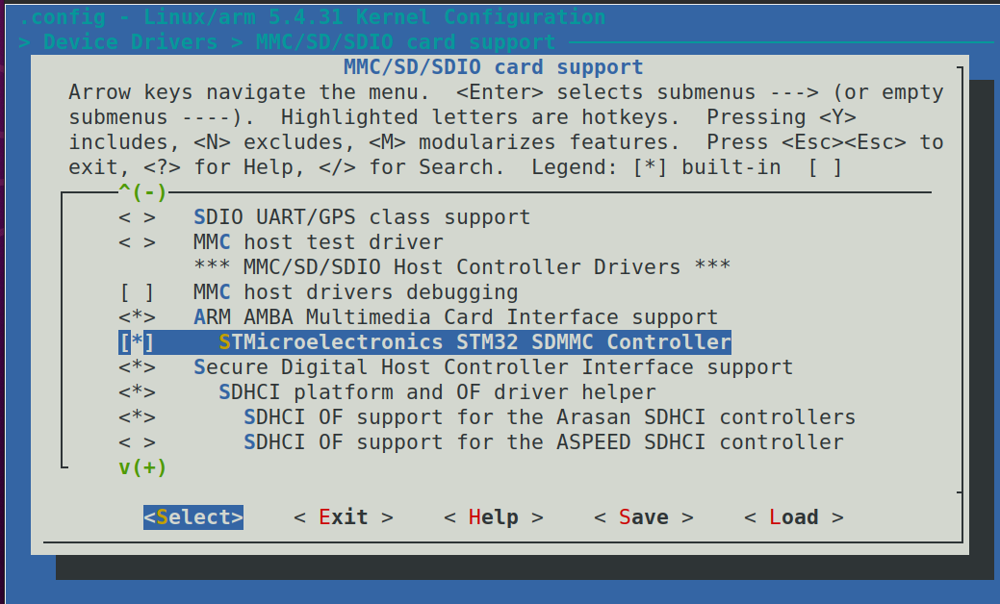

# 实验二十一 移植 eMMC 驱动——给内核装上"看见板载硬盘"的眼睛

> **对应课件**：《第5章 移植Linux内核》5.4 节步骤 5（Slide 47~51）
>
> **系列说明**：本系列基于华清远见 FS-MP1A（STM32MP157A）开发板，对应课件《第5章 移植Linux内核》。实验二十编出的内核是"零修改"的——它看不见 eMMC，点火会停在 `Waiting for root device`。本篇补上第一块短板：**eMMC 驱动**。好消息是内核代码里 eMMC 驱动早就有了（第 3 章实验十给 U-Boot 开 eMMC 时是一个道理），缺的只是两样：**设备树里的 sdmmc2 节点**和**配置里的 STM32 SDMMC 控制器**——照着课件改两处、重编译一次就通。前置：实验二十（内核与 dtb 已编出）。

## 一、先想明白：内核"看见"一块存储需要哪两样

第 3 章给 U-Boot 开 eMMC（F-6）时你已经见过这套组合拳的 U-Boot 版，内核版一模一样的道理：

| 缺什么 | 后果 | 怎么补 |
|---|---|---|
| 设备树里没有 sdmmc2 节点 | 内核不知道"eMMC 挂在 sdmmc2 总线上、8 位数据线、不可热拔" | 往 `stm32mp15xx-fsmp1x.dtsi` 加一段节点（本篇步骤 1） |
| `.config` 里没勾控制器驱动 | 总线描述了也没人接管（驱动代码在内核里躺着，没被编译） | menuconfig 勾 `STMicroelectronics STM32 SDMMC Controller`（本篇步骤 2） |

所以本篇的改动是**一小段设备树 + 一个勾**，然后重编译。这也是内核移植的标准节奏：**改设备树 → 改配置 → 重编 → 看日志**，后面实验二十二换网卡还是这个循环。

## 二、实验环境（实际）

| 项目 | 实际值 |
|---|---|
| 操作位置 | Ubuntu 虚拟机 `~/kernel/linux-5.4.31/`（源码目录）+ `make menuconfig` 图形界面 |
| 上篇产物 | `arch/arm/boot/uImage`、`arch/arm/boot/dts/stm32mp157a-fsmp1a.dtb`（实验二十） |
| 板子 | 本篇不开（编译在虚拟机）；点火验证在实验二十三统一做 |

> **开工自检（10 秒）**：`git status` 干净（上篇改完已提交）；`ls arch/arm/boot/dts/stm32mp15xx-fsmp1x.dtsi` 在（实验二十步骤 3 放的）。在才开工。

## 三、课件 ↔ 步骤对应表

| 课件 Slide | 内容 | 对应步骤 |
|---|---|---|
| 47 | 移植思路：内核有 eMMC 驱动代码，只差设备树与配置 | 开篇 |
| 48 | dtsi 里添加 sdmmc2 节点（第 150~165 行） | 步骤 1 |
| 49~50 | menuconfig 路径 Device Drivers → MMC/SD/SDIO → 勾 STM32 SDMMC Controller | 步骤 2 |
| 51 | `make -j4 uImage dtbs LOADADDR=0xC2000040` 重编译 | 步骤 3 |

### 本篇动作 → 后面谁用 → 现在含糊的后果

| 本篇动作 | 后面哪一篇要用 | 现在含糊的后果 |
|---|---|---|
| `stm32mp15xx-fsmp1x.dtsi` 里新增的 `&sdmmc2` 节点 | 实验二十三：内核认出 `mmcblk2`（与我们 U-Boot 侧 `mmc dev 1` 是同一颗芯片）；第 6 章 NFS/根文件系统也基于"盘已被认出" | 设备树节点位置/拼写错，`mmcblk2` 不出现，后面全卡 |
| menuconfig 勾选 `STMicroelectronics STM32 SDMMC Controller` | 实验二十二还会再开一次 menuconfig（勾网卡 PHY）——操作手法相同 | 勾了忘保存（`<Exit>` 前要选 Save）或直接改 `.config`，白忙 |
| `make -j4 uImage dtbs LOADADDR=0xC2000040` 一条重编 | 实验二十二用同一条命令重编（改的文件不同而已） | 漏 `dtbs` 只重编了内核，dtb 还是旧的，现象对不上还以为没生效 |

本篇不需要新资料——所有代码都在课件 Slide 48 里，照抄进设备树即可。

## 四、实验步骤

### 步骤 1：设备树加 sdmmc2 节点（Slide 47~48）

打开 `arch/arm/boot/dts/stm32mp15xx-fsmp1x.dtsi`，找到已有的 `&sdmmc1` 节点（SD 卡那张，第 3 章 F-2 在 U-Boot 里动过的同类节点），**在它后面**添加课件给出的整段：

```c
/*sdmmc2 eMMC*/
&sdmmc2 {
    pinctrl-names = "default", "opendrain", "sleep";
    pinctrl-0 = <&sdmmc2_b4_pins_a &sdmmc2_d47_pins_a>;
    pinctrl-1 = <&sdmmc2_b4_od_pins_a &sdmmc2_d47_pins_a>;
    pinctrl-2 = <&sdmmc2_b4_sleep_pins_a &sdmmc2_d47_sleep_pins_a>;
    non-removable;
    no-sd;
    no-sdio;
    st,neg-edge;
    bus-width = <8>;
    vmmc-supply = <&v3v3>;
    vqmmc-supply = <&vdd>;
    mmc-ddr-3_3v;
    status = "okay";
};
```


> 图：课件 Slide 48——`stm32mp15xx-fsmp1x.dtsi` 第 150~165 行的新增内容截图，与我们上面抄的完全一致。

**这一段不用背，但每个属性值得认识一遍**（与实验十四、F-2/F-6 的 U-Boot 经历逐条对上）：

| 属性 | 意思 | 对应我们已有的经验 |
|---|---|---|
| `pinctrl-0/1/2` | 三种状态下的引脚复用（默认/开漏/睡眠），`b4` = 4 根数据线基础组、`d47` = DATA4~7 扩展组 | F 系列改 U-Boot 设备树时见的 pinctrl 同一套写法 |
| `non-removable` | eMMC 焊死在板上，**不存在"拔出"**——不声明它内核会去等插拔信号 | 实验十四：eMMC 永远在线，SD 卡才有 CD 引脚 |
| `no-sd` / `no-sdio` | 明确告诉驱动"这条总线上不是 SD 卡也不是 SDIO 设备" | F-6 给 U-Boot 开 eMMC 时同样写法 |
| `bus-width = <8>` | **8 位数据线全用上** | 实验十四 `mmc info` 实测 `Bus Width: 8-bit` 的源头就是这里 |
| `vmmc-supply = <&v3v3>` / `vqmmc-supply = <&vdd>` | 存储芯片的两组供电接在哪路电源上 | F-1 修的就是这些电源节点（`v3v3`/`vdd` 都在 F-1 固定的电源树里） |
| `mmc-ddr-3_3v` | 支持 3.3V 双倍速率模式 | 实验十四 `Bus Speed: 52000000 / MMC High Speed` 的提速来源之一 |
| `status = "okay"` | 启用这个节点 | 每个节点的开关阀 |

改完 `git diff` 过一眼：应只有这一段新增。

### 步骤 2：menuconfig 勾上 STM32 SDMMC 控制器（Slide 49~50）

```bash
make menuconfig
```

按这个路径走（课件 Slide 49 给的就是这条面包屑）：

```
Device Drivers --->
    <*> MMC/SD/SDIO card support --->
        [*] STMicroelectronics STM32 SDMMC Controller
```


> 图：课件 Slide 49——menuconfig 修改路径：`Device Drivers ---> <*> MMC/SD/SDIO card support --->`，选中 `[*] STMicroelectronics STM32 SDMMC Controller`。


> 图：课件 Slide 50——MMC/SD/SDIO 菜单实拍：`<*> ARM AMBA Multimedia Card Interface support`、高亮的 `[*] STMicroelectronics STM32 SDMMC Controller`、`<*> Secure Digital Host Controller Interface support` 等。**把高亮行按空格/Y 变成 `[*]`**，然后一路 `<Exit>` 退出，退出时选 `<Save>` 保存——不保存等于白勾。

顺手验证：`grep SDMMC .config` 应出现 `CONFIG_MMC_STM32_SDMMC=y` 一类字样。

### 步骤 3：重编译（Slide 51）

```bash
make -j4 uImage dtbs LOADADDR=0xC2000040
```

一条命令同时重编**内核**与**设备树**（我们改了 dtsi，dtb 必须重出）。因为只改了设备树和一个配置项，这次是增量编译，几分钟完事。验证：

```bash
ls -l arch/arm/boot/uImage arch/arm/boot/dts/stm32mp157a-fsmp1a.dtb
# 两者的修改时间应是刚才；字节数与实验二十那份不同（配置变了）
```

> **验收预告（本篇不点火）**：实验二十三用这对新文件点火后，内核日志里应出现 `mmcblk2: mmc2:0001 004GA0 ...`——eMMC 被认出来的标志；而实验十六那次（出厂内核）也有这一行，可以前后对照。

## 五、注意事项

1. **`&sdmmc2` 节点加的位置在 `&sdmmc1` 之后**：dtsi 是顺序文本，加错位置不影响编译但影响可读性；`git diff` 一眼能看出插哪了。
2. **属性值里的 `< >` 是设备树语法**（整数用尖括号包住），不是手误；字符串才用引号（如 `pinctrl-names = "default"...`）。
3. **menuconfig 退出时必须选 Save**，否则 `.config` 未变；用 `grep SDMMC .config` 复核（`CONFIG_MMC_STM32_SDMMC=y`）。
4. **别动 `.config` 文件本身**（实验十八说过）：menuconfig 是唯一正规入口。
5. 重编译命令**必须带 `LOADADDR=0xC2000040`**：只写 `make uImage dtbs` 时 uImage 的加载地址字段不对，点火会失败且难查。

## 六、怎么验证

1. `grep -A 16 "sdmmc2 eMMC" arch/arm/boot/dts/stm32mp15xx-fsmp1x.dtsi` 能看到我们加的整段；
2. `grep SDMMC .config` 出现 `CONFIG_MMC_STM32_SDMMC=y`；
3. 重编译后 `arch/arm/boot/uImage` 与 `stm32mp157a-fsmp1a.dtb` 修改时间均为刚刚，字节数已记录；
4. （加强）`scripts/kconfig/merge_config.sh` 不需要；但可以 `git diff --stat` 确认改动只有 dtsi + .config 两个文件。

不达标时的排查：

| 现象 | 先查什么 |
|---|---|
| menuconfig 里找不到 STM32 SDMMC 那一项 | 搜索大法：menuconfig 里按 `/` 键输入 `STM32 SDMMC`，它会告诉你它藏在哪条路径下、依赖什么选项 |
| 重编后 dtb 字节数没变 | `make dtbs` 漏了或 dtsi 改动没保存；`ls -l` 看修改时间 |
| 点火后仍无 `mmcblk2` | （实验二十三才验收；先把三处改动自查一遍：节点拼写、`=y`、重编了 dtb） |

## 七、实验完成标志

- `stm32mp15xx-fsmp1x.dtsi` 已加入 `&sdmmc2` 节点整段（步骤 1，待实测）
- menuconfig 已勾 `STMicroelectronics STM32 SDMMC Controller`，`.config` 里 `CONFIG_MMC_STM32_SDMMC=y`（步骤 2，待实测）
- `make -j4 uImage dtbs LOADADDR=0xC2000040` 重编译成功，两个产物时间戳与字节数已记录（步骤 3，待实测）

## 八、下一步：移植网卡驱动

eMMC 这只眼睛装好了。下一篇（实验二十二）装第二只：**MAE0621A 网卡驱动**——这次连驱动代码都要自己放（资料包 `kernel-网卡驱动.zip` 里的 `maxio.c`/`phy_device.c`），Makefile、Kconfig、menuconfig、设备树四处齐动，是第 5 章改动最多的一篇。
