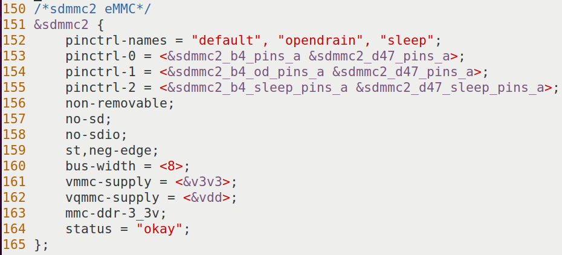
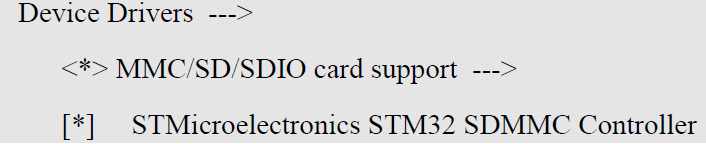
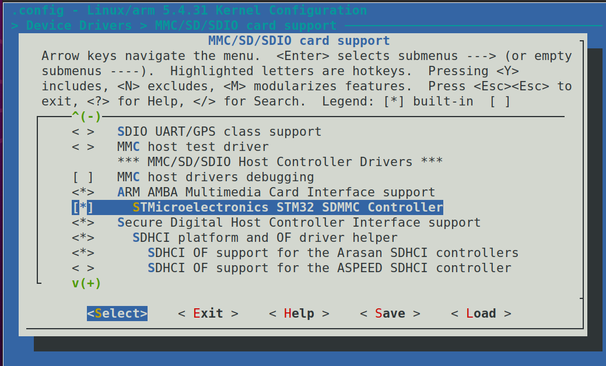

# 实验二十一 移植 eMMC 驱动——让内核"看见"板载硬盘

> **对应课件**：《第5章 移植Linux内核》5.4 节步骤 5（Slide 47~51）
>
> **系列说明**：本系列基于华清远见 FS-MP1A（STM32MP157A）开发板，对应课件《第5章 移植Linux内核》。实验二十编出的"零修改"内核看不见 eMMC，点火会卡在找根文件系统。本篇补上这块短板。好消息是：源码层面查过（实验二十步骤 6），**内核里 SDMMC 控制器驱动早就编进去了**（那个配置选项默认就是开的），实验二十的"看不见"缺的只是**设备树里的 sdmmc2 节点**——所以本篇真正的改动只有"一小段设备树"，menuconfig 那一步是开进去**确认**而不是修改。前置：实验二十（内核与 dtb 已编出）。

## 一、先想明白：内核"看见"一块存储需要哪两样

第 3 章给 U-Boot 开 eMMC（F-6）时你已经见过这套组合拳的 U-Boot 版，内核版一模一样的道理——但有一个查清了的事实差别：

| 需要什么 | 我们的现状 | 本篇做什么 |
|---|---|---|
| 驱动代码被编进内核 | **已经在**：`CONFIG_MMC_STM32_SDMMC` 依赖 ARM AMBA MMC 且 `default y`，实验十九的 `.config` 里天生就是 `=y` | 开 menuconfig **确认一眼**（步骤 2） |
| 设备树声明这条总线 | **缺**：SoC 级 `stm32mp151.dtsi` 里 `&sdmmc2` 默认 `status = "disabled"`，老师的 `fsmp1x.dtsi` 又没写板级节点 | 往 `fsmp1x.dtsi` 加一段节点（步骤 1，主角） |

设备树不描述，驱动再全也是"有兵无将令"——这就是实验二十步骤 6 说的"一出一入"：SD 卡（sdmmc1 节点齐全）认得出、eMMC（sdmmc2 无节点）认不出。本篇把第二样补齐，重编译一次就通。

这也是内核移植的标准节奏：**改设备树 → 核对配置 → 重编 → 看日志**，后面实验二十二换网卡还是这个循环。

## 二、实验环境（实际）

| 项目 | 实际值 |
|---|---|
| 操作位置 | Ubuntu 虚拟机，实验二十那棵源码树 + `make menuconfig` 图形界面 |
| 上篇产物 | `arch/arm/boot/uImage`、`arch/arm/boot/dts/stm32mp157a-fsmp1a.dtb`（实验二十） |
| 板子 | 本篇不开（编译在虚拟机）；点火验证在实验二十三统一做 |

> **开工自检（10 秒）**：`ls arch/arm/boot/dts/stm32mp15xx-fsmp1x.dtsi` 在（实验二十步骤 3 放的）；`grep MMC_STM32 .config` 应已打出 `CONFIG_MMC_STM32_SDMMC=y`（即上一节说的"天生已开"——如果这条现在就有输出，本篇步骤 2 就只是走个过场）。

## 三、课件 ↔ 步骤对应表

| 课件 Slide | 内容 | 对应步骤 |
|---|---|---|
| 47 | 移植思路：内核已有 eMMC 驱动代码，此处只需要修改设备树 | 开篇（与源码核查一致） |
| 48 | dtsi 里原有 sdmmc1 后面添加 sdmmc2 节点（第 150~165 行） | 步骤 1 |
| 49~50 | menuconfig 路径 Device Drivers → MMC/SD/SDIO → STM32 SDMMC Controller | 步骤 2（确认） |
| 51 | `make -j4 uImage dtbs LOADADDR=0xC2000040` 重编译 | 步骤 3 |

### 本篇动作 → 后面谁用 → 现在含糊的后果

| 本篇动作 | 后面哪一篇要用 | 现在含糊的后果 |
|---|---|---|
| `fsmp1x.dtsi` 里新增的 `&sdmmc2` 节点 | 实验二十三点火后内核认出 eMMC（就是 U-Boot 里 `mmc dev 1` 那颗 004GA0）；第 6 章借它挂根、第 7 章起一切板级开发都以"盘被认出"为前提 | 节点位置/拼写错，eMMC 不出现，实验二十三连根都借不了 |
| menuconfig 确认 `CONFIG_MMC_STM32_SDMMC=y` | 实验二十二再开一次 menuconfig（勾网卡 PHY）——手法相同 | 万一是 `[ ]` 没发现，实验二十三白点火一次 |
| `make -j4 uImage dtbs LOADADDR=0xC2000040` 一条重编 | 实验二十二用同一条命令重编（改的文件不同而已） | 漏 `dtbs` 只重编了内核，dtb 还是旧的，现象对不上还以为没生效 |

本篇不需要新资料——所有内容都在课件 Slide 48 与本篇正文里，照抄进设备树即可。

## 四、实验步骤

### 步骤 1：设备树加 sdmmc2 节点（Slide 47~48）

打开 `arch/arm/boot/dts/stm32mp15xx-fsmp1x.dtsi`，找到已有的 `&sdmmc1` 节点（带 `/*sdmmc1 TF 卡*/` 注释，约第 136~148 行——就是实验二十彩蛋②里那个 `cd-gpios` 用 `gpioh 3` 的节点），**在它后面、`&sram` 节点之前**插入课件给出的整段：

```c
/*sdmmc2 eMMC*/
&sdmmc2 {
    pinctrl-names = "default", "opendrain", "sleep";
    pinctrl-0 = <&sdmmc2_b4_pins_a &sdmmc2_d47_pins_a>;
    pinctrl-1 = <&sdmmc2_b4_od_pins_a &sdmmc2_d47_pins_a>;
    pinctrl-2 = <&sdmmc2_b4_sleep_pins_a &sdmmc2_d47_sleep_pins_a>;
    non-removable;
    no-sd;
    no-sdio;
    st,neg-edge;
    bus-width = <8>;
    vmmc-supply = <&v3v3>;
    vqmmc-supply = <&vdd>;
    mmc-ddr-3_3v;
    status = "okay";
};
```


> 图：课件 Slide 48——`stm32mp15xx-fsmp1x.dtsi` 第 150~165 行的新增内容截图（课件作者文件里的行号；我们的文件按步骤 3 落点插好即可），与我们上面抄的完全一致。

**这一段不用背，但每个属性值得认识一遍**（与实验十四、F-1/F-2/F-6 的 U-Boot 经历逐条对上）：

| 属性 | 意思 | 对应我们已有的经验 |
|---|---|---|
| `pinctrl-0/1/2` | 三种状态下的引脚复用（默认/开漏/睡眠）；`b4` = DATA0~3 基础组、`d47` = DATA4~7 扩展组（8 位线要两组一起上） | F 系列改 U-Boot 设备树时见的 pinctrl 同一套写法；引用的五个 pin 组都定义在 SoC 级 `stm32mp15-pinctrl.dtsi` 里（0020 补丁带来的），不用我们写 |
| `non-removable` | eMMC 焊死在板上，**不存在"拔出"**——不声明它内核会去等插拔信号 | 实验十四：eMMC 永远在线，SD 卡才有 CD 引脚 |
| `no-sd` / `no-sdio` | 明确告诉驱动"这条总线上不是 SD 卡也不是 SDIO 设备" | F-6 给 U-Boot 开 eMMC 时同样写法（U-Boot 版节点还多一个 `u-boot,dm-spl`，那是 U-Boot SPL 阶段专用的属性，内核版不需要——**同一条总线、两个 bootloader 各自描述，同名文件别改混**） |
| `st,neg-edge` | 时钟下降沿采样（ST 控制器的时序特性） | U-Boot 版节点同款 |
| `bus-width = <8>` | **8 位数据线全用上** | 实验十四 `mmc info` 实测 `Bus Width: 8-bit` 的源头就是这里 |
| `vmmc-supply = <&v3v3>` / `vqmmc-supply = <&vdd>` | 存储芯片的两组供电接在哪路电源上 | `v3v3`、`vdd` **本文件第 61~77 行已经定义**（实验二十彩蛋①的两路 3.3V 固定电源，不用我们加）；第 3 章 F-1 在 U-Boot 侧也加过同名固定电源——两边各管各的，这次内核侧现成 |
| `mmc-ddr-3_3v` | 支持 3.3V 双倍速率模式 | 实验十六内核日志里 eMMC 的 DDR 高速档与此有关 |
| `status = "okay"` | 启用这个节点（把 SoC dtsi 里默认的 disabled 翻过来） | 每个节点的开关阀 |

改完 `git diff` 过一眼：应只有这一段新增。

### 步骤 2：menuconfig 确认 STM32 SDMMC 控制器（Slide 49~50）

```bash
make menuconfig
```

按课件路径走一遍（先 `grep MMC_STM32 .config` 的话多半已经看到 `=y`，开进去只是眼见为实）：

```
Device Drivers --->
    <*> MMC/SD/SDIO card support --->
        [*] STMicroelectronics STM32 SDMMC Controller
```


> 图：课件 Slide 49——menuconfig 修改路径：`Device Drivers ---> <*> MMC/SD/SDIO card support --->`，选中 `[*] STMicroelectronics STM32 SDMMC Controller`。


> 图：课件 Slide 50——MMC/SD/SDIO 菜单实拍：`<*> ARM AMBA Multimedia Card Interface support`、高亮的 `[*] STMicroelectronics STM32 SDMMC Controller`、`<*> Secure Digital Host Controller Interface support` 等。**预期它已经是 `[*]`**（`default y` 机制——实验二十步骤 6 讲过）；万一显示 `[ ]`（比如换过别的 defconfig），按空格/Y 勾上，一路 `<Exit>` 退出并在提示时选 `<Save>`。

**就地验证**：

```bash
grep MMC_STM32 .config      # 应打出 CONFIG_MMC_STM32_SDMMC=y
```

> **注意搜的符号是 `MMC_STM32_SDMMC`**——名字是"MMC 下的 STM32 SDMMC"，不是 `SDMMC_STM32`，搜错关键词会误判成"没勾"。

### 步骤 3：重编译（Slide 51）

```bash
make -j4 uImage dtbs LOADADDR=0xC2000040
```

一条命令同时重编**内核**与**设备树**（我们改了 dtsi，dtb 必须重出；`.config` 有变动，内核也要重出一小部分）。因为只改了设备树和一个配置项，这次是增量编译，几分钟完事（4GB 内存虚拟机 OOM 就换 `-j2`，实验二十注意事项 1 同款）。验证：

```bash
ls -l arch/arm/boot/uImage arch/arm/boot/dts/stm32mp157a-fsmp1a.dtb
# 两者的修改时间应是刚才；uImage 字节数与实验二十那份不同（配置生效、代码量变了），记下新数
```

> **验收预告（本篇不点火，实验二十三验收）**：用这对新文件点火后，内核日志里应出现 eMMC 的报到行——`mmcX: new ... MMC card at address 0001` 与 `mmcblkY: mmcX:0001 004GA0 3.69 GiB`。**Y 的编号以日志实录为准**：我们的设备树没写 mmc 别名，Linux 按探测顺序给盘编号，实验十六出厂 dtb 下的 `mmcblk2` 只是参照、不必照搬；认盘认"3.69 GiB + p1~p5 分区"，别认死编号。实验二十步骤 6 说的"认不出 eMMC"，到这一步就该翻面了。

## 五、注意事项

1. **`&sdmmc2` 节点加在 `&sdmmc1` 之后**：dtsi 是顺序文本，加错位置不影响编译但影响可读性；`git diff` 一眼能看出插哪了。
2. **属性值里的 `< >` 是设备树语法**（整数用尖括号包住），不是手误；字符串才用引号（如 `pinctrl-names = "default"...`）。
3. **menuconfig 这步是确认**：`default y` 让它天生就是 `[*]`；只有看到 `[ ]` 才需要动手勾+Save。判据永远以 `grep MMC_STM32 .config` 为准。
4. **别动 `.config` 文件本身**（实验十八说过）：menuconfig 是唯一正规入口。
5. **重编译命令必须带 `LOADADDR=0xC2000040`**：只写 `make uImage dtbs` 时 uImage 的加载地址字段不对，点火会失败且难查（实验二十注意事项 2 同款）。
6. **同名文件两个世界**：U-Boot 那棵树的 `stm32mp15xx-fsmp1x.dtsi`（F-6 改过）与内核这棵的是两份文件——确认你 nano 打开的是 `linux-5.4.31/arch/arm/boot/dts/` 下的这份。

## 六、验证点一览

| 验证点 | 命令 | 通过的样子 | 在哪一步敲 |
|---|---|---|---|
| 节点已插入 | `grep -A 16 "sdmmc2 eMMC" arch/arm/boot/dts/stm32mp15xx-fsmp1x.dtsi` | 打出我们加的整段 | 步骤 1 |
| 节点位置正确 | `git diff arch/arm/boot/dts/stm32mp15xx-fsmp1x.dtsi` | 只有一段新增，位于 `&sdmmc1` 之后 | 步骤 1 |
| 控制器配置就位 | `grep MMC_STM32 .config` | `CONFIG_MMC_STM32_SDMMC=y` | 步骤 2 |
| 重编完成 | `ls -l arch/arm/boot/uImage arch/arm/boot/dts/stm32mp157a-fsmp1a.dtb` | 两个产物时间戳都是刚刚；新 uImage 字节数已记 | 步骤 3 |
| 改动范围清白 | `git status --short` | 预期项 = fsmp1x.dtsi（+`.config` 类忽略件），无意外文件 | 收尾 |

不达标时的排查：

| 现象 | 先查什么 |
|---|---|
| menuconfig 里找不到 STM32 SDMMC 那一项 | 搜索大法：menuconfig 里按 `/` 键输入 `SDMMC`，它会告诉你它藏在哪条路径下、依赖什么选项（依赖的是 ARM AMBA MMC，本身得是 `[*]`） |
| `grep MMC_STM32 .config` 没输出 | `.config` 不在当前目录（要在内核顶层敲）；或 menuconfig 改了没保存 |
| 重编后 dtb 字节数没变 | `make dtbs` 漏了或 dtsi 改动没保存；`ls -l` 看修改时间 |
| 重编后 uImage 字节数与实验二十完全一样 | `.config` 没变（SDMMC 本来就是 y 的话字节数可能真的不变——**这不算错**，本篇对 uImage 的实质影响可能只有设备树部分） |
| 点火后仍无 eMMC | （实验二十三验收；先把三处自查一遍：节点拼写、`=y`、dtb 重编了） |

## 七、实验完成标志

- `stm32mp15xx-fsmp1x.dtsi` 已在 `&sdmmc1` 之后加入 `&sdmmc2` 节点整段，`git diff` 只显示这一段（步骤 1）
- menuconfig 走过课件路径，`.config` 里 `CONFIG_MMC_STM32_SDMMC=y`（步骤 2）
- `make -j4 uImage dtbs LOADADDR=0xC2000040` 重编译成功，两个产物时间戳已更新、新 uImage 字节数已记（步骤 3）

## 八、下一步：移植网卡驱动

eMMC 这只眼睛装好了。下一篇（实验二十二）装第二只：**MAE0621A 网卡驱动**——这次连驱动代码都要自己放（资料包 `kernel-网卡驱动.zip` 里的 `maxio.c`/`phy_device.c`，后者还要**覆盖**内核同名文件），Makefile、Kconfig、menuconfig、设备树四处齐动，是第 5 章改动最多的一篇。
