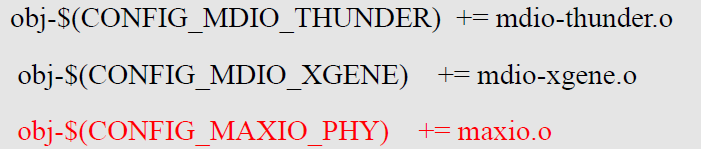
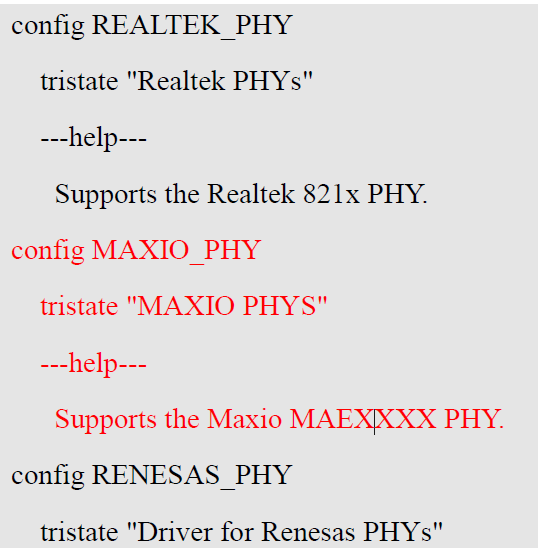

# 实验二十二 移植网卡驱动——四处齐动，把 MAE0621A 装进内核

> **对应课件**：《第5章 移植Linux内核》5.4 节步骤 6（Slide 52~56）
>
> **系列说明**：本系列基于华清远见 FS-MP1A（STM32MP157A）开发板，对应课件《第5章 移植Linux内核》。为什么第 5 章要专门移植网卡？因为**后面的开发、调试全靠网络挂载根文件系统**（改一次文件不用烧盘），网线就是生命线。eMMC 那篇（实验二十一）内核代码里驱动现成、只改两处；本篇不一样——**驱动代码也要自己放**（资料包里的 `maxio.c`/`phy_device.c`），加上 Makefile、Kconfig、menuconfig、设备树，**四处齐动**，是第 5 章改动最多的一篇，也是最像"真实工作"的一篇。前置：实验二十一（eMMC 驱动已通，重编译流程已熟）。

## 一、改动全景：四个文件，各管一件事

| # | 改哪里 | 干什么 | 性质 |
|---|---|---|---|
| 1 | `drivers/net/phy/` 目录 | 放入 `maxio.c`、`phy_device.c` 两个驱动源文件 | 加代码 |
| 2 | `drivers/net/phy/Makefile` | 加一行编译项，让 `.c` 被编译成 `.o` | 构建入口 |
| 3 | `drivers/net/phy/Kconfig` | 加一个配置项，让 menuconfig 里**出现**它的开关 | 配置入口 |
| 4 | `arch/arm/boot/dts/stm32mp15xx-fsmp1x.dtsi` | 加 `&ethernet0` 节点，告诉内核网卡接在哪 | 硬件描述 |

四者的关系：**没有 1，2 无米下锅；没有 2，1 编不进；没有 3，menuconfig 里找不到开关（也就打不开 4 的开关）；没有 4，驱动编进去了也不知道网卡在哪根总线上**。少一处就白跑一次编译。

> **先弄清驱动角色**：我们板子的以太网是"MAC + PHY"两级结构——MAC 控制器（`ethernet0`，ST 芯片内置，内核自带 `stmmac` 驱动，设备树里声明即可）+ **PHY 芯片 MAE0621A**（板子上一颗独立小芯片，需要专门驱动）。第 3 章 F-5 给 **U-Boot** 换过它的驱动（`u-boot-网卡-MAE0621A驱动.rar`），本篇换的是**内核版**驱动——课件 Slide 52 特别提醒："注意不是用于 u-boot 的驱动"，两套代码、两个世界，别拿错包。

## 二、实验环境（实际）

| 项目 | 实际值 |
|---|---|
| 操作位置 | Ubuntu 虚拟机 `~/kernel/linux-5.4.31/` |
| 素材 | `kernel-网卡驱动.zip`（18,708 字节，md5 `d75517d6942d13263c1d9a165aff043b`）——里面 `MAE0621A驱动/` 目录下就两个文件：`maxio.c`（6,654 字节）、`phy_device.c`（64,547 字节） |
| 板子 | 本篇不开 |

> **开工自检（10 秒）**：`git status` 干净（实验二十一的改动已提交）；`ls drivers/net/phy/` 目录在（几十个 `.c` 文件，`Makefile`/`Kconfig` 在列）。

## 三、课件 ↔ 步骤对应表

| 课件 Slide | 内容 | 对应步骤 |
|---|---|---|
| 52 | 为什么移植网卡；从出厂源码包取 MAE0621A 的 phy_device.c/maxio.c 放入 drivers/net/phy | 步骤 1 |
| 53 | phy/Makefile 加 `obj-$(CONFIG_MAXIO_PHY) += maxio.o` | 步骤 2 |
| 54 | phy/Kconfig 加 `config MAXIO_PHY` 配置项 | 步骤 3 |
| 55 | menuconfig：Device Drivers → Network device support → PHY → 勾 `<*> MAXIO PHYS` | 步骤 4 |
| 56 | dtsi 末尾加 `&ethernet0` 节点 + 重编译 `make -j4 uImage dtbs LOADADDR=0xC2000040` | 步骤 5~6 |

### 本篇动作 → 后面谁用 → 现在含糊的后果

| 本篇动作 | 后面哪一篇要用 | 现在含糊的后果 |
|---|---|---|
| 内核里装好 MAE0621A + ethernet0 节点 | 实验二十三点火后内核日志应出现网卡探测；第 6 章用 NFS 挂根文件系统时**全靠这块网卡** | 网卡没通，第 6 章的 NFS 根起不来，整个"网络调试"玩法作废 |
| Makefile/Kconfig/menuconfig 三件套的改法 | 第 9 章起写自己的驱动时**一模一样的三件套**（加代码→Makefile→Kconfig→menuconfig） | 只会抄不会懂，第 9 章每加一个驱动都要现查 |
| "四处齐动"的完整性检查习惯 | 以后任何"内核不支持某硬件"的移植都这么拆解 | 漏一处就白编一次（20 分钟起步），还查不出原因 |

本篇需要的资料：`kernel-网卡驱动.zip`（见上表）。**注意与第 3 章 F-5 的 U-Boot 驱动包区分**：那是 `u-boot-网卡-MAE0621A驱动.rar`，文件名相近、内容不同、编译体系也不同。

## 四、实验步骤

### 步骤 1：放入驱动源文件（Slide 52）

把 `kernel-网卡驱动.zip` 解压（Windows 侧或 Ubuntu 里都行），把 `MAE0621A驱动/` 下的两个文件复制到内核源码：

```bash
cp maxio.c phy_device.c ~/kernel/linux-5.4.31/drivers/net/phy/
```

验证：`ls drivers/net/phy/maxio.c drivers/net/phy/phy_device.c` 都在。

> **`phy_device.c` 名字会撞车吗？** 内核自带 `drivers/net/phy/phy_device.c`——所以**覆盖前先想一秒**：课件原话就是"把 phy_device.c 和 maxio.c 文件复制到内核源码下的 drivers/net/phy/ 目录下"，这是华清老师改过的版本（适配 MAE0621A），**按课件覆盖即可**。稳妥起见先把内核自带的备份一份：`cp drivers/net/phy/phy_device.c /tmp/phy_device.c.orig`——万一后面启动异常，能 diff 出我们改了什么。

### 步骤 2：Makefile 加编译项（Slide 53）

打开 `drivers/net/phy/Makefile`，在与 `mdio-xgene.o` 相邻的位置加一行：

```makefile
obj-$(CONFIG_MAXIO_PHY) += maxio.o
```


> 图：课件 Slide 53——`drivers/net/phy/Makefile` 片段：原有 `obj-$(CONFIG_MDIO_THUNDER) += mdio-thunder.o`、`obj-$(CONFIG_MDIO_XGENE) += mdio-xgene.o`，标红新增 `obj-$(CONFIG_MAXIO_PHY) += maxio.o`。

这行的意思：如果 `.config` 里 `CONFIG_MAXIO_PHY=y`，就把 `maxio.c` 编进内核（`=m` 则编成模块）。**`CONFIG_MAXIO_PHY` 这个名字是我们下一步在 Kconfig 里自己定义的**——Makefile 与 Kconfig 靠这个名字对上号，拼错一个字母就断链。

### 步骤 3：Kconfig 加配置项（Slide 54）

打开 `drivers/net/phy/Kconfig`，在与 `RENESAS_PHY` 相邻的位置加：

```kconfig
config MAXIO_PHY
	tristate "MAXIO PHYS"
	---help---
	  Supports the Maxio MAEXXXX PHY.
```


> 图：课件 Slide 54——`drivers/net/phy/Kconfig` 片段：原有 `config REALTEK_PHY`/`config RENESAS_PHY` 两组，标红新增 `config MAXIO_PHY`、`tristate "MAXIO PHYS"` 与一行 help。**`tristate` = 三态开关**（编进内核/编成模块/不使用，对应实验十八讲的 `=y`/`=m`/`is not set`）；`config` 后面的 `MAXIO_PHY` 就是步骤 2 Makefile 引用的那个名字。

### 步骤 4：menuconfig 勾选（Slide 55）

```bash
make menuconfig
```

路径：

```
Device Drivers --->
    [*] Network device support --->
        -*- PHY Device support and infrastructure --->
            <*> MAXIO PHYS        ← 新出现的项，勾成 <*>（编进内核）
```


> 图：课件 Slide 55——PHY 设备菜单实拍：`<*> Realtek PHYs`（已选）、**标红新增的 `<*> MAXIO PHYS`（已选）**、`< > Driver for Renesas PHYs`（未选）。退出时选 `<Save>`。

顺手验证：`grep MAXIO .config` 应有 `CONFIG_MAXIO_PHY=y`。

### 步骤 5：设备树加 ethernet0 节点（Slide 56）

打开 `arch/arm/boot/dts/stm32mp15xx-fsmp1x.dtsi`（实验二十一改过的同一个文件），**在文件末尾**添加：

```c
/*网卡*/
&ethernet0 {
    status = "okay";
    pinctrl-0 = <&ethernet0_rgmii_pins_a>;
    pinctrl-1 = <&ethernet0_rgmii_pins_sleep_a>;
    pinctrl-names = "default", "sleep";
    phy-mode = "rgmii-id";
    max-speed = <1000>;
    phy-handle = <&phy0>;

    mdio0 {
        #address-cells = <1>;
        #size-cells = <0>;
        compatible = "snps,dwmac-mdio";
        phy0: ethernet-phy@0 {
            reg = <0>;
        };
    };
};
```


> 图：课件 Slide 56——`stm32mp15xx-fsmp1x.dtsi` 文件末尾（第 194~212 行）的新增内容截图，与我们抄的一致。

逐行读关键属性（对照实验十六内核日志里 `stm32-dwmac 5800a000.ethernet` 那一串）：

| 属性 | 意思 |
|---|---|
| `phy-mode = "rgmii-id"` | MAC 与 PHY 之间用 RGMII 接口（千兆标准接法，引脚时钟在数据线内嵌） |
| `max-speed = <1000>` | 最高千兆（实际跑多快由 PHY 协商决定，实验十三见过自协商） |
| `phy-handle = <&phy0>` + `mdio0` 里的 `ethernet-phy@0 { reg = <0>; }` | MAC 通过 MDIO 总线找 PHY，PHY 地址 0——**F-5 在 U-Boot 里提过这个地址概念**；`ethernet0_rgmii_pins_*` 是引脚组（pinctrl 体系，实验二十一刚见过） |

### 步骤 6：重编译（Slide 56 末）

```bash
make -j4 uImage dtbs LOADADDR=0xC2000040
```

增量编译，几分钟。验证：两个产物时间戳更新；`git diff --stat` 显示本篇改动 = 两个驱动文件（新增）+ phy/Makefile + phy/Kconfig + fsmp1x.dtsi + `.config`。

> **验收预告（实验二十三）**：用这对新文件点火，内核日志应出现 `stmmac` 探测网卡、PHY 枚举成功（MAE0621A 报上名来）——之后 `ping` 通 Ubuntu、NFS 挂根才有戏。

## 五、注意事项

1. **`phy_device.c` 会覆盖内核自带同名文件**——按课件做，但先备份原版（步骤 1 的 `.orig` 拷贝），留一条对照退路。
2. **Makefile 的 `CONFIG_MAXIO_PHY` 与 Kconfig 的 `config MAXIO_PHY` 必须一字不差**（含大小写），这是一对"暗号"。
3. **Kconfig 的缩进用 Tab**：`tristate`/`---help---` 行前的制表符是语法的一部分，用空格可能报 `Kconfig` 解析警告。
4. **menuconfig 退出选 Save**，`grep MAXIO .config` 复核 `=y`。
5. **dtsi 的 ethernet0 节点加在文件末尾**（课件指明"文件末尾"），别插进别的节点中间；`#address-cells`/`#size-cells` 两行是 mdio0 子总线的编址声明，照抄即可。
6. 重编译**必须带 LOADADDR**（实验二十一注意事项 5 同款）。

## 六、怎么验证

1. `ls drivers/net/phy/maxio.c drivers/net/phy/phy_device.c` 在位；
2. `grep -n "MAXIO" drivers/net/phy/Makefile drivers/net/phy/Kconfig` 两处都有；
3. `grep MAXIO .config` 是 `CONFIG_MAXIO_PHY=y`；
4. `grep -A 16 "网卡" arch/arm/boot/dts/stm32mp15xx-fsmp1x.dtsi` 能看到 ethernet0 节点；
5. 重编译后两个产物时间戳已更新；`git diff --stat` 改动清单符合预期（5 个文件 + .config）。

不达标时的排查：

| 现象 | 先查什么 |
|---|---|
| menuconfig 里找不到 MAXIO PHYS | Kconfig 的 `config MAXIO_PHY` 拼写、缩进是不是 Tab；文件保存没有 |
| 勾了但 `.config` 里是 `# CONFIG_MAXIO_PHY is not set` | 依赖不满足——menuconfig 里按 `/` 搜 `MAXIO`，看它说明里写的依赖项（通常需要先勾 `NETDEVICES` 与 `PHYLIB`，即步骤 4 的前两级菜单是 `[*]`/`-*-` 的原因） |
| 编译报 `maxio.c` 里的头文件/函数错误 | 源文件拿错包（拿成 U-Boot 版驱动了？）——核对 md5 与 zip 里的文件名 |
| 点火后网卡仍不通 | （实验二十三验收）先看内核日志有没有 `stmmac`/PHY 枚举行，再回本篇查设备树 |

## 七、实验完成标志

- `maxio.c`、`phy_device.c` 已放入 `drivers/net/phy/`（步骤 1，待实测）
- `drivers/net/phy/Makefile` 已加 `obj-$(CONFIG_MAXIO_PHY) += maxio.o`（步骤 2，待实测）
- `drivers/net/phy/Kconfig` 已加 `config MAXIO_PHY` 三行（步骤 3，待实测）
- menuconfig 已勾 `<*> MAXIO PHYS`，`.config` 里 `CONFIG_MAXIO_PHY=y`（步骤 4，待实测）
- `stm32mp15xx-fsmp1x.dtsi` 末尾已加 `&ethernet0` 节点（步骤 5，待实测）
- `make -j4 uImage dtbs LOADADDR=0xC2000040` 重编译成功（步骤 6，待实测）

## 八、下一步：运行内核

两块短板都补齐了：eMMC 认得出、网卡通了。下一篇（实验二十三，第 5 章收官）把实验二十的流程反过来走一遍——用**我们自己编的** uImage 与 dtb 点火：先复现"无根文件系统"的老结局，再用 `bootargs` 挂上出厂根文件系统（eMMC 4 号分区）**走进 Linux 命令行**——第 3 章以来"bootm 找不到内核"与"内核找不到根"两大悬案，至此全部了结。
