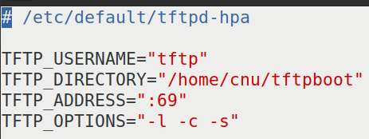

# 实验二十三 运行内核——自己编的内核第一次点火，并走进 Linux 命令行

> **对应课件**：《第5章 移植Linux内核》5.5 节（Slide 57~61）+ 5.6 节（Slide 62~65）
>
> **系列说明**：本系列基于华清远见 FS-MP1A（STM32MP157A）开发板，对应课件《第5章 移植Linux内核》。第 5 章的收官之战，也是全系列两次悬案的结案篇：把**我们自己编**的 `uImage` 与 `stm32mp157a-fsmp1a.dtb` 用 `tftp` 装进内存、`bootm` 点火——先复现"无根文件系统"的老结局，再设 `bootargs` 借**出厂根文件系统**（eMMC 4 号分区）走进 Linux 命令行。第 3 章以来"bootm 找不到内核"（实验十六解决）与"内核找不到根"（本篇解决）从此全部了结。前置：实验二十二（自己的内核 + dtb 已编出）、实验十六（点火三连与验证法）。

## 一、本篇的三段式路线图

| 段 | 干什么 | 预期结果 |
|---|---|---|
| 第一段 | 复验 TFTP 服务器（课件 5.5） | 实验十三已搭好，逐条核对即可 |
| 第二段 | 用**自己编的**内核 + dtb 点火（不设 bootargs） | 走到"找不到根"——但这次**两块盘都认得出**（eMMC 驱动已补） |
| 第三段 | 设 `bootargs` 借出厂根文件系统（eMMC 4 号分区） | **进入 Linux 命令行**——第 5 章大功告成 |

## 二、实验环境（实际）

| 项目 | 实际值 |
|---|---|
| 操作位置 | 串口 `STM32MP>`（板子侧）+ Ubuntu 侧各一小段 |
| 待点火文件 | 自己编的 `arch/arm/boot/uImage`、`arch/arm/boot/dts/stm32mp157a-fsmp1a.dtb`（实验二十一/二十二的重编译产物） |
| 服务器 | `/home/cnu/tftpboot` 已有出厂 `uImage`（7,546,640）+ `stm32mp157a-fsmp1a-mipi050.dtb`（71,805）（实验十三/十五放入） |
| 出厂根文件系统 | eMMC **4 号分区**（实验十四实测 `mmcblk2` 的 `p4 rootfs`，1.13 GiB）——华清出厂系统还躺在那里，本篇借它一用 |

> **开工自检（10 秒）**：倒计时 5 秒可拦停（`bootdelay 5`）；`print serverip` = `192.168.0.100`；Ubuntu 的 `tftpd-hpa` 在跑（`sudo service tftpd-hpa status`）。

## 三、课件 ↔ 步骤对应表

| 课件 Slide | 内容 | 对应步骤 |
|---|---|---|
| 57~60 | 5.5：tftpd-hpa 安装/目录/配置/重启/本机测试 | 步骤 1（复验） |
| 61 | 电脑与开发板的网络连接（桥接/路由器两种拓扑） | 步骤 1（我们用实验十三那套三网卡桥接拓扑） |
| 62 | 5.6：拷内核与 dtb 到 TFTP 目录，两条 tftp 下载，bootm 启动 | 步骤 2 |
| 63 | 5.6：**bootargs 借出厂根文件系统**（`root=/dev/mmcblk1p4`），进 Linux 命令行 | 步骤 3 |
| 64 | 5.6：出厂内核/设备树替换定位法（ext4load 那对） | 步骤 4 |
| 65 | 5.6：bootcmd 自动启动 | 步骤 5 |

### 本篇动作 → 后面哪一篇要用 → 现在含糊的后果

| 本篇动作 | 后面哪里还会用 | 现在含糊的后果 |
|---|---|---|
| **`bootargs` = U-Boot 传给内核的参数**（本篇第一次真正用到它） | 第 6 章 NFS 根就是把 `root=` 换成 `root=/dev/nfs nfsroot=...`；`console=` 决定日志去哪 | 设错 `console=`，内核起来了但串口一片安静；设错 `root=`，panic 回来 |
| **"出厂件替换定位法"**（本篇步骤 4） | 第 5、6 章每一次"起了但不对劲"都靠它二分定位：换回出厂件还坏 = 锅在别处 | 出问题在海里捞针，不知道该怀疑内核、dtb 还是根 |
| 两条 `mybootnet`/`mybootemmc` 自定义变量（实验十七） | 第 5 章之后的日常：改一次内核 `run mybootnet` 快速验证 | 每次调试手敲三行，效率掉一半 |
| 记住"课件板 mmcblk1、我们板 mmcblk2"这条差异 | 第 6 章 `nfsroot` 与一切涉及盘号的配置 | 照抄课件的 `root=/dev/mmcblk1p4`，我们板上永远挂不上 |

本篇需要的资料：**无新增**——点火文件是实验二十~二十二自己编的（从 Ubuntu 源码目录拷进 TFTP 根目录即可）；出厂根文件系统在板上 eMMC 里，一直都在。

## 四、实验步骤

### 步骤 1：复验 TFTP 服务器（课件 5.5，复验篇）

课件 5.5 节那五步（`apt install tftpd-hpa` / `mkdir /home/cnu/tftpboot` + `chmod 777` / 配 `/etc/default/tftpd-hpa` / `service restart` + `status` / 本机 `tftp 127.0.0.1` 自测）**我们实验十三已经全部做过且实测通过**，此处不复述，只做三条复核：

```bash
sudo service tftpd-hpa status        # active (running)
ls -l /home/cnu/tftpboot             # 出厂 uImage + mipi050.dtb 在列（权限 644）
```


> 图：课件 Slide 59——`/etc/default/tftpd-hpa` 配置内容：`TFTP_USERNAME="tftp"`、`TFTP_DIRECTORY="/home/cnu/tftpboot"`、`TFTP_ADDRESS=":69"`、`TFTP_OPTIONS="-l -c -s"`（`-c` 允许新建文件、`-s` 锁根目录、`-l` 独立运行模式）。**与我们实验十三配的那份一字不差**——课件 5.5 与实验十三是同一件事，这也是"提前做完 5.5"的回报：本篇只复验。

另外，把**自己编的**两个文件送进 TFTP 根目录（在 Ubuntu 里，注意权限）：

```bash
# 先在 Windows 侧把虚拟机 ~/kernel/linux-5.4.31/ 里的两个产物经共享目录拿到手，
# 再按实验十三的路径放入（共享目录 → cp → chmod 644）：
sudo cp <共享目录>/uImage /home/cnu/tftpboot/my_uImage
sudo chmod 644 /home/cnu/tftpboot/my_uImage
sudo cp <共享目录>/stm32mp157a-fsmp1a.dtb /home/cnu/tftpboot/
sudo chmod 644 /home/cnu/tftpboot/stm32mp157a-fsmp1a.dtb
ls -l /home/cnu/tftpboot
```

> **命名建议**：自己编的内核改名为 `my_uImage`（和出厂 `uImage` 区分开），dtb 用原名 `stm32mp157a-fsmp1a.dtb`（出厂那份叫 `stm32mp157a-fsmp1a-mipi050.dtb`，本来就不重名）。**这样任何时刻都能从命令行看出"点的是哪份内核"**——排障第一原则。

### 步骤 2：用自己编的内核点火——复现"无根"老结局（Slide 62）

上电拦停进 `STM32MP>`（点火前 30 秒自检：两条 `md.l` 验魔数，实验十六的老规矩）：

```
STM32MP> tftp c2000000 my_uImage
STM32MP> tftp c4000000 stm32mp157a-fsmp1a.dtb
STM32MP> bootm c2000000 - c4000000
```

`Bytes transferred` 的数字与实验二十记录的两个字节数对上账后，预期结局：

- **第一段**：`## Booting kernel from Legacy Image at c2000000 ...` → `Starting kernel ...` → 内核日志滚出（`Machine model: HQYJ STM32MP157 FSMP1A MIPI Discovery Board`——**我们自己编的 dtb 生效**）；
- **第二段（与实验十六的关键差异）**：驱动初始化那一大段里，应能看到 **`mmcblk2` 出现**（eMMC 驱动已补）——实验十六出厂内核有这一行，实验二十"零修改"内核没有，现在我们自己的内核也应该有了；
- **第三段**：`Kernel panic - not syncing: VFS: Unable to mount root fs`——**老结局如期而至**：`Kernel command line:` 还是空，内核没根可挂。这不是退步，这是实验十六设好的对照基线。

### 步骤 3：设 bootargs，借出厂根文件系统走进 Linux（Slide 63）——本篇题眼

课件原话：出厂根文件系统在 eMMC 的 **4 号分区**，启动时挂它即可。**注意盘号要换**：课件板 eMMC 是 `mmcblk1`，**我们板是 `mmcblk2`**（实验十四实测：SD 卡=mmcblk1、eMMC=mmcblk2；实验十六内核日志里 `mmcblk2: 004GA0 3.69 GiB` 也确认过）。所以我们把课件的 `root=/dev/mmcblk1p4` 改成：

```
STM32MP> setenv bootargs 'console=ttySTM0,115200 root=/dev/mmcblk2p4 rootwait rw'
STM32MP> saveenv
```

`bootargs` 三个参数一句话读懂：

| 参数 | 意思 |
|---|---|
| `console=ttySTM0,115200` | 内核日志与命令行打到 **ttySTM0**（就是我们的调试串口）、115200 波特——**不设它，内核就算活着，串口也一片安静** |
| `root=/dev/mmcblk2p4` | 根文件系统在 eMMC 的 4 号分区（`rootfs`，1.13 GiB，实验十四表里的那格） |
| `rootwait rw` | 等根设备就绪再挂（mmc 驱动是慢热型），以读写方式挂载 |

然后**重新点火**（三条 tftp/bootm 同步骤 2，bootargs 是环境变量，不用重下载）：

```
STM32MP> bootm c2000000 - c4000000
```

这次内核日志会走得更远：`Kernel command line: console=ttySTM0,115200 root=/dev/mmcblk2p4 rootwait rw`（不再是空）、根文件系统挂载成功、最后：

```
Please press Enter to activate this console.
/ #
```

**`/ #` 提示符 = 进入了 Linux 命令行**——第 3 章以来的终极目标达成。在这里可以随手体验：`ls /`（看出厂根文件系统的目录结构）、`uname -a`（内核版本是我们编的 5.4.31）、`cat /proc/cpuinfo`（双核）。注意这个命令行是**出厂根文件系统 + 我们自己的内核**的合体——第 6 章我们要把根也换成自己做的。

> **退出方式**：这个根是只读挂载的出厂系统，玩完敲 `reboot`（或等看门狗 32 秒）回 U-Boot。别在里面改系统文件。

### 步骤 4：出厂件替换定位法（Slide 64）——排障二分法

课件 5.6 顺手教了一招**以后天天用的定位法**：出厂的内核与设备树就在 eMMC 2 号分区里（`ext4load` 那对，实验十七的 `mybootemmc` 用的正是它们）。任何一个环节出问题，用"换件法"二分定位：

| 怀疑对象 | 操作 | 现象与结论 |
|---|---|---|
| 自己编的 uImage | `ext4load mmc 1:2 c2000000 uImage` + 同一 dtb + bootm（即 `run mybootemmc` 的内核部分） | 出厂内核能起 → 锅在**我们编的内核**；不能起 → 锅在 U-Boot 或根 |
| 自己编的 dtb | 出厂 uImage + 出厂 dtb 组合 | 能起 → 锅在**我们的 dtb** |
| 全出厂 | 内核、dtb、根都是出厂件仍起不来 | **该回头查 U-Boot**（课件原话） |

### 步骤 5：bootcmd 自动启动（Slide 65）——其实已经在用

课件 5.6 最后把三条命令写进 `bootcmd` 自动启动——**实验十六步骤 3 已经做过**（当时 `mybootnet` 与 `bootcmd` 内容相同）。本篇若想让上电自动用"自己的内核"，把 `bootcmd` 或 `mybootnet` 里的文件名换成 `my_uImage` 与 `stm32mp157a-fsmp1a.dtb` 即可：

```
STM32MP> setenv mybootnet 'tftp c2000000 my_uImage;tftp c4000000 stm32mp157a-fsmp1a.dtb;bootm c2000000 - c4000000'
STM32MP> saveenv
```

## 五、注意事项

1. **盘号必须换**：课件写 `root=/dev/mmcblk1p4`，我们板 eMMC 是 **`mmcblk2`**（实验十四、十六双实测），写成 `mmcblk1p4` 挂到的是 SD 卡的 4 号分区（那个分区还没建文件系统，必挂失败）。
2. **`console=ttySTM0,115200` 不能漏**：实验十六的教训——没有它，内核起了也"哑火"，串口无输出，新手最容易在这里误判成"内核没起来"。
3. **两份内核用文件名区分**（`uImage` 出厂 / `my_uImage` 自己）：从命令行一眼看出点火对象；`bootargs` 是环境变量，**换了内核不用重设**（除非想换 root）。
4. `setenv bootargs` 的值**整体加单引号**（含空格的老规矩，实验十二、十七）。
5. 点火前 30 秒自检照旧：`md.l c2000000 1` 见 `27051956`、`md.l c4000000 1` 见 `d00dfeed`（tftp 完成后立刻验；bootm 会把 dtb 搬走，所以这一步要**在 bootm 之前**做）。
6. panic 后 32 秒 IWDG2 会自动复位；复位后倒计时归零自动跑 `bootcmd`（实验十六固化的是网络三连）——拦停要快。

## 六、怎么验证

1. 自己编的内核 + 自己的 dtb：`Machine model: HQYJ STM32MP157 FSMP1A MIPI Discovery Board`，且日志出现 `mmcblk2`（eMMC 已被认出）——止于 panic（步骤 2，与实验十六基线对照）；
2. 设 `bootargs` 后点火：`Kernel command line:` 一行显示我们设的串；**出现 `/ #` 提示符，能 `ls`、`uname -a`**（步骤 3，本篇终极验收）；
3. `uname -a` 显示 `Linux ... 5.4.31 ...`——内核确实是我们编的（出厂那版也是 5.4.31，但 `#1 SMP PREEMPT Wed Apr 8 07:08:47 UTC 2020` 的编译时间戳会不同，以实测为准）；
4. 替换定位法的三连换表能复述（步骤 4）。

不达标时的排查：

| 现象 | 先查什么 |
|---|---|
| 设完 bootargs 仍 `VFS: Unable to mount root fs` | `print bootargs` 逐字核对（`mmcblk2p4` 没写错？）；eMMC 驱动补了没有（步骤 2 日志里有没有 `mmcblk2`） |
| 根挂上了但串口没输出 | `console=` 打错（如 ttySTM0 拼错）；确认串口线还插着 |
| `/ #` 出来了但很多命令 `not found` | 正常——出厂根文件系统是精简版；第 6 章做自己的根时会装 busybox 补齐 |
| `tftp my_uImage` 报 `File not found` | Ubuntu 侧 `ls -l /home/cnu/tftpboot` 对名字；`chmod 644` 做了没（实验十三坑 7） |
| 出厂件替换也起不来 | **回头查 U-Boot**（课件原话）——回实验十六的排查表 |

## 七、实验完成标志

- TFTP 服务器三条复核通过，`my_uImage` 与 `stm32mp157a-fsmp1a.dtb` 已放入 TFTP 根目录（步骤 1，待实测）
- 自己编的内核 + 自己的 dtb 点火成功：`Machine model` 出现、日志里 `mmcblk2` 在列、止于 `VFS: Unable to mount root fs` panic（步骤 2，待实测）
- `bootargs` 设为 `console=ttySTM0,115200 root=/dev/mmcblk2p4 rootwait rw` 并 saveenv（步骤 3，待实测）
- **点火后进入 Linux 命令行（`/ #` 提示符），`uname -a` 报出我们编的内核**（步骤 3，待实测——第 5 章终极验收）
- 出厂件替换定位法的三种组合能复述（步骤 4）
- `mybootnet` 已指向自己的内核与 dtb（步骤 5，选做，待实测）

## 八、下一步：第 6 章《构建 Linux 根文件系统》

第 5 章到此收官。盘一下现在的系统栈：**我们编的 U-Boot（第 3 章）→ 我们编的内核 + 我们的设备树（第 5 章）→ 出厂借用的根文件系统（本篇）**——四个部件里只剩根是自己没有的。第 6 章用 busybox 从零构建自己的根文件系统、再搬上 NFS：届时 `root=` 会从 `mmcblk2p4` 换成 `nfsroot=192.168.0.100:...`，"改根文件系统不用重烧卡"的网络调试模式才算真正落地。
