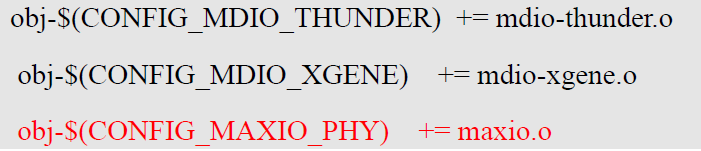
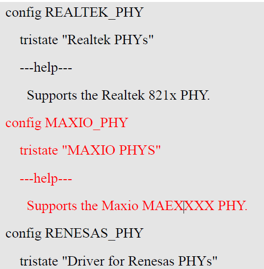
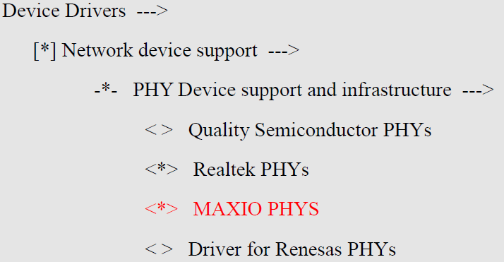
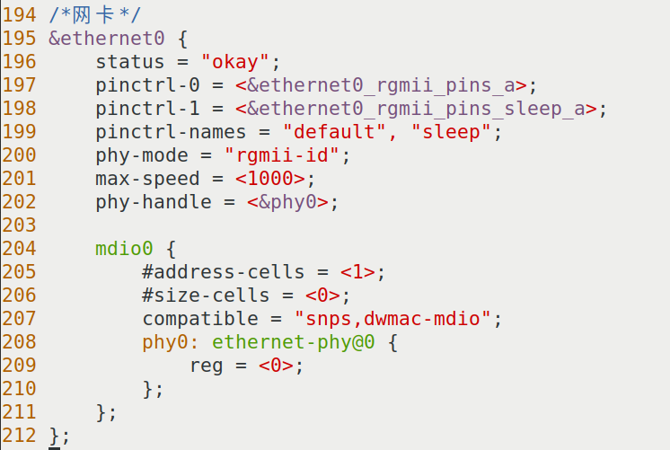

# 实验二十二 移植网卡驱动——四处齐动，把 MAE0621A 装进内核

> **对应课件**：《第5章 移植Linux内核》5.4 节步骤 6（Slide 52~56）
>
> **系列说明**：本系列基于华清远见 FS-MP1A（STM32MP157A）开发板，对应课件《第5章 移植Linux内核》。为什么第 5 章要专门移植网卡？因为**后面的开发、调试全靠网络挂载根文件系统**（改一次文件不用烧盘），网线就是生命线。eMMC 那篇（实验二十一）驱动现成、只补设备树；本篇不一样——**驱动代码也要自己放**（资料包里的 `maxio.c`/`phy_device.c`，后者还要覆盖内核同名文件），加上 Makefile、Kconfig、menuconfig、设备树，**四处齐动**，是第 5 章改动最多的一篇，也是最像"真实工作"的一篇。前置：实验二十一（eMMC 节点已通，重编译流程已熟）。

## 一、改动全景：四个文件，各管一件事

| # | 改哪里 | 干什么 | 性质 |
|---|---|---|---|
| 1 | `drivers/net/phy/` 目录 | 放入 `maxio.c`、`phy_device.c` 两个驱动源文件 | 加代码 |
| 2 | `drivers/net/phy/Makefile` | 加一行编译项，让 `.c` 被编译成 `.o` | 构建入口 |
| 3 | `drivers/net/phy/Kconfig` | 加一个配置项，让 menuconfig 里**出现**它的开关 | 配置入口 |
| 4 | `arch/arm/boot/dts/stm32mp15xx-fsmp1x.dtsi` | 加 `&ethernet0` 节点，告诉内核网卡接在哪 | 硬件描述 |

四者的关系：**没有 1，2 无米下锅；没有 2，1 编不进；没有 3，menuconfig 里找不到开关（也就打不开 1、2 的总闸）；没有 4，驱动编进去了也不知道网卡在哪根总线上**。少一处就白跑一次编译。

> **先弄清驱动角色**：我们板子的以太网是"MAC + PHY"两级结构——MAC 控制器（`ethernet0`，ST 芯片内置，内核自带 `stmmac` 驱动，设备树里声明即可）+ **PHY 芯片 MAE0621A**（板子上一颗独立小芯片，需要专门驱动）。第 3 章 F-5 给 **U-Boot** 换过它的驱动（`u-boot-网卡-MAE0621A驱动.rar`，放的是 `phy.c`/`maxio.c`/`dwc_eth_qos.c`），本篇换的是**内核版**驱动（`kernel-网卡驱动.zip`，放的是 `phy_device.c`/`maxio.c`）——课件 Slide 52 特别提醒："注意不是用于 u-boot 的驱动"。两个包里虽然都叫 `maxio.c`，内容也各是各的（编译体系都不同），**两套代码、两个世界，别拿错包**。

## 二、实验环境（实际）

| 项目 | 实际值 |
|---|---|
| 操作位置 | Ubuntu 虚拟机，实验二十/二十一那棵源码树 |
| 素材 | `kernel-网卡驱动.zip`（18,708 字节，md5 `d75517d6942d13263c1d9a165aff043b`）——结构是两层目录：`kernel-网卡驱动/MAE0621A驱动/` 下两个文件：`maxio.c`（6,654 字节）、`phy_device.c`（64,547 字节） |
| 板子 | 本篇不开 |

> **开工自检（10 秒）**：`git status --short` 里只剩实验二十一的预期改动（dtsi/.config 类，干净更好）；`ls drivers/net/phy/` 能看到几十个 `.c` 文件、`Makefile`/`Kconfig` 在列。

## 三、课件 ↔ 步骤对应表

| 课件 Slide | 内容 | 对应步骤 |
|---|---|---|
| 52 | 为什么移植网卡；从出厂源码包取 MAE0621A 的 phy_device.c/maxio.c 放入 drivers/net/phy | 步骤 1 |
| 53 | phy/Makefile 加 `obj-$(CONFIG_MAXIO_PHY) += maxio.o` | 步骤 2 |
| 54 | phy/Kconfig 加 `config MAXIO_PHY` 配置项 | 步骤 3 |
| 55 | menuconfig：Device Drivers → Network device support → PHY → 勾 `<*> MAXIO PHYS` | 步骤 4 |
| 56 | dtsi 末尾加 `&ethernet0` 节点 + 重编译 `make -j4 uImage dtbs LOADADDR=0xC2000040` | 步骤 5~6 |

### 本篇动作 → 后面谁用 → 现在含糊的后果

| 本篇动作 | 后面哪一篇要用 | 现在含糊的后果 |
|---|---|---|
| 内核里装好 MAE0621A + ethernet0 节点 | 实验二十三点火后内核日志应出现 PHY 报上名来；第 6 章用 NFS 挂根文件系统时**全靠这块网卡** | 网卡没通，第 6 章的 NFS 根起不来，整个"网络调试"玩法作废 |
| Makefile/Kconfig/menuconfig 三件套的改法 | 第 7 章起写自己的驱动时**一模一样的三件套**（加代码→Makefile→Kconfig→menuconfig） | 只会抄不会懂，后面每加一个驱动都要现查 |
| "四处齐动"的完整性检查习惯 | 以后任何"内核不支持某硬件"的移植都这么拆解 | 漏一处就白编一次（十几分钟起步），还查不出原因 |

本篇需要的资料：`kernel-网卡驱动.zip`（见上表）。**注意与第 3 章 F-5 的 U-Boot 驱动包区分**（见"先弄清驱动角色"一段）。

## 四、实验步骤

### 步骤 1：放入驱动源文件（Slide 52）

把 `kernel-网卡驱动.zip` 拷进虚拟机共享目录，然后在源码树里解包——**注意 zip 里套了两层目录**（`kernel-网卡驱动/MAE0621A驱动/`），用 `unzip -j` 直接拍平到目标目录最省事：

```bash
cd <源码>/drivers/net/phy/
unzip -j -o ~/Desktop/LINUX-gy/Test2/kernel-网卡驱动.zip -d .   # zip 路径按你的共享目录改
```

**就地验证**（三条）：

```bash
ls -l maxio.c phy_device.c
# maxio.c 6,654 字节；phy_device.c 64,547 字节（内核自带那份是 64,147 字节——被覆盖的就是它）
cp phy_device.c /tmp/phy_device.c.orig        # 覆盖已经发生，留一份内核自带的原版备查
```

> **`phy_device.c` 名字撞车、必须覆盖，为什么？** 内核自带的 `drivers/net/phy/phy_device.c` 是 MDIO 总线扫 PHY 的通用代码。华清改过三个地方（拿 `/tmp/phy_device.c.orig` 与 zip 版 `diff` 一看便知）：
> ① **读 PHY ID 之前先往 `MII_PHYSID2` 寄存器写一次 0**——注释原话 "An MDIO connects to multiple PHYs requiring write before read"：MAE0621A 的脾气是**先写后读才肯报 ID**，不写就探测不到。这段代码包在 `#ifdef CONFIG_MAXIO_PHY` 里——**步骤 3 要定义的那个配置开关，管的不只是 maxio.c 编不编译，还管这段"怪脾气补丁"编不编译**，三处改动咬合就在这；
> ② 读 ID 失败时返回 `-ENODEV` 而不是 `-EIO`——注释 "returning -ENODEV doesn't stop bus scanning"，让 MDIO 总线把所有地址扫完而不是半途而废；
> ③ 一处设备生命周期小修正（`device_initialize` 时机提前）。
>
> 所以覆盖不是可选项，是课件方案的必需环节；`.orig` 备份的价值是"以后启动异常时能 diff 出厂商到底动了什么"。

### 步骤 2：Makefile 加编译项（Slide 53）

打开 `drivers/net/phy/Makefile`，在第 44 行 `obj-$(CONFIG_MDIO_XGENE)	+= mdio-xgene.o` 附近加一行：

```makefile
obj-$(CONFIG_MAXIO_PHY) += maxio.o
```


> 图：课件 Slide 53——`drivers/net/phy/Makefile` 片段：原有 `obj-$(CONFIG_MDIO_THUNDER) += mdio-thunder.o`、`obj-$(CONFIG_MDIO_XGENE) += mdio-xgene.o`，标红新增 `obj-$(CONFIG_MAXIO_PHY) += maxio.o`。

这行的意思：如果 `.config` 里 `CONFIG_MAXIO_PHY=y`，就把 `maxio.c` 编进内核（`=m` 则编成模块）。**`CONFIG_MAXIO_PHY` 这个名字是我们下一步在 Kconfig 里自己定义的**——Makefile 与 Kconfig 靠这个名字对上号，拼错一个字母就断链。

### 步骤 3：Kconfig 加配置项（Slide 54）

打开 `drivers/net/phy/Kconfig`，在 `config REALTEK_PHY`（第 452 行）与 `config RENESAS_PHY`（第 457 行）附近加：

```kconfig
config MAXIO_PHY
	tristate "MAXIO PHYS"
	---help---
	  Supports the Maxio MAEXXXX PHY.
```


> 图：课件 Slide 54——`drivers/net/phy/Kconfig` 片段：原有 `config REALTEK_PHY`/`config RENESAS_PHY` 两组，标红新增 `config MAXIO_PHY`、`tristate "MAXIO PHYS"` 与一行 help。**`tristate` = 三态开关**（编进内核/编成模块/不使用，对应实验十八讲的 `=y`/`=m`/`is not set`）；`config` 后面的 `MAXIO_PHY` 就是步骤 2 Makefile 引用的那个名字，也是步骤 1 里 `phy_device.c` 那段 `#ifdef` 认的名字。

### 步骤 4：menuconfig 勾选（Slide 55）

```bash
make menuconfig
```

路径：

```
Device Drivers --->
    [*] Network device support --->
        -*- PHY Device support and infrastructure --->
            <*> MAXIO PHYS        ← 新出现的项，勾成 <*>（编进内核）
```


> 图：课件 Slide 55——PHY 设备菜单实拍：`<*> Realtek PHYs`（已选）、**标红新增的 `<*> MAXIO PHYS`（已选）**、`< > Driver for Renesas PHYs`（未选）。退出时选 `<Save>`。

> **这次是真的要勾**：与实验二十一的 SDMMC（`default y` 天生已开）不同，`MAXIO_PHY` 是我们自己在 Kconfig 里新定义的选项，**默认不开**——menuconfig 里不勾，前两步全白搭。路径前两级显示 `[*]`/`-*-` 是因为 `MAXIO_PHY` 依赖它们（menuconfig 里按 `/` 搜 `MAXIO` 能看到依赖链），依赖不满足时这一项根本不出现。

**就地验证**：

```bash
grep MAXIO .config      # 应打出 CONFIG_MAXIO_PHY=y
```

### 步骤 5：设备树加 ethernet0 节点（Slide 56）

打开 `arch/arm/boot/dts/stm32mp15xx-fsmp1x.dtsi`（实验二十一改过的同一个文件），**在文件末尾**（`&vrefbuf` 段之后）添加：

```c
/*网卡*/
&ethernet0 {
    status = "okay";
    pinctrl-0 = <&ethernet0_rgmii_pins_a>;
    pinctrl-1 = <&ethernet0_rgmii_pins_sleep_a>;
    pinctrl-names = "default", "sleep";
    phy-mode = "rgmii-id";
    max-speed = <1000>;
    phy-handle = <&phy0>;

    mdio0 {
        #address-cells = <1>;
        #size-cells = <0>;
        compatible = "snps,dwmac-mdio";
        phy0: ethernet-phy@0 {
            reg = <0>;
        };
    };
};
```


> 图：课件 Slide 56——`stm32mp15xx-fsmp1x.dtsi` 文件末尾（课件作者文件里第 194~212 行）的新增内容截图，与我们抄的一致。

逐行读关键属性（对照实验十六内核日志里 `stm32-dwmac 5800a000.ethernet` 那一串）：

| 属性 | 意思 |
|---|---|
| `phy-mode = "rgmii-id"` | MAC 与 PHY 之间用 RGMII 千兆接口；`-id` 表示时钟延迟在数据线内嵌、由接收端补——硬件接法决定的写法，照抄即可 |
| `max-speed = <1000>` | 最高千兆（实际跑多快由 PHY 自协商决定，实验十三见过全过程） |
| `phy-handle = <&phy0>` + `mdio0` 里的 `ethernet-phy@0 { reg = <0>; }` | MAC 通过 MDIO 总线找 PHY，**PHY 地址 0**——与 F-5 在 U-Boot 里那次同源（地址由板上接线决定，两边看到的是同一颗芯片）；`snps,dwmac-mdio` 是 stmmac 内置 MDIO 总线的标准 compatible |
| `ethernet0_rgmii_pins_a` 等引脚组 | 定义在 SoC 级 `stm32mp15-pinctrl.dtsi`（0020 补丁带来的，实验二十一的五个 sdmmc2 引脚组也在那个文件），照抄引用即可 |

改完 `git diff` 过一眼。

### 步骤 6：重编译（Slide 56 末）

```bash
make -j4 uImage dtbs LOADADDR=0xC2000040
```

增量编译，几分钟（OOM 就 `-j2`）。验证：两个产物时间戳更新、新 uImage 字节数记下；`git diff --stat` 显示本篇改动 = `maxio.c`（新增）+ `phy_device.c`（修改）+ `phy/Makefile` + `phy/Kconfig` + `fsmp1x.dtsi` + `.config`。

> **验收预告（实验二十三）**：用这对新文件点火，内核日志应出现 `stmmac` 探测 5800a000.ethernet、PHY 枚举（MAE0621A 报上名来）——之后 `ping` 通 Ubuntu、第 6 章 NFS 挂根才有戏。

## 五、注意事项

1. **`phy_device.c` 覆盖内核自带同名文件**——按课件做，但先留 `.orig` 备份（步骤 1 已带命令）；三处改动的出处见步骤 1 的解读框。
2. **Makefile 的 `CONFIG_MAXIO_PHY` 与 Kconfig 的 `config MAXIO_PHY` 必须一字不差**（含大小写），这是一对"暗号"；`phy_device.c` 里那段 `#ifdef CONFIG_MAXIO_PHY` 认的也是它——三处咬合，一处拼错全盘哑火。
3. **Kconfig 的缩进用 Tab**：`tristate`/`---help---` 行前的制表符是语法的一部分，用空格可能报 Kconfig 解析警告。
4. **menuconfig 退出选 Save**，`grep MAXIO .config` 复核 `=y`。
5. **dtsi 的 ethernet0 节点加在文件末尾**，别插进别的节点中间；`#address-cells`/`#size-cells` 两行是 mdio0 子总线的编址声明，照抄即可。
6. 重编译**必须带 LOADADDR**（实验二十/二十一同款注意事项）。
7. **别拿成 U-Boot 版驱动包**：文件名相近（都有 maxio.c），但 U-Boot 版三件套（phy.c/maxio.c/dwc_eth_qos.c）属于 U-Boot 的驱动体系——编译报头文件/函数不存在时，第一反应核对 md5 与文件清单。

## 六、验证点一览

| 验证点 | 命令 | 通过的样子 | 在哪一步敲 |
|---|---|---|---|
| 驱动文件到位 | `ls -l maxio.c phy_device.c`（phy 目录里） | 6,654 / 64,547 字节各一份 | 步骤 1 |
| 原版已备份 | `ls -l /tmp/phy_device.c.orig` | 64,147 字节（内核自带那份） | 步骤 1 |
| Makefile 编译项 | `grep -n "MAXIO" drivers/net/phy/Makefile` | `obj-$(CONFIG_MAXIO_PHY) += maxio.o` 一行 | 步骤 2 |
| Kconfig 配置项 | `grep -n -A1 "MAXIO" drivers/net/phy/Kconfig` | `config MAXIO_PHY` + `tristate "MAXIO PHYS"` | 步骤 3 |
| 配置已勾 | `grep MAXIO .config` | `CONFIG_MAXIO_PHY=y` | 步骤 4 |
| 设备树节点 | `grep -A 18 "网卡" arch/arm/boot/dts/stm32mp15xx-fsmp1x.dtsi` | ethernet0 节点整段，在文件末尾 | 步骤 5 |
| 重编完成 | `ls -l arch/arm/boot/uImage arch/arm/boot/dts/stm32mp157a-fsmp1a.dtb` | 时间戳更新；新 uImage 字节数已记 | 步骤 6 |
| 改动范围清白 | `git diff --stat` | 恰 6 项：两个 .c + Makefile + Kconfig + dtsi + `.config` | 收尾 |

不达标时的排查：

| 现象 | 先查什么 |
|---|---|
| menuconfig 里找不到 MAXIO PHYS | Kconfig 的 `config MAXIO_PHY` 拼写、缩进是不是 Tab、文件保存没有；前两级依赖（Network device support / PHY infrastructure）是否开着 |
| 勾了但 `.config` 里是 `# CONFIG_MAXIO_PHY is not set` | 依赖不满足——menuconfig 里按 `/` 搜 `MAXIO` 看依赖链 |
| 编译报 `maxio.c` 里的头文件/函数错误 | 源文件拿错包（拿成 U-Boot 版了？）——核对 md5 与文件名 |
| 编译报 `phy_maxio_init` 一类符号缺失 | `maxio.c` 没拷到位、或 Makefile 那行没加——`ls` 与 `grep` 两把尺子各过一遍 |
| 覆盖没生效（PHY 仍探测不到） | `diff /tmp/phy_device.c.orig drivers/net/phy/phy_device.c` 应能看到步骤 1 解读框里的三处差异；看不到 = 拷贝被原版盖回去了 |
| 点火后网卡仍不通 | （实验二十三验收）先看内核日志有没有 `stmmac`/PHY 枚举行，再回本篇查设备树 |

## 七、实验完成标志

- `maxio.c`（6,654 字节）、`phy_device.c`（64,547 字节）已放入 `drivers/net/phy/`，内核原版已备份 `/tmp/phy_device.c.orig`（步骤 1）
- `drivers/net/phy/Makefile` 已加 `obj-$(CONFIG_MAXIO_PHY) += maxio.o`，`grep` 可见（步骤 2）
- `drivers/net/phy/Kconfig` 已加 `config MAXIO_PHY` 三行（Tab 缩进），`grep` 可见（步骤 3）
- menuconfig 已勾 `<*> MAXIO PHYS`，`.config` 里 `CONFIG_MAXIO_PHY=y`（步骤 4）
- `stm32mp15xx-fsmp1x.dtsi` 末尾已加 `&ethernet0` 节点（步骤 5）
- `make -j4 uImage dtbs LOADADDR=0xC2000040` 重编译成功，`git diff --stat` 恰 6 项（步骤 6）

## 八、下一步：运行内核

两块短板都补齐了：eMMC 认得出、网卡通了。下一篇（实验二十三，第 5 章收官）用**我们自己编的** uImage 与 dtb 点火：先复现"无根文件系统"的老结局（顺便看清两块盘的盘号），再用 `bootargs` 挂上出厂根文件系统**走进 Linux 命令行**——第 3 章以来"bootm 找不到内核"与"内核找不到根"两大悬案，至此全部了结。
