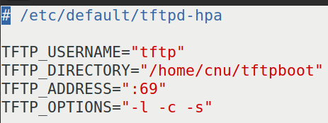

# 实验二十三 运行内核——自己编的内核第一次点火，并走进 Linux 命令行

> **对应课件**：《第5章 移植Linux内核》5.5 节（Slide 57~61）+ 5.6 节（Slide 62~65）
>
> **系列说明**：本系列基于华清远见 FS-MP1A（STM32MP157A）开发板，对应课件《第5章 移植Linux内核》。第 5 章的收官之战，也是全系列两大悬案的结案篇：把**我们自己编**的 `uImage` 与 `stm32mp157a-fsmp1a.dtb` 用 `tftp` 装进内存、`bootm` 点火——先复现"无根文件系统"的老结局（顺便看清两块盘的盘号），再设 `bootargs` 借**出厂根文件系统**（eMMC 的 rootfs 分区）走进 Linux 命令行。第 3 章以来"bootm 找不到内核"（实验十六解决）与"内核找不到根"（本篇解决）从此全部了结。前置：实验二十二（自己的内核 + dtb 已编出）、实验十六（点火三连与验证法）。

## 一、本篇的三段式路线图

| 段 | 干什么 | 预期结果 |
|---|---|---|
| 第一段 | 复验 TFTP 服务器（课件 5.5）+ 把自己的两个文件送上去 | 实验十三已搭好，逐条核对即可 |
| 第二段 | 用**自己编的**内核 + dtb 点火（不设 bootargs） | 走到"找不到根"的老 panic——但 eMMC 这回**认得出来**（实验二十一成果），并把两块盘的真实盘号看清 |
| 第三段 | 设 `bootargs` 挂出厂根文件系统 | **进入 Linux 命令行**——第 5 章大功告成 |

第二段"先空跑一次"不只是仪式：它干了两件事——① 验收实验二十一/二十二（eMMC、网卡有没有报到名来）；② **看清我们自己的内核+设备树下两块盘叫什么号**，第三段的 `root=` 写哪个号，答案就在这一屏日志里。

## 二、实验环境（实际）

| 项目 | 实际值 |
|---|---|
| 操作位置 | 串口 `STM32MP>`（板子侧）+ Ubuntu 侧各一小段 |
| 待点火文件 | 自己编的 `arch/arm/boot/uImage`、`arch/arm/boot/dts/stm32mp157a-fsmp1a.dtb`（实验二十一/二十二的重编译产物，就在这台 Ubuntu 的源码树里） |
| 服务器 | `/home/cnu/tftpboot` 已有出厂 `uImage`（7,546,640）+ `stm32mp157a-fsmp1a-mipi050.dtb`（71,805）（实验十三/十五放入） |
| 出厂根文件系统 | eMMC 的 rootfs 分区（实验十四实测 `mmcblk2` 的 `p4`，1.13 GiB）——华清出厂系统还躺在那里，本篇借它一用 |

> **开工自检（10 秒）**：倒计时 5 秒可拦停（`bootdelay 5`，实验十二设的）；`print serverip` = `192.168.0.100`；Ubuntu 的 `tftpd-hpa` 在跑（`sudo service tftpd-hpa status`）。

## 三、课件 ↔ 步骤对应表

| 课件 Slide | 内容 | 对应步骤 |
|---|---|---|
| 57~60 | 5.5：tftpd-hpa 安装/目录/配置/重启/本机测试 | 步骤 1（复验） |
| 61 | 电脑与开发板的网络连接（桥接/路由器两种拓扑） | 步骤 1（我们用实验十三那套三网卡桥接拓扑） |
| 62 | 5.6：拷内核与 dtb 到 TFTP 目录，两条 tftp 下载，bootm 启动 | 步骤 1~2 |
| 63 | 5.6：**bootargs 借出厂根文件系统**（`root=/dev/mmcblk1p4`），进 Linux 命令行 | 步骤 3 |
| 64 | 5.6：出厂内核/设备树替换定位法（ext4load 那对） | 步骤 4 |
| 65 | 5.6：bootcmd 自动启动 | 步骤 5 |

### 本篇动作 → 后面谁用 → 现在含糊的后果

| 本篇动作 | 后面哪里还会用 | 现在含糊的后果 |
|---|---|---|
| **`bootargs` = U-Boot 传给内核的参数串**（本篇第一次真正用到它） | 第 6 章 NFS 根就是把 `root=` 换成 `root=/dev/nfs nfsroot=...`；`console=` 决定日志去哪 | 设错 `console=`，内核起来了串口可能安静；设错 `root=`，panic 回来 |
| **"出厂件替换定位法"**（步骤 4） | 第 6 章起每一次"起了但不对劲"都靠它二分定位：换回出厂件还坏 = 锅在别处 | 出问题在海里捞针，不知道该怀疑内核、dtb 还是根 |
| 两条 `mybootnet`/`mybootemmc` 自定义变量（实验十七） | 第 6 章起的日常：改一次内核 `run mybootnet` 快速验证 | 每次调试手敲三行，效率掉一半 |
| "盘号以日志实录为准"这条规矩 | 第 6 章 NFS/一切涉及盘号的配置 | 照抄任何一家的盘号（课件的 mmcblk1 也好、实验十六的 mmcblk2 也好），都可能挂不上 |

本篇需要的资料：**无新增**——点火文件是实验二十~二十二自己编的（就在 Ubuntu 源码树里，`cp` 到 TFTP 根目录即可）；出厂根文件系统在板上 eMMC 里，一直都在。

## 四、实验步骤

### 步骤 1：复验 TFTP 服务器，把自己的文件送上去（课件 5.5，复验篇）

课件 5.5 节那五步（`apt install tftpd-hpa` / `mkdir /home/cnu/tftpboot` + `chmod 777` / 配 `/etc/default/tftpd-hpa` / `service restart` + `status` / 本机 `tftp 127.0.0.1` 自测）**我们实验十三已经全部做过且实测通过**，此处不复述，只做两条复核：

```bash
sudo service tftpd-hpa status        # active (running)
ls -l /home/cnu/tftpboot             # 出厂 uImage + mipi050.dtb 在列（权限 644）
```


> 图：课件 Slide 59——`/etc/default/tftpd-hpa` 配置内容：`TFTP_USERNAME="tftp"`、`TFTP_DIRECTORY="/home/cnu/tftpboot"`、`TFTP_ADDRESS=":69"`、`TFTP_OPTIONS="-l -c -s"`（`-c` 允许新建文件、`-s` 锁根目录、`-l` 独立运行模式）。**与我们实验十三配的那份一字不差**——课件 5.5 与实验十三是同一件事，这也是"提前做完 5.5"的回报：本篇只复验。

然后把自己编的两个文件送进 TFTP 根目录。**不用经 Windows 中转**——源码树就在这台 Ubuntu 里，直接 `cp`：

```bash
SRC=<你的源码树路径>/linux-5.4.31          # 实验十九~二十二一直在用的那棵
cp $SRC/arch/arm/boot/uImage /home/cnu/tftpboot/my_uImage
cp $SRC/arch/arm/boot/dts/stm32mp157a-fsmp1a.dtb /home/cnu/tftpboot/
chmod 644 /home/cnu/tftpboot/my_uImage /home/cnu/tftpboot/stm32mp157a-fsmp1a.dtb
ls -l /home/cnu/tftpboot                   # 四个文件在列，权限 644
```

> **`chmod 644` 不能省**（实验十三坑 7 的老朋友）：`tftpd-hpa` 以 `--user tftp` 换用户读文件，权限不够就 `Error code 0: Permission denied`，还会留下 0 字节空壳误导人。
>
> **命名建议**：自己编的内核改名 `my_uImage`（与出厂 `uImage` 区分），dtb 用原名（出厂那份叫 `stm32mp157a-fsmp1a-mipi050.dtb`，本来就不重名）——**任何时刻都能从命令行看出"点的是哪份内核"**，排障第一原则。另一个认法：点火时 U-Boot 的 `Image Name:` 行，我们自己的是 `Linux-5.4.31-g<哈希>`（git 纳管的版本串，实验十九步骤 3.3 讲过），出厂那份是干净的 `Linux-5.4.31`。

### 步骤 2：用自己编的内核点火——复现"无根"老结局，看清盘号（Slide 62）

上电拦停进 `STM32MP>`（点火前 30 秒自检照旧：两条 `md.l` 验魔数——`c2000000` 见 `27051956`、`c4000000` 见 `d00dfeed`；**要在 bootm 之前验**，bootm 会把 dtb 搬走）：

```
STM32MP> tftp c2000000 my_uImage
STM32MP> tftp c4000000 stm32mp157a-fsmp1a.dtb
STM32MP> bootm c2000000 - c4000000
```

`Bytes transferred` 的数字与实验二十~二十二记录的两个字节数对上账后，预期结局分三笔账：

- **身份账（自己编的凭证）**：`Image Name: Linux-5.4.31-g<哈希>`（不是出厂的纯 `Linux-5.4.31`）；内核日志第一屏 **`Machine model: HQYJ STM32MP157 FSMP1A Discovery Board`**——这是我们自己 dtb 里写死的 `model` 字段，**注意它不带 MIPI**（出厂 mipi050.dtb 报的是 `...FSMP1A MIPI...`）。实验十七列过"同一块板三级 Model 各不相同并不矛盾"的表，现在内核这级换成了我们自己写的那份：TF-A 报 `HQYJ FS-MP1A`、U-Boot 报 `DK1`、**我们的内核报 `HQYJ STM32MP157 FSMP1A`（无 MIPI）**——点火看到这一串，就证明 dtb 没拿错。
- **驱动账（实验二十一/二十二验收）**：驱动初始化那段里，两块盘都应报到名——SD 卡一块、eMMC 一颗（形如 `mmcX: new ... MMC card at address 0001` 与 `mmcblkY: mmcX:0001 004GA0 3.69 GiB`）。**Y 的编号以这一屏实录为准**：我们的设备树没写 mmc 别名，Linux 按探测顺序给盘编号，实验十六出厂 dtb 下 SD=mmcblk1/eMMC=mmcblk2 的旧账不必照搬；网卡那边应能看到 `stmmac`/MAE0621A 枚举。**把 eMMC 的盘号抄下来，步骤 3 要用。**
- **结局账（实验十六设好的基线）**：`Kernel command line:` 还是空 → `Kernel panic - not syncing: VFS: Unable to mount root fs`——老结局如期而至。这不是退步：没有 bootargs、没有根，panic 正是实验十六设下的对照基线。

### 步骤 3：设 bootargs，借出厂根文件系统走进 Linux（Slide 63）——本篇题眼

课件的思路：出厂根文件系统在 eMMC 的 **4 号分区**，启动时挂它即可。**但盘号别抄任何一家的**——课件板写 `root=/dev/mmcblk1p4`（那是课件板环境的实录），我们自己的内核+dtb 下编号按探测顺序排（步骤 2 已经看清了）。下面按实验十六的参照写 `mmcblk2p4` 作示例，**如果你步骤 2 日志里那颗 3.69 GiB 的盘是别的号，就换成那个号**：

```
STM32MP> setenv bootargs 'console=ttySTM0,115200 root=/dev/mmcblk2p4 rootwait rw'
STM32MP> saveenv
```

`bootargs` 三个参数一句话读懂：

| 参数 | 意思 |
|---|---|
| `console=ttySTM0,115200` | 告诉内核"日志与命令行走 ttySTM0（我们的调试串口）、115200 波特"。这里有个实验十六留下的疑问要交代：那次 bootargs 全空，内核日志照样打满了串口——那是因为我们 dtb 的 `chosen` 节点里有 `stdout-path = "serial0:115200n8"`，内核会拿它兜底选控制台。显式设 `console=` 是把"日志+命令行都走 ttySTM0"**钉死**，不赌兜底 |
| `root=/dev/mmcblk2p4` | 根文件系统在 eMMC 的 4 号分区（rootfs，1.13 GiB）——**盘号以步骤 2 日志为准** |
| `rootwait rw` | 等根设备就绪再挂（MMC 驱动是慢热型，不等会抢跑）、以读写方式挂载 |

然后**重新点火**（三条命令同步骤 2；`bootargs` 是环境变量，已经 saveenv，不用重下载文件）：

```
STM32MP> bootm c2000000 - c4000000
```

这次内核日志会走得更远：`Kernel command line: console=ttySTM0,115200 root=/dev/mmcblk2p4 rootwait rw`（不再是空）、根文件系统挂载成功，最后停在命令行提示符：

```
/ #
```

**提示符出来 = 进入了 Linux 命令行**——第 3 章以来的终极目标达成。**提示符的形态以实测为准**：课件给的是 `/ #`（busybox 风格）；出厂根里若是带 systemd 的完整系统，可能先滚一段服务启动日志再给 `root@xxx:~#` 之类的提示符——判据只认"进入了可以敲命令的命令行"，不认具体长相。进去后随手体验：`ls /`（看出厂根的目录结构）、`uname -a`（**版本串应是 `5.4.31-g<哈希>` 带不带 `-dirty` 都可能**——有哈希就证明跑的是我们编的内核，出厂那份没有）、`cat /proc/cpuinfo`（双核）。注意这个命令行是**出厂根文件系统 + 我们自己的内核**的合体——第 6 章要把根也换成自己做的。

> **退出方式**：这是借来的根，别在里面改系统文件。玩完敲 `reboot` 回 U-Boot；就算不敲，**看门狗约 32 秒也会替你重启**——源头在老师 dtsi 里 `&iwdg2 { timeout-sec = <32>; status = "okay"; }`（实验二十彩蛋③），借来的根没人喂狗，32 秒窗口到了就复位（实验十六那次的 `Reset reason (0x214): IWDG2 Reset` 同源）。

### 步骤 4：出厂件替换定位法（Slide 64）——排障二分法

课件 5.6 顺手教了一招**以后天天用的定位法**：出厂的内核与设备树就躺在 eMMC 的 bootfs 分区里（U-Boot 设备 1 的 2 号分区，实验十五 `ext4ls` 清点过）。任何一个环节出问题，用"换件法"二分定位：

| 怀疑对象 | 操作 | 现象与结论 |
|---|---|---|
| 自己编的 uImage | `ext4load mmc 1:2 c2000000 uImage` + 出厂 dtb `ext4load mmc 1:2 c4000000 stm32mp157a-fsmp1a-mipi050.dtb` + bootm（即 `run mybootemmc` 的内核部分） | 出厂内核能起 → 锅在**我们编的内核**；不能起 → 锅在 U-Boot 或根 |
| 自己编的 dtb | 出厂 uImage + 出厂 dtb 组合 | 能起 → 锅在**我们的 dtb** |
| 全出厂 | 内核、dtb、根都是出厂件仍起不来 | **该回头查 U-Boot**（课件原话） |

顺手的判别记号：出厂 uImage 的 `Image Name:` 是干净的 `Linux-5.4.31`，我们的是带哈希的——点火一瞬就能看出换没换对。

### 步骤 5：bootcmd 自动启动（Slide 65）——其实已经在用

课件最后把三条命令写进 `bootcmd` 自动启动——**实验十六步骤 3 已经做过**（当时固化的是出厂文件名）。本篇若想让上电自动用"自己的内核"，把 `mybootnet` 里的文件名换成自己的两个即可：

```
STM32MP> setenv mybootnet 'tftp c2000000 my_uImage;tftp c4000000 stm32mp157a-fsmp1a.dtb;bootm c2000000 - c4000000'
STM32MP> saveenv
```

## 五、注意事项

1. **盘号以点火日志为准**：课件写 `root=/dev/mmcblk1p4`（课件板实录），实验十六在出厂 dtb 下见过 `mmcblk2`——但那是别人的环境的账。我们自己的内核+dtb 没写 mmc 别名，编号按探测顺序排，**步骤 2 先空跑一次就是为了让这颗 3.69 GiB 的盘自报家门**；写错号的症状是挂不上根（panic 或 Waiting for root device）。
2. **`console=ttySTM0,115200` 要显式设**：实验十六没设也能看到日志（chosen 的 stdout-path 兜底），但命令行挂到哪个 /dev/console 上由 `console=` 说了算——不赌兜底，两个都钉死。
3. **两份内核用文件名区分**（`uImage` 出厂 / `my_uImage` 自己）+ `Image Name:` 带不带哈希：从命令行一眼看出点火对象；`bootargs` 是环境变量，**换了内核不用重设**（除非想换 root）。
4. `setenv bootargs` 的值**整体加单引号**（含空格的老规矩，实验十二、十七）。
5. 点火前 30 秒自检照旧：`md.l c2000000 1` 见 `27051956`、`md.l c4000000 1` 见 `d00dfeed`——**在 bootm 之前**做（bootm 会把 dtb 搬走，事后 `md.l` 看不到 d00dfeed 属正常，实验十六有过这桩公案）。
6. panic 后约 32 秒 IWDG2 自动复位；复位后倒计时归零自动跑 `bootcmd`（实验十六固化的出厂网络三连）——拦停要快。借根进命令行后同样有这 32 秒窗口（没人喂狗）。
7. **TFTP 侧的文件权限**：`cp` 进 tftpboot 后一律 `chmod 644`（实验十三坑 7）；`File not found` 先 `ls -l /home/cnu/tftpboot` 对名字，别急着查网线。

## 六、验证点一览

| 验证点 | 命令 | 通过的样子 | 在哪一步敲 |
|---|---|---|---|
| 服务器复验 | `sudo service tftpd-hpa status`、`ls -l /home/cnu/tftpboot` | `active (running)`；四个文件在列且 644 | 步骤 1 |
| 自己的文件上服务器 | `ls -l /home/cnu/tftpboot` | `my_uImage` 与 `stm32mp157a-fsmp1a.dtb` 字节数与实验二十~二十二记录一致 | 步骤 1 |
| 魔数自检 | `md.l c2000000 1`、`md.l c4000000 1` | `27051956` / `d00dfeed` | 步骤 2（bootm 前） |
| 身份三验 | 看 `Image Name:` 与 `Machine model:` | 带哈希的 `Linux-5.4.31-g...`；`HQYJ STM32MP157 FSMP1A Discovery Board`（无 MIPI） | 步骤 2 |
| eMMC 被认出 | 看驱动初始化日志 | `mmcblkY: ... 004GA0 3.69 GiB` 一行，Y 抄下备用 | 步骤 2 |
| bootargs 生效 | 看 `Kernel command line:` 一行 | 显示我们设的整串 | 步骤 3 |
| **进命令行** | 出提示符后 `uname -a`、`ls /` | 提示符出现；`uname -a` 带 `5.4.31-g<哈希>`、`ls` 列出根目录（本篇终极验收） | 步骤 3 |
| 替换定位法 | 复述三连换表 | 三种组合各自指向哪个嫌疑，说得清 | 步骤 4 |

不达标时的排查：

| 现象 | 先查什么 |
|---|---|
| 设完 bootargs 仍 `VFS: Unable to mount root fs` 或卡 `Waiting for root device` | `print bootargs` 逐字核对；**盘号**与步骤 2 日志里那颗 3.69 GiB 的盘一致吗；eMMC 报到行有没有（没有 = 回实验二十一） |
| 根挂上了但串口没输出 | `console=` 打错（ttySTM0 拼写）；串口线还插着没 |
| `/ #`（或 `root@...`）出来了但很多命令 `not found` | 正常——借来的根不是为这套内核定制的；缺什么第 6 章做自己的根时补 |
| `tftp my_uImage` 报 `File not found` | 服务器侧 `ls -l /home/cnu/tftpboot` 对名字；`chmod 644` 做了没（坑 7） |
| 点火报 `Machine model` 带 MIPI | 拿错了 dtb——`stm32mp157a-fsmp1a.dtb`（我们的）与 `stm32mp157a-fsmp1a-mipi050.dtb`（出厂的）名字就差这一截 |
| 出厂件替换也起不来 | **回头查 U-Boot**（课件原话）——回实验十六的排查表 |

## 七、实验完成标志

- TFTP 服务器复验通过，`my_uImage` 与 `stm32mp157a-fsmp1a.dtb` 已放入 TFTP 根目录且权限 644（步骤 1）
- 自己编的内核 + 自己的 dtb 点火成功：`Image Name` 带哈希、`Machine model` 报 `HQYJ STM32MP157 FSMP1A Discovery Board`、日志里两块盘都报到名、止于 VFS panic（步骤 2）
- `bootargs` 设为 `console=ttySTM0,115200 root=/dev/<实测盘号>p4 rootwait rw` 并 saveenv（步骤 3）
- **点火后进入 Linux 命令行提示符，`uname -a` 报出带哈希的 5.4.31 版本串**（步骤 3——第 5 章终极验收）
- 出厂件替换定位法的三种组合能复述（步骤 4）
- `mybootnet` 已指向自己的内核与 dtb（步骤 5）

## 八、下一步：第 6 章《构建 Linux 根文件系统》

第 5 章到此收官。盘一下现在的系统栈：**我们编的 U-Boot（第 3 章）→ 我们编的内核 + 我们的设备树（第 5 章）→ 出厂借用的根文件系统（本篇）**——四个部件里只剩根是自己没有的。第 6 章用 busybox 从零构建自己的根文件系统、再搬上 NFS：届时 `root=` 会从 eMMC 分区换成 `root=/dev/nfs nfsroot=192.168.0.100:...`，"改根文件系统不用重烧卡"的网络调试模式才算真正落地。
