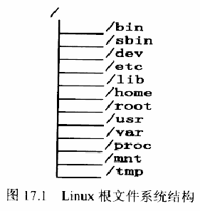
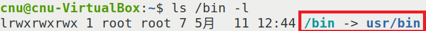
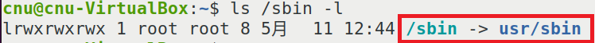
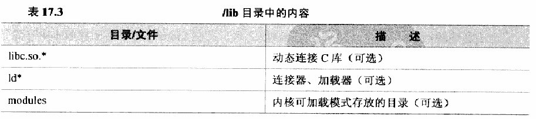
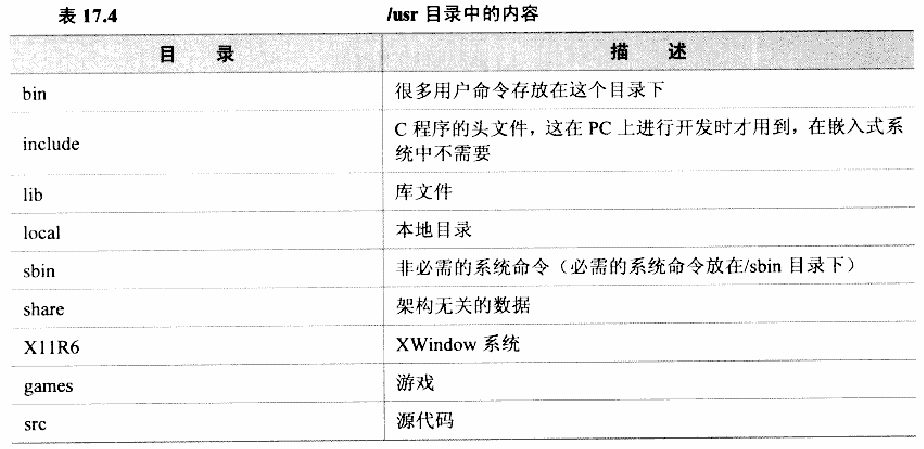
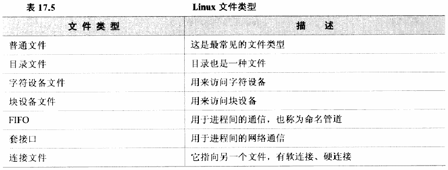
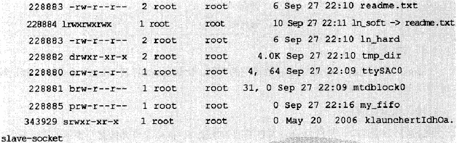
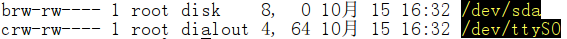

# 实验二十四 根文件系统全景——内核之外，系统还需要什么

> **对应课件**：《第6章 构建Linux根文件系统-V2》6.1 节，Slide 2-16
>
> **系列说明**：本系列基于华清远见 FS-MP1A（STM32MP157A）开发板，对应课件《第6章 构建Linux根文件系统》。实验二十三我们借出厂根文件系统走进了 Linux 命令行——系统栈四个部件（U-Boot、内核、设备树、根）里只剩根不是自己的。第 6 章补上最后一块：用 busybox 从零构建自己的根文件系统、挂上 NFS。本篇是开篇**认知篇**：根文件系统到底指什么、里面必须有哪些目录和文件、Linux 的文件类型与设备文件是怎么回事——这些概念不立住，后面照抄的每个配置文件都是天书。前置：实验二十三（借根点过火，本篇所有概念都挂在那次经历上）。

## 一、先把三组名词对齐

**内核与根文件系统的边界**（实验十八划过，这里落到"文件"上）：内核负责驱动硬件、调度进程；`ls`、`sh`、`mount` 这些命令、C 库、配置文件、启动脚本，全在根文件系统里。实验二十三点火后 `uname -a` 查的是内核，敲的每条命令却都来自挂载的那个根——两样缺一不可。

**"文件系统"一词的两个含义**：一是指**分区上存文件的格式**（ext2/ext3/ext4、fat、ntfs、jffs2、yaffs……同一块数据用哪种格式组织）；二是指 proc、sysfs、tmpfs 这类**虚拟文件系统**——它们的"文件"不落在外存上，而是访问时由内核临时生成的（在内存里）。后文说"挂载 sysfs"、"fstab 里那行 tmpfs"，用的都是第二义。

**挂载点**：Linux 以一棵树管理所有目录与文件，其他分区（或虚拟文件系统）"接"到树上某个目录——这个目录就叫挂载点。**根文件系统挂载在 `/` 上**，是树的根；bootargs 里 `root=/dev/xxx` 指的就是它。实验十四看过的 eMMC 分区表里 `rootfs` 那格，与 `bootfs` 一样，只是"装根文件系统的分区"这个角色。

## 二、根文件系统里有什么：目录逐个认

制作根文件系统，本质就是**创建一堆目录、往里放该放的文件**。哪些目录必须有？课件按"挂载其他文件系统之前就要能用"划了一条线：

| 目录 | 必须有？ | 放什么 | 与我们经历的对号 |
|---|---|---|---|
| `/bin` | **必须** | 所有用户可用的基本命令（`ls`、`sh`、`chmod`、`mount`、`mkdir`、`mknod`…），挂载其他文件系统**之前**就能用 | 实验二十三借根时敲的 `ls`、`uname` 就住在类似的地方 |
| `/sbin` | **必须** | 只有管理员用的系统命令（`shutdown`、`reboot`、`fdisk`、`fsck`…），同样"挂载前可用" | —— |
| `/dev` | **必须** | 设备文件——Linux"一切皆文件"的入口（`/dev/ttySTM0` 就是我们的串口） | 实验二十六专题 |
| `/etc` | **必须** | 系统与应用的**配置文件**——第 6 章的核心工作就是写它的四件套 | —— |
| `/lib` | **必须** | 共享库（`.so`）、可加载模块（`.ko`）；嵌入式为省空间**不放静态库**（`.a`） | busybox 动态编译就靠它（实验二十五） |
| `/home`、`/root` | 可选 | 普通用户 / root 用户的登录目录 | —— |
| `/usr` | 建议 | 共享、**只读**的程序与数据（Unix Software Resource） | —— |
| `/var` | 建议 | 可变数据：log、spool、临时文件 | —— |
| `/proc` | 建议（空目录） | proc 虚拟文件系统的挂载点——内核运行状态的窗口 | `cat /proc/cpuinfo`（实验二十三） |
| `/mnt` | 建议（空目录） | 临时挂载点 | —— |
| `/tmp` | 建议（空目录） | 临时文件；挂 tmpfs 可减少对 Flash 的读写 | fstab 里那行就是它 |
| `/sys` | 建议（空目录） | sysfs 挂载点——设备管理重地，mdev 靠它 | —— |
| `/opt` | 可选 | 用户自选软件 | —— |


> 图：课件 Slide 4——根文件系统目录结构图：根目录 `/` 下依次列出 `/bin`、`/sbin`、`/dev`、`/etc`、`/lib`、`/home`、`/root`、`/usr`、`/var`、`/proc`、`/mnt`、`/tmp` 等目录——实验二十五之后我们亲手建的目录树就是这张图的落地版。

**发行版里的一个常见变形**：桌面 Linux（比如我们虚拟机的 Ubuntu）常把 `/bin`、`/sbin` 做成指向 `/usr/bin`、`/usr/sbin` 的**符号链接**——别在虚拟机里看到 `bin -> usr/bin` 就以为自己认错了：


> 图：课件 Slide 4——终端 `ls /bin -l` 输出：`lrwxrwxrwx 1 root root 7 5月 11 12:44 /bin -> usr/bin`，红框标出 `/bin` 是指向 `usr/bin` 的符号链接（权限位首字母 `l` = link，第三节的文件类型里会再碰到它）。


> 图：课件 Slide 5——同理，`ls /sbin -l` 显示 `/sbin -> usr/sbin`。**我们做的嵌入式根文件系统不搞这套**：busybox 安装出来的 `/bin`、`/sbin` 是货真价实的目录。

两个"必须"目录的内容表：


> 图：课件 Slide 9——`/lib` 目录内容表：`libc.so.*`（动态连接 C 库）、`ld*`（连接器/加载器，负责把程序和它依赖的 `.so` 接起来）、`modules`（内核可加载模块 `.ko` 的存放目录，第 7 章驱动就住这里）。实验二十五会从交叉编译器里把前两者拷进来。


> 图：课件 Slide 11——`/usr` 目录内容表：`bin`、`lib`、`sbin`、`share`、`include`（C 头文件，**嵌入式系统不需要**——那是 PC 上编译时用的）、`local`、`src`、`X11R6`、`games` 等。我们只建 `usr/bin`、`usr/sbin` 两个（busybox 安装时自动建）。

## 三、Linux 的文件类型：ls 输出的第一个字母

Linux 把七种东西都当"文件"，靠 `ls -l` 输出的**第一个字母**区分：

| 首字母 | 类型 | 干什么 |
|---|---|---|
| `-` | 普通文件 | 最常见的文件 |
| `d` | 目录文件 | 目录本身也是一种文件 |
| `c` | 字符设备文件 | 按字节流顺序访问的设备：串口、键盘 |
| `b` | 块设备文件 | 可随机访问固定大小块的设备：硬盘、Flash、eMMC |
| `p` | FIFO / 命名管道 | 进程间通信 |
| `l` | 符号连接 | 指向另一个文件（软连接；硬连接不显示 `l`） |
| `s` | 套接口（socket） | 进程间网络通信 |


> 图：课件 Slide 15——Linux 文件类型表：普通文件、目录文件、字符设备文件、块设备文件、FIFO（命名管道）、套接口、连接文件（软/硬连接）。

`ls -l` 的完整输出怎么读（第三个字段"硬连接个数"是新面孔）：


> 图：课件 Slide 16——`ls` 命令输出示例：`readme.txt`（`-rw-r--r--`、inode 228883、硬连接数 2，普通文件）、`ln_soft -> readme.txt`（`lrwxrwxrwx`，符号连接）、`ln_hard`（与 readme.txt **同一个 inode 228883**，硬连接）、`tmp_dir`（`drwxr-xr-x`，目录）、`ttySAC0`（`crw-r--r--`，字符设备 4,64）、`mtdblock0`（`brw-r--r--`，块设备 31,0）、`my_fifo`（`prw-r--r--`，管道）、`*.slave-socket`（`srwxr-xr-x`，套接字）。

**inode 是文件的"身份证号"**：一个 inode 对应一份文件实体，目录里的文件名只是指向它的"硬连接"。硬连接（`ln_hard`）与原文件共享同一个 inode——所以删掉其中一个名字，文件还在（引用计数归零才真删）；符号连接（`ln_soft`）有自己的 inode，存的只是"路径"——原件删了它就悬空。这个概念第 8 章 GPIO、第 9 章驱动调试时还会在 `/dev`、`/sys` 里反复碰到。

## 四、设备文件专题：/dev、主次设备号与 mknod

设备文件是 Linux 特有的文件类型，**对它读写 = 对设备读写**。两类设备的差别就一条：字符设备按字节流**顺序**访问（串口、键盘），块设备按固定大小的块**随机**访问（eMMC、SD、NAND）——实验十四 U-Boot 侧 `mmc read/write` 按扇区（512 字节块）操作的，就是块设备的读法。


> 图：课件 Slide 6——`ls -l` 显示的两类设备文件：`brw-rw---- ... 8, 0 ... /dev/sda`（`b` 开头，块设备，主设备号 8、次设备号 0）与 `crw-rw---- ... 4, 64 ... /dev/ttyS0`（`c` 开头，字符设备，主设备号 4、次设备号 64）。设备大小的位置显示的是"主设备号, 次设备号"。

**主设备号定位驱动，次设备号定位设备**：一个主设备号代表一个驱动程序，次设备号区分这个驱动管的第几台设备（SATA 盘主 8、串口主 4 是内核的约定）。手工创建设备文件的命令：

```
mknod /dev/ttySAC0 c 4 64      # 字符设备：主 4 次 64（串口）
mknod /dev/hda1  b 3 1         # 块设备：主 3 次 1（IDE 硬盘第一分区）
```

**/dev 下的文件从哪来？三种方法**：

1. **手动 `mknod`**：启动前把要用的设备文件建好——土办法，设备一多就累；
2. **devfs**：内核 2.6.13 之前的老机制，**已过时**（认识一下就行）；
3. **udev**：用户空间的守护程序，根据硬件状态**动态**创建/删除设备文件；需要内核支持 sysfs（提供设备信息）与 tmpfs（给设备文件落脚）。**busybox 里的 `mdev` 是 udev 的简化版**——嵌入式标配。

这条线在第 6 章的落点：实验二十六的 rcS 脚本会照 busybox 官方文档把 mdev 的七步挂载流程跑起来（挂 sysfs → `echo /sbin/mdev > /proc/sys/kernel/hotplug` → `mdev -s`），让内核在设备插拔时自动调 mdev 建删文件——上面这段概念到时会一一对号。

## 五、实验环境（实际）

| 项目 | 实际值 |
|---|---|
| 板子状态 | 第 5 章收官形态：自己的 U-Boot + 自己的内核 + bootargs 借出厂根（实验二十三） |
| Ubuntu 虚拟机 | 实验十九装的 ARM 官方 gcc-arm-9.2（busybox 就用它编）、tftpd-hpa（实验十三） |
| 本篇新增材料 | 无——认知篇，不上板不编译 |

> **开工自检（10 秒）**：本篇不上板。要做的只是把概念与已跑过的经历对号，并确认第 6 章的两份材料已在手：`busybox-1.32.0.tar.bz2`、`buildroot-2020.02.6.tar.bz2`——**都已从资料包复制到本章目录**（`04_构建Linux根文件系统/`），实验二十五、二十八分别解压。

## 六、课件 ↔ 步骤对应表

| 课件 Slide | 内容 | 对应本篇 |
|---|---|---|
| 2~3 | 文件系统概述、文件系统类型两义、挂载点 | 第一节 |
| 4~14 | 根文件系统目录逐个认（bin/sbin/dev/etc/lib/home/root/usr/var/proc/mnt/tmp/sys/opt） | 第二节 |
| 15~16 | 文件类型表、ls 输出与 inode | 第三节 |
| 6~8 | 设备文件、主次设备号、mknod、/dev 三种创建方法 | 第四节 |

### 本篇概念 → 后面谁用 → 现在含糊的后果

| 本篇概念 | 后面哪一篇用 | 现在含糊的后果 |
|---|---|---|
| /bin、/sbin"挂载前可用" | 实验二十五：busybox 安装产物就是填这两个目录的 | 不知道为什么安装目录里先有 bin/sbin |
| /lib 的共享库与加载器 | 实验二十五：从交叉编译器拷 glibc；缺了它 busybox 直接起不来 | "动态编译"三个字没感觉，拷库时不知道拷的是什么 |
| /etc 是配置文件的家 | 实验二十六：inittab/rcS/fstab/profile 四件套逐个写 | 照抄四个文件却不知道谁在什么时候读它 |
| 设备文件 + 主次设备号 + mdev | 实验二十六：mdev 七步流程；第 7 章：驱动的主设备号 | rcS 里 `echo /sbin/mdev > /proc/sys/kernel/hotplug` 不知道在干嘛 |
| proc/sysfs/tmpfs 三个虚拟文件系统 | 实验二十六 fstab 与 rcS 的挂载行；第 9 章 /sys/kernel/debug 调试 | mount -t 那几行命令永远是天书 |
| inode 与文件类型首字母 | 实验二十九：`chmod a-s busybox` 的 Set UID 位、`ll` 看权限 | 权限串里的 `s` 看不出来是问题根源 |

本篇**不需要任何新资料**。第 6 章要用的两份材料已从资料包（`D:\桌面文件\资料\嵌入式linux`）复制到本章目录：`busybox-1.32.0.tar.bz2`（实验二十五）、`buildroot-2020.02.6.tar.bz2`（实验二十八），md5 与源一致。

## 七、自测一览

| 自测问题 | 达标答案 | 在哪一节 |
|---|---|---|
| 根文件系统和内核是什么关系？谁先谁后？ | 内核启动后**首先挂载**根文件系统（bootargs 的 root=），再执行其中的 init 程序——内核管硬件，根管"软件环境" | 第一节 |
| "文件系统"一词的两种含义？ | 分区格式（ext4 等）与虚拟文件系统（proc/sysfs/tmpfs，文件在内存中由内核临时生成） | 第一节 |
| 哪些目录"必须有"？判据是什么？ | /bin、/sbin、/dev、/etc、/lib——判据是"挂载其他文件系统之前就要能用" | 第二节 |
| `crw-rw----` 里 c 和 4, 64 各是什么？ | c = 字符设备；4 = 主设备号（定位驱动），64 = 次设备号（定位同驱动的第几台设备） | 第四节 |
| /dev 的三种创建方法？ | 手动 mknod、devfs（已过时）、udev——busybox 的 mdev 是 udev 简化版 | 第四节 |
| 硬连接与符号连接的区别？ | 硬连接与原文件共享 inode；符号连接有自己的 inode、只存路径，原件删除即悬空 | 第三节 |

## 八、下一步：busybox 构建根文件系统

下一篇（实验二十五）动手：解压 busybox-1.32.0、改 Makefile 指定交叉编译器（就是实验十九装的那套 `arm-none-linux-gnueabihf-`——当时说它"编不了 busybox 的 SDK 编译器"的反面就是它）、menuconfig 配四处、编译安装，再把交叉编译器里的 glibc 库拷进 lib——根文件系统的骨架一次成型。
