# 实验二十五 busybox 构建根文件系统——骨架一次成型

> **对应课件**：《第6章 构建Linux根文件系统-V2》6.2 节（上），Slide 17-33
>
> **系列说明**：本系列基于华清远见 FS-MP1A（STM32MP157A）开发板，对应课件《第6章 构建Linux根文件系统》。实验二十四把"根文件系统需要哪些目录和文件"列清了，本篇把其中最大的一块造出来：**busybox**——一个把上百条 Unix 命令装进一个小程序的开源项目，编译安装后 `/bin`、`/sbin`、`/usr` 一并生成，再补上交叉编译器的 glibc 共享库，根文件系统的骨架就齐了。etc/dev 等配置与目录是实验二十六的事。**本篇全程在 Ubuntu 虚拟机里操作，板子可以不开**。前置：实验二十四（概念）、实验十九（gcc-arm-9.2 交叉编译器——本篇就靠它）。

## 一、busybox 是什么，为什么是它

根文件系统里的 `/bin`、`/sbin` 要装一堆可执行命令，一条条找源码来编不现实。busybox 的思路：**把众多 UNIX 命令集合进一个很小的可执行程序**，用来替换 GNU coreutils 那一大家子——每条命令提供的选项少一些，但日常够用；按模块设计，菜单里勾勾点点就能增删命令。动态连接的 busybox 只有几百 KB，静态的约 1MB。

busybox 的三件礼物，实验二十六会逐个拆开用：

1. `bin/busybox` 本体——**所有命令的集合体**；
2. 安装时自动生成的几百个符号连接——每个名字对应一条命令（`ls`、`mount`…），调用时 busybox 按名字分派；
3. `linuxrc` / `sbin/init`——init 进程的可执行程序，内核挂上根后运行的**第一个程序**（实验二十三日志里那句 `Run /sbin/init as init process` 的主角）。

**编译器就用实验十九装的那套 `arm-none-linux-gnueabihf-`**——实验十九开篇说过"SDK 编译器缺库、编不了 busybox"才换它，本篇兑现这个安排。

## 二、实验环境（实际）

| 项目 | 实际值 |
|---|---|
| 操作位置 | 全程 Ubuntu 虚拟机（共享目录或本地目录，以你实际为准）；板子不开 |
| 编译器 | `arm-none-linux-gnueabihf-`（实验十九，`/usr/local/arm/gcc-arm-9.2-2019.12-x86_64-arm-none-linux-gnueabihf/`） |
| busybox 版本 | 1.32.0（课件指定；官网 www.busybox.net） |

> **开工自检（10 秒）**：① `arm-none-linux-gnueabihf-gcc` 单独敲报"没有输入文件"（实验十九的验证法，编译器在 PATH）；② busybox 源码包在手。

### 本篇要备齐哪些文件

| 文件 | 大小 | md5 | 从哪来 |
|---|---|---|---|
| `busybox-1.32.0.tar.bz2` | 2,439,463 字节 | `9576986f1a960da471d03b72a62f13c7` | 课程资料包 `D:\桌面文件\资料\嵌入式linux`，拷进虚拟机共享目录 |
| glibc 共享库 | —— | —— | 不用下载：**就装在实验十九那套交叉编译器里**，步骤 4 定位 |

## 三、课件 ↔ 步骤对应表

| 课件 Slide | 内容 | 对应步骤 |
|---|---|---|
| 17~18 | busybox 简介与特点 | 第一节 |
| 19 | 顶层 Makefile 加 CROSS_COMPILE | 步骤 1 |
| 20~24 | menuconfig 四处配置（静态库/Simplified modutils/depmod/mdev） | 步骤 2 |
| 25 | 配置说明（为什么这么配） | 步骤 2 末 |
| 26 | make 编译 | 步骤 3 |
| 27~29 | make install 与安装产物 | 步骤 3 |
| 30~33 | 定位 glibc 库、分类、拷贝、readelf 查依赖 | 步骤 4 |

### 本篇动作 → 后面谁用 → 现在含糊的后果

| 本篇动作 | 后面哪一篇要用 | 现在含糊的后果 |
|---|---|---|
| menuconfig 勾 `mdev` | 实验二十六：/dev 的设备文件全靠它自动创建 | 漏勾则板子上 /dev 空空、串口都未必能开 |
| menuconfig 勾 `depmod` | 实验二十九启动日志会点名要它；第 7 章分析模块依赖必用 | modprobe 系命令缺位，驱动加载抓瞎 |
| 不勾 `Build static binary` | 实验二十七板子上网（DNS 域名解析依赖动态库方式） | 静态编译出的 busybox DNS 解析失灵，查不到头 |
| 安装目录 + glibc 的 lib | 实验二十六在其上添 etc/dev 等目录；实验二十七整体搬进 NFS | 骨架不全，后面每一步都白搭 |
| `readelf ... \| grep Shared` | 实验二十八之后移植任何第三方程序时查依赖 | 不知道程序缺哪些库，跑不起来只会报 "not found" |

## 四、实验步骤

### 步骤 1：解压源码，顶层 Makefile 指定交叉编译器（Slide 19）

```bash
cd ~/Desktop/LINUX-gy/Test2        # 工作目录按你的共享目录来
tar xf busybox-1.32.0.tar.bz2      # 解出 busybox-1.32.0/
cd busybox-1.32.0
```

打开**顶层 Makefile**，找到第 164 行附近的 `CROSS_COMPILE ?=`（可用 `grep -n "CROSS_COMPILE ?=" Makefile` 定位），把它改成：

```makefile
CROSS_COMPILE ?= arm-none-linux-gnueabihf-
```

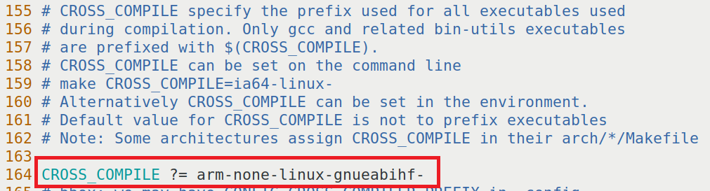
> 图：课件 Slide 19——busybox 顶层 Makefile 修改截图（第 155~164 行）：在第 164 行添加 `CROSS_COMPILE ?= arm-none-linux-gnueabihf-`（红框标出），上方注释说明 CROSS_COMPILE 用于指定编译所用可执行文件的前缀。

与前缀写法的老规矩一致：前缀**以冒号前的 `arm-none-linux-gnueabihf-` 为准**，`gcc` 等后缀不用写。这和实验二十给内核顶层 Makefile 加的那两行是同一件事的小型版。

**就地验证**：`grep -n "^CROSS_COMPILE ?= arm-none" Makefile` 应打出刚改的那行。

### 步骤 2：menuconfig 四处配置（Slide 20~25）

```bash
make menuconfig
```

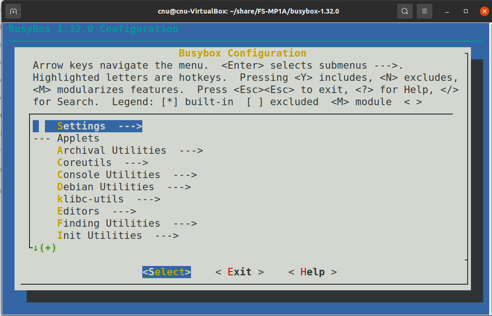
> 图：课件 Slide 20——busybox 配置主界面（Busybox v1.32.0）：Settings、Applets、Archival Utilities、Coreutils、Console Utilities、Debian Utilities、klibc-utils、Editors、Finding Utilities、Init Utilities 等菜单。操作键与内核 menuconfig 同款（方向键/Enter/Esc Esc/`/` 搜索）。

四处配置，每一处都有明确的"为什么"：

**① Settings → Build static binary (no shared libs)——保持不选**：

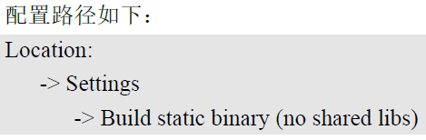
> 图：课件 Slide 21——配置路径：`Location: -> Settings -> Build static binary (no shared libs)`。

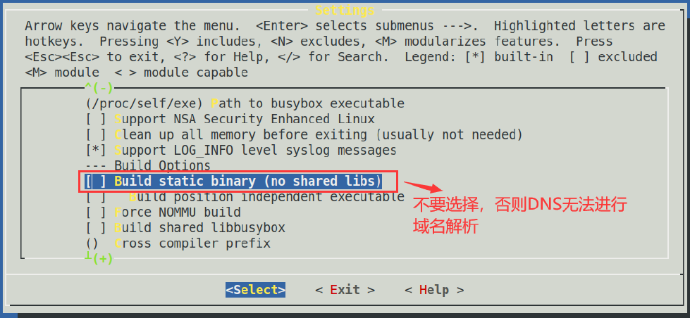
> 图：课件 Slide 21——Settings 菜单实拍：Build Options 下的 `[ ] Build static binary (no shared libs)` 保持未选中（红框 + 红字注明"不要选择，否则 DNS 无法进行域名解析"）。

为什么不用静态库：课件 Slide 25 给了两个理由——静态编译出的文件更大，**且 DNS 功能有问题**（域名解析失灵）。第 6 章之后板子要联网干活，DNS 不能废，所以保持动态连接——代价是要把共享库拷进 lib（步骤 4）。

**② Linux Module Utilities → Simplified modutils——保持不选**：

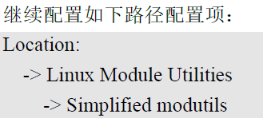
> 图：课件 Slide 22——配置路径：`Location: -> Linux Module Utilities -> Simplified modutils`。

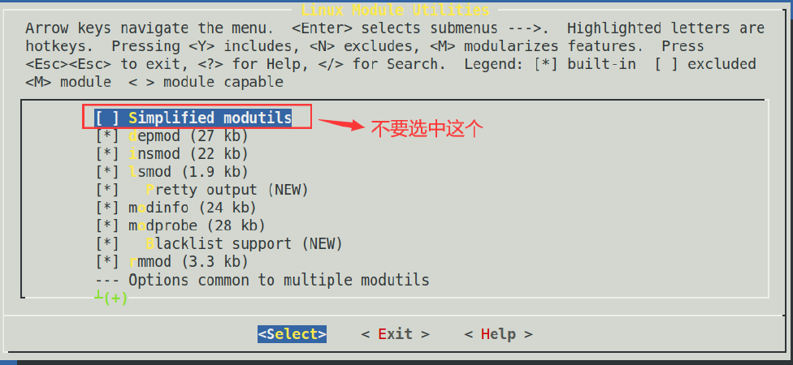
> 图：课件 Slide 22——Linux Module Utilities 菜单实拍：`[ ] Simplified modutils` 未选中；其下 `[*] depmod`、`[*] insmod`、`[*] lsmod`、`[*] modprobe`、`[*] rmmod` 均已选中。

为什么不用 Simplified modutils：它是 modprobe/depmod 的简化替代，一旦选了，完整的模块工具就被顶掉——**第 7 章驱动移植要反复 insmod/rmmod/modprobe 调试**，需要完整版。

**③ Linux Module Utilities → depmod——确保选中**：

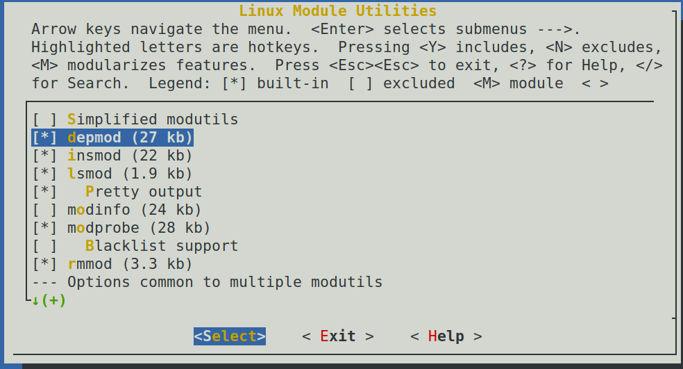
> 图：课件 Slide 23——`[*] depmod (27 kb)` 已选中（高亮）。depmod 分析模块依赖关系生成 modules.dep——实验二十九启动日志会点名要它，第 7 章驱动模块加载前都要跑。

**④ Linux System Utilities → mdev——选中且子项全选**：

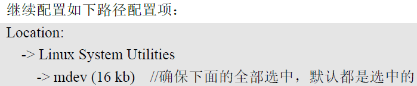
> 图：课件 Slide 24——配置路径：`Location: -> Linux System Utilities -> mdev (16 kb)`，红字注明"确保下面的全部选中，默认都是选中的"。

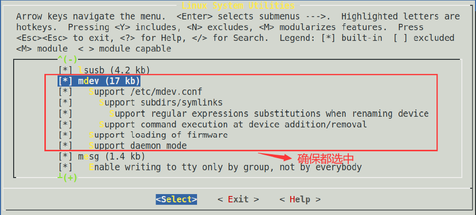
> 图：课件 Slide 24——Linux System Utilities 菜单实拍：`[*] mdev (17 kb)` 已选中，其子项 Support /etc/mdev.conf、Support subdirs/symlinks、Support regular expressions substitutions…、Support command execution…、Support loading of firmware、Support daemon mode 全部选中（红框+红字"确保都选中"）。

mdev 是 /dev 设备文件自动创建的关键（实验二十四第四节）——漏勾它，实验二十六的 rcS 跑到 `mdev -s` 会报 `mdev: applet not found`。

**就地验证**（退出保存后，改完就查）：

```bash
grep -c "CONFIG_STATIC=y" .config           # 应输出 0（静态没勾）
grep "CONFIG_DEPMOD=y\|CONFIG_MDEV=y" .config   # 两行都在
```

### 步骤 3：编译与安装（Slide 26~29）

```bash
make -j4
```

编译几十秒到一两分钟。成功的标志在**最后几行**：


> 图：课件 Slide 26——编译开始的终端截图（busybox-1.32.0 目录下直接 make）。

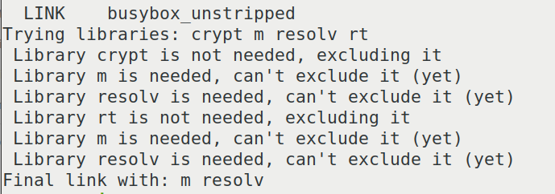
> 图：课件 Slide 26——编译成功的收尾输出：`LINK busybox_unstripped`、`Trying libraries: crypt m resolv rt`、`Library crypt is not needed, excluding it`、`Library m is needed, can't exclude it (yet)`、`Library resolv is needed, can't exclude it (yet)`、`Final link with: m resolv`——**"Trying libraries"那几行是 busybox 在自查依赖哪些共享库**：结论是 libm、libresolv 必需，crypt/rt 不需要。步骤 4 拷库时与 readelf 的结果互相印证。

```bash
make install CONFIG_PREFIX=../rfs-busybox
```

`CONFIG_PREFIX` 指定安装目录（课件用 `../busybox_install`，我们直接叫它未来根文件系统的名字 `rfs-busybox`）；不带它则默认装到源码目录下 `_install/`。安装完验证：

```bash
ls ../rfs-busybox            # 应有 bin  linuxrc  sbin  usr 四样
ls ../rfs-busybox/bin | head # 一排命令名
ls -l ../rfs-busybox/bin/ls  # lrwxrwxrwx ... ls -> busybox（符号连接）
```

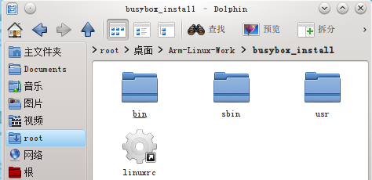
> 图：课件 Slide 28——安装目录总览：`bin`、`sbin`、`usr` 三个目录加一个 `linuxrc` 文件。

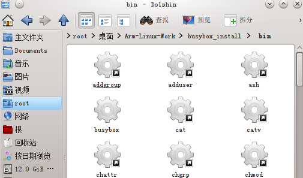
> 图：课件 Slide 28——`bin` 目录内容：addgroup、adduser、ash、busybox、cat、catv、chattr、chgrp、chmod……除了 `bin/busybox` 本体，**其他全部是指向 busybox 的符号连接**（`ls -l` 一眼可验）。

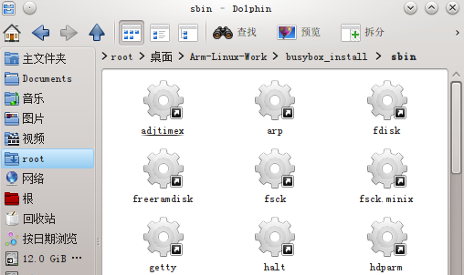
> 图：课件 Slide 28——`sbin` 目录内容：adjtimex、arp、fdisk、freeramdisk、fsck、getty、halt、hdparm 等管理员命令。

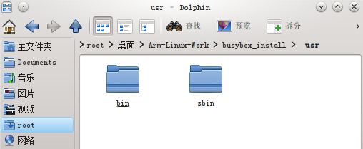
> 图：课件 Slide 28——`usr` 目录下只有 `bin`、`sbin` 两个子目录——结构与根目录呼应，同样装的全是符号连接。

`linuxrc` 与 `sbin/init` 功能完全一样（都是指向 busybox 的连接），内核启动后运行哪个由 bootargs 的 `rdinit=`/`init=` 参数与内核默认值决定——实验二十七的启动日志会看到 `Run /sbin/init as init process`。

### 步骤 4：把 glibc 共享库拷进 lib（Slide 30~33）

busybox 是动态编译的——它在板上运行时需要 C 库。**C 库不用另找，交叉编译器自带**（它编出来的程序本来就按这套库连接）。定位它的官方套路是"先找加载器，再确认库"：

```bash
cd /usr/local/arm/gcc-arm-9.2-2019.12-x86_64-arm-none-linux-gnueabihf
find -name "ld-linux*.so*"
# 应输出 ./arm-none-linux-gnueabihf/libc/lib/ld-linux-armhf.so.3
```

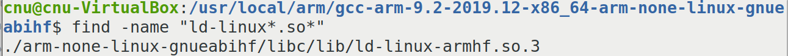
> 图：课件 Slide 30——在编译器安装目录下 `find -name "ld-linux*.so*"`，输出 `./arm-none-linux-gnueabihf/libc/lib/ld-linux-armhf.so.3`——加载器找到了，它所在的 `arm-none-linux-gnueabihf/libc/lib` 就是 glibc 库目录。

```bash
ls arm-none-linux-gnueabihf/libc/lib/libc.so*
# 应输出 arm-none-linux-gnueabihf/libc/lib/libc.so.6 ——glibc 在此确认
```

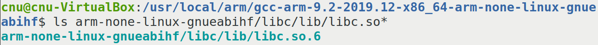
> 图：课件 Slide 30——`ls .../libc/lib/libc.so*` 输出 `libc.so.6`，确认该目录就是 glibc 库所在目录。

这个目录里的东西不全是运行时需要的，按后缀分七类——**我们只要前两类**：

| 类别 | 后缀 | 运行时需要？ |
|---|---|---|
| ① 加载器 | `ld-*.so`、`ld-linux*.so.*` | **要**——负责把程序和它依赖的 .so 接起来 |
| ② 共享库 | `.so`、`.so.[0-9]*` | **要**——动态连接的库文件本体 |
| ③ 目标文件 | `.o`（crt1.o 等） | 不要——编译时连接用的 |
| ④ 静态库 | `.a` | 不要（嵌入式本来就不放） |
| ⑤ libtool 库 | `.la` | 不要——连接工具的数据，运行时无用 |
| ⑥ gconv 目录 | 字符集动态库 | 不要（按需才拷） |
| ⑦ ldscripts 目录 | 连接脚本 | 不要——编译时用 |

好在 ①② 的后缀都是 `*.so*`，一条 `cp` 通吃（`-d` 表示**连符号连接一起原样拷**——libc 目录里 `libc.so.6` 是指向 `libc-2.30.so` 的连接，不加 `-d` 会把整个库实体重复拷一遍）：

```bash
cp arm-none-linux-gnueabihf/libc/lib/*.so* <你的路径>/rfs-busybox/lib/ -d
# lib 目录不存在就先 mkdir ../rfs-busybox/lib
ls ../rfs-busybox/lib | head     # ld-linux-armhf.so.3、libc.so.6、libm.so.6... 在列
```

**验一下拷对了没有**——用 readelf 看 busybox 声明依赖哪些库，与拷进来的对账：

```bash
arm-none-linux-gnueabihf-readelf ../rfs-busybox/bin/busybox -a | grep "Shared"
```

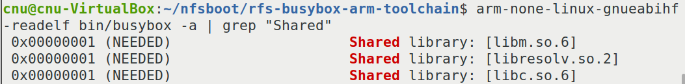
> 图：课件 Slide 33——`arm-none-linux-gnueabihf-readelf bin/busybox -a | grep "Shared"` 输出三条 NEEDED：`libm.so.6`、`libresolv.so.2`、`libc.so.6`（**结果不含加载器**——加载器是内核按 bootargs/约定调的，程序自己不声明）。三条都能在 `rfs-busybox/lib` 里找到对应文件 = 拷库完成。

这一步还留了一手通用的：**以后移植任何第三方程序（第 7 章起会很多），跑不起来第一件事就是用它查依赖**，缺哪个库从编译器里照方抓药。

## 五、注意事项

1. **编译器别用 SDK 那套**：`arm-ostl-linux-gnueabi-`（实验一的）缺库编不了 busybox——报错通常是一堆 `xxx.h: No such file or directory`。认准 `arm-none-linux-gnueabihf-`（实验十九的）。
2. **`cp ... -d` 的 `-d` 不能丢**：丢了的后果是符号连接被展开成实体，lib 目录凭空大出几倍，而且可能漏掉连接本身。
3. **四处配置每一处都要保存**（退出时 `<Save>`），`grep .config` 复核——menuconfig 的老规矩。
4. **安装目录路径不要有中文**（NFS 挂载、tar 解压对中文路径都容易出幺蛾子），按课件惯例放共享目录或 `~` 下。
5. `make` 无参数即可，不需要 `ARCH=`——CROSS_COMPILE 已写进 Makefile，busybox 是纯 C 无架构菜单。

## 六、验证点一览

| 验证点 | 命令 | 通过的样子 | 在哪一步敲 |
|---|---|---|---|
| 编译器就位 | `arm-none-linux-gnueabihf-gcc`（空敲） | 报"没有输入文件"而非 command not found | 开工自检 |
| 前缀已写 | `grep -n "^CROSS_COMPILE ?= arm-none" Makefile` | 打出改的那行 | 步骤 1 |
| 四处配置生效 | `grep "CONFIG_STATIC\|CONFIG_DEPMOD\|CONFIG_MDEV" .config` | STATIC 未选中、DEPMOD/MDEV 均 `=y` | 步骤 2 |
| 编译成功 | `ls -l busybox` | 存在，几百 KB 量级 | 步骤 3 |
| 安装产物齐 | `ls ../rfs-busybox`、`ls -l ../rfs-busybox/bin/ls` | `bin linuxrc sbin usr` 四样；`ls -> busybox` 符号连接 | 步骤 3 |
| 加载器定位 | `find -name "ld-linux*.so*"`（编译器目录里） | `./arm-none-linux-gnueabihf/libc/lib/ld-linux-armhf.so.3` | 步骤 4 |
| 库已拷齐 | `ls ../rfs-busybox/lib \| wc -l` | 几十个 `.so*`（含加载器与三条 NEEDED） | 步骤 4 |
| 依赖对账 | `readelf ../rfs-busybox/bin/busybox -a \| grep Shared` | libm.so.6 / libresolv.so.2 / libc.so.6 三条，lib 里各有其主 | 步骤 4 |

不达标时的排查：

| 现象 | 先查什么 |
|---|---|
| 编译报一堆头文件找不到 | 用错编译器（SDK 那套）——步骤 1 的 Makefile 前缀；`echo $CROSS_COMPILE` 看环境是否残留干扰 |
| 编译报 `CROSS_COMPILE` 相关错误且前缀是空 | Makefile 那行没保存、或改错了行（课件指第 164 行） |
| menuconfig 里找不到 mdev | `/` 键搜 `mdev`，看依赖与位置；确认没勾 Simplified modutils（勾了它菜单会变） |
| 板上（后续实验）busybox 起不来报 `No such file or directory` | lib 目录缺库——readelf 三条对账；缺加载器 `ld-linux-armhf.so.3` 最常见 |
| 拷库后 lib 特别大 | `cp` 忘了 `-d`，符号连接被展开——清空 lib 重拷 |

## 七、实验完成标志

- busybox-1.32.0 解压完成，顶层 Makefile 的 `CROSS_COMPILE` 已指向 `arm-none-linux-gnueabihf-`（步骤 1）
- menuconfig 四处配置完成：静态未勾、Simplified 未勾、depmod 与 mdev（含子项）已勾，`.config` grep 复核通过（步骤 2）
- `make` 编译成功，收尾打出 `Final link with: m resolv`（步骤 3）
- `make install CONFIG_PREFIX=../rfs-busybox` 产物齐全：`bin linuxrc sbin usr`，除 busybox 本体外均为符号连接（步骤 3）
- glibc 库定位到 `.../arm-none-linux-gnueabihf/libc/lib` 并按 `*.so*` + `-d` 拷入 `rfs-busybox/lib`；readelf 三条 NEEDED（libm/libresolv/libc）与 lib 内容对上账（步骤 4）

## 八、下一步：构建 etc 与 dev 目录

骨架有了，但现在的 `rfs-busybox` 还是个"没有灵魂的躯壳"：没有 init 的指令单（inittab）、没有挂载清单（fstab）、没有启动脚本（rcS）、没有 /dev。下一篇（实验二十六）补齐这些——包括 busybox 官方文档里 mdev 的七步流程，以及那个课件预告过的 uevent helper 报错怎么处理。
