# 实验二十六 构建 etc 与 dev 目录——给骨架装上"灵魂"

> **对应课件**：《第6章 构建Linux根文件系统-V2》6.2 节（中），Slide 34-48
>
> **系列说明**：本系列基于华清远见 FS-MP1A（STM32MP157A）开发板，对应课件《第6章 构建Linux根文件系统》。实验二十五的 `rfs-busybox` 有了命令（bin/sbin）和库（lib），但它还不知道**启动后先干什么**（init 看谁的脸色）、不知道**挂哪些文件系统**、`/dev` 还是空的。本篇补齐：写 etc 四件套（inittab / rcS / fstab / profile）、按 busybox 官方文档把 mdev 的设备管理流程跑起来、创建其余空目录——根文件系统从"躯壳"变成"系统"。全程仍在 Ubuntu 里，板子不开；上板点火是实验二十七的事。前置：实验二十五（rfs-busybox 就绪）。

## 一、init 进程的工作方式：一张 inittab 说清楚

内核挂上根文件系统后运行 `sbin/init`（实验二十五装出来的），**init 是 1 号进程，之后的一切程序都是它的子孙**。init 睁眼第一件事读 `/etc/inittab`（没有就用默认行为），按里面的条目创建子进程。每条格式：

```
<id>:<runlevels>:<action>:<process>
```

- `<id>`：该子进程用的控制台，省略 = 与 init 同一个（我们只有 ttySTM0 一个串口，全部省略）；
- `<runlevels>`：busybox 的 init 不用这字段，留空；
- `<action>`：init 怎么对待这个子进程（下表）；
- `<process>`：要执行的程序或脚本；**前面带 `-` 表示"交互的"**（起一个可敲命令的会话）。

`<action>` 的八个取值（课件表 17.6，重点三个加粗）：

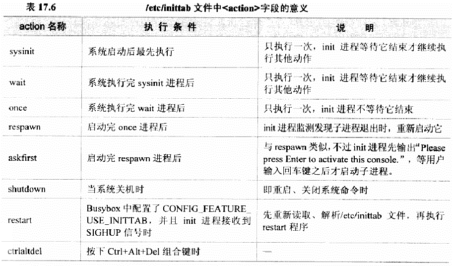
> 图：课件 Slide 36~37——表 17.6《/etc/inittab 文件中\<action\>字段的意义》截图：sysinit、wait、once、respawn、askfirst、shutdown、restart、ctrlaltdel 八行的执行条件与说明（两页课件用的是同一张表截图）。

| action | 什么时候执行 | init 等它吗 |
|---|---|---|
| **sysinit** | **系统启动后最先执行，仅一次** | **等它结束才继续** |
| wait | sysinit 之后，仅一次 | 等 |
| once | wait 之后，仅一次 | 不等 |
| respawn | 启动后**子进程退出就重启它** | 监视 |
| **askfirst** | 与 respawn 类似，但**先打印 "Please press Enter to activate this console." 等你回车才启动** | 监视 |
| shutdown | 关机/重启时 | —— |
| restart | init 收到 SIGHUP 时（需配置 CONFIG_FEATURE_USE_INITTAB） | —— |
| ctrlaltdel | 按 Ctrl+Alt+Del 时 | —— |

> **"Please press Enter to activate this console." 这句话你见过**——实验十六点火出厂内核时，串口最后几行就有它：那是出厂根的 inittab 里某条 `askfirst` 条目干的。本篇我们自己的 inittab 里也写一条，到时候一模一样地出现。

init 的工作节奏总结：启动前期跑 sysinit/wait/once 三类；正常运行期间维持 respawn/askfirst 两类（退了就拉起来）；退出时跑 shutdown/restart/ctrlaltdel 三类。

## 二、实验环境（实际）

| 项目 | 实际值 |
|---|---|
| 操作位置 | Ubuntu 虚拟机，实验二十五的 `rfs-busybox/` 目录；板子不开 |
| 上篇产物 | `rfs-busybox/`（bin、sbin、usr、linuxrc、lib 已齐） |
| 内核基线 | 实验十九~二十二编的 5.4.31（`CONFIG_UEVENT_HELPER` 未开——本篇步骤 5 会用到这个事实） |

> **开工自检（10 秒）**：`ls rfs-busybox` 四样齐全；`ls rfs-busybox/lib | wc -l` 有几十个库。缺了回实验二十五。

## 三、课件 ↔ 步骤对应表

| 课件 Slide | 内容 | 对应步骤 |
|---|---|---|
| 34~37 | 构建 etc：inittab 内容与 action 表 | 步骤 1 |
| 38 | etc/init.d/rcS 脚本 | 步骤 2 |
| 39~41 | fstab 六字段 | 步骤 3 |
| 42 | profile 与 PS1 | 步骤 4 |
| 43~44 | dev 方案：mdev + 内核 Pseudo 配置 + mdev.txt 文档 | 步骤 5 |
| 46 | rcS 最终内容（mdev 七步并入） | 步骤 5 |
| 47 | uevent helper 报错与内核配置 | 步骤 6 |
| 48 | 其他空目录 | 步骤 7 |

### 本篇动作 → 后面谁用 → 现在含糊的后果

| 本篇动作 | 后面哪一篇要用 | 现在含糊的后果 |
|---|---|---|
| inittab 的 `::sysinit:/etc/init.d/rcS` | 实验二十七点火后 init 的第一个动作就是它 | rcS 没跑 = 什么都没挂载 = 系统半死 |
| rcS 里的 mdev 七步 | 实验二十七起 /dev 自动建设备文件 | /dev 空 → 串口外的设备全失联 |
| fstab 的 tmpfs /tmp 行 | 实验二十七启动日志 `mount -a` 的执行对象 | fstab 格式错一行，rcS 第一句就报错 |
| profile 的 PS1 | 实验二十七起命令行提示符的样子（`[root@fsmp1a: /]#`） | 提示符不对不知道是哪个文件在管 |
| uevent helper 报错预告 | 实验二十七点火时若看到 `can't create /proc/sys/kernel/hotplug` 照方抓药 | 以为根文件系统做坏了 |

## 四、实验步骤

以下命令都假设当前在 `rfs-busybox/` 里（`cd rfs-busybox`），`nano` 是顺手工具：**Ctrl+O** 回车保存（这台 Ubuntu 的 nano 是 4.8，底栏就是 `^O 写入`；新版 nano 的 `Ctrl+S` 未默认绑定，按了可能没反应——以 `^O 写入` 为准）、**Ctrl+X** 退出——完整键位卡见实验二十步骤 1，本系列通用。本篇四处文件都是新建，不存在定位问题，nano 直接敲内容即可。

### 步骤 1：写 etc/inittab（Slide 34）

```bash
mkdir -p etc/init.d
nano etc/inittab
```

内容照课件 Slide 34 逐行照抄（六条生效行 + 穿插的六行注释，注释行也照抄，复制出来与课件截图一模一样）：

```
# /etc/inittab
#this is run first except when booting in single-user mode.
::sysinit:/etc/init.d/rcS
# /bin/sh invocations on selected ttys
# start an "askfirst" shell on the console (whatever that may be)
::askfirst:-/bin/sh
# stuff to do when restarting the init process
::restart:/sbin/init
# stuff to do before rebooting
::ctrlaltdel:/sbin/reboot
::shutdown:/bin/umount -a -r
::shutdown:/sbin/swapoff -a
```

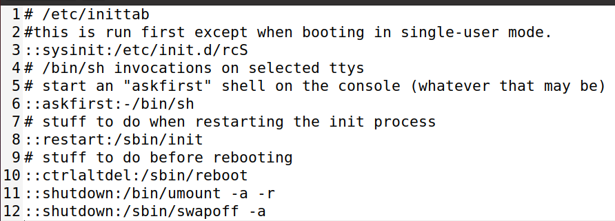
> 图：课件 Slide 34——创建的 `/etc/inittab` 内容（共 12 行）：6 条生效行 `::sysinit:/etc/init.d/rcS`、`::askfirst:-/bin/sh`、`::restart:/sbin/init`、`::ctrlaltdel:/sbin/reboot`、`::shutdown:/bin/umount -a -r`、`::shutdown:/sbin/swapoff -a`，穿插 6 行 `#` 注释——与上面代码块逐行一致。

逐条读生效行（`#` 开头的都是注释，给读者看的，init 不执行）：**第一条是灵魂**——系统起来后 init 等着执行 `/etc/init.d/rcS`（我们的启动脚本，步骤 2）；第二条起一个交互 shell，`-` 表示交互（每次都要回车确认，即那句 "Please press Enter"）；后面四条是重启/关机时的收尾动作。对照第一节的 action 表，六条各就各位。

### 步骤 2：写 etc/init.d/rcS（Slide 38）

```bash
nano etc/init.d/rcS
```

```sh
#!/bin/sh
# This is the first script called by init process
/bin/mount -a

# use mdev
mount -t tmpfs -o size=64k,mode=0755 tmpfs /dev
mkdir /dev/pts
mount -t devpts devpts /dev/pts
mount -t proc proc /proc
mount -t sysfs sysfs /sys
echo /sbin/mdev > /proc/sys/kernel/hotplug
mdev -s
```

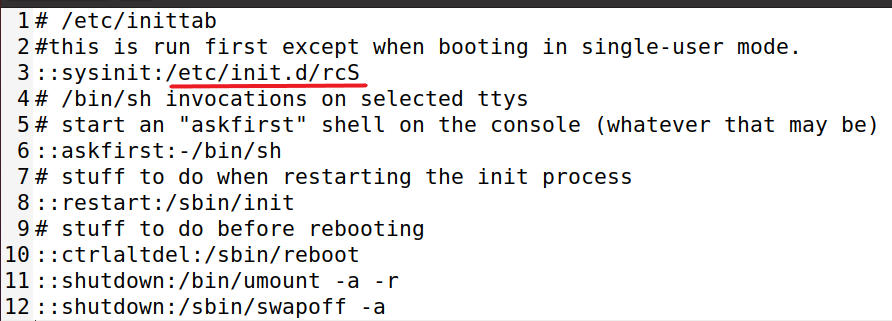
> 图：课件 Slide 38——inittab 内容截图，第 3 行 `::sysinit:/etc/init.d/rcS` 中 `/etc/init.d/rcS` 被下划线标出——**rcS 由 inittab 指定**，两个文件是上下游。

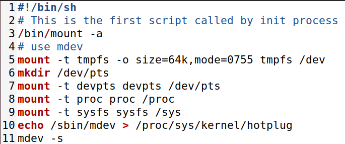
> 图：课件 Slide 38——rcS 脚本内容（第 3 行 `/bin/mount -a` 标注"挂载 etc/fstab 中指定的文件系统"，第 10~11 行标注 mdev 相关）。

逐行读：

| 行 | 干什么 |
|---|---|
| `#!/bin/sh` | 脚本解释器声明 |
| `/bin/mount -a` | **把 fstab（步骤 3）里登记的文件系统全部挂上** |
| `mount -t tmpfs ... tmpfs /dev` | 在 /dev 上挂内存文件系统——设备文件生在内存里，减少对 Flash/eMMC 的读写（实验二十四第一节 tmpfs 的应用） |
| `mkdir /dev/pts` + `mount -t devpts devpts /dev/pts` | 远程虚拟终端（telnet）用的挂载点 |
| `mount -t proc proc /proc` | 挂 proc——`cat /proc/cpuinfo` 的前提 |
| `mount -t sysfs sysfs /sys` | 挂 sysfs——**mdev 的信息源**（下一行） |
| `echo /sbin/mdev > /proc/sys/kernel/hotplug` | 告诉内核："设备插拔时请调用 /sbin/mdev"——内核的热插拔代理 |
| `mdev -s` | 扫描 /sys，**把启动时已存在的设备全部生成对应文件**（s = scan） |

**保存后必须加可执行权限**（课件红字提醒，脚本没有 x 位 init 调不动）：

```bash
chmod +x etc/init.d/rcS
ls -l etc/init.d/rcS        # -rwxr-xr-x，x 位在
```

### 步骤 3：写 etc/fstab（Slide 39~41）

```bash
nano etc/fstab
```

```
# <device>  <mount point>  <type>  <options>  <dump>  <fsck order>
tmpfs       /tmp           tmpfs   defaults   0       0
```

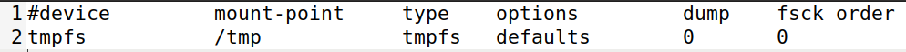
> 图：课件 Slide 39——创建的 `/etc/fstab` 内容：一行 `tmpfs /tmp tmpfs defaults 0 0`。rcS 的 `mount -a` 挂的就是这张表里登记的（proc/sysfs/devpts 在 rcS 里手工挂了，没进表）。

六个字段的含义（本篇只用了一行的量，但字段规则值得记全）：

| 字段 | 含义 | 备注 |
|---|---|---|
| device | 挂什么 | 设备文件（如 /dev/mtdblock1）、NFS 时写 `<host>:<dir>`；**proc/tmpfs 等虚拟文件系统此字段无意义，任意值** |
| mount point | 挂到哪 | 目录需先存在 |
| type | 文件系统类型 | ext4、nfs、sysfs……或 `auto` 让内核自辨 |
| options | 挂载参数 | 逗号分隔，`defaults` = rw,suid,dev,exec,auto,nouser,async 组合 |
| dump | 是否备份 | 0 = 不备份（通用） |
| fsck order | 开机检查顺序 | 0 = 不查；通常根 1、其他 2 |

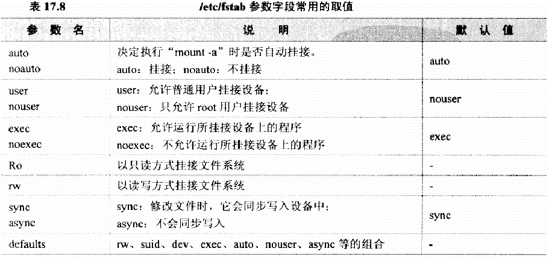
> 图：课件 Slide 40——options 字段常用取值表：auto/noauto（mount -a 是否自动挂）、user/nouser（普通用户可否挂）、exec/noexec（可否运行挂载区程序）、ro/rw（只读/读写）、sync/async（是否同步写盘）、defaults（组合值）。

### 步骤 4：写 etc/profile（Slide 42）

```bash
nano etc/profile
```

```sh
#!/bin/sh
export HOSTNAME=fsmp1a
export USER=root
export HOME=root
export PS1="[$USER@$HOSTNAME: \w]# "
PATH=/bin:/sbin:/usr/bin:/usr/sbin:$PATH
LD_LIBRARY_PATH=/lib:/usr/lib:$LD_LIBRARY_PATH
export PATH LD_LIBRARY_PATH
```

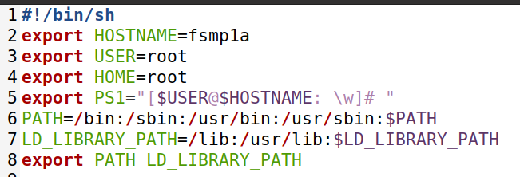
> 图：课件 Slide 42——创建的 `/etc/profile` 内容（第 5 行 `export PS1="[$USER@$HOSTNAME: \w]# "` 标注"PS1 设置命令行提示符"）。**课件截图里 HOSTNAME 写的是 `fsmpl1a`，应为 `fsmp1a` 的笔误**——照录说明，名字本身随便定，实验二十九还会用 profile.d 的方式再改提示符格式。

profile 是**用户登录时**执行的脚本：设提示符（PS1）、补 PATH、告诉动态连接器去哪找库（LD_LIBRARY_PATH）。`\w` = 当前路径、`\u` = 用户名、`\h` = 主机名——实验二十九的 PS1 参数表会展开讲。

### 步骤 5：dev 目录与 mdev 七步（Slide 43~46）

`/dev` 的方案实验二十四定了：mdev 自动管理。先确认内核侧两个前提（我们的内核 5.4.31——实验十九的 multi_v7+fragment 基线——里这两项都是开的，这里只是"查一眼"）：

```bash
grep -E "CONFIG_SYSFS=y|CONFIG_TMPFS=y" <内核源码>/.config
# 两行都应有——sysfs 是 mdev 的信息源，tmpfs 给 /dev 落脚
```

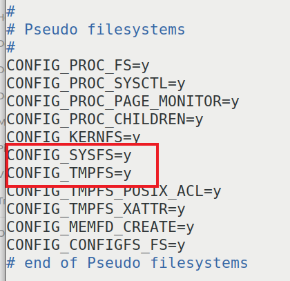
> 图：课件 Slide 43——内核 .config 的 Pseudo filesystems 段：`CONFIG_PROC_FS=y`、`CONFIG_SYSFS=y`、`CONFIG_TMPFS=y`（红框）等。

busybox 源码里的官方说明书 `<busybox源码>/docs/mdev.txt` 给了完整流程：

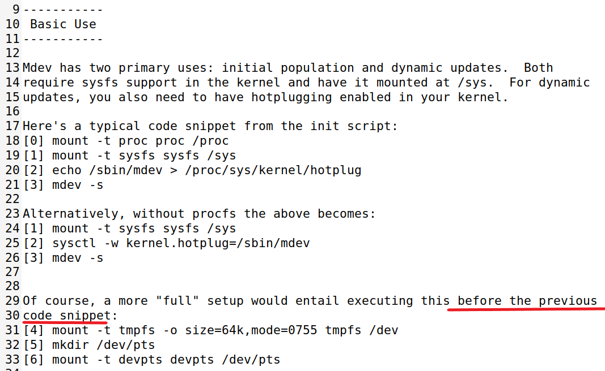
> 图：课件 Slide 44——mdev.txt 节选：mdev 有 initial population（初始生成）与 dynamic updates（动态增删）两种用途，都需要 sysfs 挂在 /sys；文档给出的典型 init 脚本片段 = mount proc、mount sysfs、`echo /sbin/mdev > /proc/sys/kernel/hotplug`、`mdev -s`，更完整的 setup 还要先挂 tmpfs /dev、建 /dev/pts、挂 devpts。

把文档七步对到 rcS 上——**步骤 2 写的 rcS 恰好就是这七步的落地版**：

| mdev.txt 步骤 | rcS 对应行 |
|---|---|
| (1) 挂 tmpfs 到 /dev | `mount -t tmpfs -o size=64k,mode=0755 tmpfs /dev` |
| (2) 建 /dev/pts | `mkdir /dev/pts` |
| (3) 挂 devpts | `mount -t devpts devpts /dev/pts` |
| (4) 挂 proc | `mount -t proc proc /proc` |
| (5) 挂 sysfs | `mount -t sysfs sysfs /sys` |
| (6) 设热插拔代理 | `echo /sbin/mdev > /proc/sys/kernel/hotplug` |
| (7) 扫描生成设备文件 | `mdev -s` |

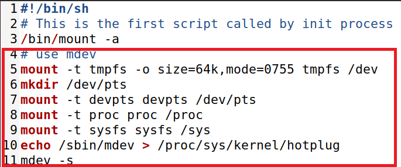
> 图：课件 Slide 46——并入 mdev 相关命令后的 rcS 完整内容（第 4~11 行红框），与步骤 2 我们写的一致。**另按课件提醒：要手工建一个空的 `dev` 目录**——tmpfs 挂上去之前，挂载点得先存在：

```bash
mkdir dev
```

### 步骤 6：认知预告——uevent helper 报错与内核配置（Slide 47）

**本步不动手**——内核的 menuconfig 与重编都归**实验二十七步骤 1**（那边有显式的 `cd` 与完整操作）。现在人在 `rfs-busybox` 里敲 `make menuconfig` 会报：

```text
make: *** 没有规则可制作目标“menuconfig”。  停止。
```

不是坏了，是**站错了地方**——`rfs-busybox` 是根文件系统目录，没有 Makefile；`menuconfig` 是内核源码树的命令，得先回内核顶层（实验二十七步骤 1 第一条就是那个 `cd`）。

课件在此预告了一个上板才会露头的报错，先把它的来龙去脉记下（实验二十七点火时对号）：


> 图：课件 Slide 47——开发板串口输出：`Run /sbin/init as init process`、`/etc/init.d/rcS: line 11: can't create /proc/sys/kernel/hotplug: nonexistent directory`，以及 "Please press Enter to activate this console."。

**报错的成因**：`echo ... > /proc/sys/kernel/hotplug` 需要内核开启 `CONFIG_UEVENT_HELPER`（/proc/sys/kernel/hotplug 这个出口由它提供）。**我们的内核基线是 multi_v7+fragment，这个选项是关的**（2026-09-26 对着 multi_v7_defconfig 查证：只有 fragment-03 里一句 `CONFIG_UEVENT_HELPER_PATH=""`，开关本身默认 n）——所以**这条报错在我们板上必然出现**，不是根文件系统做错了。

修法（课件给的内核配置，实验二十七点火前顺手做）：


> 图：课件 Slide 47——需修改的内核配置路径：`Location: -> Device Drivers -> Generic Driver Options -> Support for uevent helper`（选中）。

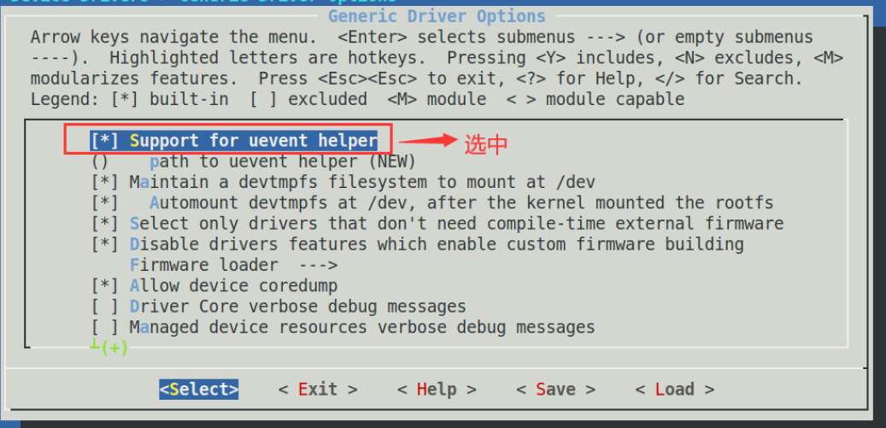
> 图：课件 Slide 47——内核 menuconfig 的 Generic Driver Options 菜单：`[*] Support for uevent helper` 已选中（红框），其下还有 `() path to uevent helper`、`[*] Maintain a devtmpfs filesystem to mount at /dev`、`[*] Automount devtmpfs at /dev...` 等选项。

操作记忆卡（实验二十七步骤 1 展开）：内核顶层 `make menuconfig` → Device Drivers → Generic Driver Options → 勾 `[*] Support for uevent helper` → 退出保存 → `make -j4 uImage dtbs LOADADDR=0xC2000040` 重编 → 按实验二十三的流程把新 uImage 送进 TFTP。

> **顺带一个会让人疑惑的观察，提前说明白**：我们的内核同时开着 `CONFIG_DEVTMPFS` 与 `CONFIG_DEVTMPFS_MOUNT`（multi_v7 默认 y）——内核挂上根后会**自动把 devtmpfs 挂到 /dev 并生成设备文件**。所以点火时你可能看到 /dev 里已经有 ttySTM0 等文件，那是内核 devtmpfs 干的、不是 mdev 没干活；rcS 的 tmpfs + mdev 是课件方案的完整教学版，两者叠加不冲突。看到什么、谁干的，实验二十七的日志里见分晓。

### 步骤 7：其他空目录（Slide 48）

```bash
mkdir proc mnt tmp sys root var usr/lib
ls    # bin dev etc lib linuxrc mnt proc root sbin sys tmp usr var
```

proc、sys、tmp、mnt 是挂载点（rcS/fstab 要往里挂东西），root 是 root 用户的家，var 放可变数据，`usr/lib` 是 profile 里 LD_LIBRARY_PATH 报过的路径（虽然暂时没有库放那里，建上不亏）。

**就地验证**（分两层看，各看各的）：

```bash
ls                    # bin dev etc lib linuxrc mnt proc root sbin sys tmp usr var 十三样
find etc -type f | sort   # etc/fstab  etc/init.d/rcS  etc/inittab  etc/profile 恰四个
```

> **别用 `find . -maxdepth 2 | sort | head -30` 看整棵树**（最初稿就写的它，实测翻车）：`bin` 里有近百个符号连接，排序后全挤在 `./bin/...` 段，`head -30` 里只有 `bin`，`etc` 排在后面根本露不了面——顶层结构交给 `ls`，`etc` 里有什么交给 `find etc`，各看各的才看得全。

## 五、注意事项

1. **rcS 必须有可执行权限**（`chmod +x`）——课件红字；init 调一个没有 x 位的脚本会直接失败，症状是"启动卡住无输出"。
2. **fstab 的字段分隔用 Tab 或空格都行，但列数必须是 6**——少一列 `mount -a` 就报错。
3. **inittab 的 `::askfirst:-/bin/sh` 前导减号不能丢**——丢了它就不是交互会话，回车进不了命令行。
4. **hotplug 报错不是根做错了**——是内核没开 UEVENT_HELPER（本篇步骤 6），去内核 menuconfig 勾上重编，别在根文件系统里打转。
5. etc 下文件的换行必须是 LF——Windows 记事本编辑会带 CRLF，板上 `sh` 会报诡异的 `\r: not found`；在 Ubuntu 里编辑天然无此问题，从 Windows 拷文件时留意。
6. 改错想重来：这些文件都是纯文本，nano 重开覆盖即可；`rfs-busybox` 整个目录删了重做也不过几分钟（busybox 不用重编）。

## 六、验证点一览

| 验证点 | 命令 | 通过的样子 | 在哪一步敲 |
|---|---|---|---|
| inittab 六条在位 | `cat etc/inittab` | sysinit/askfirst/restart/ctrlaltdel/shutdown×2 各一条 | 步骤 1 |
| rcS 可执行 | `ls -l etc/init.d/rcS` | `-rwxr-xr-x` | 步骤 2 |
| fstab 一行四项 | `cat etc/fstab` | `tmpfs /tmp tmpfs defaults 0 0` | 步骤 3 |
| profile 在位 | `head -5 etc/profile` | HOSTNAME/USER/PS1 各行 | 步骤 4 |
| 内核前提 | `grep -E "CONFIG_SYSFS=y\|CONFIG_TMPFS=y" <内核>/.config` | 两行都在 | 步骤 5 |
| dev 空目录 | `ls -d dev` | 目录存在 | 步骤 5 |
| 全树齐 | `find . -maxdepth 1` | bin dev etc lib linuxrc mnt proc root sbin sys tmp usr var | 步骤 7 |

不达标时的排查：

| 现象 | 先查什么 |
|---|---|
| 板上（实验二十七）init 后直接 kernel panic：no init | `sbin/init` 在不在（ls -l 看它是不是指向 busybox 的连接）；bin/busybox 在不在 |
| 板上 rcS 逐行报 `not found` | 脚本换行符是否 CRLF（Windows 中转过文件？）；解释器 `#!/bin/sh` 第一行有没有被 nano 加了多余字符 |
| 板上 /dev 空的 | rcS 的 mdev 段跑没跑（报错行号）；mdev 勾没勾（实验二十五步骤 2）；UEVENT_HELPER 勾没勾（本篇步骤 6） |
| 板上提示符不是 profile 设的样子 | profile 文件名拼写；`-bash` vs `sh` 的差异（busybox ash 登录会读它） |

## 七、实验完成标志

- `etc/inittab` 六条写好，`::sysinit:/etc/init.d/rcS` 在第一有效行（步骤 1 实测）
- `etc/init.d/rcS` 十一行写好、`chmod +x` 落实、权限位可见（步骤 2 实测：`ls -l` 见 `-rwxrwxr-x`，属主执行位在）
- `etc/fstab` 一行 tmpfs /tmp、六字段齐（步骤 3 实测）
- `etc/profile` 写好，PS1 与 LD_LIBRARY_PATH 设上（步骤 4 实测）
- `dev` 空目录与 mdev 七步对上 mdev.txt 文档；内核 SYSFS/TMPFS 均 =y 已 grep 确认（步骤 5 实测）
- uevent helper 报错的成因与修法记下（内核勾 `Support for uevent helper` + 重编，实验二十七落实）（步骤 6）
- `proc mnt tmp sys root var usr/lib` 全建，顶层 `ls` 十三样、`find etc` 四文件（步骤 7 实测）

## 八、下一步：NFS 挂载根文件系统

根文件系统做完了，但它在 Ubuntu 里躺着——怎么让板子用上它？下一篇（实验二十七）搭 NFS：Ubuntu 出一个共享目录，板子的 bootargs 改成 `root=/dev/nfs` 从网络挂根——从此**改根文件系统不用重烧卡**，Ubuntu 里改完板上重启就生效；顺手把 uevent helper 那个内核配置处理掉、点火进我们自己的根文件系统。
