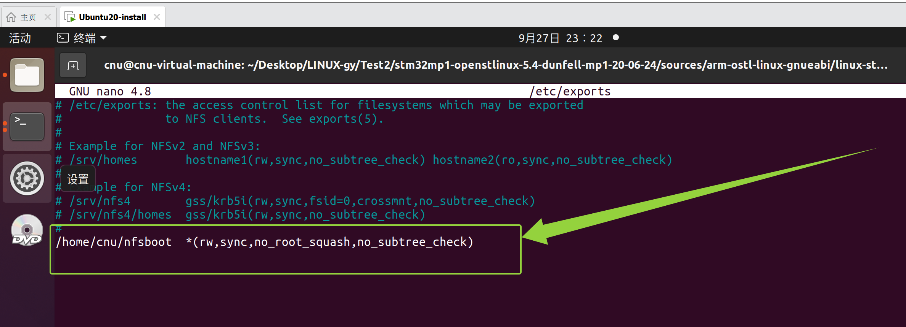
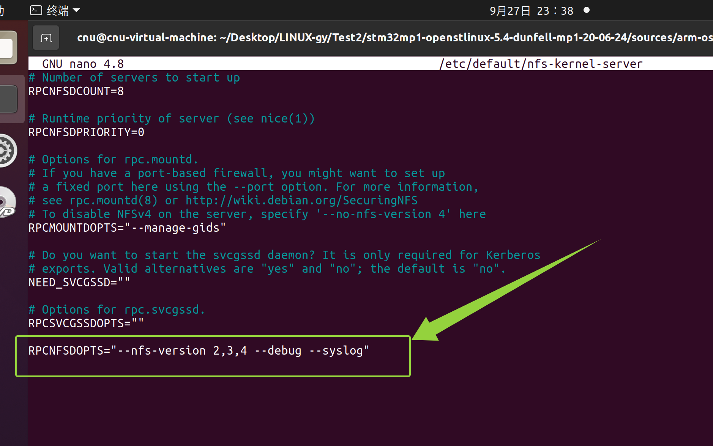
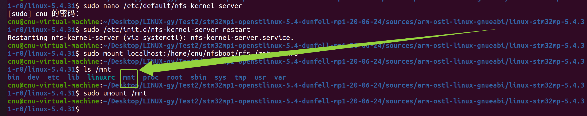
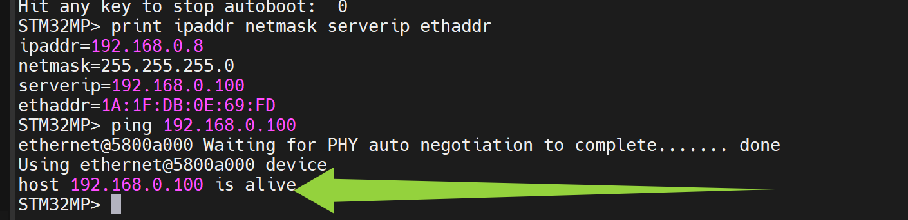
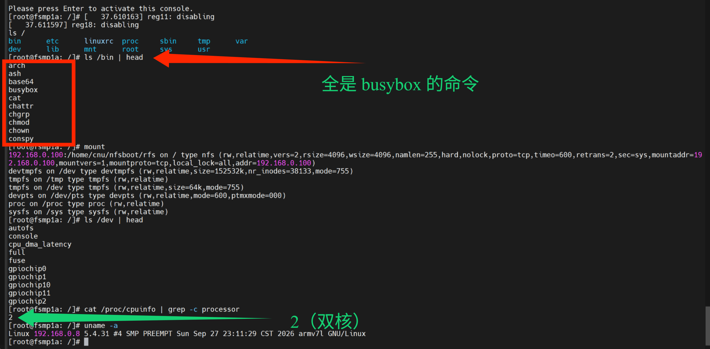

# 实验二十七 NFS 挂载根文件系统——改根不烧卡

> **对应课件**：《第6章 构建Linux根文件系统-V2》6.2 节（下），Slide 49-57
>
> **系列说明**：本系列基于华清远见 FS-MP1A（STM32MP157A）开发板，对应课件《第6章 构建Linux根文件系统》。实验二十五、二十六做的根文件系统还躺在 Ubuntu 里——本篇让板子用上它：Ubuntu 出一个 NFS 共享目录，板子的 `bootargs` 改成从网络挂根。这是第 6 章的**上板大闭环**：点火后 init 跑我们写的 rcS、提示符显示我们 profile 定义的样式——**根文件系统从此是自己的**；而且 NFS 根改起来不用烧卡，Ubuntu 里改完板上重启就生效，后面所有实验都吃这个红利。前置：实验二十六（根文件系统目录树已齐）。

## 一、NFS 是什么，为什么根文件系统要挂它

NFS（Network File System）= 把服务器上的目录通过网络共享出来，客户端像挂本地盘一样挂它。用在根文件系统上，好处一句话：**根在服务器上、板子只管挂**——改个脚本、换个程序、加个库，Ubuntu 里 `cp` 完板子重启即生效，完全不碰烧写。实验十三曾用 U-Boot 的 `nfs` 命令试过一次（四行网关警告 + `T T T` 的教训还记得吗），本篇是它的正戏：内核的 NFS 客户端挂根，U-Boot 只负责把 bootargs 递过去。

拓扑沿用实验十三定档的那套：**板子 `.8` ↔ ASIX USB 网卡（Windows `.99`）↔ VMnet0 桥接 ↔ Ubuntu `ens38` 静态 `.100`**，TFTP 服务器（实验十三）与本篇的 NFS 服务器是同一台 Ubuntu。

## 二、实验环境（实际）

| 项目 | 实际值 |
|---|---|
| 服务器 | Ubuntu 虚拟机 `ens38` = `192.168.0.100`（实验十三配的静态 IP），新增 NFS 服务 |
| 客户端 | 板子（`ipaddr 192.168.0.8`，实验九设的环境）+ 串口 |
| 根文件系统 | 实验二十五/二十六的 `rfs-busybox/` 目录 |
| 内核 | 实验十九~二十二编的 5.4.31，本篇要重编一次（步骤 1） |

> **开工自检（10 秒）**：`ls rfs-busybox` 整棵树齐（实验二十六步骤 7 的 find 清单）；板子能拦停进 `STM32MP>`、`print serverip` = `192.168.0.100`。

## 三、课件 ↔ 步骤对应表

| 课件 Slide | 内容 | 对应步骤 |
|---|---|---|
| 49~53 | 服务器端：装 NFS、建共享目录、配 exports、使能 v2、重启、本机挂载验证 | 步骤 2 |
| 54~56 | 客户端 bootargs：root=/dev/nfs + nfsroot.txt 格式拆解 | 步骤 4 |
| 57 | 禁止 git hash 进版本号（.scmversion） | 步骤 1 |
| 47 | （承实验二十六）uevent helper 内核配置 | 步骤 1 |
| —— | 点火验收：进自己的根文件系统 | 步骤 5 |

### 本篇动作 → 后面谁用 → 现在含糊的后果

| 本篇动作 | 后面哪里还会用 | 现在含糊的后果 |
|---|---|---|
| `/home/cnu/nfsboot/rfs` 共享根 | 第 7 章起所有实验的根文件系统都挂它；实验二十九 buildroot 的产物也放这儿 | 每章都要重烧卡，开发效率归零 |
| bootargs 的 `root=/dev/nfs nfsroot=... ip=...` | 第 6 章之后一切上板实验的启动入口 | 格式错一个冒号，内核找不到根 panic |
| `.scmversion` | 第 7 章 insmod 模块：内核与模块版本串必须一致 | 版本不一致模块加载报 `Invalid module format`，查半天 |
| uevent helper 勾选 | rcS 第 10 行不再报错，mdev 热插拔真正生效 | 报错常驻，还以为根做坏了 |
| "改根不烧卡"的调试模式 | 全系列剩余实验的工作方式 | —— |

## 四、实验步骤

### 步骤 1：内核先重编一次——uevent helper + .scmversion（Slide 47 + 57）

点火之前内核要动两处，一次重编带上：

**① 勾上 uevent helper**（实验二十六步骤 6 预告的报错修法）：

```bash
cd <内核源码>/linux-5.4.31
make menuconfig
#   Device Drivers --->
#       Generic Driver Options --->
#           [*] Support for uevent helper
#   退出时选 Save
grep UEVENT_HELPER .config        # 应有 CONFIG_UEVENT_HELPER=y
```

**② 建 `.scmversion`，按课件要求禁止 git 哈希进版本号**：

```bash
echo "" > .scmversion
```

课件 Slide 57 的原话与红字：第 5 章的编译配置让内核版本号带了 git hash，**每次 git 提交后版本号会变；内核版本号与模块版本号不一致时，模块无法运行**——第 7 章要 insmod 自己编的 `.ko`，两者必须同串。执行 `echo "" > .scmversion` 并重编后，版本号回归纯净的 `5.4.31`；**带哈希的 uImage 文件请保留！保留！保留！（课件原文连写三个，用于检查作业）**——把 `arch/arm/boot/uImage` 先拷一份存档再重编。

> 与实验十九步骤 3.3 的关系，把账记平：实验十九说"课件没要求、建议留着哈希当铁证"——那是第 5 章场景；现在课件第 6 章明确要求建 `.scmversion`（为模块版本一致性，第 7 章马上受益），**建**。两处的道理各自成立：第 5 章排障靠哈希，第 7 章加载模块靠一致。

**③ 重编并送服务器**（一条命令，LOADADDR 老规矩）：

```bash
cp arch/arm/boot/uImage /tmp/uImage-with-hash.bak    # 保留带哈希版（作业检查用）
make -j4 uImage dtbs LOADADDR=0xC2000040
cp arch/arm/boot/uImage /home/cnu/tftpboot/my_uImage
chmod 644 /home/cnu/tftpboot/my_uImage
```

重编后 `Image Name:` 变回干净的 `Linux-5.4.31`——**从此"带不带哈希"不再是出厂/自编的判据**，改看 `uname -a` 的编译者与时间：我们的是 `(cnu@cnu-virtual-machine)` + 当天日期，出厂的是 `(oe-user@oe-host)` + `Apr 8 07:08:47 UTC 2020`。

### 步骤 2：服务器端配置（Slide 49~53）

**装 NFS 服务与客户端工具**：

```bash
sudo apt update
sudo apt install nfs-kernel-server nfs-common
```

**建共享目录，把根文件系统搬进去**：

```bash
mkdir -p /home/cnu/nfsboot
cp -a <你的路径>/rfs-busybox /home/cnu/nfsboot/rfs    # -a 连符号连接与权限一起带
ls /home/cnu/nfsboot/rfs      # bin dev etc lib linuxrc mnt proc root sbin sys tmp usr var
```

**配置 exports（共享清单）**：

```bash
sudo nano /etc/exports
#   末尾加一行：
/home/cnu/nfsboot  *(rw,sync,no_root_squash,no_subtree_check)
```

（nano 键位：改完 **Ctrl+O** 回车保存、**Ctrl+X** 退出——完整键位卡见实验二十步骤 1，本系列通用。）


> 图：实测（顶替课件 Slide 50）——nano 4.8 里改好的 `/etc/exports`：原有内容全是注释掉的示例，末行新增 `/home/cnu/nfsboot  *(rw,sync,no_root_squash,no_subtree_check)`（绿框）。

五个参数逐个懂（课件 Slide 51）：

| 参数 | 含义 |
|---|---|
| `/home/cnu/nfsboot` | 共享目录（步骤里建的那个） |
| `*` | 允许任意客户端 IP 访问（也可写 `192.168.0.*` 收紧） |
| `rw` | 读/写权限 |
| `sync` | 数据同步写内存和磁盘——挂根文件系统用 sync（async 有丢数据风险） |
| `no_root_squash` | 远程 root 在此目录**保有 root 权限**——默认的 root_squash 会把远程 root 压成普通用户，根文件系统就改不动了；课件原话"极不安全，通常只用于挂载根文件系统" |
| `no_subtree_check` | 不检查父目录权限（省事） |

**使能 NFS v2**——开发板内核的 NFS 客户端默认按 v2 协商（课件注明），Ubuntu 的服务端默认可能不开 v2。这个文件是 root 的，要用 `sudo` 打开：

```bash
sudo nano /etc/default/nfs-kernel-server
```

**Ctrl+End** 直接跳到文件末尾（或用方向键滚到底），另起一行加上：

```
RPCNFSDOPTS="--nfs-version 2,3,4 --debug --syslog"
```

（改完 **Ctrl+O** 回车保存、**Ctrl+X** 退出——完整键位卡见实验二十步骤 1，本系列通用。不带 `sudo` 打开的话 nano 是只读的，保存时会报 `[ Error writing /etc/default/nfs-kernel-server: Permission denied ]`。）


> 图：实测（顶替课件 Slide 52）——`/etc/default/nfs-kernel-server` 末行新增 `RPCNFSDOPTS="--nfs-version 2,3,4 --debug --syslog"`（绿框）；上面的 `RPCNFSDCOUNT=8`、`RPCMOUNTDOPTS="--manage-gids"` 等行是 Ubuntu 自带默认，不用动。

**重启服务并本机验证**：

```bash
sudo /etc/init.d/nfs-kernel-server restart
sudo mount localhost:/home/cnu/nfsboot/rfs /mnt -t nfs
ls /mnt           # bin dev etc lib linuxrc mnt proc root sbin sys tmp usr var
sudo umount /mnt  # 看完卸载，别占着
```


> 图：实测（顶替课件 Slide 53）——`nfs-kernel-server.service` 重启成功 + `sudo mount localhost:/home/cnu/nfsboot/rfs /mnt -t nfs` 后 `ls /mnt` 打出 13 样（绿框：`linuxrc` 与 `mnt`）+ 看完 `sudo umount /mnt` 卸载——服务器本地自测通过，NFS 服务工作正常。

**本机这一挂是 NFS 版的"127.0.0.1 自测"**（实验十三 TFTP 的同款思路）：服务器端问题在本机就暴露，别把服务器配置错误带到板子上排查。

### 步骤 3：板子网络复核（实验十三的遗产）

上电拦停进 `STM32MP>`：

```
STM32MP> print ipaddr netmask serverip ethaddr
```

预期：`ipaddr=192.168.0.8`、`netmask=255.255.255.0`、`serverip=192.168.0.100`。哪条不对就 `setenv` 补上 + `saveenv`（实验九/十三的流程）。顺手 `ping 192.168.0.100` 应 `is alive`。


> 图：实测——`print ipaddr netmask serverip ethaddr` 四件套（`ipaddr=192.168.0.8`、`netmask=255.255.255.0`、`serverip=192.168.0.100`、`ethaddr` 与实验九设置一致）+ `ping 192.168.0.100` → **`host 192.168.0.100 is alive`**（绿框）——网络复核全过。

### 步骤 4：bootargs 换成 NFS 根（Slide 54~56）

课件的整串与拆解——**IP 要换成我们拓扑的**（课件板的 client-ip 是 `.2`，我们板是 `.8`；服务器同为 `.100`）：

```
STM32MP> setenv bootargs 'console=ttySTM0,115200 root=/dev/nfs nfsroot=192.168.0.100:/home/cnu/nfsboot/rfs,proto=tcp rw ip=192.168.0.8:192.168.0.100:192.168.0.1:255.255.255.0::eth0:off'
STM32MP> saveenv
```

这串长参数的官方出处是内核文档 `Documentation/filesystems/nfs/nfsroot.txt`，格式：

```
root=/dev/nfs nfsroot=[<server-ip>:]<root-dir>[,<nfs-options>]
ip=<client-ip>:<server-ip>:<gw-ip>:<netmask>:<hostname>:<device>:<autoconf>[:<dns0>:<dns1>]
```

| 字段 | 我们的值 | 说明 |
|---|---|---|
| `root=/dev/nfs` | —— | 告诉内核"根在网络文件系统上"（实验十六的 `unknown-block(0,0)` panic 就是因为当时 root 空着） |
| `nfsroot=<server-ip>:<root-dir>` | `192.168.0.100:/home/cnu/nfsboot/rfs` | 服务器与共享目录，`proto=tcp` 指定传输协议 |
| `ip=<client-ip>` | `192.168.0.8` | **板子自己的 IP**——内核起来后 U-Boot 的环境变量管不着了，IP 必须从这里传 |
| `ip=<server-ip>` | `192.168.0.100` | NFS 服务器 |
| `ip=<gw-ip>` | `192.168.0.1` | 网关——我们实验室没有路由器，同网段通信其实用不到它（实验十三的教训：跨网段才真的需要网关）；照课件格式填着即可 |
| `ip=<netmask>` | `255.255.255.0` | 子网掩码 |
| `ip=<hostname>` | （空） | 主机名，不设 |
| `ip=<device>` | `eth0` | 用哪块网卡——就一个网口 |
| `ip=<autoconf>` | `off` | 不用 DHCP 自动配置（IP 我们手工给死了） |
| `ip=<dns0/1>` | （不写） | DNS，不使用 |

`bootargs` 是环境变量，跟内核文件无关——后面每次 `run mybootnet`（tftp 两个文件 + bootm）都会带着它点火。

### 步骤 5：点火——走进自己的根文件系统

```
STM32MP> tftp c2000000 my_uImage
STM32MP> tftp c4000000 stm32mp157a-fsmp1a.dtb
STM32MP> bootm c2000000 - c4000000
```

<video src="./28_实验二十七_NFS挂载根文件系统.assets/点火_metool.mp4" controls></video>
> 视频：实测点火全程（压缩版 5.2 MB 入库随文档走；原版 11.5 MB 本地留档不入库）——终点即第 6 章终极验收：`Please press Enter to activate this console.` 回车后 **`[root@fsmp1a: /]#`** 提示符出现。

预期日志的看点（自上而下）：

1. `Image Name: Linux-5.4.31`——干净版本串（.scmversion 生效）；编译者要看 `/proc/version`（`uname -a` 里没有这个信息，见步骤 5 末尾的实测说明）；
2. 驱动初始化段：网卡 `stmmac 5800a000.ethernet` + MAE0621A 枚举——**NFS 挂根先过网络这一关**；eMMC 照常在列；
3. `IP-Config: Complete:` 一行——内核按 `ip=` 设好了网络（`device=eth0, addr=192.168.0.8, ... server=192.168.0.100`）；
4. `VFS: Mounted root (nfs filesystem) readonly on device 0:12.` 一类——**根挂上了**（NFS 根默认先只读挂，rw 由 bootargs 的 rw 请求重挂/生效，以实测日志为准）；
5. `Run /sbin/init as init process`——我们 busybox 的 init 上场；
6. **rcS 悄悄跑完**（`mount -a` 挂 tmpfs /tmp、mdev 七步）——若仍见 `can't create /proc/sys/kernel/hotplug: nonexistent directory`，回步骤 1 查 `CONFIG_UEVENT_HELPER=y` 落实没有、内核是否重编并重新 tftp；
7. `Please press Enter to activate this console.` → **回车** → 提示符 `[root@fsmp1a: /]#`——profile 的 PS1 生效，主机名是我们自己定的。

进去后逐项验收：

```
ls /                        # bin dev etc lib linuxrc mnt proc root sbin sys tmp usr var 13 样
ls /bin | head              # 一排 busybox 命令
mount                       # 头行 192.168.0.100:/home/cnu/nfsboot/rfs on / type nfs (rw,…,vers=2…)
                            # + devtmpfs /dev、tmpfs /tmp、tmpfs /dev、devpts、proc、sysfs 各行
ls /dev | head              # console、gpiochip0~2 等一排设备文件（mmcblk2* 排序靠后，head 截不到别慌）
cat /proc/cpuinfo | grep -c processor    # 2（双核）
uname -a                    # Linux 192.168.0.8 5.4.31 #4 SMP PREEMPT <当天日期时间> armv7l GNU/Linux
cat /proc/version           # Linux version 5.4.31 (cnu@cnu-virtual-machine)…——编译者证据在这里
```


> 图：实测——六项验收一屏全收：`ls /` 13 样齐；`ls /bin | head` 全是 busybox 命令（红框）；**`mount` 头行 `192.168.0.100:/home/cnu/nfsboot/rfs on / type nfs (rw,…,vers=2…)`——NFS 根挂上、`vers=2` 说明步骤 2 的 v2 使能真谈成了**，devtmpfs/tmpfs/devpts/proc/sysfs 各行都在；`ls /dev` 一排设备文件；`grep -c processor` 打 `2`（双核，绿注）；**`uname -a` = `Linux 192.168.0.8 5.4.31 #4 SMP PREEMPT Sun Sep 27 23:11:29 CST 2026 armv7l GNU/Linux`——纯净 `5.4.31` 无哈希无 `-dirty`，构建时间戳就是当晚（.scmversion 生效的铁证）**。开头两行 `reg11: disabling`/`reg18: disabling` 是内核收尾时关掉没在用的调节器，无害。

两个与预测不同的实测事实，说清楚：

- **`uname -a` 的主机名是 `192.168.0.8` 不是 `fsmp1a`**——`ip=` 七字段里 hostname 留空时，内核拿 client-ip 当主机名；`[root@fsmp1a: /]#` 里的 `fsmp1a` 来自 `/etc/profile` 的 `export HOSTNAME=fsmp1a`（PS1 用的是它）。两处各管各的，不矛盾。
- **编译者不在 `uname -a` 里**——`uname -a` 只有版本号和构建时间戳；`(cnu@cnu-virtual-machine)` 要 `cat /proc/version` 才看得到。

**第 6 章终极验收达成：U-Boot、内核、设备树、根文件系统——四件全部是自己的。** 玩完 `reboot` 回 U-Boot（NFS 根随便重启，不怕写坏）。

## 五、注意事项

1. **`no_root_squash` 不能漏**——漏了它远程 root 被压权，rcS 里 `mount`/`mkdir /dev/pts` 会报 `Permission denied`（实验二十九微调篇会再遇到一次类似的权限戏，成因不同）。
2. **exports 改完必须 `restart`**：NFS 服务不重启不认新配置；改完先本机 `mount localhost` 验证再上板。
3. **`ip=` 七字段用冒号分隔，数量不能错**——少一个冒号整串解析错乱，症状是内核报 `IP-Config: Unable to set parameters` 或干脆静默拿不到 IP 后卡在 `Waiting for` NFS。
4. **client-ip 是板子的**（`.8`），别照抄课件的 `.2`；server-ip 是 Ubuntu 的 `.100`——这两个 IP 从实验十三沿用，写反了 NFS 找不到服务器。
5. `bootargs` 整串**加单引号**（含空格的老规矩）；saveenv 后 `print bootargs` 逐字核对一遍再点火。
6. 板子与服务器之间**别隔路由器**——同一网段直连（我们的桥接拓扑天然满足）；跨网段要动网关，别自己加戏。
7. 重编内核后**两个文件都要重新 tftp**（uImage 变了、dtb 没变但 DRAM 易失）——bootm 前的老规矩：`md.l` 验魔数。

## 六、验证点一览

| 验证点 | 命令 | 通过的样子 | 在哪一步敲 |
|---|---|---|---|
| uevent helper 已勾 | `grep UEVENT_HELPER <内核>/.config` | `CONFIG_UEVENT_HELPER=y` | 步骤 1 |
| .scmversion 在位 | `ls -l <内核>/.scmversion` | 文件存在；重编后 `make ... uImage` 不再带哈希 | 步骤 1 |
| 带哈希版已存档 | `ls -l /tmp/uImage-with-hash.bak` | 存在（作业检查用） | 步骤 1 |
| NFS 服务在跑 | `sudo /etc/init.d/nfs-kernel-server status`、`exportfs -v` | running；exports 那行在列 | 步骤 2 |
| 本机挂载通 | `sudo mount localhost:/home/cnu/nfsboot/rfs /mnt -t nfs && ls /mnt` | 13 个条目齐全；看完 umount | 步骤 2 |
| rfs 内容齐 | `ls /home/cnu/nfsboot/rfs` | bin dev etc lib linuxrc mnt proc root sbin sys tmp usr var | 步骤 2 |
| 板子网络通 | `ping 192.168.0.100`（U-Boot 里） | `is alive` | 步骤 3 |
| bootargs 正确 | `print bootargs` | 与步骤 4 逐字一致（client-ip=.8） | 步骤 4 |
| 根挂上 | 看点火日志 | `VFS: Mounted root (nfs filesystem)` 一行 | 步骤 5 |
| rcS 跑完无报错 | 看点火日志 | 无 `can't create /proc/sys/kernel/hotplug` | 步骤 5 |
| **进自己的根** | 提示符 + `ls /`、`mount`、`ls /dev`、`uname -a` | `[root@fsmp1a: /]#`；四条命令的输出符合步骤 5 清单 | 步骤 5 |

不达标时的排查：

| 现象 | 先查什么 |
|---|---|
| 卡 `Waiting for` / NFS 超时（一串 `T` 或 `nfs: server ... not responding`） | 服务器 `exportfs -v` 有没有那行；板子 `ping .100` 通不通；`nfsroot=` 路径拼写；v2 使能加了没、服务重启没 |
| `VFS: Unable to mount root fs on unknown-block(2,34)` 一类 | `root=/dev/nfs` 写了没（漏了它内核还在找块设备）；`ip=` 冒号数量 |
| 挂上了但 rcS 全线 `Permission denied` | exports 的 `no_root_squash`；`rfs` 目录是 root 拥有吗（`cp -a` 保留属主，普通用户拷的会变属主——`sudo chown -R root:root /home/cnu/nfsboot/rfs` 归位） |
| rcS 报 `can't create /proc/sys/kernel/hotplug` | 步骤 1 的 `CONFIG_UEVENT_HELPER=y` 与重编、重新 tftp（实验二十六步骤 6） |
| 进了 shell 但提示符是 `/ #` 不是 `[root@fsmp1a: /]#` | profile 没被执行——askfirst 起的是 `-/bin/sh`（登录 shell 会读 profile）；核对 etc/profile 文件名与内容 |
| `Run /sbin/init` 后直接 panic：no init | rfs 里 `sbin/init`（指向 busybox 的连接）与 `bin/busybox` 在不在——`cp -a` 有没有漏 |
| 板子拿到 IP 但挂载报 `Permission denied`（服务器侧日志） | exports 里目录路径写错；`/home/cnu/nfsboot` 权限 |

## 七、实验完成标志

- 内核重编完成：`CONFIG_UEVENT_HELPER=y` 实测在 `.config`、`.scmversion` 就位、`uname -a` 显示纯净 `5.4.31`（`#4` 构建、当晚时间戳），带哈希的 uImage 已存档 `/tmp/uImage-with-hash.bak`（步骤 1 实测）
- NFS 服务器配置完成：exports 五参数在列、v2 使能、服务重启后**本机挂载验证通过**（步骤 2 实测，图 01~03）
- `rfs-busybox` 已搬进 `/home/cnu/nfsboot/rfs`，13 个条目齐全（步骤 2 实测——图 03 本机挂载 `ls /mnt` 可见）
- 板子网络复核：`print` 四件套 + `ping` is alive（步骤 3 实测，图 04）
- `bootargs` 已切换为 NFS 根整串并 saveenv，`client-ip` 为板子的 `.8`（步骤 4 实测——点火进入 NFS 根即整串生效的反证）
- **点火进入自己的根文件系统：`Please press Enter to activate this console.` 回车后 `[root@fsmp1a: /]#` 提示符出现（点火视频入档）；`mount` 头行 `192.168.0.100:/home/cnu/nfsboot/rfs on / type nfs (rw,…,vers=2…)`、`ls /` 13 样、`ls /dev` 设备文件、双核 `2`、`uname -a` 纯净 `5.4.31`——验收一屏全过（步骤 5 实测，图 05——第 6 章终极验收）**

## 八、下一步：buildroot 构建根文件系统

busybox 方案到此全通。但它有先天的不足：只有命令、没有用户体系，移植第三方软件要一个个手动搬库。下一篇（实验二十八）上 buildroot——一条 menuconfig 配到底、自动处理依赖、连用户名密码都能配出来，做出更接近"产品"的根文件系统；两套方案此后并存（NFS 上两个目录，bootargs 改一行即可切换）。
