# 实验二十八 buildroot 配置与编译——一条 menuconfig 造完整根文件系统

> **对应课件**：《第6章 构建Linux根文件系统-V2》6.3 节（上），Slide 58-76
>
> **系列说明**：本系列基于华清远见 FS-MP1A（STM32MP157A）开发板，对应课件《第6章 构建Linux根文件系统》。busybox 方案（实验二十五~二十七）已经全通，但课件 6.3 开门见山数了它的三宗罪：只有命令、目录要手动建；**默认没有用户名密码**，要加也繁琐；移植第三方软件要手动搬库、依赖自己理。buildroot 把这些全自动化：menuconfig 配一遍，工具链选择、目录骨架、用户体系、第三方软件包依赖**一条龙**生成。半导体原厂常用 yocto（ST 的出厂系统就是），但它编译复杂、对网络要求高，教学选 buildroot。前置：实验二十七（NFS 拓扑与流程就绪，buildroot 产物直接进同一个 NFS 目录）。

## 一、buildroot 与 busybox 是什么关系

不是替代，是**包含**：buildroot 生成的根文件系统里，命令部分依然用 busybox（Init system 选 BusyBox、/dev 管理选 mdev——实验二十五配置过的那套，buildroot 会自己编译一份），buildroot 加码的是**外围**：自动建全套目录、自动拷工具链的库、可配置用户名密码、数千个第三方软件包（ssh、iperf、alsa…）勾选即装、依赖自动理清。两套方案实验后并存：`rfs-busybox`（我们自己搭的）与 `rfs`（buildroot 出的）各挂一个目录，bootargs 改一行切换。

## 二、实验环境（实际）

| 项目 | 实际值 |
|---|---|
| 操作位置 | Ubuntu 虚拟机（磁盘要留 10 GB 以上：buildroot 编译产出大）；板子本篇不开 |
| 编译器 | 复用实验十九的 `/usr/local/arm/gcc-arm-9.2-...`（buildroot 配成 External toolchain 引用它，**不自己下工具链**） |
| 材料 | `buildroot-2020.02.6.tar.bz2`（5,568,633 字节，md5 `78f84db2d830c1792508d723cd2f9a44`）——**已复制到本章目录**（与实验二十五的 busybox 同在 `04_构建Linux根文件系统/`，md5 与源一致），拷进虚拟机共享目录解压即可 |
| 网络 | 编译时要**在线下载第三方源码包**（步骤 5 讲对策） |

> **开工自检（10 秒）**：`arm-none-linux-gnueabihf-gcc -v` 报出版本（gcc 9.2.1，步骤 3.2 要用）；虚拟机 NAT 网卡在线；磁盘 `df -h` 剩余 10G+。

## 三、课件 ↔ 步骤对应表

| 课件 Slide | 内容 | 对应步骤 |
|---|---|---|
| 58~59 | busybox 方案的不足、buildroot 选型 | 第一节 |
| 60 | buildroot 2020.02.6 下载 | 步骤 1 |
| 61~63 | Target options 六项 | 步骤 2 |
| 64 | （配说明）file 命令验证大小端 | 步骤 2 |
| 65~69 | Toolchain 十余项（含 kernel headers 换算） | 步骤 3 |
| 70~71 | System configuration（用户名/密码） | 步骤 4 |
| 72 | Filesystem images（保留默认） | 步骤 4 |
| 73 | 禁编 Kernel 与 U-Boot | 步骤 4 |
| 74 | Target packages 勾 kmod | 步骤 4 |
| 75~76 | make 编译、取 rootfs.tar | 步骤 5 |

### 本篇动作 → 后面谁用 → 现在含糊的后果

| 本篇动作 | 后面哪一篇要用 | 现在含糊的后果 |
|---|---|---|
| `output/images/rootfs.tar` | 实验二十九解压到 NFS、微调、上板 | 编译成功却不知道交付物是哪个文件 |
| Toolchain 指向 gcc-arm-9.2 | 实验二十九起任何"在 buildroot 里加包"的编译 | 工具链配错，几百个包全部编译失败 |
| kernel headers 4.20.x 换算法 | 以后换编译器版本时重配 buildroot | 靠猜，配错直接 build 失败 |
| "禁编 Kernel/U-Boot" | ——（负面配置，防跑偏） | 勾了它 buildroot 下载 mainline 内核自己编——没有板级适配、编几个小时还编不对 |
| `make` 不带 `-j` | ——（buildroot 的规矩） | 多线程下下载与解压竞态报错，错得没头绪 |

## 四、实验步骤

### 步骤 1：拿到源码（Slide 60）

官网 https://buildroot.org 下载 2020.02.6；**课程资料包里已有** `buildroot-2020.02.6.tar.bz2`，拷进虚拟机共享目录解压：

```bash
cd <共享目录>
tar xf buildroot-2020.02.6.tar.bz2     # 解出 buildroot-2020.02.6/
cd buildroot-2020.02.6
```

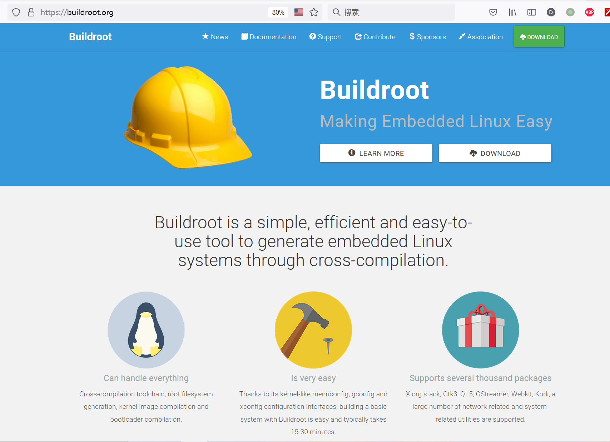
> 图：课件 Slide 60——buildroot 官网首页：口号 "Making Embedded Linux Easy"，三特点——Can handle everything（工具链/根文件系统/内核与 bootloader 一条龙）、Is very easy（类内核 menuconfig，15~30 分钟出基本系统）、Supports several thousand packages（X.org、Qt 5、GStreamer 等数千软件包）。

### 步骤 2：Target options——板子是什么（Slide 61~64）

```bash
make menuconfig
```

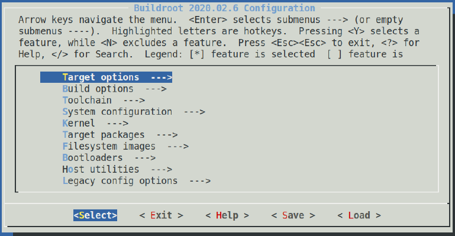
> 图：课件 Slide 61——Buildroot 2020.02.6 配置主界面：Target options、Build options、Toolchain、System configuration、Kernel、Target packages、Filesystem images、Bootloaders、Host utilities、Legacy config options。**操作键与内核/busybox 的 menuconfig 同款**——第 5~6 章三套 menuconfig 一脉相承。

先认全 menuconfig 的**三类项**——busybox 那次只见过第①类：

> ① **勾选项** `[ ]`/`[*]`：光标停在那行按**空格**切换选中/取消（实验二十五的 Build static binary 就是它）。
> ② **单选项** `()`/`(X)`（本篇的 Target Architecture、Target ABI 这些）：一组里**只选一个**，像收音机按钮——光标停在那行按**回车**弹出选择列表，**方向键**移到目标行按**空格**，它前面的括号变成 `(X)`（同组其余项自动让位，**不存在"全选"**），再把光标移到底部 `<Select>` 回车退出。看到 `(X) ARM (little endian)` 就是"已选对"的状态，不是让你把列表里每行都选上。
> ③ **字符串项**（行尾括号里等着填字的，如 Toolchain path、Root password）：回车进入编辑框，敲入或粘贴内容，再回车确认。

**Location 路径怎么读**：`-> Target options -> Target Architecture` = 主界面上方向键把光标移到 `Target options --->` 行、**回车进入**，再在子菜单里找 `Target Architecture` 那行操作。想改配置随时再跑一次 `make menuconfig`——上次保存的内容都在。

配置过程中用 **Esc** 在各级菜单间返回即可，全部配完才在最外层退出并选 **Yes** 保存（中途退出选了 Yes 保存，重进都在）。

**Target options 六项全是单选项**，照 Location 路径表逐项进、逐项选：

| Location 路径 | 设成 |
|---|---|
| `-> Target options -> Target Architecture` | `ARM (little endian)` |
| `-> Target options -> Target Binary Format` | `ELF` |
| `-> Target options -> Target Architecture Variant` | `cortex-A7` |
| `-> Target options -> Target ABI` | `EABIhf` |
| `-> Target options -> Floating point strategy` | `NEON/VFPv4` |
| `-> Target options -> ARM instruction set` | `ARM` |

（列表都是按字母排序，`cortex-A7` 在 Variant 列表的 C 段，方向键往下翻。）

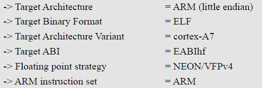
> 图：课件 Slide 62——Target options 的六项参数：Target Architecture = ARM (little endian)、Target Binary Format = ELF、Target Architecture Variant = cortex-A7、Target ABI = EABIhf、Floating point strategy = NEON/VFPv4、ARM instruction set = ARM。


> 图：课件 Slide 62——Target options 菜单标题小截图。

六项与我们板子一一对应（课件 Slide 64 的配置说明）：小端（ARM 默认）、ELF（Linux 可执行程序的格式）、**cortex-A7**（STM32MP157 的 A 核——M4 那核 Linux 不用）、EABIhf + NEON/VFPv4（实验十九讲编译器命名时的 hard float）、ARM 指令集。

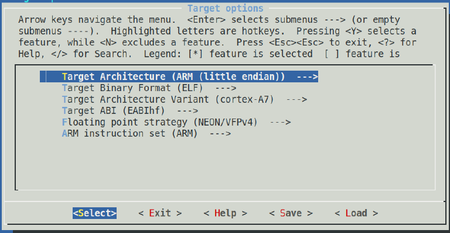
> 图：课件 Slide 63——六项配置完成后的 Target options 菜单截图（每项的括号里显示所选值）。

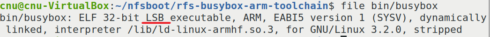
> 图：课件 Slide 64——`file bin/busybox` 验证法：输出 `ELF 32-bit LSB executable, ARM, EABI5 ... dynamically linked, interpreter /lib/ld-linux-armhf.so.3`——**LSB = little endian**（不确定大小端时拿编好的程序用 file 一看便知）。顺手注意 `interpreter /lib/ld-linux-armhf.so.3`——实验二十五拷的那个加载器正是它。

**别现在就敲 `file bin/busybox`**——那是课件在"已经编好的系统"上的认知演示，`bin/busybox` 要等 buildroot 编译完才存在（在 `output/target/bin/` 里），现在敲必报 `No such file or directory`，不是配置错了。而且大小端不用等它：下面 grep 里的 `BR2_ENDIAN` 直接就能验。

**步骤 2 就地验证**（`configuration written to .config` = 已写盘，grep 六项的落点）：

```bash
grep -E "BR2_arm=y|BR2_cortex_a7=y|BR2_ARM_EABIHF=y|BR2_ARM_FPU_NEON_VFPV4=y|BR2_ARM_INSTRUCTIONS_ARM=y" .config
# 应恰打出五行、全部以 =y 结尾——五项选择各落一个符号
grep -E "^BR2_ARCH=|^BR2_ENDIAN=" .config
# 应见 BR2_ARCH="arm" 与 BR2_ENDIAN="LITTLE"（实测注意：大写 LITTLE）——架构与大小端在此确认（ELF 是 ARM 唯一的二进制格式，无独立符号可查）
```

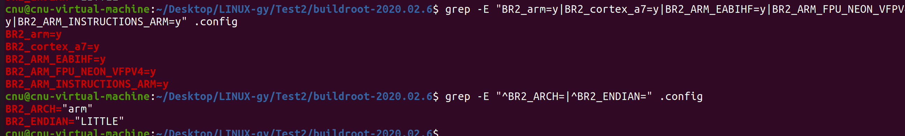
> 图：实测——步骤 2 就地验证两条 grep 的输出：恰五行全 `=y` + `BR2_ARCH="arm"`、`BR2_ENDIAN="LITTLE"`。

### 步骤 3：Toolchain——用哪套编译器（Slide 65~69）

**进菜单**：`make menuconfig` 回主界面 → 方向键把光标移到 **`Toolchain --->`** 行 → **回车进入** → 从上往下按表配；本步配完 **Esc** 返回主界面（步骤 4 还要进 System configuration，最后一起退出保存）。

动手前先解决表里两个**不能照抄、要现场查**的值——**gcc 版本**与 **kernel headers 版本**：

**第一查，gcc 版本**（开工自检跑过，这里正式入册）：

```bash
arm-none-linux-gnueabihf-gcc -v 2>&1 | tail -1
# 末行：gcc version 9.2.1 20191025 ... → 菜单里选 9.x
```

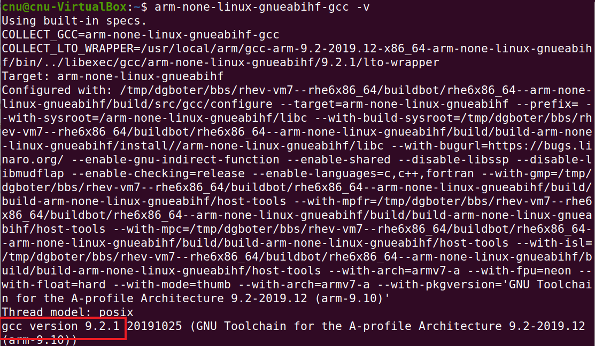
> 图：课件 Slide 68——`arm-none-linux-gnueabihf-gcc -v` 输出，末行 `gcc version 9.2.1 ... (arm-9.10)` 红框标出——对应菜单里的 `9.x`。

**第二查，kernel headers 版本**（课件 Slide 69 的五步算法，值得学一遍——以后任何工具链都这么查）：

```bash
find /usr/local/arm/gcc-arm-9.2-2019.12-x86_64-arm-none-linux-gnueabihf -name version.h
# 会打出三条：认准以 /arm-none-linux-gnueabihf/libc/usr/include/linux/version.h 结尾的那条
# （dvb/version.h 是 DVB 子系统的、plugin/include/version.h 是 gcc 插件自己的，都不是目标）
cat /usr/local/arm/gcc-arm-9.2-2019.12-x86_64-arm-none-linux-gnueabihf/arm-none-linux-gnueabihf/libc/usr/include/linux/version.h | grep LINUX_VERSION_CODE
# 实测打出：#define LINUX_VERSION_CODE 267277
```

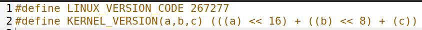
> 图：课件 Slide 69——version.h 内容：`#define LINUX_VERSION_CODE 267277`、`#define KERNEL_VERSION(a,b,c) (((a) << 16) + ((b) << 8) + (c))`。

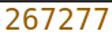
> 图：课件 Slide 69——`267277`（十进制）放大截图。


> 图：课件 Slide 69——`KERNEL_VERSION` 宏定义放大截图。

换算：267277（十进制）→ 0x4140D（十六进制）→ 按 KERNEL_VERSION 宏反推：从低位两位一组拆成 `04.14.0D` → 各组转十进制 → **4.20.13** → 菜单里选 `4.20.x`。宏的定义（a<<16 + b<<8 + c）就是这套算法的出处——版本号三段分别占 16/8/0 位。

两个值到手（选 `9.x` 与 `4.20.x`），现在按 Location 路径表逐项配（"单选"的走回车→空格→`<Select>` 流程，"字符串"的回车进编辑框照抄，"勾选"的空格）：

| Location 路径 | 设成 | 类型 |
|---|---|---|
| `-> Toolchain -> Toolchain type (External toolchain)` | `External toolchain` | 单选 |
| `-> Toolchain -> Toolchain (Custom toolchain)` | `Custom toolchain` | 单选（选了 External 才冒出来） |
| `-> Toolchain -> Toolchain origin` | `Pre-installed toolchain` | 单选 |
| `-> Toolchain -> Toolchain path` | `/usr/local/arm/gcc-arm-9.2-2019.12-x86_64-arm-none-linux-gnueabihf` | 字符串（实验十九装的目录，绝对路径照抄） |
| `-> Toolchain -> Toolchain prefix` | `$(ARCH)-none-linux-gnueabihf` | 字符串（`$(ARCH)` 原样照抄，buildroot 会自己替换成 `arm`） |
| `-> Toolchain -> External toolchain gcc version` | `9.x` | 单选（值来自上面第一查） |
| `-> Toolchain -> External toolchain kernel headers series` | `4.20.x` | 单选（值来自上面第二查） |
| `-> Toolchain -> External toolchain C library` | `glibc/eglibc` | 单选 |
| `-> Toolchain -> Toolchain has SSP support?` | `[*]` | 勾选 |
| `-> Toolchain -> Toolchain has RPC support?` | `[*]` | 勾选 |
| `-> Toolchain -> Toolchain has C++ support?` | `[*]` | 勾选 |
| `-> Toolchain -> Enable MMU support` | `[*]` | 勾选 |

注意顺序：`Toolchain path`/`prefix`/`gcc version`/`kernel headers` 这些子项要**先把 `Toolchain type` 选成 `External toolchain`、`Toolchain` 选成 `Custom toolchain` 才会出现**——从上往下按表配正好。


> 图：课件 Slide 65——Toolchain 配置（一）：Toolchain type = External toolchain、Toolchain = Custom toolchain、Toolchain origin = Pre-installed toolchain、Toolchain path = `/usr/local/arm/gcc-arm-9.2-2019.12-x86_64-arm-none-linux-gnueabihf`、Toolchain prefix = `$(ARCH)-none-linux-gnueabihf`、External toolchain gcc version = 9.x、External toolchain kernel headers series = 4.20.x、External toolchain C library = glibc/eglibc、[*] Toolchain has SSP support?、[*] Toolchain has RPC support?。

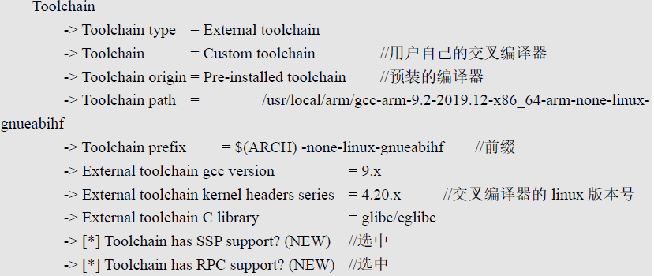
> 图：课件 Slide 65——Toolchain 配置（续）：[*] Toolchain has C++ support? 选中；[*] Enable MMU support 选中。

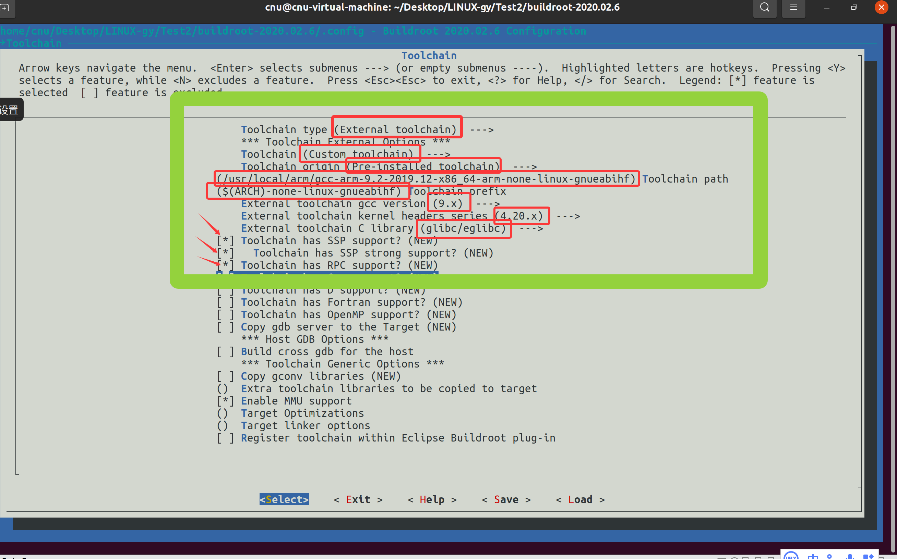
> 图：实测——Toolchain 子菜单按表配置中：前三项单选与 path/prefix 两个字符串项（红框）已就位，gcc version = (9.x)、kernel headers = (4.20.x)、C library = (glibc/eglibc)，SSP/SSP strong/RPC 三项已 `[*]`（红箭头）。**注意拍摄时 `Toolchain has C++ support?` 还是 `[ ]`——它在菜单更下面，十二项配全再出来**；`Enable MMU support` 已 `[*]`。

**为什么这么配（两条关键选择的理由，配完回头看）**：

- **为什么选 External（外部）工具链**：buildroot 也能自己下载构建一套（Buildtoolchain 选项），但要**从网上下载**、极慢；我们实验十九装好的现成货直接引用。
- **为什么必须是 ARM 官方这套**：课件 Slide 66~67 给了源码级证据——buildroot 的 `<源码>/toolchain/helpers.mk` 里 `check_unusable_toolchain` 明确拒绝两类：**发行版系统工具链**（`--sysroot` 返回 "/" 的，Ubuntu 自带 gcc 属此列）与 **ST 官方 SDK 工具链**（`-print-file-name` 返回裸 `libc.a`、无 sysroot 的）——第 3 章那句"SDK 编译器麻烦"在 buildroot 这里有代码背书。

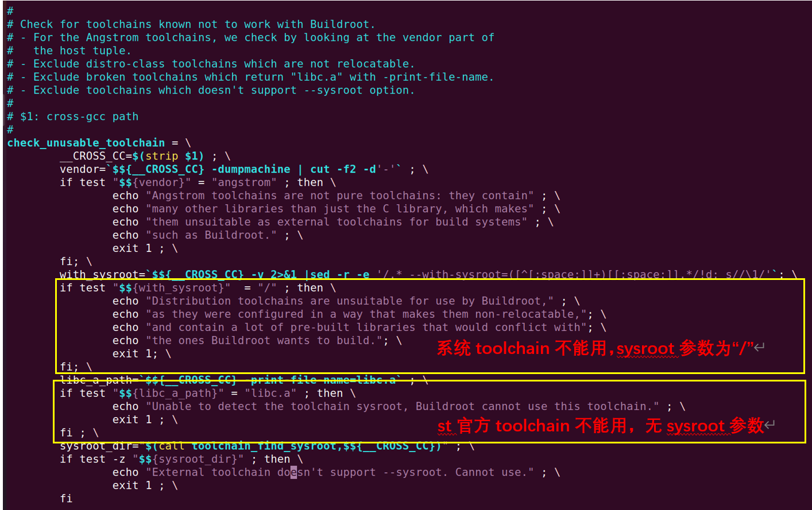
> 图：课件 Slide 67——helpers.mk 的 check_unusable_toolchain 代码截图：`with_sysroot = "/"` 时报 "Distribution toolchains are unsuitable for use by Buildroot..."（系统工具链不可用），`libc_a_path = "libc.a"` 时报 "Unable to detect the toolchain sysroot..."（ST 工具链不可用）。

### 步骤 4：System configuration、Filesystem images 与"两禁一勾"（Slide 70~74)

System configuration 照 Location 路径表逐项配：

| Location 路径 | 设成 | 类型 |
|---|---|---|
| `-> System configuration -> System hostname` | `ATK-stm32mp1` | 字符串（课件值，可自定如 `fsmp1a-buildroot`） |
| `-> System configuration -> System banner` | `Welcome to alientek STM32MP157` | 字符串（登录横幅，可自定） |
| `-> System configuration -> Init system` | `BusyBox` | 单选 |
| `-> System configuration -> /dev management` | `Dynamic using devtmpfs + mdev` | 单选 |
| `-> System configuration -> Enable root login with password` | `[*]` | 勾选（**必勾**，课件红字三感叹号——不勾无法登录） |
| `-> System configuration -> Root password` | `123` | 字符串（**自定义密码，与课件不同**：课件示例 `123456`，我们特意改成短的 `123`——设了什么，实验二十九登录板子就用什么） |


> 图：课件 Slide 70——System configuration 参考配置：System hostname = ATK-stm32mp1（自定，可改 `fsmp1a-buildroot`）、System banner = Welcome to alientek STM32MP157（自定）、Init system = BusyBox、/dev management = Dynamic using devtmpfs + mdev、[*] Enable root login with password (NEW)、Root password = 123456。

- `Init system = BusyBox`、`/dev management = ... mdev`——**buildroot 内部帮我们做了实验二十五/二十六的 busybox 配置与 rcS 那套**；
- `Enable root login with password` **必须勾**（课件红字三感叹号）——不勾无法登录；密码是**自定义的 `123`，跟课件的 `123456` 不一样**——设了什么，实验二十九登录板子就用什么。

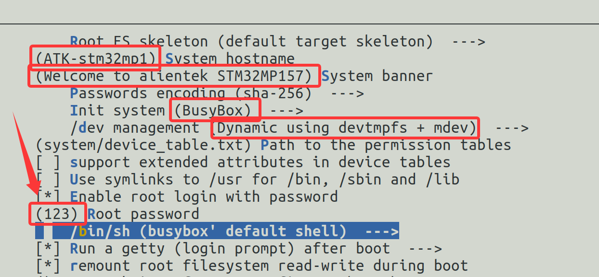
> 图：实测——System configuration 六项完成实况：hostname = (ATK-stm32mp1)、banner = (Welcome to alientek STM32MP157)、Init system = (BusyBox)、/dev management = (Dynamic using devtmpfs + mdev)、`[*] Enable root login with password` 已勾（红箭头）、**Root password = (123)**——自定义密码（课件示例 123456），实验二十九登录就用它。

**Filesystem images 保持课件默认即可**（课件 Slide 72：本阶段先出 rootfs.tar 手动微调，微调好再回头勾 ext4 映像；菜单里 ext2/3/4 = ext4、exact size = 1G 等是将来烧卡时用的）——实测机上这几项本来就是勾好的状态（见下面第二张图）；你如果手动动过也不碍事，判据只有一条：`[*] tar the root filesystem` 必须在，rootfs.tar 就照出：

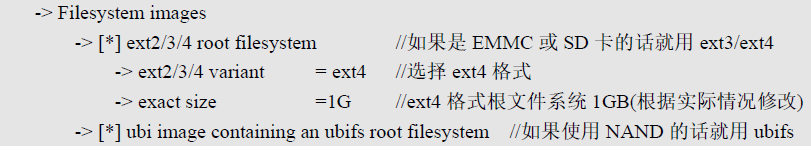
> 图：课件 Slide 72——Filesystem images 参考配置：[*] ext2/3/4 root filesystem（eMMC/SD 用 ext4）、ext2/3/4 variant = ext4、exact size = 1G、[*] ubi image containing an ubifs root filesystem（NAND 用）——本阶段保留默认即可。

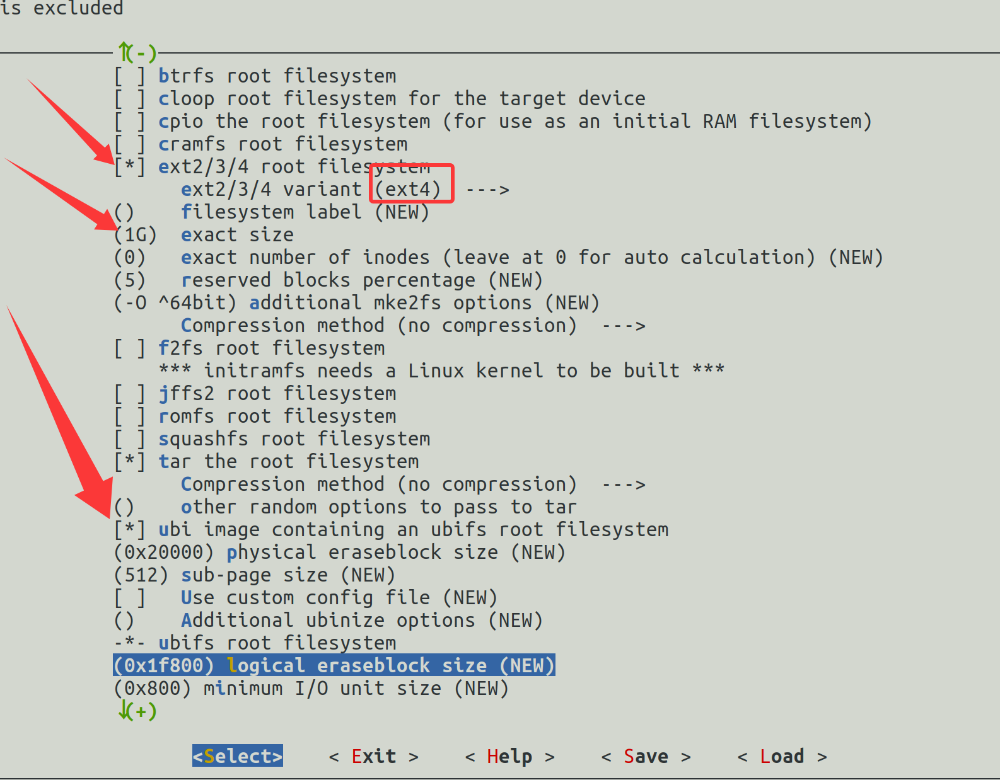
> 图：实测——Filesystem images 实际状态（与课件 Slide 72 图一致）：`[*] ext2/3/4 root filesystem`（variant = ext4、exact size = 1G，红框/红箭头）+ `[*] tar the root filesystem` + `[*] ubi image containing an ubifs root filesystem`。**本篇真正要的是 `[*] tar the root filesystem`——rootfs.tar，实验二十九的交付物**；ext4/ubi 只是 buildroot 顺手多生成几个镜像文件，代价是编译时间与磁盘多一点，rootfs.tar 照出不冲突、不用回滚。

**两禁**（buildroot 不编内核与 U-Boot——它只会下载官方 mainline 版、没有板级适配，我们第 3/5 章的成果直接拿来用）：


> 图：课件 Slide 73——`-> Kernel -> [ ] Linux Kernel`，红字"不要选择编译 Linux Kernel 选项！"


> 图：课件 Slide 73——`-> Bootloaders -> [ ] U-Boot`，红字"不要选择编译 U-Boot 选项！"

**一勾**（Target packages → System tools → `[*] kmod`——内核模块工具，第 7 章驱动要用；buildroot 自带的 kmod 比busybox 的 modutils 功能全）：

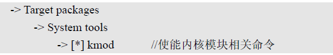
> 图：课件 Slide 74——`-> Target packages -> System tools -> [*] kmod`，使能内核模块相关命令（depmod 等）。

配置完成，退出 Save。**就地验证**：

```bash
grep -E "BR2_arm=y|BR2_cortex_a7=y" .config        # 架构两行
grep -E "BR2_TOOLCHAIN_EXTERNAL_CUSTOM=y|BR2_PACKAGE_KMOD=y" .config   # 工具链与 kmod
grep -E "BR2_LINUX_KERNEL=|BR2_TARGET_UBOOT=" .config   # 应无输出（两禁生效）
```

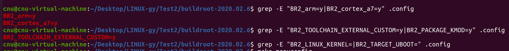
> 图：实测——三条 grep 的现场：架构两行（`BR2_arm=y`、`BR2_cortex_a7=y`）与工具链行（`BR2_TOOLCHAIN_EXTERNAL_CUSTOM=y`）都在列，第三条两禁无输出 ✓。**注意截图这一刻第二条只打出工具链一行——`BR2_PACKAGE_KMOD=y` 没出现，说明当时 kmod 还没勾上**（下一条命令就是 `make menuconfig` 回去补）；kmod 必须补勾（第 7 章模块工具），补完记得重跑 `make` 让 rootfs.tar 带上它。

### 步骤 5：make 编译，取 rootfs.tar（Slide 75~76）

```bash
make          # 注意：不带 -j！buildroot 自己调度并行
```

**下载是第一关**：编译中会从各软件官网拉源码包，国外源慢是常态（课件截图里 cmake 包预计 71 分钟）。对策（课件原方案）：Ctrl+C 终止，看报错/进度里在下的那个包名，手动从镜像下载后放进 `<buildroot源码>/dl/` 目录，再 `make` 续跑——buildroot 认 dl 里已有的包。

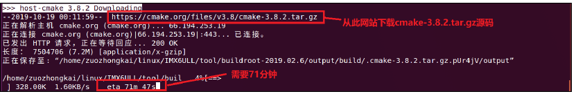
> 图：课件 Slide 75——编译时的下载现场：从 cmake.org 拉 cmake-3.8.2.tar.gz，速度 2.00KB/s、预计 71 分钟（红框）——这不是卡死，是源太慢；按上述对策换手动下载进 dl 目录。

编译时间以几十分钟计（虚拟机 4GB 内存、单线程调度）。成功后看交付物：

```bash
ls output/images/
# rootfs.tar —— 本篇要取的文件；ext2/ext4/ubi/ubifs 是 Filesystem images 里勾了映像
#               顺带生成的（实测五个都在），本篇用不到，放着即可
```

**rootfs.tar 是整棵根文件系统的打包**（不是压缩镜像，是 tar 包），搬进 NFS：

```bash
cp output/images/rootfs.tar /home/cnu/nfsboot/
cd /home/cnu/nfsboot && mkdir rfs-buildroot && tar xf rootfs.tar -C rfs-buildroot
ls rfs-buildroot    # 完整目录树：bin dev etc lib ... usr var，与 busybox 版对照看多了什么
```

（课件把 buildroot 产物目录直接叫 `rfs`——我们已经有 busybox 版占着 `rfs` 名字，另起 `rfs-buildroot`，实验二十九的 bootargs 指向它；想换回 busybox 版只需把 bootargs 的 nfsroot 路径改回去。）

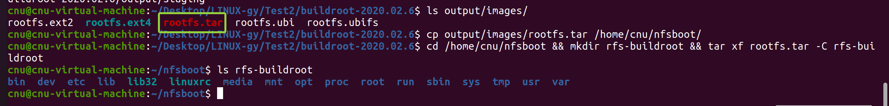
> 图：实测——步骤 5 全程一屏：`ls output/images/` 打出**五个产物**（ext2/ext4/**tar** 绿框/ubi/ubifs——映像全生成了，这就是 Filesystem images 勾了 ext4 与 ubi 的直接后果）；`cp` 进 NFS 目录；解包后 `ls rfs-buildroot` 打出 **18 样**——比 busybox 版（13 样）多出 `lib32`、`media`、`opt`、`run` 等，buildroot 的目录骨架就是全。

## 五、注意事项

1. **`make` 不要加 `-j`**：buildroot 自己做任务级并行，外加 `-j` 反而把下载/解压搅出竞态错误。
2. **下载卡住不是死机**：看屏幕上正在拉的包名与 URL，手动下进 `dl/` 再续 `make`；下载 URL 都在 `output/build/` 各包目录的 `.stamp_downloaded` 附近可查。
3. **Toolchain path 填到"bin 的祖父目录"**（即包含 `arm-none-linux-gnueabihf/bin/` 的那一层 `/usr/local/arm/gcc-arm-9.2-...`），prefix 填 `$(ARCH)-none-linux-gnueabihf`——buildroot 自动展开 `$(ARCH)=arm`。
4. **两禁必须落实**：勾了 Kernel/U-Boot 的 buildroot 会去下 mainline 源码自编，无板级适配、必失败，白烧几小时。
5. `Enable root login with password` 不勾的话板子上**登录不进去**（没有可用凭据），这是课件红字级别的要求。
6. 编译失败先看最后 30 行日志（`make 2>&1 | tee build.log` 是好习惯），绝大多数是下载失败——回 dl 目录对策。

## 六、验证点一览

| 验证点 | 命令 | 通过的样子 | 在哪一步敲 |
|---|---|---|---|
| 工具链可用 | `arm-none-linux-gnueabihf-gcc -v` | 末行 `gcc version 9.2.1` | 开工自检 |
| 架构配置 | `grep BR2_cortex_a7=y .config` | `BR2_cortex_a7=y` | 步骤 2 |
| 工具链指向 | `grep BR2_TOOLCHAIN_EXTERNAL_CUSTOM=y .config` | 有输出；path 值指到 gcc-arm-9.2 目录 | 步骤 3 |
| kernel headers | version.h 的 `LINUX_VERSION_CODE` 换算 | 267277 → 4.20.13 → 菜单 `4.20.x` | 步骤 3 |
| 两禁生效 | `grep "BR2_LINUX_KERNEL=\|BR2_TARGET_UBOOT=" .config` | 无输出 | 步骤 4 |
| kmod 已勾 | `grep BR2_PACKAGE_KMOD .config` | `BR2_PACKAGE_KMOD=y`；打出 `# ... is not set` = 没勾上 | 步骤 4 |
| root 密码勾选 | `grep BR2_TARGET_GENERIC_ROOT_PASSWD .config` | 有值（空密码也是 `= ""` 且 LOGIN 开关在） | 步骤 4 |
| 编译成功 | `ls -l output/images/rootfs.tar` | 文件存在（实测 **3,450,880 字节 ≈ 3.3 MiB** 含 kmod；首编 3,389,440 不含——最小系统就这么大，别等"几十 MB"） | 步骤 5 |
| 产物解包 | `ls /home/cnu/nfsboot/rfs-buildroot` | 完整目录树（bin dev etc lib proc ...） | 步骤 5 |

不达标时的排查：

| 现象 | 先查什么 |
|---|---|
| menuconfig 里找不到某项 | `/` 键搜符号名（如 `BR2_PACKAGE_KMOD`），看依赖与所在菜单 |
| 编译一开始就报 toolchain 相关 | Toolchain path/prefix 拼写；gcc 版本与 kernel headers 选对没（步骤 3 的两处"查出来"） |
| 报 `Distribution toolchains are unsuitable` | 工具链选错成系统 gcc——按 helpers.mk 的两条判据（Slide 67）核对 |
| 编译中停在某个包下载 | 不是死机——记下包名，手动下进 `dl/`，重新 `make` |
| 编译报错在某个包 | 看最后 30 行；多为下载不完整——删 `output/build/<包名>` 与 dl 里的坏包重编 |
| 磁盘满 | buildroot 产出 10 GB 量级，`df -h` 先看；清理 `output/` 重建 |

## 七、实验完成标志

- buildroot-2020.02.6 解压就位，menuconfig 六站配置完成：Target options 六项、Toolchain（External/Custom/Pre-installed + path/prefix/gcc 9.x/headers 4.20.x/glibc/SSP/RPC/C++/MMU）、System configuration（hostname/banner/BusyBox init/mdev/root 登录，自定义密码 `123`）、Filesystem images 保持课件默认（实测状态与 Slide 72 一致）、Kernel 与 U-Boot 双禁（步骤 2~4 实测，图 07/14/17/19/20）
- `.config` 的 grep 验证全部符合（步骤 4 实测，图 20）；**kmod 首验漏勾（`grep` 见 `# BR2_PACKAGE_KMOD is not set`），回菜单按 `/` 搜 KMOD 定位补勾、重编后打出 `BR2_PACKAGE_KMOD=y`**（步骤 4 实测）
- `make` 编译成功，`output/images/` 生成 rootfs.tar 等**五个产物**（rootfs.tar 终值实测 **3,450,880 字节**，首编 3,389,440——多出的 61,440 就是补勾 kmod 的体量；映像类是 Filesystem images 勾选的顺带产物，步骤 5 实测，图 25）
- rootfs.tar 已解包到 `/home/cnu/nfsboot/rfs-buildroot`，目录树 18 样完整（步骤 5 实测，图 25）

## 八、下一步：buildroot 根文件系统微调

buildroot 出的根文件系统拿去就能启动，但课件预备了四个"见面礼"：Set UID 权限错误、/lib/modules 缺目录、depmod/modules.dep 报错、命令行提示符不合心意——下一篇（实验二十九）逐个化解并点火验收，顺带把 debugfs 挂载脚本与"启动时自动跑 S 开头脚本"的机制一起学了。
