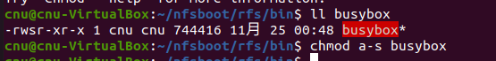
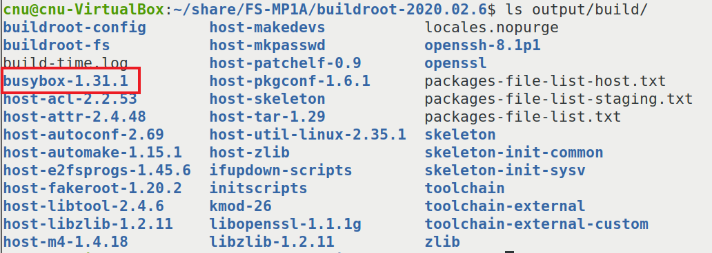
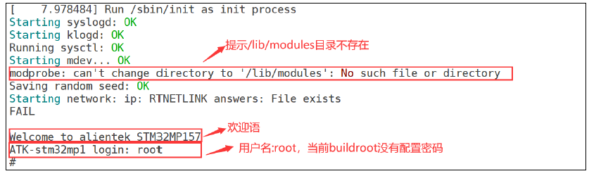
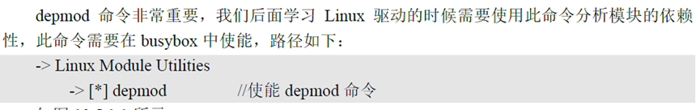
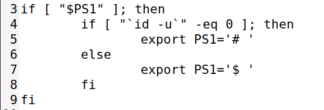
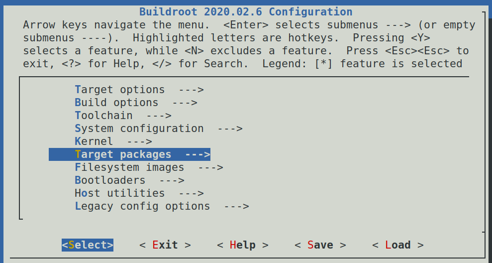
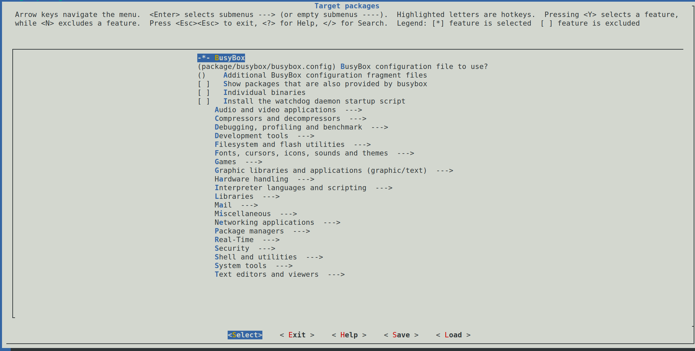

# 实验二十九 buildroot 根文件系统微调——从"能启动"到"趁手"

> **对应课件**：《第6章 构建Linux根文件系统-V2》6.3 节（下），Slide 77-90
>
> **系列说明**：本系列基于华清远见 FS-MP1A（STM32MP157A）开发板，对应课件《第6章 构建Linux根文件系统》。实验二十八的 `rootfs.tar` 解包进了 NFS，本篇把 bootargs 指过去点火——然后按课件的剧本处理启动路上的四个报错（Set UID 权限、/lib/modules、depmod/modules.dep）、把命令行提示符调顺手、挂上驱动调试要用的 debugfs。**这是第 6 章的收官篇：修完这四个错，buildroot 根文件系统进入日常服役**。前置：实验二十八（rfs-buildroot 就绪）、实验二十七（NFS 流程熟）。

## 一、本篇的三段式路线图

| 段 | 干什么 | 预期结果 |
|---|---|---|
| 第一段 | bootargs 指向 `rfs-buildroot` 点火 | 系统起来，但按课件剧本会报一串权限类错误 |
| 第二段 | 四个报错逐个化解（busybox Set UID / /lib/modules / depmod / modules.dep） | 启动日志干净，能登录能操作 |
| 第三段 | 提示符微调 + debugfs 挂载 + Target packages 展望 | 命令行趁手，第 6 章收官 |

## 二、实验环境（实际）

| 项目 | 实际值 |
|---|---|
| 操作位置 | 板子串口（点火与验收）+ Ubuntu（改文件、重打包） |
| 根文件系统 | `/home/cnu/nfsboot/rfs-buildroot`（实验二十八产物）——**NFS 根，改完重启即生效** |
| 内核 | 实验二十七重编后的 5.4.31（纯净版本串 + uevent helper 已开） |

> **开工自检（10 秒）**：`ls /home/cnu/nfsboot/rfs-buildroot` 目录树齐；`print bootargs` 里的 nfsroot 路径待改（现在是 busybox 版的 `rfs`）。

## 三、课件 ↔ 步骤对应表

| 课件 Slide | 内容 | 对应步骤 |
|---|---|---|
| 77~78 | 启动报错一：权限类错误与 busybox 的 Set UID | 步骤 2 |
| 79 | （可选）make busybox-menuconfig 微调 busybox | 步骤 2 末 |
| 80~83 | 启动报错二三四：/lib/modules、5.4.31 目录、modules.dep | 步骤 3 |
| 84~86 | 命令行提示符：/etc/profile.d/myprofile.sh 与 PS1 参数 | 步骤 4 |
| 87~88 | 挂 debugfs：/etc/init.d/Sautorun 与 rcS 的 S??* 机制 | 步骤 5 |
| 89~90 | Target packages：第三方软件按需加 | 步骤 6 |

### 本篇动作 → 后面谁用 → 现在含糊的后果

| 本篇动作 | 后面哪一篇要用 | 现在含糊的后果 |
|---|---|---|
| `/lib/modules/5.4.31/`（含 modules.dep） | **第 7 章 insmod 驱动模块的必经之地**——模块就装在这个版本目录里 | 目录没建好，模块加载第一关就卡 |
| `chmod a-s busybox` 的 Set UID 概念 | 以后任何"root 也报 Permission denied"的怪象 | 把权限问题误判成文件系统坏了 |
| rcS 遍历 `S??*` 的机制 | 第 7 章起写自己的开机自启脚本（S 开头放 init.d 即可） | 不知道自启脚本放哪、命名有什么讲究 |
| debugfs 挂载 | 第 9 章设备树/驱动调试要看 `/sys/kernel/debug` | 调试目录空空如也，以为内核没编好 |
| bootargs 双根切换 | 日常：busybox 版 `rfs` 与 buildroot 版 `rfs-buildroot` 想用哪个改一行 | 只会一条路走到黑 |

## 四、实验步骤

### 步骤 1：bootargs 切到 buildroot 根，点火

```
STM32MP> setenv bootargs 'console=ttySTM0,115200 root=/dev/nfs nfsroot=192.168.0.100:/home/cnu/nfsboot/rfs-buildroot,proto=tcp rw ip=192.168.0.8:192.168.0.100:192.168.0.1:255.255.255.0::eth0:off'
STM32MP> saveenv
STM32MP> run mybootnet
```

与实验二十七比只改了 nfsroot 的目录名——这就是"双根并存、改一行切换"。

### 步骤 2：报错一——权限类报错与 busybox 的 Set UID（Slide 77~78）

点火后按课件剧本会看到这样一串：


> 图：课件 Slide 77——启动串口输出（报错段）：`Run /sbin/init as init process`、`mount: you must be root`（两条）、`mkdir: can't create directory '/dev/pts': Permission denied`、`mkdir: can't create directory '/dev/shm': Permission denied`、`hostname: sethostname: Operation not permitted`、`Starting syslogd: OK`、`Starting mdev... OK`、`Starting network: ip: RTNETLINK answers: Operation not permitted FAIL`、`can't open /dev/console: Permission denied`（多条）——**注意后面的 Starting syslogd: OK 等又都是好的**，报错集中在开头那批。

**按"现象 → 根因 → 定位 → 修法"拆**：

- **现象**：明明以 root 登录，mount/mkdir/hostname 却报"没权限"；而 syslogd、mdev 又都 OK。
- **根因**：buildroot 打包时给 `bin/busybox` 设了 **Set UID 位**（`s`）——带这位的程序，**任何用户执行时都按"属主"身份跑**。`rootfs.tar` 在 Ubuntu 里解包后属主是普通用户（我们 `tar xf` 的那个账号），于是 busybox 被当成"普通用户"在跑——root 身份反而不被认。这正好用上实验二十四的文件类型/权限知识：权限串里那个 `s` 就是病根。
- **定位**：Ubuntu 里看一眼：

```bash
cd /home/cnu/nfsboot/rfs-buildroot/bin
ls -l busybox        # -rwsr-xr-x ... ——— 权限里的 s 就是 Set UID
```


> 图：课件 Slide 78——`ll busybox` 显示 `-rwsr-xr-x 1 cnu cnu 744416 ...`（属主还是解包用户 cnu、权限带 s），随后 `chmod a-s busybox` 去掉 Set UID 权限。

- **修法**：去掉 Set UID 位（顺手把属主归 root 更彻底）：

```bash
chmod a-s busybox
sudo chown -R root:root /home/cnu/nfsboot/rfs-buildroot    # 顺手把整棵树属主归位
```

板子上 `reboot`（NFS 根，重启即生效）——开头那批 Permission denied 应清零，能顺利到登录提示，输入 `root`（密码 `123`——实验二十八**步骤 4** 设置的自定义密码，不是课件示例的 123456）进入。

> **（可选）buildroot 里微调 busybox**（Slide 79）：`make busybox-menuconfig` 可直接进 busybox 配置界面（参考实验二十五的四处配置，本篇按课件说明"此处不需要修改"）；改了配置后要重跑 `make` 生成新 rootfs.tar；busybox 源码就在 `output/build/busybox-1.31.1/`。


> 图：课件 Slide 79——`ls output/build/` 输出：busybox-1.31.1（红框）、kmod-26、openssh-8.1p1、toolchain-external-custom 等——buildroot 编译的所有包都在这个目录里，微调/排障的"现场"。

### 步骤 3：报错二三四——/lib/modules 一家三口（Slide 80~83）

权限清零后，启动日志里还剩三连报（都是 modprobe 打的）：


> 图：课件 Slide 80——报错 `modprobe: can't change directory to '/lib/modules': No such file or directory`；下方是欢迎语 "Welcome to alientek STM32MP157" 与 `ATK-stm32mp1 login: root`（截图里 buildroot 未配密码）。


> 图：课件 Slide 81——建了 /lib/modules 后的下一报：`modprobe: can't change directory to '5.4.31': No such file or directory`——它在找"与内核版本同名的目录"。


> 图：课件 Slide 81——文字说明：**depmod 命令非常重要，后面学习 Linux 驱动时需要用它分析模块的依赖性**，需在 busybox 中使能（`-> Linux Module Utilities -> [*] depmod`）——实验二十五步骤 2 的第③处勾选在此兑现（buildroot 版若是新编的 busybox，同样去勾）。


> 图：课件 Slide 82——第三报：`modprobe: can't open 'modules.dep': No such file or directory`——目录有了，模块依赖清单没有。

三个报错其实是**同一个故事的三集**：modprobe 开机要按"内核版本号命名的目录 + modules.dep 清单"找工作，这棵树在 buildroot 产物里还不存在（我们的内核是第 5 章自己编的，buildroot 不知道它）。修法一层层补齐：

```bash
# Ubuntu 侧（NFS 根直接改）：
mkdir -p /home/cnu/nfsboot/rfs-buildroot/lib/modules/5.4.31
```

第三集的 modules.dep 在**板子上**生成——buildroot 自带完整版 depmod（实验二十八勾的 kmod，比 busybox 版强）：

```
[root@fsmp1a-buildroot: /]# depmod
# 若仍报权限，把清单放行：
chmod 777 /lib/modules/5.4.31/modules.dep
```

`reboot` 复验——modprobe 三连报应清零。**`/lib/modules/5.4.31/` 这个目录第 7 章天天要用**：编出的 `.ko` 模块就放进去，`modprobe` 靠 modules.dep 找依赖。

### 步骤 4：命令行提示符微调（Slide 84~86）

buildroot 默认提示符单调。buildroot 的 `/etc/profile`（与实验二十六手写的那份同一机制）末尾有一段：登录 shell 会遍历执行 `/etc/profile.d/` 下的 `.sh` 文件——**加文件不改原文件**，这是配置系统的通用好习惯：

```bash
nano /home/cnu/nfsboot/rfs-buildroot/etc/profile.d/myprofile.sh
```

（nano 键位：**Ctrl+O** 回车保存、**Ctrl+X** 退出，完整卡见实验二十步骤 1。）

```sh
#!/bin/sh

if [ "$PS1" ] ; then
        if [ "`id -u`" -eq 0 ] ; then
                export PS1='[\u@\h]:\w# '
        else
                export PS1='[\u@\h]:\w$ '
        fi
fi
```


> 图：课件 Slide 84——`/etc/profile.d/myprofile.sh` 内容：root 用户提示符 `[\u@\h]:\w# `，非 root 为 `[\u@\h]:\w$ `。


> 图：课件 Slide 85——/etc/profile 中参考的原生片段（`if [ "$PS1" ]` / `id -u` 判断 / 默认 `PS1='# '` 或 `'$ '`）——myprofile.sh 就是照它的骨架改的。


> 图：课件 Slide 86——PS1 参数速查：`\u` 用户名、`\h` 主机名、`\w` 当前路径、`\W` 路径末段、`\t` 时间、`\d` 日期、`\$` root 显示 # 否则 $、`\!` 历史编号、`\s` shell 名等。

重启后提示符变为 `[root@fsmp1a-buildroot]:/# `——用户、主机、路径一目了然。

### 步骤 5：挂 debugfs——给第 9 章调试留门（Slide 87~88）

驱动调试常要看 `/sys/kernel/debug`，但它是空壳——**debugfs 文件系统**没挂。buildroot 的 init 机制给了个优雅的入口：`/etc/init.d/` 下**大写 S 开头**的文件会被 rcS 自动执行（`for i in /etc/init.d/S??*` 遍历；.sh 用 source 执行、其他按 `$i start` 派生）——这是 sysvinit 风格的"自启脚本槽位"：

```bash
nano /home/cnu/nfsboot/rfs-buildroot/etc/init.d/Sautorun   # 键位同步骤 4：Ctrl+O 回车保存、Ctrl+X 退出
```

```sh
#!/bin/sh
mount -t debugfs none /sys/kernel/debug
```

```bash
chmod +x /home/cnu/nfsboot/rfs-buildroot/etc/init.d/Sautorun
```


> 图：课件 Slide 87——`/etc/init.d/Sautorun` 内容：`mount -t debugfs none /sys/kernel/debug`（none = 该虚拟文件系统无所谓设备名）。


> 图：课件 Slide 88——buildroot 的 /etc/init.d/rcS 片段（第 4~26 行）：`for i in /etc/init.d/S??* ;do` 遍历执行大写 S 开头的文件；`[ ! -f "$i" ] && continue` 跳过无效项；.sh 后缀用 `. $i` source 执行，其余 `$i start` 派生执行。

**记住这个机制**：第 7 章起任何"开机自动 insmod 某模块、自动跑某命令"的需求，都是写一个 `S` 开头的脚本丢进 `/etc/init.d/`——文件名按字母序执行（S01xxx 先于 S99xxx），编号即优先级。

### 步骤 6：Target packages——第三方软件随点随有（Slide 89~90）

buildroot 的后半场价值在软件包：`make menuconfig` → **Target packages** 里按分类勾选（网络工具 iperf、音频 alsa-utils、多媒体 ffmpeg、调试 gdb…），`make` 重编，新 rootfs.tar 里就带着它们，依赖自动理清。本篇按课件**不加新包**（最小系统先跑通），只认门：


> 图：课件 Slide 89——配置主界面高亮 Target packages 菜单。


> 图：课件 Slide 90——Target packages 菜单内部：顶部 `-*- BusyBox`（busybox 配置文件的入口也在这），下方 Audio and video / Compressors / Debugging / Development tools / Graphic libraries / Hardware handling / Interpreter languages / Libraries / Networking applications / System tools 等分类子菜单——第 7~10 章需要什么来拿什么。

**第 6 章到此收官**。系统栈终局：**我们编的 U-Boot（第 3 章）→ 我们编的内核 + 设备树（第 5 章）→ 两套自制根文件系统随时切换（第 6 章）**——四件全是自己的，网络根让"改文件不烧卡"成为日常。

## 五、注意事项

1. **Set UID 与属主要一起看**：`s` 位让程序按"属主"身份跑——解包属主是普通用户时，root 反而失灵；`chown -R root:root` 归位 + `chmod a-s` 去位，双管齐下。
2. **`/lib/modules/<内核版本串>/` 的目录名必须与 `uname -r` 一字不差**：内核报什么版本就建什么目录（我们按课件建 `5.4.31`；若 .scmversion 没生效版本串带哈希，就得按哈希建——又一个"版本串一致性"的用处）。
3. **modules.dep 在板上 `depmod` 生成**——它扫的是"当前运行的内核版本"，所以要在板子上跑、在 `/lib/modules/<版本>/` 里落清单；Ubuntu 里跑版本对不上。
4. **改 NFS 根里的文件不必重启 NFS**：改完板子 `reboot` 就生效；只有 Ubuntu 侧改了 exports 才需要重启 NFS 服务（实验二十七）。
5. **profile.d 的脚本不加执行位也能被 source**（rcS 对 .sh 用 `. $i`——哦不，profile.d 是 profile 遍历 source 的，同样不查 x 位），但 init.d 的 S 脚本按课件惯例 `chmod +x` 养成习惯。
6. **两套根并存后别改串了**：bootargs 的 nfsroot 路径决定挂哪个根——`rfs`（busybox 版，root 无密码）与 `rfs-buildroot`（root/`123`，密码出自实验二十八步骤 4 的自定义设置）登录方式不同，分不清先 `mount` 看根上有没有 profile.d。

## 六、验证点一览

| 验证点 | 命令 | 通过的样子 | 在哪一步敲 |
|---|---|---|---|
| bootargs 已切换 | `print bootargs` | nfsroot 指向 `rfs-buildroot` | 步骤 1 |
| Set UID 已去 | `ls -l rfs-buildroot/bin/busybox`（Ubuntu） | 权限 `-rwxr-xr-x`（无 s）；属主 root | 步骤 2 |
| 登录成功 | 登录提示输入 root | 进入 shell（密码 123，实验二十八步骤 4 设置） | 步骤 2 |
| modules 三件套 | `ls /lib/modules/5.4.31/`（板上） | 目录存在；`depmod` 后有 modules.dep | 步骤 3 |
| 启动日志干净 | 复验启动输出 | modprobe 三连报清零 | 步骤 3 |
| 提示符生效 | 看登录后提示符 | `[root@fsmp1a-buildroot]:/# ` | 步骤 4 |
| debugfs 挂上 | 板上 `mount \| grep debug`、`ls /sys/kernel/debug` | 挂载行在列；目录非空 | 步骤 5 |
| 根可切换 | 改 nfsroot 回 `rfs` 重启 | busybox 版照常进（提示符/登录方式不同即区分） | 收尾 |

不达标时的排查：

| 现象 | 先查什么 |
|---|---|
| 权限报错依旧 | `ls -l` 确认 `s` 位真去了；NFS 侧 `no_root_squash` 还在吗（实验二十七 exports）；属主归位没 |
| modprobe 报 `5.4.31: No such file or directory` | `uname -r` 看内核实际版本串——目录名要跟它一致（.scmversion 没生效就得按哈希建） |
| depmod 后仍报 modules.dep | 目录权限（课件给的 `chmod 777` 兜底）；确认跑 depmod 的是 buildroot 版的根（带 kmod） |
| 提示符没变 | myprofile.sh 在 profile.d 里吗；`echo $PS1` 看当前值；登录 shell 类型（busybox ash 读 profile） |
| /sys/kernel/debug 是空的 | Sautorun 的 x 位；内核 CONFIG_DEBUG_FS 开没开（multi_v7 基线默认 y，可 grep .config 核实） |
| 挂的是哪个根分不清 | `mount | grep nfs` 看 nfsroot 路径；`ls /etc/profile.d`（buildroot 版才有微调脚本） |

## 七、实验完成标志

- bootargs 切换到 `rfs-buildroot` 并点火成功，进入登录（步骤 1~2）
- busybox 的 Set UID 位已去、根文件系统属主归 root，启动日志开头的权限类报错清零（步骤 2）
- `/lib/modules/5.4.31/` 目录建成、板上 `depmod` 生成 modules.dep，modprobe 三连报清零（步骤 3）
- 提示符微调生效：`[root@fsmp1a-buildroot]:/# `（步骤 4）
- `/etc/init.d/Sautorun` 挂载 debugfs 生效，`/sys/kernel/debug` 非空（步骤 5）
- Target packages 认门完成（按需加包的入口与机制清楚）（步骤 6）
- busybox 版与 buildroot 版双根可随时切换（收尾）

## 八、下一步：第 7 章《字符设备驱动》

地基全部完工：**bootloader、内核、设备树、根文件系统四件套全部自制，NFS 网络根让开发变成"改完重启"**。第 7 章进入内核开发正题——第一个字符设备驱动：从 `file_operations` 结构体、`insmod/modprobe` 加载、到 `dmesg` 看打印，把"内核模块三件套"（源码 + Makefile + Kconfig）从实验二十二抄过的那个样子，变成自己会写的本能。
