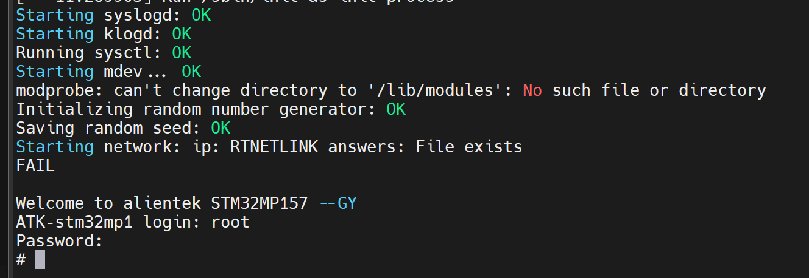
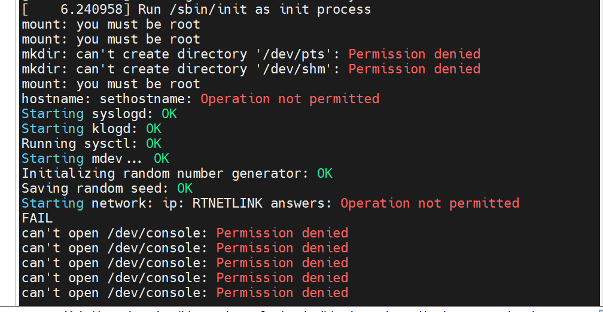
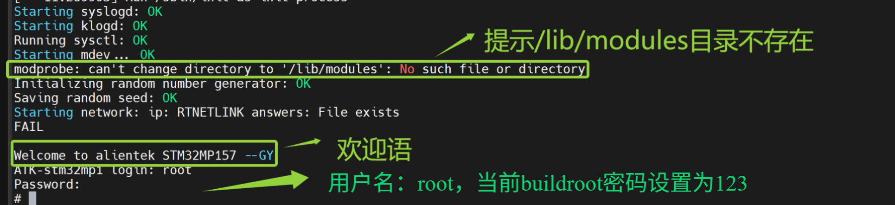
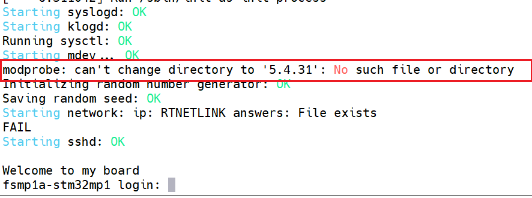
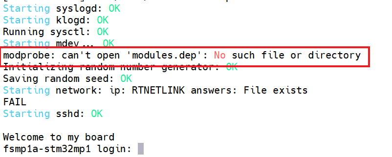
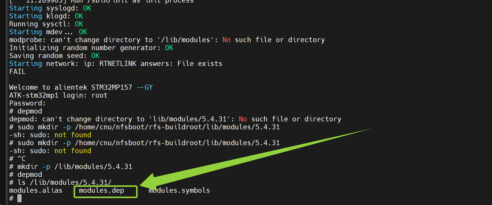
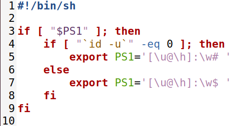
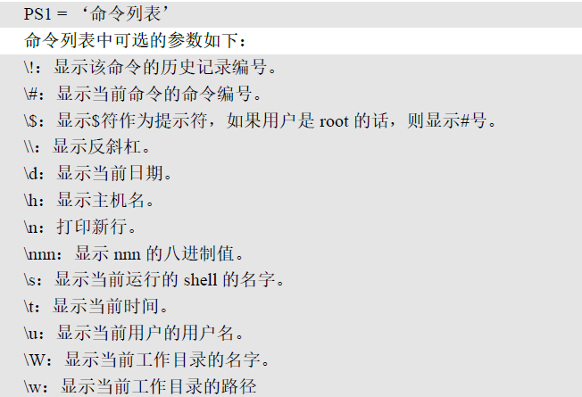
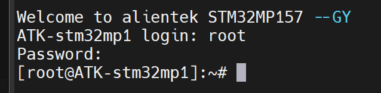
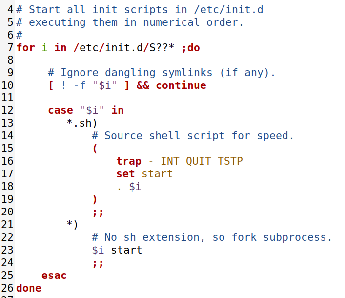

# 实验二十九 buildroot 根文件系统微调——从"能启动"到"趁手"

> **对应课件**：《第6章 构建Linux根文件系统-V2》6.3 节（下），Slide 77-90
>
> **系列说明**：本系列基于华清远见 FS-MP1A（STM32MP157A）开发板，对应课件《第6章 构建Linux根文件系统》。实验二十八的 `rootfs.tar` 解包进了 NFS，本篇把 bootargs 指过去点火——然后按课件的剧本处理启动路上的四个报错（Set UID 权限、/lib/modules、depmod/modules.dep）、把命令行提示符调顺手、挂上驱动调试要用的 debugfs。**这是第 6 章的收官篇：修完这四个错，buildroot 根文件系统进入日常服役**。前置：实验二十八（rfs-buildroot 就绪）、实验二十七（NFS 流程熟）。

## 一、本篇的三段式路线图

| 段 | 干什么 | 预期结果 |
|---|---|---|
| 第一段 | bootargs 指向 `rfs-buildroot` 点火 | 系统起来，但按课件剧本会报一串权限类错误 |
| 第二段 | 四个报错逐个化解（busybox Set UID / /lib/modules / depmod / modules.dep） | 启动日志干净，能登录能操作 |
| 第三段 | 提示符微调 + debugfs 挂载 + Target packages 展望 | 命令行趁手，第 6 章收官 |

## 二、实验环境（实际）

| 项目 | 实际值 |
|---|---|
| 操作位置 | 板子串口（点火与验收）+ Ubuntu（改文件、重打包） |
| 根文件系统 | `/home/cnu/nfsboot/rfs-buildroot`（实验二十八产物）——**NFS 根，改完重启即生效** |
| 内核 | 实验二十七重编后的 5.4.31（纯净版本串 + uevent helper 已开） |

> **开工自检（10 秒）**：`ls /home/cnu/nfsboot/rfs-buildroot` 目录树齐；`print bootargs` 里的 nfsroot 路径待改（现在是 busybox 版的 `rfs`）。

## 三、课件 ↔ 步骤对应表

| 课件 Slide | 内容 | 对应步骤 |
|---|---|---|
| 77~78 | 启动报错一：权限类错误与 busybox 的 Set UID | 步骤 2 |
| 79 | （可选）make busybox-menuconfig 微调 busybox | 步骤 2 末 |
| 80~83 | 启动报错二三四：/lib/modules、5.4.31 目录、modules.dep | 步骤 3 |
| 84~86 | 命令行提示符：/etc/profile.d/myprofile.sh 与 PS1 参数 | 步骤 4 |
| 87~88 | 挂 debugfs：/etc/init.d/Sautorun 与 rcS 的 S??* 机制 | 步骤 5 |
| 89~90 | Target packages：第三方软件按需加 | 步骤 6 |

### 本篇动作 → 后面谁用 → 现在含糊的后果

| 本篇动作 | 后面哪一篇要用 | 现在含糊的后果 |
|---|---|---|
| `/lib/modules/5.4.31/`（含 modules.dep） | **第 7 章 insmod 驱动模块的必经之地**——模块就装在这个版本目录里 | 目录没建好，模块加载第一关就卡 |
| `chmod a-s busybox` 的 Set UID 概念 | 以后任何"root 也报 Permission denied"的怪象 | 把权限问题误判成文件系统坏了 |
| rcS 遍历 `S??*` 的机制 | 第 7 章起写自己的开机自启脚本（S 开头放 init.d 即可） | 不知道自启脚本放哪、命名有什么讲究 |
| debugfs 挂载 | 第 9 章设备树/驱动调试要看 `/sys/kernel/debug` | 调试目录空空如也，以为内核没编好 |
| bootargs 双根切换 | 日常：busybox 版 `rfs` 与 buildroot 版 `rfs-buildroot` 想用哪个改一行 | 只会一条路走到黑 |

## 四、实验步骤

### 步骤 1：bootargs 切到 buildroot 根，点火

```
STM32MP> setenv bootargs 'console=ttySTM0,115200 root=/dev/nfs nfsroot=192.168.0.100:/home/cnu/nfsboot/rfs-buildroot,proto=tcp rw ip=192.168.0.8:192.168.0.100:192.168.0.1:255.255.255.0::eth0:off'
STM32MP> saveenv
STM32MP> run mybootnet
```

与实验二十七比只改了 nfsroot 的目录名——这就是"双根并存、改一行切换"。

<video src="./30_实验二十九_buildroot根文件系统微调.assets/点火_metool.mp4" controls></video>
> 视频：实测点火全程（压缩版随文档入库，原版本地留档）——modprobe 见面礼、banner 与登录界面都在片子里，与下图串口日志互为对照。


> 图：实测（MobaXterm COM10）——init 接管后的服务段与登录段：syslogd/klogd/sysctl/mdev 各 `OK`；`modprobe: can't change directory to '/lib/modules'` 是见面礼第一集（步骤 3 修）；`Starting network: ip: RTNETLINK answers: File exists` FAIL 系内核已按 bootargs 的 `ip=` 配好 eth0、开机脚本再配撞车——**网络实通**（根就是 NFS 挂进来的）；欢迎语 banner（行尾 `--GY` 是截图批注）与 `ATK-stm32mp1 login:`——输 `root`、密码 `123`（不回显）即进 `#`。课件剧本里那批 `mount: you must be root` / `mkdir: Permission denied` 一条没出现——原因见步骤 2 的实测分岔。

### 步骤 2：报错一——权限类报错与 busybox 的 Set UID（Slide 77~78）

> **实测分岔（2026-09-28）**：点火后课件剧本里那批 `Permission denied` **一条都没出现**（对比上面第一张实测图与下面课件图）。定位见下方——实测 `ls -l busybox` = `-rwxr-xr-x`，**Set UID 位压根没落上**。`tar tvf` 实锤：**压缩包里存的 busybox 就是 `-rwsr-xr-x 0/0`**（s 位在包里、属主 root）——丢在解包这一环：普通用户 `tar xf` 时 GNU tar 出于安全不恢复 setuid 位（课件作者的解包路径保住了它，所以他的 busybox 带着病根）；两侧 busybox 连大小都不同（实测 740320 / 课件 744416），构建细节本有差异。**病根不存在，本步"修法"天然达标**：`chmod a-s` 无的放矢、可跳过；`sudo chown -R root:root` 归位属主建议照做（无害有益）。想亲眼看课件同款报错，用 `sudo tar xf` 解包（root 解包会恢复 setuid 位）再点火即可——两条路终点相同：busybox 以真实 root 身份运行。

点火后按课件剧本会看到这样一串：


> 图：课件 Slide 77——启动串口输出（报错段）：`Run /sbin/init as init process`、`mount: you must be root`（两条）、`mkdir: can't create directory '/dev/pts': Permission denied`、`mkdir: can't create directory '/dev/shm': Permission denied`、`hostname: sethostname: Operation not permitted`、`Starting syslogd: OK`、`Starting mdev... OK`、`Starting network: ip: RTNETLINK answers: Operation not permitted FAIL`、`can't open /dev/console: Permission denied`（多条）——**注意后面的 Starting syslogd: OK 等又都是好的**，报错集中在开头那批。

**按"现象 → 根因 → 定位 → 修法"拆**：

- **现象**：明明以 root 登录，mount/mkdir/hostname 却报"没权限"；而 syslogd、mdev 又都 OK。
- **根因**：buildroot 打包时给 `bin/busybox` 设了 **Set UID 位**（`s`）——带这位的程序，**任何用户执行时都按"属主"身份跑**。`rootfs.tar` 在 Ubuntu 里解包后属主是普通用户（我们 `tar xf` 的那个账号），于是 busybox 被当成"普通用户"在跑——root 身份反而不被认。这正好用上实验二十四的文件类型/权限知识：权限串里那个 `s` 就是病根。
- **定位**：Ubuntu 里看一眼：

```bash
cd /home/cnu/nfsboot/rfs-buildroot/bin
ls -l busybox        # 课件：-rwsr-xr-x（带 s）；实测：-rwxr-xr-x（s 未落上，见顶部实测分岔）
```


> 图：课件 Slide 78——`ll busybox` 显示 `-rwsr-xr-x 1 cnu cnu 744416 ...`（属主还是解包用户 cnu、权限带 s），随后 `chmod a-s busybox` 去掉 Set UID 权限。

- **修法**：去掉 Set UID 位（顺手把属主归 root 更彻底）：

```bash
chmod a-s busybox
sudo chown -R root:root /home/cnu/nfsboot/rfs-buildroot    # 顺手把整棵树属主归位
```

板子上 `reboot`（NFS 根，重启即生效）——开头那批 Permission denied 应清零，能顺利到登录提示，输入 `root`（密码 `123`——实验二十八**步骤 4** 设置的自定义密码，不是课件示例的 123456）进入。

> **（可选）buildroot 里微调 busybox**（Slide 79）：`make busybox-menuconfig` 可直接进 busybox 配置界面（参考实验二十五的四处配置，本篇按课件说明"此处不需要修改"）；改了配置后要重跑 `make` 生成新 rootfs.tar；busybox 源码就在 `output/build/busybox-1.31.1/`。


> 图：课件 Slide 79——`ls output/build/` 输出：busybox-1.31.1（红框）、kmod-26、openssh-8.1p1、toolchain-external-custom 等——buildroot 编译的所有包都在这个目录里，微调/排障的"现场"。

### 步骤 3：报错二三四——/lib/modules 一家三口（Slide 80~83）

权限清零后，启动日志里还剩三连报（都是 modprobe 打的）——你点火日志里见到的第一条就是它：


> 图：实测（顶替课件 Slide 80）——`Starting mdev... OK` 之后的 `modprobe: can't change directory to '/lib/modules': No such file or directory`（绿框）就是第一集报错；下方欢迎语 "Welcome to alientek STM32MP157" 与登录界面都正常（root/123 进入）。

课件剧本里它其实是一家三口（Slide 80~82）：


> 图：课件 Slide 81——建了 /lib/modules 后的下一报：`modprobe: can't change directory to '5.4.31': No such file or directory`——它在找"与内核版本同名的目录"。


> 图：课件 Slide 81——文字说明：**depmod 命令非常重要，后面学习 Linux 驱动时需要用它分析模块的依赖性**，需在 busybox 中使能（`-> Linux Module Utilities -> [*] depmod`）——实验二十五步骤 2 的第③处勾选在此兑现（buildroot 版若是新编的 busybox，同样去勾）。


> 图：课件 Slide 82——第三报：`modprobe: can't open 'modules.dep': No such file or directory`——目录有了，模块依赖清单没有。

三个报错是**同一个故事的三集**：modprobe 开机要按"内核版本号命名的目录 + modules.dep 清单"找工作，这棵树在 buildroot 产物里还不存在（我们的内核是第 5 章自己编的，buildroot 不知道它）。三集还是"打地鼠"式出场——课件修一集重启一次才见到下一集；**我们的修法用 `mkdir -p` 一步建到最深、busybox 的 depmod 直接生成清单，把中间两集跳过。不是你缺了报错，是你一步修到位了。**

**照做清单（Ubuntu 三步 + 板上两步，做完三报清零）**：

**① Ubuntu：建模块目录**——`-p` 把第二集的中间层一起建掉：

```bash
sudo mkdir -p /home/cnu/nfsboot/rfs-buildroot/lib/modules/5.4.31
# 带 sudo：步骤 2 的 chown 后整棵树归 root，普通用户建目录会报"权限不够"
```

**② Ubuntu：给 buildroot 内部的 busybox 勾上 depmod**——第三集要用的 depmod 工具，buildroot 既没让它进 busybox 默认配置、kmod 又只带了库（缘由见下方存档），所以要手动到 busybox **自己的**配置菜单里开。

背景一句话：buildroot 编译时会**内部再编一个 busybox**（版本 1.31.1，源码在 `output/build/busybox-1.31.1/`），根文件系统里的命令全是它出的。它有**自己独立的配置菜单**，专用命令打开——注意是 `busybox-menuconfig`，**不是** buildroot 自己的 `menuconfig`：

```bash
cd ~/Desktop/LINUX-gy/Test2/buildroot-2020.02.6
make busybox-menuconfig
#   弹出的菜单里：方向键到 Linux Module Utilities ---> 回车
#   光标到 depmod (27 kb) 一行，空格勾成 [*]
#   连按 Esc Esc → 选 Yes 保存退出
```

**做过没有，一查便知**（打出 `CONFIG_DEPMOD=y` = 勾过了，直接进步骤③）：

```bash
grep CONFIG_DEPMOD output/build/busybox-1.31.1/.config
```

**③ Ubuntu：重编 + 覆盖式部署**——两个词拆开：**重编** = 再跑一次 `make`，buildroot 一查只有 busybox 的配置变了，就只重编 busybox、重新打包 rootfs.tar（几分钟）；**覆盖式部署** = 把新 tar 解开铺到 `rfs-buildroot` 上，同名文件覆盖、**不删除任何目录**——板子正挂着这个根，删目录就是上次 `Stale file handle` 僵尸局的教训：

```bash
make
cp output/images/rootfs.tar /home/cnu/nfsboot/
cd /home/cnu/nfsboot && tar xf rootfs.tar -C rfs-buildroot
```

**④ 板上：重启换新 busybox，登录后生成 modules.dep**（bootcmd 已指向 `run mybootnet`，`reboot` 自动点火）：

```text
ATK-stm32mp1 login: root
Password: 123
# depmod                       # 这次能跑了——在 /lib/modules/5.4.31/ 里生成 modules.dep
```

> **实测进行时（2026-09-28）**：`depmod` 已经能运行了（报错从 `not found` 变成 `can't change directory to 'lib/modules/5.4.31'`——工具到位，但它要找的目录在上一轮 `rm -rf` 式重部署时被连带清掉了）。**把①重新执行一遍，板上重敲 `depmod`**——报错里路径没有开头的 `/` 是 busybox 的显示风格，指的就是 `/lib/modules/5.4.31`。生成 modules.dep 后 `reboot` 复验。**板上做等价操作不用 sudo 也不带长路径**：`mkdir -p /lib/modules/5.4.31`——Ubuntu 侧的 `/home/cnu/nfsboot/rfs-buildroot/` 与板上的 `/` 是同一个目录（NFS 挂根的两副面孔），`sudo` 是 Ubuntu 的命令、板上 root 身份用不着（实测：板上敲 sudo 长路径版报 `sudo: not found`）。

**⑤ 板上：再 `reboot` 一次复验**——启动日志 modprobe 三报清零 = 步骤 3 达标。**`/lib/modules/5.4.31/` 这个目录第 7 章天天要用**：编出的 `.ko` 模块就放进去，`modprobe` 靠 modules.dep 找依赖。


> 图：实测（顶替课件 Slide 80~82 的完整修复战况，一屏收全程）——启动第一集报错（modprobe 找 /lib/modules）→ 登录后 `depmod` 已能跑（busybox 补勾生效）但报第二集（`lib/modules/5.4.31` 目录缺）→ 板上误敲 Ubuntu 的 sudo 长路径两连（`-sh: sudo: not found`——Ubuntu 命令不上板）→ 改用板上短路径 `mkdir -p /lib/modules/5.4.31` → `depmod` 静默成功 → `ls` 三件齐：modules.alias / **modules.dep（绿框）** / modules.symbols——步骤 3 达标。

---

**两段实测存档（为什么绕了这些路，照做清单用不上）**：

- **depmod 从哪来（定稿）**：板上 `depmod` 曾打出 `not found`。`find output/target` 实锤：**kmod 勾选只带来 `libkmod.so` 库三件（59,088 字节，rootfs.tar 增量 61,440 的本体），没有 kmod 命令、没有 depmod**（buildroot 的 kmod 包默认只装库；busybox 侧的 depmod 在默认配置里本来就没开——`tar tvf` 清单里 insmod/lsmod/modprobe/rmmod 都是 busybox 符号连接、唯独没有 depmod）。所以工具要从 busybox 出，②就是课件 Slide 81 那句话的兑现。
- **`rm -rf` 的教训（首版救援命令踩的）**：板子挂着根时 `rm -rf rfs-buildroot` → 板上 shell 当场僵尸化、`reboot` 等一切命令报 `Stale file handle`，连 reboot 程序都要经过失效的句柄链去找，唯一出路是复位键/断电重来（NFS 根不怕硬复位）。③已改覆盖式；"先让板子离开根再删"或"覆盖式更新"两条安全姿势，以后所有重部署照此办理。

### 步骤 4：命令行提示符微调（Slide 84~86）

buildroot 默认提示符单调。buildroot 的 `/etc/profile`（与实验二十六手写的那份同一机制）末尾有一段：登录 shell 会遍历执行 `/etc/profile.d/` 下的 `.sh` 文件——**加文件不改原文件**，这是配置系统的通用好习惯：

【Ubuntu 侧执行】——NFS 直改，比板子串口里敲方便：

```bash
nano /home/cnu/nfsboot/rfs-buildroot/etc/profile.d/myprofile.sh
```

> **为什么在 Ubuntu 改文件、板子会变**：NFS 挂根 = 板子的根文件系统**就是** Ubuntu 磁盘上的 `rfs-buildroot` 目录——同一个目录的两副面孔（Ubuntu 侧 `/home/cnu/nfsboot/rfs-buildroot/...` = 板子侧 `/...`）。Ubuntu 侧的每次保存都直接写进板子的根，板子 `reboot` 重新读一遍即生效——这就是'改根不烧卡'红利的兑现现场。nano 键位：**Ctrl+O** 回车保存、**Ctrl+X** 退出，完整卡见实验二十步骤 1。）

> ⚠ **实测踩坑（2026-09-28）**：脚本内容要粘在 **nano 编辑区里**——有人把它粘到了板子的串口终端，被当成命令逐行执行：`if` 少一个配对的 `fi`，shell 卡进 `>` 续行提示符；跟着文本一起粘进来的 `^C` 是字符不是按键，按多少次都退不出来。脱困两法：板上键盘补一个 `fi` 回车（顺带会把 PS1 真的设上，算意外预览），或按**键盘** Ctrl+C。

```sh
#!/bin/sh

if [ "$PS1" ] ; then
        if [ "`id -u`" -eq 0 ] ; then
                export PS1='[\u@\h]:\w# '
        else
                export PS1='[\u@\h]:\w$ '
        fi
fi
```


> 图：课件 Slide 84——`/etc/profile.d/myprofile.sh` 内容：root 用户提示符 `[\u@\h]:\w# `，非 root 为 `[\u@\h]:\w$ `。


> 图：课件 Slide 85——/etc/profile 中参考的原生片段（`if [ "$PS1" ]` / `id -u` 判断 / 默认 `PS1='# '` 或 `'$ '`）——myprofile.sh 就是照它的骨架改的。


> 图：课件 Slide 86——PS1 参数速查：`\u` 用户名、`\h` 主机名、`\w` 当前路径、`\W` 路径末段、`\t` 时间、`\d` 日期、`\$` root 显示 # 否则 $、`\!` 历史编号、`\s` shell 名等。

重启后提示符变为 `[root@<主机名>]:/# `——用户、主机、路径一目了然（主机名 = 实验二十八步骤 4 设的值：课件示例 fsmp1a-buildroot，我们实测是 `[root@ATK-stm32mp1]:/# `，对结构不对数值）。


> 图：实测——`reboot` 后登录 `root`/`123`，提示符从裸 `#` 变为 **`[root@ATK-stm32mp1]:~#`**——myprofile.sh 的 PS1 生效（`\u`=`root`、`\h`=`ATK-stm32mp1`、`\w`=`~` 即 /root，`cd /` 后变 `/#`）——步骤 4 达标。

### 步骤 5：挂 debugfs——给第 9 章调试留门（Slide 87~88）

驱动调试常要看 `/sys/kernel/debug`，但它是空壳——**debugfs 文件系统**没挂。buildroot 的 init 机制给了个优雅的入口：`/etc/init.d/` 下**大写 S 开头**的文件会被 rcS 自动执行（`for i in /etc/init.d/S??*` 遍历；.sh 用 source 执行、其他按 `$i start` 派生）——这是 sysvinit 风格的"自启脚本槽位"：

【Ubuntu 侧执行】：

```bash
nano /home/cnu/nfsboot/rfs-buildroot/etc/init.d/Sautorun   # 键位同步骤 4：Ctrl+O 回车保存、Ctrl+X 退出
```

```sh
#!/bin/sh
mount -t debugfs none /sys/kernel/debug
```

【Ubuntu 侧执行】（文件属主是 cnu，不用 sudo）：

```bash
chmod +x /home/cnu/nfsboot/rfs-buildroot/etc/init.d/Sautorun
```

【板子上验收】：

```text
[root@ATK-stm32mp1]:~# mount | grep debug
none on /sys/kernel/debug type debugfs (rw,relatime)     # 有这一行 = Sautorun 自启生效
```

（判据认 **`type debugfs`** 与挂载点 `/sys/kernel/debug`——行首的 `none` 是设备名占位：debugfs 是虚拟文件系统、没有真实设备，课件命令里那个 `none` 就是填在这的；`mount` 输出设备名在前，别等"debugfs 开头"的行。）


> 图：课件 Slide 87——`/etc/init.d/Sautorun` 内容：`mount -t debugfs none /sys/kernel/debug`（none = 该虚拟文件系统无所谓设备名）。


> 图：课件 Slide 88——buildroot 的 /etc/init.d/rcS 片段（第 4~26 行）：`for i in /etc/init.d/S??* ;do` 遍历执行大写 S 开头的文件；`[ ! -f "$i" ] && continue` 跳过无效项；.sh 后缀用 `. $i` source 执行，其余 `$i start` 派生执行。

**记住这个机制**：第 7 章起任何"开机自动 insmod 某模块、自动跑某命令"的需求，都是写一个 `S` 开头的脚本丢进 `/etc/init.d/`——文件名按字母序执行（S01xxx 先于 S99xxx），编号即优先级。

### 步骤 6：Target packages——第三方软件随点随有（Slide 89~90）

buildroot 的后半场价值在软件包：`make menuconfig` → **Target packages** 里按分类勾选（网络工具 iperf、音频 alsa-utils、多媒体 ffmpeg、调试 gdb…），`make` 重编，新 rootfs.tar 里就带着它们，依赖自动理清。本篇按课件**不加新包**（最小系统先跑通），只认门：


> 图：课件 Slide 89——配置主界面高亮 Target packages 菜单。


> 图：课件 Slide 90——Target packages 菜单内部：顶部 `-*- BusyBox`（busybox 配置文件的入口也在这），下方 Audio and video / Compressors / Debugging / Development tools / Graphic libraries / Hardware handling / Interpreter languages / Libraries / Networking applications / System tools 等分类子菜单——第 7~10 章需要什么来拿什么。

**第 6 章到此收官**。系统栈终局：**我们编的 U-Boot（第 3 章）→ 我们编的内核 + 设备树（第 5 章）→ 两套自制根文件系统随时切换（第 6 章）**——四件全是自己的，网络根让"改文件不烧卡"成为日常。

## 五、注意事项

1. **Set UID 与属主要一起看**：`s` 位让程序按"属主"身份跑——解包属主是普通用户时，root 反而失灵；`chown -R root:root` 归位 + `chmod a-s` 去位，双管齐下。
2. **`/lib/modules/<内核版本串>/` 的目录名必须与 `uname -r` 一字不差**：内核报什么版本就建什么目录（我们按课件建 `5.4.31`；若 .scmversion 没生效版本串带哈希，就得按哈希建——又一个"版本串一致性"的用处）。
3. **modules.dep 在板上 `depmod` 生成**——它扫的是"当前运行的内核版本"，所以要在板子上跑、在 `/lib/modules/<版本>/` 里落清单；Ubuntu 里跑版本对不上。
4. **改 NFS 根里的文件不必重启 NFS**：改完板子 `reboot` 就生效；只有 Ubuntu 侧改了 exports 才需要重启 NFS 服务（实验二十七）。
5. **profile.d 的脚本不加执行位也能被 source**（rcS 对 .sh 用 `. $i`——哦不，profile.d 是 profile 遍历 source 的，同样不查 x 位），但 init.d 的 S 脚本按课件惯例 `chmod +x` 养成习惯。
6. **两套根并存后别改串了**：bootargs 的 nfsroot 路径决定挂哪个根——`rfs`（busybox 版，root 无密码）与 `rfs-buildroot`（root/`123`，密码出自实验二十八步骤 4 的自定义设置）登录方式不同，分不清先 `mount` 看根上有没有 profile.d。
7. **reboot 与 run mybootnet 的分工**：bootcmd 已指向 `run mybootnet` 并存进 MMC——板上 `reboot`（或重启键）即自动点火，**日常不需要手动 run**；手动 `run mybootnet` 只在"人停在 STM32MP> 提示符"时用（刚拦停、或倒计时被抢停）。改根里"启动时才执行"的东西（S 脚本、profile、rcS、内核、设备树）要 `reboot` 重新走启动流程；光看/改运行期普通文件不用重启。**上电/复位行为速查表**：

| 场景 | 现象 | 你要做什么 |
|---|---|---|
| 上电/复位/重启，**不碰任何键** | 自动 tftp 点火，直进 Linux 登录界面 | **什么都不做**，等它跑完 |
| 上电时按了键、或串口进了字符（提前开终端灌入等） | 停在 `STM32MP>` | `run mybootnet` 回 Linux |
| 需要进 U-Boot 改环境变量 | —— | 上电瞬间抢按任意键拦停（bootdelay=0 靠抢），操作完 `run mybootnet` 或 `reset` |
| 已在 Linux 里 | `[root@ATK-stm32mp1]:~#` | `reboot` 自动重新点火；U-Boot 阶段的复位命令是 `reset` |

`STM32MP>` 不是必须经过的一站——**它只在你（或你的串口终端）打了断的时候出现**；上电前把手从键盘拿开就不会撞上它。
8. **NFS 根"热替换"的禁忌（实测踩过）**：板子正从某个根启动时，**不要在 Ubuntu 侧 `rm -rf` 那个根目录**——板上运行中的系统握着旧目录的文件句柄，目录被删后一切访问报 `Stale file handle`，shell 变僵尸（`reboot` 都执行不了，因为连 reboot 程序都要经过失效的句柄链去找），唯一出路是**按复位键/断电重来**（NFS 根不怕硬复位，复位后重新挂载即满血）。重部署的两条安全姿势：先让板子离开该根（`reboot` 并在 U-Boot 拦停）再动手；或者不删目录、直接 `tar xf rootfs.tar -C rfs-buildroot` 覆盖式更新。

## 六、验证点一览

| 验证点 | 命令 | 通过的样子 | 在哪一步敲 |
|---|---|---|---|
| bootargs 已切换 | `print bootargs` | nfsroot 指向 `rfs-buildroot` | 步骤 1 |
| Set UID 已去 | `ls -l rfs-buildroot/bin/busybox`（Ubuntu） | 权限 `-rwxr-xr-x`（无 s）；属主 root | 步骤 2 |
| 登录成功 | 登录提示输入 root | 进入 shell（密码 123，实验二十八步骤 4 设置） | 步骤 2 |
| modules 三件套 | `ls /lib/modules/5.4.31/`（板上） | 目录存在；`depmod` 后有 modules.dep | 步骤 3 |
| 启动日志干净 | 复验启动输出 | modprobe 三连报清零 | 步骤 3 |
| 提示符生效 | 看登录后提示符 | `[root@fsmp1a-buildroot]:/# ` | 步骤 4 |
| debugfs 挂上 | 板上 `mount \| grep debug`、`ls /sys/kernel/debug` | 挂载行在列；目录非空 | 步骤 5 |
| 根可切换 | 改 nfsroot 回 `rfs` 重启 | busybox 版照常进（提示符/登录方式不同即区分） | 收尾 |

不达标时的排查：

| 现象 | 先查什么 |
|---|---|
| 权限报错依旧 | `ls -l` 确认 `s` 位真去了；NFS 侧 `no_root_squash` 还在吗（实验二十七 exports）；属主归位没 |
| modprobe 报 `5.4.31: No such file or directory` | `uname -r` 看内核实际版本串——目录名要跟它一致（.scmversion 没生效就得按哈希建） |
| depmod 后仍报 modules.dep | 目录权限（课件给的 `chmod 777` 兜底）；确认跑 depmod 的是 buildroot 版的根（带 kmod） |
| 提示符没变 | myprofile.sh 在 profile.d 里吗；`echo $PS1` 看当前值；登录 shell 类型（busybox ash 读 profile） |
| /sys/kernel/debug 是空的 | Sautorun 的 x 位；内核 CONFIG_DEBUG_FS 开没开（multi_v7 基线默认 y，可 grep .config 核实） |
| 挂的是哪个根分不清 | `mount | grep nfs` 看 nfsroot 路径；`ls /etc/profile.d`（buildroot 版才有微调脚本） |

## 七、实验完成标志

- bootargs 切换到 `rfs-buildroot` 并点火成功，进入登录（步骤 1~2 实测，图 01/视频）
- busybox 的 Set UID 位问题实测未出现（普通用户解包 s 位未落上，见步骤 2 实测分岔）；`ls -l busybox` = `-rwxr-xr-x` 属主 root（步骤 2 实测）
- `/lib/modules/5.4.31/` 目录建成、板上 `depmod` 生成 modules.dep/alias/symbols 三件，modprobe 三连报清零（步骤 3 实测，图 05/09）
- 提示符微调生效：`[root@ATK-stm32mp1]:~#`（主机名 = 实验二十八步骤 4 所设；`~` 为登录后落在 /root）（步骤 4 实测，图 13）
- `/etc/init.d/Sautorun` 挂载 debugfs 生效：`mount | grep debug` 见 `none on /sys/kernel/debug type debugfs (rw,relatime)`（步骤 5 实测）
- Target packages 认门完成（按需加包的入口与机制清楚）（步骤 6）
- busybox 版与 buildroot 版双根可随时切换（收尾；bootcmd 已指 `run mybootnet`，上电/reboot 自动进当前 bootargs 指的根）

## 八、下一步：第 7 章《字符设备驱动》

地基全部完工：**bootloader、内核、设备树、根文件系统四件套全部自制，NFS 网络根让开发变成"改完重启"**。第 7 章进入内核开发正题——第一个字符设备驱动：从 `file_operations` 结构体、`insmod/modprobe` 加载、到 `dmesg` 看打印，把"内核模块三件套"（源码 + Makefile + Kconfig）从实验二十二抄过的那个样子，变成自己会写的本能。
