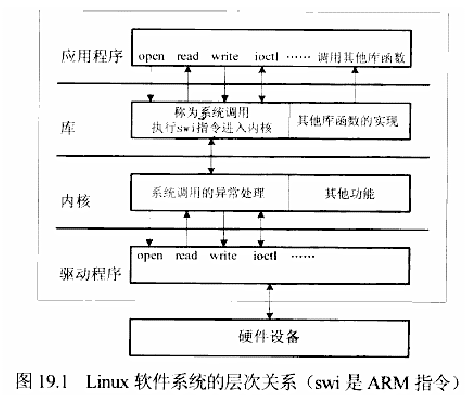
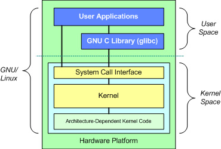
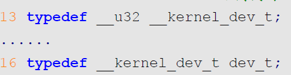
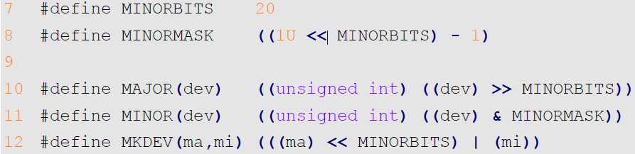
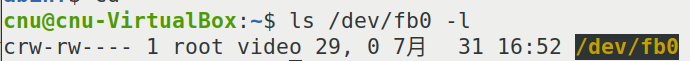
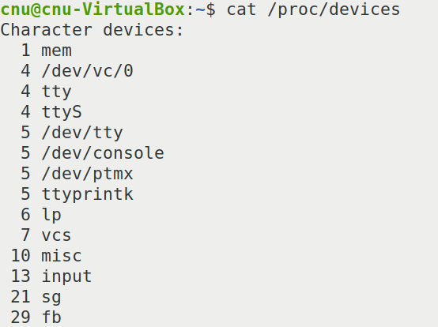
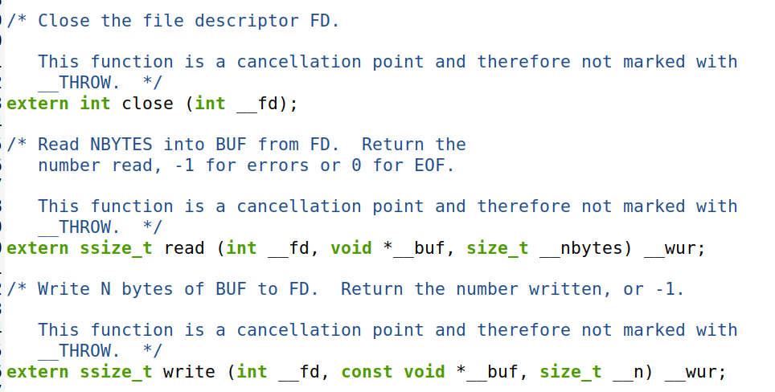
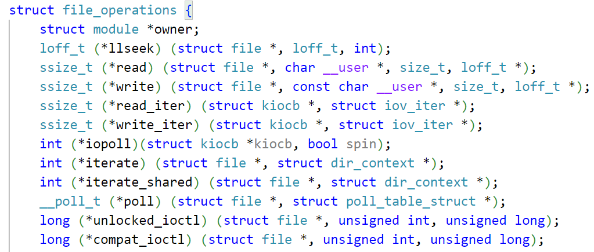

# 实验三十 驱动分层与模块机制——应用程序到硬件的完整一条链

> **对应课件**：《第7章 字符设备驱动》7.1~7.2 节，Slide 2-16
>
> **系列说明**：本系列基于华清远见 FS-MP1A（STM32MP157A）开发板，对应课件《第7章 字符设备驱动》。第 6 章收官时四件套全部自制，本篇进入内核开发正题。实验二十二移植网卡驱动时抄过"驱动源码 + Makefile + Kconfig"三件套，当时是"照抄能跑"；本篇把背后的机制讲透：应用程序到硬件之间隔了几层、`insmod` 那一刻内核发生了什么、`file_operations` 是什么、设备号怎么把"打开文件"翻译成"调用驱动"——下一篇（实验三十一）从零写第一个字符设备驱动。前置：实验二十九（buildroot 根文件系统 + `/lib/modules/5.4.31/` 就位）、实验二十二（抄过驱动三件套）。

## 一、四层架构：应用程序到硬件，隔了什么


> 图：课件 Slide 2——Linux 软件系统层次关系框图：应用程序层（open/read/write/ioctl…与调用其他库函数）→ 库层（系统调用入口：执行 **swi 指令**进入内核；其他库函数的实现）→ 内核层（系统调用的异常处理 + 其他功能）→ 驱动程序层（open/read/write/ioctl…）→ 硬件设备。相邻层只认接口、不问实现。

分层的关键动作发生在**库层与内核层之间**：应用程序调用 `open`/`read`/`write` 时，glibc 库把这些调用翻译成**系统调用**——设置好相关寄存器后执行一条特定指令（ARM 架构是 `swi`/`svc`），**引发异常进入内核空间**。此后 CPU 换了一种身份运行，这就是两个"空间"：


> 图：课件 Slide 3——GNU/Linux 分层结构图：User Space（用户应用程序 + glibc）与 Kernel Space（系统调用接口 → 内核 → 体系结构相关代码）以虚线分隔，最底层 Hardware Platform。**应用程序运行于用户空间，系统调用运行于内核空间**——两层内存不能互访（实验三十一的 `copy_to_user/copy_from_user` 就是为这条线服务的）。

内核的异常处理函数按传入的参数（设备文件名）**找到对应的驱动程序**并调用它。由此得出驱动程序的三个"性格"：

1. **与内核没有界线**——驱动要么静态编进内核，要么作为模块动态加载，总之活在内核空间；
2. **从不主动运行**——它被应用程序（经系统调用）调用，自己不会跑；
3. **"安装"就是"注册"**——向内核登记"主设备号 X 的设备归我管"，登记完并不运行。

**三类设备**：字符设备（逐字节读写——除辅存和网卡外几乎都是）、块设备（接口与字符设备相同，但驱动内部要构造/解析固定大小的数据块——辅存如 eMMC/SD/NAND）、网络设备（报文帧结构且大小不固定；内核给它分配名字如 `eth0`，**在 /dev 下没有设备文件**——这解释了实验十三以来网口为什么从来不是 /dev/eth0）。

## 二、驱动的开发步骤与加载卸载（Slide 6~9）

课件给的开发七步，本篇先记住骨架（下一篇逐条落地）：

1. 看原理图/数据手册，弄懂设备操作方法；
2. 在内核里找相近的驱动当模板（没有相近的才从零开始）；
3. 实现**初始化函数**（向内核注册）与**清除函数**（注销）；
4. 实现具体操作函数（open/read/write/ioctl…）；
5. 需要的话实现中断服务函数；
6. 编译进内核（`=y`）或编译成模块（`=m`，`insmod`/`modprobe` 动态加载）；
7. 测试。

**模块三兄弟与依赖**（第 6 章建的家底在此兑现）：

```bash
insmod module_example.ko    # 直接加载 .ko 文件
rmmod  module_example       # 卸载
lsmod                       # 查看已加载模块
modprobe module_example     # 加载——并自动解决模块依赖
```

`modprobe` 与 `insmod` 的差别就一条：**modprobe 会按依赖清单自动先加载所依赖的模块**——那份清单就是 `/lib/modules/5.4.31/modules.dep`（实验二十九 `depmod` 生成的、当年为消 modprobe 报错建的那份）。所以新模块放进文件系统后要走 modprobe，**先跑 `depmod`**；`insmod` 则不需要——它不查依赖，直接装。

**入口与出口**：加载模块时内核调用**初始化函数**（注册），卸载时调用**清除函数**（注销）。这两个函数的指定方式二选一：要么用固定名 `init_module`/`cleanup_module`，要么打标记（通行的做法）：

```c
module_init(XXX_init);      // XXX_init 为初始化函数名
module_exit(XXX_exit);      // XXX_exit 为清除函数名
```

## 三、设备号：把"打开文件"翻译成"调用驱动"的钥匙

实验二十四讲过：设备文件的"大小"位置显示的是"主设备号, 次设备号"。本篇往内核数据结构里看一层：

- 设备号类型是 **`dev_t`**，实质 32 位无符号数——**高 12 位主设备号（0~4095），低 20 位次设备号（0~2²⁰−1）**；主设备号对应一个驱动，次设备号区分该驱动管的各台设备（实验二十四的口诀在此升级为精确位数）。


> 图：课件 Slide 10——`include/linux/types.h` 的 dev_t 定义：`typedef __u32 __kernel_dev_t;` … `typedef __kernel_dev_t dev_t;`——dev_t 就是 32 位无符号类型。

内核给的三个操作宏（`include/linux/kdev_t.h`）：


> 图：课件 Slide 11——kdev_t.h 宏定义：`MINORBITS 20`、`MINORMASK ((1U << MINORBITS) - 1)`、`MAJOR(dev) ((dev) >> MINORBITS)`（右移 20 位取高 12 位）、`MINOR(dev) ((dev) & MINORMASK)`（掩码取低 20 位）、`MKDEV(ma,mi) ((ma << MINORBITS) | mi)`（主次拼回设备号）。

设备号在用户空间怎么查：


> 图：课件 Slide 12——`ls /dev/fb0 -l` 输出 `crw-rw---- 1 root video 29, 0 ... /dev/fb0`——帧缓冲设备主 29 次 0（第 10 章 GUI 的 LCD 就靠它）。


> 图：课件 Slide 12——`cat /proc/devices`：Character devices 列出已分配的主设备号（1 mem、4 tty、5 /dev/console、13 input、29 fb……）——**主设备号是全系统登记册**，下一篇注册 toychar 时用的 200 不能与表里冲突。

## 四、file_operations：驱动开发的"任务书"（7.2）

glibc 里的文件函数与驱动里的函数是**一一对应的镜像**：


> 图：课件 Slide 13——glibc 的用户空间函数原型：`int close(int __fd)`、`ssize_t read(int __fd, void *__buf, size_t __nbytes)`（读 N 字节进缓冲区，返回读到的数量或 -1）、`ssize_t write(int __fd, const void *__buf, size_t __n)`（写 N 字节，返回写入数量）——这些 fcntl.h/unistd.h 里的原型，每个设备的驱动里都有对应版本。

字符设备的这组函数集中在一个结构体里——**`file_operations`**（定义在内核 `include/linux/fs.h`）：


> 图：课件 Slide 14——file_operations 结构体定义节选：`struct module *owner`、`loff_t (*llseek)(...)`、`ssize_t (*read)(struct file *, char __user *, size_t, loff_t *)`、`ssize_t (*write)(struct file *, const char __user *, size_t, loff_t *)`、`__poll_t (*poll)(...)`、`long (*unlocked_ioctl)(...)` 等成员——**成员就是函数指针**，指到哪，用户空间的对应调用就落到哪。

串起来的全链路：**应用程序 `read(fd)` → glibc → swi 进入内核 → 内核按 fd 找到设备文件 → 取主设备号 → 查到注册时绑定的 file_operations → 调用其 `.read` 成员 → 驱动函数干活**。`register_chrdev(主设备号, 设备名, &fops)` 干的正是"把设备名、设备号、fops 绑到一起"的登记——实验二十二抄过的 Kconfig/Makefile 决定"编不编"，本篇的 register 决定"编进去之后内核认不认"。

**编写字符设备驱动的核心三步**（课件 7.2 收尾，下一篇的任务书）：

1. 初始化函数：硬件初始化（也可推迟到真正用时）+ 向内核注册；
2. 清除函数：1 的逆过程；
3. 实现 file_operations 里**需要用到的**成员——不必实现全部。

## 五、实验环境（实际）

| 项目 | 实际值 |
|---|---|
| 板子状态 | 第 6 章收官：自制 U-Boot/内核/设备树 + 双根（busybox 版 `rfs` 与 buildroot 版 `rfs-buildroot`） |
| Ubuntu 虚拟机 | gcc-arm-9.2 工具链（编驱动模块与测试程序用同一套）、内核源码树（实验十九~） |
| 本篇新增材料 | `drivers-dev.zip`（18 KB 量级，md5 `7fa1d58d1e6f082f4f553230bde7ddcb`）——**第 7 章的驱动素材包**，里面 `01-toychar/` 有 toychar1/2/3.c、toycharApp.c 与 Makefile（02-led/03-mdevled/04-dtsled 是第 8、9 章的） |

> **开工自检（10 秒）**：本篇是认知篇，不上板。要做的只是把课件里的链路与自己的经历对号——`/lib/modules/5.4.31/`（实验二十九建的）、`depmod`（实验二十九跑过）、"主设备号 200"（下一篇 register_chrdev 的第一个参数）。

## 六、课件 ↔ 步骤对应表

| 课件 Slide | 内容 | 对应本篇 |
|---|---|---|
| 2~5 | 四层架构、系统调用与 swi、用户/内核空间、驱动三性格、三类设备 | 第一节 |
| 6~9 | 开发七步、insmod/rmmod/lsmod/modprobe+depmod、module_init/exit | 第二节 |
| 10~12 | 设备号 dev_t、主次位数、MAJOR/MINOR/MKDEV 宏、ls 与 /proc/devices | 第三节 |
| 13~16 | glibc 函数与 fops 对应、file_operations、主设备号绑定、核心三步 | 第四节 |

### 本篇概念 → 后面谁用 → 现在含糊的后果

| 本篇概念 | 后面哪一篇用 | 现在含糊的后果 |
|---|---|---|
| `module_init/exit` + 注册/注销 | 实验三十一 toychar1.c 的骨架 | 代码摆在那不知道哪两行是"入口" |
| `register_chrdev` 主设备号绑定 | 实验三十一 toychar2.c（主 200）与 mknod c 200 1 | 设备文件的主设备号与驱动对不上，open 就报错 |
| `file_operations` 成员 | 实验三十一 toychar3.c 的 open/read/write/release | 不知道该实现哪几个函数、原型从哪抄 |
| 用户/内核空间隔离 | 实验三十一 `copy_to_user/copy_from_user` | 直接 memcpy 用户指针，内核崩溃 |
| modprobe+depmod 机制 | 实验三十一加载 toychar*.ko 的流程 | modprobe 报 not found 不知道要先 depmod |
| 主设备号登记册 | 第 8 章 LED 驱动、第 9 章 dtsled | 自选主设备号撞车，注册失败 |

本篇不需要新动手的材料。下一篇用的 `drivers-dev.zip`（见实验环境表）拷进共享目录即可。

## 七、自测一览

| 自测问题 | 达标答案 | 在哪一节 |
|---|---|---|
| `open` 从应用程序到驱动，经过了哪几层？ | 应用 → glibc 库（swi/svc 陷入）→ 内核异常处理 → 按主设备号找到 fops → 驱动的 `.open` | 第一节、第四节 |
| 驱动的"安装"是什么意思？它运行吗？ | 向内核注册（登记主设备号与 fops）；不运行——从不主动运行，被系统调用触发 | 第一节 |
| 字符/块/网络设备各举一例，网络设备特殊在哪？ | 串口/eMMC/eth0；网络设备无 /dev 设备文件，只有名字 | 第一节 |
| `insmod` 与 `modprobe` 的差别？ | modprobe 按 modules.dep 自动解决依赖——新模块先 `depmod` | 第二节 |
| 设备号 32 位怎么切分？主设备号上限？ | 高 12 主 + 低 20 次；主 0~4095 | 第三节 |
| `register_chrdev` 把哪三样绑在一起？ | 设备名、设备号、file_operations 结构体 | 第四节 |

## 八、下一步：toychar 虚拟字符设备驱动

下一篇（实验三十一）动手：drivers-dev.zip 里的 `01-toychar` 按三步演进——toychar1 只注册/注销、toychar2 加上 register_chrdev（主设备号 200）、toychar3 实现 open/read/write/release（copy_to_user/from_user 在两空间之间搬数据）；外部模块 Makefile 编出 .ko，板子上 modprobe 加载、mknod 建设备文件、跑测试程序读写"内核里的一块数据"——你的第一个内核模块上线。
