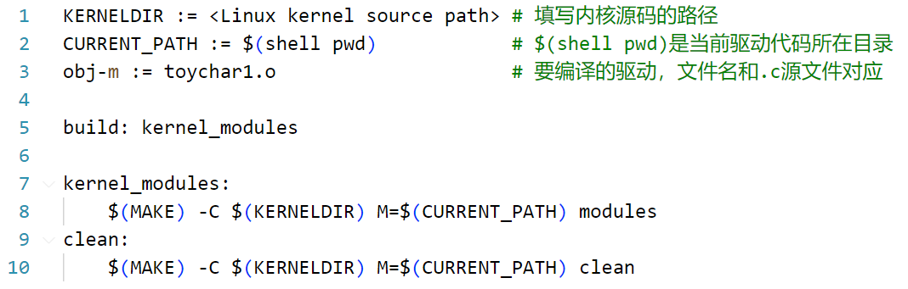
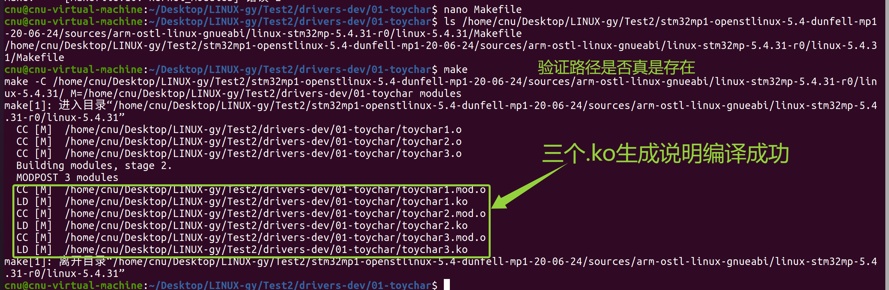
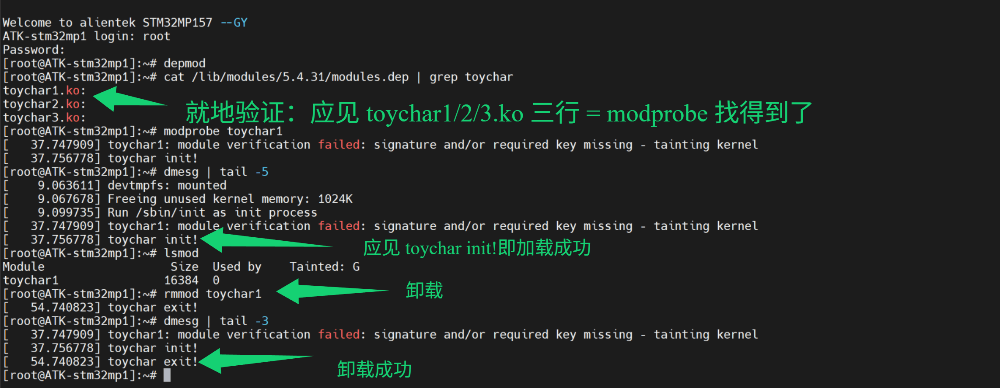
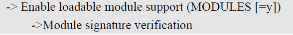
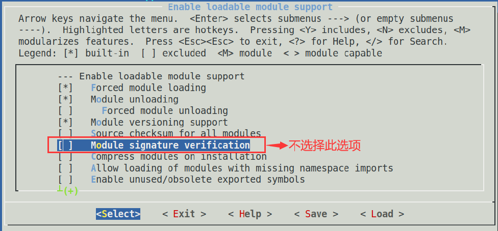
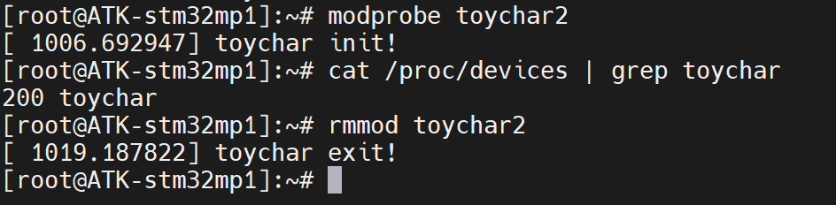
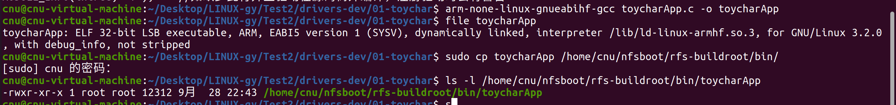
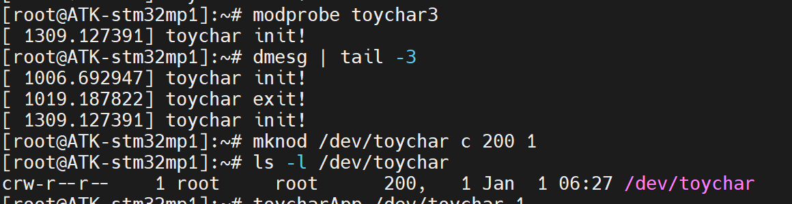
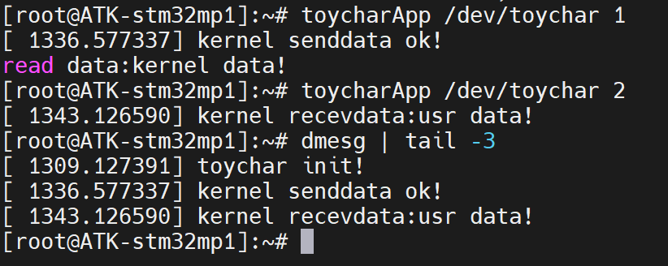

# 实验三十一 toychar 虚拟字符设备驱动——第一个内核模块上线

> **对应课件**：《第7章 字符设备驱动》7.3 节，Slide 17-27
>
> **系列说明**：本系列基于华清远见 FS-MP1A（STM32MP157A）开发板，对应课件《第7章 字符设备驱动》。实验三十把机制讲透了，本篇写第一个驱动：**toychar 虚拟字符设备**——没有物理硬件，"设备"就是内核空间里的一块数据，正好把"注册、操作函数、用户/内核空间传数据"三件事练全。驱动按 toychar1→2→3 三步演进（每一步都能独立编译加载验证），配套一个用户态测试程序。**这是全系列第一次编译并加载自己的内核模块**。前置：实验三十（机制）、实验二十九（buildroot 根 + /lib/modules/5.4.31 就位）。

## 一、三步演进的全景与设备文件的创建组合

toychar 的三个版本对应实验三十"核心三步"，每一步加一行家当：

| 版本 | 加了什么 | 验证点 |
|---|---|---|
| `toychar1.c`（50 行） | module_init/module_exit + 注册/注销骨架（打印 init/exit） | insmod 后 dmesg 见 `toychar init!` |
| `toychar2.c`（73 行） | `register_chrdev(200, "toychar", &fops)`——设备名、设备号、fops 绑定 | `cat /proc/devices` 多一行 `200 toychar` |
| `toychar3.c`（167 行） | 实现 `.open/.read/.write/.release`，`copy_to_user/copy_from_user` 两空间搬数据 | 测试程序读到 `kernel data!`、写数据内核打印 |

**设备号与设备文件的两组搭配**（课件 7.3 开篇的矩阵，决定后面命令怎么敲）：

| | 手动指定设备号 | 内核自动分配 |
|---|---|---|
| **手动建设备文件**（mknod） | ✅ 本篇方案：驱动写死主 200 + 板上 `mknod /dev/toychar c 200 1` | ❌ 设备号都不知道，mknod 无从下手 |
| **自动建设备文件**（udev/mdev，驱动里带创建代码） | 少见组合 | 常见组合：第 8 章 mdevled 就走到这 |

## 二、实验环境（实际）

| 项目 | 实际值 |
|---|---|
| 操作位置 | Ubuntu 编译（驱动模块 + 测试程序）；板子上加载、建设备文件、运行测试 |
| 内核源码树 | `~/Desktop/LINUX-gy/Test2/stm32mp1-openstlinux-5.4-dunfell-mp1-20-06-24/sources/arm-ostl-linux-gnueabi/linux-stm32mp-5.4.31-r0/linux-5.4.31`（实验十九~的树，**KERNELDIR 就指它**） |
| 编译器 | `arm-none-linux-gnueabihf-`（实验十九）——**必须与编内核的同一套**，否则模块版本对不上加载报错 |
| 根文件系统 | buildroot 版 `rfs-buildroot`（`/lib/modules/5.4.31/` 与 kmod 已就位，实验二十九） |
| 素材 | `drivers-dev.zip`（md5 `7fa1d58d1e6f082f4f553230bde7ddcb`）——**已复制到本章目录**（`05_字符设备驱动/`）；解压后 `01-toychar/`：toychar1/2/3.c、toycharApp.c、Makefile（02-led/03-mdevled/04-dtsled 留给第 8、9 章，同一个包不重复复制） |

> **开工自检（10 秒）**：`ls /home/cnu/nfsboot/rfs-buildroot/lib/modules/` 见 `5.4.31`（与 `uname -r` 同串——实验二十九的成果）；`make -C <内核树> kernel_version 2>/dev/null || head -5 <内核树>/Makefile` 能看到 5.4.31（源码树在）；驱动素材解压在位（步骤 1 做完即满足）。

## 三、课件 ↔ 步骤对应表

| 课件 Slide | 内容 | 对应步骤 |
|---|---|---|
| 17 | 设备号/设备文件创建的两组合 | 第一节 |
| 18 | 虚拟字符设备设定 | 开篇 |
| 19 | toychar1 + 外部模块 Makefile | 步骤 1 |
| 20 | 编译注意（同编译器）、拷 .ko 进 modules 目录、depmod、modprobe/rmmod | 步骤 2 |
| 21~22 | 模块未签名提示与三种处理 | 步骤 2 |
| 23 | toychar2：register_chrdev 注册字符设备 | 步骤 3 |
| 24 | toychar3：操作函数与 copy_to_user/from_user | 步骤 4 |
| 25 | 测试程序编译（arm-gcc + file 验证） | 步骤 5 |
| 26~27 | mknod 建设备文件、运行测试 | 步骤 6 |

### 本篇动作 → 后面谁用 → 现在含糊的后果

| 本篇动作 | 后面哪一篇要用 | 现在含糊的后果 |
|---|---|---|
| 外部模块 Makefile 模板 | 第 8 章 02-led/03-mdevled、第 9 章 04-dtsled——**同一份模板改一行 obj-m** | 每个驱动都现查编译方法 |
| `.ko` 放 `/lib/modules/5.4.31/` + `depmod` + `modprobe` | 第 7 章起所有驱动的加载套路 | 路径/版本不对 modprobe 就 not found |
| `mknod` 与主设备号对齐 | 本篇与第 8 章 02-led（也是手动 mknod） | 设备文件主设备号写错，open 报 "No such device" |
| `copy_to_user/from_user` | 第 8 章起一切带数据交换的驱动 | 直接 memcpy 用户指针 = 内核 oops |
| `MODULE_INFO(intree, "Y")` 等声明 | 以后每个驱动文件尾的三行 | 缺 LICENSE 行加载时警告刷屏 |

## 四、实验步骤

### 步骤 1：准备素材，改 Makefile 的内核路径（Slide 19）

把 `drivers-dev.zip`（在本章目录 `05_字符设备驱动/`）拷进虚拟机共享目录，在 Ubuntu 侧解压、进 `01-toychar/`（`<共享目录>` = 你自己虚拟机里挂的共享文件夹，本机示例 `~/Desktop/LINUX-gy/Test2`，下同）：

```bash
cd <共享目录>
unzip drivers-dev.zip          # 解压出 drivers-dev/（02-led/03-mdevled/04-dtsled 一并解出，第 8、9 章才用）
cd drivers-dev/01-toychar
ls                             # Makefile  toychar1.c  toychar2.c  toychar3.c  toycharApp.c
```

打开 Makefile（保存退出键同实验二十步骤 1 的 nano 卡）：

```bash
nano Makefile
```

**第 1 行 KERNELDIR 改成你的内核源码树**（zip 里预填的是课件作者机器的路径；定位用 **Ctrl+W** 搜 `KERNELDIR` 即可）：

```makefile
KERNELDIR := /home/cnu/Desktop/LINUX-gy/Test2/stm32mp1-openstlinux-5.4-dunfell-mp1-20-06-24/sources/arm-ostl-linux-gnueabi/linux-stm32mp-5.4.31-r0/linux-5.4.31/
CURRENT_PATH := $(shell pwd)
obj-m := toychar1.o
obj-m += toychar2.o
obj-m += toychar3.o

build: kernel_modules

kernel_modules:
	$(MAKE) -C $(KERNELDIR) M=$(CURRENT_PATH) modules
clean:
	$(MAKE) -C $(KERNELDIR) M=$(CURRENT_PATH) clean
```


> 图：课件 Slide 19——外部模块 Makefile 模板（课件截图为单行 `obj-m := toychar1.o` 的版本；**素材包里的 Makefile 是一次编三个模块的加强版**：`obj-m := toychar1.o` 加两行 `obj-m += toychar2.o`/`+= toychar3.o`）。第 8 行 `$(MAKE) -C $(KERNELDIR) M=$(CURRENT_PATH) modules` 是灵魂：`-C` 切到内核树借用整套编译体系，`M=` 告诉内核"要编的模块在这个目录"——**驱动源码不必放进内核源码树**（外部模块，与实验二十二在内核树里加 obj-$(CONFIG_xxx) 的树内方式相对）。

改完保存退出（**Ctrl+O** 回车 / **Ctrl+X**），**先就地验证 KERNELDIR 写的路径真实存在**——命令与 KERNELDIR 同路径、末尾接 `/Makefile`：

```bash
ls /home/cnu/Desktop/LINUX-gy/Test2/stm32mp1-openstlinux-5.4-dunfell-mp1-20-06-24/sources/arm-ostl-linux-gnueabi/linux-stm32mp-5.4.31-r0/linux-5.4.31/Makefile
```

回显原路径 = 路径对了；报 `没有那个文件或目录` = 第 1 行没改对，回 nano 核对，**别急着 make**（步骤 2 的实测图开头记录的就是这一手：先验路径、再编译）。

toychar1.c 完整源码只有 50 行，用 `cat` 打印出来读一遍。**查看文件内容用 `cat`**——只读、打完即返回提示符；**`nano` 是编辑器，要改文件才用**。本篇四个源码文件一个都不用改，唯一动手编辑的只有 Makefile：

```bash
cat toychar1.c
```

骨架长这样（50 行，全套的种子）：

```c
static int __init toychar_init(void)
{
	printk("toychar init!\r\n");
	return 0;
}

static void __exit toychar_exit(void)
{
	printk("toychar exit!\r\n");
}

module_init(toychar_init);
module_exit(toychar_exit);

MODULE_LICENSE("GPL");       //如缺少此行，注册驱动时会有警告
MODULE_AUTHOR("DUX");
MODULE_INFO(intree, "Y");    //如缺少此行并且驱动在源码树外编译，注册驱动时会有警告
```

三个模块声明尾注都在说话：LICENSE 缺了警告、`intree=Y` 是给"树外编译"的免警告声明——**每个驱动文件尾都带这三行**，照抄进本能。

### 步骤 2：编译、部署、加载（Slide 20~22）

```bash
make                                 # 在 01-toychar/ 里执行
ls *.ko                              # 通过的样子：toychar1.ko toychar2.ko toychar3.ko 三件
modinfo toychar1.ko | grep vermagic  # 就地验证：应见 5.4.31 开头 = 与板上内核同源（将来报 Invalid module format 就回头查这行）
```


> 图：实测——一屏收编译全程：先 `ls` 验证 KERNELDIR 指的内核树真实存在，`make` 后 `MODPOST 3 modules` → 绿框 `LD [M]` 三行 = toychar1/2/3.ko 三件落地。

**编译器一致性**是课件红字：模块必须用与编内核**相同的编译器**（我们的 gcc-arm-9.2，编内核的正是它），否则 vermagic 对不上、加载报 `Invalid module format`。编出来的 .ko 会带版本指纹 `vermagic: 5.4.31 SMP preempt mod_unload modversions ARMv7 p2v8`（实测 `modinfo` 一字不差）——与内核配置（实验二十九建的 `/lib/modules/5.4.31/`）一字对齐。

**部署到板上**（NFS 根，Ubuntu 侧直接 cp 进根目录、板上立即可见；从下面第二个命令块起命令在板上敲）。板上操作前确认板子已点火进系统——实验二十九收尾状态 bootcmd 已指 `run mybootnet`，上电/复位自动进 Linux，root/123 登录：

```bash
# Ubuntu 侧：
sudo cp toychar1.ko toychar2.ko toychar3.ko /home/cnu/nfsboot/rfs-buildroot/lib/modules/5.4.31/
ls /home/cnu/nfsboot/rfs-buildroot/lib/modules/5.4.31/*.ko    # 就地验证：三个 .ko 已就位
```

> **为什么带 sudo**：实验二十九步骤 2 的 `sudo chown -R root:root` 把 rfs-buildroot 整棵树归了 root，普通用户往里写会报 `权限不够`（实测三连报，加 sudo 解决）——**凡往 rfs-buildroot 里拷文件一律 sudo**，步骤 5 拷 toycharApp 同理。

```bash
# 板上（buildroot 根，root 登录）：
depmod                                        # 把新模块写进 modules.dep（modprobe 的查找清单）
cat /lib/modules/5.4.31/modules.dep | grep toychar    # 就地验证：应见 toychar1/2/3.ko 三行 = modprobe 找得到了
modprobe toychar1                             # 加载（busybox 版 modprobe 认模块名，带不带 .ko 都吃——课件敲的就是 modprobe toychar1.ko）
dmesg | tail -5                               # 应见 toychar init!
lsmod                                         # 列表里有 toychar1
rmmod toychar1                                # 卸载
dmesg | tail -3                               # 应见 toychar exit!
```


> 图：实测（顶替课件 Slide 21）——板上全程一屏收：depmod 后 `grep modules.dep` 见 toychar1/2/3.ko 三行 = modprobe 找得到了；`modprobe toychar1` 打出 taint 提示（`module verification failed ... tainting kernel`）+ `toychar init!`；`lsmod` 见 `toychar1 16384 0`、**表头带 `Tainted: G`**（G = GPL 模块触发的弄脏登记，正是签名校验那条的后续）；`rmmod` 后 dmesg 见 `toychar exit!`。

> **第一次加载会遇到"未签名"提示**（课件 Slide 21 预告，我们板上**必然出现**——第 6 章内核配置沿用了 ST fragment 的模块签名校验 CONFIG_MODULE_SIG）——上图里 `modprobe toychar1` 之后那行 `module verification failed ... tainting kernel` 就是它，**不是报错**：

三选一处理（课件原方案）：

1. **直接无视**——我们的内核没开 `MODULE_SIG_FORCE`（签名校验不强制），taint 只是"内核被弄脏了"的标记，**模块照常加载**，推荐；
2. **给驱动签名**：内核源码目录 `scripts/sign-file sha256 certs/signing_key.pem certs/signing_key.x509 <模块路径>/<模块名>.ko`（私钥/公钥是编内核时生成的）；
3. **关掉签名校验重编内核**：menuconfig → `Enable loadable module support → Module signature verification` 取消勾选。


> 图：课件 Slide 22——配置路径：`-> Enable loadable module support (MODULES [=y]) -> Module signature verification`。


> 图：课件 Slide 22——"Enable loadable module support" 子菜单：`[ ] Module signature verification` 红框标出不选择（关闭签名校验）；同页还有 Forced module loading、Module unloading、Module versioning support 等选项。

### 步骤 3：toychar2——注册字符设备（Slide 23）

toychar2 在骨架上加了三样（73 行；**toychar2.ko 在步骤 2 已经和 toychar1 一起编好、一起部署进 `/lib/modules/5.4.31/` 了**，这里到板上直接加载就行）。先通读一遍：

```bash
cat toychar2.c
```

关键段是这三样：

```c
#define TOYCHAR_MAJOR	200			/* 主设备号 */
#define TOYCHAR_NAME	"toychar" 	/* 设备名  */

static struct file_operations toychar_fops = {
	.owner = THIS_MODULE,
};
```

```c
	ret = register_chrdev(TOYCHAR_MAJOR, TOYCHAR_NAME, &toychar_fops);
	if(ret < 0){
		printk("toychar driver register failed\r\n");
	}
```

**`register_chrdev` 把设备名、设备号、fops 绑定到一起**——从此用户空间对 `/dev/toychar`（主 200）的访问能唯一对应到这个 fops。课件红字：**register 与 unregister 必须成对出现**（出口函数里 `unregister_chrdev(TOYCHAR_MAJOR, TOYCHAR_NAME)`）。

板子侧验证（toychar2.ko 部署加载后）：

```bash
modprobe toychar2
cat /proc/devices | grep toychar    # Character devices 段应多一行：200 toychar
rmmod toychar2
```

`/proc/devices` 上线一条 200——实验三十第三节那张"登记册"现在有了我们自己的条目。


> 图：实测——`modprobe toychar2` 后串口即打 `toychar init!`；`cat /proc/devices | grep toychar` 出 **`200 toychar`**（注册成功，主设备号正是驱动里写死的 200）；`rmmod toychar2` 后 `toychar exit!`。

### 步骤 4：toychar3——实现操作函数（Slide 24）

toychar3（167 行）补全 fops 的四个成员，**读缓冲区/写缓冲区/内核数据**三块内存就是"虚拟设备"。老规矩先通读：

```bash
cat toychar3.c
```

对照源码，重点看这几段：

```c
static char readbuf[100];		/* 读缓冲区 */
static char writebuf[100];		/* 写缓冲区 */
static char kerneldata[] = {"kernel data!"};
```

```c
static ssize_t toychar_read(struct file *filp, char __user *buf, size_t cnt, loff_t *offt)
{
	int ret = 0;
	memcpy(readbuf, kerneldata, sizeof(kerneldata));    /* 模拟从设备获取数据 */
	ret = copy_to_user(buf, readbuf, cnt);              /* 内核空间 → 用户空间 */
	...
}

static ssize_t toychar_write(struct file *filp, const char __user *buf, size_t cnt, loff_t *offt)
{
	int ret = 0;
	ret = copy_from_user(writebuf, buf, cnt);           /* 用户空间 → 内核空间 */
	printk("kernel recevdata:%s\r\n", writebuf);
	...
}

static struct file_operations toychar_fops = {
	.owner = THIS_MODULE,
	.open = toychar_open,
	.read = toychar_read,
	.write = toychar_write,
	.release = toychar_release,
};
```

两个纪律点（课件正文与源码注释都在强调）：

- **两空间内存不能直接互访**——必须 `copy_to_user/copy_from_user`（它们会做地址合法性检查）；直接对 `buf` memcpy，内核当场 oops；
- **成员按需实现**——fops 成员几十个，用几个实现几个（本篇 4 个 + owner）；原型照 fops 定义抄（实验三十第四节）。

toychar_open 与 toychar_release 都是空壳但**必须存在**（open 里可把私有数据挂到 `filp->private_data`，本例用不上）；release 的注释值得一读："关闭设备什么都不用做……设备是共享的，关设备留到卸载驱动的时候"——驱动的关闭语义与直觉不同。

### 步骤 5：编译测试程序（Slide 25）

```bash
arm-none-linux-gnueabihf-gcc toycharApp.c -o toycharApp
file toycharApp
```


> 图：实测（顶替课件 Slide 25）——一屏收全程：`file toycharApp` 见 **`ELF 32-bit LSB executable, ARM, EABI5`**、interpreter `/lib/ld-linux-armhf.so.3` = ARM 架构可执行文件（与实验二十八 file 看大小端是同一个工具，这里看的是目标架构）；`sudo cp` 后 `ls -l` 见 **12,312 字节**、属主 root root，已在板上 /bin 候命。

**测试程序也在 Ubuntu 里交叉编译**（不是板上 gcc——板上没有编译环境），产物拷进根文件系统：

```bash
# Ubuntu 侧：
sudo cp toycharApp /home/cnu/nfsboot/rfs-buildroot/bin/
ls -l /home/cnu/nfsboot/rfs-buildroot/bin/toycharApp    # 就地验证：已在板上 /bin 里候命
```

toycharApp 的用法写在源码头注释里（想看全文就 `cat toycharApp.c`）：`./toycharApp /dev/toychar <1|2>`——1 读、2 写（写入固定串 `usr data!`）。

### 步骤 6：建设备文件，跑通全链（Slide 26~27）

toychar 不会自动建设备文件（自动创建是第 8 章 mdevled 的事），手动 mknod——**主设备号必须与驱动里写死的 200 一致**（toychar3.ko 同样早在步骤 2 就编好部署了）：

```bash
# 板上：
modprobe toychar3
dmesg | tail -3                        # toychar init!
mknod /dev/toychar c 200 1             # c=字符设备，主 200（与 TOYCHAR_MAJOR 一致），次 1
ls -l /dev/toychar                     # 判据：c 开头 + "200, 1" 两个号（权限位随 umask 可能与课件截图略不同）
```


> 图：实测——`modprobe toychar3` 打 `toychar init!`（dmesg 前两行 1006/1019 是步骤 3 toychar2 的历史记录——dmesg 是带时间戳的流水账，新旧消息并存属正常）；`mknod /dev/toychar c 200 1` 后 `ls -l` 见 **`crw-r--r-- 1 root root 200, 1`** = 判据全中（c 开头 + 主次号 200, 1）。

跑测试（读 → 写 → dmesg 看内核侧回音）：

```bash
toycharApp /dev/toychar 1              # 读设备
# 板上输出：read data:kernel data!
toycharApp /dev/toychar 2              # 写设备
dmesg | tail -3
# 内核侧打印：kernel senddata ok! / kernel recevdata:usr data!
```


> 图：实测——全链闭环一屏收：读设备时串口先打出内核的 `kernel senddata ok!`（printk 直达控制台）、再打出应用的 `read data:kernel data!`；写设备后 dmesg 尾三行 `toychar init!`/`kernel senddata ok!`/`kernel recevdata:usr data!` 全在——应用、设备文件、fops、copy_to_user/from_user 四层全被亲手驱动过。

全链闭环：**应用 toycharApp → open("/dev/toychar") → 主 200 → toychar3 的 fops → read/write → copy_to_user/from_user**——实验三十画的那张四层图，此刻每一层都被你亲手驱动过了。卸载收尾：

```bash
rmmod toychar3
dmesg | tail -2                        # toychar exit!
rm /dev/toychar                        # 设备文件是手建的，卸载驱动后顺手删掉
```

## 五、注意事项

1. **KERNELDIR 路径别照抄课件**——填**你自己机器**的内核源码树（共享目录里那棵），尾随 `/` 保留。
2. **编译器必须与编内核的一致**（gcc-arm-9.2）；报 `Invalid module format` 第一反应查 vermagic（`modinfo toychar1.ko | grep vermagic`）与 `/lib/modules/` 目录名。
3. **modprobe 之前必须 `depmod`**——新拷的 .ko 不进 modules.dep 就 "not found in modules.dep"（实验二十九的机制）。`insmod /lib/modules/5.4.31/toychar1.ko` 可跳过 depmod 但不解决依赖。
4. **mknod 的主设备号 200 要与 `TOYCHAR_MAJOR` 一致**，次设备号 1 是我们自选的；mknod 需要在 /dev 可写时做（tmpfs/devtmpfs 挂载状态下没问题——实验二十六的 rcS 功劳）。
5. **未签名 taint 提示不是失败**——非 FORCE 配置下模块照常加载；嫌烦就按课件三选一处理（签名或关校验重编内核）。
6. 改了驱动源码重编后，板上要**先 rmmod 再 modprobe 新 .ko**——内核里的旧模块不会自己更新；NFS 根下 .ko 是新的但内核内存里还是旧的。
7. toycharApp 在 Ubuntu 里编译完，`file` 验过是 ARM 再拷板上——拷错了架构板上报 "not found" 或 "Exec format error"。
8. **toychar2 与 toychar3 都注册主设备号 200 的 `toychar`**——两个同时加载必然有一个注册失败（dmesg 见 `toychar driver register failed`）。验证完一个先 `rmmod` 再验下一个：本篇步骤 3 卸掉 toychar2 之后才在步骤 6 加载 toychar3，就是这个原因。

## 六、验证点一览

| 验证点 | 命令 | 通过的样子 | 在哪一步敲 |
|---|---|---|---|
| 模块编出 | `ls *.ko` | toychar1/2/3.ko 三件 | 步骤 2 |
| 部署到位 | `ls /home/cnu/nfsboot/rfs-buildroot/lib/modules/5.4.31/*.ko` | 三个 .ko 在版本目录里 | 步骤 2 |
| 加载/卸载 | `modprobe toychar1` + `dmesg \| tail` | `toychar init!` / `toychar exit!` | 步骤 2 |
| 注册生效 | `cat /proc/devices \| grep toychar`（toychar2） | `200 toychar` | 步骤 3 |
| 设备文件 | `ls -l /dev/toychar` | `crw-r--r-- ... 200, 1` | 步骤 6 |
| 读设备 | `toycharApp /dev/toychar 1` | `read data:kernel data!`；dmesg 见 `kernel senddata ok!` | 步骤 6 |
| 写设备 | `toycharApp /dev/toychar 2` + `dmesg \| tail` | dmesg 见 `kernel recevdata:usr data!` | 步骤 6 |
| 卸载干净 | `rmmod toychar3` + `rm /dev/toychar` | dmesg 见 `toychar exit!`；设备文件已删 | 步骤 6 |

不达标时的排查：

| 现象 | 先查什么 |
|---|---|
| `make` 报找不到内核/架构错 | KERNELDIR 路径；工具链（前缀 arm-none-linux-gnueabihf-，PATH 生效） |
| 加载报 `Invalid module format` | 编译器与编内核的不是同一套；`/lib/modules/` 目录名与 `uname -r` 不一致（实验二十九注意事项 2 同款） |
| `modprobe` 报 not found | 先 `depmod`；模块名不带 .ko；确认 .ko 在 `/lib/modules/$(uname -r)/` 下 |
| dmesg 见 `toychar driver register failed` | toychar2/3 有一个还加载着（都占主 200）：`lsmod` 查、`rmmod` 掉再加载新的 |
| `open` 失败 "No such device or address" | mknod 的主设备号与 `TOYCHAR_MAJOR` 不一致；toychar3 加载了吗；`cat /proc/devices` 查 200 在不在 |
| 读回数据是乱码/空 | cnt 传的长度（toycharApp 固定 50）与 kerneldata 长度差异属正常（buf 未清零部分是栈上旧数据）——以 `read data:kernel data!` 开头为准 |
| `copy_to_user` 报错 | 检查 `__user` 标注与缓冲区地址（本例照抄素材即可，别"优化"掉拷贝函数） |

## 七、实验完成标志

- 01-toychar 素材就位，Makefile 的 KERNELDIR 已指向本机内核源码树（步骤 1 实测）
- `make` 编出 toychar1/2/3.ko 三个模块，已部署 `/lib/modules/5.4.31/` 并 `depmod`（步骤 2 实测：MODPOST 3 modules → LD 三件 .ko；sudo cp 就位、modules.dep 三行在册）
- toychar1 加载/卸载通过：dmesg 实测见 `toychar init!` 与 `toychar exit!`；未签名 taint 提示如约出现，按三选一的方案 1 直接无视、模块照常加载（步骤 2 实测）
- toychar2 注册验证通过：`/proc/devices` 出现 `200 toychar`（步骤 3 实测）
- toychar3 全链测试通过：`mknod /dev/toychar c 200 1` 后 `ls -l` 见 `crw-r--r-- ... 200, 1`；`toycharApp /dev/toychar 1` 读回 `kernel data!`（内核侧 `kernel senddata ok!` 同屏）、`toycharApp /dev/toychar 2` 写入后 dmesg 打出 `kernel recevdata:usr data!`（步骤 4~6 实测）
- 卸载与清理：`rmmod toychar3` 后 dmesg 见 `toychar exit!`、`rm /dev/toychar` 删除设备文件（步骤 6 收尾判据，板上可随时复验）

## 八、下一步：第 8 章 GPIO——点亮一颗真的 LED

toychar 是"内核里的一块数据"，没有硬件。第 8 章《GPIO 端口》把 drivers-dev.zip 里的 `02-led` 接上：看原理图找 LED 引脚、读数据手册、用 `gpio` 子系统写 LED 驱动（物理设备的第一次点亮），再升级到 `03-mdevled` 的 mdev 自动创建设备文件版本——驱动的"手动 mknod"时代结束。
