# 实验三十二 GPIO 寄存器与 LED 硬件——一切外设操作的起点

> **对应课件**：《第8章 GPIO端口》8.1~8.2 节 + 8.3 节前半，Slide 2-26
>
> **系列说明**：本系列基于华清远见 FS-MP1A（STM32MP157A）开发板，对应课件《第8章 GPIO端口》。toychar 是"内核里的一块数据"，本篇开始碰**真硬件**：GPIO。它是所有外设操作的基础——GPIO 的每种行为（输入/输出/复用/模拟）都由寄存器决定，而"操作寄存器"就是"读写特定地址的内存"，这个等式成立之后，一切芯片手册都能读懂了。本篇先立概念与寄存器地图，下一篇（实验三十三）写 LED 驱动两个版本（寄存器直控版 + 自动创建设备文件版），点亮板上三颗绿灯。前置：实验三十一（驱动三件套写法）、实验二十四（设备文件与主次设备号）。

## 一、GPIO 是什么，为什么说它是一切硬件操作的基础

GPIO（General Purpose I/O ports，通用输入/输出端口）是芯片引脚，通过它们**输入或输出高低电平**。STM32MP157 有 **176 个 GPIO 引脚，分 A~K、Z 共 12 组**（每组称一个 Port，记 GPIOx），每组 16 个引脚（GPIOK、GPIOZ 各 8 个），引脚记 **Pxy**——如 PB2 = B 组 2 号。

每个引脚有四种工作模式：**输入、输出、复用（给片上外设用）、模拟**——工作在哪种模式、各模式下的参数，全部由**寄存器**决定。课件 8.1 的推论值得抄在墙上：

> GPIO 的模式靠**写寄存器**、数据靠**读写寄存器**——对 GPIO 的操作就是对寄存器的读写；其他外设同理；每个寄存器分配了一个**内存地址**——于是"控制外设"最终等价于"读写特定地址的内存单元"。芯片手册的一切寄存器描述（地址、位域、复位值），说的都是这件事。

## 二、七个寄存器：GPIO 的控制面板（8.2）

每组 GPIO（A~K、Z）有自己的一套寄存器，各组长得一样——4 个配置、2 个数据、1 个置位/复位，外加杂项：

| 寄存器 | 全名 | 干什么 |
|---|---|---|
| `GPIOx_MODER` | port mode register | 引脚功能：00 输入 / 01 输出 / 10 复用 / 11 模拟 |
| `GPIOx_OTYPER` | output type register | 输出类型：0 推挽 / 1 开漏 |
| `GPIOx_OSPEEDR` | output speed register | 输出速度上限：低/中/高/极高 |
| `GPIOx_PUPDR` | pull-up/pull-down register | 内部上拉/下拉：00 无 / 01 上拉 / 10 下拉 |
| `GPIOx_IDR` | input data register | 输入数据（只读） |
| `GPIOx_ODR` | output data register | 输出数据（读写） |
| `GPIOx_BSRR` | bit set/reset register | **原子**置位/复位 ODR（写 1 生效） |

每个引脚在寄存器里占位的方式有规律：MODER/OSPEEDR/PUPDR 是**每引脚 2 位**（4 种状态，引脚 y 占 bit 2y+1:2y），OTYPER/IDR/ODR/BSRR 是**每引脚 1 位**——所以配置 PZ5 时动的是 bit11:10（2 位组），控制 PZ5 电平时动的是 bit5（1 位组）。记住这个换算，下面看每只寄存器的芯片手册截图：

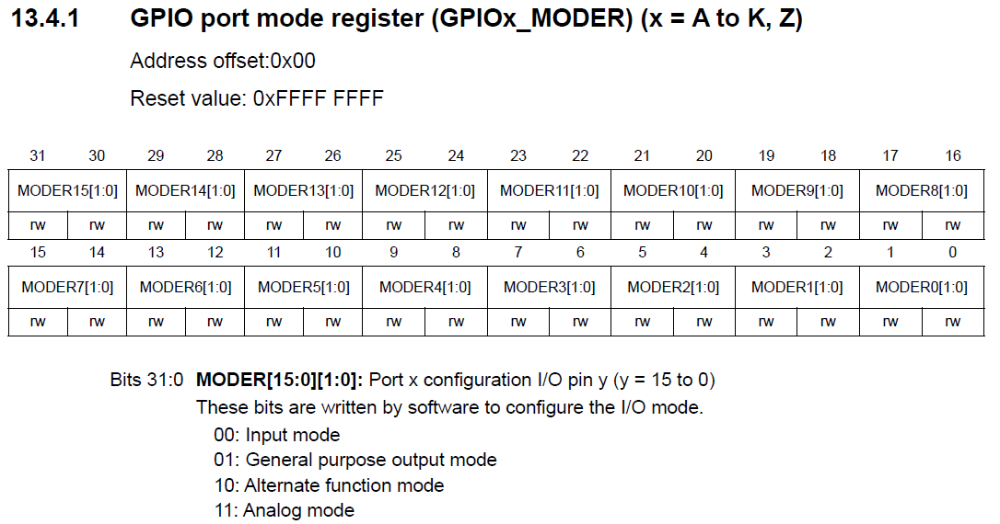
> 图：课件 Slide 6——GPIOx_MODER（Address offset 0x00，Reset 0xFFFF FFFF）：MODER15[1:0]~MODER0[1:0] 每引脚两位，00 Input / 01 General purpose output / 10 Alternate function / 11 Analog。

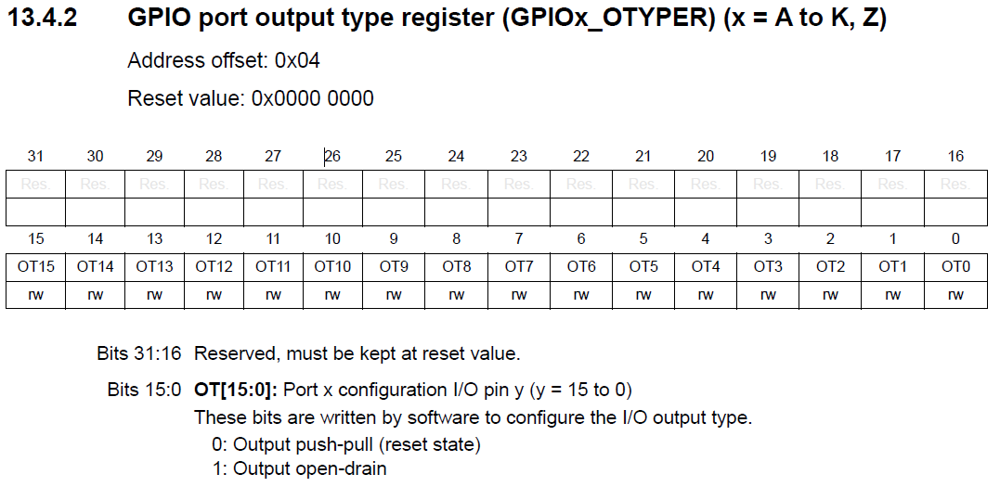
> 图：课件 Slide 7——GPIOx_OTYPER（offset 0x04）：bit15~0 每引脚一位，0 Output push-pull（推挽，复位值）/ 1 Output open-drain（开漏）。

**推挽与开漏**（OTYPER 的两个选项，电路图看一眼就懂）：

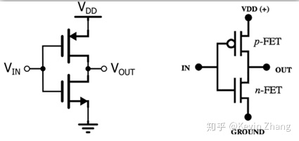
> 图：课件 Slide 8——推挽输出：两只互补 MOS 管串联（上管 P 接 VDD、下管 N 接地），输入高时上管导通输出高、输入低时下管导通输出低——**两个方向都"推得动"**，驱动能力强，是我们点亮 LED 的选择。

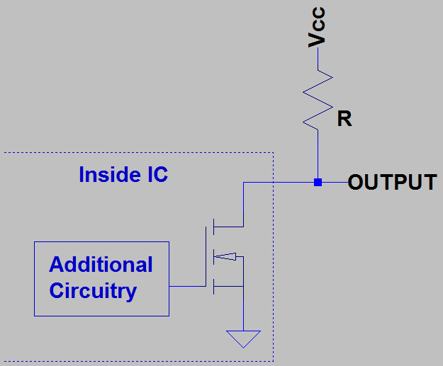
> 图：课件 Slide 8——开漏输出：片内只有一只漏极开路的 N-MOS 管接地，**输出高需要片外上拉电阻接 Vcc**——"只能拉低、放开靠上拉"。多设备共线（I2C 总线）就靠它实现线与；F-2 改 U-Boot 的 SD 卡 CD 引脚时 `GPIO_PULL_UP` 的上拉、F-1 电源节点里的开漏概念，在这里见到电路本体。

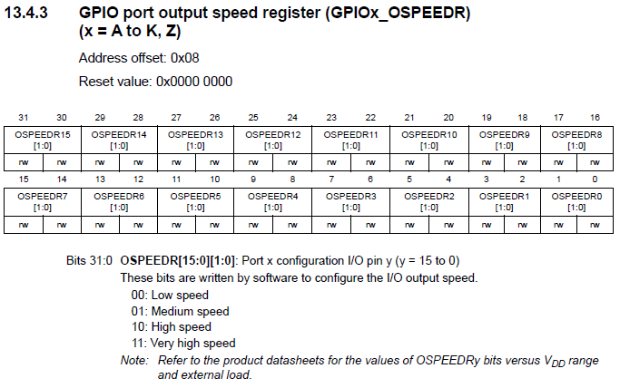
> 图：课件 Slide 9——GPIOx_OSPEEDR（offset 0x08）：00 Low / 01 Medium / 10 High / 11 Very high——"上限速度"选型与 VDD 范围、外部负载有关（点 LED 随便选，抓高速信号才讲究）。

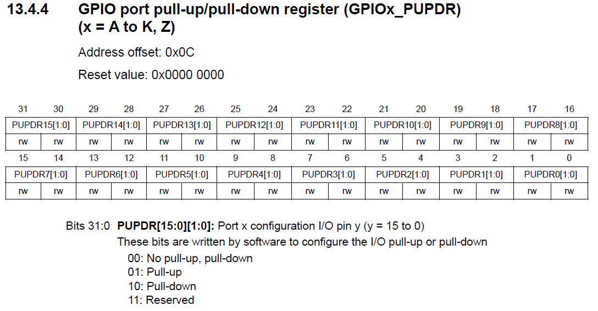
> 图：课件 Slide 10——GPIOx_PUPDR（offset 0x0C）：00 无 / 01 上拉 / 10 下拉 / 11 保留——F-2 里 SD 卡 CD 引脚"上拉 + 低有效"的软件写法，对应的就是这里的硬件位。

一张全景图把七个寄存器的关系连起来：

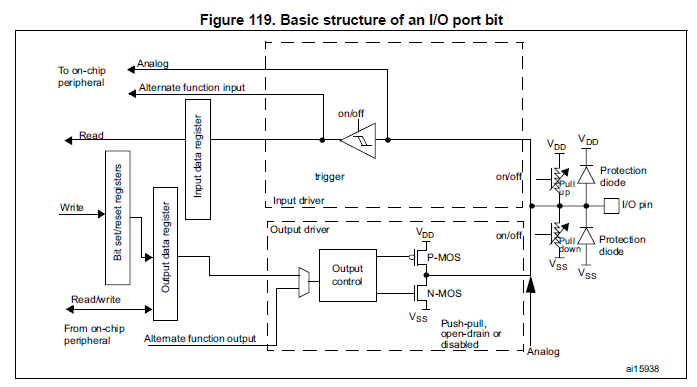
> 图：课件 Slide 11——芯片手册 Figure 119《I/O 端口位的基本结构》：左侧 BSRR/ODR/IDR 三个寄存器与复用功能输入/输出通路；右侧输入驱动（施密特触发器）与输出驱动（Output control + P-MOS/N-MOS 对管，推挽/开漏/禁用）；引脚带保护二极管与可开关的上拉/下拉电阻。**一张图看完"配置怎么起作用"**。


> 图：课件 Slide 12——GPIOx_IDR（offset 0x10，Reset 0x0000 XXXX——引脚当前电平不定）。

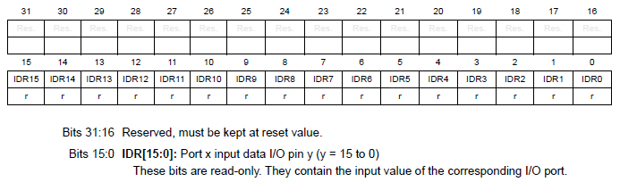
> 图：课件 Slide 12——IDR 位表：bit15~0 只读，存放对应引脚的输入值；输出模式下读它得到引脚当前电平。

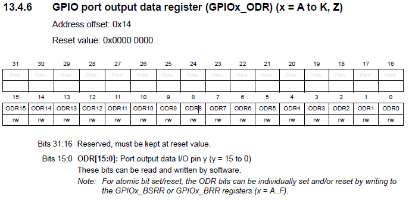
> 图：课件 Slide 13——GPIOx_ODR（offset 0x14）：bit15~0 读写；注释说明**原子置位/复位请走 BSRR/BRR**——这正是下面 BSRR 的存在意义。

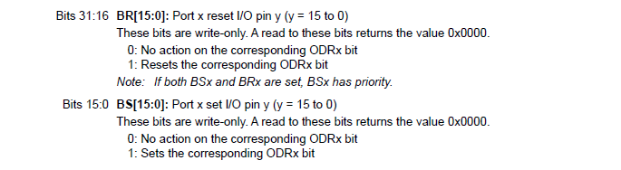
> 图：课件 Slide 14——BSRR 位说明：bit31~16 为 BR15~0（写 1 复位对应 ODR 位），bit15~0 为 BS15~0（写 1 置位）；**只写**寄存器（读返回 0）；BSx 与 BRx 同时写 1 时 BSx 优先。

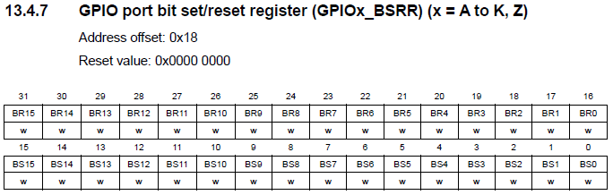
> 图：课件 Slide 14——GPIOx_BSRR（offset 0x18）：低 16 位 BS（置位）、高 16 位 BR（复位），全部 write-only。

BSRR 的妙处：改一个引脚不需要"读-改-写"三步（ODR 方式要 `val=readl(); val|=bit; writel(val);`——中断一来就可能被别的代码搅了），**直接写一次就生效**（写 0 的位无动作）。实验三十三的 led_switch 会直接用它。

## 三、LED 硬件与"程序控制设备四步"（8.3 前半）

看原理图：FS-MP1A 的三颗 LED 接在 **GPIOZ** 上——

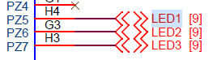
> 图：课件 Slide 15——LED 连接原理图（左半）：网络标号 PZ5（引脚 H4）、PZ6（G3）、PZ7（H3）分别接 LED1、LED2、LED3 网络。

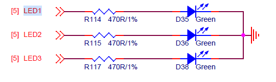
> 图：课件 Slide 15——原理图（右半）：三路 LED 各经 470Ω 限流电阻（R114/R115/R117）接绿色 LED（D35/D36/D38），负极共同接地——**GPIO 输出高电平 = LED 亮，输出低 = 灭**（正极逻辑，与很多"低电平点亮"的板子相反，写驱动前必看原理图）。

**程序控制设备的四步流程**（一切外设通吃，与实验三十"核心三步"合流）：

| 流程 | 驱动里的落点 |
|---|---|
| (1) 使能设备（开时钟） | 注册驱动时做（led.c 里这段**被注释**，原因见下） |
| (2) 配置设备（模式/参数） | 注册驱动时做（MODER/OTYPER/OSPEEDR/PUPDR） |
| (3) 操作设备 | file_operations 的操作函数（BSRR 置位复位） |
| (4) 用毕关闭（复位/断电） | 注销驱动时做 |

**操作寄存器要先过两道坎**：

**第一道：虚拟地址**。Linux 开着虚拟内存，程序里的地址都是虚拟地址，芯片手册给的寄存器地址是**物理地址**——用 `ioremap` 把物理地址映射成虚拟地址（用完 `iounmap` 解除）：

```c
void __iomem *ioremap(resource_size_t res_cookie, size_t size);   // 物理首址、长度 → 虚拟首址
void iounmap(volatile void __iomem *addr);                        // 用完必须解除
```

**第二道：有序访问**。寄存器读写不要用裸指针——编译器可能乱序优化；要用内核提供的读写函数：

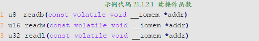
> 图：课件 Slide 19——读操作函数：`u8 readb(addr)`、`u16 readw(addr)`、`u32 readl(addr)`——8/16/32 位读，返回读到的数据。

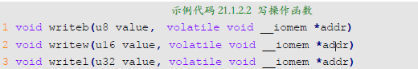
> 图：课件 Slide 19——写操作函数：`void writeb(u8 value, addr)`、`void writew(u16 value, addr)`、`void writel(u32 value, addr)`——8/16/32 位写。

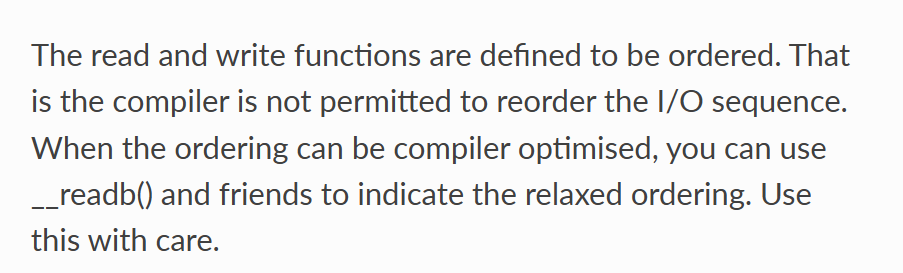
> 图：课件 Slide 20——内核文档原文："The read and write functions are defined to be ordered. That is the compiler is not permitted to reorder the I/O sequence."（读写函数被定义为有序，编译器不得重排 I/O 访问顺序）——这就是"别用裸指针"的官方理由。

**寄存器物理地址怎么算**：芯片手册查 GPIOZ **基址 0x54004000**，加上 8.2 节各寄存器的偏移（MODER 0x00、OTYPER 0x04、OSPEEDR 0x08、PUPDR 0x0C、BSRR 0x18）即得。基址的出处：

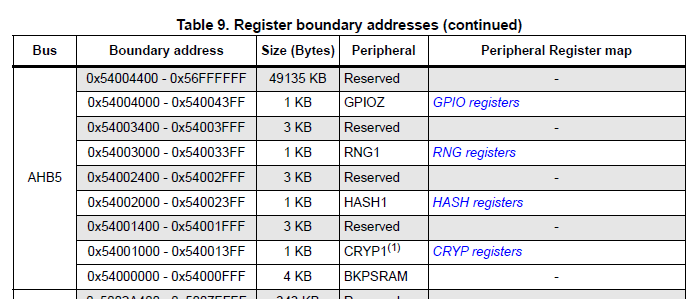
> 图：课件 Slide 21——芯片手册 Register boundary addresses 表（AHB5 段）：`0x54004000–0x540043FF（1 KB）GPIOZ`；同表还能看到 RNG1（0x54003000）、HASH1（0x54002000）等邻居。

**时钟使能——一段注定被注释掉的代码**（本节最有意思的知识点）：GPIOZ 的时钟由 RCC（Reset and Clock Control）模块管，使能位在 `RCC_MP_AHB5ENSETR`（RCC 基址 0x50000000 + offset 0x210）的 bit0（GPIOZEN），写 1 使能：

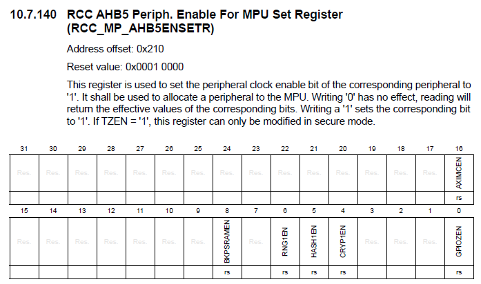
> 图：课件 Slide 24——RCC_MP_AHB5ENSETR（offset 0x210，Reset 0x0001 0000）：写 '1' 使能外设时钟、写 '0' 无效果；位域含 bit0 GPIOZEN、bit6 RNG1EN、bit5 HASH1EN、bit4 CRYPT1EN、bit8 BKPSRAMEN 等。

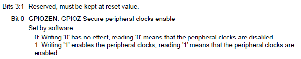
> 图：课件 Slide 24——GPIOZEN 位说明：Set by software——写 '1' 使能（读 '1' = 已使能），写 '0' 无效果（读 '0' = 时钟关闭）。

但课件明说：**LED 驱动里这段代码注释掉了**，两个原因：

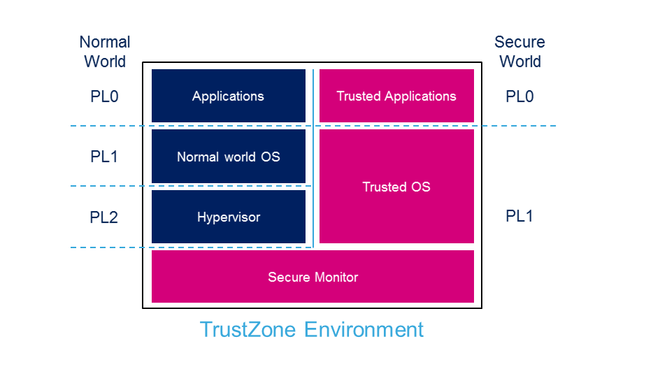
> 图：课件 Slide 26——TrustZone Environment 框图：Normal World（PL0 应用 / PL1 普通 OS / PL2 Hypervisor）与 Secure World（PL0 可信应用 / PL1 可信 OS），底部 Secure Monitor 横跨两界——我们跑的 Linux 是"正常世界"，TF-A（第 3 章收官时接任 FSBL 的那位）是"安全世界"的住民。

1. **出厂 TF-A 已经使能了 GPIOZ 时钟**——第 3 章烧进板的 TF-A 顺手办了；
2. **RCC_MP_AHB5ENSETR 属于"安全世界"**（AHB5 总线上的设备都是），非安全世界（我们的 Linux）**写不动它**——写了也无效。

驱动源码里保留注释版代码，是为了给"完整流程"留教材——读到 `#if 0` 段时知道它为什么躺平即可。

## 四、实验环境（实际）

| 项目 | 实际值 |
|---|---|
| 板子 | 第 7 章收官形态；三颗绿色 LED 在板上（PZ5/PZ6/PZ7，高电平点亮） |
| Ubuntu | gcc-arm-9.2 + 内核源码树 + drivers-dev.zip 已解（01-toychar 用过） |
| 本篇材料 | `drivers-dev.zip` 的 `02-led/`（led.c + ledApp.c + Makefile）——**不重复复制**：这个包已在第 7 章目录（`05_字符设备驱动/`）复制并解压过，直接取里面的 `02-led/` 子目录（实验三十三编译） |

> **开工自检（10 秒）**：本篇是认知篇（读图与源码预读）。确认 `02-led/led.c` 里 6 个 `ioremap`、`#if 0` 时钟段、BSRR 的 `1<<5`/`1<<21` 都能对上本篇讲过的寄存器——对上了，实验三十三的代码就没有一行是新的。

## 五、课件 ↔ 步骤对应表

| 课件 Slide | 内容 | 对应本篇 |
|---|---|---|
| 2~3 | GPIO 概念、12 组 176 脚、四种模式、"一切皆寄存器读写" | 第一节 |
| 4~14 | 七个寄存器逐个 + 推挽/开漏电路 + I/O 位结构图 | 第二节 |
| 15~16 | LED 原理图（PZ5~7 高电平点亮） | 第三节 |
| 17 | 程序控制设备四步流程 | 第三节 |
| 18~20 | ioremap/iounmap、readl/writel、有序访问 | 第三节 |
| 21~22 | GPIOZ 基址 0x54004000 | 第三节 |
| 23~26 | RCC 时钟使能、安全世界与 TF-A（代码注释的原因） | 第三节 |

### 本篇概念 → 后面谁用 → 现在含糊的后果

| 本篇概念 | 后面哪一篇用 | 现在含糊的后果 |
|---|---|---|
| MODER/OTYPER/OSPEEDR/PUPDR/BSRR 位段 | 实验三十三 led.c 的六步初始化逐行对照 | 代码里 `val &= ~(0x3 << 10)` 不知道在配哪个脚 |
| BSRR 只写、原子置位复位 | led_switch 的"直接写、不读改写" | 画蛇添足先读后写，读到全 0 还以为寄存器坏了 |
| ioremap + readl/writel | 实验三十三全部寄存器操作；第 9 章 dtsled 的 of_iomap | 裸指针访问寄存器，偶发跑飞查不到 |
| 高电平点亮 + PZ5~7 | 实验三十三测试现象的预期 | 灯不亮不知道是驱动错还是极性记反 |
| 安全世界/RCC 注释段 | 读第 9 章设备树版驱动时的时钟处理 | 以为漏抄了使能代码 |

本篇不需要新动手的材料。

## 六、自测一览

| 自测问题 | 达标答案 | 在哪一节 |
|---|---|---|
| STM32MP157 的 GPIO 怎么编号？ | 12 组 A~K、Z，每组 16 脚（K/Z 各 8），引脚 Pxy 如 PB2、PZ5 | 第一节 |
| 四种工作模式由哪个寄存器选？每脚占几位？ | MODER；2 位（00 输入/01 输出/10 复用/11 模拟） | 第二节 |
| 推挽与开漏的区别？LED 用哪个？ | 推挽双向驱动；开漏只能拉低、靠外部上拉——LED 用推挽 | 第二节 |
| 改一个引脚电平为什么推荐 BSRR 而不是 ODR？ | BSRR 只写、写 1 生效、原子操作——免"读改写"竞态 | 第二节 |
| 访问寄存器为什么不能直接用指针？ | 编译器可能乱序；用 readl/writel（有序），且先 ioremap 把物理地址映射为虚拟地址 | 第三节 |
| GPIOZ 时钟使能代码为什么被注释？ | TF-A 已使能 + RCC_MP_AHB5ENSETR 属安全世界，Linux 写不动 | 第三节 |
| LED 亮灭的电平极性？ | 高电平点亮（三只绿灯负极接地，经 470Ω 限流） | 第三节 |

## 七、下一步：LED 驱动两个版本

下一篇（实验三十三）把本篇的寄存器地图变成能上板的代码：led.c 寄存器直控版（主 201、手动 mknod，ledApp 写 1 开灯写 0 关灯），mdevled.c 自动创建设备文件版（alloc_chrdev_region→cdev→class_create→device_create 五函数与注销逆序）——mdev 与 class 机制联动后，`/dev/led` 会自己出现。
