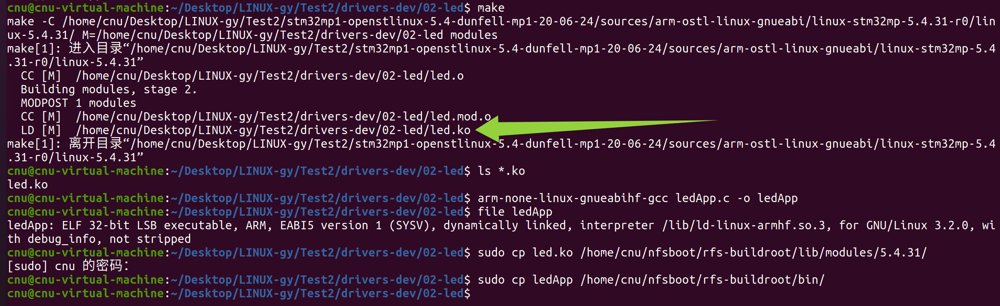
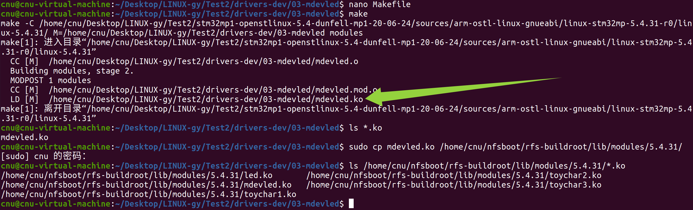

# 实验三十三 LED 驱动两个版本——寄存器直控与自动创建设备文件

> **对应课件**：《第8章 GPIO端口》8.3 节后半，Slide 27-34
>
> **系列说明**：本系列基于华清远见 FS-MP1A（STM32MP157A）开发板，对应课件《第8章 GPIO端口》。实验三十二把寄存器地图立好，本篇写**第一个控制真硬件的驱动**：LED1（PZ5）。例 1 `led.c` 走寄存器直控路线（ioremap + readl/writel + BSRR），设备文件手动 mknod——与 toychar 同款流程；例 2 `mdevled.c` 升级为**自动创建设备文件**（alloc_chrdev_region → cdev → class_create → device_create 五函数），`/dev/mdevled` 由内核自己生成——从这版起告别 mknod（设备名跟模块同名，由源码 `LED_NAME` 决定）。两版的测试程序同为 `ledApp`。前置：实验三十二（寄存器地图）、实验三十一（外部模块编译流程）。

## 一、两版差异一览

| | 例 1 led.c | 例 2 mdevled.c |
|---|---|---|
| 主设备号 | **写死 201** | **alloc_chrdev_region 内核自动分配** |
| 设备文件 | 手动 `mknod /dev/led c 201 0` | **自动生成**（class_create + device_create，mdev 接报落地） |
| 注册/注销 | register/unregister_chrdev | cdev 三件套 + class/device 两件套，注销逆序 |
| 控灯代码 | 完全相同（ioremap + writel BSRR） | 完全相同 |

控制约定（ledApp 与驱动共用）：向 /dev/led **写 1 = 开灯（LEDON）、写 0 = 关灯（LEDOFF）**，一个字节搞定。

## 二、实验环境（实际）

| 项目 | 实际值 |
|---|---|
| 操作位置 | Ubuntu 编译两个驱动 + ledApp；板上加载、测试 |
| 根文件系统 | buildroot 版 `rfs-buildroot`（NFS） |
| 素材 | `drivers-dev.zip` 的 `02-led/`（led.c 247 行 + ledApp.c 65 行 + Makefile）、`03-mdevled/`（mdevled.c 290 行 + 同款 ledApp + Makefile）——**zip 已在第 7 章目录（`05_字符设备驱动/`）复制解压过，本篇不重复复制**，同一包用三章、各取所需子目录 |
| 板上硬件 | 三颗绿色 LED（PZ5/PZ6/PZ7），本篇操作 LED1 |

> **开工自检（10 秒）**：toychar 的 `*.ko` 已从板上卸干净（`lsmod` 无残留）；`02-led/Makefile` 的 KERNELDIR 已指本机内核树（第 7 章同款改动）；板上三颗灯当前状态看一眼（出厂 TF-A 使能时钟后引脚默认态不定，驱动加载会显式开灯）。

## 三、课件 ↔ 步骤对应表

| 课件 Slide | 内容 | 对应步骤 |
|---|---|---|
| 27 | 例 1：led.c + ledApp.c，需手动建设备文件 | 步骤 1~3 |
| 28~33 | 自动创建设备文件的五个函数原型与注销逆序 | 步骤 4 |
| 34 | 例 2：mdevled.c（测试程序仍是 ledApp） | 步骤 4~5 |

### 本篇动作 → 后面谁用 → 现在含糊的后果

| 本篇动作 | 后面哪一篇要用 | 现在含糊的后果 |
|---|---|---|
| 自动创建五函数（alloc/cdev/class/device） | 第 8 章后所有驱动模板；第 9 章 dtsled 同款 | 每写一个驱动都回到"手动 mknod"原始社会 |
| 注销逆序（5→4→3→2→1） | 一切驱动的 exit 函数写法 | 注销顺序错，内核残留资源或崩溃 |
| BSRR 直控灯 | 第 9 章 dtsled（同一颗灯换成设备树取参）；第 10 章 GUI 背光 | —— |
| `ls /sys/class/mdevled/` 的 class 概念 | 以后排查"设备文件没生成"先看 class | device_create 失败了还在 mknod 上打转 |

## 四、实验步骤

### 步骤 1：读 led.c 的初始化六步（Slide 27，源码 247 行）

`02-led/led.c` 的骨架与 toychar3 相同（fops + register_chrdev），**新增的全在 init 里**——实验三十二寄存器地图的落地版，六步逐行读：

```c
#define LED_MAJOR		201		/* 主设备号 */
#define LED_NAME		"led" 	/* 设备名字 */
#define LEDOFF 	0				/* 关灯 */
#define LEDON 	1				/* 开灯 */

/* 寄存器物理地址 */
#define RCC_BASE        		    (0x50000000)
#define RCC_MP_AHB5ENSETR			(RCC_BASE + 0x210)
#define GPIOZ_BASE					(0x54004000)
#define GPIOZ_MODER      			    (GPIOZ_BASE + 0x0000)
#define GPIOZ_OTYPER      			    (GPIOZ_BASE + 0x0004)
#define GPIOZ_OSPEEDR      			    (GPIOZ_BASE + 0x0008)
#define GPIOZ_PUPDR      			    (GPIOZ_BASE + 0x000C)
#define GPIOZ_BSRR      			    (GPIOZ_BASE + 0x0018)
```

1. **映射**：六个寄存器各 `ioremap(物理地址, 4)`——基址 0x54004000 + 偏移，与实验三十二手册表逐项对应；
2. **时钟使能（`#if 0` 注释段）**：写 RCC_MP_AHB5ENSETR 的 GPIOZEN——**安全世界寄存器写不动、TF-A 已使能**，代码留作教材（实验三十二第三节）；
3. **MODER：PZ5 设为输出**——`val &= ~(0x3 << 10); val |= (0x1 << 10);`（PZ5 占 bit11:10，清 2 位再写 01 = 输出模式）；
4. **OTYPER：推挽**——`val &= ~(0x1 << 5);`（bit5 写 0 = push-pull）；
5. **OSPEEDR：高速**、**PUPDR：上拉**——同款"清 2 位写新值"；
6. **BSRR 默认开灯**：`val = (0x1 << 5); writel(val, GPIOZ_BSRR_PI);`——**只写寄存器不读**（源码注释："此寄存器写 1 有效，写 0 无任何作用"）。

**led_switch**（write 函数里被调用）就两行核心：

```c
	if(sta == LEDOFF) {
		val = (1 << 21);			// bit21 = BR5（高 16 位的复位位），写 1 复位 PZ5 → 灯灭
		writel(val, GPIOZ_BSRR_PI);
	}else if(sta == LEDON) {
		val = (1 << 5);				// bit5 = BS5（低 16 位的置位位），写 1 置位 PZ5 → 灯亮
		writel(val, GPIOZ_BSRR_PI);
	}
```

`1<<5` 与 `1<<21` 正是 BSRR 的 BS5/BR5——高 16 位复位、低 16 位置位，源码里"不需要 read-modify-write"的注释就是实验三十二 BSRR 那节的结论。

### 步骤 2：编译 led.ko 与 ledApp，部署

```bash
# Ubuntu，02-led/ 里先 `nano Makefile` 改一处：**Ctrl+W** 搜 `KERNELDIR`，把第 1 行改成你的内核源码树路径（**Ctrl+O** 回车保存、**Ctrl+X** 退出——键位卡见实验二十步骤 1）；`obj-m := led.o` 素材包已预填，不用动
make                                 # 收尾 MODPOST 1 modules → LD [M] led.ko
ls *.ko                              # 就地验证：led.ko 存在
arm-none-linux-gnueabihf-gcc ledApp.c -o ledApp
file ledApp                          # 就地验证：ELF 32-bit ... ARM, EABI5
sudo cp led.ko /home/cnu/nfsboot/rfs-buildroot/lib/modules/5.4.31/
sudo cp ledApp /home/cnu/nfsboot/rfs-buildroot/bin/
```

> **led.ko 由 `make` 产出**——只 nano 改 Makefile 不 make，`ls *.ko` 就是"没有那个文件或目录"；`gcc` 编的 `ledApp` 是用户态测试程序，与内核模块两码事，别混。
>
> **为什么带 sudo**：与实验三十一同款——实验二十九 chown 归 root 后凡往 rfs-buildroot 拷文件一律 sudo，普通 cp 报"权限不够"不是坏了。

> Makefile 的 `obj-m` 素材包里已是 `led.o`（与 toychar 包同款加强版）；若你复制了 toychar 的 Makefile，记得把三行 obj-m 换成一行 `obj-m := led.o`。


> 图：实测——02-led 一屏收全程：`make` 收尾 `MODPOST 1 modules` → 绿框 `LD [M] led.ko`；`file ledApp` 见 **ARM, EABI5**；sudo cp 两件落位（led.ko 进 modules 目录、ledApp 进 bin）。

### 步骤 3：加载、手动建设备文件、点灯（Slide 27）

```bash
# 板上（buildroot 根）：
depmod
modprobe led
lsmod                              # 就地验证：列表里有 led（led.c 平时不打印——printk 只在出错路径，dmesg 安静≠没加载）
mknod /dev/led c 201 0             # 主 201 = LED_MAJOR，与驱动一致
ls -l /dev/led                     # crw-r--r-- 1 root root 201, 0

ledApp /dev/led 1                  # 写 1 = LEDON → LED1 亮
ledApp /dev/led 0                  # 写 0 = LEDOFF → LED1 灭
```

**LED1 亮灭随命令切换**——第一颗被你亲手点亮的真实硬件（盯板上三颗绿灯里丝印 **LED1** 那颗，别盯错灯）。rmmod 后灯灭（exit 函数里 `led_switch(LEDOFF)`）：

```bash
rmmod led
dmesg | tail -2                    # 无新报错即干净卸载（照旧安静属正常）
rm /dev/led                        # 手动建的文件手动删——报 "No such file"？见下
```

> **rm 报 "No such file" 不是闹鬼**：mdev（实验二十六 rcS 常驻的热插拔代理）对**模块**的卸载事件也响应——rmmod 时内核给名为 `led` 的模块发 remove 事件，mdev 按名字把同名的 `/dev/led` 一并 unlink 了。设备文件没了 `mknod` 十秒重建，无碍。

### 步骤 4：mdevled——五个函数，设备文件自动出现（Slide 28~34）

例 2 的控灯代码与例 1 完全相同，改的是**注册/注销这一对**。课件给的两个五步清单——注册按 1→5，注销按 5→1 **严格逆序**：

| # | 注册（init） | 注销（exit） |
|---|---|---|
| 1 | `alloc_chrdev_region(&devid, 0, LED_CNT, LED_NAME)` 申请设备号 | `unregister_chrdev_region(devid, LED_CNT)` 注销设备号 |
| 2 | `cdev_init(&led_cdev, &led_fops)` 初始化 cdev | （无对应） |
| 3 | `cdev_add(&led_cdev, devid, LED_CNT)` 添加 cdev | `cdev_del(&led_cdev)` 删除 cdev |
| 4 | `class_create(THIS_MODULE, LED_NAME)` 创建 class | `class_destroy(led_class)` 删除 class |
| 5 | `device_create(led_class, NULL, devid, NULL, LED_NAME)` **创建设备文件** | `device_destroy(led_class, devid)` 删除设备文件 |

各函数参数速查（课件 Slide 30~33）：`alloc_chrdev_region` 的 dev 是"内核分配的设备号"（主次打包在一个 u32 里——实验三十的 dev_t），baseminor 起始次设备号、count 数量；`device_create` 的 fmt 是设备文件名。cdev 是内核管理驱动的数据结构（课件类比：进程的 PCB）。API 文档在 https://docs.kernel.org。

mdevled.c 的 init 关键段（290 行，六步寄存器初始化与 led.c 相同，只列注册段）：

```c
	ret = alloc_chrdev_region(&led.devid, 0, LED_CNT, LED_NAME);	/* 申请设备号 */
	cdev_init(&led.led_cdev, &led_fops);
	ret = cdev_add(&led.led_cdev, led.devid, LED_CNT);
	led.led_class = class_create(THIS_MODULE, LED_NAME);
	led.led_device = device_create(led.led_class, NULL, led.devid, NULL, LED_NAME);
```

编译部署同步骤 2（`03-mdevled/` 里 make + 同一个 ledApp）：

```bash
# Ubuntu，03-mdevled/ 里同样先 `nano Makefile`：**Ctrl+W** 搜 `KERNELDIR`、第 1 行改成你的内核树——**每个素材子目录各一份 Makefile、各改各的**（zip 里预填的都是课件作者路径，02-led 改过不会带过来）
make                                 # MODPOST 1 modules → LD [M] mdevled.ko
sudo cp mdevled.ko /home/cnu/nfsboot/rfs-buildroot/lib/modules/5.4.31/
ls /home/cnu/nfsboot/rfs-buildroot/lib/modules/5.4.31/*.ko    # 就地验证：led.ko + mdevled.ko 两件在册
```


> 图：实测——03-mdevled 同款流程：nano 改 KERNELDIR（**每个子目录各改各的**）→ `make` → 绿框 `LD [M] mdevled.ko`；sudo cp 后 `ls` 见 modules 目录里五件 .ko——toychar 三件 + led + mdevled（rmmod 只是内存层面卸载，.ko 文件留档属正常）。

### 步骤 5：加载验证——/dev/mdevled 自己出现

```bash
# 板上：
depmod && modprobe mdevled
lsmod                              # mdevled 在列 = 加载成功（平时同样不打印）
ls /sys/class/mdevled/             # mdevled —— class_create 的产物（/sys 的目录视角）
ls -l /dev/mdevled                 # 设备文件已自动生成！主设备号是内核分配的（不再是 201）
cat /proc/devices | grep mdevled   # 看这次分到的主设备号
ledApp /dev/mdevled 1              # 亮
ledApp /dev/mdevled 0              # 灭
```

**名字跟上例不一样**：mdevled.c 第 21 行 `#define LED_NAME "mdevled"`——class 与设备文件都叫 **mdevled**，别按例 1 的 `led` 去找（实测按 `/sys/class/led` 找扑了个空才对出来的）。`/dev/mdevled` 没有经过任何 mknod——`device_create` 发出设备事件，**实验二十六 rcS 里常驻的 mdev 收到后自动生成文件**（第 6 章 `echo /sbin/mdev > /proc/sys/kernel/hotplug` 那一行的兑现时刻）。查主设备号的新姿势：`ls -l /dev/mdevled` 直接看（每次加载可能不同——这就是"自动分配"）。

实测全中：`lsmod` 见 `mdevled 16384 0`（表头照旧 `Tainted: G`）；`ls -l /dev/mdevled` 见 **`crw-rw---- 240, 0`**——主设备号 240 是内核现场分配的（"自动分配"的铁证，每次加载可能变）；权限位 660 与手动 mknod 的 644 不同——**mdev 建节点有自己的默认权限**，不影响 root 使用；`/proc/devices` 出 `240 mdevled`；`ledApp` 开关灯后 `rmmod mdevled` 收尾。

卸载：`rmmod mdevled`——/dev/mdevled 与 /sys/class/mdevled 同步消失（注销五步逆序的现场）。

## 五、注意事项

1. **mknod 的主设备号必须与 `LED_MAJOR`（201）一致**——只对例 1 成立；例 2 主设备号是内核给的，**禁止 mknod**（自己建文件反而与 device_create 的对不上号）。
2. **BSRR 是只写寄存器**：不要"先 readl 再改位"——读到全 0 是正常现象，不是坏了（led.c 注释原话）。
3. **注销五步严格逆序**（5→4→3→2→1）——顺序错了会在引用未释放资源时崩溃；mdevled.c 的 exit 与 goto fail 链都按这个序写。
4. **`class_create`/`device_create` 失败要有清理路径**（源码里 `goto fail_class_destroy`/`goto fail_cdev_del` 的回滚链）——照抄即可，但要知道那是"申请一半失败要退已申请的"。
5. **切版本前先 rmmod 旧的**——两驱动的模块名（led/mdevled）、设备名（/dev/led、/dev/mdevled）、设备号（201 / 内核分配）互不冲突，同时加载也不会报 busy；但两套驱动控的是**同一颗 PZ5 灯**，同时在场只会让"灯是谁点的"说不清，一次只留一个。
6. 灯不亮排查顺序：`dmesg` 有无加载报错 → `ls /dev/led` 在不在（例 1 忘 mknod 最常见）→ 极性（我们的板高电平点亮）→ 换 LED2/LED3（PZ6/PZ7）交叉验证硬件。

## 六、验证点一览

| 验证点 | 命令 | 通过的样子 | 在哪一步敲 |
|---|---|---|---|
| led.ko 编出 | `ls *.ko`（02-led/） | led.ko 存在 | 步骤 2 |
| 加载无报错 | `modprobe led` + `lsmod` | led 在列；dmesg 无 failed（平时不打印、安静属正常）；LED1 默认亮 | 步骤 3 |
| 设备文件（例1） | `ls -l /dev/led`（mknod 后） | `201, 0` 字符设备 | 步骤 3 |
| 开关灯 | `ledApp /dev/led 1` / `0` | LED1 亮 / 灭 | 步骤 3 |
| 设备文件（例2） | `modprobe mdevled` 后 `ls -l /dev/mdevled` | 自动出现（实测 `crw-rw---- 240, 0`：mdev 默认 660 权限，与 mknod 的 644 不同） | 步骤 5 |
| class 视角 | `ls /sys/class/mdevled/` | `mdevled` 目录 | 步骤 5 |
| 卸载同步 | `rmmod mdevled` 后 `ls /dev/mdevled`、`ls /sys/class/mdevled/` | 两者都消失 | 步骤 5 |

不达标时的排查：

| 现象 | 先查什么 |
|---|---|
| ledApp 报 `Can't open file` | 例 1 忘了 mknod；例 2 敲成 `/dev/led` 了（设备文件叫 **/dev/mdevled**）；真没生成再查 device_create（dmesg 报错、`ls /sys/class/mdevled/`） |
| 灯不亮但命令成功 | 极性认知（高电平亮）；换 `ledApp /dev/led` 连续 1/0 对比；看板子上 LED1 丝印位置别盯错灯 |
| `modprobe led` 报 busy | toychar/led 旧模块没卸（`lsmod` 清场） |
| device_create 后 /dev 无文件 | mdev 在岗吗（实验二十六 rcS 的 hotplug 行 + 实验二十七 uevent helper 勾选——两道前提）；先 `ls /sys/class/mdevled/` 确认 class 在不在 |
| rmmod 后又加载主设备号变了 | 正常——alloc_chrdev_region 每次分配（这就是与写死 201 的区别） |

## 七、实验完成标志

- led.ko 与 ledApp 编译部署完成，`mknod /dev/led c 201 0` 后 `ledApp` 开关灯实测无报错（步骤 1~3 实测；**LED1 随命令亮灭 = 物理验收判据**，盯丝印 LED1 那颗）
- rmmod led 干净卸载（步骤 3 实测）；/dev/led 的清理由 mdev 随模块 remove 事件自动完成——手动 rm 报 "No such file" 属正常（步骤 3 实测）
- mdevled.ko 加载后 **/dev/mdevled 自动生成**（实测 `crw-rw---- 240, 0`——mdev 默认 660 权限）、`/sys/class/mdevled/mdevled` 在列、`/proc/devices` 出 `240 mdevled`（步骤 4~5 实测）
- ledApp 对 /dev/mdevled 开关灯同样可控（步骤 5 实测）；rmmod 后设备文件与 class 同步消失为卸载同步判据
- 注销五步逆序与失败回滚链在源码里能指出（步骤 4）

## 八、下一步：第 9 章 设备树版 LED 驱动

寄存器直控版虽然通了，但地址写死在驱动里——换块板就报废。第 9 章《设备树》把 LED 迁到设备树路线：drivers-dev.zip 的 `04-dtsled`，在设备树里描述 LED 节点、驱动从设备树取寄存器地址（of_iomap/of_platform），PZ5 还是那颗灯，代码却换上了"硬件描述与驱动分离"的正装。
