# 实验三十四 设备树语法与 OF 函数——把硬件描述从代码里搬出来

> **对应课件**：《第9章 设备树》9.1~9.4 节，Slide 2-56
>
> **系列说明**：本系列基于华清远见 FS-MP1A（STM32MP157A）开发板，对应课件《第9章 设备树》。第 3 章和第 5 章我们改了十来处设备树（F 系列的 U-Boot 版、sdmmc2/ethernet0 的内核版），本篇把欠的账一次结清：设备树为什么存在、语法规则是什么、内核怎么用它。9.5 节的设备树版 LED 驱动是下一篇的实操。前置：第 3/5 章的设备树修改经历（本篇全部概念都挂在那上面）、实验三十三（寄存器直控版 LED——本篇结尾预告它怎么"正装化"）。

## 一、设备树为什么存在：Linus 的一声怒吼

早期 ARM Linux 不用设备树，板级硬件描述**硬编码**在内核源码里——每款板子一堆 `arch/arm/mach-xxx` 文件描述自己的细节，内核里全是垃圾代码，维护困难。2011 年 3 月 17 日 Linus 在邮件列表里爆了粗口：

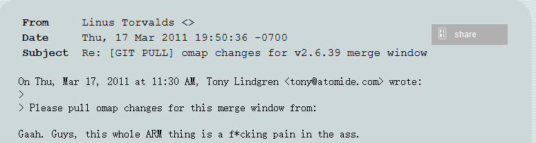
> 图：课件 Slide 2——LKML 邮件截图：Linus Torvalds 2011-03-17 回复 omap 合并请求，"Gaah. Guys, this whole ARM thing is a f\*cking pain in the ass."——对 ARM 板级硬编码的著名吐槽（https://lkml.org/lkml/2011/3/17/492）。

设备树（Flattened Device Tree）由此全面进入 ARM 世界：**设备树描述设备细节，对设备的控制留在内核代码**——二者分离。设备树源文件编译成二进制 `.dtb`，内核启动时由 bootloader 传给内核（第 4 章实验十六 `bootm c2000000 - c4000000` 的第三个参数就是它；第 5 章 `make dtbs` 编的就是它）。

`dts`（源文件）→ `dtc`（编译器，内核 scripts/dtc 自带）→ `dtb`（内核用的二进制）。哪些 dtb 被编译由 `arch/arm/boot/dts/Makefile` 决定——我们第 5 章加的那一行：

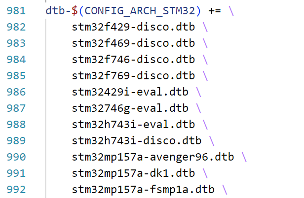
> 图：课件 Slide 6——dts/Makefile 第 981~992 行：`dtb-$(CONFIG_ARCH_STM32) += \` 清单里的 `stm32mp157a-fsmp1a.dtb`——实验二十步骤 4 我们亲手加进去的那行。

## 二、语法一：文件组织与节点引用合并

**头文件**：.dts 可 `#include` .h（寄存器定义宏）与 .dtsi（公共设备信息——SoC 内部设备的描述）。我们板子的引用链：

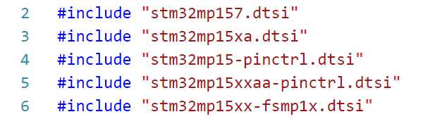
> 图：课件 Slide 8——stm32mp157a-fsmp1a.dts 第 2~6 行引用：`stm32mp157.dtsi`、`stm32mp15xa.dtsi`、`stm32mp15-pinctrl.dtsi`、`stm32mp15xxaa-pinctrl.dtsi`、`stm32mp15xx-fsmp1x.dtsi`——前四个是 0020-DEVICETREE 补丁带来的"新命名"文件（实验十九步骤 3.2），最后一个是老师给的板级文件。

**节点与属性**：树形结构，每个节点对应一个设备（`node-name@unit-address`，片上外设的 unit-address 是寄存器基址），节点下一组键值对属性（`xxx = yyy`，值可为空）。根节点用 `/` 表示，**所有被 include 文件的根节点合并成一个根**。

**标签（label）与引用**：`label: node-name@unit-address` 里的 label 是给"引用"用的——`&label` 直达节点。引用的目的是**修改**：新增属性追加、重复属性覆盖，编译时合并，**原 .dtsi 一字不动**：

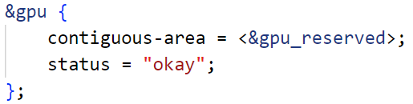
> 图：课件 Slide 15——用户 .dts 里通过 `&gpu` 引用节点并写入 `contiguous-area = <&gpu_reserved>; status = "okay";`——我们第 3/5 章改的 sdmmc1/sdmmc2/ethernet0 全是这个套路。

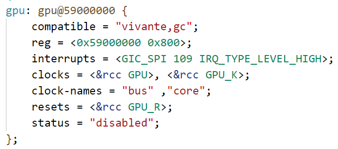
> 图：课件 Slide 16——stm32mp151.dtsi 里 gpu 节点原始定义：`compatible = "vivante,gc"; reg = <0x59000000 0x800>; ... status = "disabled";`——SoC 级默认关闭。

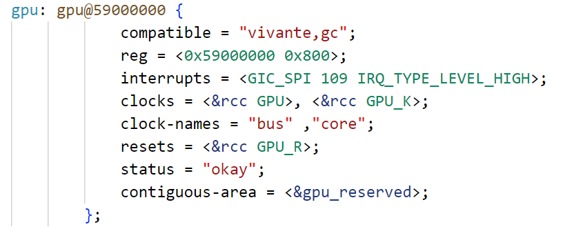
> 图：课件 Slide 16——合并结果：status 由 "disabled" **覆盖**为 "okay"（重复属性覆盖），contiguous-area **追加**（新增属性）——实验二十 sdmmc2 节点"把 SoC 默认 disabled 翻成 okay"说的就是这层机制。

**属性值的数据类型**：字符串（`compatible = "arm,cortex-a7"`）、字符串列表（`compatible = "st,stm32mp157d-atk", "st,stm32mp157"`）、cell（`<>` 括起的 u32：单个 `reg = <0>`、一组 `reg = <0 0x123456 100>`）、phandle（节点引用，本质 u32：`clocks = <&scmi0_clk CK_SCMI0_MPU>`）。

## 三、语法二：标准属性逐个认

**compatible——驱动与设备的"暗号"**（非根节点）：值是 `"manufacturer,model"` 字符串列表；驱动里有一张 OF 匹配表，对上一个字符串就配对成功：

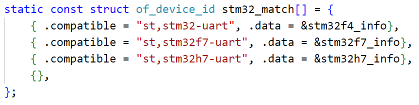
> 图：课件 Slide 22——stm32mp151.dtsi 的 usart2 节点：`compatible = "st,stm32h7-uart"; reg = <0x4000e000 0x400>;`。

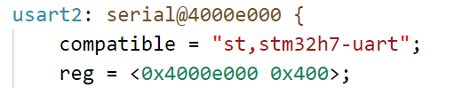
> 图：课件 Slide 22——驱动里的 of_device_id 匹配表：`{"st,stm32-uart",...}, {"st,stm32f7-uart",...}, {"st,stm32h7-uart",...}`——第三个值与 usart2 匹配，串口驱动接管。

**model**：开发板名字字符串——我们根节点的 `HQYJ STM32MP157 FSMP1A Discovery Board`（实验二十三 Machine model 的出处）。

**status**：设备状态，"okay"/"disabled" 最常用（还有 fail/fail-sss）。

**#address-cells 与 #size-cells**：声明**子节点 reg 怎么解析**——基址占几个 u32、长度占几个 u32：

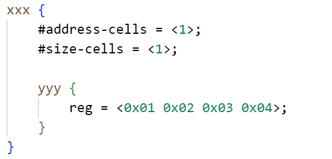
> 图：课件 Slide 27——`#address-cells = <1>`、`#size-cells = <1>` 时：reg 的 4 个 u32 解析为两对"基址 长度"。

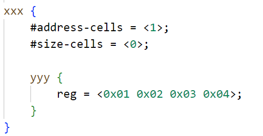
> 图：课件 Slide 27——`#size-cells = <0>` 时：每个 u32 都是一个基址、无长度字段。

**reg**：设备地址，`<基址 长度>`（我们的 `reg = <0x54004000 0x400>` 全是这么读的）。**ranges**：子总线到父总线的地址映射表（`<子基址 父基址 长度>`，空值=一对一）：

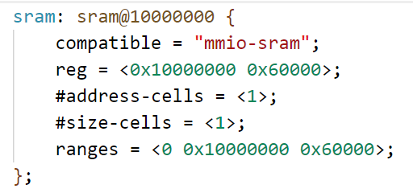
> 图：课件 Slide 30——stm32mp151.dtsi 的 sram 节点：`reg = <0x10000000 0x60000>; #address-cells = <1>; #size-cells = <1>; ranges = <0 0x10000000 0x60000>;`——子地址 0 起的 0x60000 映射到父总线 0x10000000。

**根节点的 compatible 有特殊使命**：内核用它与 `machine_desc` 结构体的 `dt_compat` 列表比对，**匹配上才启动**：

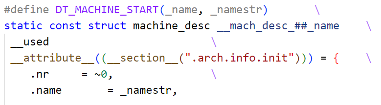
> 图：课件 Slide 33——arch/arm/mach-stm32/board-dt.c：`stm32_compat[] = { "st,stm32f429", ..., "st,stm32mp151", "st,stm32mp153", "st,stm32mp157", NULL }`——我们根节点 compatible 第二个值 "st,stm32mp157" 就是匹配这里的。

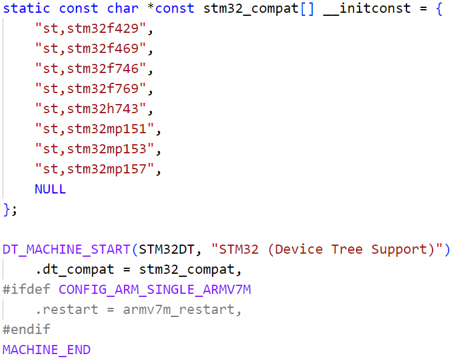
> 图：课件 Slide 33——DT_MACHINE_START 宏：machine_desc 由此定义并放进 .arch.info.init 段，启动时逐个试兼容。

**两个特殊节点**：aliases（给节点起别名，驱动里有习惯性命名如 serial0——U-Boot 里 F-6 加的 `mmc1 = &sdmmc2` 同一机制）；**chosen（内核启动参数）**：

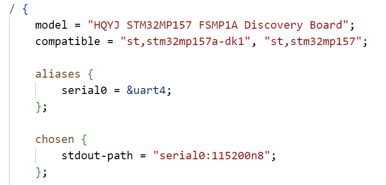
> 图：课件 Slide 34——根节点下 `aliases { serial0 = &uart4; };` 与 `chosen { stdout-path = "serial0:115200n8"; };`——chosen 的 stdout-path 就是实验二十三讲"console= 兜底机制"时引用的那个字段。

**chosen 与 bootargs 的关系**（课件 Slide 35）：不用设备树的内核，U-Boot 把 bootargs 存放地址传过去；**用设备树时，U-Boot 在 chosen 下创建 bootargs 属性**，把环境变量的值写进去——所以板上能这样读到自己当时的启动参数（实验二十三排查盘号的另一半证据）：

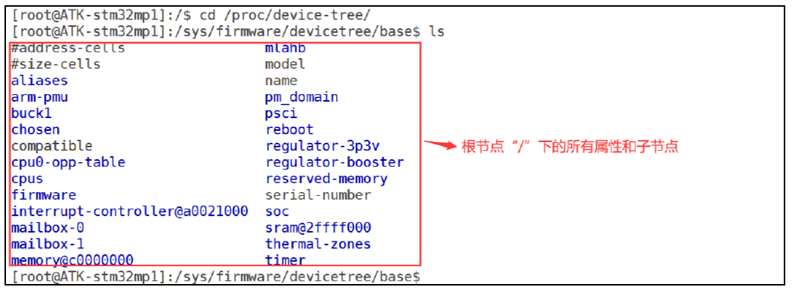
> 图：课件 Slide 37——板上 `cd /proc/device-tree/`（= /sys/firmware/devicetree/base）`ls`：#address-cells、aliases、chosen、compatible、model、reserved-memory、soc……**设备节点=目录、属性=文件、属性值=文件内容**。

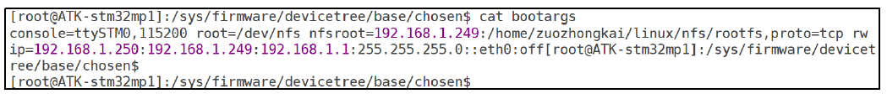
> 图：课件 Slide 38——`cat /sys/firmware/devicetree/base/chosen/bootargs` 读出完整启动参数（截图是课件板 192.168.1.x 的值；我们板上读出来的是自己的 .8/.100 配置）。

**bindings 文档**（9.3）：属性是自定义的，写特定设备的节点要查厂商说明——内核源码 `Documentation/devicetree/bindings/` 分门别类放着一堆（st、clock、serial……）。第 5 章抄的 sdmmc2/ethernet0 节点，规矩全在这类文档里。

## 四、OF 函数：驱动读设备树的 API（9.4）

内核用 `device_node` 结构体描述节点、`property` 结构体描述属性（都在 include/linux/of.h）：

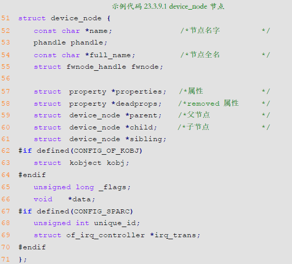
> 图：课件 Slide 43——device_node 定义：name、phandle、full_name、properties、parent/child/sibling……——树形链表结构。

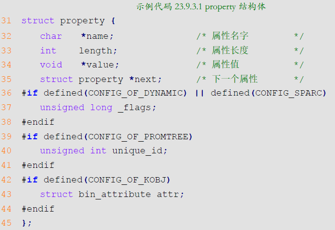
> 图：课件 Slide 50——property 定义：name、length、value、next——属性的值就是一段字节流。

操作它们的函数**都以 of_ 开头**（原型在 include/linux/of.h，文档 https://docs.kernel.org/devicetree/kernel-api.html）。按用途分三组记：

**① 查找节点**：

| 函数 | 怎么找 |
|---|---|
| `of_find_node_by_name(from, name)` | 按节点名（from=NULL 从根全树找） |
| `of_find_node_by_path(path)` | 按全路径（可用别名，如 "/backlight"） |
| `of_find_compatible_node(from, type, compatible)` | 按 device_type + compatible |
| `of_find_matching_node_and_match(from, matches, &match)` | 按 of_device_id 匹配表 |

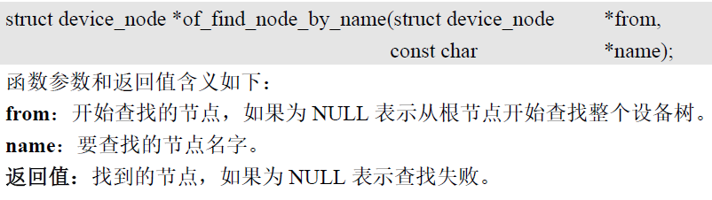
> 图：课件 Slide 44——of_find_node_by_name 原型与参数说明。

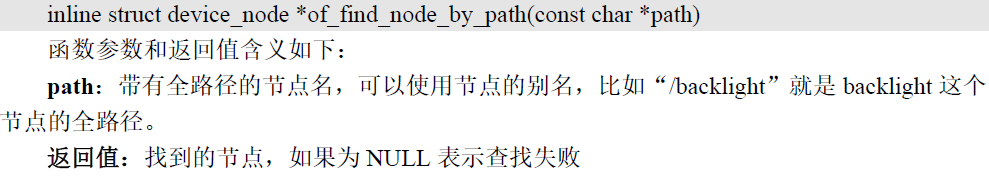
> 图：课件 Slide 45——of_find_node_by_path 原型。

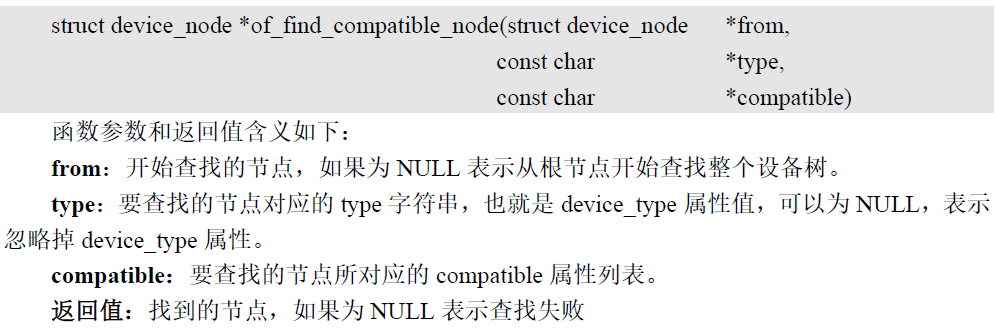
> 图：课件 Slide 46——of_find_compatible_node 原型（type 可为 NULL 忽略 device_type）。

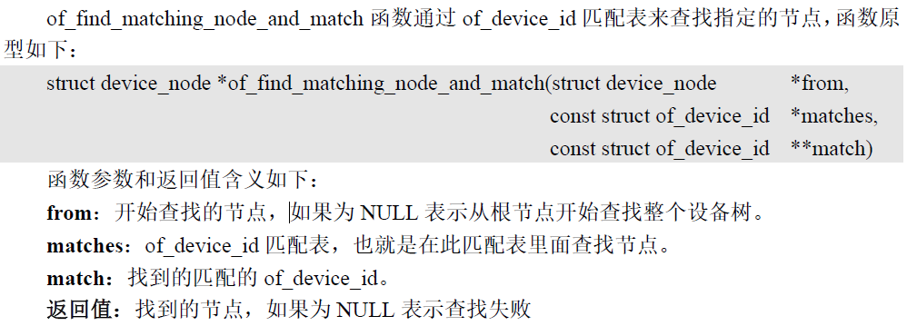
> 图：课件 Slide 47——of_find_matching_node_and_match 原型（matches 为匹配表，match 带回命中的表项）。

**② 查父子节点**：`of_get_parent(node)`（找父）、`of_get_next_child(node, prev)`（迭代找子，prev=NULL 从第一个开始）：

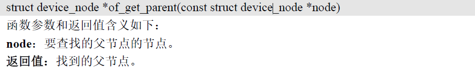
> 图：课件 Slide 48——of_get_parent 原型。

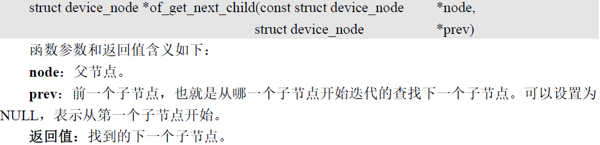
> 图：课件 Slide 49——of_get_next_child 原型。

**③ 取属性值**：

| 函数 | 用途 |
|---|---|
| `of_find_property(np, name, &len)` | 找属性本体（拿到 property 结构体） |
| `of_property_count_elems_of_size(np, name, elem_size)` | 数元素个数 |
| `of_property_read_u32_index(np, name, index, &out)` | 读数组里第 index 个 u32 |
| `of_property_read_u32(np, name, &out)` | 读单个 u32 属性 |
| `of_property_read_u32_array(np, name, out, sz)` | 一次读整个 u32 数组（reg 常用） |
| `of_property_read_string(np, name, &str)` | 读字符串属性 |

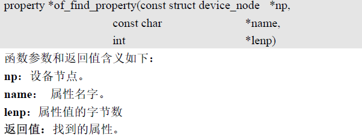
> 图：课件 Slide 51——of_find_property 原型（lenp 不确定时传 NULL）。

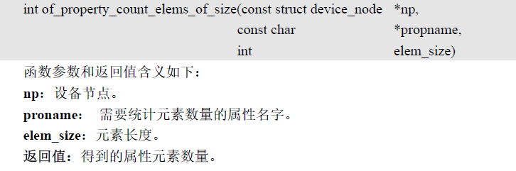
> 图：课件 Slide 52——of_property_count_elems_of_size 原型。

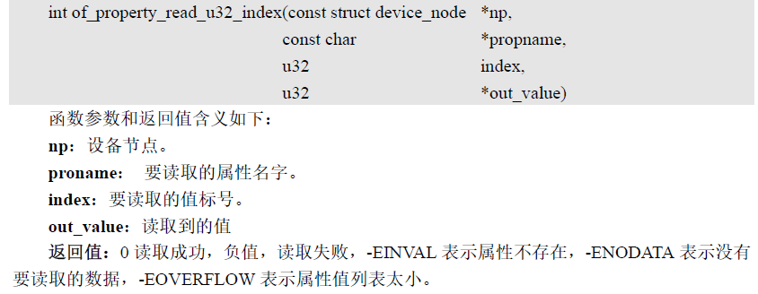
> 图：课件 Slide 53——of_property_read_u32_index 原型与错误码（-EINVAL 属性不存在/-ENODATA 无数据/-EOVERFLOW 列表太小）。

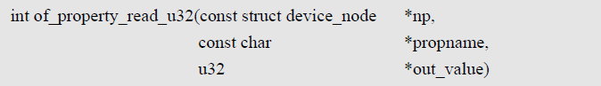
> 图：课件 Slide 54——of_property_read_u32 原型。

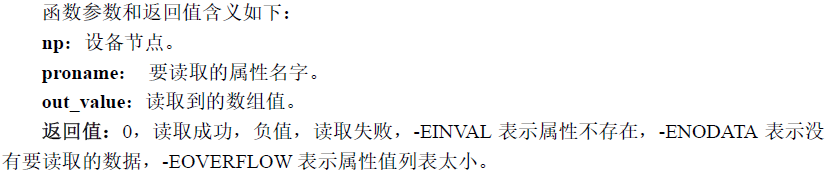
> 图：课件 Slide 54——参数与返回值说明表。

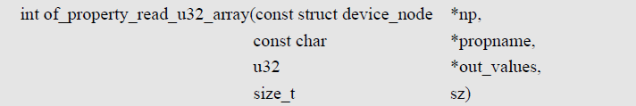
> 图：课件 Slide 55——of_property_read_u32_array 原型。

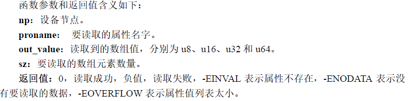
> 图：课件 Slide 55——参数与返回值说明。

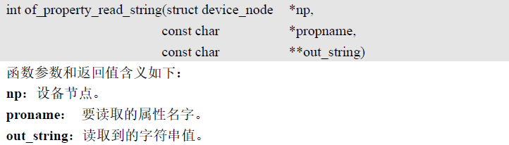
> 图：课件 Slide 56——of_property_read_string 原型。

> 图：课件 Slide 56——返回值说明。

不必背：记住"先找节点、再取属性"的节奏与三组函数的名字，下一篇 dtsled.c 会用到其中四个（of_find_node_by_name、of_find_property、of_property_read_string、of_property_read_u32_array），用时回表。

## 五、实验环境（实际）

| 项目 | 实际值 |
|---|---|
| 板子 | 实验三十三收官形态（led/mdevled 两版驱动可切换） |
| Ubuntu | 内核源码树（改 dts + make dtbs）+ drivers-dev.zip 的 04-dtsled/ |
| 本篇材料 | 无新增（认知篇；04-dtsled 实验三十五编译） |

> **开工自检（10 秒）**：本篇认知篇。把课件语法与我们已改过的设备树逐条对号——fsmp1x.dtsi 的 sdmmc2 节点、实验二十的 dts/Makefile 加行、实验二十三的 chosen stdout-path——对得上，语法就是"看过的东西有了名字"。

## 六、课件 ↔ 步骤对应表

| 课件 Slide | 内容 | 对应本篇 |
|---|---|---|
| 2~6 | 设备树由来（Linus 邮件）、dts/dtb/dtc、Makefile 编译项 | 第一节 |
| 7~9 | 头文件、节点/属性、根节点合并 | 第二节 |
| 14~17 | 节点名、label、&引用合并规则 | 第二节 |
| 18~19 | 属性值数据类型 | 第二节 |
| 20~30 | 标准属性：compatible/model/status/#cells/reg/ranges | 第三节 |
| 31~33 | 根节点 compatible 与 machine_desc 匹配 | 第三节 |
| 34~38 | aliases、chosen 与 bootargs、/proc/device-tree | 第三节 |
| 39~40 | bindings 文档 | 第三节 |
| 41~56 | OF 函数三组 | 第四节 |

### 本篇概念 → 后面谁用 → 现在含糊的后果

| 本篇概念 | 后面哪一篇用 | 现在含糊的后果 |
|---|---|---|
| 节点/label/&引用合并 | 实验三十五往根节点加 LED 节点 | 加错位置或属性名拼错 |
| compatible 匹配机制 | 实验三十五 dtsled 手动 strcmp 匹配 | 节点写了驱动不认，白改一轮 |
| status = "okay" | 实验三十五驱动的第二道检查 | 节点在但 disabled，驱动报 device disabled |
| reg 与 cells 解析 | 实验三十五 reg 属性 12 个 u32 的写法与驱动解析 | 基址/长度写反，ioremap 到错误地址 |
| OF 函数四件套 | 实验三十五 dtsled.c 主体 | 代码读不懂 |
| chosen/bootargs | 以后排障（板上读启动参数） | 不知道 bootargs 还能这样查 |

## 七、自测一览

| 自测问题 | 达标答案 | 在哪一节 |
|---|---|---|
| 设备树解决什么问题？ | 硬件描述与内核控制代码分离——告别 mach-xxx 硬编码 | 第一节 |
| &label 引用后，重复属性与新增属性各怎么处理？ | 重复覆盖、新增追加；原 .dtsi 不动 | 第二节 |
| `reg = <0x54004000 0x400>` 怎么读？ | 基址 0x54004000、长度 0x400（按父节点 #cells 的声明解析） | 第三节 |
| 根节点 compatible 的使命？ | 与内核 machine_desc 的 dt_compat 匹配，匹配上才启动 | 第三节 |
| chosen 节点怎么来的、装什么？ | U-Boot 启动时创建，bootargs 环境变量的值写进去；/proc/device-tree/chosen 可读 | 第三节 |
| OF 函数的节奏？ | 先找节点（of_find_*）→ 再取属性（of_property_*） | 第四节 |

## 八、下一步：设备树版 LED 驱动

下一篇（实验三十五）实操：设备树根节点下加 `stm32mp1-led` 节点（compatible = "fsmp1a,led"、reg 放六个寄存器的"基址 长度"），`make dtbs` + tftp 新 dtb 上板；dtsled.c 用 OF 函数找节点、验 compatible、查 status、读 reg——**寄存器地址不再写死在驱动里**，同一份驱动换个节点就能管别的设备。
