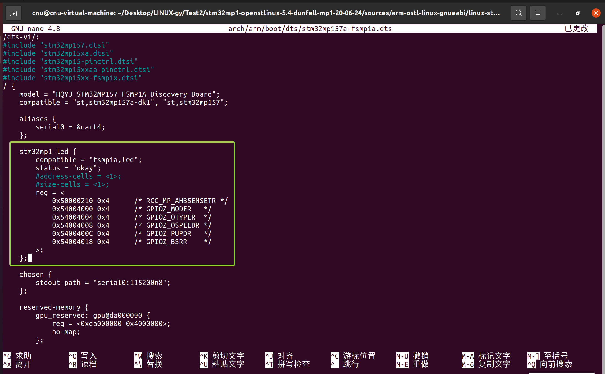
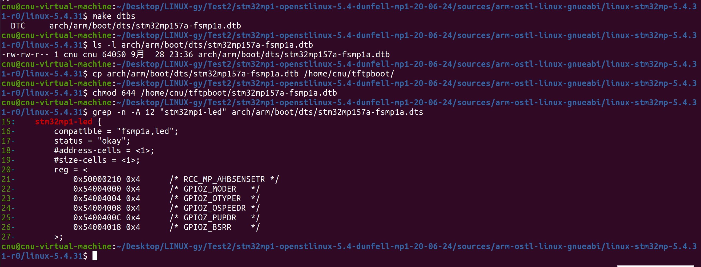
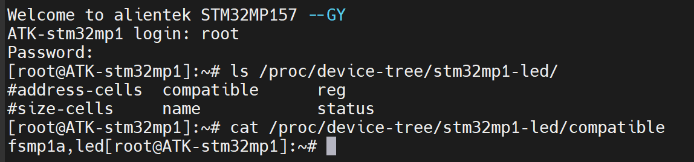
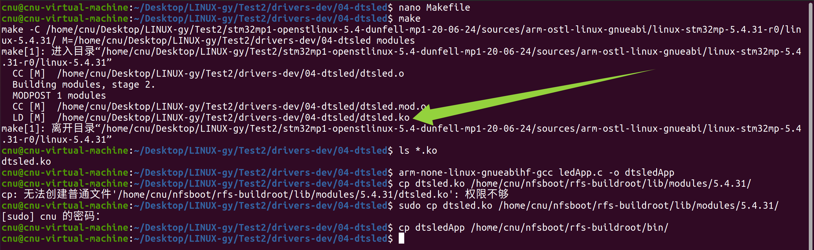

# 实验三十五 设备树版 LED 驱动——硬件描述与驱动代码分离

> **对应课件**：《第9章 设备树》9.5 节，Slide 57
>
> **系列说明**：本系列基于华清远见 FS-MP1A（STM32MP157A）开发板，对应课件《第9章 设备树》。实验三十三的 LED 驱动能点灯，但寄存器地址写死在 C 代码里——换块板就作废。本篇把它升级为**设备树版**：设备树根节点下加一个 LED 节点（compatible、status、reg 三样属性），驱动用 OF 函数从设备树读出一切——**同一份驱动，改设备树就能管别的设备**，这就是 9.1 节说的"描述与控制分离"的落地。前置：实验三十四（语法与 OF 函数）、实验三十三（寄存器直控版与自动创建注册法）。

## 一、改造路线图：地址从"代码里"搬到"设备树里"

| | 实验三十三 mdevled | 本篇 dtsled |
|---|---|---|
| 寄存器地址 | `#define GPIOZ_MODER (0x54004000+0x0)` 写死 | **设备树 reg 属性** → 驱动 of_property_read_u32_array 读出 → ioremap |
| 匹配方式 | 无（手动 insmod 就生效） | **of_find_node_by_name 找节点 + compatible 匹配 + status 检查** |
| 设备号/设备文件 | alloc_chrdev_region + class/device 自动创建 | **同款**（注册五函数原样保留） |
| 控灯代码 | BSRR writel | 同款（一字不改） |

dtsled.c 的 OF 四件套正好是实验三十四第四节的四个函数：`of_find_node_by_name`（找节点）→ `of_find_property`（取 compatible 匹配）→ `of_property_read_string`（查 status）→ `of_property_read_u32_array`（读 reg 的 12 个 u32）。

## 二、实验环境（实际）

| 项目 | 实际值 |
|---|---|
| 操作位置 | Ubuntu（改 dts + make dtbs + 编驱动）；板上点火 + 加载测试 |
| 根文件系统 | buildroot 版 `rfs-buildroot`（NFS） |
| 素材 | `drivers-dev.zip` 的 `04-dtsled/`（dtsled.c 290 行 + ledApp.c 同款 + Makefile）——**zip 已在第 7 章目录（`05_字符设备驱动/`）复制解压过，本篇不重复复制**（第 7~9 章共用这一个包） |
| 板上点火文件 | dtb 要换新的（步骤 1 重编）；uImage 沿用实验二十七的 |

> **开工自检（10 秒）**：板上能进命令行（NFS 根）；`ls /proc/device-tree/` 能列出根节点目录（设备树在线，实验三十四第三节）；04-dtsled/ 素材在。

## 三、课件 ↔ 步骤对应表

| 课件 Slide | 内容 | 对应步骤 |
|---|---|---|
| 57 | 设备树加 LED 节点、make dtbs、新设备树启动、dtsled.c | 全部步骤 |

### 本篇动作 → 后面谁用 → 现在含糊的后果

| 本篇动作 | 后面哪一篇要用 | 现在含糊的后果 |
|---|---|---|
| 设备树加自定义节点 + make dtbs + 换 dtb | 第 9 章之后一切"新硬件上板"的流程（先描述、再驱动） | 只会改驱动不会改树，硬件描述不了 |
| OF 四件套读节点 | 第 9 章后一切设备树驱动的主体 | 驱动代码读不懂 |
| "换 dtb 不换内核" | 以后改设备树的验证节奏（dtb 几秒、内核几十分钟） | 每次都重编内核，白等 |

## 四、实验步骤

### 步骤 1：设备树加 LED 节点（Slide 57）

先回到内核源码顶层（新开终端就要重新 cd）：

```bash
cd <共享目录>/stm32mp1-openstlinux-5.4-dunfell-mp1-20-06-24/sources/arm-ostl-linux-gnueabi/linux-stm32mp-5.4.31-r0/linux-5.4.31
```

然后打开设备树源文件（**Ctrl+W** 搜 `aliases` 定位根节点；保存退出键同实验二十步骤 1 的 nano 卡）：

```bash
nano arch/arm/boot/dts/stm32mp157a-fsmp1a.dts
```

**在根节点内**（`/ { ... }` 里，aliases/chosen 旁边）加 LED 节点。dtsled.c 按节点名 `stm32mp1-led` 找它、按 compatible 值 `"fsmp1a,led"` 匹配、reg 读 12 个 u32（六组"基址 长度"= RCC 时钟寄存器 + GPIOZ 五个寄存器，与实验三十二的寄存器地图一一对应）：

```dts
    stm32mp1-led {
        compatible = "fsmp1a,led";
        status = "okay";
        #address-cells = <1>;
        #size-cells = <1>;
        reg = <
            0x50000210 0x4      /* RCC_MP_AHB5ENSETR */
            0x54004000 0x4      /* GPIOZ_MODER   */
            0x54004004 0x4      /* GPIOZ_OTYPER  */
            0x54004008 0x4      /* GPIOZ_OSPEEDR */
            0x5400400C 0x4      /* GPIOZ_PUPDR   */
            0x54004018 0x4      /* GPIOZ_BSRR    */
        >;
    };
```

> 节点可挂在设备树任意位置，课件为简单挂在根节点下；`#address-cells/#size-cells` 写 <1>/<1> 后，reg 按"基址 长度"成对解析（实验三十四第三节）——6 对 = 12 个 u32，与驱动 `of_property_read_u32_array(nd, "reg", regdata, 12)` 的 12 严丝合缝。


> 图：实测——nano 里的 `stm32mp157a-fsmp1a.dts`：节点整段绿框（compatible/status/#address-cells/#size-cells/reg 六组"基址 长度"），位置在根节点内 aliases 与 chosen 之间；reg 块里的 C 风格注释由 dtc 剥掉、合法。六组地址与实验三十三 led.c 的 `#define` 逐项对应（0x50000210 = RCC_BASE 0x50000000 + 0x210 起跟到 BSRR）。

重编设备树：

```bash
cd <内核源码>/linux-5.4.31
make dtbs
ls -l arch/arm/boot/dts/stm32mp157a-fsmp1a.dtb    # 时间戳更新、字节数变大（多了个节点）
cp arch/arm/boot/dts/stm32mp157a-fsmp1a.dtb /home/cnu/tftpboot/
chmod 644 /home/cnu/tftpboot/stm32mp157a-fsmp1a.dtb
```

**就地验证**（改完先本地查语法——dtc 能反查）：

```bash
grep -n -A 12 "stm32mp1-led" arch/arm/boot/dts/stm32mp157a-fsmp1a.dts
```


> 图：实测——步骤 1 下半场一屏收：`make dtbs` → `DTC arch/arm/boot/dts/stm32mp157a-fsmp1a.dtb`；`ls -l` 见 **64,050 字节**（比实验二十三的 63,890 大 160 = 新节点体量）；cp 上服务器 + chmod 644；`grep -n -A 12` 反查节点整段在 15~27 行。

### 步骤 2：换 dtb 点火（不换内核）

uImage 没动——只重新下载 dtb：

```
STM32MP> tftp c2000000 my_uImage
STM32MP> tftp c4000000 stm32mp157a-fsmp1a.dtb
STM32MP> bootm c2000000 - c4000000
```

进系统后第一手验证——设备树"已经在板上"了：

```bash
ls /proc/device-tree/stm32mp1-led/      # compatible  status  name  reg
cat /proc/device-tree/stm32mp1-led/compatible
# 输出：fsmp1a,led
```


> 图：实测——新 dtb 点火后板上第一手验证：`/proc/device-tree/stm32mp1-led/` 下六件齐（#address-cells / #size-cells / compatible / reg / name / status）；`cat compatible` 出 **`fsmp1a,led`**——设备树已在板上安家（`/proc/device-tree` 是内核设备树的只读视图）。

### 步骤 3：编译部署 dtsled（源码 290 行）

```bash
# Ubuntu，04-dtsled/ 里同样先 `nano Makefile`：**Ctrl+W** 搜 `KERNELDIR`、第 1 行改成你的内核树——**每个素材子目录各一份 Makefile、各改各的**（老规矩，zip 预填的都是课件作者路径）
make                                 # MODPOST 1 modules → LD [M] dtsled.ko
ls *.ko                              # 就地验证：dtsled.ko 存在
arm-none-linux-gnueabihf-gcc ledApp.c -o dtsledApp
file dtsledApp                       # 就地验证：ELF 32-bit ... ARM, EABI5
sudo cp dtsled.ko /home/cnu/nfsboot/rfs-buildroot/lib/modules/5.4.31/
sudo cp dtsledApp /home/cnu/nfsboot/rfs-buildroot/bin/
```

> **sudo 规矩同实验三十一/三十三**：`lib/modules/5.4.31/` 是板上 root 建的（root:root），普通 cp 必报"权限不够"；**sudo cp 一律能写，别赌目录归属**（bin/ 恰好归了 cnu、不带 sudo 也能写——那是目录来源不同，不是规律）。

> Makefile 的 obj-m 素材包里已是 `dtsled.o`；ledApp 与第 8 章同源，产物名建议叫 dtsledApp 以示区分。


> 图：实测——dtsled 编译部署一屏收：nano 改 KERNELDIR → `make` → 绿框 `LD [M] dtsled.ko`；`cp` 报"权限不够"（`lib/modules/5.4.31/` 归 root）→ sudo cp 过；dtsledApp 进 bin 未带 sudo 也成功（bin 目录归 cnu——**目录归属看来源，sudo cp 一律最稳**）。

### 步骤 4：加载 dtsled，全链验证

```bash
# 板上：
depmod && modprobe dtsled            # 只打一条 taint 提示（老朋友，必现非报错）
lsmod                                # 就地验证：dtsled 在列 = 加载成功
ls -l /dev/dtsled                    # 自动创建的设备文件，主设备号内核分配
dtsledApp /dev/dtsled 1              # 亮（盯丝印 LED1 那颗）
dtsledApp /dev/dtsled 0              # 灭
rmmod dtsled
ls /dev/dtsled                       # No such file = mdev 随模块 remove 顺手删（实验三十三同款机制）
```

> **taint 那行为什么不是报错**：`[ 229.150979] dtsled: module verification failed: ...` 开头带时间戳 = **内核 printk**（跟 `toychar init!` 同款格式），不是 modprobe 的报错；它说的是"这模块没带签名，我把内核记为已弄脏"，说完**照样加载**。真正的 modprobe 报错以 `modprobe:` 开头（如 `modprobe: can't load module ...` / `not found in modules.dep`）。**判成败只看 `lsmod`**——本系列六个模块（toychar1/2/3、led、mdevled、dtsled）加载时全打这行、全加载成功。

实测全中：`lsmod` 见 `dtsled 16384 0`（表头照旧 `Tainted: G`）；`/dev/dtsled` 自动生成 **`crw-rw---- 241, 0`**（主 241 = 内核现场分配，比实验三十三的 240 又变了一号——"每次加载可能不同"的现场；660 是 mdev 默认权限）；`dtsledApp` 1/0 时 **LED1 物理亮灭**（用户实认）；`rmmod` 后 `/dev/dtsled` 消失（mdev remove 联动）。

**这版驱动平时也不打印**——与 led.c/mdevled.c 同款，dtsled.c 的 8 处 printk 全在失败路径上，成功时一声不吭：modprobe 后 dmesg 只有 taint 一条 = **成功的样子**。下面这张表是**失败对照表**（哪一步没过会打什么），不是成功时该看到的输出：

1. `of_find_node_by_name(NULL, "stm32mp1-led")` 找到节点——没找到会打 `stm32mp1-led not found in device tree`；
2. compatible 与 `"fsmp1a,led"` 比对通过——不匹配打 `incompatible driver`；
3. status 为 "okay"——disabled 打 `device disabled`；
4. reg 12 个 u32 读出 → 六次 `ioremap(regdata[2n], regdata[2n+1])`；
5. 寄存器初始化六步（MODER 输出/推挽/高速/上拉，与实验三十三同款）→ 默认开灯（BSRR 1<<5）；
6. alloc_chrdev_region + cdev + class + device 自动注册——**/dev/dtsled 自动出现**（LED_NAME 为 "dtsled"）。

**LED1 亮灭可控 + /dev/dtsled 自动生成 = 第 9 章闭环**。这颗灯此刻的"户口"是这样的：设备树描述它（stm32mp1-led 节点）→ 驱动认领它（compatible 匹配）→ 注册系统（cdev/class/device）→ mdev 落地文件（/dev/dtsled）——比实验三十三的版本多了一层"描述与实现分离"的正装。

## 五、注意事项

1. **compatible 值必须与驱动 strcmp 的串一字不差**（`"fsmp1a,led"`）——`prp->value` 是原始字节流，多一个空格都判不等（strcmp 对 NULL 结尾敏感，属性值末尾有 \0，巧合可用但别依赖——照抄课件值最稳）。
2. **reg 的 12 个 u32 顺序固定**：驱动按下标 0~11 分别 ioremap 成 RCC/MODER/OTYPER/OSPEEDR/PUPDR/BSRR——顺序写错不会报错，但寄存器全对不上号（灯不亮、dmesg 也不见异常），只能对着表逐项核。
3. **节点加了但板上没生效**：dtb 没重编（`make dtbs` 漏了）、或 tftp 的还是旧 dtb（`Bytes transferred` 对不上新字节数）、或忘 `bootm` 前的 c4000000 下载——三连查。
4. **`/proc/device-tree` 是只读视图**：改它无用，改源码 make dtbs 才是正道。
5. dtsled 加载前把 mdevled/led 卸干净（同名设备名冲突——实验三十三注意事项 5 同款；不过本篇设备名是 dtsled，与 led 不冲突，可与 mdevled 共存——但两颗驱动管同一颗灯，测试时别互相干扰）。

## 六、验证点一览

| 验证点 | 命令 | 通过的样子 | 在哪一步敲 |
|---|---|---|---|
| 节点已写 | `grep -A 12 "stm32mp1-led" arch/arm/boot/dts/stm32mp157a-fsmp1a.dts` | 节点整段在根节点内 | 步骤 1 |
| dtb 重编 | `ls -l arch/arm/boot/dts/stm32mp157a-fsmp1a.dtb` | 时间戳更新、字节数变大 | 步骤 1 |
| 新 dtb 上板 | `tftp c4000000 ...` + bootm | Bytes transferred 与新文件一致 | 步骤 2 |
| 节点在线 | `ls /proc/device-tree/stm32mp1-led/` | compatible/status/reg/name 四件 | 步骤 2 |
| compatible 值 | `cat /proc/device-tree/stm32mp1-led/compatible` | `fsmp1a,led` | 步骤 2 |
| 驱动加载 | `modprobe dtsled` + `lsmod` | dtsled 在列；dmesg 仅 taint 一条（平时不打印） | 步骤 4 |
| 设备文件自动生成 | `ls -l /dev/dtsled` | 自动出现（实测 `crw-rw---- 241, 0`：mdev 660 权限、主号每次分配） | 步骤 4 |
| 开关灯 | `dtsledApp /dev/dtsled 1` / `0` | LED1 亮 / 灭 | 步骤 4 |
| 卸载干净 | `rmmod dtsled` | /dev/dtsled 消失 | 步骤 4 |

不达标时的排查：

| 现象 | 先查什么 |
|---|---|
| dmesg 报 `stm32mp1-led not found` | dtb 没重编/没换新（步骤 1~2 三连查）；节点名拼写（驱动按名找） |
| 报 `incompatible driver` | compatible 值与 `"fsmp1a,led"` 逐字比对（多空格/大小写） |
| 报 `device disabled` | status 属性写成别的值了；或漏写（read 失败同样打 status missing） |
| 报 `reg property missing` | reg 属性名拼写；节点真在 /proc/device-tree 里吗 |
| 灯不亮且 dmesg 干净 | reg 12 个值的顺序与大小端（按"基址 长度"六组核对 0x50000210/0x54004000 系）；mdevled 也在管灯互相打架（rmmod 另一个） |
| /dev/dtsled 没出现 | device_create 失败（dmesg）；mdev 前提（实验二十六/二十七的 hotplug 与 uevent helper） |

## 七、实验完成标志

- 设备树根节点下已加 `stm32mp1-led` 节点（compatible/status/reg 三属性齐），`make dtbs` 重编成功（dtb 63,890 → **64,050 字节**，+160 = 新节点体量）、新 dtb 已上板（步骤 1~2 实测）
- 板上 `/proc/device-tree/stm32mp1-led/` 六件齐，compatible 读出 `fsmp1a,led`（步骤 2 实测）
- dtsled.ko 编译部署、`modprobe dtsled` 加载时 OF 四件套（找节点/匹配/查状态/读 reg）全过——dmesg 仅 taint 一条即成功（步骤 3~4 实测）
- **`/dev/dtsled` 自动生成（crw-rw---- 241, 0），dtsledApp 开关灯实测 LED1 物理亮灭可控**（步骤 4 实测——第 9 章闭环）
- rmmod 后设备文件同步消失：`ls /dev/dtsled` 报 No such file（步骤 4 实测）

## 八、下一步：第 10 章 GUI 应用程序开发

系统四件套与驱动开发全部打通。第 10 章《GUI 应用程序开发》换一个视角：不再写内核代码，而是在我们自己的系统上**跑应用**——Linux 内核/驱动与根文件系统搭建完毕；用 Buildroot 构建带 Qt 的根文件系统、交叉编译 Qt 应用（_lvgl 或 Qt 方向以课件为准）部署到开发板，屏幕（MIPI 接口那块屏——实验十六设备树里 mipi050 的亲缘词）上见到自己的界面，全系列收官。
