# 实验三十六 buildroot 支持 QT5 与新系统启动——GUI 时代的地基

> **对应课件**：《第10章 GUI应用程序开发》10.1~10.3 节，Slide 2-26
>
> **系列说明**：本系列基于华清远见 FS-MP1A（STM32MP157A）开发板，对应课件《第10章 GUI应用程序开发》。全系列的最后一章，也是换视角的一章：不再写内核代码，而是**在我们的系统上跑图形应用**。内核不支持 GUI——一切图形都在应用层；嵌入式常用方案是 LVGL 与 QT，QT 已集成进 Buildroot（只支持 QT5），做根文件系统时顺手就能生成运行与开发环境。本篇给实验二十八的 buildroot 加四个模块（stat/gdbserver/openssh/QT5）、重编根文件系统，并处理一个关键转折：**显示与触摸驱动只有出厂内核有**——要用出厂内核+出厂设备树配我们的新根文件系统启动。前置：实验二十八/二十九（buildroot 全流程、微调）、实验二十七（NFS）。

## 一、方案与显示后端：为什么是 QT5 + linuxfb

LVGL 与 QT 之间课件选 QT——理由在 10.1：LVGL 虽然也能跑 Linux，但要自己移植、比较复杂；QT 被 Buildroot/Yocto 集成，**做根文件系统时勾选即得**（运行环境：各种库与环境变量；开发环境：交叉工具链 + qmake）。Buildroot 目前只支持 QT5、不支持 QT6。

QT5 在嵌入式 Linux 有四种显示后端：**eglfs**（要 OpenGL/EGL 栈）、**linuxfb**（直接用传统 framebuffer）、wayland、xcb（X.org）。我们选 **linuxfb**——跑 QT 程序时要加参数 `-platform linuxfb`（记住这句话，下一篇运行程序报错九成是它没加）。

## 二、实验环境（实际）

| 项目 | 实际值 |
|---|---|
| 操作位置 | Ubuntu（buildroot 重编，实测 36 分钟/网络顺畅，网慢更久）；板上点火验证 |
| 基础 | 实验二十八的 buildroot-2020.02.6 配置与编译成果（output/ 现成） |
| 板上点火 | 出厂内核 + 出厂 dtb（eMMC bootfs 里躺着的那对，实验十五清点过）+ 本篇新 rootfs.tar |
| 板上屏幕 | MIPI 接口 LCD（出厂 dtb 的 mipi050 配置就是给它用的） |

> **开工自检（10 秒）**：buildroot 目录 `output/images/rootfs.tar` 还在（实验二十八产物）；板上能进命令行；虚拟机磁盘余量 15G+（QT 编译比上次大得多——`df -h` 看一眼，不够先清）。

## 三、课件 ↔ 步骤对应表

| 课件 Slide | 内容 | 对应步骤 |
|---|---|---|
| 2~4 | GUI 方案选型、四种显示后端 | 第一节 |
| 5~7 | 加 stat、gdbserver | 步骤 1 |
| 8~10 | 调试原理、openssh 与登录密码 | 步骤 2 |
| 11~18 | QT5 七项配置 | 步骤 3 |
| 19 | make clean + make 重编 | 步骤 4 |
| 20~23 | 换出厂内核/设备树 + 新根文件系统，calculator 验收 | 步骤 5~6 |
| 25~26 | openssh 配置与 ssh 登录验证 | 步骤 7 |

### 本篇动作 → 后面谁用 → 现在含糊的后果

| 本篇动作 | 后面哪一篇要用 | 现在含糊的后果 |
|---|---|---|
| buildroot 生成 QT 运行环境 + qmake | 下一篇 Qt Creator 的 Kits 全部指到 output/host/ | 交叉编译 Qt 程序无从谈起 |
| gdbserver + openssh | 下一篇设备部署、远程调试的通道 | 程序传不上去、断点打不上 |
| `fcsys` 出厂内核启动变量 | 以后一切"要屏幕/触摸"的实验的启动方式 | 自己的内核没显示驱动，黑屏查到天亮 |
| `-platform linuxfb` | 下一篇运行程序的第一参数 | 程序起不来还以为编译错了 |

## 四、实验步骤

### 步骤 1：busybox 加 stat、buildroot 加 gdbserver（Slide 6~8）

```bash
cd <buildroot源码>/buildroot-2020.02.6    # <buildroot源码> = 你机器上实验二十八解压的那层，本机示例 ~/Desktop/LINUX-gy/Test2
make busybox-menuconfig
#   / 搜索 STAT：搜索结果只查位置（Location: -> Coreutils），不能就地勾选，Esc 关掉结果回主菜单
#   勾选路径：主菜单 → Coreutils → 回车进入 → PageDown 下翻找到 stat (11 kb)（s 段，split 之后 sum 之前）→ 空格勾成 [*]
#   连按两次 Esc 退出 → 选 Yes 保存（实验二十八的操作卡；不保存 = 白勾）
```

> **menuconfig 勾选的通用套路**（本篇后面所有勾选都一样）：`/` 搜索拿到 **Location** → Esc 回主菜单 → 按 Location 一层层走过去 → 空格勾选 → 退出保存。搜索结果页没有勾选入口，`<Exit>` 是回主菜单的路标，不是死胡同。另外认得菜单里的**灰字注释行**——`*** xxx needs a toolchain w/ ... ***` 是菜单在告诉你这项缺什么依赖、为什么不可见，按注释把依赖补上选项就现身。**三种行首长相别认错**：`[*]`/`[ ]` 是普通开关；**`- * -` 是 menuconfig 型条目已启用的样子**（短横夹星号，同样回车进入——qt5base 勾上后长这样，当时看着像"没勾"）；行首 **`()` 是字符串输入项**——回车弹输入框、不是子菜单入口，空着别动。

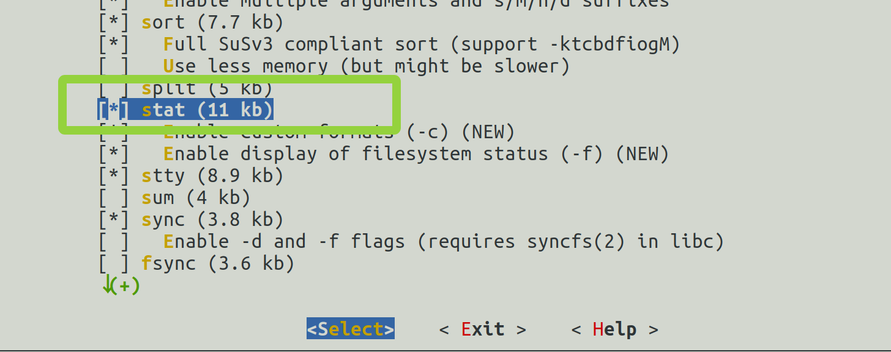
> 图：实测（顶替课件 Slide 6）——busybox 的 Coreutils 菜单里 **`[*] stat (11 kb)` 已勾上**（绿框，位于 split 之后 stty 之前）。stat 用于**增量部署时看文件时间戳**（调试程序时判断板上的文件是不是最新编译的）。

```bash
make menuconfig
#   Toolchain 里勾 [*] Copy gdb server to the Target
#   （符号名 BR2_TOOLCHAIN_EXTERNAL_GDB_SERVER_COPY）
```

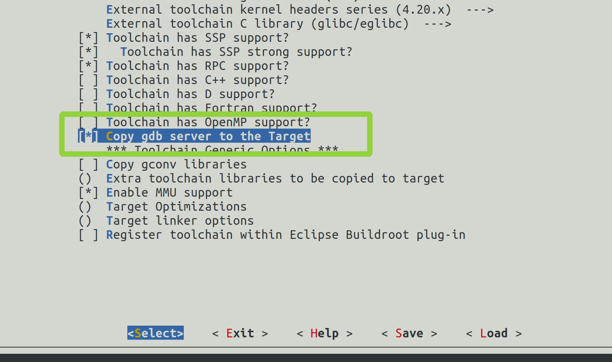
> 图：实测（顶替课件 Slide 7）——buildroot 的 Toolchain 菜单里 **`[*] Copy gdb server to the Target` 已勾上**（绿框，Toolchain has OpenMP support 之下）。把 gdbserver 复制到目标板。

**交叉调试原理**（课件 Slide 8）：开发板跑 **gdbserver**（服务器）、电脑跑交叉调试器 **gdb**（客户端），客户端经网络连服务器；**被调试程序在板上跑、调试工具在电脑上跑**——这是嵌入式调试的标准形态，下一篇 Qt Creator 的调试按钮背后就是这对搭档。

### 步骤 2：使能 openssh（Slide 9~10）

```bash
make menuconfig
#   /  搜索 OPENSSH → Target packages -> Networking applications 里勾上 [*] openssh
#   退出保存（两次 Esc → Yes）
```

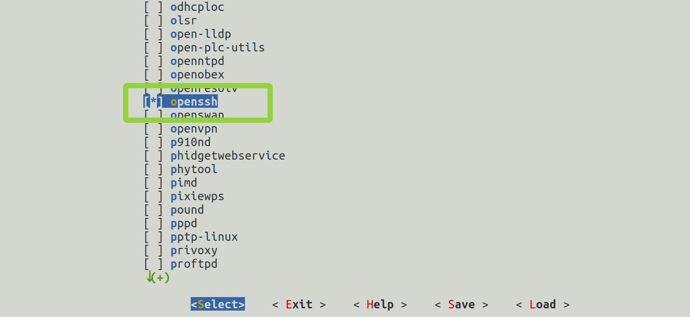
> 图：实测（顶替课件 Slide 9）——Target packages → Networking applications 里 **`[*] openssh` 已勾上**（绿框，openresolv 之下 openvpn 之上）。

课件红字提醒：**原来的根文件系统若没设登录密码，必须设置**（ssh 用 root 登录要密码）——System configuration 里 `[*] Enable root login with password` + Root password（实验二十八步骤 4 自定义的 123，复核一眼）：


> 图：课件 Slide 10——System configuration 配置：hostname/banner/Init system=BusyBox//dev management=devtmpfs+mdev/Enable root login with password/Root password=123456（课件示例）——配置项目与实验二十八步骤 4 一致，密码值是我们自定义的 123（非课件的 123456），复核即可。

### 步骤 3：使能 QT5——七项配置（Slide 11~18）

**勾 Qt5 之前先做一件事（课件没写、实测卡过）**：QT5 是 C++ 框架，**工具链没勾 C++ 时，Graphic libraries 菜单里根本没有 Qt5**——只有一行灰字注释 `*** Qt5 needs a toolchain w/ gcc >= 4.8, wchar, NPTL, C++, dynamic library ***`（这行注释就是菜单在告诉你缺什么依赖）。实验二十八配工具链时 C++ 是空的，现在补上：

```bash
make menuconfig
#   / 搜索 CXX → Toolchain 里勾 [*] Toolchain has C++ support?（符号 BR2_TOOLCHAIN_EXTERNAL_CXX）
#   退出保存（两次 Esc → Yes）
grep ^BR2_TOOLCHAIN_EXTERNAL_CXX=y .config    # 就地验证：出 BR2_TOOLCHAIN_EXTERNAL_CXX=y
```

勾完回到 Graphic libraries 菜单，原来灰字注释的位置就有 **`Qt5 --->`** 可进了。ARM gcc 工具链本身带 libstdc++，这里只是让 buildroot"承认"它有 C++，不会触发工具链重编。

实测走下来最大的发现：**qt5base 勾上后，它的全部子选项直接平铺在 Qt5 子菜单里**——`- * -`（menuconfig 型已启用的长相）、没有 `--->`、不存在"再进入"这步，往下滚就是。所以课件七项在实机上就是**在 Qt5 子菜单里从上往下滚着勾**：

| # | 勾什么（菜单里的 Prompt） | `/` 搜索用的符号名 | 勾选路径（Location） | 作用 |
|---|---|---|---|---|
| 1 | Qt5 | `BR2_PACKAGE_QT5` | Target packages → Graphic libraries and applications (graphic/text)——`[ ] Qt5 --->` **空格勾上，回车进入子菜单** | QT 总开关 |
| 2 | qt5base | `BR2_PACKAGE_QT5BASE` | Qt5 子菜单首项——**空格勾上即 `- * -`，子选项随之平铺在本菜单里** | QT 核心模块 |
| 3 | Compile and install examples (with code) | `BR2_PACKAGE_QT5BASE_EXAMPLES` | qt5base 选项平铺区 | **官方示例程序**（验收要用的 calculator 就来自它） |
| 4 | gui module | `BR2_PACKAGE_QT5BASE_GUI` | 同平铺区——勾上后其子选项缩进展开 | GUI 支持——**linuxfb support 自动选中**（`- * -`，正合我们的方案） |
| 5 | widgets module | `BR2_PACKAGE_QT5BASE_WIDGETS` | gui module 的缩进子选项里 | Widget 库（按钮/文本框/下拉列表……） |
| 6 | fontconfig support | `BR2_PACKAGE_QT5BASE_FONTCONFIG` | gui module 段内（GIF/JPEG/PNG 等图片格式项旁边） | 字体发现——渲染文字要找系统里有什么字体 |
| 7 | DejaVu fonts | `BR2_PACKAGE_DEJAVU` | 另一个货架：Target packages → Fonts, cursors, icons, sounds and themes → Fonts | DejaVu 字体——**没有它程序能跑但一个字都显示不出来** |
| —— | eglfs support（**不存在，不用管**） | `BR2_PACKAGE_QT5BASE_EGLFS` | 不开 OpenGL 时**连选项都不出现**，只有一行灰字"eglfs backend available if OpenGL and EGL are enabled" | 课件注明未验证——我们走 linuxfb，"保持不勾"自动达成 |

实测首屏——qt5base 勾上后，四大项一次到位：

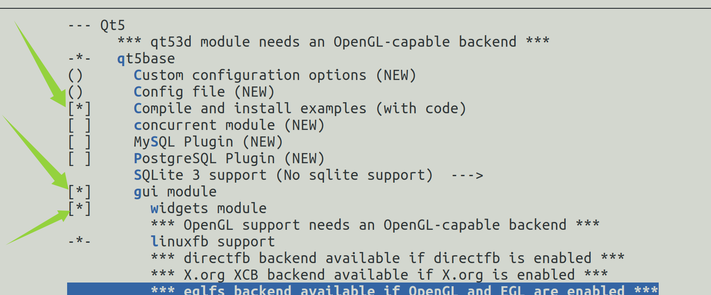
> 图：实测——Qt5 子菜单首屏：**qt5base 呈 `- * -`**（menuconfig 型已启用），子选项平铺展开——绿箭头标出 **Compile and install examples (with code) `[*]`**（calculator 来源）、**gui module `[*]`**、其下 **widgets module `[*]`**、**linuxfb support `- * -`**（自动选中）；底部灰字"eglfs backend available if OpenGL and EGL are enabled" = 不开 OpenGL 时 eglfs 连选项都不出现。

往下滚，gui module 段的其余选项与字体相关项：

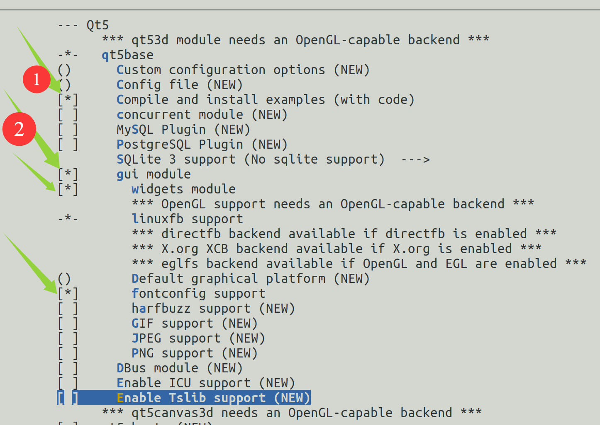
> 图：实测——Qt5 子菜单续屏：**fontconfig support `[*]`**（gui module 段内）；`Default graphical platform` 留空（linuxfb 靠运行参数 `-platform linuxfb` 指定）；**`Enable Tslib support` 保持 `[ ]`**（触摸走 evdev 通道，课件未要求 tslib）；GIF/JPEG/PNG 等图片格式项课件未要求、保持默认。图上序号与箭头为勾选时的定位标注。

字体的另一站——DejaVu：

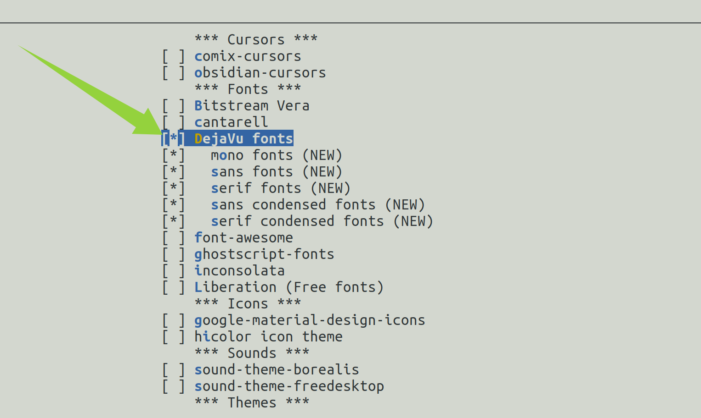
> 图：实测——Target packages → Fonts, cursors, icons, sounds and themes 的 Fonts 段：**`[*] DejaVu fonts`** 已勾（cantarell 之下），子项 mono/sans/serif 等一并默认勾上。课件原话：没有它 Qt 程序能运行，但没有文字被渲染。

八站配完，退出保存（两次 Esc → Yes）。勾没勾全就地复核：

```bash
grep -E "BR2_TOOLCHAIN_EXTERNAL_CXX=y|BR2_PACKAGE_QT5=y|BR2_PACKAGE_OPENSSH=y|BR2_TOOLCHAIN_EXTERNAL_GDB_SERVER_COPY=y" .config    # 四行都在 = buildroot 侧勾齐了
grep ^CONFIG_STAT= output/build/busybox-1.31.1/.config                                                # stat 勾在 busybox 自己的配置里
```

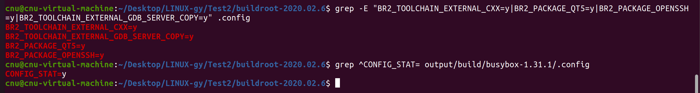
> 图：实测——两条 grep 一屏全绿：`BR2_TOOLCHAIN_EXTERNAL_CXX=y` / `BR2_TOOLCHAIN_EXTERNAL_GDB_SERVER_COPY=y` / `BR2_PACKAGE_QT5=y` / `BR2_PACKAGE_OPENSSH=y`（buildroot 侧四行）+ busybox 侧 `CONFIG_STAT=y`——五个模块全部在册。

### 步骤 4：重编 buildroot（Slide 19）

```bash
make clean     # 必须！不清除的话有些模块不会被编译
make           # 中途断了不用怕，重新 make 会接着编（dl/ 缓存都在）
ls -l output/images/rootfs.tar      # 就地验证：时间戳是刚刚、体积比实验二十八的 3,450,880 大一个量级
ls output/host/bin/qmake            # 就地验证：存在（下一篇 Qt Creator 要用）
```

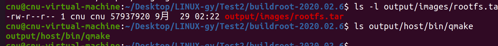
> 图：实测——`rootfs.tar` **57,937,920 字节**（时间戳 9月29 02:22）+ `output/host/bin/qmake` 在位——两个就地验证一屏收。

**实测参考**：网络顺畅（能流畅访问国外源码站）时 `make clean` + `make` 全程 **36 分钟**——QT 等新模块要现拉一批源码包，下载源慢的读者会显著更慢（下载是大头），按"一小时起步、更慢属正常"预留即可。编完 `rootfs.tar` 实测 **57,937,920 字节 ≈ 55 MB**，是实验二十八（3,450,880）的 **16.8 倍**；`qmake` 如约出现在 `output/host/bin/`。

`make clean` 是课件红字级别的必须——QT 这类大模块靠增量编译不可靠。编完 `output/images/rootfs.tar` 是带 QT 的新根文件系统（外加 `output/host/` 下多出 qmake、交叉 gdb 等开发工具——下一篇 Qt Creator 全要用）。**这份 rootfs.tar 也是作业交付物④ `rfs-buildroot-qt` 的前身**（打包改名流程见《作业提交说明》，压轴做）。

### 步骤 5：换内核与根文件系统（Slide 20~22）

**一个关键转折**：我们第 5 章自制的内核**没编显示与触摸屏驱动**（multi_v7 基线没有 DRM/MIPI 面板/触摸那一路），跑 GUI 必黑屏。课件方案：**内核与设备树换回出厂件**（出厂内核带全套显示/触摸驱动），根文件系统用我们的新货——"出厂内核 + 自制根"混搭启动。

出厂文件就在板上 eMMC 的 bootfs 分区（实验十五清点过：uImage + stm32mp157a-fsmp1a-mipi050.dtb）。板子复位/上电，**bootdelay 窗口按 Enter 拦停进 `STM32MP>`**——bootcmd 还指 run mybootnet，不拦停它就自动进自制内核了。然后设一个启动变量：

```
STM32MP> setenv fcsys 'ext4load mmc 1:2 c2000000 uImage; ext4load mmc 1:2 c4000000 stm32mp157a-fsmp1a-mipi050.dtb; bootm c2000000 - c4000000'
STM32MP> saveenv
STM32MP> run fcsys
```

与实验十七 `mybootemmc`、实验二十三替换定位法同款的 `ext4load` 三连——从 eMMC 2 号分区（U-Boot 设备 1）加载出厂内核与 dtb 点火。**以后凡是跑 GUI 的实验，`run fcsys` 一条命令进系统**（三条引号内其实是一条命令，整串加单引号；我们板 U-Boot 设备号与课件一致，mmc 1:2 原样可用——实验十四已验证）。

实测点火全程（串口）：

<video src="./37_实验三十六_buildroot支持QT5与新系统启动.assets/串口点火成功_metool.mp4" controls></video>

**两个容易含糊的点**：① `fcsys` 只管"从哪加载内核和 dtb"，**根文件系统仍由 bootargs 决定**——现在 bootargs 还是实验二十九设的 NFS 指 `rfs-buildroot`，"出厂内核 + 出厂 dtb + 我们的新根"三件混搭就是这么拼出来的；② `saveenv` 之后**上电默认行为不变**（bootcmd 仍是 run mybootnet 进自制内核），要进 GUI 系统必须拦停后手动 `run fcsys`。

**根文件系统替换**（课件红字：**先备份旧的**）：

```bash
# Ubuntu：
sudo cp -a /home/cnu/nfsboot/rfs-buildroot /home/cnu/nfsboot/rfs-buildroot.bak    # 先备份！根里有 root 属主文件（/etc/shadow 等），不带 sudo 会中途失败
sudo cp <buildroot源码>/output/images/rootfs.tar /home/cnu/nfsboot/rfs-buildroot/    # <buildroot源码> 换成你的真实路径（同步骤 1 的说明；照抄占位符会报"没有那个文件或目录"）
cd /home/cnu/nfsboot/rfs-buildroot && sudo tar -xf rootfs.tar    # 解包覆盖旧文件（覆盖式 = 实验二十九验证过的安全姿势，别 rm 目录）
```

（NFS 根，解包完板上重启即生效；若你想继续用 NFS 之外的方式，rootfs.tar 也能走烧卡流程——本系列一直用 NFS，最省。）

### 步骤 6：calculator 验收（Slide 23~24）

前提：**MIPI 屏已接在板上**（出厂 dtb 的 mipi050 配置就是给它用的；没接屏则本步无从验收）。**实测踩坑：屏幕白屏/黑屏与根文件系统无关——MIPI 排线松了就是白屏**（本次重插排线即愈；判据看点火日志 st7701 的 `manufacturer ID` 是否非 0，详见排查表"屏幕白屏"行）。根替换完后板子复位，**再次拦停进 `STM32MP>`**（同上，别让它自动跑 mybootnet——自制内核没显示驱动），`run fcsys` 点火：

```
STM32MP> run fcsys
```

板上点亮实录（板子视角）：

<video src="./37_实验三十六_buildroot支持QT5与新系统启动.assets/板子点火成功_metool.mp4" controls></video>

板上进入系统（出厂内核 + 新根文件系统）后，跑 QT 自带的示例：

```bash
# 板上：
/usr/lib/qt/examples/widgets/widgets/calculator/calculator -platform linuxfb
```

屏幕上出现 QT 自带的**计算器**——显示正常、触摸能点，即**触摸屏驱动正常 + QT linuxfb 运行环境正常**，本章的地基验收完成：

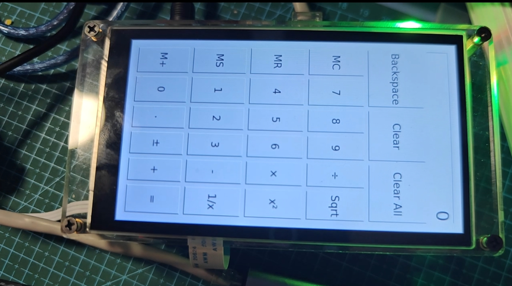
> 图：实测（顶替课件 Slide 24）——**calculator 在 MIPI 屏上显示正常**：数字键盘、四则运算符、Sqrt/x²/1/x、Backspace/Clear/Clear All、MC/MR/MS/M+ 界面完整——出厂内核的显示驱动 + QT 的 linuxfb 运行环境全通，本章运行环境验收达成。

### 步骤 7：openssh 配置与 ssh 登录（Slide 25~26）

**编辑方式有两副面孔**：buildroot 根里**没有 nano**，板上是 busybox 的 **vi**（本次实测就是用 vi 改的）；也可以在 **Ubuntu 侧用 nano 直改**——NFS 根就是 Ubuntu 里的同一个目录，键位卡同实验二十步骤 1：

```bash
# 方式 A（Ubuntu 侧，推荐）：
sudo nano /home/cnu/nfsboot/rfs-buildroot/etc/ssh/sshd_config
```

```bash
# 方式 B（板上，busybox vi）：
vi /etc/ssh/sshd_config
#   /PermitRootLogin 回车搜索定位 → 按 i 进入插入模式 → 改完按 Esc → 输入 :wq 回车保存退出（:q! 是不保存）
```

**要改的地方与课件图不符（实测核对）**：实机这一行默认是 **`#PermitRootLogin prohibit-password`**（不是课件画的 `#PermitRootLogin yes`）——定位后在它**下面新加一行** `PermitRootLogin yes`（nano 用 **Ctrl+W** 搜 `PermitRootLogin` 定位）。

另外：本次实测新根的 sshd **启动即 `Starting sshd: OK`**、没报 /var/empty；万一报 `sshd: /var/empty must be owned by root and not group or world-writable.`，板上补 `chown root:root /var/empty` 再 restart。

改完重启 sshd：

```bash
# 板上：
/etc/init.d/S50sshd restart
```

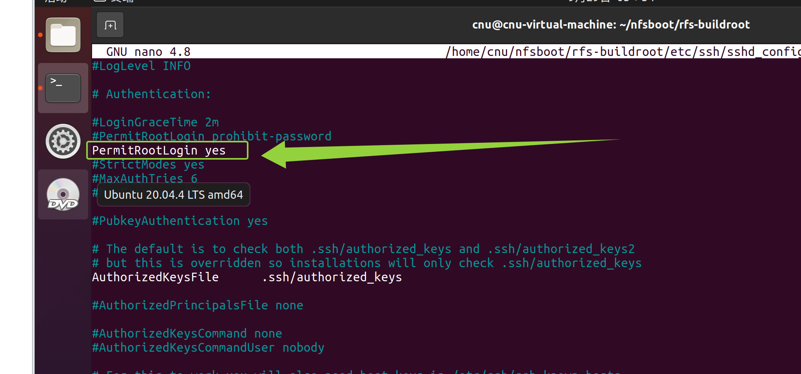
> 图：实测（顶替课件 Slide 25）——**Ubuntu 侧 sudo nano 直改 NFS 根里的 sshd_config**（标题栏路径 `/home/cnu/nfsboot/rfs-buildroot/etc/ssh/sshd_config` 就是板上的 `/etc/ssh/sshd_config`——两副面孔的实证）：**`PermitRootLogin yes` 新行已加（绿框）**，上一行默认的 `#PermitRootLogin prohibit-password` 保持注释。

```bash
# Ubuntu：
ssh root@192.168.0.8           # 我们的板是 .8（课件板是 .2）；密码 = 实验二十八设的
```

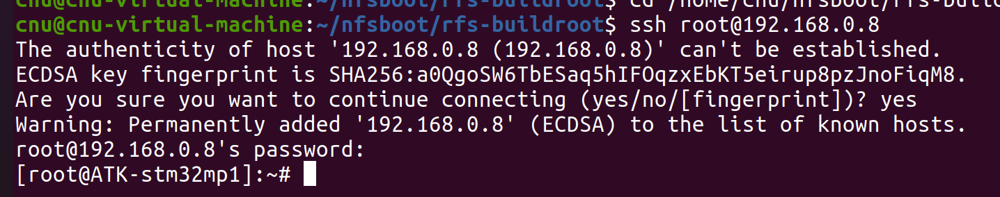
> 图：实测（顶替课件 Slide 26）——Ubuntu `ssh root@192.168.0.8` 登录成功全程：host key 确认输 **yes** → 密码（实验二十八设的 123）→ **`[root@ATK-stm32mp1]:~#` 板提示符出现**——远程调试通道就绪，下一篇 Qt Creator 直接用它部署。
> 图：实测（顶替课件 Slide 26）——Ubuntu `ssh root@192.168.0.8` 登录成功全程：host key 确认输 **yes** → 密码（实验二十八设的 123）→ **`[root@ATK-stm32mp1]:~#` 板提示符出现**——远程调试通道就绪，下一篇 Qt Creator 直接用它部署。

> 图：课件 Slide 26——Ubuntu 终端 `ssh root@192.168.0.2` 登录成功出现板提示符，`uname -a` 显示 `Linux ... 5.4.31 ... Apr 8 07:08:47 UTC 2020 armv7l`（出厂内核的时间戳——这个 uname 是出厂内核报的，与我们自编内核的日期不同，别看混）。## 五、注意事项

1. **`make clean` 不可省**：QT/openssh 等新模块在旧 output 上增量编译不可靠（课件红字）。
2. **跑 GUI 一律 `run fcsys`（出厂内核）**：自制内核没编显示/触摸驱动，黑屏是预期行为不是故障；出厂内核 + 新根的混搭里，`uname -a` 报的是出厂内核（Apr 2020 / oe-user），别误判成自己的内核丢了。
3. **rootfs.tar 解包前先备份**——课件红字；tar 覆盖解包不删除旧文件，残留旧配置若引发怪象，删目录重解一份更干净——**但删目录的前提是板子没正挂着这个根**（实验二十九 Stale file handle 教训：先拦停再删，或干脆只做覆盖式更新）。
4. **calculator 路径里 examples 是复数目录链**：`/usr/lib/qt/examples/widgets/widgets/calculator/calculator`（widgets 出现两次不是笔误）；没编 examples 选项就没有这条路径。
5. **openssh 两件事**：PermitRootLogin 必加（实机默认行是 `#PermitRootLogin prohibit-password`，不是课件画的 yes——在其下新加一行 `PermitRootLogin yes`）；/var/empty 报错才需要 chown（本次实测新根启动即 OK、没报）。buildroot 根里**没有 nano**——板上用 vi，或在 Ubuntu 侧 nano 直改 NFS 根。
6. ssh 登录的用户名/密码/校验与实验二十八的 buildroot 配置一致（root/123——密码出自实验二十八步骤 4）；两台"机器"间首次连接会问 host key 确认，输 yes。

## 六、验证点一览

| 验证点 | 命令 | 通过的样子 | 在哪一步敲 |
|---|---|---|---|
| 模块勾选 | `grep -E "BR2_TOOLCHAIN_EXTERNAL_CXX=y\|BR2_PACKAGE_QT5=y\|BR2_PACKAGE_OPENSSH=y\|BR2_TOOLCHAIN_EXTERNAL_GDB_SERVER_COPY=y" .config` + `grep ^CONFIG_STAT= output/build/busybox-1.31.1/.config` | 四行 + CONFIG_STAT=y 都在 | 步骤 1~3 |
| 重编完成 | `ls -l output/images/rootfs.tar` | 时间戳是刚刚；实测 57,937,920 字节 ≈ 55 MB（实验二十八 3,450,880 的 16.8 倍） | 步骤 4 |
| qmake 生成 | `ls output/host/bin/qmake` | 存在（下一篇 Qt Creator 要用） | 步骤 4 |
| 出厂内核启动 | `run fcsys` 后 `uname -a` | `...5.4.31 ... Apr 8 ... 2020 ... (oe-user@oe-host)` | 步骤 5 |
| QT 环境验收 | calculator `-platform linuxfb` | 屏幕显示计算器、触摸可点 | 步骤 6 |
| sshd 修好 | 板上 `/etc/init.d/S50sshd restart` 无报错 | OK | 步骤 7 |
| ssh 登录 | Ubuntu `ssh root@192.168.0.8` | 登上板子出提示符 | 步骤 7 |

不达标时的排查：

| 现象 | 先查什么 |
|---|---|
| Graphic libraries 菜单里看不到 Qt5（只有一行灰色 needs 注释） | 注释列的就是缺的依赖——我们缺 C++：Toolchain → [*] Toolchain has C++ support?（步骤 3 前置步） |
| calculator 报 `could not load the Qt platform plugin` 或起不来 | `-platform linuxfb` 参数加了没（本章题眼） |
| 屏幕亮但触摸没反应 | 跑的是不是出厂内核（`uname -a` 看编译者）；出厂 dtb 用了没（mipi050 那份带触摸节点） |
| 屏幕全黑 | 没用出厂内核/dtb（自制内核无显示驱动）；MIPI 排线；背光 |
| 屏幕白屏（背光亮、无任何内容） | 出厂内核日志找 `st7701 ... manufacturer ID==>0` 与 `Read payload FIFO is empty` = 面板没应答（SoC 侧 fb0 正常）：① 屏型必须是 MIPI DSI 屏（RGB 屏驱不到，症状完全一致）；② 断电重插 MIPI 排线；③ 隔离测试 `cat /dev/urandom > /dev/fb0`——出雪花 = 链路通、查 Qt；仍白屏 = 面板/排线硬件路径 |
| 文字不显示（界面元素在、字没有） | DEJAVU 字体包勾了没 |
| ssh 拒绝登录 | PermitRootLogin 去注释了没；/var/empty 属主；sshd restart 了没；密码对不对 |
| `run fcsys` 报 ext4load 失败 | eMMC 设备号（mmc 1:2，实验十四验证过）；bootfs 里文件名（`ext4ls mmc 1:2` 对照实验十五清单） |

## 七、实验完成标志

- buildroot 四模块配置完成（busybox stat / gdbserver copy / openssh / QT5 七项），`make clean` 后全量重编成功，新 rootfs.tar 生成且体积显著增大（步骤 1~4）
- `output/host/bin/` 下 qmake、arm-none-linux-gnueabihf-gdb 就位（步骤 4，下一篇开发环境的地基）
- `fcsys` 环境变量设好并 saveenv，`run fcsys` 用出厂内核+出厂 dtb 启动成功（步骤 5）
- 新根文件系统解包覆盖（旧根已备份），**板上 calculator 显示正常、触摸可点**（步骤 6——本章运行环境验收）
- openssh 配置完成（PermitRootLogin yes 新行已加——本次实测 sshd 启动即 OK 未报 /var/empty），Ubuntu `ssh root@192.168.0.8` 登录成功出板提示符（步骤 7 实测）

## 八、下一步：Qt 交叉开发环境与第一个应用

运行环境齐了，下一篇（实验三十七）配开发环境：Qt Creator 装 Kits（buildroot 产出的交叉编译器/调试器/qmake 5.12.8）、把开发板登记成 Generic Linux Device（走 ssh 部署），然后导入 Hello world 项目——编译、一键部署到板上、LCD 屏上亮出 "Hello world!" 按钮、断点调试一气呵成。
