# 实验三十六 buildroot 支持 QT5 与新系统启动——GUI 时代的地基

> **对应课件**：《第10章 GUI应用程序开发》10.1~10.3 节，Slide 2-26
>
> **系列说明**：本系列基于华清远见 FS-MP1A（STM32MP157A）开发板，对应课件《第10章 GUI应用程序开发》。全系列的最后一章，也是换视角的一章：不再写内核代码，而是**在我们的系统上跑图形应用**。内核不支持 GUI——一切图形都在应用层；嵌入式常用方案是 LVGL 与 QT，QT 已集成进 Buildroot（只支持 QT5），做根文件系统时顺手就能生成运行与开发环境。本篇给实验二十八的 buildroot 加四个模块（stat/gdbserver/openssh/QT5）、重编根文件系统，并处理一个关键转折：**显示与触摸驱动只有出厂内核有**——要用出厂内核+出厂设备树配我们的新根文件系统启动。前置：实验二十八/二十九（buildroot 全流程、微调）、实验二十七（NFS）。

## 一、方案与显示后端：为什么是 QT5 + linuxfb

LVGL 与 QT 之间课件选 QT——理由在 10.1：LVGL 虽然也能跑 Linux，但要自己移植、比较复杂；QT 被 Buildroot/Yocto 集成，**做根文件系统时勾选即得**（运行环境：各种库与环境变量；开发环境：交叉工具链 + qmake）。Buildroot 目前只支持 QT5、不支持 QT6。

QT5 在嵌入式 Linux 有四种显示后端：**eglfs**（要 OpenGL/EGL 栈）、**linuxfb**（直接用传统 framebuffer）、wayland、xcb（X.org）。我们选 **linuxfb**——跑 QT 程序时要加参数 `-platform linuxfb`（记住这句话，下一篇运行程序报错九成是它没加）。

## 二、实验环境（实际）

| 项目 | 实际值 |
|---|---|
| 操作位置 | Ubuntu（buildroot 重编，**按小时计**）；板上点火验证 |
| 基础 | 实验二十八的 buildroot-2020.02.6 配置与编译成果（output/ 现成） |
| 板上点火 | 出厂内核 + 出厂 dtb（eMMC bootfs 里躺着的那对，实验十五清点过）+ 本篇新 rootfs.tar |
| 板上屏幕 | MIPI 接口 LCD（出厂 dtb 的 mipi050 配置就是给它用的） |

> **开工自检（10 秒）**：buildroot 目录 `output/images/rootfs.tar` 还在（实验二十八产物）；板上能进命令行；虚拟机磁盘余量 15G+（QT 编译比上次大得多）。

## 三、课件 ↔ 步骤对应表

| 课件 Slide | 内容 | 对应步骤 |
|---|---|---|
| 2~4 | GUI 方案选型、四种显示后端 | 第一节 |
| 5~7 | 加 stat、gdbserver | 步骤 1 |
| 8~10 | 调试原理、openssh 与登录密码 | 步骤 2 |
| 11~18 | QT5 七项配置 | 步骤 3 |
| 19 | make clean + make 重编 | 步骤 4 |
| 20~23 | 换出厂内核/设备树 + 新根文件系统，calculator 验收 | 步骤 5~6 |
| 25~26 | openssh 配置与 ssh 登录验证 | 步骤 7 |

### 本篇动作 → 后面谁用 → 现在含糊的后果

| 本篇动作 | 后面哪一篇要用 | 现在含糊的后果 |
|---|---|---|
| buildroot 生成 QT 运行环境 + qmake | 下一篇 Qt Creator 的 Kits 全部指到 output/host/ | 交叉编译 Qt 程序无从谈起 |
| gdbserver + openssh | 下一篇设备部署、远程调试的通道 | 程序传不上去、断点打不上 |
| `fcsys` 出厂内核启动变量 | 以后一切"要屏幕/触摸"的实验的启动方式 | 自己的内核没显示驱动，黑屏查到天亮 |
| `-platform linuxfb` | 下一篇运行程序的第一参数 | 程序起不来还以为编译错了 |

## 四、实验步骤

### 步骤 1：busybox 加 stat、buildroot 加 gdbserver（Slide 6~8）

```bash
cd <buildroot源码>/buildroot-2020.02.6
make busybox-menuconfig
#   /  搜索 STAT → Coreutils 里勾上 [*] stat
```

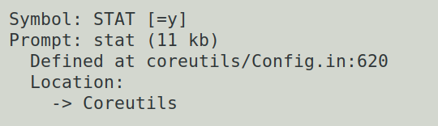
> 图：课件 Slide 6——busybox 配置搜索结果：Symbol: STAT [=y]、Prompt: stat (11 kb)、Location: -> Coreutils——stat 用于**增量部署时看文件时间戳**（调试程序时判断板上的文件是不是最新编译的）。

```bash
make menuconfig
#   Toolchain 里勾 [*] Copy gdb server to the Target
#   （符号名 BR2_TOOLCHAIN_EXTERNAL_GDB_SERVER_COPY）
```

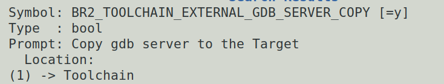
> 图：课件 Slide 7——menuconfig 搜索结果：BR2_TOOLCHAIN_EXTERNAL_GDB_SERVER_COPY [=y]、Prompt: Copy gdb server to the Target、Location: -> Toolchain——把 gdbserver 复制到目标板。

**交叉调试原理**（课件 Slide 8）：开发板跑 **gdbserver**（服务器）、电脑跑交叉调试器 **gdb**（客户端），客户端经网络连服务器；**被调试程序在板上跑、调试工具在电脑上跑**——这是嵌入式调试的标准形态，下一篇 Qt Creator 的调试按钮背后就是这对搭档。

### 步骤 2：使能 openssh（Slide 9~10）

```bash
# Target packages -> Networking applications -> [*] openssh
```

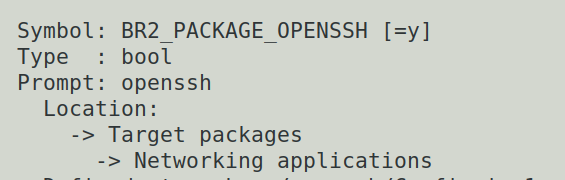
> 图：课件 Slide 9——搜索结果：BR2_PACKAGE_OPENSSH [=y]、Location: -> Target packages -> Networking applications。

课件红字提醒：**原来的根文件系统若没设登录密码，必须设置**（ssh 用 root 登录要密码）——System configuration 里 `[*] Enable root login with password` + Root password（我们实验二十八已配 123456，复核一眼）：

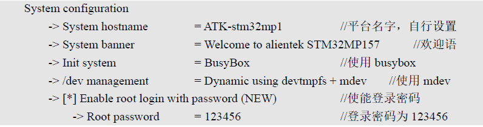
> 图：课件 Slide 10——System configuration 配置：hostname/banner/Init system=BusyBox//dev management=devtmpfs+mdev/Enable root login with password/Root password=123456——与实验二十八步骤 4 的配置一致，复核即可。

### 步骤 3：使能 QT5——七项配置（Slide 11~18）

都在 menuconfig 里按 `/` 搜符号名勾选，主开关在 Target packages → Graphic libraries and applications：

| # | 配置项 | 作用 |
|---|---|---|
| 1 | `BR2_PACKAGE_QT5` | QT 总开关（自动带上 qt5base 核心模块） |
| 2 | `BR2_PACKAGE_QT5BASE_GUI` | GUI 支持——**linuxfb 后端自动选中**（正合我们的方案） |
| 3 | `BR2_PACKAGE_QT5BASE_WIDGETS` | Widget 库（按钮/文本框/下拉列表……） |
| 4 | `BR2_PACKAGE_QT5BASE_EXAMPLES` | **官方示例程序**（验收要用的 calculator 就来自它） |
| 5 | `BR2_PACKAGE_QT5BASE_FONTCONFIG` | 字体发现——渲染文字要找系统里有什么字体 |
| 6 | `BR2_PACKAGE_DEJAVU` | DejaVu 字体——**没有它程序能跑但一个字都显示不出来** |
| 7 | `BR2_PACKAGE_QT5BASE_EGLFS` | eglfs(OpenGL) 后端——课件注明"这一选项没有验证，请自行验证"，我们按 linuxfb 方案**不勾** |

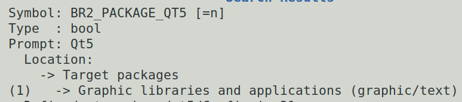
> 图：课件 Slide 12——BR2_PACKAGE_QT5：Location: -> Target packages -> Graphic libraries and applications (graphic/text)——QT5 的家在这里。

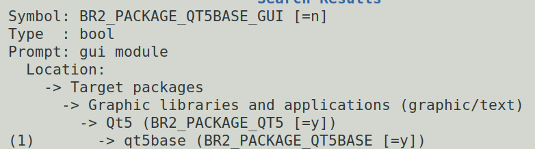
> 图：课件 Slide 13——BR2_PACKAGE_QT5BASE_GUI：linuxfb backend 自动选中（our case 用默认即可）。

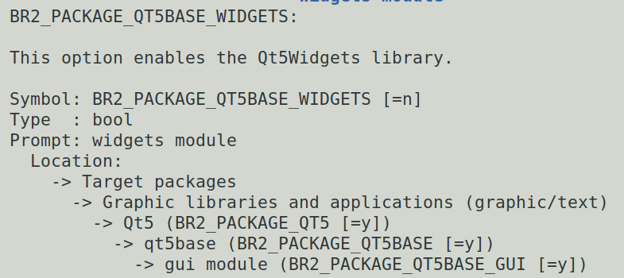
> 图：课件 Slide 14——BR2_PACKAGE_QT5BASE_WIDGETS：Qt5Widgets 库，写按钮、文本框等熟悉控件全靠它。

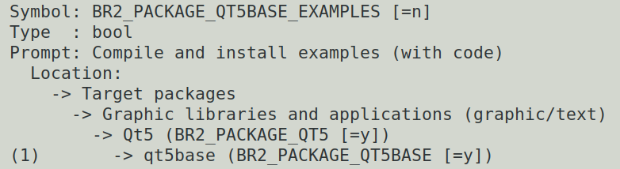
> 图：课件 Slide 15——BR2_PACKAGE_QT5BASE_EXAMPLES：Compile and install examples (with code)——示例代码也装进根文件系统。

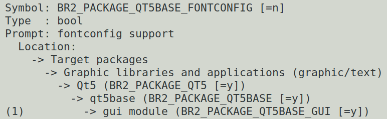
> 图：课件 Slide 16——BR2_PACKAGE_QT5BASE_FONTCONFIG：让 Qt 发现系统可用字体渲染文字。

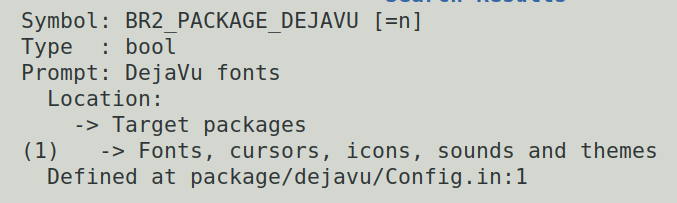
> 图：课件 Slide 17——BR2_PACKAGE_DEJAVU：DejaVu fonts（Location: -> Target packages -> Fonts, cursors, icons, sounds and themes）——课件原话：没有它 Qt 程序能运行，但没有文字被渲染。

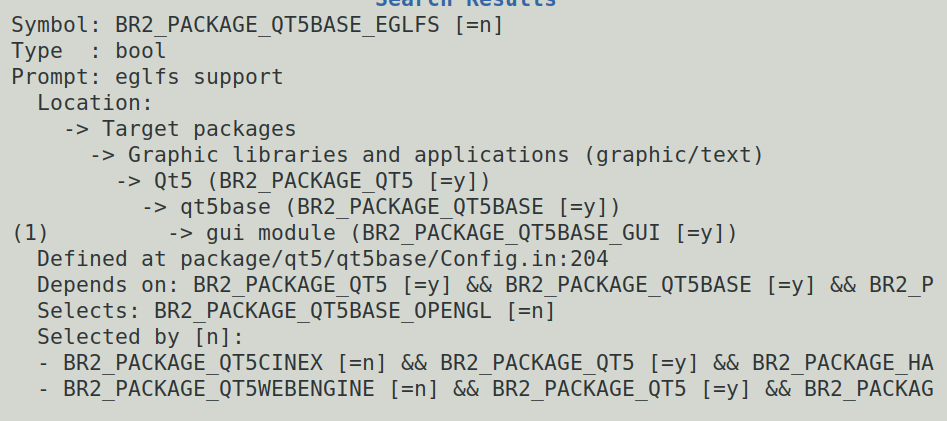
> 图：课件 Slide 18——BR2_PACKAGE_QT5BASE_EGLFS：eglfs(OpenGL) 后端选项截图，课件批注"这一选项没有验证，请自行验证"——我们走 linuxfb 路线，保持不勾。

### 步骤 4：重编 buildroot（Slide 19）

```bash
make clean     # 必须！不清除的话有些模块不会被编译
make           # 编译时间按小时计，耐心等待
```

`make clean` 是课件红字级别的必须——QT 这类大模块靠增量编译不可靠。编完 `output/images/rootfs.tar` 是带 QT 的新根文件系统（外加 `output/host/` 下多出 qmake、交叉 gdb 等开发工具——下一篇 Qt Creator 全要用）。

### 步骤 5：换内核与根文件系统（Slide 20~22）

**一个关键转折**：我们第 5 章自制的内核**没编显示与触摸屏驱动**（multi_v7 基线没有 DRM/MIPI 面板/触摸那一路），跑 GUI 必黑屏。课件方案：**内核与设备树换回出厂件**（出厂内核带全套显示/触摸驱动），根文件系统用我们的新货——"出厂内核 + 自制根"混搭启动。

出厂文件就在板上 eMMC 的 bootfs 分区（实验十五清点过：uImage + stm32mp157a-fsmp1a-mipi050.dtb），U-Boot 里设一个启动变量：

```
STM32MP> setenv fcsys 'ext4load mmc 1:2 c2000000 uImage; ext4load mmc 1:2 c4000000 stm32mp157a-fsmp1a-mipi050.dtb; bootm c2000000 - c4000000'
STM32MP> saveenv
STM32MP> run fcsys
```

与实验十七 `mybootemmc`、实验二十三替换定位法同款的 `ext4load` 三连——从 eMMC 2 号分区（U-Boot 设备 1）加载出厂内核与 dtb 点火。**以后凡是跑 GUI 的实验，`run fcsys` 一条命令进系统**（三条引号内其实是一条命令，整串加单引号；我们板 U-Boot 设备号与课件一致，mmc 1:2 原样可用——实验十四已验证）。

**根文件系统替换**（课件红字：**先备份旧的**）：

```bash
# Ubuntu：
cp -a /home/cnu/nfsboot/rfs-buildroot /home/cnu/nfsboot/rfs-buildroot.bak    # 先备份！
cp <buildroot源码>/output/images/rootfs.tar /home/cnu/nfsboot/rfs-buildroot/
cd /home/cnu/nfsboot/rfs-buildroot && tar -xf rootfs.tar      # 解包覆盖旧文件
```

（NFS 根，解包完板上重启即生效；若你想继续用 NFS 之外的方式，rootfs.tar 也能走烧卡流程——本系列一直用 NFS，最省。）

### 步骤 6：calculator 验收（Slide 23~24）

```
STM32MP> run fcsys
# 板上进入系统后（出厂内核 + 新根文件系统）：
/usr/lib/qt/examples/widgets/widgets/calculator/calculator -platform linuxfb
```

屏幕上出现 QT 自带的**计算器**——显示正常、触摸能点，即**触摸屏驱动正常 + QT linuxfb 运行环境正常**，本章的地基验收完成：

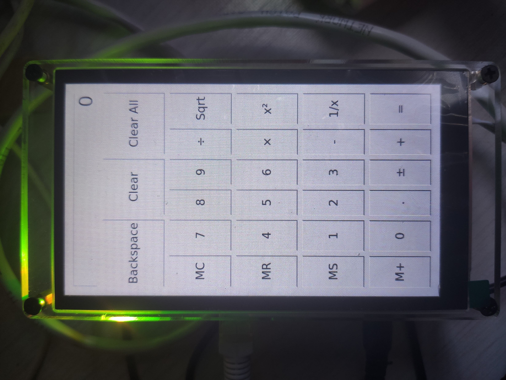
> 图：课件 Slide 24——开发板 LCD 实拍：QT calculator 示例（0-9 数字键、运算符、Backspace/Clear、MC/MR/MS/M+），显示与触摸均正常——出厂内核的显示、触摸驱动 + QT 的 linuxfb 运行环境全通。

### 步骤 7：openssh 配置与 ssh 登录（Slide 25~26）

首次启动 sshd 可能报 `sshd: /var/empty must be owned by root and not group or world-writable.`——按提示修属主，并允许 root 密码登录：

```bash
# 板上：
chown root:root /var/empty
nano /etc/ssh/sshd_config      # 找到 #PermitRootLogin yes，删掉行首的 #（改 PermitRootLogin yes）
/etc/init.d/S50sshd restart
```

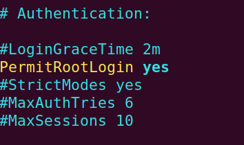
> 图：课件 Slide 25——/etc/ssh/sshd_config 的 Authentication 段：`PermitRootLogin yes` 一行的注释符 # 已删除（黄色高亮），周围 #LoginGraceTime 等行保持注释。

```bash
# Ubuntu：
ssh root@192.168.0.8           # 我们的板是 .8（课件板是 .2）；密码 = 实验二十八设的
```

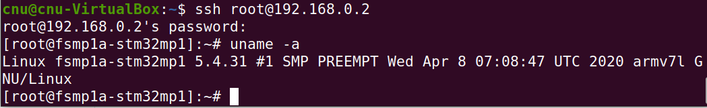
> 图：课件 Slide 26——Ubuntu 终端 `ssh root@192.168.0.2` 登录成功出现板提示符，`uname -a` 显示 `Linux ... 5.4.31 ... Apr 8 07:08:47 UTC 2020 armv7l`（出厂内核的时间戳——这个 uname 是出厂内核报的，与我们自编内核的日期不同，别看混）。

## 五、注意事项

1. **`make clean` 不可省**：QT/openssh 等新模块在旧 output 上增量编译不可靠（课件红字）。
2. **跑 GUI 一律 `run fcsys`（出厂内核）**：自制内核没编显示/触摸驱动，黑屏是预期行为不是故障；出厂内核 + 新根的混搭里，`uname -a` 报的是出厂内核（Apr 2020 / oe-user），别误判成自己的内核丢了。
3. **rootfs.tar 解包前先备份**——课件红字；tar 覆盖解包不删除旧文件，残留旧配置若引发怪象，删目录重解一份更干净。
4. **calculator 路径里 examples 是复数目录链**：`/usr/lib/qt/examples/widgets/widgets/calculator/calculator`（widgets 出现两次不是笔误）；没编 examples 选项就没有这条路径。
5. **openssh 的两步都要做**：/var/empty 属主 + sshd_config 去注释——只做一半 ssh 依然拒绝登录。
6. ssh 登录的用户名/密码/校验与实验二十八的 buildroot 配置一致（root/123456）；两台"机器"间首次连接会问 host key 确认，输 yes。

## 六、验证点一览

| 验证点 | 命令 | 通过的样子 | 在哪一步敲 |
|---|---|---|---|
| 四模块勾选 | `grep -E "BR2_PACKAGE_QT5=y\|BR2_PACKAGE_OPENSSH=y\|BR2_TOOLCHAIN_EXTERNAL_GDB_SERVER_COPY=y" .config` | 三行都在（stat 在 busybox 自己的 .config） | 步骤 1~3 |
| 重编完成 | `ls -l output/images/rootfs.tar` | 时间戳是刚刚、体积比上版大数百 MB | 步骤 4 |
| qmake 生成 | `ls output/host/bin/qmake` | 存在（下一篇 Qt Creator 要用） | 步骤 4 |
| 出厂内核启动 | `run fcsys` 后 `uname -a` | `...5.4.31 ... Apr 8 ... 2020 ... (oe-user@oe-host)` | 步骤 5 |
| QT 环境验收 | calculator `-platform linuxfb` | 屏幕显示计算器、触摸可点 | 步骤 6 |
| sshd 修好 | 板上 `/etc/init.d/S50sshd restart` 无报错 | OK | 步骤 7 |
| ssh 登录 | Ubuntu `ssh root@192.168.0.8` | 登上板子出提示符 | 步骤 7 |

不达标时的排查：

| 现象 | 先查什么 |
|---|---|
| calculator 报 `could not load the Qt platform plugin` 或起不来 | `-platform linuxfb` 参数加了没（本章题眼） |
| 屏幕亮但触摸没反应 | 跑的是不是出厂内核（`uname -a` 看编译者）；出厂 dtb 用了没（mipi050 那份带触摸节点） |
| 屏幕全黑 | 没用出厂内核/dtb（自制内核无显示驱动）；MIPI 排线；背光 |
| 文字不显示（界面元素在、字没有） | DEJAVU 字体包勾了没 |
| ssh 拒绝登录 | PermitRootLogin 去注释了没；/var/empty 属主；sshd restart 了没；密码对不对 |
| `run fcsys` 报 ext4load 失败 | eMMC 设备号（mmc 1:2，实验十四验证过）；bootfs 里文件名（`ext4ls mmc 1:2` 对照实验十五清单） |

## 七、实验完成标志

- buildroot 四模块配置完成（busybox stat / gdbserver copy / openssh / QT5 七项），`make clean` 后全量重编成功，新 rootfs.tar 生成且体积显著增大（步骤 1~4）
- `output/host/bin/` 下 qmake、arm-none-linux-gnueabihf-gdb 就位（步骤 4，下一篇开发环境的地基）
- `fcsys` 环境变量设好并 saveenv，`run fcsys` 用出厂内核+出厂 dtb 启动成功（步骤 5）
- 新根文件系统解包覆盖（旧根已备份），**板上 calculator 显示正常、触摸可点**（步骤 6——本章运行环境验收）
- openssh 配置完成（/var/empty 属主 + PermitRootLogin），Ubuntu `ssh root@192.168.0.8` 登录成功（步骤 7）

## 八、下一步：Qt 交叉开发环境与第一个应用

运行环境齐了，下一篇（实验三十七）配开发环境：Qt Creator 装 Kits（buildroot 产出的交叉编译器/调试器/qmake 5.12.8）、把开发板登记成 Generic Linux Device（走 ssh 部署），然后导入 Hello world 项目——编译、一键部署到板上、LCD 屏上亮出 "Hello world!" 按钮、断点调试一气呵成。
