# 实验三十七 Qt 交叉开发环境与第一个应用——屏幕上的 Hello world

> **对应课件**：《第10章 GUI应用程序开发》10.4~10.5 节，Slide 27-55
>
> **系列说明**：本系列基于华清远见 FS-MP1A（STM32MP157A）开发板，对应课件《第10章 GUI应用程序开发》。全系列收官篇：实验三十六把 QT 运行环境与部署通道（ssh/gdbserver）建好，本篇在电脑上配 Qt Creator——把 buildroot 生成的交叉工具链登记成 Kit、把开发板登记成设备——然后导入 Hello world 项目，**编译 → 一键部署 → LCD 屏亮出按钮 → 远程断点调试**一气呵成。做完这篇，"在 Ubuntu 写代码、在板子的屏幕上见效"的完整开发闭环就通了。前置：实验三十六（QT 运行环境 + ssh 通）。

## 一、交叉开发的角色分工

| 角色 | 在哪 | 干什么 |
|---|---|---|
| Qt Creator + Kits | Ubuntu（Host） | 写代码、调交叉编译器编出 ARM 程序、经 ssh 部署、远程 gdb 调试 |
| buildroot 产物 output/host/ | Ubuntu | Kit 的全部弹药：`arm-none-linux-gnueabihf-gcc/g++/gdb`、`qmake`（Qt 5.12.8）、sysroot |
| 开发板（Target） | 板上 | 跑 gdbserver 收部署的程序、LCD 显示（出厂内核 + linuxfb） |

## 二、实验环境（实际）

| 项目 | 实际值 |
|---|---|
| Host | Ubuntu 虚拟机：`sudo apt install qtcreator`（桌面版 VM 需有图形界面） |
| 弹药库 | `<buildroot源码>/output/host/bin/`（实验三十六编译产出） |
| Target | 板子：`run fcsys` 出厂内核 + 新根（QT 运行环境/ssh/gdbserver 就位），IP `.8` |
| 项目 | `main.cpp` + `qt-demo-qc.pro`（课件 Slide 44 给了 main.cpp 全文；.pro 按标准模板自建，见步骤 4） |

> **开工自检（10 秒）**：`ls <buildroot源码>/output/host/bin/qmake` 在；板上 ssh root@192.168.0.8 能登（实验三十六步骤 7）；屏上 calculator 上一课还点得动。

## 三、课件 ↔ 步骤对应表

| 课件 Slide | 内容 | 对应步骤 |
|---|---|---|
| 27~29 | 安装 Qt Creator、验证交叉 gdb、缺库补装 | 步骤 1 |
| 30~37 | Kits 配置（编译器/调试器/Qt 版本/mkspec） | 步骤 2 |
| 38~43 | 新建设备（Generic Linux Device）与连接测试 | 步骤 3 |
| 44~48 | 导入项目、ClangCodeModel 假错误处理 | 步骤 4 |
| 49~52 | 部署运行（`-platform linuxfb`） | 步骤 5 |
| 53~55 | 调试（取消 Shadow build、-g -O0、断点） | 步骤 6 |

### 本篇动作 → 后面谁用 → 现在含糊的后果

| 本篇动作 | 后面哪一篇要用 | 现在含糊的后果 |
|---|---|---|
| Kit（编译器/调试器/qmake/mkspec） | 一切 QT 程序的编译 | 每个项目都配一遍环境 |
| 设备登记（ssh 通道） | 一键部署与远程调试 | 手工 scp + 手敲命令跑程序 |
| `-platform linuxfb` | 板上一切 QT 程序的运行参数 | 程序闪退查不到头 |
| 调试三件套（Shadow build/-g -O0） | 以后调试任何 QT 程序 | 断点打不上还以为 gdb 坏了 |

## 四、实验步骤

### 步骤 1：装 Qt Creator，验证交叉 gdb（Slide 27~29）

```bash
sudo apt install qtcreator
# 验证 buildroot 生成的交叉调试器能否运行：
<buildroot源码>/output/host/bin/arm-none-linux-gnueabihf-gdb
```

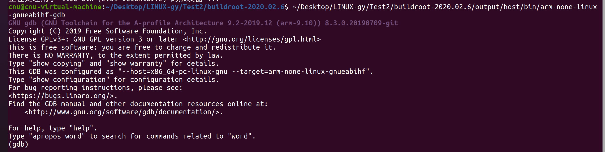
> 图：实测（顶替课件 Slide 28）——交叉 gdb 运行验证：`GNU gdb ... 8.3.0.20190709-git`、`--host=x86_64-pc-linux-gnu --target=arm-none-linux-gnueabihf`，停在 `(gdb)` 提示符——能停在这就是好的，`q` 退出。

若起不来按提示补库（课件给的三件常见缺）：

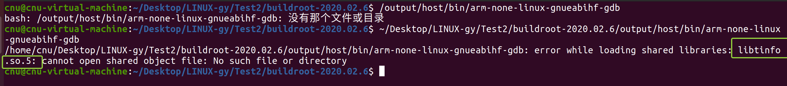
> 图：课件 Slide 29——gdb 起不来的缺库报错样貌，按下面一条命令补齐。

```bash
sudo apt install libtinfo5 libncursesw5 libpython2.7
```

### 步骤 2：配置 Kits——四页走完（Slide 30~37）

qtcreator 装好后，从桌面左下角应用网格启动它：

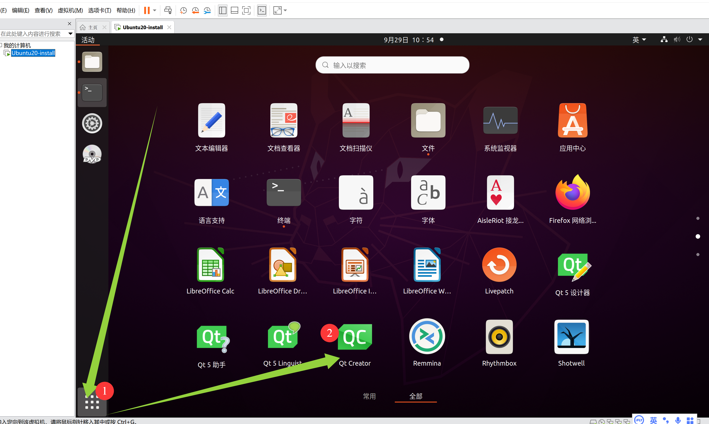
> 图：实测——应用网格里的 Qt Creator 图标（① 点左下角九宫格 → ② 找到 Qt Creator 点开；旁边还有 Qt 5 设计器/助手/Linguist 等配套工具）。

打开 Tools → Options → Kits：

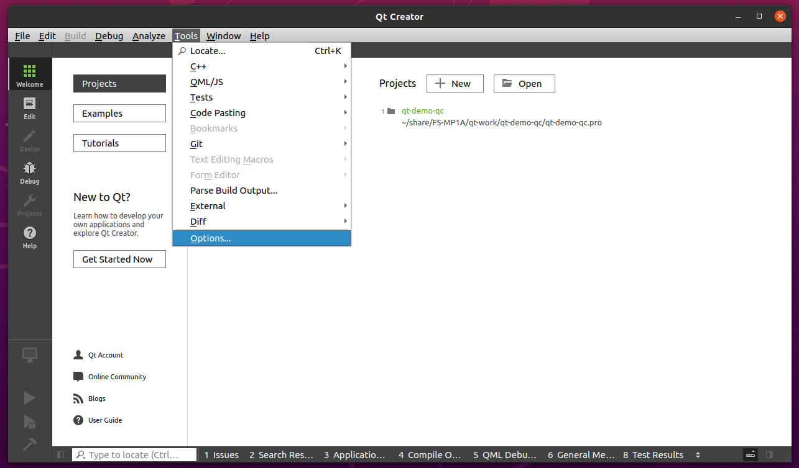
> 图：课件 Slide 30——Tools 菜单高亮 Options...（Qt Creator 主界面，Projects 面板已有示例项目）。

Kits 页点 **Add** 新建一个 kit（黄色感叹号 = 未配完）：


> 图：课件 Slide 31——Kits 页：Auto-detected 只有 Desktop (default)，点 Add 新建一个未命名 kit（黄色感叹号 = 未配完）。

整个 Kit 要填的就是下面这一组值（**可整块复制，逐项对着填**；`<buildroot源码>` = 你的 buildroot 目录，同步骤 1）：

```text
Kit 名称     = Buildroot ARM
Device type  = Generic Linux Device
Compiler C   = <buildroot源码>/output/host/bin/arm-none-linux-gnueabihf-gcc
Compiler C++ = <buildroot源码>/output/host/bin/arm-none-linux-gnueabihf-g++
Debugger     = <buildroot源码>/output/host/bin/arm-none-linux-gnueabihf-gdb
Qt version   = <buildroot源码>/output/host/bin/qmake        （Qt Versions 页添加，自动识别 Qt 5.12.8）
Sysroot      = <buildroot源码>/output/host/arm-buildroot-linux-gnueabihf/sysroot/
Qt mkspec    = devices/linux-buildroot-g++
```

四个"弹药"要先在各自的子页登记，Kit 的下拉框里才选得到（下面四小节各配实测图）。

**① 编译器（编译器 tab）**：右侧**添加** → 类型 GCC → C，名称 `Buildroot GCC`、编译器路径填 Compiler C 那行 → **Apply**；再**添加** → 类型 GCC → C++，名称 `Buildroot G++`、路径填 Compiler C++ 那行 → **Apply**：

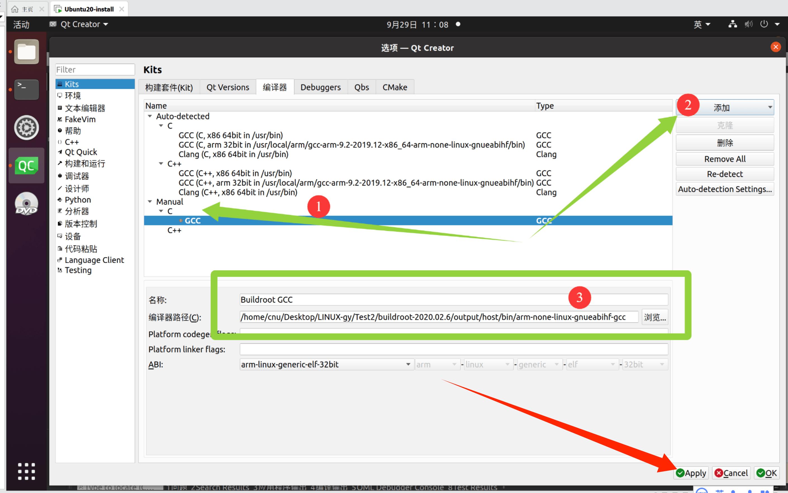
> 图：实测——编译器 tab 添加 Buildroot GCC（编号 1=Manual/C 的位置、2=添加按钮、3=名称+路径绿框、红箭头=Apply）：路径即 output/host/bin/arm-none-linux-gnueabihf-gcc。

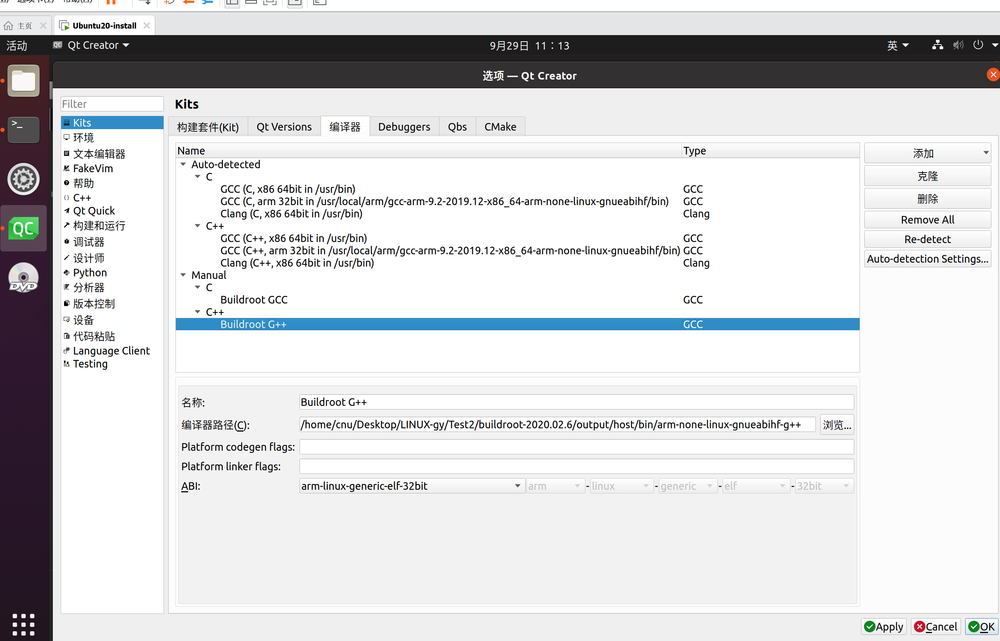
> 图：实测——两个编译器都就位：Manual 下 Buildroot GCC 与 Buildroot G++（高亮行，C++ 路径 arm-none-linux-gnueabihf-g++）。Auto-detected 里还能看到实验十九装的 gcc-arm-9.2（同一套编译器，buildroot 打包了一份给 sysroot 配套）——Kit 里只选 Buildroot 这套。

**② 调试器（Debuggers tab）**：添加 → 名称 `Buildroot GDB`、路径填 Debugger 那行 → Apply（步骤 1 验证过的那个，Version 9.2.0 自动识别）：

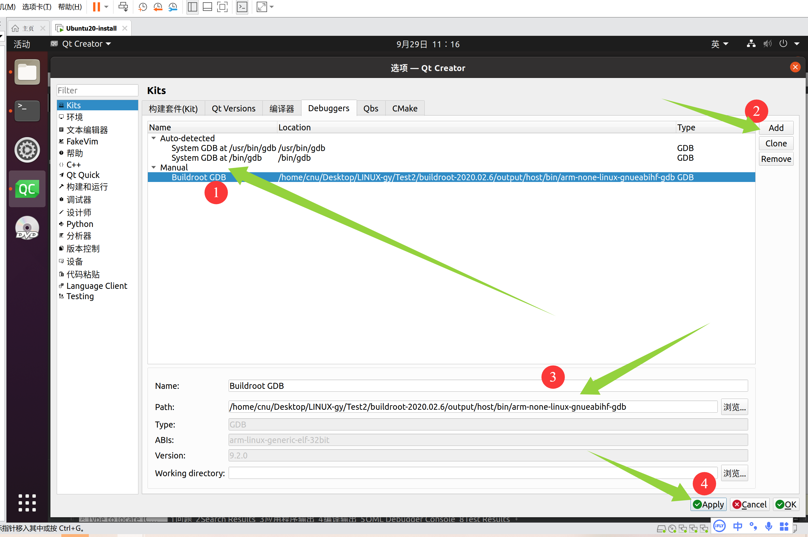
> 图：实测——Debuggers tab：Buildroot GDB 就位（路径 output/host/bin/arm-none-linux-gnueabihf-gdb、Version 9.2.0）。

**③ Qt 版本（Qt Versions tab）**：添加... → 选 qmake 路径（自动识别 Qt 5.12.8）→ **版本名称默认是 `Qt %{Qt:Version} (host)`，手动改成 `Qt %{Qt:Version} (Buildroot)`** → Apply：

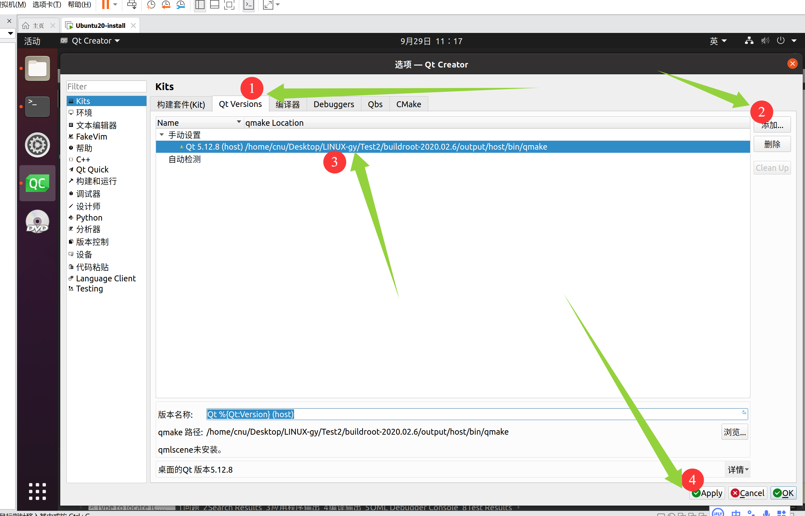
> 图：实测——Qt Versions：qmake 添加后版本名称还是默认的 `Qt %{Qt:Version} (host)`（蓝框）——下一步改掉它。

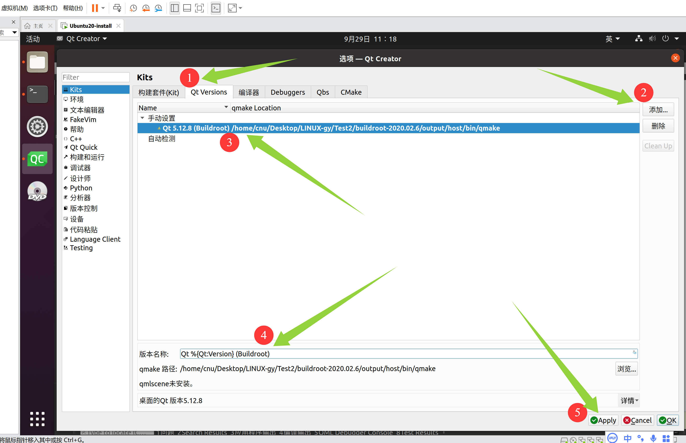
> 图：实测——版本名称改为 `Qt %{Qt:Version} (Buildroot)`（编号 1=tab、2=添加、3=条目、4=版本名称、5=Apply）。

**④ 回 Kits 页选齐全部字段**（Name、Device type、Compiler C/C++、Debugger、Qt version 按上面整块值选；**Sysroot 与 Qt mkspec 是手填的两项**——mkspec 下拉列表里没有，手敲）：

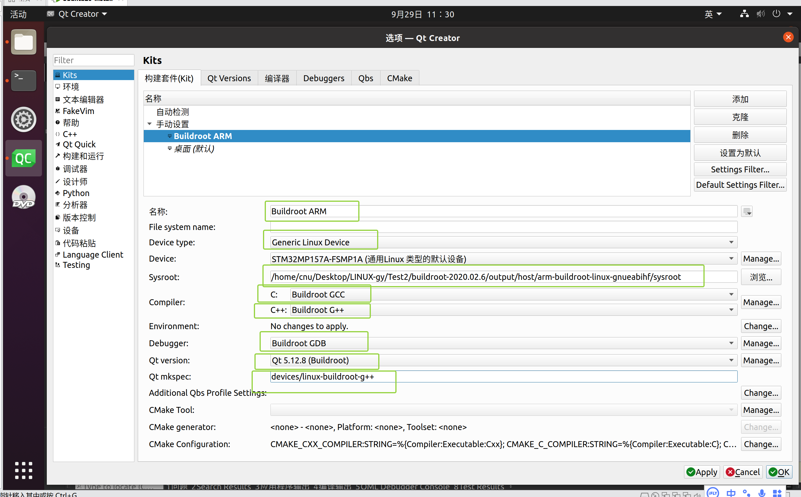
> 图：实测——Kit 配置完成态：四项弹药 + Device + Sysroot（绿框）+ Qt mkspec（绿框）全部就位、感叹号消失。Device 一栏的 STM32MP157A-FSMP1A 来自步骤 3 的设备登记——先后顺序不强制，也可以先登设备再回 Kit 补选。

### 步骤 3：登记开发板设备（Slide 38~43）

先做一层最基础的网络预检——板上 ping 通电脑（没有这一层，后面 Qt Creator 的 Test 必失败）：

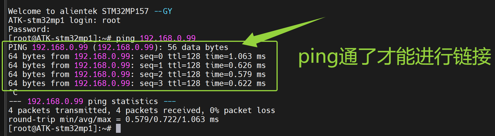
> 图：实测——板上 `ping 192.168.0.99` 通（.99 = Windows 侧 USB 网卡；Ubuntu 侧是 .100，反向从 Ubuntu `ping 192.168.0.8` 同样要通）。**注意：ping 通只证明网络层可达，ssh 认证层是另一回事——Device Test 失败先看本步骤末尾的实测排查**。

Tools → Options → Devices → Add：

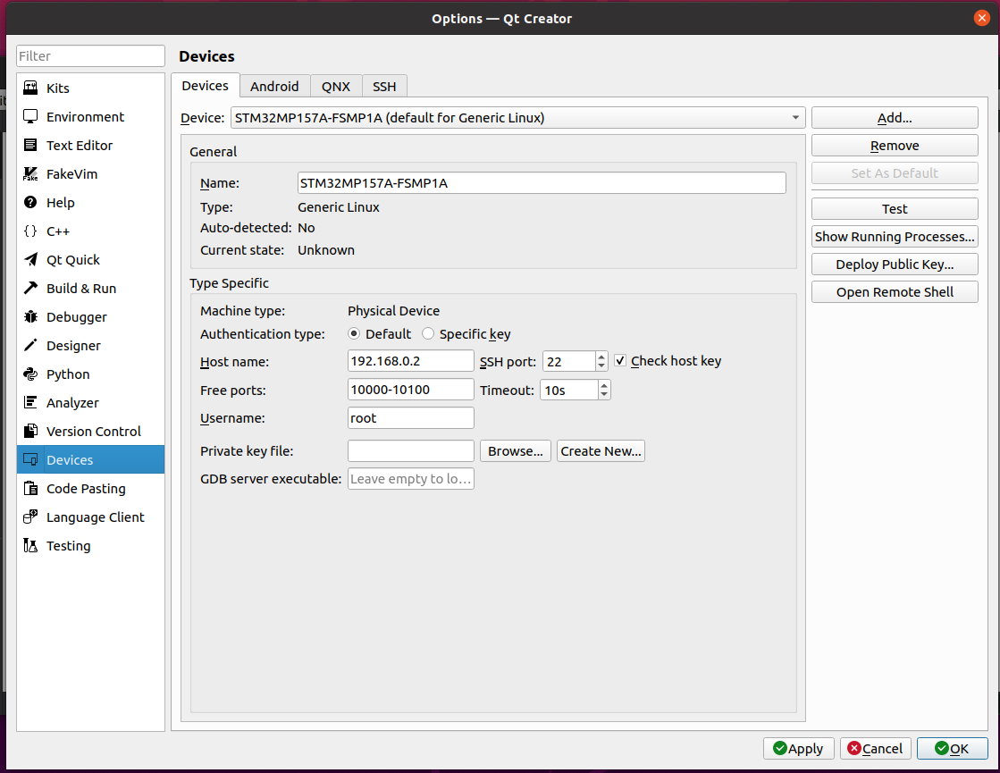
> 图：课件 Slide 38——Devices 页：设备 STM32MP157A-FSMP1A（Generic Linux、Host name、SSH port 22、Username root）——配置完成的样貌。


> 图：课件 Slide 39——向导第一步：设备类型选 Generic Linux Device，Start Wizard。

向导里要填的连接参数（**可整块复制对着填**）：

```text
名称        = STM32MP157A-FSMP1A
主机名称    = 192.168.0.8           # 课件板是 .2，我们板是 .8
用户名      = root
验证类型    = Default               # 密码认证——不要选 Specific key！
私钥文件    = 留空
空闲端口    = 10000-10100           # 默认即可
```

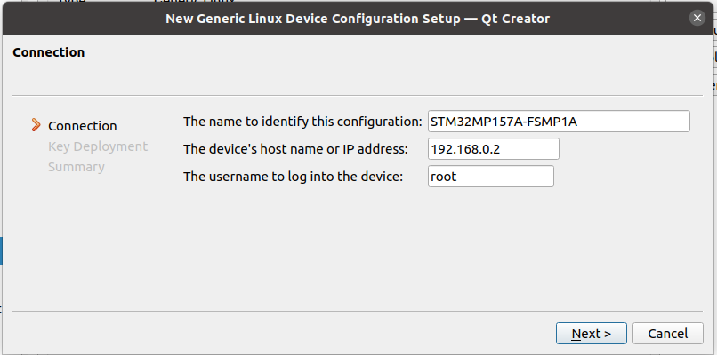
> 图：课件 Slide 40——Connection 页：名称 STM32MP157A-FSMP1A、IP 填我们板的 192.168.0.8、用户名 root。

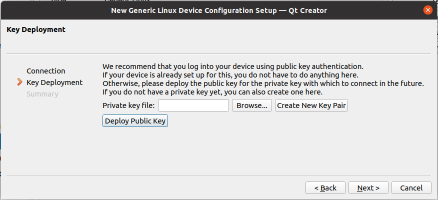
> 图：课件 Slide 41——Key Deployment 页：私钥留空跳过，直接用密码登录（root/123456——课件示例；我们 buildroot 设的是 root/123——实验二十八步骤 4 自定义密码）。

一路 Next 到 Finish，回到设备页点 **Test**：

**实测踩坑：验证类型选了 `Specific key` 会让 Test 直接失败**——私钥文件空着，Qt Creator 拿着不存在的私钥去认证、不会交互式要密码，三个红字连发：`SSH connection failure`、`Warning: Identity file  not accessible: No such file or directory.`（Identity file 后面是空的！）、`root@192.168.0.8: Permission denied (publickey,password,keyboard-interactive)`：

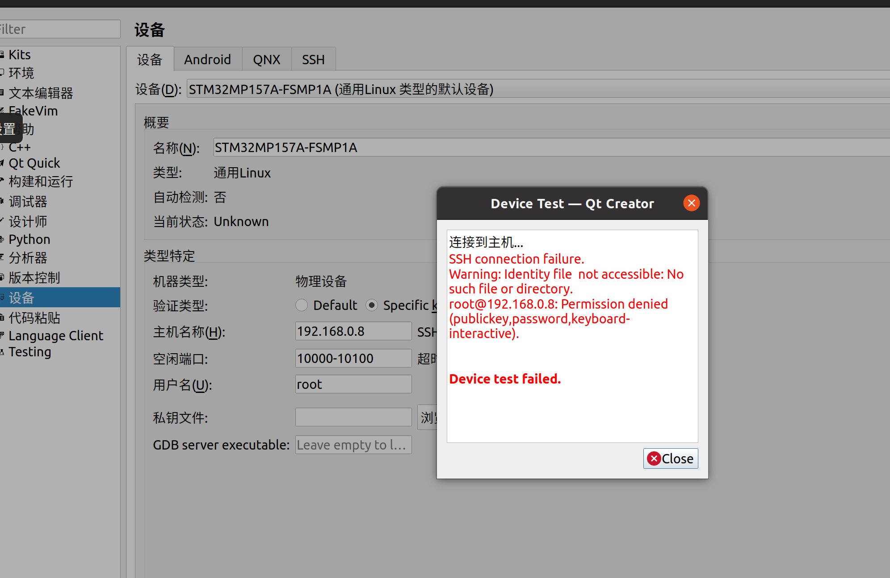
> 图：实测——Device Test 失败现场：验证类型 = Specific key、私钥文件空。**ping 通只说明网络层可达，认证失败照样测不过——两层别混**。

修法：验证类型改回 **Default**（密码认证，私钥栏变灰），Apply 后再点 Test，弹密码框输 123（实验二十八设的）：

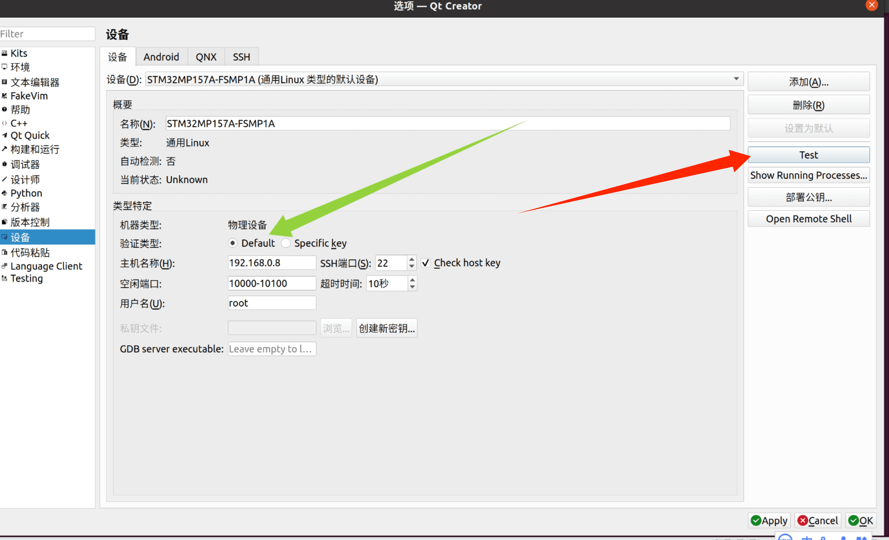
> 图：实测——修法：验证类型改回 **Default**（绿箭头处），主机名称 192.168.0.8、用户名 root、Check host key 勾选——私钥一栏变灰不可填 = 已回到密码认证模式。

实测——改回 Default 后再点 Test，**qtc-askpass 弹出密码框**（Specific key 模式下这一步直接失败，密码弹窗本身就是 Default 生效的证明）：

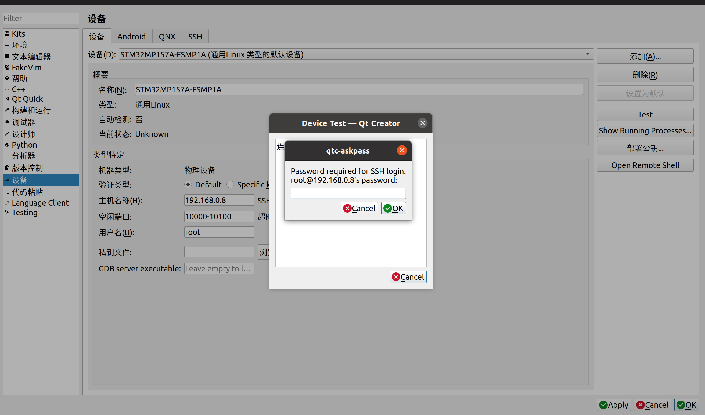
> 图：实测——Device Test 中的 qtc-askpass 密码框：`Password required for SSH login. root@192.168.0.8's password:`——输入 123 点 OK。

通过的样子（**rsync 报 not found 是正常的**——板上没装，Qt Creator 自动降级用 SFTP 部署）：

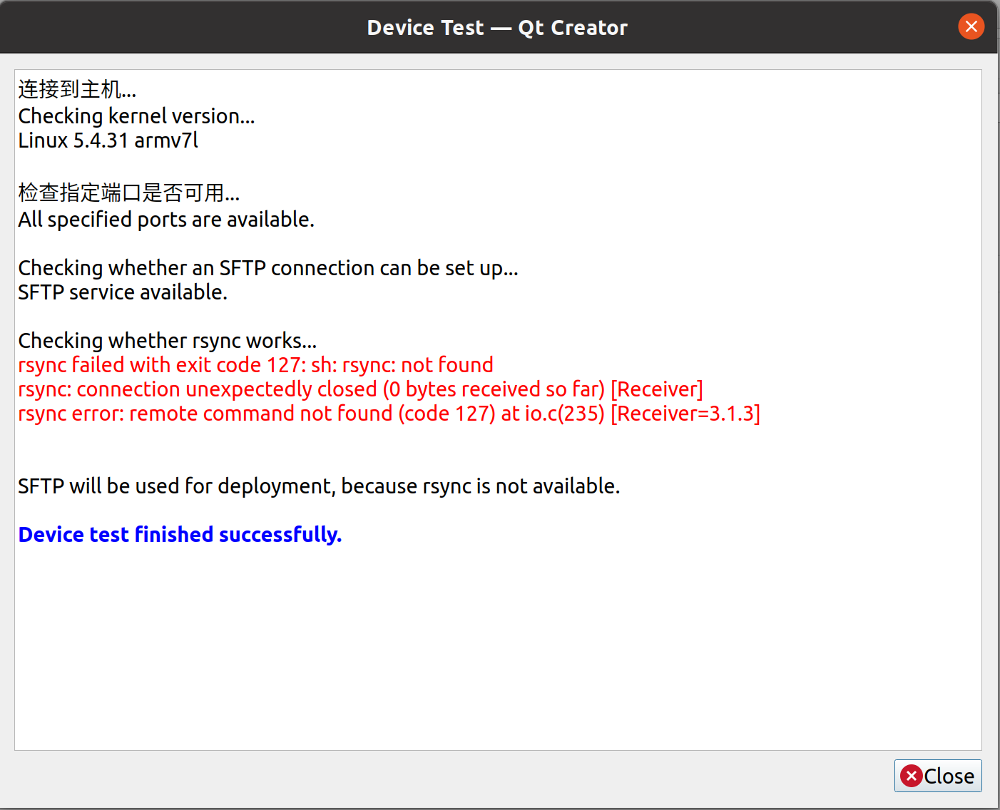
> 图：实测（顶替课件 Slide 43）——Device Test 全程：Connecting to host / Checking kernel version（**Linux 5.4.31 armv7l**）/ 检查指定端口 All specified ports are available / SFTP service available；**中间三行红字 `rsync: not found` 不是失败**——板上没装 rsync，紧跟着 "SFTP will be used for deployment" 自动降级，**判据只看最后一行 "Device test finished successfully."**。

### 步骤 4：导入项目（Slide 44~48）

项目就两个文件。`main.cpp`（课件 Slide 44 全文）：

```cpp
#include <QApplication>
#include <QPushButton>

int main(int argc, char* argv[])
{
    QApplication app(argc, argv);
    QPushButton hello("Hello world!");
    hello.resize(100,30);
    hello.show();
    return app.exec();
}
```

`qt-demo-qc.pro`（qmake 工程文件，按标准模板）：

```pro
QT += widgets
SOURCES += main.cpp
TARGET = qt-demo

target.path = /opt
INSTALLS += target
```

（课件提示"内容如下"后给了 main.cpp；.pro 的 `QT += widgets` 对应实验三十六勾的 Widgets 库、`TARGET` 是产物名。**后两行是部署规则，实测缺它不可**：Build 后 Qt Creator 经 SFTP 把产物传到板上 `/opt/qt-demo`——没有这两行，Run 会报 `Cannot run: No command given.`（Qt Creator 不知道把程序放哪、跑哪个）。**target.path 写 `/opt` 别写成 `/opt/$${TARGET}`**——后者会让部署先在板上建 `/opt/qt-demo` 子目录，而这块板的 SFTP 服务建目录报 Failure（实测，见步骤 5 踩坑）。）

**先回答"导入的是什么项目"**：不是 Qt Quick 模板——Qt Quick 是 QML 技术栈，本篇用的是 **Qt Widgets**（`QT += widgets` + QPushButton）。做法二选一：

- **方法 A（课件路线，推荐）**：新建一个空目录（如 `qt-demo-qc`），手建上面两个文件（main.cpp 照课件全文抄），然后 File → Open File or Project 选 `qt-demo-qc.pro`——文件最少、与课件逐字对应；
- **方法 B（模板起头）**：File → New File or Project → Application (Qt) → **Qt Widgets Application**（注意**不是 Qt Quick Application**），Build system 选 qmake——模板会多生成 mainwindow 一套文件（用不上可删），再把 main.cpp 改成课件全文。

两条路最终的项目内容完全一样；下面的 Open → Configure Project 流程两条路都适用。

**实测踩坑：Open 之后两个 kit 全灰、提示 "No suitable kits found."**——项目文件先 `cat` 核对过没问题，桌面 kit 灰也正常（没装宿主 Qt）。两层原因、两条修法，**先抄修法，原理与排查链在后面**：

```text
第一层  output/host/mkspecs/ 里缺 default 符号连接 → 整个 Qt 版本被判无效 → kit 全灰
修法    ln -sfn devices/linux-buildroot-g++ <buildroot源码>/output/host/mkspecs/default

第二层  kit 的 Qt version 字段掉成 None → default 补上后仍灰
修法    Kits 页选中 kit → Qt version 下拉选回 Qt 5.12.8 (Buildroot)；删掉自动生成的 "- temporary" 临时 kit
```

排查链（含两次被否的假设，照抄链路就能自救）：

① 用 qmake 问出 mkspec 的查找基准——**`QT_HOST_DATA` 才是 mkspecs 的家**（别查 sysroot，那是头一个会踩的弯路）：

```bash
~/Desktop/LINUX-gy/Test2/buildroot-2020.02.6/output/host/bin/qmake -query | grep -E "QT_HOST_DATA|QMAKE_XSPEC"
# QT_HOST_DATA: .../output/host                     ← mkspecs 在它下面的 mkspecs/ 里
# QMAKE_XSPEC: devices/linux-buildroot-g++          ← qmake 配置里烙的目标 spec
```

② 排除"spec 缺失"假设——devices 目录实测在位（linux-buildroot-g++ 在列），假设否掉：

```bash
ls ~/Desktop/LINUX-gy/Test2/buildroot-2020.02.6/output/host/mkspecs/devices/
```

③ 真凶之一：**mkspecs/default 符号连接缺失**（`ls -la .../mkspecs/ | grep default` 空输出）。修法一行——**注意路径要写全，别把省略号当路径照抄**：

```bash
ln -sfn devices/linux-buildroot-g++ ~/Desktop/LINUX-gy/Test2/buildroot-2020.02.6/output/host/mkspecs/default
ls -la ~/Desktop/LINUX-gy/Test2/buildroot-2020.02.6/output/host/mkspecs/ | grep default
# default -> devices/linux-buildroot-g++  = 第一层补上了
```

**但实测补上、连 Ubuntu 都重启了，kit 仍灰**——default 缺失是"必要不充分"的第一层，底下还有第二层。继续定位的手段（按顺序，谁先出红字谁就是答案）：

- Configure Project 页 Buildroot ARM 行的"**详情**"下拉展开——红字直接写 kit 哪里不合格；
- Kits 页选中 Buildroot ARM——下方 Name/Device type/编译器/调试器/Qt version 各字段**哪个带 ⚠ 图标**；
- Qt Versions 页选中 Qt 5.12.8 (Buildroot)——**详情顶部的黄色警告条**全文（常见嫌疑："Qt version is not properly installed"）；
- 终端兜底验证四件套真能跑：

```bash
B=~/Desktop/LINUX-gy/Test2/buildroot-2020.02.6/output/host/bin
ls $B | grep -E "gcc$|g\+\+$|gdb$|qmake$"
$B/arm-none-linux-gnueabihf-g++ --version | head -1
$B/qmake --version
```

**实测进展（工具链洗清嫌疑）**：命令行 `qmake qt-demo-qc.pro && make` 直接编出 ARM 产物（file 见 EABI5）、四件套全部能跑、qmake 报 Qt 5.12.8 指向 sysroot/usr/lib——**工具链与 Qt 完全健康，问题收敛在 Qt Creator 的 kit 判定**。下一号嫌疑：**Qt 的模块描述文件 qt_lib_*.pri 的位置**——`QT += widgets` 的项目要求 kit 的 Qt 提供 widgets 模块，Qt Creator 按 `QT_INSTALL_ARCHDATA/mkspecs/modules`（sysroot/usr/mkspecs/modules）找它们，实测该目录不存在（模块 .pri 实际生成在 output/host/mkspecs/modules/）。修法：把编译目录的 mkspecs 补进 sysroot：

```bash
cp -a ~/Desktop/LINUX-gy/Test2/buildroot-2020.02.6/output/build/qt5base-5.12.8/mkspecs \
      ~/Desktop/LINUX-gy/Test2/buildroot-2020.02.6/output/host/arm-buildroot-linux-gnueabihf/sysroot/usr/
```

补完重启 Qt Creator 重新 Open 项目——Buildroot ARM 若能打勾，根因坐实；仍灰则看"详情"红字。

**第二层答案（实测截图对照出的）**：default 连接补上、整机重启后 kit 仍灰——重新 Open 项目时 Qt Creator **自动生成了一个 `Qt 5.12.8 (Buildroot) - temporary` 临时 kit**（Kits 列表里带 ⚠ 的那个），同时手动 kit 的 **Qt version 字段掉成了 `None`**。两步修复：

```text
1. Kits 页选中 Buildroot ARM → Qt version 下拉重新选回 Qt 5.12.8 (Buildroot)
2. 选中多余的临时 kit "Qt 5.12.8 (Buildroot) - temporary" → 删除
```

Apply/OK 后重新 Open 项目——Buildroot ARM 从灰变可选、勾上后 Configure Project 可点（桌面 kit 依旧灰——没装宿主 Qt，本篇用不上也不用管）。

**转正收尾两个动作**：① 转正 kit 的**名称改成 `Buildroot ARM`**、删掉旧灰 kit——与本篇正文名字一致；② 转正 kit 的字段此时已四项齐全（Device/Sysroot/编译器/调试器/Qt 版本/mkspec 一应俱全——临时 kit 转正时这些会一并带过来或补选）。

**两个追问的答案**：① 临时 kit 哪来的——Qt Creator 的标准自救：打开项目时发现项目的 Qt 版本没有可用 kit，它会**用该 Qt 版本自动现配一个临时 kit**（名字 = Qt 版本名 + " - temporary"）让项目至少能配；② 原 Buildroot ARM 为什么灰——它的 **Qt version 字段是 None**（配置页截图实锤）。None 怎么来的：default 符号连接缺失期这个 Qt 版本被判无效，kit 字段在那阵被重置/未选上的概率最大（确切时机已不可考，也不重要）——**Qt Creator 修好 Qt 版本后不会自动把 kit 的字段补回来，要手动选回**；你选择了更省事的转正路线，效果相同。

File → Open File or Project 把两个文件打开，Kits 选 **Buildroot ARM**，Configure Project：

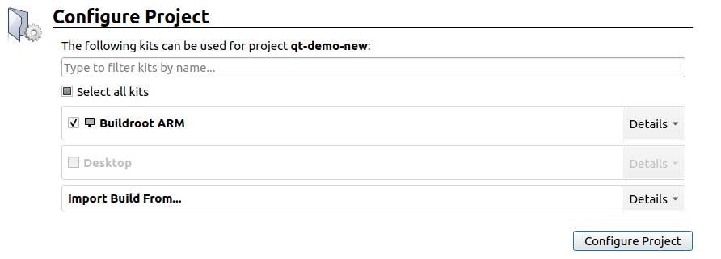
> 图：课件 Slide 45——Configure Project 页：kit 列表勾 Buildroot ARM（Desktop 灰色不可选——交叉项目上不了桌面 kit），点 Configure Project。


> 图：课件 Slide 46——项目导入完成，Build → Build All 即可编译。

编辑器若冒红波浪线"unknown type names"——**是假象**：代码模型不认识交叉 Qt 的头文件而已。Help → About Plugins 把 **ClangCodeModel 的 Load 勾掉**、重启 Qt Creator 即清净：

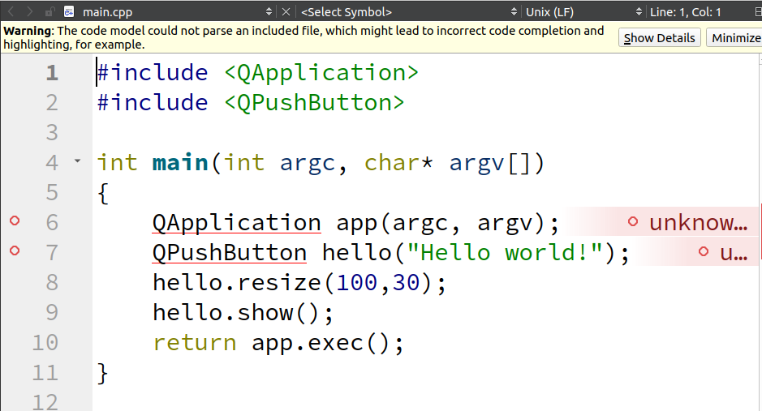
> 图：课件 Slide 47——main.cpp 顶部的警告条与 6/7 行的红色错误标记（code model could not parse an included file）。

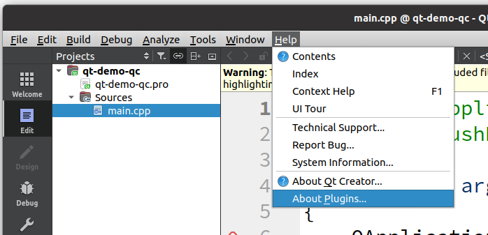
> 图：课件 Slide 48——Help 菜单高亮 About Plugins...。


> 图：课件 Slide 48——插件列表：C++ 分组的 ClangCodeModel 取消 Load 勾选，底部提示 Restart required。

### 步骤 5：部署运行——屏上 Hello world（Slide 49~52）

**实测插叙——不依赖 kit 的手动路线（kit 灰着也能拿验收）**：板上根就是 NFS 目录，Ubuntu 侧把编译产物直接放进根的 /opt，板上一条命令跑：

```bash
# Ubuntu（NFS 根 = 板上 /，两副面孔）：
sudo cp <项目目录>/qt-demo /home/cnu/nfsboot/rfs-buildroot/opt/
```

```bash
# 板上：
/opt/qt-demo -platform linuxfb
```

**LCD 亮出 Hello world 按钮 = 全系列终极验收**（本篇实测先由这条路线达成）；kit 修好后 Qt Creator 一键路线也已补测跑通，两条路等效。走一键路线只有一处必做——**给运行加参数**：左侧 Projects → Build & Run 选中 **Buildroot ARM → Run**，**Command line arguments 填 `-platform linuxfb`**：

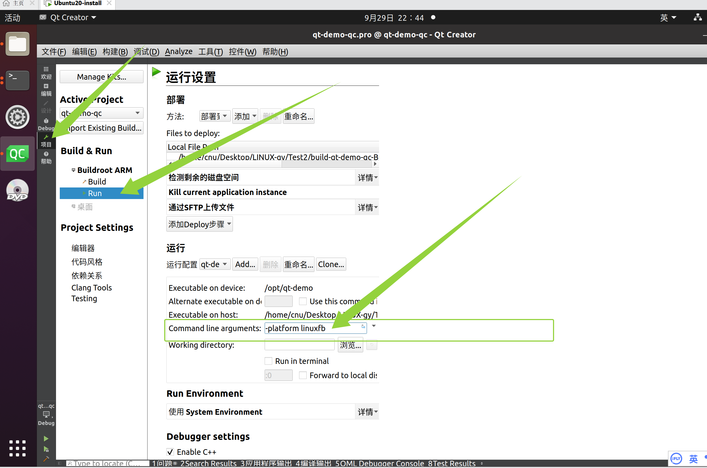
> 图：实测（顶替课件 Slide 50）——Run 设置页：① 左树 Build & Run 下选中 Buildroot ARM → Run（绿箭头）；② **Command line arguments 填 `-platform linuxfb`**（绿框）。Executable on device = /opt/qt-demo（.pro 里 target.path + TARGET 的落点）、部署三步 = 检测剩余的磁盘空间 / Kill current application instance / 通过 SFTP 上传文件、Run Environment 用 System Environment——一键部署的全套设置一屏看全。

**实测踩坑：运行参数没加，报 `Could not find the Qt platform plugin "eglfs"`、程序起崩**（按"现象 → 根因 → 修法"记）：

- **现象**：点绿色三角，`Starting /opt/qt-demo ...` 之后红字连发：`qt.qpa.plugin: Could not find the Qt platform plugin "eglfs" in ""` → `This application failed to start because no Qt platform plugin could be initialized.` → `Remote process crashed.`。中间夹着一行**关键证据**：`Available platform plugins are: linuxfb, minimal, offscreen, vnc`——**板上不缺后端，linuxfb 明明在列**（实验三十六的 calculator、本篇的手动路线都已在 linuxfb 上跑通过）。
- **根因**：Qt 选显示后端的优先级 = `-platform` 命令行参数 > `QT_QPA_PLATFORM` 环境变量 > **编译期写死的默认值（这套 Qt 默认 eglfs）**。前两级都没传到，Qt 就奔默认的 eglfs 去——而 buildroot 这套只编了 linuxfb 后端（实验三十六实测：不开 OpenGL 连 eglfs 选项都不出现），插件不存在 → 启动即崩。**程序没问题、板子没问题，就是参数没挂上**。
- **修法**：上图的 Command line arguments 填 `-platform linuxfb`，点绿色三角重新运行即过（实测）。认准这个框——它下面的 **Alternate executable on device** 是"整条命令替换"的备用框，参数别填那里。

**实测踩坑：点绿色三角报 `File transfer failed: Couldn't create directory: Failure` ×3 + `remote open("/opt/qt-demo/qt-demo"): No such file or directory`**——部署规则写成 `target.path = /opt/$${TARGET}` 时，Qt Creator 会先经 SFTP 在板上**创建 /opt/qt-demo 子目录**再传文件，而这块板的 SFTP 服务对建目录直接报 Failure（目录建不成，文件自然落不下）。修法（二选一）：

- **改 .pro（推荐，与课件一致）**：`target.path = /opt`——产物直接落 `/opt/qt-demo`、不建子目录，重新 Build 再 Run；
- **预建目录**：Ubuntu 侧 `sudo mkdir -p /home/cnu/nfsboot/rfs-buildroot/opt/qt-demo`（NFS 两副面孔），SFTP 只需传文件。

点左下角**绿色三角**（运行按钮）——编译产物经 SFTP 部署到板上（.pro 里可指定目标目录，课件示例部署到 /opt）并运行：


> 图：课件 Slide 49——绿色三角"运行"按钮：一键完成"部署到板 + 运行"。


> 图：课件 Slide 49——板上 `ls /opt` 见部署来的程序（绿色可执行文件）。

**LCD 屏上亮出按钮**：

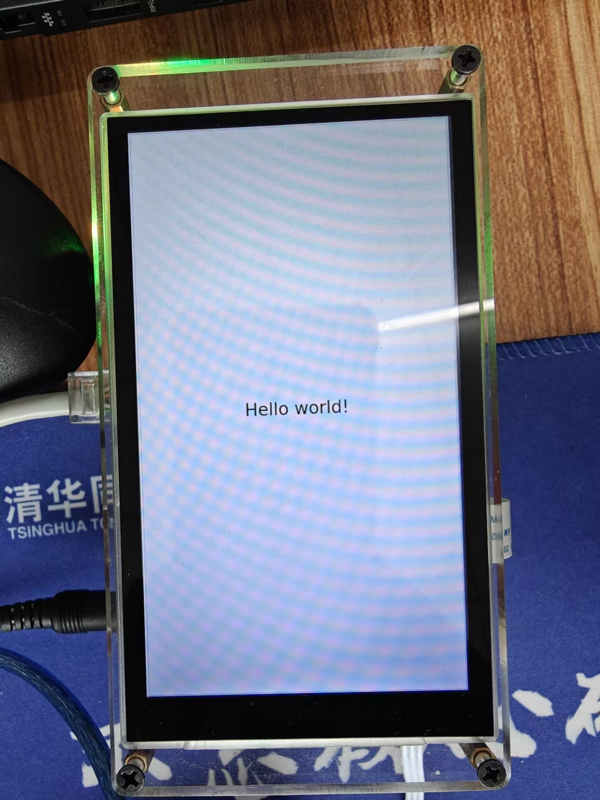
> 图：实测（顶替课件 Slide 51/52 两图）——**板上 MIPI 屏实拍：`Hello world!` 按钮亮在屏上**——Ubuntu 写代码、交叉编译、部署上板、屏幕见效，全链路的最后一环闭上。

命令行手动跑的等价写法（路径 = 部署目标目录 + .pro 的 TARGET 产物名）：

```bash
# 板上：
/opt/qt-demo -platform linuxfb
```


> 图：课件 Slide 52——板上终端 `/opt/qt-demo-qc -platform linuxfb` 手动运行——与绿色三角等效。

### 步骤 6：断点调试（Slide 53~55）

调试前两件事：**① Projects → Build 里取消 Shadow build**（产物要留在项目目录里，gdb 才找得到源码与符号）；**② .pro 加编译参数**（-g 带调试信息——缺了进不了断点；-O0 不优化——缺了单步会跳行、变量被优化掉看不到）。改完后的 .pro 全文如下（末行是新加的，其余与步骤 4 一致，可整块复制覆盖）：

```pro
QT += widgets
SOURCES += main.cpp
TARGET = qt-demo

target.path = /opt
INSTALLS += target

QMAKE_CXXFLAGS += -g -O0
```

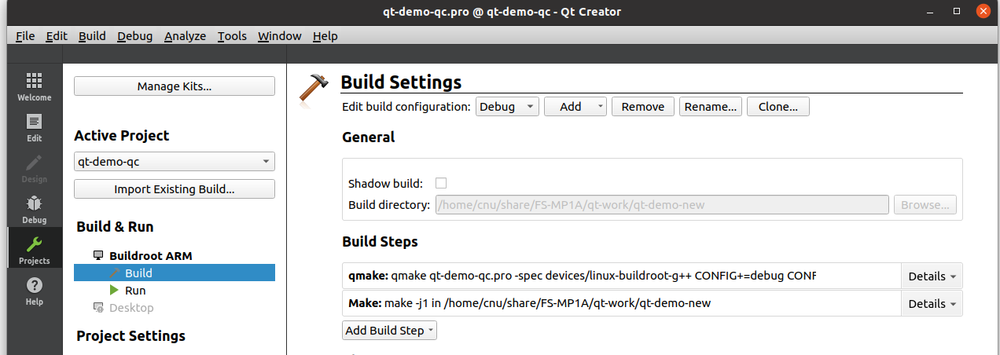
> 图：课件 Slide 53——Build Settings 页：Shadow build 复选框取消勾选；Build Steps 显示 qmake -spec devices/linux-buildroot-g++ 与 make。

main.cpp 整份换成下面这份（可整块复制覆盖；新内容 = `int a = 42;`/`a++` 给断点处的局部变量窗口看值，`qDebug("Test 1")`/`qDebug("Test 2")` 在应用程序输出窗各打一行——printf 风格的 qDebug 走 QtGlobal 自带声明，不用另加 `#include <QDebug>`，带 `<<` 的流式写法才需要）：

```cpp
#include <QApplication>
#include <QPushButton>

int main(int argc, char* argv[])
{
    int a = 42;
    a++;
    qDebug("Test 1");
    QApplication app(argc, argv);
    QPushButton hello("Hello world!");
    hello.resize(100,30);
    hello.show();
    qDebug("Test 2");
    return app.exec();
}
```

在 `QApplication app(argc, argv);` 行点行号设断点（行号旁出红点），改过代码先 Ctrl+B 重新 Build，再点**调试按钮**（绿色三角+甲虫）：


> 图：课件 Slide 55——"开始调试"按钮：三角与甲虫图标叠加。


> 图：课件 Slide 55——调试现场：GDB for "qt-demo-qc (on STM32MP157A-FSMP1A)" 停在 main 第 7 行断点（Stopped at breakpoint 1），局部变量窗口显示 a=42、app、argc、argv、hello——**Ubuntu 上的 gdb 正在遥控板上的程序**，交叉调试全通。

**全系列到此收官**：从第 3 章点亮第一行 SPL 串口日志，到今天 Ubuntu 写一行代码、板子 LCD 上见一个按钮——bootloader、内核、设备树、根文件系统、驱动、GUI 应用，每一层都亲手搭过。

## 五、注意事项

1. **Kit 四项弹药全部指向 buildroot 的 output/host/**——别混用实验十九的裸编译器（qmake 与 sysroot 必须配套，混搭编出的程序在板上缺库）。
2. **mkspec 手填 `devices/linux-buildroot-g++`**——下拉列表里没有，手敲；填错 qmake 会用宿主规格编出 x86 程序。
3. **设备 IP 填我们板的 `.8`**；Test 报 rsync not found 是正常降级（SFTP 部署），不算失败。
4. **红色波浪线先怀疑 ClangCodeModel**——关插件重启，别按"报错"去改代码（代码本身没毛病）。
5. **`-platform linuxfb` 是运行参数不是编译参数**——Run 设置的 Command line arguments 里加（实测漏加必报 eglfs 起崩，见步骤 5 踩坑）；命令行手动跑时同样要带。
6. 调试不起断点：Shadow build 取消没、-g -O0 加了没、部署的是重编后的版本（改代码要重新 Build）。
7. 板子要一直在位（ssh/gdbserver 都走网络）；板重启后 gdbserver 由 init 脚本自动起，Qt Creator 重新点运行即可。

## 六、验证点一览

| 验证点 | 命令 | 通过的样子 | 在哪一步敲 |
|---|---|---|---|
| 交叉 gdb 可用 | `output/host/bin/arm-none-linux-gnueabihf-gdb` | 停在 `(gdb)` 提示符 | 步骤 1 |
| Kit 就绪 | Kits 页 Buildroot ARM 无感叹号 | 编译器/调试器/Qt 5.12.8/mkspec 齐且选中 | 步骤 2 |
| 设备连通 | Devices 页 Test | "Device test finished successfully."（rsync 降级属正常） | 步骤 3 |
| 项目编译 | Build → Build All | Compile output 无 error | 步骤 4 |
| 部署运行 | 绿色三角 | 板上 /opt（或 .pro 指定目录）出现程序，**LCD 亮出 "Hello world!" 按钮** | 步骤 5 |
| 断点生效 | 调试按钮 | Stopped at breakpoint；局部变量 a=42 可见 | 步骤 6 |

不达标时的排查：

| 现象 | 先查什么 |
|---|---|
| 编译报 qmake/mkspec 错误 | mkspec 手敲 `devices/linux-buildroot-g++`；qmake 路径指 output/host/bin |
| 两个 kit 全灰、`No suitable kits found.` | 两层修法见步骤 4 实测踩坑块速查：① 补 default 符号连接（ln -sfn）；② kit 的 Qt version 选回 Qt 5.12.8 (Buildroot) 并删临时 kit |
| 运行报 `Could not find the Qt platform plugin "eglfs"` / `Remote process crashed` | Run 页（Buildroot ARM → Run）的 Command line arguments 填 `-platform linuxfb` 了没——实测没填就是这个错、填上即好；`Available platform plugins are: ...` 是板上有的插件清单，linuxfb 在列 = 板子不缺后端，是参数没传到 |
| 部署失败 | Devices 页 Test 重新跑；板上 sshd 活着吗；IP 是 .8 |
| 屏幕无显示 | `run fcsys` 起的出厂内核吗（自制内核无显示驱动）；calculator 那关（实验三十六）过了没 |
| Device Test 报 `Identity file not accessible` + `Permission denied (publickey,password,keyboard-interactive)` | 设备的验证类型选了 Specific key 且私钥为空——改回 **Default**（密码认证）再 Test，弹密码框输 123（ping 通≠认证通过，两层别混） |
| Run 报 `Cannot run: No command given.` | .pro 里没写部署规则——补 `target.path = /opt` 与 `INSTALLS += target` 两行重新 Build；或 Run 设置里 Executable on device 手填板上路径 |
| 部署报 `Couldn't create directory: Failure` | target.path 带子目录（如 /opt/$${TARGET}）触发板上 SFTP 建目录失败——改成 `target.path = /opt`（产物直接落 /opt/qt-demo），或 Ubuntu 侧预建该目录 |
| ssh 登录被拒 | PermitRootLogin yes 新加了没（实机默认行是 prohibit-password，见实验三十六步骤 7）；/var/empty 报错才需要 chown；sshd restart 了没；密码对不对 |
| 断点不停 | Shadow build 取消；.pro 的 -g -O0；改动后重新 Build |
| gdb 连不上板 | 板上 gdbserver 在吗（gdbserver copy 选项）；ssh 通不通 |

## 七、实验完成标志

- Qt Creator 安装完成，交叉 gdb 运行验证通过（步骤 1）
- Kits 配置完成：Buildroot ARM（Generic Linux Device + buildroot 的 GCC/G++/GDB/Qt 5.12.8 + mkspec `devices/linux-buildroot-g++`）无感叹号（步骤 2）
- 开发板已登记为设备（IP 192.168.0.8、root、**验证类型 Default 密码登录**），Device Test 实测通过：Default 模式弹密码框输 123，rsync 降级 SFTP、finished successfully（步骤 3 实测）
- Hello world 项目导入 Buildroot ARM kit，ClangCodeModel 假错误已关（步骤 4）
- **部署运行成功：LCD 亮出 "Hello world!" 按钮**（步骤 5——全系列终极验收。两条路线均已实测：先由"手动部署 + 板上命令行"达成首验；kit 修好后 Qt Creator 一键部署跑通——Command line arguments 填 `-platform linuxfb` 是必经一步，运行参数坑见步骤 5 实测踩坑）
- 断点调试打通：调试器停在 main 断点、局部变量窗口正常（步骤 6）

## 八、全系列收官

回顾这一路：**第 3 章**点亮 U-Boot（F-1~F-6 六处修复 + trusted 版）；**第 4 章**用熟它（命令行、网络、eMMC、ext4、第一次点火 Linux）；**第 5 章**编出自己的内核与设备树并走进命令行；**第 6 章**busybox 与 buildroot 两套根文件系统 + NFS 不烧卡开发；**第 7~9 章**toychar、LED（寄存器直控/自动设备文件/设备树三版）把驱动开发走全；**第 10 章**QT5 运行与开发环境，屏幕上跑起自己的图形应用。四件自制部件 + 三版驱动 + 一屏 GUI——嵌入式 Linux 的主干路，你已全程亲手走完。
