# 实验三十七 Qt 交叉开发环境与第一个应用——屏幕上的 Hello world

> **对应课件**：《第10章 GUI应用程序开发》10.4~10.5 节，Slide 27-55
>
> **系列说明**：本系列基于华清远见 FS-MP1A（STM32MP157A）开发板，对应课件《第10章 GUI应用程序开发》。全系列收官篇：实验三十六把 QT 运行环境与部署通道（ssh/gdbserver）建好，本篇在电脑上配 Qt Creator——把 buildroot 生成的交叉工具链登记成 Kit、把开发板登记成设备——然后导入 Hello world 项目，**编译 → 一键部署 → LCD 屏亮出按钮 → 远程断点调试**一气呵成。做完这篇，"在 Ubuntu 写代码、在板子的屏幕上见效"的完整开发闭环就通了。前置：实验三十六（QT 运行环境 + ssh 通）。

## 一、交叉开发的角色分工

| 角色 | 在哪 | 干什么 |
|---|---|---|
| Qt Creator + Kits | Ubuntu（Host） | 写代码、调交叉编译器编出 ARM 程序、经 ssh 部署、远程 gdb 调试 |
| buildroot 产物 output/host/ | Ubuntu | Kit 的全部弹药：`arm-none-linux-gnueabihf-gcc/g++/gdb`、`qmake`（Qt 5.12.8）、sysroot |
| 开发板（Target） | 板上 | 跑 gdbserver 收部署的程序、LCD 显示（出厂内核 + linuxfb） |

## 二、实验环境（实际）

| 项目 | 实际值 |
|---|---|
| Host | Ubuntu 虚拟机：`sudo apt install qtcreator`（桌面版 VM 需有图形界面） |
| 弹药库 | `<buildroot源码>/output/host/bin/`（实验三十六编译产出） |
| Target | 板子：`run fcsys` 出厂内核 + 新根（QT 运行环境/ssh/gdbserver 就位），IP `.8` |
| 项目 | `main.cpp` + `qt-demo-qc.pro`（课件 Slide 44 给了 main.cpp 全文；.pro 按标准模板自建，见步骤 4） |

> **开工自检（10 秒）**：`ls <buildroot源码>/output/host/bin/qmake` 在；板上 ssh root@192.168.0.8 能登（实验三十六步骤 7）；屏上 calculator 上一课还点得动。

## 三、课件 ↔ 步骤对应表

| 课件 Slide | 内容 | 对应步骤 |
|---|---|---|
| 27~29 | 安装 Qt Creator、验证交叉 gdb、缺库补装 | 步骤 1 |
| 30~37 | Kits 配置（编译器/调试器/Qt 版本/mkspec） | 步骤 2 |
| 38~43 | 新建设备（Generic Linux Device）与连接测试 | 步骤 3 |
| 44~48 | 导入项目、ClangCodeModel 假错误处理 | 步骤 4 |
| 49~52 | 部署运行（`-platform linuxfb`） | 步骤 5 |
| 53~55 | 调试（取消 Shadow build、-g -O0、断点） | 步骤 6 |

### 本篇动作 → 后面谁用 → 现在含糊的后果

| 本篇动作 | 后面哪一篇要用 | 现在含糊的后果 |
|---|---|---|
| Kit（编译器/调试器/qmake/mkspec） | 一切 QT 程序的编译 | 每个项目都配一遍环境 |
| 设备登记（ssh 通道） | 一键部署与远程调试 | 手工 scp + 手敲命令跑程序 |
| `-platform linuxfb` | 板上一切 QT 程序的运行参数 | 程序闪退查不到头 |
| 调试三件套（Shadow build/-g -O0） | 以后调试任何 QT 程序 | 断点打不上还以为 gdb 坏了 |

## 四、实验步骤

### 步骤 1：装 Qt Creator，验证交叉 gdb（Slide 27~29）

```bash
sudo apt install qtcreator
# 验证 buildroot 生成的交叉调试器能否运行：
<buildroot源码>/output/host/bin/arm-none-linux-gnueabihf-gdb
```

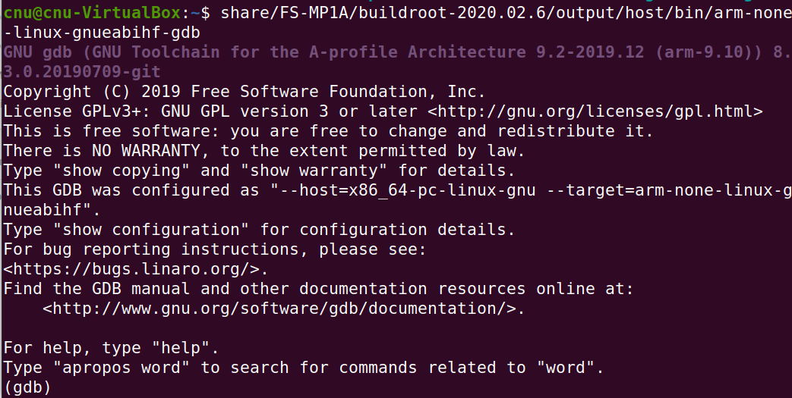
> 图：课件 Slide 28——交叉 gdb 运行验证：`GNU gdb ... 8.3.0.20190709-git`、`--host=x86_64-pc-linux-gnu --target=arm-none-linux-gnueabihf`，停在 `(gdb)` 提示符——能停在这就是好的，`q` 退出。

若起不来按提示补库（课件给的三件常见缺）：

```bash
sudo apt install libtinfo5 libncursesw5 libpython2.7
```

### 步骤 2：配置 Kits——四页走完（Slide 30~37）

打开 Qt Creator → Tools → Options → Kits：


> 图：课件 Slide 30——Tools 菜单高亮 Options...（Qt Creator 主界面，Projects 面板已有示例项目）。

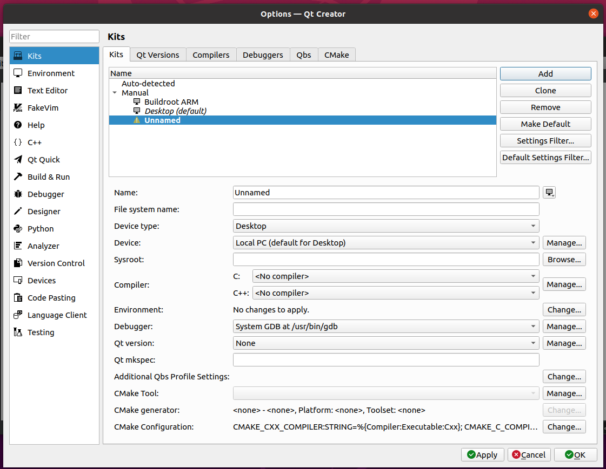
> 图：课件 Slide 31——Kits 页：Auto-detected 只有 Desktop (default)，点 Add 新建一个未命名 kit（黄色感叹号 = 未配完）。

Kits 页点 **Add**，按下面填（四项弹药分别在四个子页添加）：

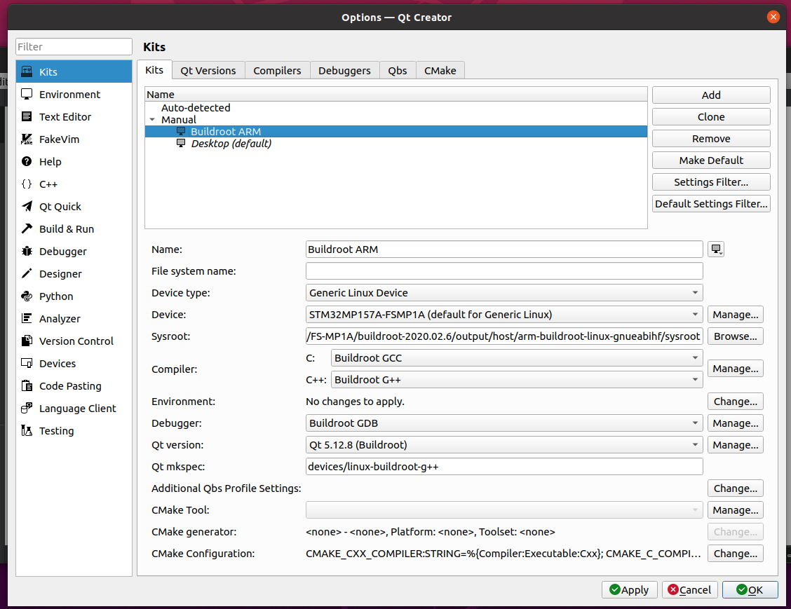
> 图：课件 Slide 34——配置完成的 Buildroot ARM kit：Device type: Generic Linux Device、Device: STM32MP157A-FSMP1A、Sysroot 指 buildroot 的 sysroot、编译器/调试器/Qt 版本/mkspec 各就位——我们以此图为准绳逐项核对。

| Kit 字段 | 填什么 |
|---|---|
| Name | Buildroot ARM |
| Device type | Generic Linux Device |
| Sysroot | `<buildroot源码>/output/host/arm-buildroot-linux-gnueabihf/sysroot/` |
| Compiler C / C++ | Buildroot GCC / Buildroot G++（下述 Compilers 页添加） |
| Debugger | Buildroot GDB（下述 Debuggers 页添加） |
| Qt version | Qt 5.12.8 (Buildroot)（下述 Qt Versions 页添加） |
| Qt mkspec | `devices/linux-buildroot-g++` |

**Compilers 页**（点 Compiler 行的 Manage 进入）：添加 GCC C 与 GCC C++ 两个编译器，路径分别是 `output/host/bin/arm-none-linux-gnueabihf-gcc` 与 `-g++`：

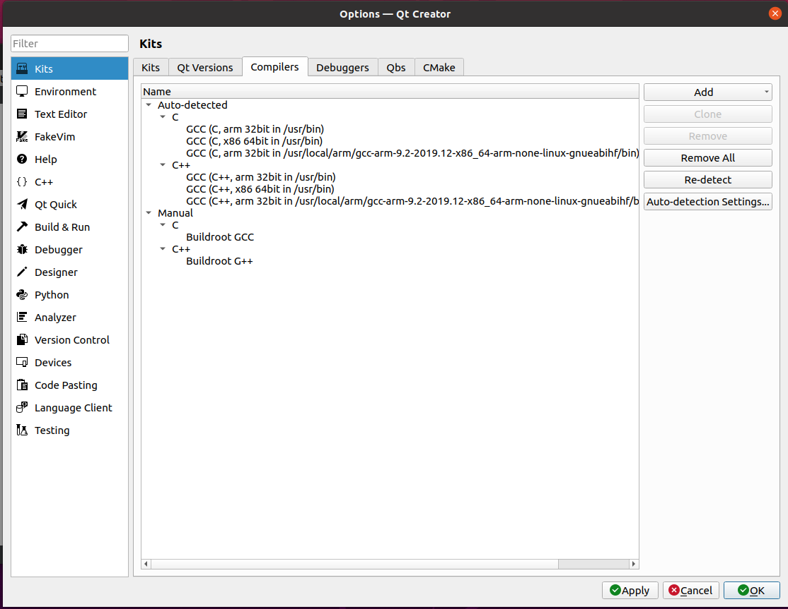
> 图：课件 Slide 35——Compilers 页：Manual 下新增 Buildroot GCC（C）与 Buildroot G++（C++）；Auto-detected 里也能看到我们实验十九装的 gcc-arm-9.2（同一套编译器，buildroot 又打包了一份给 sysroot 配套）。

**Debuggers 页**：添加 Buildroot GDB，路径 `output/host/bin/arm-none-linux-gnueabihf-gdb`：

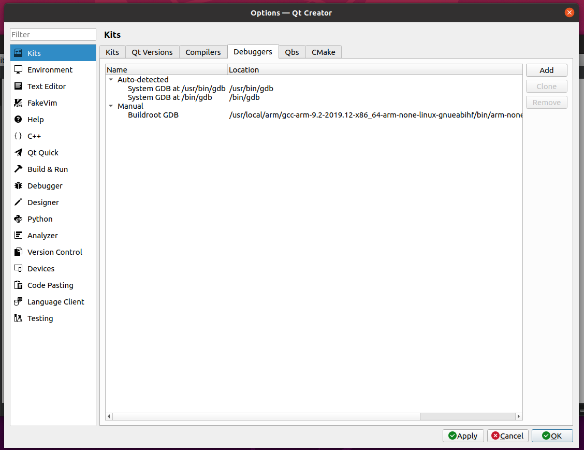
> 图：课件 Slide 36——Debuggers 页：Manual 下新增 Buildroot GDB（步骤 1 验证过的那个）。

**Qt Versions 页**：Add → 选 `output/host/bin/qmake` → 自动识别 Qt 5.12.8 → Version name 改为 `Qt %{Qt:Version} (Buildroot)`：

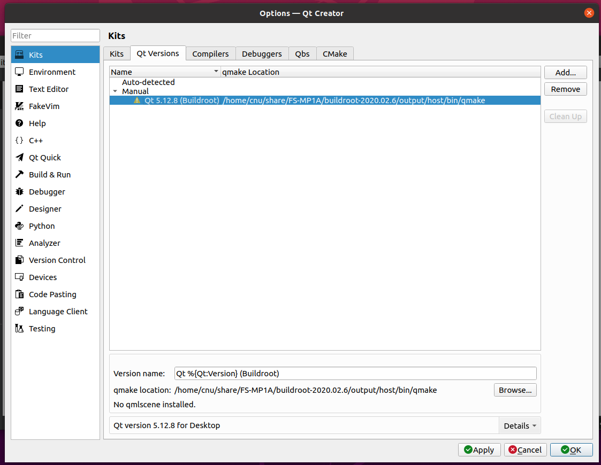
> 图：课件 Slide 37——Qt Versions 页：Manual 下 Qt 5.12.8 (Buildroot)，qmake 路径指 output/host/bin/qmake。

**Qt mkspec 填 `devices/linux-buildroot-g++`**——它是 buildroot 编 QT 时生成的配置目录（在 `output/build/qt5base-5.12.8/mkspecs/devices/linux-buildroot-g++`），qmake 构建应用时要读它。回 Kits 页选齐四项，感叹号消失。

### 步骤 3：登记开发板设备（Slide 38~43）

Tools → Options → Devices → Add：


> 图：课件 Slide 38——Devices 页：设备 STM32MP157A-FSMP1A（Generic Linux、Host name、SSH port 22、Username root）——配置完成的样貌。

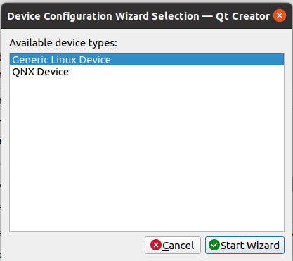
> 图：课件 Slide 39——向导第一步：设备类型选 Generic Linux Device，Start Wizard。


> 图：课件 Slide 40——Connection 页：名称 STM32MP157A-FSMP1A、**IP 填我们板的 192.168.0.8**（课件板是 .2）、用户名 root。


> 图：课件 Slide 41——Key Deployment 页：私钥留空跳过，直接用密码登录（root/123456）。

一路 Next 到 Finish；开发板已启动进系统的话，Authentica type 选 Default 点 **Test**：

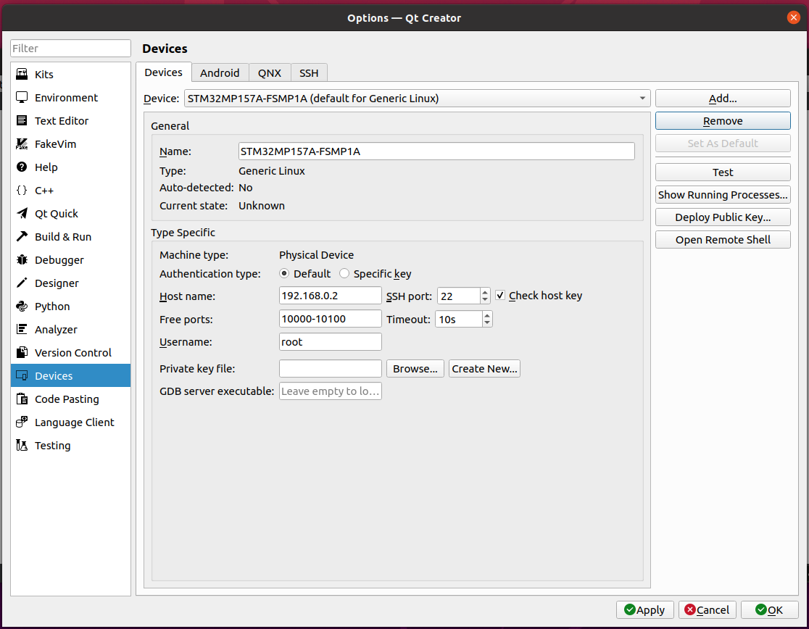
> 图：课件 Slide 42——Devices 页点 Test 测试登录（板没开就直接关掉测试，回头再测）。

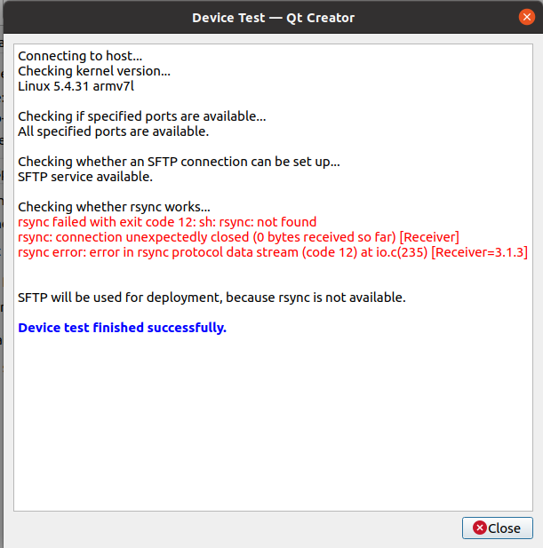
> 图：课件 Slide 43——Device Test 结果：Connecting to host / Checking kernel version（Linux 5.4.31 armv7l）/ ports available / SFTP service available——**rsync 报 not found 是正常的**（板上没装），Qt Creator 自动降级用 SFTP 部署，最后 "Device test finished successfully." 即成功。

### 步骤 4：导入项目（Slide 44~48）

项目就两个文件。`main.cpp`（课件 Slide 44 全文）：

```cpp
#include <QApplication>
#include <QPushButton>

int main(int argc, char* argv[])
{
    QApplication app(argc, argv);
    QPushButton hello("Hello world!");
    hello.resize(100,30);
    hello.show();
    return app.exec();
}
```

`qt-demo-qc.pro`（qmake 工程文件，按标准模板）：

```pro
QT += widgets
SOURCES += main.cpp
TARGET = qt-demo
```

（课件提示"内容如下"后给了 main.cpp；.pro 的 `QT += widgets` 对应实验三十六勾的 Widgets 库、`TARGET` 是产物名。）

File → Open File or Project 把两个文件打开，Kits 选 **Buildroot ARM**，Configure Project：


> 图：课件 Slide 45——Configure Project 页：kit 列表勾 Buildroot ARM（Desktop 灰色不可选——交叉项目上不了桌面 kit），点 Configure Project。

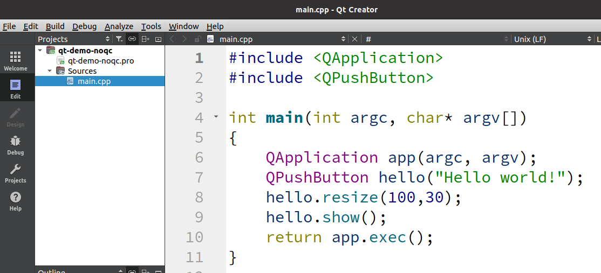
> 图：课件 Slide 46——项目导入完成，Build → Build All 即可编译。

编辑器若冒红波浪线"unknown type names"——**是假象**：代码模型不认识交叉 Qt 的头文件而已。Help → About Plugins 把 **ClangCodeModel 的 Load 勾掉**、重启 Qt Creator 即清净：


> 图：课件 Slide 47——main.cpp 顶部的警告条与 6/7 行的红色错误标记（code model could not parse an included file）。


> 图：课件 Slide 48——Help 菜单高亮 About Plugins...。

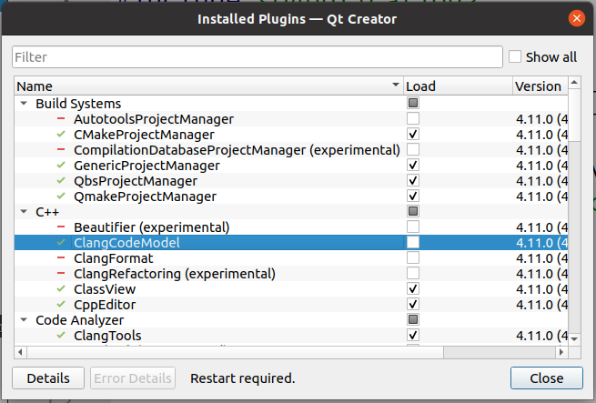
> 图：课件 Slide 48——插件列表：C++ 分组的 ClangCodeModel 取消 Load 勾选，底部提示 Restart required。

### 步骤 5：部署运行——屏上 Hello world（Slide 49~52）

先给运行加参数：Projects → Run 的 **Command line arguments 填 `-platform linuxfb`**（QT 默认走 eglfs，我们只编了 linuxfb 后端——不加必报错）：

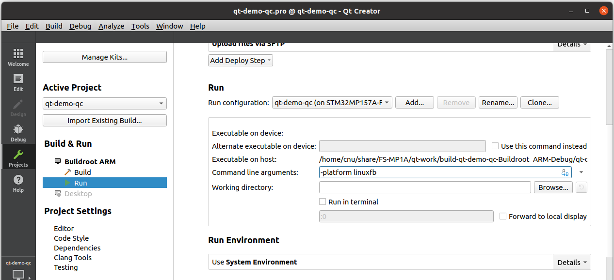
> 图：课件 Slide 50——Run 设置页：Command line arguments 填 -platform linuxfb；Deploy Steps 为 Upload files via SFTP（设备测试时选定的通道）。

点左下角**绿色三角**（运行按钮）——编译产物经 SFTP 部署到板上（.pro 里可指定目标目录，课件示例部署到 /opt）并运行：


> 图：课件 Slide 49——绿色三角"运行"按钮：一键完成"部署到板 + 运行"。

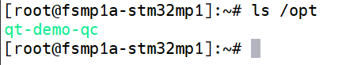
> 图：课件 Slide 49——板上 `ls /opt` 见部署来的程序（绿色可执行文件）。

**LCD 屏上亮出按钮**：

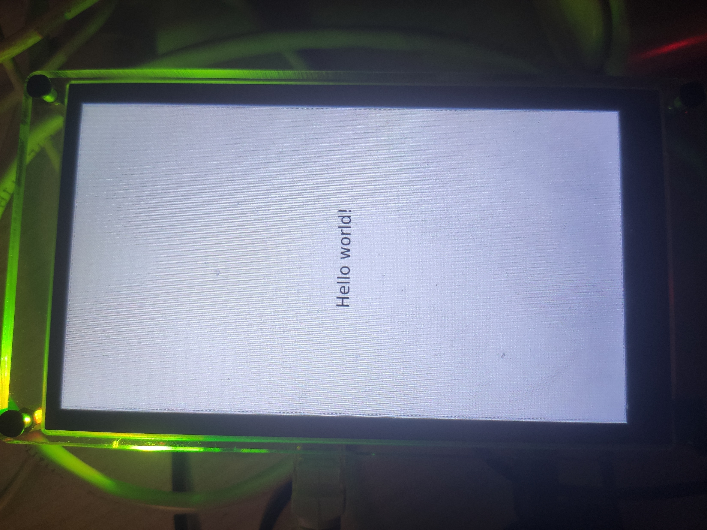
> 图：课件 Slide 51——开发板 LCD 实拍：屏上一个 QPushButton，文字 "Hello world!"。


> 图：课件 Slide 52——运行结果实拍（另一角度）。

命令行手动跑的等价写法：

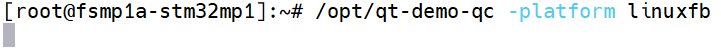
> 图：课件 Slide 52——板上终端 `/opt/qt-demo-qc -platform linuxfb` 手动运行——与绿色三角等效。

### 步骤 6：断点调试（Slide 53~55）

调试前两件事：**① Projects → Build 里取消 Shadow build**（产物要留在项目目录里，gdb 才找得到源码与符号）；**② .pro 加编译参数 `QMAKE_CXXFLAGS += -g -O0`**（-g 带调试信息——缺了进不了断点；-O0 不优化——缺了单步会跳行、变量被优化掉看不到）：


> 图：课件 Slide 53——Build Settings 页：Shadow build 复选框取消勾选；Build Steps 显示 qmake -spec devices/linux-buildroot-g++ 与 make。

main.cpp 里加两行试验代码（`int a = 42; a++;` 与两个 qDebug），在 `QApplication app(...)` 行点行号设断点，点**调试按钮**（绿色三角+甲虫）：


> 图：课件 Slide 55——"开始调试"按钮：三角与甲虫图标叠加。

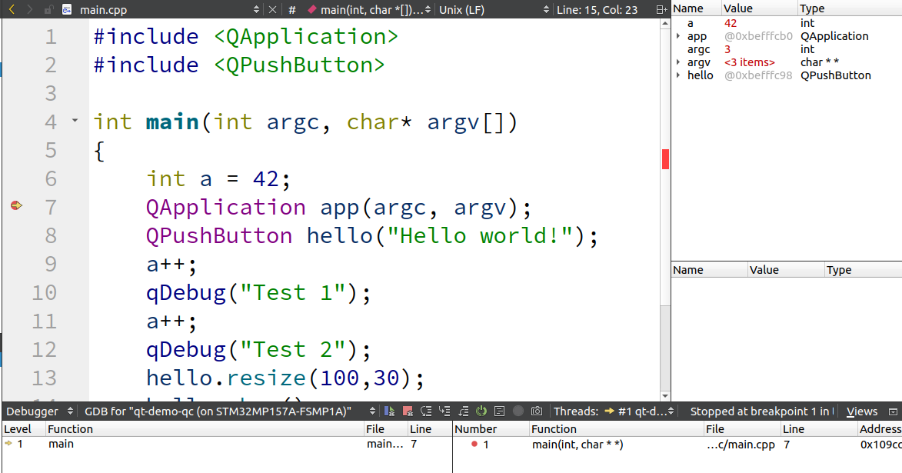
> 图：课件 Slide 55——调试现场：GDB for "qt-demo-qc (on STM32MP157A-FSMP1A)" 停在 main 第 7 行断点（Stopped at breakpoint 1），局部变量窗口显示 a=42、app、argc、argv、hello——**Ubuntu 上的 gdb 正在遥控板上的程序**，交叉调试全通。

**全系列到此收官**：从第 3 章点亮第一行 SPL 串口日志，到今天 Ubuntu 写一行代码、板子 LCD 上见一个按钮——bootloader、内核、设备树、根文件系统、驱动、GUI 应用，每一层都亲手搭过。

## 五、注意事项

1. **Kit 四项弹药全部指向 buildroot 的 output/host/**——别混用实验十九的裸编译器（qmake 与 sysroot 必须配套，混搭编出的程序在板上缺库）。
2. **mkspec 手填 `devices/linux-buildroot-g++`**——下拉列表里没有，手敲；填错 qmake 会用宿主规格编出 x86 程序。
3. **设备 IP 填我们板的 `.8`**；Test 报 rsync not found 是正常降级（SFTP 部署），不算失败。
4. **红色波浪线先怀疑 ClangCodeModel**——关插件重启，别按"报错"去改代码（代码本身没毛病）。
5. **`-platform linuxfb` 是运行参数不是编译参数**——Run 设置的 Command line arguments 里加；命令行手动跑时同样要带。
6. 调试不起断点：Shadow build 取消没、-g -O0 加了没、部署的是重编后的版本（改代码要重新 Build）。
7. 板子要一直在位（ssh/gdbserver 都走网络）；板重启后 gdbserver 由 init 脚本自动起，Qt Creator 重新点运行即可。

## 六、验证点一览

| 验证点 | 命令 | 通过的样子 | 在哪一步敲 |
|---|---|---|---|
| 交叉 gdb 可用 | `output/host/bin/arm-none-linux-gnueabihf-gdb` | 停在 `(gdb)` 提示符 | 步骤 1 |
| Kit 就绪 | Kits 页 Buildroot ARM 无感叹号 | 编译器/调试器/Qt 5.12.8/mkspec 齐且选中 | 步骤 2 |
| 设备连通 | Devices 页 Test | "Device test finished successfully."（rsync 降级属正常） | 步骤 3 |
| 项目编译 | Build → Build All | Compile output 无 error | 步骤 4 |
| 部署运行 | 绿色三角 | 板上 /opt（或 .pro 指定目录）出现程序，**LCD 亮出 "Hello world!" 按钮** | 步骤 5 |
| 断点生效 | 调试按钮 | Stopped at breakpoint；局部变量 a=42 可见 | 步骤 6 |

不达标时的排查：

| 现象 | 先查什么 |
|---|---|
| 编译报 qmake/mkspec 错误 | mkspec 手敲 `devices/linux-buildroot-g++`；qmake 路径指 output/host/bin |
| 运行报 `Unknown platform plugin` / 闪退 | `-platform linuxfb` 加了没（Run 参数与命令行两处都要） |
| 部署失败 | Devices 页 Test 重新跑；板上 sshd 活着吗；IP 是 .8 |
| 屏幕无显示 | `run fcsys` 起的出厂内核吗（自制内核无显示驱动）；calculator 那关（实验三十六）过了没 |
| 断点不停 | Shadow build 取消；.pro 的 -g -O0；改动后重新 Build |
| gdb 连不上板 | 板上 gdbserver 在吗（gdbserver copy 选项）；ssh 通不通 |

## 七、实验完成标志

- Qt Creator 安装完成，交叉 gdb 运行验证通过（步骤 1）
- Kits 配置完成：Buildroot ARM（Generic Linux Device + buildroot 的 GCC/G++/GDB/Qt 5.12.8 + mkspec `devices/linux-buildroot-g++`）无感叹号（步骤 2）
- 开发板已登记为设备（IP 192.168.0.8、root、密码登录），Device Test 成功（rsync 降级 SFTP 属正常）（步骤 3）
- Hello world 项目导入 Buildroot ARM kit，ClangCodeModel 假错误已关（步骤 4）
- **一键部署运行成功：板上 LCD 亮出 "Hello world!" 按钮；命令行 `-platform linuxfb` 手动运行等效**（步骤 5——全系列终极验收）
- 断点调试打通：调试器停在 main 断点、局部变量窗口正常（步骤 6）

## 八、全系列收官

回顾这一路：**第 3 章**点亮 U-Boot（F-1~F-6 六处修复 + trusted 版）；**第 4 章**用熟它（命令行、网络、eMMC、ext4、第一次点火 Linux）；**第 5 章**编出自己的内核与设备树并走进命令行；**第 6 章**busybox 与 buildroot 两套根文件系统 + NFS 不烧卡开发；**第 7~9 章**toychar、LED（寄存器直控/自动设备文件/设备树三版）把驱动开发走全；**第 10 章**QT5 运行与开发环境，屏幕上跑起自己的图形应用。四件自制部件 + 三版驱动 + 一屏 GUI——嵌入式 Linux 的主干路，你已全程亲手走完。资料包里还留着扩展练习（`graphics.tar.gz` 的 C++ 图形模块作业），愿它们成为你下一段旅程的路标。
